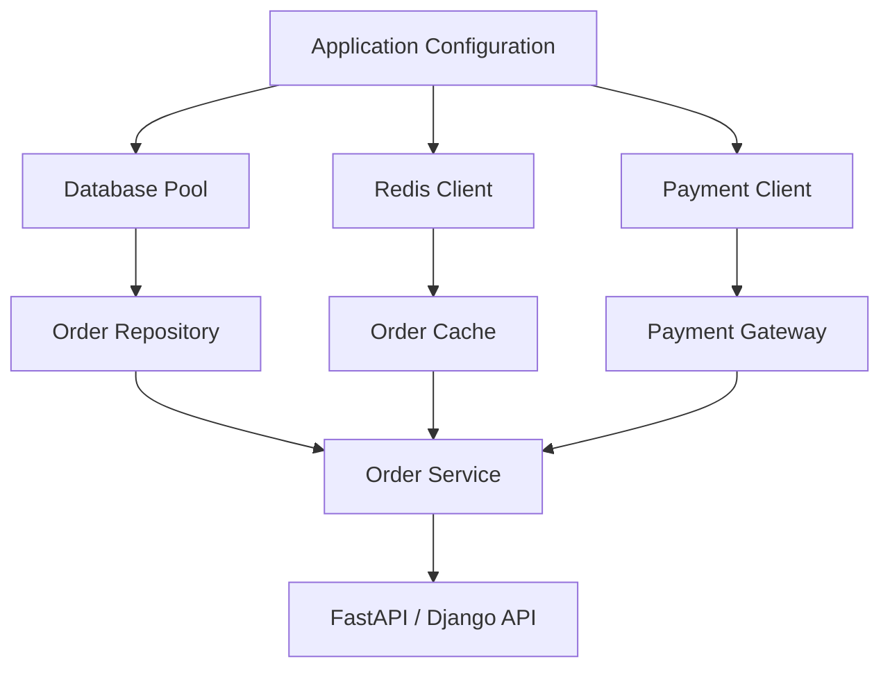
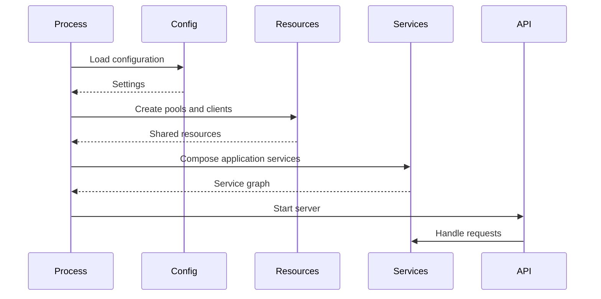

# 19- Dependency Injection

## Overview

Dependency Injection (DI) is a design technique in which an object receives the collaborators it needs instead of creating those collaborators internally.

Without dependency injection:

```python
class OrderService:
    def __init__(self) -> None:
        self.repository = PostgresOrderRepository()
        self.payment_gateway = StripePaymentGateway()
```

`OrderService` now controls both its business logic and the construction of infrastructure dependencies.

With dependency injection:

```python
class OrderService:
    def __init__(
        self,
        repository: OrderRepository,
        payment_gateway: PaymentGateway,
    ) -> None:
        self.repository = repository
        self.payment_gateway = payment_gateway
```

The composition layer decides which implementations to provide:

```python
service = OrderService(
    repository=PostgresOrderRepository(...),
    payment_gateway=StripePaymentGateway(...),
)
```

The architectural relationship becomes:

```text
                 Composition Root
                       |
              creates dependencies
                       |
                       v
                 OrderService
                  /        \
                 v          v
          Repository    PaymentGateway
              |               |
              v               v
         PostgreSQL        Stripe
```

DI is closely related to:

- Composition
- Abstraction
- Protocols
- Abstract Base Classes
- Dependency Inversion Principle
- Testability
- Configuration management
- Application architecture

DI is not synonymous with a dependency-injection framework. Python applications can use DI effectively with ordinary constructors and functions.

## Why Dependency Injection Matters

A class that creates its own dependencies is tightly coupled to their implementations.

```python
class ReportService:
    def __init__(self) -> None:
        self.storage = S3Storage()
        self.repository = PostgresReportRepository()
```

This creates several problems:

- Tests require real infrastructure or complicated patching.
- Configuration is embedded inside the class.
- Replacing S3 becomes difficult.
- Dependency lifecycle becomes unclear.
- Business logic becomes coupled to infrastructure.
- Different environments require conditional logic.

DI moves construction outside the object:

```python
class ReportService:
    def __init__(
        self,
        storage: ObjectStorage,
        repository: ReportRepository,
    ) -> None:
        self.storage = storage
        self.repository = repository
```

The class now focuses on its responsibility.

## What Is a Dependency?

A dependency is anything an object needs to perform its responsibility.

Examples include:

- Repositories
- Database sessions
- HTTP clients
- Payment gateways
- Cache clients
- Message publishers
- Configuration objects
- Clock implementations
- File systems
- Object storage
- Feature flag providers
- Logging abstractions

Not every object used by a class is necessarily an architectural dependency.

A useful question is:

> Does this collaborator represent behavior or infrastructure that should be independently replaceable, configured, or tested?

If yes, explicit injection may be valuable.

## Constructor Injection

Constructor injection is usually the preferred form of DI in Python.

```python
class UserService:
    def __init__(
        self,
        repository: UserRepository,
        email_sender: EmailSender,
    ) -> None:
        self.repository = repository
        self.email_sender = email_sender
```

The object cannot exist without its required dependencies.

This makes the dependency graph explicit:

```text
UserService
   |
   +--> UserRepository
   |
   +--> EmailSender
```

Constructor injection is particularly useful for mandatory dependencies.

## Method Injection

A dependency can also be provided to a specific method.

```python
class ReportService:
    async def generate(
        self,
        report_id: int,
        storage: ObjectStorage,
    ) -> str:
        ...
```

Method injection is useful when:

- The dependency is required only for one operation.
- Different calls intentionally use different implementations.
- The dependency is not part of the object's persistent state.

However, repeatedly passing the same dependency through many methods usually indicates that constructor injection would be clearer.

## Function Injection

DI does not require classes.

A function can receive its dependencies directly:

```python
def calculate_total(
    order: Order,
    tax_calculator: TaxCalculator,
) -> Decimal:
    ...
```

This is often the simplest form of dependency injection.

Do not introduce classes solely to make DI possible.

## Setter Injection

Dependencies can technically be assigned after construction:

```python
class ReportService:
    repository: ReportRepository | None = None
```

Then:

```python
service.repository = repository
```

This is generally weaker than constructor injection because the object can exist in an invalid state.

Prefer setter injection only when:

- The dependency is genuinely optional.
- Framework lifecycle requires delayed configuration.
- The dependency can legitimately change during the object's lifetime.

## Dependency Injection vs Dependency Inversion

These concepts are related but different.

**Dependency Injection** is a mechanism:

```text
Give an object its dependencies from outside.
```

**Dependency Inversion** is an architectural principle:

```text
High-level policy should not depend directly
on low-level implementation details.
```

For example:

```text
OrderService
      |
      v
PaymentGateway Protocol
      ^
      |
StripePaymentGateway
```

DI provides the concrete implementation.

The abstraction supports dependency inversion.

## DI and Protocols

Protocols are often an excellent boundary for injected dependencies.

```python
from typing import Protocol


class PaymentGateway(Protocol):
    async def charge(
        self,
        amount: int,
        currency: str,
    ) -> str:
        ...


class OrderService:
    def __init__(
        self,
        payment_gateway: PaymentGateway,
    ) -> None:
        self.payment_gateway = payment_gateway
```

The service depends on behavior rather than a concrete provider.

The implementation can be:

```python
class StripePaymentGateway:
    async def charge(
        self,
        amount: int,
        currency: str,
    ) -> str:
        ...
```

No inheritance is required.

## DI and Abstract Base Classes

ABCs can also define injected dependencies:

```python
class PaymentGateway(ABC):
    @abstractmethod
    async def charge(
        self,
        amount: int,
        currency: str,
    ) -> str:
        ...
```

Use an ABC when:

- A nominal hierarchy is meaningful.
- Shared implementation exists.
- Runtime abstractness is useful.
- Framework extension requires inheritance.

Use a protocol when structural typing provides a better boundary.

## Composition Root

The **composition root** is the place where application dependencies are assembled.

For a backend service:

```text
Application Startup
        |
        v
Configuration
        |
        v
Composition Root
   /      |       \
  v       v        v
DB      Cache    External Clients
  \       |        /
   \      |       /
    v     v      v
      Services
```

For example:

```python
def build_order_service(config: Settings) -> OrderService:
    repository = PostgresOrderRepository(
        database_url=config.database_url,
    )

    gateway = StripePaymentGateway(
        api_key=config.stripe_api_key,
    )

    return OrderService(
        repository=repository,
        payment_gateway=gateway,
    )
```

This keeps object construction outside business logic.

## Why the Composition Root Matters

Without a composition root, dependency creation tends to spread across the application:

```text
View
  -> creates service
      -> creates repository
          -> creates database client
```

With explicit composition:

```text
Startup
  -> creates database
  -> creates repository
  -> creates gateway
  -> creates service
  -> registers application
```

This improves:

- Configuration control
- Dependency lifecycle
- Testing
- Observability
- Deployment flexibility
- Startup validation

## Backend Dependency Graph

A realistic backend might use:



The composition root creates the infrastructure and injects it into the application layer.

## DI in FastAPI

FastAPI provides a dependency system that can be used as part of the application's composition strategy.

```python
from fastapi import Depends, FastAPI

app = FastAPI()


def get_order_service() -> OrderService:
    return OrderService(
        repository=PostgresOrderRepository(...),
        payment_gateway=StripePaymentGateway(...),
    )


@app.get("/orders/{order_id}")
async def get_order(
    order_id: int,
    service: OrderService = Depends(get_order_service),
):
    return await service.get_order(order_id)
```

FastAPI resolves the dependency before invoking the endpoint.

Conceptually:

```text
HTTP Request
     |
     v
FastAPI dependency resolution
     |
     v
OrderService
     |
     v
Endpoint
```

For larger applications, avoid constructing expensive clients repeatedly inside dependency functions. Use appropriate application or request lifetimes.

## FastAPI Dependency Lifetimes

A production application needs to distinguish between:

- Application-scoped dependencies
- Request-scoped dependencies
- Function-scoped dependencies
- Transient objects

Examples:

```text
Database connection pool
    -> application lifetime

Database session
    -> request lifetime

OrderService
    -> often request/transient lifetime

Pure value object
    -> transient
```

The correct lifecycle depends on thread safety, async safety, resource ownership, and framework behavior.

## DI in Django

Django does not impose a single dependency-injection architecture.

A service can still use constructor injection:

```python
class OrderService:
    def __init__(
        self,
        repository: OrderRepository,
        payment_gateway: PaymentGateway,
    ) -> None:
        self.repository = repository
        self.payment_gateway = payment_gateway
```

The Django view can compose it:

```python
def create_order_view(request):
    service = OrderService(
        repository=PostgresOrderRepository(...),
        payment_gateway=StripePaymentGateway(...),
    )

    ...
```

For larger systems, centralize composition rather than repeatedly constructing complex dependency graphs inside views.

## DI for Database Access

A common backend pattern is:

```text
Service
   |
   v
Repository
   |
   v
Database Session / Pool
```

The service can receive a repository:

```python
class UserService:
    def __init__(
        self,
        repository: UserRepository,
    ) -> None:
        self.repository = repository
```

The repository can receive a database dependency:

```python
class PostgresUserRepository:
    def __init__(
        self,
        pool: AsyncConnectionPool,
    ) -> None:
        self.pool = pool
```

This creates explicit dependency ownership:

```text
Application startup
      |
      v
Connection pool
      |
      v
Repository
      |
      v
Service
```

Avoid creating a new database connection for every service instance unless that is explicitly required.

## DI and Connection Pooling

A database pool is typically an application-level resource.

Bad:

```python
class UserRepository:
    def __init__(self):
        self.connection = create_new_connection()
```

If repositories are frequently instantiated, this can create excessive connections.

Better:

```python
pool = create_pool(...)

repository = PostgresUserRepository(
    pool=pool,
)
```

The pool has a controlled lifecycle.

This is especially important in Kubernetes, where:

```text
Pods × worker processes × connection pool size
```

determines potential database connection pressure.

## DI and Redis

Redis clients are commonly long-lived resources.

```python
redis_client = RedisClient(...)

cache = RedisCache(
    client=redis_client,
)

service = OrderService(
    cache=cache,
)
```

Avoid creating a new Redis connection for every request unless the client library explicitly manages this efficiently and the lifecycle is intentional.

The composition root should determine client lifecycle.

## DI and HTTP Clients

External HTTP clients should generally be configured centrally.

```python
http_client = HttpClient(
    timeout=5.0,
)

payment_gateway = PaymentGatewayClient(
    http_client=http_client,
)
```

This allows shared configuration for:

- Connection pooling
- Timeouts
- TLS
- Proxies
- Retry policy
- Connection limits
- Observability

Do not allow every service to independently create HTTP clients with inconsistent timeout and retry settings.

## DI and External API Adapters

A strong architecture separates the application contract from provider-specific code:

```text
Application Service
        |
        v
PaymentGateway Protocol
        |
        v
Stripe Adapter
        |
        v
HTTP Client
        |
        v
Stripe API
```

The service does not need to know:

```text
Stripe SDK
HTTP headers
Provider-specific response models
Provider exceptions
```

The adapter owns those details.

## DI and Caching

A cache can be injected:

```python
class UserService:
    def __init__(
        self,
        repository: UserRepository,
        cache: Cache,
    ) -> None:
        self.repository = repository
        self.cache = cache
```

Tests can use:

```python
class InMemoryCache:
    ...
```

Production can use:

```python
RedisCache
```

The service remains unchanged.

## DI and Message Publishing

Message infrastructure can also be injected:

```python
class EventPublisher(Protocol):
    async def publish(
        self,
        topic: str,
        payload: bytes,
    ) -> None:
        ...


class OrderService:
    def __init__(
        self,
        repository: OrderRepository,
        publisher: EventPublisher,
    ) -> None:
        self.repository = repository
        self.publisher = publisher
```

The concrete implementation may use Kafka.

```text
OrderService
     |
     v
EventPublisher
     |
     v
KafkaPublisher
     |
     v
Kafka
```

The abstraction does not need to expose Kafka-specific details.

## DI and Celery

Background workers can use the same dependency graph as HTTP applications.

```text
FastAPI/Django
      |
      v
Application Service
      ^
      |
Celery Task
```

The task can construct or retrieve the required service dependencies.

Avoid duplicating business logic inside Celery tasks and HTTP handlers.

Instead:

```python
@celery_app.task
def generate_report(report_id: int) -> None:
    service = build_report_service()
    service.generate(report_id)
```

The application service contains the business behavior.

## DI and Configuration

Configuration should generally be injected rather than read directly throughout the domain layer.

Prefer:

```python
class PaymentGateway:
    def __init__(
        self,
        api_key: str,
        timeout_seconds: float,
    ) -> None:
        self.api_key = api_key
        self.timeout_seconds = timeout_seconds
```

over:

```python
class PaymentGateway:
    def __init__(self) -> None:
        self.api_key = os.environ["PAYMENT_API_KEY"]
```

The latter couples the class directly to the process environment.

A configuration object can be constructed at startup:

```python
settings = Settings()

gateway = StripePaymentGateway(
    api_key=settings.stripe_api_key,
    timeout_seconds=settings.payment_timeout_seconds,
)
```

This makes configuration dependencies explicit and easier to test.

## DI and Secrets

Dependency injection does not replace secrets management.

A production application should retrieve secrets through an appropriate mechanism such as:

- AWS Secrets Manager
- AWS Systems Manager Parameter Store
- Kubernetes Secrets
- Environment variables populated by a secure deployment mechanism

The composition root can construct the dependency using the resolved secret.

Do not pass secrets through:

- Logs
- Error messages
- Metrics labels
- Trace attributes
- Test snapshots
- Source control

## DI and Environment-Specific Implementations

DI makes environment-specific composition straightforward.

```text
Environment
    |
    +---- Development -> FakePaymentGateway
    |
    +---- Testing     -> TestPaymentGateway
    |
    +---- Production  -> StripePaymentGateway
```

For example:

```python
def build_payment_gateway(settings: Settings) -> PaymentGateway:
    if settings.environment == "test":
        return FakePaymentGateway()

    return StripePaymentGateway(
        api_key=settings.stripe_api_key,
    )
```

Keep environment selection in the composition layer rather than inside the business service.

## DI and Testing

DI significantly improves unit testing.

Production:

```python
service = OrderService(
    repository=PostgresOrderRepository(...),
    payment_gateway=StripePaymentGateway(...),
)
```

Test:

```python
service = OrderService(
    repository=FakeOrderRepository(),
    payment_gateway=FakePaymentGateway(),
)
```

The business logic can run without:

- PostgreSQL
- Redis
- Kafka
- External APIs

This produces faster and more deterministic tests.

## DI and Fakes

A fake implementation can model useful behavior:

```python
class FakePaymentGateway:
    def __init__(self) -> None:
        self.payments: list[str] = []

    async def charge(
        self,
        amount: int,
        currency: str,
    ) -> str:
        payment_id = f"test-{len(self.payments) + 1}"
        self.payments.append(payment_id)
        return payment_id
```

This can be more useful than a mock when testing business workflows.

## DI and Mocks

Mocks are appropriate when interaction verification matters.

```python
gateway = AsyncMock(spec=PaymentGateway)

service = OrderService(
    repository=repository,
    payment_gateway=gateway,
)

await service.pay(order)

gateway.charge.assert_awaited_once()
```

Use mocks deliberately.

If most tests require large mock configurations, the design may have too many interactions or an unclear abstraction boundary.

## DI and Pure Functions

Not everything needs dependency injection.

Pure business logic is often better as a function:

```python
def calculate_total(
    subtotal: Decimal,
    tax_rate: Decimal,
) -> Decimal:
    return subtotal + (subtotal * tax_rate)
```

There is no need to inject:

```text
calculator
factory
service
interface
```

for simple deterministic logic.

DI is most valuable around stateful, external, configurable, or replaceable collaborators.

## DI and Time

Time is a common hidden dependency.

Avoid:

```python
from datetime import datetime, UTC


class TokenService:
    def is_expired(self, expires_at: datetime) -> bool:
        return expires_at <= datetime.now(UTC)
```

Inject a clock when deterministic time behavior is important:

```python
from datetime import datetime
from typing import Protocol


class Clock(Protocol):
    def now(self) -> datetime:
        ...


class TokenService:
    def __init__(self, clock: Clock) -> None:
        self.clock = clock

    def is_expired(self, expires_at: datetime) -> bool:
        return expires_at <= self.clock.now()
```

Tests can then provide a fixed clock.

## DI and Randomness

Randomness can also be a dependency when deterministic behavior matters.

For example:

```python
class RandomSource(Protocol):
    def token(self, length: int) -> str:
        ...
```

Production can use a cryptographically secure implementation.

Tests can use deterministic output.

This is especially useful for:

- Token generation
- Retry jitter
- Sampling
- Identifiers
- Simulations

Do not replace cryptographic randomness with deterministic test logic in production.

## DI and File Systems

File access can be abstracted when the application needs to operate across environments.

```python
class FileStore(Protocol):
    async def read(self, path: str) -> bytes:
        ...

    async def write(
        self,
        path: str,
        content: bytes,
    ) -> None:
        ...
```

Production:

```text
S3FileStore
```

Tests:

```text
InMemoryFileStore
```

This is useful when storage is an architectural boundary.

Do not abstract every call to `Path.read_text()` merely to satisfy a generic DI pattern.

## DI and Resource Ownership

One of the most important senior-level DI concerns is **ownership**.

If a dependency owns an external resource, someone must own its lifecycle.

For example:

```text
Application
   |
   +--> Database Pool
   |
   +--> Redis Client
   |
   +--> HTTP Client
```

The application startup/shutdown layer should generally own long-lived resources.

Injected services should usually use those resources rather than close them unexpectedly.

Bad:

```python
class UserService:
    async def close(self):
        await self.repository.pool.close()
```

when the pool belongs to the application.

The service should not close a resource it does not own.

## DI and Application Lifecycle

A production backend often follows:



Shutdown reverses resource ownership:

```text
Stop accepting requests
        |
        v
Finish/timeout in-flight work
        |
        v
Close application resources
        |
        v
Exit process
```

DI makes these lifecycles easier to reason about because construction and ownership are explicit.

## DI and Request Scope

Some dependencies should exist only for a request.

Examples:

- Database transaction/session
- Request context
- Correlation ID
- Authorization context

Conceptually:

```text
Request
  |
  +--> Request Context
  |
  +--> DB Session
  |
  +--> Service
  |
  v
Response
  |
  v
Dispose request-scoped resources
```

Do not accidentally share request-specific mutable state across requests.

## DI and Thread Safety

Dependency lifetime must match concurrency characteristics.

Suppose:

```python
client = SomeClient(...)
```

is injected as a singleton.

That is safe only if the client is safe for concurrent use.

Before sharing a dependency across:

- Threads
- Async tasks
- Worker processes

understand its concurrency guarantees.

DI controls who receives an object; it does not make the object thread-safe.

## DI and Asyncio

For async applications, avoid injecting blocking dependencies into the event loop.

For example:

```python
class UserRepository:
    def get(self, user_id: int):
        return blocking_database_call()
```

into an async FastAPI service can block the event loop.

Prefer:

```python
class UserRepository:
    async def get(self, user_id: int):
        ...
```

with an async-compatible database client.

Alternatively, explicitly isolate blocking work in a suitable executor or worker system.

## DI and Microservices

DI is primarily a local application concern.

A microservice might have:

```text
Order Service
   |
   +--> OrderRepository
   +--> PaymentClient
   +--> EventPublisher
   +--> Cache
```

These are local dependencies.

The actual distributed boundaries are:

```text
PaymentClient
    |
    +--> REST / gRPC
    |
    v
Payment Service

EventPublisher
    |
    v
Kafka
```

DI helps isolate these boundaries inside the service.

It does not replace service contracts or distributed-system design.

## DI and Reliability

Injected infrastructure should expose reliable semantics.

For an HTTP client, define:

```text
Timeout
Retry policy
Error translation
Circuit-breaking strategy
Idempotency
Connection pooling
```

Do not allow each service to independently invent these behaviors.

A dependency abstraction should make important reliability semantics explicit.

## DI and Retry Semantics

Retrying should happen at the correct layer.

For example:

```text
HTTP Client
    -> transport-level timeout/retry where safe

Application Service
    -> business retry policy where appropriate

Queue
    -> message redelivery
```

Do not automatically add retries to every injected dependency.

Retries can amplify failures and duplicate side effects.

## DI and Transactions

Transaction ownership must be explicit.

A common architecture is:

```text
Request
   |
   v
Application Service
   |
   v
Unit of Work
   |
   +--> Repository
   +--> Repository
   |
   v
Commit
```

The repository should not unexpectedly commit every operation if the service expects multiple operations to participate in one transaction.

DI makes transaction boundaries explicit when the unit of work is injected.

## DI and Observability

Observability dependencies can also be injected when appropriate:

```python
class OrderService:
    def __init__(
        self,
        repository: OrderRepository,
        logger: Logger,
        metrics: Metrics,
    ) -> None:
        ...
```

However, not every low-level function needs an injected logger or metrics object.

Use application-level instrumentation and framework-supported observability where possible.

Avoid creating excessive dependency parameters solely for telemetry.

## DI and Security

DI can improve security by centralizing security-sensitive dependencies.

For example:

```text
Application
    |
    v
Credential Provider
    |
    v
Authenticated Client
```

This reduces the risk of each component independently handling credentials.

However, injected dependencies must still be trusted and configured securely.

Never allow untrusted configuration to select arbitrary Python classes for dynamic import or execution.

## DI and Configuration-Based Class Selection

A dangerous pattern is:

```python
class_path = settings.implementation
module, name = class_path.rsplit(".", 1)
```

and dynamically importing arbitrary classes from untrusted input.

Prefer an explicit registry:

```python
IMPLEMENTATIONS = {
    "stripe": StripePaymentGateway,
    "fake": FakePaymentGateway,
}
```

Then:

```python
gateway_class = IMPLEMENTATIONS[settings.payment_provider]
```

This provides controlled configuration.

## DI and Docker

Docker does not change the DI model.

A container typically starts the application:

```text
Container
   |
   v
Application Startup
   |
   v
Configuration
   |
   v
Composition Root
```

Environment variables can select configuration:

```text
DATABASE_URL
REDIS_URL
PAYMENT_PROVIDER
PAYMENT_API_KEY
```

The application converts configuration into concrete dependencies.

Keep dependency construction deterministic and observable during startup.

## DI and Kubernetes

Kubernetes commonly runs multiple replicas:

```text
Deployment
   |
   +---- Pod
   |      |
   |      +--> Application process
   |
   +---- Pod
   |      |
   |      +--> Application process
   |
   +---- Pod
          |
          +--> Application process
```

Each process has its own dependency graph.

A singleton in Python means:

```text
singleton per process
```

not:

```text
singleton across the Kubernetes cluster
```

This is critical for:

- Caches
- Locks
- Connection pools
- Rate limiting
- In-memory state
- Background workers

Distributed coordination belongs in systems such as PostgreSQL, Redis, Kafka, or other appropriate infrastructure.

## DI and High Availability

DI can make failover implementations easier to compose.

For example:

```text
PaymentGateway
      |
      +---- PrimaryGateway
      |
      +---- FailoverGateway
```

But high availability requires actual distributed-system mechanisms.

The injected abstraction may need to define:

- Timeout behavior
- Retryability
- Failover policy
- Idempotency
- Error classification

Do not assume that dependency substitution alone provides availability.

## DI and Performance

DI itself usually has negligible impact compared with database, network, and serialization costs.

The main performance concerns come from poor dependency lifecycle management.

Bad:

```text
Every request
    -> create DB pool
    -> create Redis client
    -> create HTTP client
```

Better:

```text
Application startup
    -> create DB pool
    -> create Redis client
    -> create HTTP client

Requests
    -> reuse appropriate resources
```

Avoid creating expensive resources unnecessarily.

## DI and Memory

Long-lived injected objects consume memory for the lifetime of their owning scope.

A process-scoped dependency might hold:

- Connection pools
- HTTP connection pools
- Caches
- Buffers
- SDK state

Therefore, dependency scope should be chosen deliberately.

A singleton is not automatically better.

Use the smallest safe lifetime that provides the required efficiency and semantics.

## DI and Testing Scope

Dependency injection supports multiple testing levels:

| Test Type | Typical Dependencies |
|---|---|
| Unit | Fakes, simple stubs, mocks |
| Integration | Real database/cache where appropriate |
| API | Application graph with controlled infrastructure |
| Contract | Multiple real/fake implementations |
| End-to-end | Production-like infrastructure |
| Performance | Production-like clients and pools |

Do not replace every real dependency with mocks. Integration tests are still necessary for database transactions, serialization, networking, and infrastructure behavior.

## DI and Test Isolation

Injected dependencies should not accidentally share mutable state between tests.

Bad:

```python
GLOBAL_FAKE_REPOSITORY = FakeRepository()
```

if tests mutate it.

Prefer creating isolated instances:

```python
def build_test_service() -> OrderService:
    return OrderService(
        repository=FakeOrderRepository(),
        payment_gateway=FakePaymentGateway(),
    )
```

This keeps test state local.

## Dependency Injection Frameworks

Python has dependency-injection libraries, but a framework is not required.

For many applications:

```python
service = OrderService(
    repository=repository,
    gateway=gateway,
)
```

is sufficient.

A DI container becomes useful when the dependency graph is:

- Large
- Highly configurable
- Scope-sensitive
- Repeated across many entry points
- Difficult to construct manually

Before introducing a container, evaluate whether it actually reduces complexity.

## Manual DI vs DI Container

| Concern | Manual DI | DI Container |
|---|---|---|
| Simplicity | Excellent | Lower |
| Explicit dependencies | Excellent | Can become implicit |
| Small applications | Excellent | Often unnecessary |
| Large graphs | More manual wiring | Easier composition |
| Debugging | Straightforward | Can be harder |
| Lifecycle management | Manual | Often supported |
| Runtime magic | Minimal | Potentially significant |
| Testing | Excellent | Depends on framework |
| Learning curve | Low | Higher |

A senior engineer should be comfortable implementing DI manually before introducing a container.

## Service Locator Anti-Pattern

A service locator hides dependencies.

Example:

```python
class OrderService:
    def process(self, order_id: int):
        repository = container.get("repository")
        gateway = container.get("gateway")
        ...
```

The constructor no longer communicates what the service needs.

This makes dependency relationships implicit.

Prefer:

```python
class OrderService:
    def __init__(
        self,
        repository: OrderRepository,
        gateway: PaymentGateway,
    ) -> None:
        ...
```

The service locator pattern can be useful in specific framework internals, but it is generally undesirable as the primary application dependency mechanism.

## Hidden Dependencies

A dependency can be hidden through:

- Global variables
- Singleton modules
- Environment reads
- Static methods
- Service locators
- Direct SDK construction
- Database connections created inside methods

For example:

```python
class OrderService:
    async def get_order(self, order_id: int):
        client = redis.Redis.from_url(os.environ["REDIS_URL"])
        ...
```

The constructor does not reveal that Redis is required.

Explicit injection is clearer:

```python
class OrderService:
    def __init__(self, cache: Cache) -> None:
        self.cache = cache
```

## Too Many Dependencies

DI can expose poor design.

If a constructor contains:

```python
class OrderService:
    def __init__(
        self,
        repository,
        cache,
        payment_gateway,
        email_sender,
        sms_sender,
        metrics,
        logger,
        feature_flags,
        audit_logger,
        search_client,
        object_storage,
    ):
        ...
```

the problem is not that DI is cumbersome.

The class likely has too many responsibilities.

Consider splitting:

```text
OrderService
PaymentService
NotificationService
SearchService
AuditService
```

DI can therefore act as a useful design diagnostic.

## DI and Single Responsibility

A well-designed class usually has a focused dependency set.

For example:

```python
class PaymentService:
    def __init__(
        self,
        gateway: PaymentGateway,
        repository: PaymentRepository,
    ) -> None:
        ...
```

This is easier to reason about than a service responsible for payments, emails, search, reporting, and auditing.

DI should support good boundaries rather than conceal poor ones.

## DI and Circular Dependencies

Dependency injection does not eliminate circular dependencies.

Bad:

```text
OrderService
    |
    v
PaymentService
    |
    v
OrderService
```

This often indicates an architectural problem.

Possible solutions include:

- Extracting shared behavior.
- Introducing an application coordinator.
- Publishing domain events.
- Reversing dependency direction.
- Splitting responsibilities.

Avoid solving architectural cycles by injecting a service locator or lazy global lookup.

## DI and Event-Driven Architecture

Event-driven systems can reduce direct dependencies.

Instead of:

```text
OrderService
   |
   v
NotificationService
```

the architecture may use:

```text
OrderService
   |
   v
EventPublisher
   |
   v
Kafka
   |
   v
NotificationConsumer
   |
   v
NotificationService
```

DI can still inject:

```python
EventPublisher
```

into the order service.

This creates a local dependency on the publisher rather than a synchronous dependency on the notification service.

## DI and AWS

AWS SDK clients can be injected into adapters rather than directly into business services.

For example:

```python
class S3ObjectStorage:
    def __init__(self, client) -> None:
        self.client = client
```

Then:

```python
s3_client = create_s3_client()

storage = S3ObjectStorage(
    client=s3_client,
)
```

The application depends on:

```python
ObjectStorage
```

rather than directly on the AWS SDK.

This keeps provider-specific details at the infrastructure boundary.

## DI and Cost

Dependency lifecycle can affect infrastructure cost.

Creating excessive clients or pools can increase:

- Database connections
- Network connections
- CPU usage
- Memory usage
- External API connection overhead

In Kubernetes:

```text
10 pods × 4 workers × 10 DB connections
= 400 potential connections
```

This can overwhelm PostgreSQL even though each process appears correctly configured in isolation.

DI makes resource construction centralized, but capacity planning still requires system-level reasoning.

## Common Mistakes

### Creating Dependencies Inside Business Classes

```python
class OrderService:
    def __init__(self):
        self.repository = PostgresOrderRepository()
```

This creates tight coupling.

### Injecting Everything

Not every helper needs an interface or injected dependency.

Pure functions should remain simple.

### Using a Global Container

A global service locator hides dependencies and makes tests harder to reason about.

### Injecting Configuration Everywhere

Pass only the configuration a component actually needs.

Prefer:

```python
StripePaymentGateway(api_key, timeout)
```

over:

```python
StripePaymentGateway(settings)
```

when the gateway only needs two settings.

### Ignoring Lifecycle

A shared connection pool must be owned and closed at the correct application lifecycle boundary.

### Sharing Unsafe Objects

An injected singleton must be safe for the concurrency model in which it is used.

### Overusing Mocks

Mocks can produce tests that pass while real integrations fail.

### Huge Constructors

A large constructor often indicates excessive class responsibility.

### Abstracting Too Early

DI does not require an interface for every dependency.

### Confusing DI with Dependency Inversion

Injecting a concrete implementation is still DI.

Dependency inversion is about architectural dependency direction.

## Production Pitfalls

| Pitfall | Impact | Better Approach |
|---|---|---|
| New DB pool per request | Connection exhaustion | Reuse application-scoped pools |
| New HTTP client per request | Lost pooling, higher overhead | Reuse clients appropriately |
| Global mutable singleton | Cross-request state bugs | Define explicit scope |
| Hidden environment reads | Hard-to-test configuration | Inject configuration |
| Service locator | Hidden dependencies | Constructor injection |
| Huge dependency graph | High complexity | Split responsibilities |
| Shared unsafe client | Race conditions | Verify concurrency guarantees |
| Closing borrowed resources | Resource failures | Define ownership explicitly |
| Mock-only tests | Integration bugs | Add integration/contract tests |
| Runtime dynamic imports | Security risk | Use explicit implementation registry |
| Retry everywhere | Load amplification | Define retry ownership and idempotency |
| Singleton assumption across pods | Incorrect distributed state | Use shared infrastructure |

## Senior-Level DI Heuristics

Use constructor injection by default.

Prefer:

```python
class OrderService:
    def __init__(
        self,
        repository: OrderRepository,
        gateway: PaymentGateway,
    ) -> None:
        ...
```

over:

```python
class OrderService:
    def __init__(self) -> None:
        ...
```

when those collaborators represent meaningful architectural dependencies.

Use protocols when structural typing provides a useful boundary.

Use ABCs when shared implementation or nominal inheritance is important.

Use concrete dependencies when abstraction provides no meaningful value.

Keep dependency construction in the composition root.

Keep lifecycle ownership explicit.

Match dependency scope to:

- Resource cost
- Concurrency model
- Statefulness
- Request boundaries
- Application lifecycle

## Dependency Scope Decision

| Dependency | Typical Scope | Reason |
|---|---|---|
| Configuration | Application | Immutable startup configuration |
| DB connection pool | Application | Expensive shared resource |
| Redis client | Application | Connection pooling/resource reuse |
| HTTP client | Application | Connection reuse |
| DB session | Request | Transaction/request isolation |
| Request context | Request | Request-specific state |
| Stateless service | Transient/request | Usually cheap |
| Pure value object | Transient | Local state |
| Cache data | External/shared | Process-independent state when required |

These are defaults, not universal rules. Library-specific concurrency and lifecycle guarantees must be considered.

## Dependency Graph Validation

A production application should fail fast when required dependencies cannot be constructed.

Startup should validate:

```text
Configuration
    |
    v
Database connectivity
    |
    v
External client configuration
    |
    v
Dependency graph
    |
    v
Application ready
```

Do not wait until the first user request to discover:

```text
missing API key
invalid database URL
unsupported provider
broken dependency configuration
```

Startup validation improves reliability and operational diagnosis.

## DI and Graceful Shutdown

If the composition root owns resources, it should also coordinate shutdown.

Typical lifecycle:

```text
Startup
  |
  +--> Create DB pool
  +--> Create Redis client
  +--> Create HTTP client
  +--> Compose services
  |
  v
Serve requests
  |
  v
Shutdown signal
  |
  +--> Stop accepting new work
  +--> Drain active requests
  +--> Stop workers
  +--> Close HTTP clients
  +--> Close Redis
  +--> Close DB pool
```

This is particularly important for Kubernetes deployments where termination signals and readiness/liveness behavior affect traffic draining.

## DI and Observability of the Dependency Graph

A large system benefits from knowing:

- Which implementation was selected?
- Which provider is active?
- Which dependency failed during startup?
- Which resource owns shutdown?
- Which configuration controls implementation selection?

Log safe metadata such as:

```text
payment_provider=stripe
database_pool_size=10
environment=production
```

Do not log:

```text
API keys
passwords
tokens
connection strings containing credentials
```

## DI Decision Framework

Before introducing dependency injection, ask:

1. Does the object depend on external, stateful, configurable, or replaceable behavior?
2. Should that dependency be replaceable in tests?
3. Is the dependency lifecycle important?
4. Does the dependency belong to the object's responsibility?
5. Would constructor injection make the dependency graph clearer?
6. Is a protocol or ABC actually useful?
7. Could a concrete dependency be simpler?
8. Where should the dependency be constructed?
9. Who owns its lifecycle?
10. Is the dependency safe for its intended concurrency scope?
11. Does the abstraction preserve important failure and consistency semantics?
12. Is the dependency graph becoming too large?
13. Is a DI container actually necessary?
14. Could composition solve the problem without introducing framework magic?

## Production Checklist

Before deploying a DI-based Python backend:

- Dependencies are explicit.
- Mandatory dependencies use constructor injection.
- Dependency construction is centralized.
- A clear composition root exists.
- Protocols or ABCs are used only where they provide architectural value.
- Concrete dependencies remain acceptable where abstraction is unnecessary.
- Resource ownership is explicit.
- Application-scoped resources have controlled lifecycles.
- Request-scoped state is not accidentally shared.
- Connection pools are sized for total process/pod capacity.
- HTTP clients use appropriate connection pooling and timeouts.
- Async code does not inject blocking operations into the event loop.
- Retry and idempotency semantics are defined.
- Transaction ownership is explicit.
- Configuration is injected rather than scattered through the domain layer.
- Secrets are not logged or embedded in source code.
- Dynamic implementation selection uses an explicit allowlist.
- Unit tests can substitute dependencies without real infrastructure.
- Integration and contract tests validate real behavior.
- Dependency graphs are validated during startup.
- Graceful shutdown closes owned resources correctly.
- Observability identifies dependency failures without exposing secrets.
- The dependency graph remains understandable to engineers.

## Key Takeaways

- Dependency Injection means supplying an object's collaborators from outside rather than constructing them internally; constructor injection is the preferred default for required dependencies.
- DI works especially well with composition, protocols, ABCs, dependency inversion, and backend boundaries such as repositories, caches, HTTP clients, payment gateways, and message publishers.
- A composition root should own dependency construction and make resource lifetimes explicit; database pools, Redis clients, and HTTP clients generally require deliberate application-level lifecycle management.
- DI improves testability, but it does not eliminate the need for integration, contract, concurrency, reliability, or security testing.
- Good DI reduces coupling without hiding the architecture; excessive interfaces, service locators, huge constructors, global state, and unnecessary containers are signs that the dependency design needs simplification.