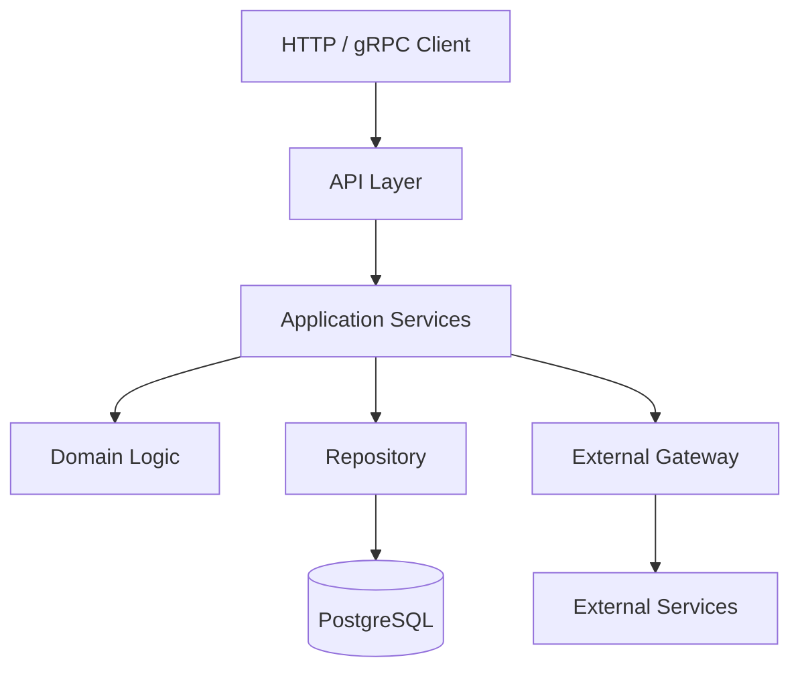
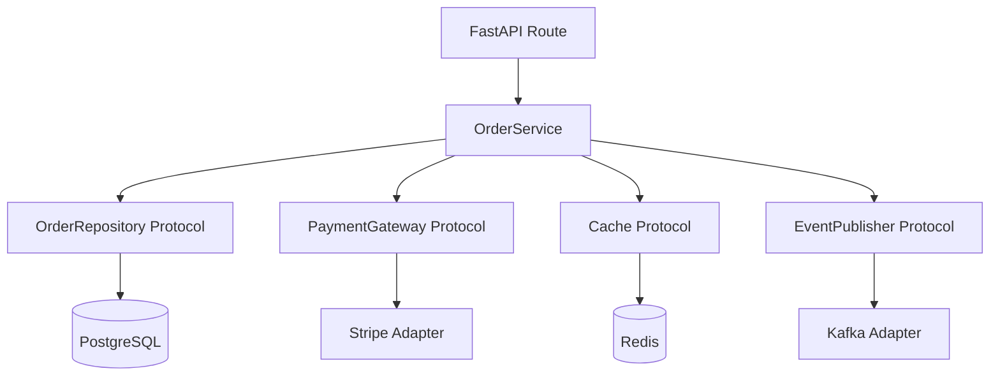

# 20- OOP Design Principles

## Overview

Object-oriented design principles provide a set of engineering heuristics for structuring classes, dependencies, responsibilities, and abstractions so that software remains understandable and adaptable as it grows.

Python does not require strict object-oriented design. Functions, modules, composition, protocols, dataclasses, and classes can all coexist. The objective is therefore not to maximize the number of classes, interfaces, or inheritance relationships.

The objective is to design boundaries that:

- Keep responsibilities focused.
- Minimize unnecessary coupling.
- Make behavior easy to test.
- Allow implementation details to change safely.
- Make dependencies explicit.
- Preserve clear domain and infrastructure boundaries.
- Remain maintainable as traffic, teams, and requirements grow.

The most commonly discussed principles are the **SOLID principles**:

```text
S -> Single Responsibility Principle
O -> Open/Closed Principle
L -> Liskov Substitution Principle
I -> Interface Segregation Principle
D -> Dependency Inversion Principle
```

They should be treated as design heuristics rather than absolute laws.

A production Python service may also benefit from:

- High cohesion
- Low coupling
- Composition over inheritance
- Encapsulation
- Explicit dependencies
- Law of Demeter
- Tell, Don't Ask
- Separation of concerns
- Favoring simplicity over speculative abstraction

## Why Design Principles Matter

A system can work correctly while still being difficult to maintain.

For example:

```python
class OrderService:
    def create_order(self, request):
        # Validate HTTP request.
        # Query PostgreSQL.
        # Calculate pricing.
        # Call Stripe.
        # Write audit logs.
        # Publish Kafka event.
        # Send email.
        # Format HTTP response.
        ...
```

The method may work, but it contains too many responsibilities.

A better architecture separates concerns:

```text
HTTP Layer
    |
    v
Application Service
    |
    +--> Pricing
    +--> Repository
    +--> Payment Gateway
    +--> Event Publisher
    +--> Notification
```

This separation improves the ability to:

- Test individual components.
- Replace infrastructure.
- Change business rules.
- Scale teams.
- Diagnose failures.
- Reason about ownership.
- Deploy components independently where appropriate.

Design principles therefore become increasingly important as system complexity grows.

## Cohesion and Coupling

Before SOLID, understand two fundamental properties.

### Cohesion

Cohesion measures how closely related the responsibilities inside a component are.

High cohesion:

```text
PaymentService
    |
    +--> authorize payment
    +--> capture payment
    +--> refund payment
```

Low cohesion:

```text
OrderService
    |
    +--> orders
    +--> emails
    +--> image resizing
    +--> database migrations
    +--> user authentication
```

Prefer high cohesion.

### Coupling

Coupling measures how strongly components depend on each other.

High coupling:

```text
OrderService
    |
    +--> Stripe SDK
    +--> Redis client
    +--> PostgreSQL driver
    +--> Kafka client
```

Lower coupling:

```text
OrderService
    |
    +--> PaymentGateway
    +--> Cache
    +--> Repository
    +--> EventPublisher
```

The second design isolates infrastructure details.

## SOLID at a Glance

| Principle | Core Question | Primary Goal |
|---|---|---|
| Single Responsibility | Does this component have one cohesive responsibility? | High cohesion |
| Open/Closed | Can behavior be extended without repeatedly modifying stable code? | Controlled change |
| Liskov Substitution | Can implementations safely replace their abstraction? | Behavioral correctness |
| Interface Segregation | Do consumers depend only on behavior they need? | Low coupling |
| Dependency Inversion | Does high-level policy avoid depending directly on low-level details? | Dependency direction |

SOLID principles are interconnected.

For example:

```text
Small responsibilities
       |
       v
Small interfaces
       |
       v
Replaceable implementations
       |
       v
Explicit dependency injection
       |
       v
Loosely coupled architecture
```

## Single Responsibility Principle

The Single Responsibility Principle (SRP) states that a component should have a focused responsibility and a coherent reason for change.

A common oversimplification is:

> A class should have exactly one method.

That is incorrect.

A class can contain many methods while still having one cohesive responsibility.

For example:

```python
class Payment:
    def authorize(self) -> None:
        ...

    def capture(self) -> None:
        ...

    def refund(self) -> None:
        ...
```

These methods belong to the same payment responsibility.

## SRP Violation

Consider:

```python
class UserService:
    def create_user(self, data):
        ...

    def send_welcome_email(self, user):
        ...

    def generate_avatar(self, user):
        ...

    def export_users_to_csv(self):
        ...
```

The class has multiple unrelated reasons to change:

```text
User business rules
Email provider changes
Image processing changes
Reporting requirements
```

A better decomposition might be:

```text
UserService
EmailSender
AvatarService
UserExporter
```

## SRP Does Not Mean One Class Per Method

Over-applying SRP produces unnecessary fragmentation:

```text
UserValidator
UserNormalizer
UserRepository
UserCreator
UserUpdater
UserReader
UserServiceFactory
```

when the application has only a few simple operations.

The result can be more difficult to understand than the original design.

SRP should create meaningful boundaries, not class proliferation.

## SRP and Backend Architecture

A production backend commonly separates:

```text
Transport
    |
    v
Application
    |
    v
Domain
    |
    v
Infrastructure
```

For example:

```text
FastAPI endpoint
    |
    v
OrderService
    |
    +--> OrderRepository
    +--> PaymentGateway
    +--> EventPublisher
```

Each layer has a distinct responsibility.

## Open/Closed Principle

The Open/Closed Principle (OCP) states that software entities should be open for extension while being closed for modification.

The practical interpretation is:

> Stable business logic should not require repeated modification whenever a new variation is introduced.

Consider:

```python
def calculate_discount(customer_type: str, amount: Decimal) -> Decimal:
    if customer_type == "standard":
        ...
    elif customer_type == "premium":
        ...
    elif customer_type == "enterprise":
        ...
```

Adding every new customer type requires modifying the function.

A strategy-based design can isolate variation:

```python
from typing import Protocol


class DiscountPolicy(Protocol):
    def calculate(self, amount: Decimal) -> Decimal:
        ...


class StandardDiscount:
    def calculate(self, amount: Decimal) -> Decimal:
        return Decimal("0")


class PremiumDiscount:
    def calculate(self, amount: Decimal) -> Decimal:
        return amount * Decimal("0.10")
```

The service depends on:

```python
class PricingService:
    def __init__(self, policy: DiscountPolicy) -> None:
        self.policy = policy
```

New policies can be added without changing the service.

## OCP Does Not Mean Never Modify Existing Code

The principle does not prohibit modification.

If the business rule itself changes:

```text
Premium discount: 10% -> 15%
```

modifying the implementation is expected.

OCP is about isolating **variation**, not eliminating all code changes.

## OCP and Strategy Pattern

The Strategy pattern is a common Python implementation of OCP.

```python
class PaymentFeeStrategy(Protocol):
    def calculate(self, amount: Decimal) -> Decimal:
        ...


class DomesticFee:
    def calculate(self, amount: Decimal) -> Decimal:
        return amount * Decimal("0.02")


class InternationalFee:
    def calculate(self, amount: Decimal) -> Decimal:
        return amount * Decimal("0.04")
```

The caller does not need conditional provider logic.

```text
PaymentService
      |
      v
PaymentFeeStrategy
   /          \
  v            v
Domestic    International
```

## OCP and Plugin Architecture

OCP becomes particularly useful when applications have explicit extension points.

Examples include:

- Payment providers
- Authentication providers
- Storage backends
- Serialization formats
- Notification channels
- Export formats

For example:

```text
ObjectStorage
    |
    +--> S3
    +--> Local filesystem
    +--> Test storage
```

The application contract remains stable while implementations vary.

## Liskov Substitution Principle

The Liskov Substitution Principle (LSP) states that a subtype must be usable wherever its base abstraction is expected without violating the consumer's assumptions.

Consider:

```python
class Bird:
    def fly(self) -> None:
        ...


class Penguin(Bird):
    def fly(self) -> None:
        raise NotImplementedError
```

The inheritance relationship is technically possible but behaviorally incorrect.

Code expecting:

```python
def make_bird_fly(bird: Bird) -> None:
    bird.fly()
```

cannot safely accept `Penguin`.

The abstraction was wrong.

## LSP Is About Behavior

LSP is not simply:

```text
method exists
```

It is:

```text
contract remains valid
```

The contract includes:

- Preconditions
- Postconditions
- Exceptions
- Return semantics
- Side effects
- State transitions
- Performance assumptions where relevant

## LSP and Backend Repositories

Suppose:

```python
class UserRepository(Protocol):
    async def get(self, user_id: int) -> User | None:
        ...
```

One implementation returns:

```text
None when user does not exist
```

while another implementation raises:

```text
KeyError
```

The second implementation may violate the behavioral contract even though the method signature matches.

The abstraction must define expected behavior.

## LSP and Payment Providers

Consider:

```python
class PaymentGateway(Protocol):
    async def charge(
        self,
        amount: int,
        currency: str,
    ) -> str:
        ...
```

Suppose one provider:

- Supports idempotency.

Another:

- Silently duplicates charges.

They are structurally compatible but not behaviorally substitutable.

The protocol must define important guarantees:

```text
Idempotency
Error semantics
Timeout behavior
Currency support
Side effects
```

LSP therefore connects directly to production reliability.

## Interface Segregation Principle

The Interface Segregation Principle (ISP) states that consumers should not be forced to depend on methods they do not use.

Poor design:

```python
class Storage(Protocol):
    async def read(self, key: str) -> bytes:
        ...

    async def write(self, key: str, value: bytes) -> None:
        ...

    async def delete(self, key: str) -> None:
        ...

    async def watch(self, key: str) -> None:
        ...

    async def begin_transaction(self):
        ...
```

A read-only consumer should not need to know about all of these operations.

Prefer focused protocols:

```python
class Reader(Protocol):
    async def read(self, key: str) -> bytes:
        ...


class Writer(Protocol):
    async def write(self, key: str, value: bytes) -> None:
        ...
```

## ISP and Python Protocols

Protocols make ISP particularly natural.

A service can depend on:

```python
Reader
```

instead of:

```python
Storage
```

This reduces:

- Coupling
- Mock complexity
- Implementation burden
- Accidental dependencies

## ISP and Backend Services

Consider a large AWS client wrapper:

```python
class AWSClient:
    def upload_to_s3(...):
        ...

    def publish_to_sns(...):
        ...

    def send_to_sqs(...):
        ...

    def query_dynamodb(...):
        ...
```

A service that only uploads objects should depend on:

```python
class ObjectStorage(Protocol):
    async def put(...):
        ...
```

rather than the entire AWS wrapper.

## Dependency Inversion Principle

The Dependency Inversion Principle (DIP) states that high-level policy should not depend directly on low-level implementation details. Both should depend on abstractions where an abstraction provides meaningful value.

Poor:

```text
OrderService
    |
    v
Stripe SDK
```

Better:

```text
OrderService
    |
    v
PaymentGateway
    ^
    |
Stripe Adapter
```

The application policy depends on the behavior it needs.

## DIP and Dependency Injection

Dependency inversion and dependency injection are related but not identical.

DIP:

```text
Architectural dependency direction
```

DI:

```text
Mechanism for supplying dependencies
```

For example:

```python
class OrderService:
    def __init__(
        self,
        gateway: PaymentGateway,
    ) -> None:
        self.gateway = gateway
```

The constructor provides DI.

The choice to depend on:

```python
PaymentGateway
```

rather than:

```python
StripePaymentGateway
```

supports dependency inversion.

## Composition Over Inheritance

Composition means assembling behavior from independent objects.

```python
class OrderService:
    def __init__(
        self,
        repository: OrderRepository,
        payment_gateway: PaymentGateway,
        publisher: EventPublisher,
    ) -> None:
        self.repository = repository
        self.payment_gateway = payment_gateway
        self.publisher = publisher
```

The service is composed from collaborators.

This is often preferable to:

```text
BaseOrderService
      |
      v
PaymentOrderService
      |
      v
KafkaOrderService
      |
      v
ProductionOrderService
```

Deep inheritance hierarchies become difficult to reason about.

## When Inheritance Is Appropriate

Inheritance is appropriate when there is a genuine substitutable relationship.

Good examples include:

- Framework extension points
- Exception hierarchies
- Template Method patterns
- Domain subtype relationships with stable behavioral contracts

For example:

```python
class AuthenticationError(Exception):
    ...


class InvalidCredentials(AuthenticationError):
    ...


class AccountLocked(AuthenticationError):
    ...
```

Composition is generally better for independent collaborators.

## Encapsulation

Encapsulation keeps implementation details behind a stable interface.

For example:

```python
class Account:
    def __init__(self, balance: Decimal) -> None:
        self._balance = balance

    def withdraw(self, amount: Decimal) -> None:
        if amount <= 0:
            raise ValueError("amount must be positive")

        if amount > self._balance:
            raise ValueError("insufficient funds")

        self._balance -= amount
```

Consumers use:

```python
account.withdraw(amount)
```

rather than modifying:

```python
account._balance
```

directly.

Encapsulation protects invariants.

## Encapsulation vs Access Control

Python does not provide Java-style `private` fields.

Instead:

```text
_name
    -> conventionally internal

__name
    -> name mangling

@property / methods
    -> controlled behavior
```

The important engineering goal is not hiding data at all costs.

It is controlling how state changes.

## Tell, Don't Ask

Tell, Don't Ask encourages objects to perform operations rather than exposing all state and forcing callers to implement the object's business rules.

Poor:

```python
if order.status == "pending":
    order.status = "paid"
```

Better:

```python
order.mark_paid()
```

The object owns the state transition.

This centralizes invariants and business behavior.

## Tell, Don't Ask in Backend Systems

Consider:

```python
if payment.status == "authorized":
    payment.status = "captured"
```

Better:

```python
payment.capture()
```

The domain object can enforce:

```text
authorized -> captured
```

and reject invalid transitions.

This becomes increasingly valuable when state machines become complex.

## Law of Demeter

The Law of Demeter encourages components to communicate with close collaborators rather than navigating long object chains.

Poor:

```python
order.customer.account.billing_profile.address.country.code
```

This creates strong coupling to the internal object graph.

Prefer an explicit operation:

```python
order.billing_country_code()
```

or a service operation appropriate to the domain.

The principle is not an absolute ban on attribute access. It is a warning against excessive knowledge of internal structure.

## Separation of Concerns

A backend application commonly separates:

```text
Transport
Business Logic
Persistence
Infrastructure
Observability
Configuration
```

For example:



Each boundary should have a clear reason to exist.

## Domain Logic vs Infrastructure

Business rules should not be tightly coupled to infrastructure.

Poor:

```python
class Order:
    def save_to_postgres(self):
        ...
```

Better:

```python
class Order:
    def calculate_total(self):
        ...
```

and:

```python
class OrderRepository:
    async def save(self, order: Order):
        ...
```

The domain object does not need to know how PostgreSQL persistence works.

## Dependency Direction

A useful layered model is:

```text
                Application / Domain
                         |
                         v
                  Abstractions
                    ^       ^
                    |       |
             Infrastructure
```

The important rule is that business policy should not be forced to depend directly on infrastructure implementation details.

This can be implemented with:

- Protocols
- ABCs
- Dependency injection
- Adapters
- Composition

## Stable Abstractions

An abstraction should represent behavior that is stable enough to justify the boundary.

Good:

```python
class PaymentGateway(Protocol):
    async def charge(...):
        ...
```

Poor:

```python
class GenericProvider(Protocol):
    async def execute(**kwargs):
        ...
```

The first describes application behavior.

The second hides implementation details without defining useful semantics.

## Avoid Lowest-Common-Denominator Abstractions

Suppose provider A supports:

```text
authorize
capture
refund
3DS
partial capture
```

while provider B supports only:

```text
charge
refund
```

A simplistic abstraction:

```python
class PaymentProvider(Protocol):
    async def charge(...):
        ...
```

may hide important capabilities.

Possible solutions include:

- Capability-specific protocols.
- Provider-specific application features.
- Separate abstractions.
- Explicit capability discovery.

Do not force fundamentally different systems into an artificial common interface.

## Dependency Inversion with Ports and Adapters

A ports-and-adapters architecture maps naturally to Python protocols.

```text
                Application Core
                       |
              +--------+--------+
              |                 |
          Port: DB         Port: Payments
              ^                 ^
              |                 |
       PostgreSQL Adapter   Stripe Adapter
```

The protocol represents the port.

The concrete class represents an adapter.

This keeps infrastructure outside the core business logic.

## OOP Principles and FastAPI

A typical FastAPI architecture can be:

```text
HTTP Route
    |
    v
Application Service
    |
    +--> Repository Protocol
    +--> Payment Protocol
    +--> Event Publisher Protocol
             |
             v
       Infrastructure
```

The route should primarily handle:

- HTTP input
- Validation
- Authentication context
- Response mapping

The application service handles business orchestration.

Infrastructure adapters handle external systems.

## OOP Principles and Django

Django's framework conventions often combine:

- Models
- QuerySets
- Views
- Forms
- Services
- Management commands
- Signals

Avoid forcing every Django component into elaborate OOP abstractions.

Use design principles where they solve actual problems.

For example:

```text
View
  |
  v
Application Service
  |
  +--> Repository/Query layer
  +--> External gateway
```

can be useful for complex business workflows.

For simple CRUD, Django's built-in abstractions may be sufficient.

## OOP Principles and Microservices

Microservices increase the importance of clear boundaries.

Within a service:

```text
API
 |
 v
Application
 |
 v
Domain
 |
 v
Infrastructure
```

Between services:

```text
Service A
    |
    +--> REST / gRPC
    |
    +--> Kafka
    |
    v
Service B
```

Do not confuse local OOP abstractions with distributed system boundaries.

A Python protocol does not provide:

- Network reliability
- Versioning
- Serialization
- Authentication
- Retries
- Idempotency

Those must be designed separately.

## OOP Principles and Database Boundaries

Repositories should not automatically become abstractions for every database query.

Use a repository boundary when it provides meaningful separation.

For example:

```python
class OrderRepository(Protocol):
    async def get(self, order_id: int) -> Order | None:
        ...

    async def save(self, order: Order) -> None:
        ...
```

This can be useful when the application needs to remain independent of persistence details.

But if a project is essentially CRUD and Django ORM or SQLAlchemy already provides the required abstraction, adding another repository layer may increase complexity without meaningful benefit.

## OOP Principles and Caching

A cache abstraction can isolate Redis:

```python
class Cache(Protocol):
    async def get(self, key: str) -> bytes | None:
        ...

    async def set(
        self,
        key: str,
        value: bytes,
        ttl_seconds: int,
    ) -> None:
        ...
```

The application depends on cache behavior.

The Redis adapter owns:

- Serialization
- Connection handling
- Redis commands
- Timeouts
- Metrics
- Error translation

The abstraction should still document important semantics such as TTL and consistency.

## OOP Principles and Kafka

An event publisher can be represented as:

```python
class EventPublisher(Protocol):
    async def publish(
        self,
        topic: str,
        payload: bytes,
    ) -> None:
        ...
```

The application should not need to know about:

```text
KafkaProducer
Partitions
Brokers
Producer configuration
```

unless those details are intentionally part of the boundary.

Reliability requirements such as delivery guarantees and idempotency remain architectural concerns.

## OOP Principles and Concurrency

Good OOP design must account for concurrency.

A class with mutable state may behave correctly in single-threaded tests but fail under concurrent execution.

For example:

```python
class Counter:
    def __init__(self) -> None:
        self.value = 0

    async def increment(self) -> None:
        self.value += 1
```

If operations become more complex and involve suspension points, synchronization may be required.

Design questions include:

- Is the object shared?
- Across tasks?
- Across threads?
- Across processes?
- Is mutation atomic?
- Who owns the lock?
- Can the object be safely reused?

DI scope and object lifecycle become important here.

## OOP Principles and Immutability

Immutable objects can simplify reasoning.

For example:

```python
from dataclasses import dataclass


@dataclass(frozen=True)
class Money:
    amount: Decimal
    currency: str
```

Immutable value objects reduce accidental state mutation and are easier to share safely.

They are especially useful for:

- Configuration
- Value objects
- Request data
- Domain identifiers
- Messages

Immutability is not mandatory, but it can reduce concurrency and reasoning complexity.

## OOP Principles and Performance

Good design does not automatically mean maximum performance.

Every abstraction can introduce some overhead:

```text
additional objects
additional calls
wrappers
adapters
indirection
```

Usually, backend performance is dominated by:

- Database queries
- Network calls
- Serialization
- External APIs
- Disk I/O

Therefore, do not remove useful abstractions prematurely.

Measure first.

For CPU-heavy code, excessive object allocation and dynamic dispatch can matter more.

Use:

```text
Profiling
Benchmarking
Complexity analysis
Memory measurement
```

before optimizing architecture based on assumptions.

## OOP Principles and Memory

Object-oriented designs can create many Python objects.

Potential costs include:

- Object headers
- Instance dictionaries
- References
- Wrapper objects
- Dependency graphs

For large collections of small objects, consider:

- Dataclasses
- `slots=True`
- Immutable value objects
- More compact data structures

Do not use `__slots__` or other optimizations without measuring the actual workload.

## OOP Principles and Security

Design principles can improve security by isolating sensitive operations.

For example:

```text
Application Service
      |
      v
Credential-aware adapter
      |
      v
External provider
```

Business logic does not need direct access to raw credentials.

Encapsulation can also protect security-sensitive state.

However, OOP principles do not replace:

- Authentication
- Authorization
- Input validation
- Encryption
- Secrets management
- Network security
- Audit logging

## OOP Principles and Reliability

Reliability improves when responsibilities and failure boundaries are explicit.

For example:

```text
PaymentService
    |
    v
PaymentGateway
    |
    +--> timeout
    +--> retry
    +--> error translation
    +--> idempotency
```

The application service should not need to understand provider-specific exceptions.

Clear abstractions make failure handling easier to centralize.

## OOP Principles and Observability

Abstractions should preserve useful operational context.

For example:

```text
payment_provider=stripe
operation=charge
duration_ms=120
result=success
```

Avoid abstracting away information required for diagnosis.

A good abstraction hides implementation details while preserving operationally important signals.

## OOP Principles and Scalability

Good object-oriented design supports scaling primarily through better separation of responsibilities.

For example:

```text
API
 |
 +--> Application Services
        |
        +--> PostgreSQL
        +--> Redis
        +--> Kafka
        +--> External APIs
```

This does not automatically make the system horizontally scalable.

Scalability still requires:

- Stateless application processes
- Proper database scaling
- Connection pool management
- Caching
- Queue-based workload distribution
- Partitioning
- Backpressure
- Capacity planning

OOP principles support the architecture but do not replace distributed-system design.

## High Availability Considerations

A replaceable dependency can make failover strategies easier to implement.

For example:

```text
PaymentGateway
      |
      +---- Primary Provider
      |
      +---- Secondary Provider
```

But failover requires:

- Timeouts
- Health checks
- Retry policy
- Idempotency
- Failure classification
- Circuit breaking where appropriate
- Operational visibility

Do not interpret "dependency inversion" as "high availability."

## Disaster Recovery Considerations

OOP design should keep disaster-recovery mechanisms outside business entities.

For example:

```text
Order
    -> business state

OrderRepository
    -> persistence

Backup / replication
    -> infrastructure
```

The domain model should not implement:

```text
database backup
replication
cross-region failover
```

These are infrastructure responsibilities.

## Common Beginner Mistakes

### Applying SOLID Mechanically

Not every class needs:

```text
interface
abstract class
factory
builder
repository
service
adapter
```

Use principles to solve complexity, not to create ceremony.

### One Class Per Responsibility

SRP does not mean every tiny operation requires a separate class.

### Interface Everywhere

Python's duck typing and protocols often eliminate the need for traditional interfaces.

### Inheritance for Reuse

Reuse alone does not justify inheritance.

Prefer composition when there is no substitutable subtype relationship.

### Overusing Abstract Base Classes

An ABC can introduce coupling where a protocol or concrete dependency would be simpler.

### Treating Dependency Injection as a Framework Feature

Constructor injection is often sufficient.

### Hiding Business Logic in Infrastructure

Repositories should not silently become domain services.

### Giant Service Classes

A class containing every application operation usually violates cohesion.

### Excessive Getter/Setter Methods

Python properties and domain methods often provide clearer semantics.

### Ignoring Behavioral Contracts

Matching method signatures does not guarantee substitutability.

## Production Pitfalls

| Pitfall | Result | Better Approach |
|---|---|---|
| Giant service class | Low cohesion | Split responsibilities |
| Deep inheritance | Fragile hierarchy | Prefer composition |
| Huge protocol | High coupling | Use focused protocols |
| Generic interfaces | Weak contracts | Model domain behavior |
| Premature abstraction | Unnecessary complexity | Wait for real variation |
| Provider leakage | Infrastructure coupling | Use adapters |
| Hidden dependencies | Difficult testing | Constructor injection |
| Shared mutable state | Concurrency bugs | Control ownership/scope |
| Over-mocking | False confidence | Add integration tests |
| No behavioral contract | Broken substitution | Document/test semantics |
| Excessive indirection | Hard debugging | Keep abstractions purposeful |
| SOLID dogmatism | Over-engineering | Optimize for maintainability |

## Production Design Heuristics

Use the following heuristics when designing Python backend components:

### Prefer Composition

```python
class OrderService:
    def __init__(
        self,
        repository: OrderRepository,
        gateway: PaymentGateway,
    ) -> None:
        self.repository = repository
        self.gateway = gateway
```

over deep inheritance.

### Depend on Behavior

Use protocols when the consumer needs a behavioral contract:

```python
class Cache(Protocol):
    async def get(self, key: str) -> bytes | None:
        ...
```

### Keep Responsibilities Cohesive

A service should have a focused business purpose.

### Make Dependencies Explicit

Constructor parameters are easier to understand than hidden globals.

### Protect Invariants

Use methods to control important state transitions.

### Keep Infrastructure at the Boundary

External SDKs should generally remain behind adapters.

### Design for Substitution

If multiple implementations exist, define the behavioral contract carefully.

### Avoid Speculative Abstraction

Do not design for ten future implementations when the system has one concrete implementation today.

## A Practical Backend Example

Consider an order-processing service.

Poor architecture:

```text
FastAPI route
    |
    v
OrderService
    |
    +--> Stripe SDK
    +--> Redis
    +--> PostgreSQL
    +--> Kafka
    +--> Email SDK
```

Improved architecture:



The service coordinates business behavior while infrastructure implementations remain replaceable.

Example:

```python
class OrderService:
    def __init__(
        self,
        repository: OrderRepository,
        payment_gateway: PaymentGateway,
        cache: Cache,
        publisher: EventPublisher,
    ) -> None:
        self.repository = repository
        self.payment_gateway = payment_gateway
        self.cache = cache
        self.publisher = publisher

    async def create_order(self, order: Order) -> Order:
        payment_id = await self.payment_gateway.charge(
            amount=order.total_minor_units,
            currency=order.currency,
            idempotency_key=order.idempotency_key,
        )

        order.mark_paid(payment_id)

        await self.repository.save(order)

        await self.publisher.publish(
            topic="orders.created",
            payload=order.to_event(),
        )

        return order
```

The design principles are visible:

```text
SRP
 -> OrderService coordinates order workflow.

DIP
 -> Service depends on abstractions.

ISP
 -> Dependencies expose focused contracts.

LSP
 -> Implementations must preserve behavioral semantics.

OCP
 -> Payment implementations can vary.

Composition
 -> Service is assembled from collaborators.
```

## Testing the Design

A well-structured design makes tests easier.

```python
class FakePaymentGateway:
    async def charge(
        self,
        amount: int,
        currency: str,
        idempotency_key: str,
    ) -> str:
        return "test-payment"
```

Then:

```python
service = OrderService(
    repository=FakeOrderRepository(),
    payment_gateway=FakePaymentGateway(),
    cache=FakeCache(),
    publisher=FakePublisher(),
)
```

The business workflow can be tested without:

```text
PostgreSQL
Redis
Kafka
Stripe
```

Integration tests should still validate real infrastructure behavior.

## Contract Testing

For polymorphic dependencies, test the contract itself.

For example:

```text
PaymentGateway
    |
    +--> StripeGateway
    +--> FakeGateway
    +--> SecondaryGateway
```

Each implementation should satisfy:

```text
Valid charge
Invalid amount
Provider failure
Timeout behavior
Idempotency
Currency handling
Error translation
```

Static typing catches structural mismatches.

Contract tests catch behavioral mismatches.

Both are useful.

## Design Principles and CI/CD

Design quality can be reinforced through automated checks:

```text
Pull Request
    |
    +--> Unit Tests
    +--> Integration Tests
    +--> Contract Tests
    +--> Type Checking
    +--> Linting
    +--> Security Scanning
    |
    v
Build
    |
    v
Deploy
```

Useful checks include:

- `pytest`
- `mypy`
- `pyright`
- Ruff or equivalent linting
- Dependency vulnerability scanning
- Static analysis

The exact tooling should match the repository's standards.

## Design Principles and Team Scalability

Good architecture also reduces organizational coupling.

A clear boundary allows different engineers or teams to work independently:

```text
Payments Team
     |
     v
PaymentGateway

Orders Team
     |
     v
OrderService

Platform Team
     |
     v
Infrastructure Adapters
```

The interfaces become coordination points.

However, excessive abstractions can have the opposite effect by forcing many teams to coordinate around unstable interfaces.

Stable boundaries matter more than the number of boundaries.

## Design Principles and Operational Cost

Every abstraction has a maintenance cost.

Consider:

```text
Concrete implementation
```

versus:

```text
Protocol
Adapter
Factory
DI container
Configuration registry
Multiple implementations
```

The second design may be justified for a major infrastructure boundary.

It may be unnecessary for a simple helper.

Senior engineers should consider:

```text
Complexity introduced
        vs
Complexity removed
```

rather than treating abstraction as inherently beneficial.

## Senior-Level Principle: Optimize for Change

The deepest purpose of OOP design principles is to make change safer.

Ask:

```text
What is likely to change?
```

Examples:

```text
Payment provider
    -> isolate behind gateway

Database implementation
    -> isolate behind repository when valuable

Business pricing rules
    -> strategy/policy

Notification channels
    -> focused sender abstraction

Request transport
    -> separate API layer
```

Do not abstract what is stable merely because it can be abstracted.

## Senior-Level Principle: Optimize for Boundaries

Good design is often more about boundaries than classes.

Important boundaries include:

```text
HTTP <-> Application
Application <-> Domain
Domain <-> Infrastructure
Service <-> Service
Application <-> Database
Application <-> External Provider
```

For each boundary ask:

- Who owns the behavior?
- Who owns the dependency?
- What contract crosses the boundary?
- What can change independently?
- What failures can occur?
- What must be observable?
- What must remain stable?

## Senior-Level Principle: Prefer Explicitness

Python allows highly dynamic designs.

That flexibility can be useful but can also hide architecture.

Prefer:

```python
class OrderService:
    def __init__(
        self,
        repository: OrderRepository,
        payment_gateway: PaymentGateway,
    ) -> None:
        ...
```

over:

```python
class OrderService:
    def process(self):
        repository = container.resolve("repository")
        gateway = container.resolve("payment_gateway")
        ...
```

Explicit dependencies improve:

- Code review
- Testing
- IDE support
- Static analysis
- Debugging
- Architectural understanding

## Senior-Level Principle: Simplicity Beats Purity

A good design can violate a principle deliberately.

For example, a small internal application might use:

```python
class ReportService:
    def __init__(self, repository: ReportRepository):
        self.repository = repository
```

without introducing:

```text
Protocol
ABC
Factory
DI container
Adapter hierarchy
```

That can be the correct engineering decision.

Principles are tools for reasoning.

They are not compliance requirements.

## OOP Design Review Checklist

When reviewing an OOP design, ask:

### Responsibility

- Does each component have a cohesive purpose?
- Does a class have multiple unrelated reasons to change?
- Can responsibilities be separated without creating excessive fragmentation?

### Coupling

- Does business logic depend directly on infrastructure?
- Are dependencies explicit?
- Are implementation details leaking across boundaries?

### Abstraction

- Is the abstraction based on meaningful behavior?
- Is a protocol or ABC actually necessary?
- Does the abstraction preserve important semantics?
- Is it hiding provider-specific behavior incorrectly?

### Inheritance

- Is inheritance modeling a genuine subtype relationship?
- Is the subtype behaviorally substitutable?
- Would composition be simpler?

### Interfaces

- Are interfaces focused?
- Do consumers depend only on what they need?
- Are there unnecessary methods?

### Dependencies

- Are dependencies injected explicitly?
- Is dependency ownership clear?
- Are lifetimes appropriate for concurrency and resource management?

### Operations

- Are failure semantics explicit?
- Are timeouts and retries correctly placed?
- Is idempotency defined for side-effecting operations?
- Is observability preserved?

### Scalability

- Does the design assume process-local state is distributed?
- Are database and connection-pool limits understood?
- Can components scale independently where required?

## Interview Reference

| Question | Key Answer |
|---|---|
| What is SRP? | Keep a component cohesive with a focused responsibility and reason for change. |
| Does SRP mean one method per class? | No. It means cohesive responsibility, not minimal method count. |
| What is OCP? | Design stable behavior so new variations can often be added without repeatedly modifying it. |
| What is LSP? | Implementations must remain behaviorally substitutable for their abstraction. |
| What is ISP? | Consumers should not depend on behavior they do not need. |
| What is DIP? | High-level policy should not directly depend on low-level implementation details. |
| DI vs DIP? | DI supplies dependencies; DIP describes dependency direction. |
| Composition vs inheritance? | Prefer composition for assembling independent behavior; use inheritance for genuine subtype relationships or framework extension. |
| Why use Protocol? | To express behavioral contracts through structural typing with low coupling. |
| When use ABC? | When nominal inheritance, runtime abstractness, or shared implementation is valuable. |
| What is high cohesion? | Responsibilities inside a component are strongly related. |
| What is low coupling? | Components have limited dependency on each other's implementation details. |
| What is Tell, Don't Ask? | Prefer asking an object to perform a domain operation rather than exposing state and implementing its rules externally. |
| What is the Law of Demeter? | Limit unnecessary knowledge of an object's internal collaborator graph. |
| Do SOLID principles always apply? | No. They are engineering heuristics and should be balanced against simplicity and actual requirements. |

## Production Checklist

Before approving an OOP design for production:

- Responsibilities are cohesive.
- Classes are not unnecessarily large.
- Dependencies are explicit.
- Business logic is separated from infrastructure where useful.
- Composition is preferred over unnecessary inheritance.
- Inheritance relationships satisfy behavioral substitutability.
- Protocols and ABCs are introduced only where they provide real value.
- Interfaces are small and consumer-focused.
- Important behavioral contracts are documented.
- Provider-specific errors are translated at appropriate boundaries.
- Idempotency is defined for retryable side effects.
- Transaction ownership is explicit.
- Resource ownership and dependency lifetimes are clear.
- Shared mutable state is safe for the application's concurrency model.
- Database and connection-pool capacity are understood.
- External clients have appropriate timeout and retry policies.
- Security does not depend on type checks or object hierarchy.
- Observability preserves useful operational context.
- Unit tests can substitute appropriate dependencies.
- Integration and contract tests validate infrastructure behavior.
- Static type checking runs in CI.
- Abstractions do not hide important operational semantics.
- The architecture is simple enough for engineers to understand and debug.
- Design decisions are driven by actual change and complexity rather than SOLID compliance.

## Key Takeaways

- OOP design principles exist to manage responsibility, coupling, change, and behavioral contracts; they are engineering heuristics rather than rules requiring maximum abstraction.
- SOLID works best when combined with composition, protocols, dependency injection, encapsulation, high cohesion, and low coupling.
- In backend Python systems, keep business policy independent from infrastructure where useful, while avoiding unnecessary repository, service, interface, factory, or DI-container layers.
- Behavioral correctness matters more than matching method signatures: LSP, transaction semantics, idempotency, failure behavior, concurrency, and resource ownership must all be considered.
- Senior-level OOP design is primarily about creating stable, understandable boundaries that make likely changes safer without introducing unnecessary complexity.