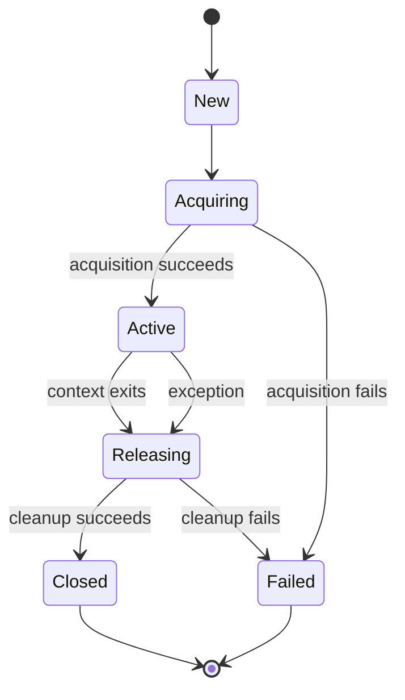

# 10- Custom Context Managers

## Overview

A custom context manager packages a resource or state lifecycle behind Python's `with` or `async with` syntax.

Python provides context managers for common resources such as files and locks, but backend systems frequently require application-specific lifecycle boundaries:

- Database transactions
- Unit-of-work objects
- HTTP client sessions
- Temporary credentials
- Distributed locks
- Tracing spans
- Metrics timers
- Temporary directories
- Feature flags or temporary configuration
- Resource acquisition and release
- Test infrastructure

A custom context manager is useful when the lifecycle has a meaningful invariant:

```text
Acquire / establish state
        |
        v
     use it
        |
        v
Release / restore state
```

The abstraction should make it difficult for callers to forget cleanup or violate the intended lifecycle.

## Context Manager Protocol

A synchronous custom context manager implements:

```python
__enter__()
__exit__(exc_type, exc_value, traceback)
```

Example:

```python
class ResourceManager:
    def __enter__(self):
        self.resource = acquire_resource()
        return self.resource

    def __exit__(self, exc_type, exc_value, traceback):
        self.resource.close()
        return False
```

Usage:

```python
with ResourceManager() as resource:
    resource.process()
```

The context manager controls the lifecycle while the caller focuses on the operation.

## The `with` Lifecycle

Conceptually, Python performs behavior equivalent to:

```python
manager = ResourceManager()

resource = manager.__enter__()

try:
    use(resource)
except BaseException as exc:
    suppress = manager.__exit__(
        type(exc),
        exc,
        exc.__traceback__,
    )

    if not suppress:
        raise
else:
    manager.__exit__(None, None, None)
```

This is a conceptual model rather than a literal source transformation.

The important semantics are:

1. Evaluate the context manager.
2. Call `__enter__()`.
3. Bind its return value to the `as` target.
4. Execute the body.
5. Call `__exit__()` when leaving the body.
6. Pass exception information when the body exits because of an exception.
7. Suppress the exception only if `__exit__()` returns a truthy value.

## `__enter__()`

`__enter__()` performs acquisition or setup.

Example:

```python
class DatabaseSession:
    def __enter__(self):
        self.session = create_session()
        return self.session
```

The return value becomes the value assigned by `as`:

```python
with DatabaseSession() as session:
    session.execute(...)
```

The context manager itself and the object exposed to the caller do not have to be the same object.

```python
class RepositoryContext:
    def __enter__(self):
        self.connection = create_connection()
        return UserRepository(self.connection)

    def __exit__(self, exc_type, exc_value, traceback):
        self.connection.close()
```

Here the caller receives a repository rather than the context-manager instance.

## `__exit__()`

`__exit__()` receives:

```python
exc_type
exc_value
traceback
```

when the body raises an exception.

For normal completion:

```python
exc_type is None
exc_value is None
traceback is None
```

A standard cleanup implementation usually returns `False` or `None`:

```python
def __exit__(self, exc_type, exc_value, traceback):
    self.close()
    return False
```

This means cleanup occurs without changing exception propagation.

## Exception Suppression

Returning a truthy value from `__exit__()` suppresses the exception.

```python
class IgnoreMissingResource:
    def __enter__(self):
        return self

    def __exit__(self, exc_type, exc_value, traceback):
        return exc_type is FileNotFoundError
```

Then:

```python
with IgnoreMissingResource():
    remove_optional_resource()
```

A custom context manager should suppress exceptions only when that behavior is explicitly part of its contract.

For most backend infrastructure, this is safer:

```python
def __exit__(self, exc_type, exc_value, traceback):
    cleanup()
    return False
```

Silently swallowing unexpected failures can cause incorrect API responses, lost jobs, inconsistent state, or difficult-to-debug production incidents.

## Cleanup Must Be Guaranteed

The usual custom context-manager structure is:

```python
class ManagedResource:
    def __enter__(self):
        self.resource = acquire()
        return self.resource

    def __exit__(self, exc_type, exc_value, traceback):
        try:
            self.resource.close()
        finally:
            self.resource = None

        return False
```

The design goal is:

```text
body succeeds      ──> cleanup
body returns       ──> cleanup
body raises        ──> cleanup
```

However, Python-level cleanup is not guaranteed if the process is abruptly terminated.

Context managers are therefore a resource-lifecycle mechanism, not a substitute for process-level graceful shutdown.

## Failure During `__enter__()`

A critical edge case is partial acquisition.

```python
class MultiResource:
    def __enter__(self):
        self.database = acquire_database()
        self.client = acquire_http_client()
        self.cache = acquire_cache()
        return self
```

If:

```python
acquire_cache()
```

fails, `__exit__()` is not called because entry never completed.

The previously acquired resources can therefore leak unless the implementation handles partial acquisition.

A safer design is to use nested context managers or `ExitStack`.

## Using `ExitStack` for Partial Acquisition

```python
from contextlib import ExitStack


class MultiResource:
    def __enter__(self):
        self.stack = ExitStack()

        self.database = self.stack.enter_context(
            create_database()
        )
        self.client = self.stack.enter_context(
            create_http_client()
        )
        self.cache = self.stack.enter_context(
            create_cache()
        )

        return self

    def __exit__(self, exc_type, exc_value, traceback):
        return self.stack.__exit__(
            exc_type,
            exc_value,
            traceback,
        )
```

If acquisition of `cache` fails, the stack automatically cleans up resources already entered.

This is preferable to manually writing increasingly complex rollback logic.

## Class-Based Context Managers

Use a class when lifecycle behavior requires:

- Multiple methods
- Configuration
- Internal state
- Explicit ownership
- Reusable abstraction
- Complex acquisition/release logic
- Different behavior based on runtime state

Example:

```python
class DatabaseTransaction:
    def __init__(self, connection):
        self.connection = connection

    def __enter__(self):
        self.connection.begin()
        return self.connection

    def __exit__(self, exc_type, exc_value, traceback):
        if exc_type is None:
            self.connection.commit()
        else:
            self.connection.rollback()

        return False
```

Usage:

```python
with DatabaseTransaction(connection):
    create_order(connection)
    reserve_inventory(connection)
```

## Function-Based Context Managers

For simple lifecycles, `contextlib.contextmanager` often produces less code.

```python
from collections.abc import Iterator
from contextlib import contextmanager


@contextmanager
def database_transaction(connection) -> Iterator:
    connection.begin()

    try:
        yield connection
    except Exception:
        connection.rollback()
        raise
    else:
        connection.commit()
```

Usage:

```python
with database_transaction(connection):
    create_order(connection)
    reserve_inventory(connection)
```

The generator's `yield` represents the boundary between entry and exit.

## `yield` Semantics in `@contextmanager`

Consider:

```python
@contextmanager
def managed_resource():
    resource = acquire()

    try:
        yield resource
    finally:
        release(resource)
```

Execution is divided into two phases:

```text
function starts
      |
      v
acquire()
      |
      v
yield resource
      |
      v
with-body executes
      |
      v
generator resumes
      |
      v
finally executes
      |
      v
release()
```

If the body raises an exception, the exception is thrown back into the generator at the `yield` point.

That is why:

```python
try:
    yield resource
finally:
    release(resource)
```

is such an important pattern.

## `try`, `except`, `else`, and `finally`

Transaction context managers often need different policies for success and failure.

```python
@contextmanager
def transaction(connection):
    connection.begin()

    try:
        yield connection
    except Exception:
        connection.rollback()
        raise
    else:
        connection.commit()
```

The semantics are:

| Body outcome | Action |
|---|---|
| Normal completion | Commit |
| Exception | Rollback |
| Exception after rollback | Original failure propagates |
| Successful commit | Context exits normally |
| Commit failure | Commit exception propagates |

This is more explicit than blindly placing `commit()` in `finally`.

## `finally` vs `else`

Consider:

```python
try:
    yield resource
finally:
    cleanup()
```

Use `finally` when cleanup must always happen.

For transactional success/failure semantics:

```python
try:
    yield resource
except Exception:
    rollback()
    raise
else:
    commit()
```

The distinction is important because cleanup and success processing are different responsibilities.

## Context Manager Factories

A factory can create a new context manager for each operation.

```python
@contextmanager
def request_context(request_id: str):
    context = RequestContext(request_id)

    try:
        context.activate()
        yield context
    finally:
        context.deactivate()
```

Usage:

```python
with request_context(request_id) as context:
    process_request(context)
```

This avoids sharing state between unrelated operations.

## Reusability and Reentrancy

A custom context manager is not automatically reusable or reentrant.

This manager stores active state on the instance:

```python
class ResourceManager:
    def __enter__(self):
        self.resource = acquire()
        return self.resource

    def __exit__(self, exc_type, exc_value, traceback):
        self.resource.close()
```

This may work:

```python
manager = ResourceManager()

with manager:
    ...

with manager:
    ...
```

But nested reuse:

```python
with manager:
    with manager:
        ...
```

may overwrite:

```python
self.resource
```

and break cleanup.

If reentrancy matters, maintain explicit nesting state or create independent manager instances.

## `@contextmanager` Reusability

A context manager created from a generator is generally single-use because the underlying generator is exhausted after the context exits.

This is safe:

```python
@contextmanager
def resource():
    value = acquire()

    try:
        yield value
    finally:
        release(value)


with resource() as value:
    use(value)

with resource() as value:
    use(value)
```

Each invocation creates a fresh generator.

Do not assume that storing one generated context-manager instance makes it safely reusable.

## Stateful Context Managers

State can be useful:

```python
class Timer:
    def __enter__(self):
        self.started_at = time.perf_counter()
        return self

    def __exit__(self, exc_type, exc_value, traceback):
        self.duration = time.perf_counter() - self.started_at
```

Usage:

```python
with Timer() as timer:
    process_request()

record_duration(timer.duration)
```

But state creates lifecycle and concurrency concerns.

Avoid sharing such an instance across concurrent requests.

## Thread Safety

A custom context manager is not inherently thread-safe.

This is unsafe if the same manager instance is shared:

```python
manager = StatefulResourceManager()
```

across worker threads when it stores per-operation state on `self`.

Prefer:

```python
def process():
    with StatefulResourceManager() as resource:
        use(resource)
```

Each operation receives its own manager instance.

If shared state is intentional, explicitly synchronize access.

## Async Custom Context Managers

For asynchronous resources, implement:

```python
__aenter__()
__aexit__()
```

Example:

```python
class AsyncDatabaseSession:
    async def __aenter__(self):
        self.session = await create_session()
        return self.session

    async def __aexit__(self, exc_type, exc_value, traceback):
        await self.session.close()
        return False
```

Usage:

```python
async with AsyncDatabaseSession() as session:
    await session.execute(...)
```

Both lifecycle methods are awaitable.

## `@asynccontextmanager`

For simple asynchronous lifecycles:

```python
from collections.abc import AsyncIterator
from contextlib import asynccontextmanager


@asynccontextmanager
async def http_client() -> AsyncIterator:
    client = AsyncClient()

    try:
        yield client
    finally:
        await client.aclose()
```

Usage:

```python
async with http_client() as client:
    response = await client.get("/users")
```

This is particularly useful for:

- Async HTTP clients
- Async database sessions
- WebSockets
- Async Redis clients
- Async locks
- Streaming resources

## Async Cleanup and Cancellation

Async cleanup must account for task cancellation.

```python
async with resource:
    await operation()
```

The task may be cancelled while waiting for `operation()`.

The cleanup code should therefore:

- Be short
- Avoid indefinite waits
- Avoid unnecessary network operations
- Use appropriate timeouts
- Preserve cancellation semantics where possible

Do not turn `__aexit__()` into a long-running recovery workflow.

If cleanup requires external I/O, determine whether cleanup failure should propagate, be logged, or be handled by a higher-level lifecycle manager.

## `AsyncExitStack`

For dynamically acquired asynchronous resources:

```python
from contextlib import AsyncExitStack


async def process(resources):
    async with AsyncExitStack() as stack:
        clients = []

        for factory in resources:
            client = await stack.enter_async_context(factory())
            clients.append(client)

        await process_clients(clients)
```

`AsyncExitStack` provides LIFO cleanup for asynchronous context managers.

It is useful when resource count or resource types are determined dynamically.

## Database Unit of Work

A custom context manager can represent a unit-of-work boundary.

```python
class UnitOfWork:
    def __init__(self, session_factory):
        self.session_factory = session_factory
        self.session = None

    def __enter__(self):
        self.session = self.session_factory()
        return self

    def __exit__(self, exc_type, exc_value, traceback):
        try:
            if exc_type is None:
                self.session.commit()
            else:
                self.session.rollback()
        finally:
            self.session.close()
            self.session = None

        return False
```

Usage:

```python
with UnitOfWork(session_factory) as uow:
    uow.session.add(order)
    uow.session.add(outbox_event)
```

The context manager expresses:

```text
Acquire session
      |
      v
Perform atomic DB work
      |
      +---- success ----> commit
      |
      +---- failure ----> rollback
      |
      v
Close session
```

This is a useful application-level abstraction when transaction boundaries are consistent across services.

## Transaction Scope and External Side Effects

A transaction context manager cannot undo external operations.

Avoid assuming this is atomic:

```python
with UnitOfWork(session_factory) as uow:
    save_order(uow.session)
    payment_provider.charge(...)
```

If the payment succeeds but the database transaction later fails, the systems can diverge.

For workflows involving PostgreSQL and external systems such as Kafka or payment providers, consider patterns such as:

- Transactional outbox
- Idempotency keys
- Retry-safe consumers
- Saga orchestration
- Compensating actions

The context manager controls the local transaction boundary; the distributed consistency mechanism must exist separately.

## Distributed Lock Context Manager

A Redis-backed lock can be wrapped in a context manager:

```python
class RedisLock:
    def __init__(self, client, key: str, timeout: int):
        self.client = client
        self.key = key
        self.timeout = timeout

    def __enter__(self):
        acquired = self.client.lock(
            self.key,
            timeout=self.timeout,
        ).acquire()

        if not acquired:
            raise TimeoutError(
                f"Could not acquire lock: {self.key}"
            )

        return self

    def __exit__(self, exc_type, exc_value, traceback):
        self.release()
        return False

    def release(self):
        ...
```

Production distributed locks require considerably more design than local `threading.Lock`.

Consider:

- Lock ownership
- Lease expiration
- Process crashes
- Clock behavior
- Renewal
- Fencing tokens
- Idempotency
- Failure during release

A context manager makes the local lifecycle readable, but it does not make a distributed lock algorithmically safe.

## Request-Scoped Context

Context managers can establish temporary request-scoped state.

For example:

```python
@contextmanager
def request_scope(request_id: str):
    logger_context.bind(request_id=request_id)

    try:
        yield
    finally:
        logger_context.clear()
```

Usage:

```python
with request_scope(request_id):
    process_request()
```

For asynchronous applications, `contextvars` are often a better mechanism for task-local request metadata.

Context managers and `contextvars` solve different problems:

| Tool | Primary responsibility |
|---|---|
| Context manager | Enter/exit lifecycle |
| `contextvars` | Task/thread-local context propagation |

They can be combined when appropriate.

## Temporary Configuration

A context manager can temporarily change application state:

```python
@contextmanager
def temporary_setting(config, name, value):
    previous = getattr(config, name)
    setattr(config, name, value)

    try:
        yield
    finally:
        setattr(config, name, previous)
```

Usage:

```python
with temporary_setting(config, "timeout", 2):
    run_operation()
```

This pattern is useful in controlled local contexts, particularly tests.

Be careful with process-global configuration in web servers because concurrent requests can observe temporary state unexpectedly.

## Redirecting Output

`contextlib.redirect_stdout()` and `redirect_stderr()` are context managers:

```python
from contextlib import redirect_stdout
from io import StringIO


buffer = StringIO()

with redirect_stdout(buffer):
    run_cli_command()
```

This is useful for tests and command-line tooling.

It is generally inappropriate for concurrent server code because standard output redirection affects process-global state.

## Context Manager Ownership

Every custom context manager should have a clear ownership contract.

For example:

```python
with create_client() as client:
    ...
```

usually implies:

```text
context owns client
        |
        v
context closes client
```

But:

```python
with use_existing_client(client):
    ...
```

may imply:

```text
caller owns client
        |
        v
context must not close client
```

Document ownership explicitly.

Ambiguous ownership is a common source of:

- Double-close bugs
- Connection leaks
- Use-after-close errors
- Unexpected resource invalidation

## Idempotent Cleanup

Cleanup methods should ideally tolerate repeated invocation where practical.

For example:

```python
def close(self):
    if self._closed:
        return

    self._closed = True
    self.resource.close()
```

This can make shutdown and error recovery safer.

However, do not blindly make every cleanup operation silently idempotent. For transactional or security-sensitive resources, repeated cleanup may indicate a programming error that should be observable.

## Resource State Machines

Complex context managers can be modeled as explicit state machines.



Explicit states are useful when lifecycle behavior becomes more complex than a simple acquire/use/release sequence.

## Production Example: API Request Timing

A reusable timing context manager:

```python
from contextlib import contextmanager
from time import perf_counter
from collections.abc import Iterator


@contextmanager
def measure_operation(
    metrics,
    operation: str,
) -> Iterator[None]:
    started = perf_counter()

    try:
        yield
    finally:
        duration = perf_counter() - started

        metrics.observe(
            "operation_duration_seconds",
            duration,
            operation=operation,
        )
```

Usage:

```python
with measure_operation(metrics, "create_order"):
    create_order()
```

This provides a consistent instrumentation boundary.

Production considerations include:

- Avoiding high-cardinality metric labels
- Measuring failures as well as successes
- Avoiding sensitive request data in labels
- Using monotonic clocks
- Keeping instrumentation lightweight

## Production Example: Temporary File

```python
from contextlib import contextmanager
from pathlib import Path
from tempfile import TemporaryDirectory
from collections.abc import Iterator


@contextmanager
def staged_export() -> Iterator[Path]:
    with TemporaryDirectory() as directory:
        path = Path(directory) / "export.json"

        generate_export(path)

        yield path
```

Usage:

```python
with staged_export() as path:
    upload_to_s3(path)
```

The temporary directory is automatically removed after the context exits.

This is useful for staging files before an S3 upload while avoiding persistent local storage.

## Testing Custom Context Managers

Test the lifecycle rather than only the final result.

For a resource manager, test:

- Successful entry
- Entry failure
- Normal exit
- Exceptional exit
- Cleanup
- Exception propagation
- Intentional suppression
- Reuse behavior
- Resource ownership

Example:

```python
def test_resource_is_released_on_exception():
    resource = FakeResource()

    with pytest.raises(RuntimeError):
        with ManagedResource(resource):
            raise RuntimeError("operation failed")

    assert resource.closed is True
```

Test the exception path because resource leaks frequently appear only when operations fail.

## Testing Suppression

If suppression is intentional:

```python
def test_expected_exception_is_suppressed():
    with SuppressExpectedError():
        raise ExpectedError("expected")

    assert operation_continued()
```

Also test that unrelated exceptions propagate:

```python
def test_unexpected_exception_propagates():
    with pytest.raises(RuntimeError):
        with SuppressExpectedError():
            raise RuntimeError("unexpected")
```

This prevents accidental broad exception suppression.

## Testing Transaction Managers

A transaction manager should have tests for:

| Scenario | Expected result |
|---|---|
| Successful operation | Commit |
| Body raises | Rollback |
| Commit fails | Commit failure propagates |
| Rollback fails | Cleanup failure handled according to contract |
| Session creation fails | No leaked session |
| Early return | Correct commit/cleanup |
| Multiple operations | Single intended transaction |
| External side effect | Not incorrectly assumed atomic |

## Mocking Resources

Mock the resource boundary rather than implementation details inside the business operation.

For example:

```python
def test_transaction_commits_on_success(mocker):
    connection = mocker.Mock()

    with transaction(connection):
        connection.execute("INSERT ...")

    connection.commit.assert_called_once()
    connection.rollback.assert_not_called()
```

The test verifies the lifecycle contract.

## Observability

Custom context managers can be excellent instrumentation boundaries.

Capture:

- Entry count
- Exit count
- Duration
- Success/failure
- Exception type
- Resource acquisition latency
- Cleanup failures

For example:

```text
resource acquisition
        |
        v
   active period
        |
        v
resource cleanup
        |
        +--> success
        |
        +--> failure
```

Monitor both acquisition and cleanup.

A service with healthy request latency but increasingly slow database connection cleanup may eventually exhaust its connection pool.

## Logging

Avoid logging the same failure at every abstraction layer.

A context manager can record lifecycle failures:

```python
def __exit__(self, exc_type, exc_value, traceback):
    try:
        self.resource.close()
    except Exception:
        logger.exception("Resource cleanup failed")
        raise

    return False
```

Whether cleanup failures should propagate depends on the resource and application contract.

Do not log secrets, credentials, authorization headers, database URLs, or sensitive request payloads.

## Security Considerations

Custom context managers can enforce security-sensitive boundaries, but they should not replace authorization.

Examples:

```text
temporary credentials
       |
       v
privileged operation
       |
       v
credentials revoked
```

or:

```text
acquire protected resource
       |
       v
perform authorized operation
       |
       v
release resource
```

Security-sensitive context managers should consider:

- Least privilege
- Credential lifetime
- Secret exposure in logs
- Cleanup on exceptions
- Process termination
- Resource ownership
- Auditability

Temporary privilege should be scoped as narrowly as possible.

## Performance Considerations

Context-manager protocol overhead is usually small relative to database, network, and disk operations.

The more important performance question is **resource lifetime**.

For example:

```python
for item in items:
    with create_connection() as connection:
        process(item, connection)
```

may repeatedly acquire and release connections.

If appropriate, this can be more efficient:

```python
with create_connection() as connection:
    for item in items:
        process(item, connection)
```

But the larger scope is correct only if:

- The connection can safely serve the entire operation.
- The transaction semantics are correct.
- The resource does not become stale.
- The operation does not exceed timeout limits.
- Pool utilization remains healthy.

Optimize context scope based on resource semantics and measurements, not syntax alone.

## Scalability Considerations

A context manager can make resource ownership obvious, but poor scope can still limit scalability.

For a database pool:

```text
Request A ── acquire ─────────────── release
Request B ── wait ─────────────────────────── acquire
Request C ── wait ─────────────────────────── acquire
```

If request A holds the connection while making an external API call, other requests may wait unnecessarily.

Prefer:

```text
DB context
   |
   +--> required DB work
   |
   +--> commit / rollback
   |
   +--> release

External API call
   |
   +--> separate lifecycle
```

where application consistency permits.

## Microservices Considerations

In a microservice, custom context managers commonly represent local boundaries:

- Database transaction
- Message publishing lifecycle
- HTTP client lifecycle
- Distributed lock
- Trace span

They should not hide distributed behavior.

For example:

```python
with transaction():
    save_order()

with kafka_producer():
    publish_event()
```

does not imply that the database write and Kafka publication are atomic.

For reliable event publication, a transactional outbox is often more appropriate:

```text
Application request
       |
       v
PostgreSQL transaction
   +---+----------------+
   |                    |
save order         save outbox event
   |                    |
   +---------+----------+
             |
          COMMIT
             |
             v
      Outbox publisher
             |
             v
           Kafka
```

The context manager manages the PostgreSQL transaction, while the architecture provides distributed reliability.

## Context Managers and Kubernetes

In Kubernetes, application resources often have different lifetimes:

```text
Pod lifetime
    |
    +--> application lifetime
             |
             +--> worker lifetime
             |
             +--> request lifetime
             |
             +--> transaction lifetime
```

Custom context managers should normally manage the shortest appropriate lifecycle.

For example:

- HTTP client pool → application lifespan
- Database session → request or unit-of-work
- Transaction → transaction scope
- Temporary file → operation scope
- Distributed lock → critical-section scope

Do not accidentally create request-scoped resources at application scope.

## Graceful Shutdown

A context manager helps with local cleanup but cannot replace application shutdown handling.

A robust service should:

1. Stop accepting new work.
2. Allow or cancel in-flight work according to policy.
3. Close application-level resources.
4. Close connection pools.
5. Flush telemetry where appropriate.
6. Exit within the platform's termination window.

Kubernetes typically sends `SIGTERM` before terminating a container, but forced termination can still prevent Python cleanup.

## Common Mistakes

### Writing a Custom Manager When `contextlib` Is Sufficient

A full class can be unnecessary:

```python
class Timer:
    ...
```

when:

```python
@contextmanager
def timer():
    ...
```

is clearer.

Use the simplest abstraction that preserves the lifecycle contract.

### Forgetting `return False`

Returning `None` is also fine because it is falsey:

```python
return None
```

The important point is not to accidentally return a truthy value.

### Swallowing Unexpected Exceptions

This is dangerous:

```python
def __exit__(self, exc_type, exc_value, traceback):
    cleanup()
    return True
```

It can turn failures into apparent success.

### Acquiring Multiple Resources in `__enter__()`

If the third acquisition fails, earlier resources may leak.

Use `ExitStack` or nested context managers.

### Sharing a Stateful Context Manager

Per-operation state stored on `self` can be corrupted by concurrent use.

### Holding Resources Too Long

Large context scopes can exhaust:

- Database pools
- HTTP connection pools
- Locks
- File descriptors

### Performing External I/O Inside Database Transactions

The transaction cannot roll back the external operation.

### Treating Distributed Locks Like Local Locks

A Redis or database-backed lock has failure modes that a process-local mutex does not.

### Using Process-Global State in Concurrent Servers

Temporary changes to global state can affect unrelated requests.

### Ignoring Cleanup Failures

Cleanup can fail and may need explicit observability.

### Assuming Cleanup Happens During Forced Termination

It does not.

## Production Pitfalls

| Problem | Why it happens | Recommended approach |
|---|---|---|
| Connection leak | Cleanup not guaranteed | Context manager |
| Partial acquisition leak | `__enter__()` fails midway | `ExitStack` |
| Hidden exceptions | `__exit__()` returns truthy | Return false unless suppression is intentional |
| Pool exhaustion | Context scope too large | Minimize resource lifetime |
| Transaction contention | Slow work inside transaction | Keep transactions narrow |
| Race conditions | Shared manager state | Fresh instances or synchronization |
| Secret exposure | Debug logging of lifecycle state | Redact sensitive data |
| Cleanup failure unnoticed | No metrics/logging | Instrument cleanup failures |
| Request state leakage | Resource stored globally | Use request/task-local scope |
| Incorrect distributed atomicity | Context treated as global transaction | Outbox/Saga/idempotency patterns |
| Shutdown leaks | Abrupt process termination | Graceful shutdown + bounded cleanup |
| Cancellation hangs | Async cleanup waits indefinitely | Cancellation-aware, bounded cleanup |

## When to Use a Class vs `contextmanager`

| Requirement | Class | `@contextmanager` |
|---|---:|---:|
| Simple acquire/release | | ✓ |
| Simple transaction | | ✓ |
| Multiple public methods | ✓ | |
| Complex state machine | ✓ | |
| Explicit ownership model | ✓ | |
| Reusable object behavior | ✓ | |
| Dynamic resources | `ExitStack` | `ExitStack` |
| Async simple lifecycle | | `@asynccontextmanager` |
| Complex async state | ✓ | |
| Significant configuration/state | ✓ | |

The choice is primarily about clarity and lifecycle complexity.

## Design Principles

### Keep the Boundary Narrow

A context manager should own only the lifecycle it is responsible for.

Avoid combining unrelated concerns:

```python
with EverythingManager():
    ...
```

Prefer focused boundaries:

```python
with database_transaction():
    ...

with measure_operation("external_api"):
    ...
```

### Make Ownership Explicit

The caller should know whether the context owns the resource.

### Preserve Exceptions by Default

Cleanup should generally not alter the failure semantics of the operation.

### Make Cleanup Deterministic

Do not depend on garbage collection for resources that require explicit release.

### Keep Lifecycle Logic Centralized

If every caller has to repeat:

```python
acquire()
try:
    ...
finally:
    release()
```

a context manager may be the right abstraction.

### Keep Operational Semantics Visible

Do not hide expensive database transactions, distributed locks, or network operations behind an innocent-looking context manager.

The abstraction should improve lifecycle management without concealing important system behavior.

## Senior Review Checklist

When reviewing a custom context manager, ask:

- What resource or state does it own?
- What exactly happens in `__enter__()`?
- What happens if acquisition partially fails?
- What does `__enter__()` return?
- What happens on normal exit?
- What happens on exceptions?
- Can `__exit__()` suppress exceptions?
- Is suppression intentional and narrow?
- Is cleanup deterministic?
- Can cleanup fail?
- Is cleanup idempotent?
- Is the manager reusable?
- Is it reentrant?
- Is it thread-safe?
- Is it async-safe?
- How does cancellation affect cleanup?
- How long does the resource remain held?
- Could it exhaust a pool?
- Does it contain process-global state?
- Does it interact with external systems?
- Is ownership obvious?
- Is the lifecycle observable?
- Does it behave correctly during graceful shutdown?
- Are exceptional paths covered by tests?

## Interview Traps

### What Happens if `__enter__()` Raises?

The body is not executed and `__exit__()` is not called.

### What Happens if the Body Raises?

`__exit__()` is called with the exception type, exception instance, and traceback.

### How Do You Propagate the Exception?

Return `False` or `None`, or simply omit an explicit truthy return.

### How Do You Suppress an Exception?

Return a truthy value from `__exit__()`.

### Why Is `finally` Important in `@contextmanager`?

Because cleanup must execute whether the body completes normally or raises.

```python
@contextmanager
def resource():
    value = acquire()

    try:
        yield value
    finally:
        release(value)
```

### Why Use `ExitStack`?

When resources are dynamic, conditional, heterogeneous, or difficult to represent with static nesting.

### Are Custom Context Managers Automatically Thread-Safe?

No.

The protocol defines lifecycle semantics, not synchronization.

### Are Context Managers Automatically Reentrant?

No.

Reentrancy depends on the implementation.

### What Is the Difference Between a Context Manager and a Decorator?

A decorator transforms callable behavior.

A context manager controls lifecycle around a block of execution.

They can implement similar cross-cutting concerns but have different scopes:

```text
Decorator
function call
   |
   +--> before
   +--> function
   +--> after


Context manager
with block
   |
   +--> enter
   +--> body
   +--> exit
```

### Why Should Database Transactions Be Short?

Long transactions can hold locks and connections, increase contention, increase rollback cost, and reduce pool availability.

### Can a Context Manager Implement a Distributed Transaction?

No.

It can coordinate local cleanup or a local transaction boundary, but distributed atomicity requires an appropriate distributed-systems pattern.

### Why Might `ExitStack` Be Better Than Multiple `try/finally` Blocks?

It centralizes dynamic resource registration and guarantees reverse-order cleanup, reducing complex partial-acquisition logic.

### What Is the Async Equivalent?

Use:

```python
__aenter__()
__aexit__()
```

with:

```python
async with
```

or use `@asynccontextmanager`.

## Key Takeaways

- Custom context managers encode reusable resource or state lifecycles through `__enter__()`/`__exit__()` or their asynchronous equivalents.
- Use `@contextmanager` for simple acquire/yield/cleanup flows, classes for stateful or complex lifecycles, and `ExitStack`/`AsyncExitStack` for dynamic resource acquisition.
- Preserve exceptions by default, make ownership explicit, handle partial acquisition, and design carefully for reentrancy, concurrency, cancellation, and cleanup failures.
- Context scope is an operational concern: overly broad transactions, locks, connections, or request resources can reduce throughput and cause pool exhaustion.
- Context managers provide local lifecycle guarantees, not distributed atomicity; combine them with transactions, idempotency, transactional outbox, graceful shutdown, and other reliability patterns where required.