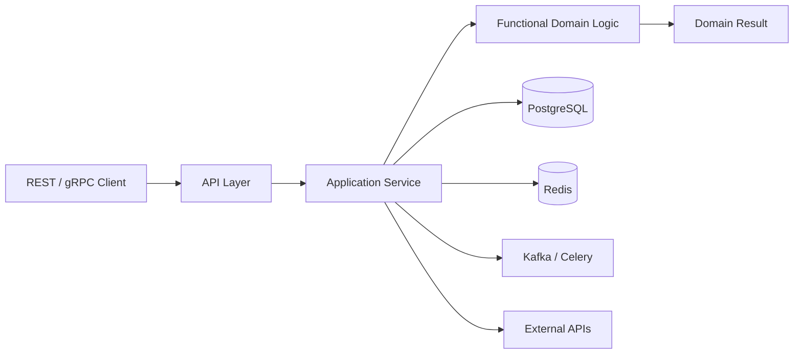

# 11- Functional Programming

## Overview

Functional programming (FP) is a programming style that emphasizes **composable functions, explicit data flow, immutable or non-mutating transformations, and minimizing uncontrolled side effects**.

Python is not a purely functional language. It is multi-paradigm and supports:

- Imperative programming
- Object-oriented programming
- Functional programming
- Procedural programming
- Metaprogramming

Python's functional features become particularly useful when processing collections, building transformation pipelines, implementing strategies, composing business rules, and separating pure business logic from I/O.

The most important functional-programming concepts in Python are:

- First-class functions
- Higher-order functions
- Pure functions
- Referential transparency
- Immutability
- Function composition
- Closures
- `map()`
- `filter()`
- `reduce()`
- Generator expressions
- `itertools`
- `functools`
- Callable objects
- Side-effect isolation

A practical backend architecture often combines functional and object-oriented approaches:

```text
                    Backend Service
                          |
             +------------+------------+
             |                         |
        Imperative shell         Functional core
             |                         |
     HTTP / DB / Kafka          Validation
     Redis / filesystem          Transformation
     External APIs               Business rules
             |                         |
             +------------+------------+
                          |
                    Persist / publish
```

The goal is not to make every Python program "functional". The goal is to use functional techniques where they improve **correctness, composability, testability, and maintainability**.

## Why Functional Programming Matters

Backend applications continuously transform data:

```text
HTTP request
    |
    v
Parse
    |
    v
Validate
    |
    v
Normalize
    |
    v
Apply business rules
    |
    v
Transform
    |
    v
Persist
    |
    v
Publish event
```

Functional programming provides a natural model for transformation stages:

```python
validated = validate(request)
normalized = normalize(validated)
priced = calculate_price(normalized)
result = build_response(priced)
```

Each function can have a clear contract.

This reduces hidden dependencies and makes individual operations easier to test.

## Functional Programming Principles

| Principle | Meaning | Backend benefit |
|---|---|---|
| First-class functions | Functions can be values | Callbacks and composition |
| Pure functions | Same input produces same output without external effects | Deterministic tests |
| Immutability | Avoid modifying existing state | Easier reasoning |
| Composition | Build larger operations from smaller functions | Reusable business logic |
| Higher-order functions | Functions accept/return functions | Configurable behavior |
| Explicit data flow | Inputs and outputs are visible | Easier debugging |
| Side-effect isolation | Keep I/O at boundaries | Better testability |

These principles are guidelines rather than absolute requirements.

## First-Class Functions

Python functions are objects.

They can be:

```python
def normalize_email(email: str) -> str:
    return email.strip().lower()


normalizer = normalize_email

print(normalizer(" USER@EXAMPLE.COM "))
```

They can also be passed to another function:

```python
def transform_users(users, transform):
    return [transform(user) for user in users]
```

Or returned from a function:

```python
def make_normalizer():
    def normalize(value: str) -> str:
        return value.strip().lower()

    return normalize
```

This capability forms the foundation for many functional patterns.

## Higher-Order Functions

A higher-order function accepts a function, returns a function, or both.

```python
from collections.abc import Callable, Iterable
from typing import TypeVar


T = TypeVar("T")
U = TypeVar("U")


def transform(
    values: Iterable[T],
    operation: Callable[[T], U],
) -> list[U]:
    return [operation(value) for value in values]
```

Usage:

```python
prices = [10, 20, 30]

formatted = transform(
    prices,
    lambda price: f"${price:.2f}",
)
```

Higher-order functions allow behavior to be passed as data.

## Pure Functions

A pure function has two important properties:

1. Its output depends only on its inputs.
2. It does not produce observable side effects.

Example:

```python
def calculate_total(
    price: float,
    quantity: int,
) -> float:
    return price * quantity
```

For the same inputs:

```python
calculate_total(10.0, 3)
```

always returns:

```text
30.0
```

A function that reads the current time is not pure:

```python
from datetime import datetime, UTC


def current_timestamp():
    return datetime.now(UTC)
```

Its result depends on external state.

## Why Pure Functions Matter

Pure functions are easier to:

- Unit test
- Cache
- Reason about
- Compose
- Parallelize
- Retry
- Reuse

Consider:

```python
def calculate_discount(price: float, percentage: float) -> float:
    return price * (1 - percentage)
```

Testing is straightforward:

```python
assert calculate_discount(100.0, 0.10) == 90.0
```

No database, network, clock, environment, or global state is required.

## Pure Core, Imperative Shell

A useful backend architecture is:

```text
                Imperative Shell
       +-------------------------------+
       | HTTP                          |
       | PostgreSQL                    |
       | Redis                         |
       | Kafka                         |
       | AWS                           |
       +---------------+---------------+
                       |
                       v
                Functional Core
       +-------------------------------+
       | Validation                    |
       | Business calculations         |
       | Data transformation           |
       | Policy evaluation             |
       | Domain rules                  |
       +-------------------------------+
```

Example:

```python
def calculate_order_total(
    items: list[dict],
    discount_rate: float,
) -> float:
    subtotal = sum(
        item["price"] * item["quantity"]
        for item in items
    )

    return subtotal * (1 - discount_rate)
```

The API layer can handle I/O:

```python
def create_order(request, repository):
    items = repository.load_items(request.item_ids)

    total = calculate_order_total(
        items,
        request.discount_rate,
    )

    return repository.save_order(
        items=items,
        total=total,
    )
```

The business calculation remains independent of the database.

## Side Effects

A side effect occurs when a function interacts with state outside its explicit inputs and return value.

Examples include:

- Database writes
- Network requests
- File writes
- Logging
- Sending Kafka messages
- Updating Redis
- Modifying global state
- Changing object state
- Reading environment state
- Generating random values

This does not mean side effects are bad.

Backend systems exist to perform side effects.

The engineering goal is to **control and isolate them**.

## Side-Effect Isolation

Prefer:

```python
def calculate_price(order) -> Decimal:
    ...
```

over:

```python
def calculate_price(order, database):
    ...
```

when database access is not required for the calculation.

Then:

```python
def process_order(order, repository):
    pricing_data = repository.get_pricing_data(order)

    price = calculate_price(
        order,
        pricing_data,
    )

    return repository.save_price(order.id, price)
```

The side effect remains at the application boundary.

## Immutability

Python objects are not immutable by default.

Some built-in types are immutable:

```python
str
int
float
tuple
frozenset
```

Others are mutable:

```python
list
dict
set
```

Functional programming often favors creating new values instead of mutating shared state.

Instead of:

```python
def activate(user):
    user["active"] = True
    return user
```

prefer, when appropriate:

```python
def activate(user):
    return {
        **user,
        "active": True,
    }
```

This avoids changing the original mapping.

## Immutability Is a Design Choice

Immutability can improve:

- Predictability
- Concurrency safety
- Testability
- Debugging
- State management

But copying data has costs.

For large structures:

```python
new_data = {
    **large_dictionary,
    "status": "active",
}
```

creates another mapping.

Therefore, do not blindly copy large data structures merely to follow an abstract functional rule.

Use immutable designs where they provide meaningful correctness benefits.

## Frozen Data Models

Dataclasses can enforce stronger immutability:

```python
from dataclasses import dataclass


@dataclass(frozen=True)
class Money:
    amount: int
    currency: str
```

Now:

```python
money = Money(1000, "USD")
```

cannot have its fields reassigned normally.

Immutable value objects are particularly useful in domain logic.

## Referential Transparency

An expression is referentially transparent when it can be replaced by its result without changing program behavior.

For example:

```python
calculate_total(100, 2)
```

can conceptually be replaced with:

```python
200
```

if `calculate_total()` is pure.

This property makes:

- Caching
- Memoization
- Testing
- Reasoning
- Optimization

easier.

Python does not enforce referential transparency, so developers must maintain the contract.

## Function Composition

Function composition combines smaller functions into a larger operation.

Suppose:

```python
def strip(value: str) -> str:
    return value.strip()


def lowercase(value: str) -> str:
    return value.lower()


def validate(value: str) -> str:
    if not value:
        raise ValueError("Value cannot be empty")

    return value
```

A simple pipeline can be written as:

```python
def normalize_username(value: str) -> str:
    return validate(lowercase(strip(value)))
```

The flow is:

```text
input
  |
  v
strip
  |
  v
lowercase
  |
  v
validate
  |
  v
output
```

This makes transformation stages explicit.

## Composition Helper

For reusable composition:

```python
from collections.abc import Callable
from functools import reduce
from typing import TypeVar


T = TypeVar("T")


def compose(
    *functions: Callable[[T], T],
) -> Callable[[T], T]:
    def composed(value: T) -> T:
        return reduce(
            lambda current, function: function(current),
            reversed(functions),
            value,
        )

    return composed
```

Usage:

```python
normalize = compose(
    validate,
    lowercase,
    strip,
)
```

However, explicit nested calls or a named pipeline can often be clearer than introducing a generic composition framework.

## Transformation Pipelines

Functional pipelines work well for data processing:

```python
def normalize_email(email: str) -> str:
    return email.strip().lower()


def is_valid_email(email: str) -> bool:
    return "@" in email


def normalize_valid_emails(emails: list[str]) -> list[str]:
    normalized = map(normalize_email, emails)
    return list(filter(is_valid_email, normalized))
```

The data flow is:

```text
emails
   |
   v
normalize
   |
   v
filter valid
   |
   v
list
```

For larger pipelines, generator expressions and `itertools` can avoid unnecessary intermediate collections.

## `map()`

`map()` applies a function to each item.

```python
prices = [10, 20, 30]

taxed = map(
    lambda price: price * 1.18,
    prices,
)

result = list(taxed)
```

`map()` is lazy in Python 3.

```python
taxed = map(calculate_tax, prices)
```

does not execute all transformations immediately.

Iteration triggers evaluation.

## `filter()`

`filter()` retains values for which a predicate is truthy.

```python
users = [
    {"name": "alice", "active": True},
    {"name": "bob", "active": False},
]

active_users = filter(
    lambda user: user["active"],
    users,
)
```

Again, evaluation is lazy.

## `reduce()`

`functools.reduce()` repeatedly combines values:

```python
from functools import reduce


total = reduce(
    lambda accumulator, value: accumulator + value,
    [10, 20, 30],
    0,
)
```

Result:

```text
60
```

`reduce()` is useful when the operation naturally represents accumulation.

However, many reductions are clearer with specialized built-ins:

```python
sum(values)
```

instead of:

```python
reduce(lambda a, b: a + b, values, 0)
```

Prefer the clearest abstraction.

## Functional Built-ins vs Comprehensions

Python generally favors comprehensions for straightforward transformations.

Instead of:

```python
result = list(
    map(
        lambda user: user["email"].lower(),
        users,
    )
)
```

prefer:

```python
result = [
    user["email"].lower()
    for user in users
]
```

The comprehension communicates the operation directly.

Use `map()` when passing an existing named function makes the intent clearer:

```python
normalized = map(normalize_email, emails)
```

## Generator Expressions

Generator expressions provide lazy transformation:

```python
total = sum(
    item["price"] * item["quantity"]
    for item in items
)
```

No intermediate list is required.

For large collections:

```python
total = sum(
    calculate_item_total(item)
    for item in items
)
```

can reduce peak memory usage.

## `itertools`

`itertools` provides efficient iterator building blocks.

Useful functions include:

- `chain`
- `islice`
- `takewhile`
- `dropwhile`
- `groupby`
- `starmap`
- `accumulate`
- `product`
- `permutations`
- `combinations`

Example:

```python
from itertools import chain


all_events = chain(
    service_a_events,
    service_b_events,
    service_c_events,
)

for event in all_events:
    process(event)
```

The operation remains lazy.

## `functools`

`functools` provides utilities for functional programming and callable manipulation.

Important tools include:

- `reduce`
- `partial`
- `wraps`
- `lru_cache`
- `cache`
- `singledispatch`
- `singledispatchmethod`
- `cached_property`

Example:

```python
from functools import partial


def create_client(base_url: str, timeout: float):
    ...


create_default_client = partial(
    create_client,
    "https://api.example.com",
    timeout=5.0,
)
```

`partial()` binds arguments without introducing a custom wrapper function.

## Closures

Closures allow a function to retain access to variables from an enclosing scope.

```python
def make_multiplier(factor: int):
    def multiply(value: int) -> int:
        return value * factor

    return multiply
```

Usage:

```python
double = make_multiplier(2)

double(10)
```

returns:

```text
20
```

Closures are useful for:

- Function factories
- Configuration binding
- Strategy functions
- Decorators
- Callbacks

They should not be used when a small class would make state and lifecycle clearer.

## Stateless vs Stateful Functions

Stateless function:

```python
def calculate_tax(amount: Decimal) -> Decimal:
    return amount * Decimal("0.18")
```

Stateful closure:

```python
def make_counter():
    count = 0

    def next_value():
        nonlocal count
        count += 1
        return count

    return next_value
```

The second function carries state.

Shared mutable closure state introduces concurrency considerations.

## Callable Objects

Functional programming does not require functions to be the only callable abstraction.

A class can implement `__call__()`:

```python
class PriceCalculator:
    def __init__(self, tax_rate: Decimal):
        self.tax_rate = tax_rate

    def __call__(self, amount: Decimal) -> Decimal:
        return amount * (1 + self.tax_rate)
```

Usage:

```python
calculator = PriceCalculator(Decimal("0.18"))

total = calculator(Decimal("100"))
```

Callable objects are useful when behavior requires persistent configuration or state.

## Functions vs Callable Objects

| Requirement | Function | Callable object |
|---|---:|---:|
| Simple stateless behavior | ✓ | |
| Small transformation | ✓ | |
| Persistent configuration | | ✓ |
| Significant state | | ✓ |
| Multiple related operations | | ✓ |
| Simple callback | ✓ | |
| Dependency-heavy strategy | | ✓ |
| Serialization requirements | Often easier | Depends on implementation |

Functional programming complements object-oriented design rather than replacing it.

## Function Factories

A function factory produces specialized behavior.

```python
def make_validator(
    minimum_length: int,
):
    def validate(value: str) -> str:
        if len(value) < minimum_length:
            raise ValueError("Value is too short")

        return value

    return validate
```

Usage:

```python
validate_password = make_validator(12)
```

This is useful for configuration-driven behavior.

## Functional Dependency Injection

Functions can also serve as lightweight dependency-injection points.

```python
from collections.abc import Callable


def process_order(
    order,
    price_calculator: Callable,
):
    price = price_calculator(order)
    return create_result(order, price)
```

Production code:

```python
process_order(order, pricing_service.calculate)
```

Test code:

```python
process_order(order, lambda _: Decimal("100"))
```

This reduces coupling without requiring a large dependency-injection framework.

## Functional Validation

Validation rules can be represented as functions:

```python
from collections.abc import Callable


Validator = Callable[[str], None]


def required(value: str) -> None:
    if not value:
        raise ValueError("Value is required")


def max_length(limit: int) -> Validator:
    def validate(value: str) -> None:
        if len(value) > limit:
            raise ValueError(
                f"Value exceeds {limit} characters"
            )

    return validate
```

Rules can then be composed:

```python
def validate(value: str, validators: list[Validator]) -> None:
    for validator in validators:
        validator(value)
```

This is useful when validation rules are configurable or reused.

## Strategy Pattern with Functions

The Strategy pattern can often be implemented directly with callables.

```python
from collections.abc import Callable


PricingStrategy = Callable[[Decimal], Decimal]


def standard_price(amount: Decimal) -> Decimal:
    return amount


def premium_price(amount: Decimal) -> Decimal:
    return amount * Decimal("0.90")


def calculate_price(
    amount: Decimal,
    strategy: PricingStrategy,
) -> Decimal:
    return strategy(amount)
```

Usage:

```python
price = calculate_price(
    Decimal("100"),
    premium_price,
)
```

A class-based strategy becomes preferable when the strategy has substantial state or multiple related operations.

## Functional Error Handling

Python uses exceptions as its primary error mechanism.

Functional style does not require avoiding exceptions.

For pure validation:

```python
def parse_port(value: str) -> int:
    port = int(value)

    if not 1 <= port <= 65535:
        raise ValueError("Invalid port")

    return port
```

The function remains deterministic even though it can fail.

At system boundaries, translate exceptions into appropriate application-level errors:

```text
Pure function
     |
     +--> ValueError
             |
             v
Application layer
             |
             v
HTTP 400 / domain error
```

## Functional Pipelines and Exceptions

A pipeline can fail at any stage:

```python
def process_user(raw_user):
    user = parse_user(raw_user)
    user = validate_user(user)
    user = normalize_user(user)
    return build_domain_user(user)
```

This is easy to reason about when each function has a well-defined contract.

Avoid catching broad exceptions inside every transformation:

```python
try:
    ...
except Exception:
    return None
```

That destroys error information and can convert real failures into invalid data.

## Referential Transparency and Caching

Pure functions are good candidates for memoization.

```python
from functools import cache


@cache
def calculate_tax_rate(country: str) -> Decimal:
    return load_static_tax_rate(country)
```

Caching is safe only if the function's result remains valid for the cache lifetime.

Do not assume purity merely because a function looks deterministic.

If the underlying data changes, cached values can become stale.

## `lru_cache`

`lru_cache` provides bounded memoization:

```python
from functools import lru_cache


@lru_cache(maxsize=1024)
def normalize_code(code: str) -> str:
    return code.strip().upper()
```

Consider:

- Input cardinality
- Cache size
- Memory consumption
- Hit rate
- Staleness
- Process-local behavior

In a Kubernetes deployment, each process has its own cache.

This is not a distributed cache.

## Functional Programming and Redis

For distributed caching, keep the side effect outside the pure calculation:

```python
def calculate_shipping_cost(
    weight: Decimal,
    zone: str,
) -> Decimal:
    ...
```

Then:

```python
def get_shipping_cost(
    weight,
    zone,
    redis,
):
    key = f"shipping:{zone}:{weight}"

    cached = redis.get(key)

    if cached is not None:
        return Decimal(cached)

    cost = calculate_shipping_cost(weight, zone)

    redis.setex(key, 300, str(cost))

    return cost
```

The calculation remains independently testable.

## Functional Programming and PostgreSQL

Functional transformations are useful after data retrieval, but do not blindly pull all data into Python.

Prefer pushing filtering and aggregation to PostgreSQL when appropriate:

```sql
SELECT customer_id, SUM(amount)
FROM orders
WHERE status = 'completed'
GROUP BY customer_id;
```

rather than:

```python
orders = repository.load_all_orders()

completed = filter(
    lambda order: order.status == "completed",
    orders,
)
```

For large datasets, database-side operations usually reduce:

- Network transfer
- Python memory usage
- CPU consumption
- Application latency

Functional style should not become an excuse to ignore data locality.

## Functional Programming and ETL

Functional pipelines are particularly useful for ETL:

```text
Raw records
    |
    v
parse
    |
    v
validate
    |
    v
normalize
    |
    v
enrich
    |
    v
aggregate
    |
    v
write
```

Example:

```python
def transform_record(record):
    return {
        "email": record["email"].strip().lower(),
        "amount": Decimal(record["amount"]),
    }


records = (
    transform_record(record)
    for record in raw_records
)
```

The generator keeps the transformation lazy.

For large workloads, combine this with streaming input and bounded batches.

## Functional Programming and Kafka

Kafka consumers naturally process streams of values.

A transformation function can remain pure:

```python
def normalize_event(event: dict) -> dict:
    return {
        **event,
        "event_type": event["event_type"].strip().lower(),
    }
```

The consumer handles side effects:

```python
for event in consumer:
    normalized = normalize_event(event.value)
    repository.store(normalized)
```

This separation makes transformation logic easier to unit test.

However, Kafka processing still requires operational reasoning about:

- Offsets
- Delivery semantics
- Retries
- Idempotency
- Ordering
- Poison messages

Functional transformations do not automatically provide exactly-once processing.

## Functional Programming and Celery

Celery tasks have external side effects and should be designed for retry safety.

Pure transformation:

```python
def build_invoice_payload(order) -> dict:
    return {
        "order_id": order.id,
        "total": str(order.total),
    }
```

Task boundary:

```python
@app.task
def generate_invoice(order_id: int):
    order = repository.get_order(order_id)
    payload = build_invoice_payload(order)
    invoice_service.create(payload)
```

Keeping the transformation separate makes it easier to test without starting a worker or external service.

## Async Functions and Functional Style

Async functions can still be pure:

```python
async def fetch_user(client, user_id: int):
    return await client.get(f"/users/{user_id}")
```

However, network I/O is inherently an external effect.

A better separation is often:

```python
def build_user_request(user_id: int) -> str:
    return f"/users/{user_id}"
```

followed by:

```python
async def fetch_user(client, user_id: int):
    path = build_user_request(user_id)
    return await client.get(path)
```

The pure function is independently testable.

## Concurrency and Functional Programming

Immutable data and pure functions can reduce concurrency problems because they minimize shared mutable state.

Compare:

```python
shared_state["total"] += amount
```

with:

```python
new_total = current_total + amount
```

The second approach makes state transitions explicit.

This does not eliminate concurrency problems.

If two workers calculate:

```text
current_total = 100
```

and both independently produce:

```text
150
```

the shared system still needs proper synchronization or atomic persistence.

Functional programming reduces local shared-state complexity; it does not replace distributed coordination.

## Parallelism

Pure functions are often easier to execute concurrently because they have fewer hidden dependencies.

For example:

```python
def transform(record):
    return normalize(record)
```

can potentially be applied independently to many records.

However, Python concurrency choices still depend on workload:

| Workload | Typical approach |
|---|---|
| I/O-bound async operations | `asyncio` |
| I/O-bound blocking operations | Threads |
| CPU-bound Python code | Processes / native extensions |
| Large distributed workload | Kafka, Spark, Celery, distributed systems |

Functional purity can simplify parallelization, but it does not determine the correct execution model.

## Memory Considerations

Functional code can either reduce or increase memory usage.

Lazy:

```python
total = sum(
    transform(item)
    for item in items
)
```

Potentially materializing:

```python
transformed = [
    transform(item)
    for item in items
]

total = sum(transformed)
```

The first avoids storing the entire intermediate collection.

But repeated copying can increase memory:

```python
new_value = {
    **large_mapping,
    "status": "active",
}
```

For large structures, consider whether immutable copying is worth the cost.

## Performance Considerations

Functional abstractions are not automatically faster.

For example:

```python
result = list(map(transform, values))
```

and:

```python
result = [transform(value) for value in values]
```

may have different performance characteristics depending on the function and workload.

The correct engineering process is:

1. Choose the clearest implementation.
2. Measure representative workloads.
3. Profile bottlenecks.
4. Optimize only where necessary.

Do not introduce complicated functional abstractions for theoretical performance gains.

## Function Call Overhead

Highly granular functional pipelines can increase Python function-call overhead.

For example:

```python
result = (
    stage4(
        stage3(
            stage2(
                stage1(value)
            )
        )
    )
)
```

may be less efficient than a straightforward loop for extremely hot paths.

Readable composition is valuable, but performance-critical code should be measured.

## Functional Programming and Type Hints

Type hints make callable-based APIs easier to understand.

```python
from collections.abc import Callable
from typing import TypeVar


T = TypeVar("T")
U = TypeVar("U")


def transform(
    value: T,
    operation: Callable[[T], U],
) -> U:
    return operation(value)
```

For more complex callable transformations, `ParamSpec` can preserve function signatures:

```python
from collections.abc import Callable
from typing import ParamSpec, TypeVar


P = ParamSpec("P")
R = TypeVar("R")


def identity_decorator(
    function: Callable[P, R],
) -> Callable[P, R]:
    return function
```

This is particularly useful for decorators and higher-order APIs.

## Functional Programming and Testing

Pure functions are inexpensive to unit test.

```python
def normalize_email(email: str) -> str:
    return email.strip().lower()
```

Tests can directly verify:

```python
def test_normalize_email():
    assert normalize_email(" USER@EXAMPLE.COM ") == "user@example.com"
```

No mocks are required.

This creates a useful testing boundary:

```text
Pure business logic
       |
       v
Fast unit tests

External side effects
       |
       v
Integration tests
```

A system with a functional core often requires fewer mocks.

## Property-Based Testing

Pure functions are particularly suitable for property-based testing.

For example, a normalization function may have properties such as:

```text
normalize(normalize(x)) == normalize(x)
```

This is idempotency.

Other useful properties include:

- Output constraints
- Ordering guarantees
- Invariants
- Round-trip behavior
- Monotonicity

Tools such as Hypothesis can exploit these properties effectively.

## Functional Programming and Debugging

Explicit data flow makes debugging easier.

Instead of:

```python
process_everything(request)
```

prefer where appropriate:

```python
parsed = parse_request(request)
validated = validate(parsed)
normalized = normalize(validated)
priced = calculate_price(normalized)
```

This makes intermediate values inspectable.

However, excessive decomposition can make simple code harder to follow.

The goal is meaningful boundaries, not maximum fragmentation.

## Functional Programming and Logging

Logging is a side effect.

Avoid embedding logging everywhere inside pure business functions unless logging is part of the intended contract.

Prefer:

```python
def calculate_price(order):
    ...
```

and let the application layer log:

```python
logger.info(
    "Order price calculated",
    extra={"order_id": order.id},
)
```

This keeps business logic easier to test and reuse.

## Functional Programming and Observability

Metrics and tracing are also side effects.

A useful pattern is:

```text
Pure business operation
          |
          v
    return result
          |
          v
Application boundary
          |
          +--> logging
          +--> metrics
          +--> tracing
          +--> persistence
```

Cross-cutting instrumentation can also be implemented using decorators or context managers, provided the behavior remains explicit.

## Security Considerations

Functional programming can reduce security risk by minimizing hidden state, but it is not a security mechanism.

Useful practices include:

- Keep authorization decisions explicit.
- Avoid global mutable security state.
- Treat inputs as immutable values where practical.
- Avoid mutating shared authentication context.
- Keep secret material out of function arguments when unnecessary.
- Validate data at trust boundaries.
- Keep external side effects behind controlled interfaces.

For example:

```python
def authorize(user, resource) -> bool:
    return (
        user.id == resource.owner_id
        and user.is_active
    )
```

The policy can be tested independently.

The actual authentication mechanism remains an infrastructure concern.

## Maintainability Considerations

Functional style improves maintainability when it clarifies data flow.

Good:

```python
normalized = normalize(raw)
validated = validate(normalized)
result = transform(validated)
```

Potentially excessive:

```python
result = compose(
    transform,
    validate,
    normalize,
    strip,
    decode,
)(raw)
```

The second may be elegant to its author but harder for the broader team to debug.

Use abstractions that make intent obvious to the maintainers who will operate the system.

## Common Mistakes

### Treating Functional Programming as "No Mutation Anywhere"

Python is not a purely functional language.

Controlled local mutation can be perfectly appropriate.

### Using `reduce()` Everywhere

Many reductions are clearer with:

```python
sum()
```

```python
any()
```

```python
all()
```

or an explicit loop.

### Replacing Every Loop with `map()`

A clear loop is often better than a complicated functional expression.

### Creating Excessive Function Layers

Small functions are useful when they represent meaningful behavior.

Creating dozens of one-line functions can make execution flow harder to understand.

### Ignoring Database Pushdown

Do not load millions of PostgreSQL rows into Python just to apply a simple filter.

### Assuming Pure Means Thread-Safe

A pure function may be thread-safe, but its inputs and surrounding infrastructure may not be.

### Using Global State

Global mutable state destroys many benefits of functional design.

### Assuming Immutability Is Free

Creating new copies of large structures consumes CPU and memory.

### Hiding Side Effects

A function named:

```python
calculate_total()
```

should not unexpectedly publish to Kafka or mutate the database.

### Treating Functional Style as a Performance Optimization

Functional techniques can improve performance in some workloads and hurt it in others.

Measure.

## Production Pitfalls

| Pitfall | Impact | Better approach |
|---|---|---|
| Excessive function composition | Harder debugging | Keep meaningful stages |
| Large immutable copies | Memory pressure | Use appropriate data structures |
| Python-side filtering of huge datasets | CPU/network/memory waste | Push filtering to PostgreSQL |
| Hidden side effects | Unpredictable behavior | Keep I/O explicit |
| Shared mutable closure state | Race conditions | Avoid sharing or synchronize |
| Process-local memoization assumed distributed | Inconsistent cache state | Use Redis when shared state is required |
| `reduce()` overused | Poor readability | Prefer specialized operations |
| Giant list transformations | High peak memory | Use generators/batches |
| Functional abstraction over hot loop | CPU overhead | Profile before optimizing |
| Exceptions swallowed in pipelines | Silent corruption | Preserve or translate failures explicitly |
| Functional code mixed with I/O | Difficult testing | Separate core logic from boundaries |
| Over-engineered pipelines | Maintenance cost | Prefer straightforward Python |

## Backend Architecture Pattern

A practical backend architecture can combine functional and imperative components:



The functional core should ideally contain operations such as:

- Validation
- Normalization
- Calculations
- Policy evaluation
- Domain transformations

The application layer handles:

- Transactions
- Persistence
- Network calls
- Authentication context
- Logging
- Metrics
- Message publication

This separation is especially useful as backend systems grow.

## Imperative Shell Example

```python
def create_order(request, repository, publisher):
    items = repository.get_items(request.item_ids)

    order = build_order(
        customer_id=request.customer_id,
        items=items,
    )

    validate_order(order)

    total = calculate_order_total(order)

    saved_order = repository.save(
        order,
        total=total,
    )

    publisher.publish(
        "order.created",
        {
            "order_id": saved_order.id,
        },
    )

    return saved_order
```

The infrastructure orchestration is imperative.

The individual domain functions can remain deterministic:

```python
def calculate_order_total(order) -> Decimal:
    return sum(
        item.price * item.quantity
        for item in order.items
    )
```

This is generally more maintainable than attempting to make the entire service purely functional.

## Functional Programming Decision Guide

Use functional techniques when:

- Data is transformed through clear stages.
- Behavior needs to be passed as a parameter.
- Business logic can be made deterministic.
- Small functions can be composed naturally.
- Shared mutable state is causing complexity.
- Testing benefits from isolating I/O.
- Streaming transformations are useful.

Prefer other approaches when:

- The abstraction primarily represents state and lifecycle.
- Complex object invariants are central.
- Mutable state is naturally local and controlled.
- A functional abstraction makes simple code harder to read.
- The operation is dominated by database or network behavior.

## Senior Engineering Heuristics

### Optimize for Explicit Data Flow

A senior-level functional design makes it obvious:

```text
input -> transformation -> validation -> result
```

rather than hiding behavior behind excessive abstractions.

### Isolate Side Effects

Do not eliminate I/O.

Put it at clear boundaries.

### Prefer Deterministic Domain Logic

Business calculations and validation rules are often excellent candidates for pure functions.

### Use Python's Native Strengths

Python's comprehensions, generators, iterators, `itertools`, and `functools` are usually more idiomatic than building a custom functional framework.

### Do Not Fight the Language

Python supports mutation, classes, exceptions, and imperative control flow.

Use the paradigm that makes the system easiest to understand and operate.

### Optimize Data Locality

Functional transformation belongs where the data is cheapest to process.

```text
PostgreSQL
    |
    +--> filtering/aggregation when appropriate
    |
    v
Python
    |
    +--> domain transformation
    |
    v
Kafka / API / persistence
```

Do not automatically move all transformations into Python.

### Separate Correctness from Optimization

First establish:

```text
correct behavior
     |
     v
clear design
     |
     v
measurement
     |
     v
optimization
```

Do not sacrifice clarity for unmeasured performance assumptions.

## Interview Traps

### Is Python a Functional Language?

No. Python is a multi-paradigm language with functional-programming features.

### What Is a Pure Function?

A function whose result depends only on its inputs and which has no observable side effects.

### Why Are Pure Functions Useful?

They are deterministic, easier to test, easier to reason about, and often easier to cache or parallelize.

### Is Immutability the Same as Functional Programming?

No.

Immutability is one useful functional-programming principle, but functional programming also includes first-class functions, composition, higher-order functions, and controlled side effects.

### Is Functional Programming Faster?

Not inherently.

It can improve performance through lazy evaluation or efficient composition in some cases, but additional function calls, allocations, or abstraction can also reduce performance.

Measure the actual workload.

### Why Prefer a Comprehension Over `map()` Sometimes?

Comprehensions often express straightforward transformations more directly and idiomatically in Python.

### When Is `reduce()` Appropriate?

When repeated accumulation naturally represents the operation and no clearer built-in or explicit loop exists.

### What Is the Difference Between a Pure Function and a Deterministic Function?

A deterministic function may return the same output for the same inputs but still perform side effects.

Purity requires both deterministic input/output behavior and absence of observable side effects.

### Can a Function with Logging Be Pure?

Strictly speaking, logging is an observable side effect.

In practical engineering discussions, developers sometimes tolerate logging in otherwise deterministic functions, but a strict functional design keeps instrumentation outside the pure core.

### Are Database Queries Pure?

No.

A database query depends on external state and performs I/O.

### Can Functional Programming Eliminate Mutable State?

Not completely in a typical Python backend.

It can reduce shared mutable state and constrain mutation to controlled boundaries.

### Why Is Functional Programming Useful for Testing?

Pure functions require fewer dependencies and mocks, making tests faster and more deterministic.

### Does Immutability Make Distributed Systems Safe?

No.

Immutable local objects do not solve distributed coordination, retries, duplicate messages, transactions, or consistency.

### How Does Functional Programming Help Concurrency?

Reducing shared mutable state can reduce race conditions and make independent computations easier to execute concurrently.

It does not eliminate synchronization requirements for shared external state.

### Why Separate a Functional Core from an Imperative Shell?

The functional core contains deterministic business logic, while the imperative shell coordinates external effects such as HTTP, databases, queues, and filesystem operations.

This produces a strong boundary between easily testable logic and infrastructure.

## Key Takeaways

- Functional programming in Python emphasizes first-class functions, pure transformations, explicit data flow, controlled side effects, and composition rather than enforcing a purely functional architecture.
- Pure business logic is highly valuable in backend systems because it is deterministic, easy to test, easier to reason about, and often suitable for caching or parallel execution.
- Prefer Python's native functional tools—comprehensions, generators, `itertools`, `functools`, and callables—without replacing clear imperative code with unnecessary abstractions.
- Keep side effects such as PostgreSQL writes, Redis operations, Kafka publication, HTTP calls, and logging at explicit application boundaries while keeping domain transformations as independent as practical.
- Functional techniques improve local correctness and maintainability but do not replace database optimization, concurrency control, distributed transactions, idempotency, or other backend engineering mechanisms.