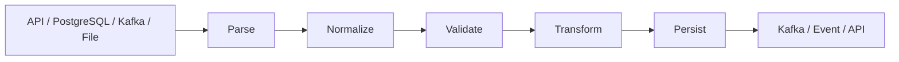

# 12- Map Filter Reduce

## Overview

`map()`, `filter()`, and `reduce()` are functional programming tools for transforming, selecting, and aggregating values.

They are built into Python except `reduce()`, which is provided by `functools`:

```python
from functools import reduce
```

Their conceptual roles are:

```text
map()    -> transform each value
filter() -> retain selected values
reduce() -> combine values into one result
```

Example:

```python
from functools import reduce

values = [1, 2, 3, 4, 5]

mapped = map(lambda value: value * 2, values)
filtered = filter(lambda value: value > 5, mapped)
total = reduce(lambda left, right: left + right, filtered, 0)
```

The pipeline is:

```text
[1, 2, 3, 4, 5]
       |
       v
     map()
       |
       v
[2, 4, 6, 8, 10]
       |
       v
   filter()
       |
       v
[6, 8, 10]
       |
       v
   reduce()
       |
       v
      24
```

These operations are especially useful when the data flow is naturally expressed as a sequence of transformations.

However, Python's functional style should remain idiomatic. A list comprehension, generator expression, `sum()`, or explicit loop is often clearer than forcing every operation into `map()`, `filter()`, or `reduce()`.

## Why `map`, `filter`, and `reduce` Matter

Backend systems frequently process collections:

- API records
- Database results
- Kafka events
- Configuration values
- Validation results
- File records
- Metrics
- Batch jobs
- Celery task inputs

The common data-processing pattern is:

```text
input collection
      |
      v
transform
      |
      v
select
      |
      v
aggregate
      |
      v
result
```

These operations provide explicit vocabulary for those stages.

The larger engineering value comes from **composable data transformations**, not from using these functions merely because they are functional-programming constructs.

## Comparison

| Operation | Purpose | Input | Output | Evaluation |
|---|---|---|---|---|
| `map()` | Transform each item | Iterable | Iterator | Lazy |
| `filter()` | Select matching items | Iterable | Iterator | Lazy |
| `reduce()` | Accumulate items | Iterable | Single value | During call |
| Comprehension | Transform/select | Iterable | Usually collection | Eager |
| Generator expression | Transform/select | Iterable | Generator | Lazy |
| `sum()` | Numeric aggregation | Iterable | Number | During call |

## `map()`

`map()` applies a callable to every item in an iterable.

```python
def normalize_email(email: str) -> str:
    return email.strip().lower()


emails = [
    " Alice@Example.com ",
    "BOB@example.com",
]

normalized = map(normalize_email, emails)

result = list(normalized)
```

Result:

```python
[
    "alice@example.com",
    "bob@example.com",
]
```

The general form is:

```python
map(function, iterable)
```

The function receives one item at a time.

## `map()` Is Lazy

In Python 3, `map()` returns an iterator.

```python
mapped = map(normalize_email, emails)
```

does not immediately construct a list containing all results.

The function is invoked as the iterator is consumed:

```python
for email in mapped:
    process(email)
```

Conceptually:

```text
map(...)
  |
  v
iterator
  |
  +--> next() -> transform item 1
  |
  +--> next() -> transform item 2
  |
  +--> next() -> transform item 3
```

This allows transformations to work with large or streaming inputs without materializing the entire result.

## `map()` with Multiple Iterables

`map()` can accept multiple iterables.

```python
prices = [100, 200, 300]
quantities = [2, 3, 4]

totals = map(
    lambda price, quantity: price * quantity,
    prices,
    quantities,
)
```

The callable receives corresponding elements:

```text
price       quantity
 100    +      2
          |
          v
        200

 200    +      3
          |
          v
        600

 300    +      4
          |
          v
       1200
```

Iteration stops when the shortest iterable is exhausted.

For:

```python
prices = [100, 200, 300]
quantities = [2, 3]
```

the third price is never processed.

## `map()` and `None`

The callable must accept the number of arguments corresponding to the iterables.

This works:

```python
result = map(
    lambda first, second: first + second,
    [1, 2, 3],
    [10, 20, 30],
)
```

This fails:

```python
result = map(
    lambda value: value * 2,
    [1, 2],
    [10, 20],
)
```

because the lambda accepts one argument while `map()` supplies two.

## `map()` vs List Comprehension

These are often equivalent:

```python
result = list(map(normalize_email, emails))
```

and:

```python
result = [
    normalize_email(email)
    for email in emails
]
```

For straightforward transformations, the comprehension is often more idiomatic and easier to read.

Use `map()` when it makes the callable-based transformation clearer:

```python
normalized = map(normalize_email, emails)
```

The choice should primarily be based on readability and evaluation requirements.

## `map()` with Built-in Functions

`map()` can be concise when using existing functions:

```python
values = ["10", "20", "30"]

numbers = map(int, values)

result = list(numbers)
```

Another example:

```python
names = ["alice", "bob", "charlie"]

normalized = map(str.upper, names)
```

This can be cleaner than writing a lambda:

```python
normalized = map(lambda name: name.upper(), names)
```

## `map()` with `operator`

The `operator` module provides callable versions of common operations.

```python
from operator import attrgetter

users = load_users()

names = map(attrgetter("name"), users)
```

This can be useful when the transformation is simply attribute access.

For dictionaries:

```python
from operator import itemgetter

rows = [
    {"id": 1, "name": "alice"},
    {"id": 2, "name": "bob"},
]

ids = map(itemgetter("id"), rows)
```

## `filter()`

`filter()` retains elements for which a predicate returns a truthy value.

```python
def is_active(user: dict) -> bool:
    return user["active"]


users = [
    {"name": "alice", "active": True},
    {"name": "bob", "active": False},
    {"name": "carol", "active": True},
]

active_users = filter(is_active, users)

result = list(active_users)
```

The general form is:

```python
filter(predicate, iterable)
```

## `filter()` Is Lazy

Like `map()`, `filter()` returns an iterator.

```python
active_users = filter(is_active, users)
```

does not immediately evaluate every element into a list.

Values are tested as the iterator is consumed.

```text
input
  |
  v
predicate
  |
  +---- false ----> discard
  |
  +---- true -----> yield
```

This is useful for large inputs and streaming pipelines.

## `filter()` with `None`

If the function argument is `None`, `filter()` retains truthy elements.

```python
values = [
    0,
    1,
    "",
    "hello",
    None,
    False,
    True,
]

result = list(filter(None, values))
```

Result:

```python
[1, "hello", True]
```

This is concise but should be used only when Python truthiness is exactly the desired business rule.

Do not use it when `0`, `False`, `""`, or `None` have different domain meanings.

## `filter()` vs Comprehension

These are equivalent:

```python
active_users = list(
    filter(is_active, users)
)
```

and:

```python
active_users = [
    user
    for user in users
    if is_active(user)
]
```

The comprehension is often clearer when the predicate is complex:

```python
active_users = [
    user
    for user in users
    if user["active"]
    and user["email_verified"]
]
```

## Combining `map()` and `filter()`

A common pattern is:

```python
normalized = map(normalize_email, emails)

valid = filter(is_valid_email, normalized)

result = list(valid)
```

The pipeline is lazy until `list()` consumes it.

```text
emails
  |
  v
map(normalize)
  |
  v
filter(valid)
  |
  v
list()
  |
  v
materialized result
```

This avoids storing intermediate collections.

## Pipeline Example

Consider processing customer records:

```python
def normalize_email(email: str) -> str:
    return email.strip().lower()


def has_valid_email(email: str) -> bool:
    return "@" in email


emails = load_emails()

result = list(
    filter(
        has_valid_email,
        map(normalize_email, emails),
    )
)
```

A generator expression can often communicate the same pipeline more naturally:

```python
result = [
    normalized
    for normalized in (
        normalize_email(email)
        for email in emails
    )
    if has_valid_email(normalized)
]
```

For complex pipelines, named functions and explicit stages are usually easier to maintain than deeply nested expressions.

## `reduce()`

`reduce()` repeatedly applies a two-argument function to an iterable to produce a single accumulated result.

It is imported from `functools`:

```python
from functools import reduce
```

Example:

```python
from functools import reduce


values = [1, 2, 3, 4]

total = reduce(
    lambda accumulator, value: accumulator + value,
    values,
    0,
)
```

Result:

```text
10
```

Conceptually:

```text
initial = 0

0 + 1 -> 1
1 + 2 -> 3
3 + 3 -> 6
6 + 4 -> 10
```

## `reduce()` Without an Initial Value

The initial value is optional.

```python
from functools import reduce


result = reduce(
    lambda left, right: left + right,
    [1, 2, 3, 4],
)
```

Python uses the first element as the initial accumulator:

```text
1 + 2 -> 3
3 + 3 -> 6
6 + 4 -> 10
```

For empty input:

```python
reduce(function, [])
```

raises:

```text
TypeError
```

Providing an appropriate identity value can make the operation defined for empty input:

```python
reduce(function, [], 0)
```

## Identity Values

The initial value should usually be the identity element for the operation.

Examples:

| Operation | Identity |
|---|---:|
| Addition | `0` |
| Multiplication | `1` |
| String concatenation | `""` |
| List concatenation | `[]` |
| Set union | `set()` |

For example:

```python
total = reduce(
    lambda total, value: total + value,
    values,
    0,
)
```

The identity allows an empty input to produce a meaningful result.

## `reduce()` and Associativity

Reduction is especially useful when the operation is associative:

```text
(a + b) + c == a + (b + c)
```

Examples include:

- Addition
- Multiplication
- Set union

Non-associative operations require more care:

```text
(a - b) - c
```

is not generally equal to:

```text
a - (b - c)
```

This matters when designing parallel or distributed reductions.

## `reduce()` and Parallelism

An associative reduction can often be grouped:

```text
a + b + c + d
      |
      v
(a + b) + (c + d)
      |
      v
    result
```

This is one reason reduction is important in distributed data processing.

However, Python's `functools.reduce()` itself does not parallelize the computation.

For large distributed workloads, systems such as Spark or distributed SQL engines implement their own aggregation strategies.

## Prefer Specialized Built-ins

Many common reductions should use specialized built-ins.

Prefer:

```python
total = sum(values)
```

over:

```python
total = reduce(
    lambda left, right: left + right,
    values,
    0,
)
```

Prefer:

```python
has_active = any(
    user["active"]
    for user in users
)
```

over:

```python
has_active = reduce(
    lambda result, user: result or user["active"],
    users,
    False,
)
```

Prefer:

```python
all_valid = all(
    validate(user)
    for user in users
)
```

over a custom reduction.

Specialized built-ins communicate intent better and often provide optimized implementations.

## `map()`, `filter()`, and `reduce()` Together

The three operations can represent a classic transformation pipeline:

```text
                    map
input ────────────────┐
                      v
                 transformed
                      |
                      v
                   filter
                      |
                      v
                   selected
                      |
                      v
                   reduce
                      |
                      v
                   aggregate
```

Example:

```python
from functools import reduce


orders = load_orders()

totals = map(
    lambda order: order.total,
    orders,
)

completed = filter(
    lambda total: total > 0,
    totals,
)

revenue = reduce(
    lambda total, value: total + value,
    completed,
    0,
)
```

In production code, however, this could be clearer as:

```python
revenue = sum(
    order.total
    for order in orders
    if order.total > 0
)
```

The second version makes the business operation easier to understand.

## `map()` and API Processing

Suppose a REST API returns records:

```python
def to_response(user) -> dict:
    return {
        "id": user.id,
        "email": user.email,
        "active": user.active,
    }


responses = map(to_response, users)
```

If the framework needs a list:

```python
return list(responses)
```

If the response layer supports streaming or another lazy consumer, materialization may not be necessary.

Do not assume laziness automatically improves API performance. Serialization, network transfer, and framework behavior may dominate the cost.

## `filter()` and Authorization

Filtering can represent simple selection logic:

```python
def visible_to(user, requester) -> bool:
    return (
        user.organization_id == requester.organization_id
        and not user.deleted
    )


visible_users = filter(
    lambda user: visible_to(user, requester),
    users,
)
```

However, authorization is security-sensitive.

For large datasets, do not retrieve every user and filter in Python when the same constraint can safely be enforced by PostgreSQL.

Prefer:

```sql
SELECT id, email
FROM users
WHERE organization_id = $1
  AND deleted = FALSE;
```

Database-side filtering reduces both data exposure and application workload.

## `map()` and Database Results

Functional transformations can be useful after retrieving an appropriately scoped result set:

```python
rows = repository.get_completed_orders(
    customer_id=customer_id,
)

responses = map(to_order_response, rows)
```

The repository should already enforce the required database filtering.

Do not use `map()` or `filter()` to compensate for inefficient queries.

## `filter()` and PostgreSQL Pushdown

Consider:

```python
orders = repository.get_all_orders()

completed = filter(
    lambda order: order.status == "completed",
    orders,
)
```

If millions of orders are returned, this is inefficient.

Prefer:

```python
orders = repository.get_orders(
    status="completed",
)
```

which translates the selection to the database.

The general rule is:

```text
Database-native operation
        |
        v
push down filtering/aggregation when appropriate

Python
        |
        v
domain-specific transformation
```

## `map()` and Kafka

Kafka consumers often process one event at a time:

```python
for message in consumer:
    event = parse_event(message)
    normalized = normalize_event(event)
    process_event(normalized)
```

A `map()` abstraction is possible:

```python
events = map(
    parse_event,
    consumer,
)
```

But event-processing systems usually need explicit control over:

- Offset commits
- Retries
- Dead-letter queues
- Backpressure
- Idempotency
- Ordering

Therefore, a straightforward loop is often better than a functional abstraction that hides these operational concerns.

## `map()` and Celery

For independent data transformations:

```python
payloads = map(build_payload, records)
```

The transformation can remain pure before tasks are submitted.

However, do not confuse:

```python
map()
```

with parallel execution.

`map()` does not create threads, processes, or distributed tasks.

For parallel execution, use an appropriate mechanism such as:

- `ThreadPoolExecutor`
- `ProcessPoolExecutor`
- `asyncio`
- Celery
- Distributed compute frameworks

## Laziness and Backpressure

Because `map()` and `filter()` are lazy, they can process values incrementally.

```python
processed = filter(
    is_valid,
    map(transform, source),
)

for item in processed:
    write(item)
```

The pipeline does not need to materialize all transformed values.

This can reduce memory pressure:

```text
source
  |
  v
transform one item
  |
  v
validate one item
  |
  v
write one item
  |
  v
next item
```

However, this is not automatically backpressure across distributed systems.

True backpressure depends on the source and downstream consumer.

## Materializing the Result

Calling:

```python
list(mapped)
```

forces complete evaluation.

Similarly:

```python
tuple(mapped)
```

and:

```python
set(mapped)
```

consume the iterator.

Materialization is appropriate when:

- Random access is required.
- Multiple iterations are required.
- The result must be serialized.
- The result is small enough to hold in memory.
- A framework requires a concrete collection.

Avoid materializing unbounded or very large streams without an explicit memory strategy.

## Iterator Exhaustion

Because `map()` and `filter()` return iterators:

```python
mapped = map(transform, values)

first = list(mapped)
second = list(mapped)
```

produces:

```python
first  # transformed values
second # []
```

The iterator has been exhausted.

If repeated access is required:

```python
mapped = [
    transform(value)
    for value in values
]
```

or recreate the iterator.

## Generator Expressions as an Alternative

Generator expressions often provide equivalent lazy behavior with more readable syntax.

Instead of:

```python
total = sum(
    map(
        calculate_total,
        orders,
    )
)
```

you can write:

```python
total = sum(
    calculate_total(order)
    for order in orders
)
```

Instead of:

```python
valid = filter(is_valid, records)
```

you can write:

```python
valid = (
    record
    for record in records
    if is_valid(record)
)
```

The choice depends on which representation makes the transformation clearer.

## `map()` vs `for` Loop

A loop is often better when the operation has multiple steps:

```python
results = []

for record in records:
    normalized = normalize(record)

    if not is_valid(normalized):
        continue

    enriched = enrich(normalized)
    results.append(enriched)
```

Trying to encode this as nested `map()` and `filter()` calls can reduce readability.

Functional programming should simplify the data flow, not obscure it.

## `filter()` vs Conditional Logic

For simple predicates:

```python
active = filter(is_active, users)
```

is concise.

For complex business rules:

```python
def is_eligible(user) -> bool:
    if user.is_deleted:
        return False

    if not user.email_verified:
        return False

    if user.account_status != "active":
        return False

    return user.age >= 18
```

A named predicate is usually better than a large lambda.

## `reduce()` for Domain Aggregation

`reduce()` can be appropriate for structured accumulation.

For example:

```python
from functools import reduce


def merge_counts(
    accumulator: dict[str, int],
    event: dict[str, str],
) -> dict[str, int]:
    event_type = event["type"]

    return {
        **accumulator,
        event_type: accumulator.get(event_type, 0) + 1,
    }


counts = reduce(
    merge_counts,
    events,
    {},
)
```

However, repeatedly copying dictionaries can be expensive.

An explicit loop may be both clearer and more efficient:

```python
counts: dict[str, int] = {}

for event in events:
    event_type = event["type"]
    counts[event_type] = counts.get(event_type, 0) + 1
```

The functional abstraction is not automatically superior.

## Mutation During Reduction

An accumulator can be mutated:

```python
def collect(accumulator, value):
    accumulator.append(value)
    return accumulator
```

This can be efficient but weakens the functional style.

A pure reduction would construct new values:

```python
def collect(accumulator, value):
    return accumulator + [value]
```

But repeated list copying is potentially `O(n²)`.

This illustrates an important engineering principle:

> Functional purity and algorithmic efficiency are separate concerns.

Use the representation that provides the required correctness and performance.

## Complexity

For `n` input elements, a simple `map()` or `filter()` pipeline is generally:

```text
Time:  O(n)
Space: O(1) auxiliary iterator state
```

when consumed lazily and when the transformation itself is `O(1)`.

Materializing results changes memory characteristics:

```python
list(map(transform, values))
```

typically requires:

```text
Space: O(n)
```

`reduce()` is generally:

```text
Time:  O(n)
Space: O(1)
```

for a constant-size accumulator.

But if the accumulator grows with input size, such as a list or dictionary, total memory becomes `O(n)`.

## Performance Considerations

Do not assume:

```python
map()
```

is always faster than:

```python
for
```

or:

```python
list comprehension
```

Performance depends on:

- Function-call overhead
- Built-in vs Python callable
- Allocation
- Iterator behavior
- Data size
- Work performed per element
- Materialization
- Cache locality

For example:

```python
list(map(str.upper, names))
```

may perform differently from:

```python
[name.upper() for name in names]
```

Measure representative workloads if performance matters.

## Lazy Evaluation and Memory

Consider one million records.

Eager:

```python
normalized = [
    normalize(record)
    for record in records
]
```

The entire result is retained.

Lazy:

```python
normalized = map(
    normalize,
    records,
)
```

Only the current item needs to be produced by the iterator.

This can significantly reduce peak memory when downstream processing is also incremental.

## Pipeline Fusion

Consider:

```python
mapped = map(transform, records)
filtered = filter(is_valid, mapped)

for record in filtered:
    write(record)
```

The operations can be processed incrementally without constructing intermediate lists.

Conceptually:

```text
record 1 -> transform -> validate -> write
record 2 -> transform -> validate -> write
record 3 -> transform -> validate -> write
```

This is more memory-efficient than:

```python
mapped = [transform(record) for record in records]
filtered = [record for record in mapped if is_valid(record)]

for record in filtered:
    write(record)
```

The eager version creates intermediate collections.

## Exception Behavior

Exceptions raised by the mapped function occur during iteration:

```python
mapped = map(parse_record, records)
```

Creating `mapped` does not necessarily call `parse_record()`.

The exception appears when the iterator is consumed:

```python
for record in mapped:
    ...
```

Similarly, `filter()` evaluates its predicate during consumption.

This delayed failure timing matters for error handling.

## Exception Handling in Pipelines

Avoid hiding transformation failures:

```python
def safe_transform(record):
    try:
        return transform(record)
    except Exception:
        return None
```

unless `None` has a deliberate and documented meaning.

A safer approach is often to handle errors at the pipeline boundary:

```python
for record in records:
    try:
        result = transform(record)
    except InvalidRecordError:
        handle_invalid(record)
        continue

    write(result)
```

This preserves operational visibility.

## Security Considerations

Functional operations should not bypass security boundaries.

For authorization-sensitive filtering:

```python
visible = filter(
    lambda resource: can_access(user, resource),
    resources,
)
```

is not sufficient if the full dataset was already fetched from an untrusted or sensitive source.

Prefer enforcing access constraints as early as possible.

For database-backed systems:

```text
request
   |
   v
authorization policy
   |
   v
parameterized SQL query
   |
   v
scoped rows
   |
   v
Python transformation
```

This reduces accidental data exposure.

Never construct SQL using string interpolation merely because a functional pipeline is being used elsewhere.

## Observability

Functional transformations can make individual stages explicit enough to instrument.

For example:

```python
def normalize_record(record):
    result = normalize(record)

    metrics.increment("records.normalized")

    return result
```

But instrumentation introduces side effects.

For a strongly functional core, keep metrics at the application boundary or use a dedicated instrumentation layer.

Important production metrics may include:

- Records processed
- Records rejected
- Transformation latency
- Batch size
- Error count
- Queue lag
- Throughput
- Memory usage

## Reliability Considerations

Functional pipelines can make transformations deterministic, but backend reliability still depends on the surrounding system.

For example:

```python
for event in events:
    transformed = transform(event)
    repository.save(transformed)
```

The transformation may be pure, but persistence can fail.

Reliable processing may still require:

- Retries
- Idempotency
- Transactions
- Dead-letter queues
- Checkpointing
- Offset management
- Backpressure

`map()`, `filter()`, and `reduce()` do not provide these guarantees.

## Distributed Systems

A local functional pipeline:

```python
result = reduce(combine, values, initial)
```

is fundamentally different from distributed aggregation.

Distributed processing must account for:

- Partitioning
- Ordering
- Fault tolerance
- Partial failure
- Serialization
- Network transfer
- Duplicate processing
- Retry semantics

An operation that is mathematically associative may be suitable for distributed aggregation, but Python's `reduce()` itself provides none of these distributed guarantees.

## Testing

Test the callable independently whenever possible.

```python
def normalize_email(email: str) -> str:
    return email.strip().lower()
```

Then:

```python
def test_normalize_email():
    assert normalize_email(" Alice@Example.com ") == (
        "alice@example.com"
    )
```

Test pipeline behavior separately:

```python
def test_valid_emails_are_selected():
    emails = [
        "alice@example.com",
        "invalid",
    ]

    result = list(
        filter(
            is_valid_email,
            map(normalize_email, emails),
        )
    )

    assert result == ["alice@example.com"]
```

For `reduce()`, test:

- Empty input
- Single input
- Multiple inputs
- Identity behavior
- Invalid values
- Overflow or numeric edge cases where relevant

## Property-Based Testing

Functional transformations are often good candidates for property-based tests.

For a normalization function:

```text
normalize(normalize(x)) == normalize(x)
```

For an aggregation:

```text
aggregate(xs + ys) == combine(aggregate(xs), aggregate(ys))
```

only when the aggregation semantics support such decomposition.

These properties are particularly useful when transformations become part of data-processing pipelines.

## Common Mistakes

### Assuming `map()` Returns a List

It returns an iterator.

Use:

```python
list(map(...))
```

when materialization is required.

### Reusing an Exhausted Iterator

```python
mapped = map(transform, values)

list(mapped)
list(mapped)
```

The second result is empty.

### Using `filter(None, ...)` Without Understanding Truthiness

Values such as `0`, `False`, and `""` are removed.

### Using `reduce()` for Simple Aggregations

Prefer:

```python
sum()
```

```python
any()
```

```python
all()
```

or another specialized operation when appropriate.

### Replacing Every Loop with Functional Operations

Complex business workflows are often clearer as explicit loops.

### Using Lambdas for Complex Business Rules

Prefer named functions:

```python
def is_eligible_customer(customer):
    ...
```

### Ignoring Lazy Exception Timing

Transformation errors may occur during consumption rather than when `map()` or `filter()` is created.

### Materializing Huge Pipelines

Calling `list()` on a large or unbounded iterator can cause severe memory pressure.

### Filtering Large Database Results in Python

Push filtering to PostgreSQL when appropriate.

### Assuming `map()` Provides Parallelism

It does not.

### Assuming Functional Style Eliminates Side Effects

The surrounding system still performs I/O and mutations.

### Using Immutable Accumulators Inefficiently

Repeatedly copying large lists or dictionaries inside `reduce()` can create poor algorithmic complexity.

## Production Pitfalls

| Pitfall | Impact | Better approach |
|---|---|---|
| `list(map(...))` on huge input | High memory usage | Stream or batch |
| `filter(None, values)` | Unexpected data loss | Use explicit predicate |
| `reduce()` for simple sum | Poor readability | Use `sum()` |
| Nested functional expressions | Hard debugging | Use named stages |
| Python filtering of huge DB results | CPU/memory/network waste | Push down to SQL |
| Assuming laziness means backpressure | Queue/source overload | Design explicit backpressure |
| Assuming `map()` is parallel | No concurrency | Use concurrency primitives |
| Reusing iterators | Empty subsequent results | Recreate or materialize intentionally |
| Stateful callable shared across workers | Race conditions | Isolate state |
| Exceptions hidden inside transformation | Silent data loss | Preserve/handle explicitly |
| Huge accumulator in `reduce()` | Memory/performance issues | Use efficient aggregation |
| Functional code hides I/O | Difficult operations | Keep side effects explicit |

## Backend Data Processing Pattern

A practical backend pipeline often looks like:



The functional portion is typically:

```text
Parse -> Normalize -> Validate -> Transform
```

while infrastructure operations remain explicit:

```text
Source -> Persistence -> Messaging
```

This separation makes business transformations easier to test and reason about.

## Practical ETL Example

Consider processing a large input stream:

```python
from collections.abc import Iterable, Iterator


def normalize_record(record: dict) -> dict:
    return {
        "email": record["email"].strip().lower(),
        "amount": float(record["amount"]),
    }


def is_valid_record(record: dict) -> bool:
    return (
        "@" in record["email"]
        and record["amount"] >= 0
    )


def transform_records(
    records: Iterable[dict],
) -> Iterator[dict]:
    normalized = map(normalize_record, records)

    return filter(
        is_valid_record,
        normalized,
    )
```

Usage:

```python
for record in transform_records(raw_records):
    persist(record)
```

The pipeline is lazy and does not require all records in memory.

For production ETL, add:

- Batch boundaries
- Error handling
- Dead-letter handling
- Metrics
- Checkpointing
- Retry policy
- Idempotent writes

## Batch Processing

Lazy pipelines can feed bounded batches.

```python
from itertools import islice


def batched(iterable, size: int):
    iterator = iter(iterable)

    while batch := list(islice(iterator, size)):
        yield batch
```

Usage:

```python
records = transform_records(raw_records)

for batch in batched(records, 500):
    persist_batch(batch)
```

This provides bounded memory usage while allowing efficient database or API batch operations.

## `map()` with `starmap()`

When arguments are already grouped:

```python
from itertools import starmap


pairs = [
    (10, 2),
    (20, 3),
    (30, 4),
]


def calculate_total(price: int, quantity: int) -> int:
    return price * quantity


totals = starmap(
    calculate_total,
    pairs,
)
```

`starmap()` is often cleaner than:

```python
map(
    lambda pair: calculate_total(pair[0], pair[1]),
    pairs,
)
```

This is an example of using the standard library to express transformation intent clearly.

## `functools.partial` with `map()`

`partial()` can bind configuration:

```python
from functools import partial


def apply_tax(rate: Decimal, amount: Decimal) -> Decimal:
    return amount * (1 + rate)


apply_standard_tax = partial(
    apply_tax,
    Decimal("0.18"),
)

taxed = map(
    apply_standard_tax,
    amounts,
)
```

This is useful when a transformation needs fixed configuration.

## Choosing the Right Tool

| Requirement | Recommended approach |
|---|---|
| Simple transformation | Comprehension or `map()` |
| Simple selection | Comprehension or `filter()` |
| Numeric total | `sum()` |
| Any matching item | `any()` |
| All matching items | `all()` |
| Complex multi-step logic | Explicit loop |
| Lazy transformation | `map()` / generator |
| Lazy filtering | `filter()` / generator |
| General accumulation | `reduce()` when it improves clarity |
| Database filtering | SQL |
| Large stream | Iterator/generator + batching |
| Parallel execution | Concurrency/distributed framework |

## Senior Engineering Heuristics

### Prefer Clarity Over Functional Purity

This:

```python
total = sum(
    order.total
    for order in orders
    if order.status == "completed"
)
```

is often better than a three-stage `map()`/`filter()`/`reduce()` chain.

### Keep Business Rules Named

Prefer:

```python
filter(is_eligible, users)
```

over:

```python
filter(
    lambda user: (
        user.active
        and user.verified
        and not user.deleted
    ),
    users,
)
```

when the rule has domain significance.

### Push Work to the Right Layer

Use PostgreSQL for database-native filtering and aggregation.

Use Python for domain-specific transformation.

Use Kafka/Celery or other infrastructure for asynchronous or distributed processing.

### Preserve Laziness Intentionally

Laziness is useful when:

- Input is large.
- Processing is streaming.
- Downstream consumption is incremental.

Materialize when:

- Multiple passes are required.
- Random access is needed.
- The framework requires a collection.
- The dataset is known to be small enough.

### Measure Before Optimizing

Do not select `map()` because it "sounds faster".

Benchmark representative workloads when performance is important.

### Treat `reduce()` as a Specialized Tool

`reduce()` is powerful but less readable than Python's specialized aggregation functions in many common cases.

### Keep Side Effects at the Boundary

Prefer:

```python
transformed = transform(record)
persist(transformed)
```

over a transformation function that secretly performs database writes or publishes events.

## Interview Traps

### What Does `map()` Return in Python 3?

A lazy iterator.

### What Does `filter()` Return?

A lazy iterator containing elements for which the predicate evaluates to truthy.

### Is `reduce()` Built Into the Global Namespace?

No. It is provided by `functools`:

```python
from functools import reduce
```

### What Happens if `map()` Is Created but Never Consumed?

The mapped function is not applied to the elements.

```python
mapped = map(transform, values)
```

does not process the entire input immediately.

### When Does a Mapping Exception Occur?

Usually when the iterator is consumed and the failing element is reached.

### What Happens When the Iterables Passed to `map()` Have Different Lengths?

With multiple iterables, iteration stops when the shortest iterable is exhausted.

### Does `filter(None, values)` Keep `None`?

No.

It keeps truthy values and discards falsey values, including `None`, `False`, `0`, empty strings, and empty collections.

### What Happens if `reduce()` Receives an Empty Iterable Without an Initial Value?

It raises `TypeError`.

### Why Provide an Initial Value to `reduce()`?

It defines the initial accumulator and can provide a meaningful result for empty input.

### Why Is `sum()` Usually Better Than `reduce()` for Addition?

It directly communicates the operation and is specialized for numeric aggregation.

### Does `map()` Run in Parallel?

No.

It performs lazy sequential iteration.

### Is `map()` Always Faster Than a Loop?

No.

Performance depends on the callable, workload, allocation behavior, and surrounding code.

### Does Functional Programming Eliminate Mutation?

No.

Python supports mutation, and functional style is a design approach rather than a language restriction.

### When Should You Avoid `map()` and `filter()`?

When the resulting expression becomes harder to understand than a comprehension or explicit loop.

### Why Can Lazy Pipelines Reduce Memory Usage?

They produce values incrementally rather than materializing every intermediate result.

### Does Laziness Guarantee Backpressure?

No.

Python iterators provide lazy production, but system-level backpressure depends on the source, queues, network, and downstream consumers.

### Why Should Large Database Filtering Usually Happen in SQL?

Because PostgreSQL can reduce rows before transferring them to Python, lowering network traffic, memory usage, and application CPU.

### Can `reduce()` Be Used for Distributed Aggregation?

The mathematical operation may be suitable if it has appropriate properties such as associativity, but `functools.reduce()` itself is local and does not provide distributed execution or fault tolerance.

## Key Takeaways

- `map()` transforms values lazily, `filter()` selects values lazily, and `reduce()` combines values into an aggregate; all three are tools for expressing data flow.
- Prefer Python's clearer alternatives when appropriate: comprehensions for simple transformations, generator expressions for lazy pipelines, and `sum()`, `any()`, or `all()` for common reductions.
- Laziness can reduce memory usage and support streaming, but `map()` and `filter()` do not provide parallelism, distributed execution, or automatic backpressure.
- In backend systems, push database-native filtering and aggregation to PostgreSQL, keep domain transformations independently testable, and keep external side effects explicit.
- Use `reduce()` selectively and design pipelines around clarity, algorithmic complexity, exception behavior, resource usage, and operational requirements rather than functional style for its own sake.