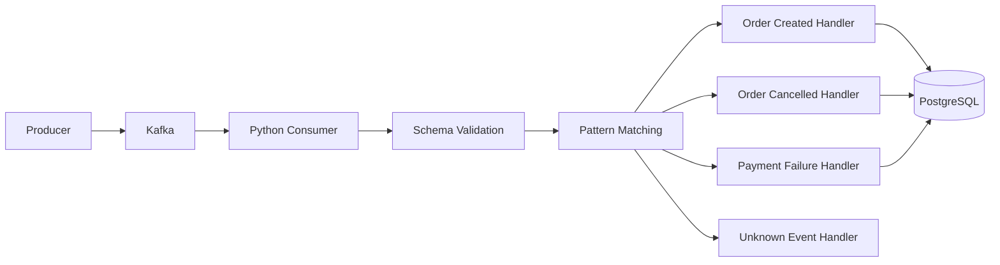
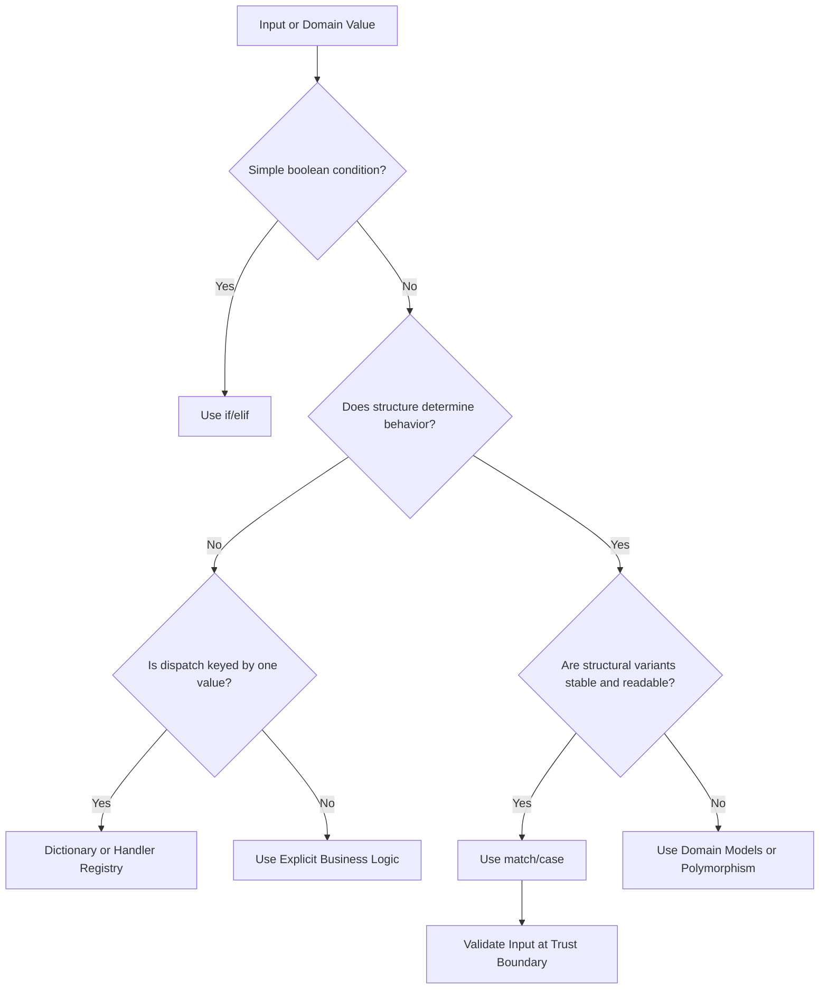

# 14- Pattern Matching

## Overview

Structural pattern matching is Python's `match`/`case` control-flow mechanism introduced in Python 3.10 through PEP 634.

It allows code to select behavior based on the **structure and content** of a value rather than relying only on boolean conditions.

A basic example:

```python
match event:
    case ("order.created", order_id):
        process_created_order(order_id)

    case ("order.cancelled", order_id):
        cancel_order(order_id)

    case _:
        handle_unknown_event(event)
```

Pattern matching is particularly useful when backend code needs to process values with multiple possible shapes:

- API request variants
- Event payloads
- Command objects
- State transitions
- Configuration structures
- Parsed protocol messages
- AST-like structures
- Domain objects
- Results from parsers

Pattern matching is not simply a more compact `if` statement. It performs **structural matching**, can destructure values, supports guards, and can enforce exhaustiveness patterns through careful design.

## Why Pattern Matching Exists

Before Python 3.10, structured branching was commonly written using:

```python
if event["type"] == "order.created":
    ...
elif event["type"] == "order.cancelled":
    ...
else:
    ...
```

or:

```python
if isinstance(command, CreateUser):
    ...
elif isinstance(command, DeleteUser):
    ...
```

These approaches remain valid.

Pattern matching provides a dedicated syntax when the decision depends on both:

1. The shape of a value.
2. The values contained within that shape.

For example:

```python
match command:
    case CreateUser(email=email):
        create_user(email)

    case DeleteUser(user_id=user_id):
        delete_user(user_id)
```

The code expresses the structure of the input directly.

## Basic Syntax

The general form is:

```python
match subject:
    case pattern:
        body
    case pattern:
        body
    case _:
        body
```

Example:

```python
def describe_status(status: int) -> str:
    match status:
        case 200:
            return "success"
        case 404:
            return "not found"
        case 500:
            return "server error"
        case _:
            return "other"
```

The `match` subject is evaluated once, and Python evaluates the cases in order.

The first matching case executes.

## `match` Is Not `switch`

Pattern matching is more powerful than a traditional switch statement.

A switch typically compares one value against constants:

```text
value == constant
```

Python pattern matching can inspect:

- Literal values
- Types
- Sequences
- Mappings
- Classes
- Nested structures
- OR patterns
- Guards
- Captured values

For example:

```python
match response:
    case {"status": 200, "data": data}:
        return data

    case {"status": 404}:
        return None

    case _:
        raise ValueError("Unexpected response")
```

The structure of the dictionary is part of the condition.

## Literal Patterns

Literal patterns match exact values.

```python
match status:
    case 200:
        return "OK"
    case 201:
        return "Created"
    case 404:
        return "Not Found"
```

Supported literals include common Python literal values such as:

- Integers
- Strings
- Booleans
- `None`
- Floats
- Some other literal forms

A literal pattern does not bind a variable.

## The Wildcard Pattern

The underscore:

```python
case _:
```

matches anything.

It is commonly used as the default branch:

```python
match command:
    case "start":
        start_service()
    case "stop":
        stop_service()
    case _:
        raise ValueError("Unknown command")
```

Unlike an ordinary variable capture, `_` does not bind the matched value.

## Variable Capture

A bare name in a pattern usually captures the matched value.

```python
match value:
    case x:
        print(x)
```

This matches any value and binds it to `x`.

Therefore:

```python
case x:
```

is effectively a catch-all pattern.

It is not equivalent to:

```python
case SomeConstant:
```

This is an important source of mistakes.

## Constants in Patterns

Suppose:

```python
OK = 200
```

This does not make:

```python
case OK:
```

a constant-value pattern in the way many developers expect. A bare name in a pattern is generally a capture pattern, not a value lookup.

For named constants, use a qualified name:

```python
from http import HTTPStatus


match status:
    case HTTPStatus.OK:
        return "success"
```

This distinction is important when writing production pattern matching.

## OR Patterns

Multiple alternatives can be combined using `|`:

```python
match status:
    case 200 | 201 | 204:
        return "success"

    case 400 | 401 | 403:
        return "client_error"

    case 500 | 502 | 503:
        return "server_error"
```

All alternatives must bind compatible names.

For example:

```python
match value:
    case ("user", user_id) | ("customer", user_id):
        process_user(user_id)
```

Both alternatives bind `user_id`.

## AS Patterns

`as` allows a pattern to match structurally while also capturing the entire value.

```python
match event:
    case ("order.created", order_id) as full_event:
        process_event(
            event=full_event,
            order_id=order_id,
        )
```

Here:

```text
full_event -> entire tuple
order_id   -> second element
```

This is useful when both the decomposed fields and original object are needed.

## Sequence Patterns

Sequence patterns match sequence-like structures.

```python
match coordinates:
    case [x, y]:
        return x, y
```

The same general pattern can match tuple-like sequences:

```python
match coordinates:
    case (x, y):
        return x, y
```

Pattern matching can therefore combine matching and unpacking.

## Sequence Length Matters

This pattern:

```python
case [x, y]:
```

requires two elements.

It does not match:

```python
[1, 2, 3]
```

To capture additional values:

```python
match values:
    case [first, *rest]:
        ...
```

The `*rest` portion captures remaining sequence elements.

## Star Patterns

A starred pattern can capture zero or more remaining elements:

```python
match values:
    case [first, *middle, last]:
        ...
```

For:

```python
[1, 2, 3, 4]
```

the bindings are:

```text
first  -> 1
middle -> [2, 3]
last   -> 4
```

This resembles extended unpacking but occurs inside a pattern.

## Mapping Patterns

Mappings can be matched by keys:

```python
match payload:
    case {"type": "user.created"}:
        process_user_created(payload)
```

Values can also be captured:

```python
match payload:
    case {
        "type": "user.created",
        "user_id": user_id,
    }:
        process_user(user_id)
```

The mapping must contain the specified keys.

## Mapping Patterns Do Not Require Exact Keys

Consider:

```python
payload = {
    "type": "user.created",
    "user_id": 42,
    "timestamp": "...",
}
```

This can match:

```python
case {
    "type": "user.created",
    "user_id": user_id,
}:
```

The additional `timestamp` key does not prevent a match.

This differs from exact dictionary equality.

## Capturing the Remaining Mapping

The double-star pattern can capture remaining mapping entries:

```python
match payload:
    case {
        "type": event_type,
        **metadata,
    }:
        process_event(
            event_type,
            metadata,
        )
```

The captured `metadata` contains the remaining mapping entries.

This can be useful for event metadata but should be used carefully when schemas are expected to be strict.

## Nested Patterns

Patterns can be composed.

```python
match response:
    case {
        "status": 200,
        "data": {
            "user": {
                "id": user_id,
            }
        },
    }:
        return user_id
```

This can express deeply nested structure directly.

However, deep structural matching can become difficult to maintain.

If a payload contains many nested fields, validating it into a domain model is often a better architectural boundary.

## Class Patterns

Pattern matching can inspect objects using class patterns.

```python
class User:
    def __init__(self, user_id: int, email: str):
        self.user_id = user_id
        self.email = email
```

A class pattern can match:

```python
match user:
    case User(user_id=user_id, email=email):
        send_email(
            user_id=user_id,
            email=email,
        )
```

The attributes used by the pattern depend on the class's pattern-matching configuration.

## `__match_args__`

Positional class patterns depend on `__match_args__`.

For example:

```python
class User:
    __match_args__ = ("user_id", "email")

    def __init__(self, user_id: int, email: str):
        self.user_id = user_id
        self.email = email
```

Now:

```python
match user:
    case User(user_id, email):
        ...
```

can match positional attributes according to `__match_args__`.

Keyword patterns are generally more explicit:

```python
case User(user_id=user_id, email=email):
```

For production code, explicit keyword patterns often communicate intent better.

## Dataclasses and Pattern Matching

Dataclasses work naturally with class patterns.

```python
from dataclasses import dataclass


@dataclass(frozen=True)
class CreateUser:
    email: str
    active: bool = True
```

Pattern matching:

```python
match command:
    case CreateUser(email=email, active=True):
        activate_user(email)

    case CreateUser(email=email):
        create_inactive_user(email)
```

This combines:

- Type matching
- Attribute matching
- Value matching
- Variable capture

## Pattern Matching with Enums

Enums provide a strong alternative to string-based branching.

```python
from enum import Enum


class OrderStatus(Enum):
    CREATED = "created"
    PAID = "paid"
    CANCELLED = "cancelled"
```

Then:

```python
match status:
    case OrderStatus.CREATED:
        initialize_order()

    case OrderStatus.PAID:
        fulfill_order()

    case OrderStatus.CANCELLED:
        refund_order()
```

Using qualified enum members avoids the ambiguity of bare names.

## Guards

A guard adds an additional boolean condition using `if`.

```python
match order:
    case {"status": "pending", "amount": amount} if amount > 1000:
        require_manual_review()

    case {"status": "pending", "amount": amount}:
        process_automatically()
```

The structural pattern must match first.

Then the guard is evaluated.

Conceptually:

```text
subject
   |
   v
pattern matches?
   |
   +-- no --> next case
   |
  yes
   |
   v
guard true?
   |
   +-- no --> next case
   |
  yes
   |
   v
execute case
```

## Guards Should Stay Simple

Good:

```python
case {"amount": amount} if amount > 1000:
```

Less desirable:

```python
case payload if perform_database_transaction(payload):
```

Pattern matching should primarily express structure and selection.

Complex business logic belongs in functions or domain services.

## Matching `None`

Use:

```python
match value:
    case None:
        handle_missing()
    case value:
        handle_value(value)
```

This is clearer than attempting to use a variable called `None`.

## Matching Boolean Values

Boolean literals can be matched directly:

```python
match active:
    case True:
        enable()
    case False:
        disable()
```

Be careful not to confuse:

```python
case True:
```

with a general truthiness check.

Pattern matching is based on matching semantics, not an arbitrary `if value:` conversion.

## Matching Types

Class patterns can distinguish object types:

```python
match value:
    case int():
        return "integer"

    case str():
        return "string"

    case list():
        return "list"

    case _:
        return "other"
```

This can be useful when the type itself is part of the domain contract.

Do not use pattern matching merely as a replacement for every `isinstance()` call.

## Matching Exceptions

Pattern matching does not replace `try`/`except`.

Use exception handling for exceptional control flow:

```python
try:
    result = process_request()
except TimeoutError:
    recover_from_timeout()
```

Use pattern matching to classify the resulting value:

```python
match result:
    case Success(value=value):
        return value
    case Failure(error=error):
        return handle_failure(error)
```

This separation often produces cleaner architecture.

## Pattern Matching and Result Types

A result-oriented domain model can work well with pattern matching.

```python
from dataclasses import dataclass


@dataclass(frozen=True)
class Success:
    value: str


@dataclass(frozen=True)
class Failure:
    reason: str
```

Then:

```python
def handle_result(result: Success | Failure) -> str:
    match result:
        case Success(value=value):
            return value

        case Failure(reason=reason):
            raise RuntimeError(reason)
```

This can make explicit success/failure flows easier to read.

## Backend Event Routing

Pattern matching is particularly useful for internal event dispatch.

```python
def handle_event(event: dict) -> None:
    match event:
        case {
            "type": "order.created",
            "order_id": order_id,
        }:
            handle_order_created(order_id)

        case {
            "type": "order.cancelled",
            "order_id": order_id,
        }:
            handle_order_cancelled(order_id)

        case {
            "type": "payment.failed",
            "payment_id": payment_id,
        }:
            handle_payment_failed(payment_id)

        case _:
            raise ValueError("Unsupported event type")
```

This is useful when the event envelope is already validated.

It should not replace schema validation for untrusted Kafka, HTTP, or webhook input.

## Event Processing Architecture

A production event flow might look like:



Pattern matching belongs after validation when the input is externally controlled.

This separates:

- Input validation
- Routing
- Business logic
- Persistence

## Pattern Matching with FastAPI

An endpoint can classify an already validated request:

```python
from fastapi import FastAPI
from pydantic import BaseModel


app = FastAPI()


class Command(BaseModel):
    type: str
    user_id: int | None = None


@app.post("/commands")
def execute(command: Command):
    match command:
        case Command(type="activate", user_id=int(user_id)):
            return activate_user(user_id)

        case Command(type="deactivate", user_id=int(user_id)):
            return deactivate_user(user_id)

        case _:
            raise ValueError("Unsupported command")
```

The Pydantic model establishes a validation boundary.

Pattern matching then handles application-level routing.

## Pattern Matching with REST Responses

Suppose a service returns typed results:

```python
@dataclass(frozen=True)
class Created:
    resource_id: int


@dataclass(frozen=True)
class NotFound:
    resource: str


@dataclass(frozen=True)
class Conflict:
    reason: str
```

The HTTP adapter can translate them:

```python
match result:
    case Created(resource_id=resource_id):
        return {
            "status": 201,
            "resource_id": resource_id,
        }

    case NotFound(resource=resource):
        return {
            "status": 404,
            "resource": resource,
        }

    case Conflict(reason=reason):
        return {
            "status": 409,
            "error": reason,
        }
```

This keeps domain outcomes separate from HTTP-specific logic.

## Pattern Matching and gRPC

The same principle applies to gRPC services.

A service may receive a command object and match on its domain structure:

```python
match command:
    case CreateOrder(customer_id=customer_id):
        return create_order(customer_id)

    case CancelOrder(order_id=order_id):
        return cancel_order(order_id)
```

The transport layer remains responsible for converting the request and response into gRPC-specific representations.

## Pattern Matching vs `if`/`elif`

Pattern matching is not universally better.

| Requirement | Prefer |
|---|---|
| Simple boolean condition | `if` |
| Numeric range | `if` |
| Complex boolean expression | `if` |
| Exact constant dispatch | `match` or `if` |
| Nested structure | `match` |
| Sequence shape | `match` |
| Mapping shape | `match` |
| Object type + attributes | `match` |
| Multiple structural alternatives | `match` |
| Dictionary lookup by key | Dictionary dispatch |
| Complex business computation | Regular functions |
| Simple state flag | `if` |

Use pattern matching when its structural semantics improve readability.

## Pattern Matching vs Dictionary Dispatch

Consider:

```python
handlers = {
    "created": handle_created,
    "cancelled": handle_cancelled,
}
```

Then:

```python
handler = handlers.get(event_type)

if handler is None:
    raise ValueError("Unknown event type")

handler(event)
```

This can be better than:

```python
match event_type:
    case "created":
        handle_created(event)
    case "cancelled":
        handle_cancelled(event)
```

Dictionary dispatch is particularly useful when handlers are dynamic, configurable, or registered by plugins.

Pattern matching is stronger when the decision depends on structure.

## Pattern Matching vs Polymorphism

Pattern matching can sometimes expose domain variants:

```python
match command:
    case CreateUser(...):
        ...
    case DeleteUser(...):
        ...
```

Polymorphism may be preferable when each object owns its behavior:

```python
command.execute()
```

A useful heuristic:

| Situation | Better abstraction |
|---|---|
| Few stable variants | Pattern matching |
| Behavior belongs to each type | Polymorphism |
| Dynamic handler registration | Registry |
| Complex structural input | Pattern matching |
| Many independently evolving variants | Polymorphism |
| External data classification | Pattern matching after validation |

Pattern matching should not become a substitute for good object-oriented design.

## Pattern Matching and Type Checking

Static type checkers can understand many pattern matching constructs.

For example:

```python
def handle(value: int | str) -> str:
    match value:
        case int():
            return "integer"
        case str():
            return "string"
```

The patterns communicate possible runtime shapes.

For larger systems, combine:

- Type hints
- Dataclasses
- Enums
- Protocols
- Pydantic models
- Static analysis

rather than relying on pattern matching alone.

## Exhaustiveness

Python does not enforce exhaustive matching for arbitrary values at runtime.

This:

```python
match status:
    case OrderStatus.CREATED:
        ...
    case OrderStatus.PAID:
        ...
```

does not automatically raise an error if `status` is something else.

A fallback is often appropriate:

```python
case _:
    raise ValueError(f"Unsupported status: {status!r}")
```

For domain state machines, explicitly handling unexpected states is usually safer than silently doing nothing.

## Defensive Default Cases

For external events:

```python
case _:
    logger.warning(
        "Unsupported event",
        extra={"event_type": event.get("type")},
    )
    raise UnsupportedEventError(...)
```

For internal closed-world domain types, an unexpected case may indicate a programming error and should fail loudly.

The correct response depends on the trust boundary and operational requirements.

## Pattern Matching and Versioned Events

Distributed systems frequently evolve event schemas.

For example:

```python
match event:
    case {
        "version": 1,
        "type": "order.created",
        "order_id": order_id,
    }:
        handle_v1_order_created(order_id)

    case {
        "version": 2,
        "type": "order.created",
        "order": {"id": order_id},
    }:
        handle_v2_order_created(order_id)

    case _:
        raise UnsupportedEventVersion()
```

This can make compatibility logic explicit.

However, schema validation and version management should remain separate concerns.

## Pattern Matching and Security

Pattern matching does not validate trust.

This is unsafe as a validation strategy:

```python
match request.json:
    case {"role": "admin"}:
        grant_admin_access()
```

The presence of `"role": "admin"` in the input does not prove that the caller is authorized to become an administrator.

Authorization must be based on trusted identity and policy:

```text
HTTP request
    |
    v
Authentication
    |
    v
Schema validation
    |
    v
Authorization
    |
    v
Pattern-based routing
    |
    v
Business logic
```

Pattern matching should classify data, not establish security authority.

## Performance Characteristics

Pattern matching is generally appropriate for ordinary backend workloads.

Its performance depends on the patterns involved.

Simple literal matching can be efficient.

Complex patterns may involve:

- Type checks
- Attribute access
- Sequence iteration
- Mapping lookups
- Nested matching
- Guard evaluation

Do not choose pattern matching solely because it appears syntactically compact.

For extremely hot dispatch paths, benchmark alternatives such as:

- Dictionary dispatch
- Direct indexing
- Specialized functions

## Memory Considerations

Simple matching does not inherently create large copies of the subject.

However, patterns that destructure sequences or mappings may inspect or create intermediate structures depending on the object and operation.

The major practical concern is usually not pattern matching itself but what the matched object represents.

Avoid loading an entire multi-megabyte or unbounded payload merely to make structural matching convenient.

Streaming and validation should happen at the appropriate boundary.

## Concurrency Considerations

Pattern matching itself is not a synchronization primitive.

This:

```python
match shared_state:
    case {"status": "ready"}:
        process()
```

does not make reading `shared_state` atomic across concurrent writers.

For threaded code, use appropriate synchronization.

For async code, avoid yielding between reading state and making decisions when the invariant requires a consistent snapshot.

Pattern matching should operate on a stable input.

## Database Considerations

Pattern matching should generally occur after the database returns a suitable domain representation.

Avoid replacing SQL filtering with Python-side matching:

```python
rows = cursor.fetchall()

for row in rows:
    match row:
        case (_, "active"):
            ...
```

when the database could filter the data:

```sql
SELECT id, email
FROM users
WHERE status = 'active';
```

Pushing filtering and aggregation into PostgreSQL usually reduces:

- Network transfer
- Python memory usage
- Python CPU work

Pattern matching is best used for application-level structural decisions, not as a substitute for database query planning.

## Kafka and Message Processing

For Kafka consumers, a robust architecture is:

```text
Kafka message
     |
     v
Deserialize
     |
     v
Validate schema
     |
     v
Pattern match
     |
     +---- known event ----> handler
     |
     +---- unsupported ----> dead-letter/error policy
```

Pattern matching should not silently discard unknown events.

For production consumers, consider:

- Schema versioning
- Retry policies
- Dead-letter topics
- Idempotency
- Observability
- Consumer lag
- Poison-message handling

## Celery Task Routing

Pattern matching can classify task payloads:

```python
def process_task(payload: dict) -> None:
    match payload:
        case {"operation": "rebuild", "resource_id": resource_id}:
            rebuild(resource_id)

        case {"operation": "delete", "resource_id": resource_id}:
            delete(resource_id)

        case _:
            raise ValueError("Unknown operation")
```

The task should still validate its payload and remain idempotent where retries are possible.

Pattern matching does not solve Celery's distributed execution semantics.

## Docker and Kubernetes Considerations

Pattern matching has no special Docker or Kubernetes configuration requirements.

The important operational concerns are at the application boundary:

- Ensure the runtime uses Python 3.10+.
- Pin the supported Python version in CI/CD.
- Run the same Python version locally and in production.
- Test all supported event variants.
- Fail clearly on unsupported patterns.

For example, if pattern matching is introduced while production containers still run Python 3.9, deployment will fail because the syntax is unsupported.

## Python Version Compatibility

Structural pattern matching requires Python 3.10 or newer.

If a project supports multiple Python versions, declare that constraint explicitly.

For example, in `pyproject.toml`:

```toml
[project]
requires-python = ">=3.12"
```

The exact version should match the application's support policy.

CI should test the supported versions:

```text
Developer
   |
   v
CI matrix
   |
   +--> Python 3.12
   +--> Python 3.13
   +--> Python 3.14
   |
   v
Production-compatible code
```

## Testing Pattern Matching

Each meaningful branch should have targeted tests.

```python
import pytest


@pytest.mark.parametrize(
    ("event", "expected"),
    [
        (
            {"type": "order.created", "order_id": 1},
            "created",
        ),
        (
            {"type": "order.cancelled", "order_id": 1},
            "cancelled",
        ),
    ],
)
def test_event_routing(event, expected):
    assert route_event(event) == expected
```

Also test:

- Unknown event types
- Missing required keys
- Invalid shapes
- Boundary values
- Guard failures
- Version differences
- Unexpected object types

## Testing Structural Invariants

For complex patterns, tests should verify the actual contract rather than merely increasing branch coverage.

For example:

```python
def test_invalid_order_event_is_rejected():
    event = {
        "type": "order.created",
        "order_id": "not-an-integer",
    }

    with pytest.raises(ValidationError):
        validate_event(event)
```

Schema validation should reject invalid data before the routing layer if that is the architecture.

## Observability

Pattern matching can affect operational visibility when unknown cases are possible.

For event systems, log:

- Event type
- Schema version
- Correlation ID
- Consumer/service name
- Handler outcome
- Failure classification

Example:

```python
case _:
    logger.warning(
        "Unsupported event",
        extra={
            "event_type": event.get("type"),
            "schema_version": event.get("version"),
        },
    )
    raise UnsupportedEventError()
```

Avoid logging entire external payloads by default because they may contain sensitive information.

## Reliability Considerations

A production pattern-matching branch should have an explicit policy for unsupported input.

Possible strategies include:

| Input type | Recommended behavior |
|---|---|
| User request | Return validation/client error |
| Internal command | Fail fast |
| Kafka event | Retry or dead-letter according to policy |
| Webhook | Return appropriate protocol response |
| Internal state | Raise programming/domain error |
| Optional feature | Ignore only if explicitly safe |

Do not use:

```python
case _:
    pass
```

for important distributed events unless silently ignoring the event is an explicit requirement.

## Maintainability

Pattern matching works best when patterns remain readable.

Prefer:

```python
match event:
    case {"type": "order.created", "order_id": order_id}:
        handle_created(order_id)

    case {"type": "order.cancelled", "order_id": order_id}:
        handle_cancelled(order_id)
```

over embedding complex business rules:

```python
match event:
    case {
        "type": "order.created",
        "order": {
            "customer": {
                "account": {
                    "status": "active",
                    "risk_score": score,
                }
            }
        },
    } if score < calculate_dynamic_threshold(...):
        ...
```

When patterns become too complicated, move validation and business decisions into named functions or domain objects.

## Common Mistakes

### Treating Bare Names as Constants

This:

```python
case STATUS:
```

is a capture pattern, not an ordinary constant comparison.

Use qualified constants:

```python
case HTTPStatus.OK:
```

### Forgetting Case Ordering

Cases are evaluated top to bottom.

A broad case can make later cases unreachable or logically ineffective.

For example:

```python
match value:
    case x:
        ...
    case 1:
        ...
```

The second case can never be reached.

### Using `case _` Too Early

This:

```python
match event:
    case _:
        handle_default()
    case {"type": "created"}:
        handle_created()
```

prevents the later case from being reached.

Put catch-all patterns last.

### Confusing Matching with Validation

Pattern matching can inspect structure, but it is not a complete validation framework.

### Using `match` for Simple Conditions

This:

```python
match user.is_active:
    case True:
        ...
    case False:
        ...
```

may be less clear than:

```python
if user.is_active:
    ...
else:
    ...
```

### Deeply Nested Patterns

Very large patterns can become harder to understand than explicit validation and function calls.

### Business Logic Inside Guards

Avoid making guards perform database writes, network calls, or complex calculations.

### Ignoring Unknown Variants

Distributed systems evolve. Unsupported event versions should have an explicit policy.

### Replacing Polymorphism with Giant Matches

A 200-line `match` statement can be a design smell.

Consider whether behavior belongs on the underlying types or in a registry.

## Production Pitfalls

| Problem | Why it happens | Mitigation |
|---|---|---|
| Wrong constant matching | Bare names capture values | Use qualified constants |
| Unreachable cases | Broad pattern appears first | Order specific patterns before broad ones |
| Silent event loss | Catch-all ignores unknown data | Log and apply explicit error policy |
| Security bypass | Matching treated as authorization | Authenticate and authorize separately |
| Schema drift | Payload structure changes | Validate and version schemas |
| Large nested patterns | Structural logic grows organically | Extract domain validation/models |
| Python version failure | Runtime is below 3.10 | Pin and enforce Python version |
| Distributed retry bugs | Matching confused with processing semantics | Design idempotent handlers |
| Excessive branching | Match becomes a monolith | Split handlers or use polymorphism |
| Database inefficiency | Python matching replaces SQL filtering | Push suitable filtering to PostgreSQL |

## Senior-Level Design Guidance

At the senior engineering level, the question is not:

> "Can this be written with `match`?"

The better question is:

> "Does structural pattern matching communicate the domain decision more clearly than the alternatives?"

Use pattern matching when:

- The input has meaningful structure.
- Several structural variants exist.
- Destructuring improves readability.
- The set of variants is reasonably stable.
- The decision belongs at the current architectural layer.

Avoid it when:

- A dictionary lookup is simpler.
- A simple `if` is clearer.
- Behavior belongs to domain objects.
- The pattern is excessively nested.
- The number of variants is growing rapidly.
- The input has not been validated.
- Matching is being used as an authorization mechanism.

## Pattern Matching Decision Framework



## Recommended Production Pattern

For externally supplied structured data, a strong architecture is:

```text
External Input
      |
      v
Deserialization
      |
      v
Schema Validation
      |
      v
Typed Domain Representation
      |
      v
Pattern Matching / Dispatch
      |
      v
Business Handler
      |
      +----> PostgreSQL
      +----> Redis
      +----> Kafka
      +----> External API
```

This separation prevents pattern matching from becoming responsible for too many concerns.

## Key Takeaways

- Python's `match`/`case` provides structural pattern matching for literals, sequences, mappings, classes, nested structures, alternatives, and guarded conditions.
- Pattern matching is strongest when the **shape of data determines behavior**; use `if`, dictionary dispatch, or polymorphism when those alternatives express the design more clearly.
- Case ordering matters, bare names are capture patterns rather than ordinary constants, and broad patterns such as `case _` should normally appear last.
- In backend systems, validate and authorize external data before pattern matching; use matching for routing/classification, not as a replacement for schema validation or security policy.
- Production pattern matching should have explicit handling for unknown variants, versioned events, testing, observability, and failure semantics, especially in Kafka, REST, gRPC, and background-processing workflows.