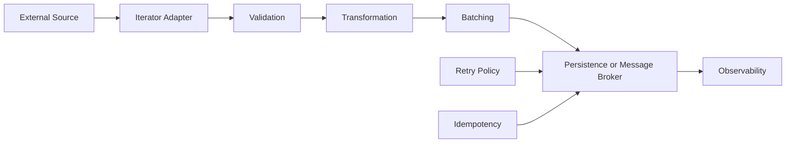

# 17- Itertools

## Overview

Python's `itertools` module provides a collection of iterator-building blocks for composing efficient, lazy data-processing pipelines.

The module is built around Python's iterator protocol:

```text
Iterable
   │
   ▼
Iterator
   │
   ├── next()
   ├── next()
   ├── next()
   └── StopIteration
```

Most `itertools` functions consume iterables and return iterators. This makes them particularly useful for:

- streaming large datasets
- processing files incrementally
- batching API requests
- ETL pipelines
- pagination
- sliding-window processing
- event processing
- combinatorial generation
- avoiding unnecessary intermediate lists

The central engineering advantage is **lazy composition**. Instead of constructing an entire intermediate dataset, an iterator pipeline can produce values only when downstream code requests them.

```python
from itertools import filterfalse

active_ids = filterfalse(
    lambda user_id: user_id.startswith("disabled-"),
    user_ids,
)
```

Nothing is processed until `active_ids` is consumed.

This makes `itertools` valuable for memory-efficient application code, but it does not make processing automatically parallel, distributed, or faster in every workload.

---

## Why itertools Exists

Many data-processing operations can be expressed as combinations of a small number of iteration primitives:

```text
source
  │
  ├── filter
  ├── transform
  ├── slice
  ├── batch
  ├── combine
  └── aggregate
        │
        ▼
      result
```

Without `itertools`, developers often create temporary lists:

```python
filtered = [item for item in items if is_valid(item)]
transformed = [transform(item) for item in filtered]
limited = transformed[:100]
```

This materializes multiple intermediate collections.

An iterator pipeline can instead be written as:

```python
from itertools import islice

result = islice(
    (transform(item) for item in items if is_valid(item)),
    100,
)
```

The processing becomes incremental.

This is especially important when `items` contains:

- millions of database records
- large files
- paginated API results
- long-running event streams
- potentially unbounded input

---

## Iterator Algebra

`itertools` is often described as an **iterator algebra** because its functions can be composed like building blocks.

For example:

```python
from itertools import islice

pipeline = islice(
    (
        normalize(event)
        for event in events
        if event["type"] == "order.created"
    ),
    1_000,
)
```

Conceptually:

```text
events
  │
  ▼
filter
  │
  ▼
transform
  │
  ▼
take first 1,000
  │
  ▼
consumer
```

Each stage can remain lazy.

The consumer determines when values are actually requested.

---

## Core Categories

The most useful `itertools` functions can be grouped as follows:

| Category | Functions |
|---|---|
| Infinite iterators | `count`, `cycle`, `repeat` |
| Transforming/aggregating | `accumulate`, `starmap` |
| Filtering | `compress`, `dropwhile`, `filterfalse`, `takewhile` |
| Slicing | `islice` |
| Combining | `chain`, `zip_longest` |
| Grouping | `groupby` |
| Pair/window processing | `pairwise` |
| Duplication | `tee` |
| Batching | `batched` |
| Cartesian/combinatorial | `product`, `permutations`, `combinations`, `combinations_with_replacement` |

The exact API available depends on the Python version. In particular:

- `pairwise()` was introduced in Python 3.10.
- `batched()` was introduced in Python 3.12.
- `batched(..., strict=True)` was added in Python 3.13.

Production projects should therefore define and enforce their supported Python version through tooling and CI/CD.

---

## Infinite Iterators

Infinite iterators are powerful but dangerous if consumed without a stopping condition.

### count

`count()` generates evenly spaced values indefinitely.

```python
from itertools import count

sequence = count(start=1, step=1)

for request_number in sequence:
    if request_number > 5:
        break

    print(request_number)
```

Output:

```text
1
2
3
4
5
```

Conceptually:

```text
1 → 2 → 3 → 4 → 5 → 6 → ...
```

A common use case is generating sequence numbers for local processing:

```python
from itertools import count

for index, record in zip(count(1), records):
    process(index, record)
```

For production distributed systems, do not assume a local `count()` provides a globally unique ID. Multiple processes can generate the same sequence.

Use database sequences, UUIDs, ULIDs, or another distributed ID strategy when global uniqueness is required.

---

## cycle

`cycle()` repeatedly produces values from an iterable.

```python
from itertools import cycle

servers = cycle(["worker-a", "worker-b", "worker-c"])

for _ in range(6):
    print(next(servers))
```

Conceptually:

```text
worker-a
worker-b
worker-c
worker-a
worker-b
worker-c
...
```

`cycle()` must remember the input elements so that they can be replayed.

Therefore, using it with a very large iterable can consume significant memory.

It is useful for finite, bounded inputs such as:

- rotating local strategies
- deterministic test inputs
- round-robin selection

It should not be treated as a distributed load balancer.

---

## repeat

`repeat()` repeatedly returns the same object.

```python
from itertools import repeat

for value in repeat("production", 3):
    print(value)
```

Output:

```text
production
production
production
```

Without a count, it is infinite:

```python
values = repeat("production")
```

It can be useful with `map()`:

```python
from itertools import repeat

results = map(process, records, repeat("production"))
```

This passes the same second argument to `process()` for every record.

---

## accumulate

`accumulate()` produces running accumulated results.

```python
from itertools import accumulate

values = [10, 20, 30, 40]

running_totals = accumulate(values)

print(list(running_totals))
```

Result:

```text
[10, 30, 60, 100]
```

Conceptually:

```text
10
10 + 20
10 + 20 + 30
10 + 20 + 30 + 40
```

This is useful for:

- running totals
- cumulative metrics
- prefix calculations
- progressive state transformations

---

## accumulate with a Custom Function

The `func` argument controls the accumulation operation.

```python
from itertools import accumulate
from operator import mul

values = [2, 3, 4]

result = accumulate(values, mul)

print(list(result))
```

Result:

```text
[2, 6, 24]
```

The function receives the previous accumulated value and the next input value.

You can also use a custom function:

```python
from itertools import accumulate


def maximum(previous: int, current: int) -> int:
    return max(previous, current)


values = [10, 7, 15, 12]

print(list(accumulate(values, maximum)))
```

Result:

```text
[10, 10, 15, 15]
```

---

## accumulate with initial

An initial value can be supplied:

```python
from itertools import accumulate

values = [10, 20, 30]

print(list(accumulate(values, initial=100)))
```

Result:

```text
[100, 110, 130, 160]
```

The initial value becomes the first output and participates in subsequent accumulation.

This can be useful for representing a pre-existing state:

```python
running_balance = accumulate(
    transactions,
    initial=opening_balance,
)
```

---

## chain

`chain()` concatenates multiple iterables lazily.

```python
from itertools import chain

first = ["a", "b"]
second = ["c", "d"]

combined = chain(first, second)

print(list(combined))
```

Result:

```text
["a", "b", "c", "d"]
```

Unlike:

```python
combined = first + second
```

`chain()` does not need to create a new list containing all elements.

---

## chain.from_iterable

When the input itself contains multiple iterables, use `chain.from_iterable()`.

```python
from itertools import chain

batches = [
    ["a", "b"],
    ["c"],
    ["d", "e"],
]

items = chain.from_iterable(batches)

print(list(items))
```

Result:

```text
["a", "b", "c", "d", "e"]
```

This is useful when flattening one level of nested iterables.

```text
[
  batch_1,
  batch_2,
  batch_3
]
      │
      ▼
chain.from_iterable()
      │
      ▼
item_1 → item_2 → item_3 → ...
```

It does not recursively flatten arbitrarily nested structures.

---

## compress

`compress()` selects values according to corresponding truthy selectors.

```python
from itertools import compress

records = ["a", "b", "c", "d"]
selectors = [True, False, True, False]

result = compress(records, selectors)

print(list(result))
```

Result:

```text
["a", "c"]
```

It is useful when selection criteria already exist as a separate boolean sequence.

---

## dropwhile

`dropwhile()` skips values while a predicate remains true, then yields the rest.

```python
from itertools import dropwhile

values = [1, 2, 3, 5, 6, 2, 1]

result = dropwhile(lambda value: value < 5, values)

print(list(result))
```

Result:

```text
[5, 6, 2, 1]
```

The important behavior is that the predicate is evaluated only until the first false result.

After that, all remaining values are yielded without applying the predicate again.

This differs from `filter()`.

---

## dropwhile vs filter

```python
from itertools import dropwhile

values = [1, 2, 3, 5, 2, 6]

print(list(dropwhile(lambda x: x < 5, values)))
```

Result:

```text
[5, 2, 6]
```

With filtering:

```python
print([x for x in values if x >= 5])
```

Result:

```text
[5, 6]
```

The distinction is:

| Function | Behavior |
|---|---|
| `dropwhile` | Drop only the initial matching prefix |
| `filter` | Test every element |
| `takewhile` | Keep only the initial matching prefix |

---

## filterfalse

`filterfalse()` is the inverse of `filter()`.

```python
from itertools import filterfalse

values = [1, 2, 3, 4, 5]

result = filterfalse(lambda value: value % 2 == 0, values)

print(list(result))
```

Result:

```text
[1, 3, 5]
```

It is useful when the predicate naturally expresses what should be excluded.

For simple transformations, a generator expression may be more readable:

```python
(value for value in values if value % 2 != 0)
```

Prefer whichever communicates the business intent more clearly.

---

## takewhile

`takewhile()` yields values while a predicate remains true.

```python
from itertools import takewhile

values = [1, 2, 3, 5, 2, 6]

result = takewhile(lambda value: value < 5, values)

print(list(result))
```

Result:

```text
[1, 2, 3]
```

Once the predicate becomes false, iteration stops permanently.

The later `2` is not reconsidered.

This makes `takewhile()` useful for sorted or phase-oriented streams where a boundary marks the end of a relevant prefix.

---

## islice

`islice()` provides slicing semantics for iterators.

Normal sequence slicing:

```python
values[10:20]
```

requires a sequence supporting slicing.

For arbitrary iterables, use:

```python
from itertools import islice

result = islice(values, 10, 20)
```

This is particularly important for generators and streaming sources.

---

## islice with a Step

```python
from itertools import islice

values = range(20)

result = islice(values, 0, 20, 2)

print(list(result))
```

Result:

```text
[0, 2, 4, 6, 8, 10, 12, 14, 16, 18]
```

`islice()` does not provide negative indexing or reverse iteration like sequence slicing.

It advances the underlying iterator as required.

---

## Pagination with islice

Suppose a backend service has an iterator over records:

```python
from itertools import islice

def get_page(records, offset: int, page_size: int):
    return islice(records, offset, offset + page_size)
```

This is useful for local iterator processing, but it is not a replacement for database pagination.

For PostgreSQL, repeatedly advancing an iterator over all preceding rows can still be inefficient.

Prefer database-native pagination using:

- keyset pagination
- indexed predicates
- appropriate `LIMIT`
- carefully designed `OFFSET` where acceptable

The application should not fetch millions of rows just to discard the first million.

---

## groupby

`groupby()` groups **consecutive** elements sharing the same key.

```python
from itertools import groupby

events = [
    ("error", "A"),
    ("error", "B"),
    ("success", "C"),
    ("success", "D"),
]

for event_type, group in groupby(events, key=lambda event: event[0]):
    print(event_type, list(group))
```

Conceptually:

```text
error   -> [("error", "A"), ("error", "B")]
success -> [("success", "C"), ("success", "D")]
```

The crucial word is **consecutive**.

---

## groupby Does Not Perform Global Grouping

This input:

```python
events = [
    ("error", "A"),
    ("success", "B"),
    ("error", "C"),
]
```

produces three groups:

```text
error   -> A
success -> B
error   -> C
```

It does not combine the two `error` groups.

This is one of the most important `itertools` interview and production traps.

---

## Sorting Before groupby

If global grouping is required, sort by the same key first:

```python
from itertools import groupby

events = [
    ("error", "A"),
    ("success", "B"),
    ("error", "C"),
]

events.sort(key=lambda event: event[0])

for event_type, group in groupby(
    events,
    key=lambda event: event[0],
):
    print(event_type, list(group))
```

This produces:

```text
error   -> A, C
success -> B
```

However, sorting requires materializing the data and costs O(n log n).

For large datasets, consider whether grouping should instead happen in:

- PostgreSQL
- a streaming system
- Kafka Streams
- a distributed processing engine
- another aggregation layer

---

## groupby Iterator Lifetime

The group returned by `groupby()` shares the underlying iterator.

This matters:

```python
from itertools import groupby

groups = groupby(
    ["a", "a", "b", "b"],
)

for key, group in groups:
    first = next(group)
    print(key, first)
```

Once the parent `groupby` advances, the previous group iterator can no longer provide its remaining values reliably.

If a group must be retained, materialize it immediately:

```python
for key, group in groups:
    values = list(group)
    store_group(key, values)
```

But materialization increases memory usage.

---

## pairwise

`pairwise()` produces overlapping pairs.

```python
from itertools import pairwise

values = [10, 20, 35, 50]

print(list(pairwise(values)))
```

Result:

```text
[(10, 20), (20, 35), (35, 50)]
```

This is useful for:

- change detection
- transition analysis
- latency differences
- adjacent comparisons
- sequence validation

For example:

```python
from itertools import pairwise


def is_non_decreasing(values: list[int]) -> bool:
    return all(
        left <= right
        for left, right in pairwise(values)
    )
```

The implementation is lazy and requires only the state necessary to produce adjacent pairs.

---

## batched

`batched()` groups an iterable into fixed-size tuples.

```python
from itertools import batched

records = range(10)

for batch in batched(records, 3):
    print(batch)
```

Result:

```text
(0, 1, 2)
(3, 4, 5)
(6, 7, 8)
```

The final batch may contain fewer elements.

This is particularly useful for:

- database writes
- API requests
- bulk processing
- Celery task submission
- AWS API operations with batch limits
- ETL pipelines

---

## batched and strict

Python 3.13 introduced the `strict` parameter.

```python
from itertools import batched

records = range(10)

for batch in batched(records, 3, strict=True):
    process_batch(batch)
```

Because 10 is not evenly divisible by 3, the final incomplete batch causes `ValueError`.

This is useful when incomplete batches represent invalid input rather than a normal condition.

Use:

```python
strict=False
```

when a partial final batch is expected.

Use:

```python
strict=True
```

when the batch contract requires exact batch sizes.

---

## Batch Processing Example

A backend service may process database or API records in controlled batches:

```python
from itertools import batched
from collections.abc import Iterable


def process_records(
    records: Iterable[dict],
    batch_size: int = 500,
) -> None:
    for batch in batched(records, batch_size):
        persist_batch(batch)
```

The key benefit is bounded application-level processing.

However, the downstream operation must also respect its own limits:

```text
iterator
   │
   ▼
batched(500)
   │
   ├── PostgreSQL bulk operation
   ├── external API request
   ├── Celery task
   └── AWS batch API
```

The batch size should be chosen based on:

- downstream limits
- payload size
- transaction duration
- memory
- network latency
- database lock duration
- retry behavior

---

## starmap

`starmap()` applies a function to argument tuples.

```python
from itertools import starmap

pairs = [
    (2, 3),
    (4, 5),
    (6, 7),
]

result = starmap(pow, pairs)

print(list(result))
```

Result:

```text
[8, 1024, 279936]
```

It is conceptually similar to:

```python
(
    pow(base, exponent)
    for base, exponent in pairs
)
```

`starmap()` becomes particularly useful when the source naturally produces tuples representing function arguments.

---

## zip_longest

`zip()` stops when the shortest iterable is exhausted.

```python
a = [1, 2, 3]
b = ["a", "b"]

print(list(zip(a, b)))
```

Result:

```text
[(1, "a"), (2, "b")]
```

`zip_longest()` continues until the longest iterable is exhausted:

```python
from itertools import zip_longest

result = zip_longest(
    a,
    b,
    fillvalue=None,
)

print(list(result))
```

Result:

```text
[(1, "a"), (2, "b"), (3, None)]
```

This is useful when aligning datasets with different lengths.

---

## Handling Missing Values

The `fillvalue` should represent a semantically valid absence:

```python
from itertools import zip_longest

for user, permission in zip_longest(
    users,
    permissions,
    fillvalue=None,
):
    validate_pair(user, permission)
```

Do not blindly use a sentinel that could be confused with legitimate data.

When absence has domain meaning, an explicit sentinel can be safer:

```python
MISSING = object()

pairs = zip_longest(
    users,
    permissions,
    fillvalue=MISSING,
)
```

---

## tee

`tee()` creates multiple independent iterator views over one source.

```python
from itertools import tee

source = iter([1, 2, 3, 4])

first, second = tee(source)

print(list(first))
print(list(second))
```

Both iterators produce the same values.

This is useful when two consumers need to traverse a source independently.

However, `tee()` has an important memory caveat.

---

## tee Buffering

If one iterator advances much further than the other, `tee()` must retain values for the slower consumer.

```text
source
  │
  ▼
 tee()
 ┌──────────────┐
 ▼              ▼
consumer A    consumer B
fast           slow
 │              │
 │              │
 ▼              ▼
           buffered values
```

If A consumes one million values while B consumes none, a large amount of data may be buffered.

Therefore:

> `tee()` is not free duplication.

Avoid using it casually with large or unbounded streams.

If both consumers need the same expensive data, consider whether materialization, caching, or a redesigned pipeline is more appropriate.

---

## Combinatorial Iterators

`itertools` provides tools for generating combinations and permutations.

These include:

- `product()`
- `permutations()`
- `combinations()`
- `combinations_with_replacement()`

They are lazy in the sense that results are generated on demand, but the number of possible results can still grow extremely quickly.

---

## product

`product()` computes a Cartesian product.

```python
from itertools import product

regions = ["us-east-1", "eu-west-1"]
tiers = ["standard", "premium"]

for region, tier in product(regions, tiers):
    print(region, tier)
```

Result:

```text
us-east-1 standard
us-east-1 premium
eu-west-1 standard
eu-west-1 premium
```

If there are:

```text
n × m
```

possible combinations, the output contains `n * m` combinations.

With multiple inputs, the number grows multiplicatively.

---

## permutations

`permutations()` generates ordered arrangements.

```python
from itertools import permutations

values = ["a", "b", "c"]

print(list(permutations(values, 2)))
```

Result:

```text
[
    ("a", "b"),
    ("a", "c"),
    ("b", "a"),
    ("b", "c"),
    ("c", "a"),
    ("c", "b"),
]
```

The number of results is:

```text
n! / (n-r)!
```

This can become enormous quickly.

Never assume laziness makes combinatorial explosion safe.

---

## combinations

`combinations()` generates unordered selections without replacement.

```python
from itertools import combinations

values = ["a", "b", "c"]

print(list(combinations(values, 2)))
```

Result:

```text
[
    ("a", "b"),
    ("a", "c"),
    ("b", "c"),
]
```

Unlike permutations:

```text
(a, b)
```

and:

```text
(b, a)
```

represent the same combination and therefore only appear once.

---

## combinations_with_replacement

This allows repeated selections:

```python
from itertools import combinations_with_replacement

values = ["a", "b", "c"]

print(list(combinations_with_replacement(values, 2)))
```

Result:

```text
[
    ("a", "a"),
    ("a", "b"),
    ("a", "c"),
    ("b", "b"),
    ("b", "c"),
    ("c", "c"),
]
```

The number of results can still become very large.

Always calculate or estimate the search space before running combinatorial workloads in production.

---

## Iterator Pipelines

The primary strength of `itertools` is composition.

Consider an event-processing pipeline:

```python
from itertools import islice


def valid_event(event: dict) -> bool:
    return event["type"] == "order.created"


def normalize(event: dict) -> dict:
    return {
        "order_id": event["order_id"],
        "customer_id": event["customer_id"],
    }


events_to_process = islice(
    (
        normalize(event)
        for event in events
        if valid_event(event)
    ),
    10_000,
)

for event in events_to_process:
    process_event(event)
```

The application does not need to build:

```text
all valid events
        +
all normalized events
        +
first 10,000 list
```

Instead, values flow through the pipeline incrementally.

---

## Lazy Evaluation

Most `itertools` operations are lazy.

For example:

```python
from itertools import islice


def source():
    for value in range(1_000_000):
        print("producing", value)
        yield value


values = islice(source(), 5)
```

At this point, little or no source processing has occurred.

Processing begins when the iterator is consumed:

```python
for value in values:
    print(value)
```

This is important for performance and correctness.

Exceptions in lazy pipelines often occur during consumption rather than when the pipeline is constructed.

---

## Iterator Exhaustion

Iterators are usually one-shot.

```python
from itertools import count, islice

values = islice(count(), 3)

print(list(values))
print(list(values))
```

The second consumption produces:

```text
[]
```

This is not a bug.

The iterator has been exhausted.

If multiple traversals are required, use a reusable iterable or intentionally materialize the values.

---

## Materialization Boundaries

A production system should make materialization deliberate.

```python
iterator = transform(records)

# Materialization boundary.
records_for_index = list(iterator)
```

This boundary should exist because downstream logic actually requires:

- random access
- repeated traversal
- length
- indexing
- persistence
- sorting

Avoid accidental materialization:

```python
list(huge_iterator)
```

unless the memory requirements are known and acceptable.

---

## Streaming File Processing

`itertools` is useful when processing large files.

```python
from itertools import islice


def read_non_empty_lines(path: str):
    with open(path, encoding="utf-8") as file:
        lines = (
            line.strip()
            for line in file
            if line.strip()
        )

        yield from lines


for batch in islice(read_non_empty_lines("events.log"), 10_000):
    process(batch)
```

For real batch processing, `batched()` is often clearer:

```python
from itertools import batched


def read_lines(path: str):
    with open(path, encoding="utf-8") as file:
        yield from (line.rstrip("\n") for line in file)


for batch in batched(read_lines("events.log"), 1_000):
    process_batch(batch)
```

The file remains incrementally consumed rather than fully loaded into memory.

---

## Resource Lifetime and Lazy Iterators

A critical production concern is resource lifetime.

This can be problematic:

```python
def rows():
    with open("data.csv", encoding="utf-8") as file:
        return (line.strip() for line in file)
```

The generator expression is returned after the context manager has closed the file.

Instead, keep resource ownership inside the generator's lifecycle:

```python
def rows():
    with open("data.csv", encoding="utf-8") as file:
        for line in file:
            yield line.strip()
```

The resource remains open while the generator is actively executing and is released when generator execution leaves the `with` block.

This illustrates a broader rule:

> Lazy computation does not remove resource-lifecycle requirements.

---

## Database Streaming

For large PostgreSQL datasets, application-level iterators can reduce memory pressure, but the database driver and ORM must also be configured appropriately.

The architectural flow should be:

```text
PostgreSQL
    │
    ▼
database cursor / streaming API
    │
    ▼
Python iterator
    │
    ├── transform
    ├── filter
    └── batch
    │
    ▼
downstream processing
```

In Django, for example, `QuerySet.iterator()` can avoid caching the entire result set in the usual QuerySet result cache:

```python
for user in User.objects.iterator(chunk_size=1_000):
    process_user(user)
```

For SQLAlchemy and lower-level drivers, use their supported streaming/server-side cursor mechanisms where appropriate.

Do not assume `itertools` alone makes a database query memory-efficient. The upstream data-access layer must also stream rather than materialize everything.

---

## API Pagination

Iterator abstractions can hide pagination mechanics.

```python
from collections.abc import Iterator


def iter_pages(client) -> Iterator[dict]:
    page = 1

    while True:
        response = client.get_page(page)

        items = response["items"]

        if not items:
            return

        yield from items
        page += 1
```

Consumers can then use standard iterator tools:

```python
from itertools import batched

for batch in batched(iter_pages(client), 100):
    process_batch(batch)
```

The resulting architecture is:

```text
REST API
   │
   ▼
pagination iterator
   │
   ▼
yield items
   │
   ▼
batched(100)
   │
   ▼
processing
```

Production implementations should additionally handle:

- request timeouts
- retries
- rate limits
- authentication
- pagination tokens
- API failures
- cancellation
- observability

`itertools` only solves the iteration composition.

---

## Kafka and Event Streams

`itertools` can be useful around Kafka consumers for local transformations:

```python
from itertools import islice

batch = islice(consumer, 500)

for message in batch:
    process_message(message)
```

But there is an important architectural distinction:

```text
Kafka
 ├── durable event log
 ├── partitions
 ├── offsets
 ├── consumer groups
 └── distributed delivery semantics

itertools
 ├── local iteration
 ├── lazy transformation
 └── local composition
```

`itertools` does not provide:

- offset management
- persistence
- partition coordination
- replay guarantees
- consumer-group semantics

---

## Celery Batch Processing

A local iterator can help construct batches for Celery:

```python
from itertools import batched


for batch in batched(record_ids, 100):
    process_batch.delay(batch)
```

Production considerations include:

- task payload size
- retry behavior
- idempotency
- task timeouts
- broker limits
- visibility timeouts
- partial batch failures

Batching should be designed around the failure unit.

If processing one item can fail independently, a huge batch may make retries unnecessarily expensive.

---

## Backpressure

Iterator pipelines provide a form of local demand-driven processing.

Conceptually:

```text
Producer
   │
   ▼
Iterator pipeline
   │
   ▼
Consumer
```

The consumer requests the next item only as needed.

This can reduce unnecessary buffering.

However, Python iterator laziness is not equivalent to distributed backpressure.

For example:

```text
HTTP producer
      │
      ▼
Python iterator
      │
      ▼
Kafka
      │
      ▼
consumer group
```

Each boundary has its own buffering, retry, timeout, and flow-control semantics.

Senior engineers should analyze the entire pipeline rather than assuming that one lazy iterator creates end-to-end backpressure.

---

## Performance Characteristics

`itertools` can reduce:

- intermediate allocations
- peak memory
- unnecessary processing
- Python-level bookkeeping

For example:

```python
sum(
    value * 2
    for value in values
)
```

avoids creating a list of transformed values.

Similarly:

```python
from itertools import islice

first_100 = islice(values, 100)
```

does not materialize the first 100 values into a list.

However, lazy execution can also introduce overhead from Python-level iterator operations.

For simple workloads, a list comprehension can sometimes be faster than a deeply composed iterator pipeline.

Benchmark representative workloads rather than assuming:

```text
lazy = always faster
```

The more accurate statement is:

```text
lazy = potentially lower memory + deferred work
```

not:

```text
lazy = automatically faster
```

---

## Complexity

Typical complexity considerations:

| Operation | Typical Behavior |
|---|---|
| `count()` | O(1) per produced item |
| `cycle()` | O(1) per produced item after caching source |
| `repeat()` | O(1) per produced item |
| `chain()` | O(1) overhead per yielded item |
| `islice()` | O(k) for advancing through k source elements |
| `pairwise()` | O(1) additional state |
| `batched()` | O(batch size) temporary storage |
| `tee()` | O(distance between consumers) buffering |
| `groupby()` | O(1) active group state, excluding retained/materialized groups |
| `product()` | Potentially exponential/multiplicative output size |
| `permutations()` | Factorial-scale output |
| `combinations()` | Combinatorial output |

The output cardinality of combinatorial iterators is often more important than the constant cost of producing each result.

---

## Memory Management

Iterator pipelines can significantly reduce peak memory:

```text
Materialized pipeline:

source
  │
  ▼
list A
  │
  ▼
list B
  │
  ▼
list C
  │
  ▼
consumer


Lazy pipeline:

source ──► transform ──► filter ──► consumer
              │
              └── small local state
```

But some `itertools` functions retain state:

- `cycle()` caches input values
- `tee()` buffers values for lagging consumers
- `groupby()` retains the current grouping state
- `batched()` retains the current batch

Always understand what the iterator stores internally.

---

## Error Handling

Because iterator operations are lazy, errors may occur later than expected.

```python
pipeline = (
    transform(item)
    for item in items
)
```

An exception inside `transform()` typically occurs when the relevant element is requested.

Therefore:

```python
pipeline = build_pipeline()
```

does not imply:

```text
all processing succeeded
```

The processing occurs during consumption.

For production pipelines, define clear error boundaries:

```python
for item in pipeline:
    try:
        process(item)
    except RecoverableError:
        handle_recoverable_error(item)
```

For batch operations, decide whether one invalid item should:

- fail the entire batch
- be skipped
- be retried
- be dead-lettered
- be reported separately

---

## Retry and Idempotency

Iterator pipelines do not provide retry semantics.

Suppose:

```python
for batch in batched(records, 100):
    persist_batch(batch)
```

If `persist_batch()` fails after partially completing a database or external API operation, rerunning the batch may duplicate work.

Production batch processing should define:

- idempotency keys
- transaction boundaries
- deduplication
- retry policy
- partial failure behavior
- checkpointing

The iterator controls traversal; the downstream system controls durability and consistency.

---

## Security Considerations

`itertools` itself is generally not a security boundary, but iterator design can influence resource consumption.

### Unbounded Iteration

Never accidentally materialize an infinite iterator:

```python
from itertools import count

values = list(count())
```

This will not terminate.

### Combinatorial Explosion

Avoid blindly generating:

```python
list(product(a, b, c, d))
```

when the input cardinality is not tightly bounded.

### Untrusted Input

User-controlled values can create huge search spaces:

```python
product(user_options, user_options, user_options)
```

Limit:

- input cardinality
- maximum combinations
- batch sizes
- execution time
- memory usage

---

## Concurrency

`itertools` functions are generally synchronous and local.

They do not provide:

- parallel execution
- thread pools
- process pools
- async scheduling
- distributed coordination

For CPU-bound parallel work, consider:

```python
concurrent.futures.ProcessPoolExecutor
```

For I/O-bound asynchronous workflows:

```python
asyncio
```

For distributed workloads:

- Celery
- Kafka
- AWS SQS
- distributed task systems

An iterator can be used inside these systems, but it does not replace their concurrency model.

---

## Async Iteration

Standard `itertools` operates on synchronous iterables.

It cannot directly consume an async iterator:

```python
async def events():
    yield event
```

For async streams, use asynchronous iteration:

```python
async for event in events():
    await process(event)
```

You can build equivalent async iterator utilities, but they require async-aware implementations.

Do not force synchronous `itertools` abstractions into an asynchronous data source.

---

## Testing Iterator Pipelines

Iterator-based code should test both output and laziness where laziness is part of the contract.

### Output Testing

```python
from itertools import islice


def test_first_items():
    values = islice(range(100), 5)

    assert list(values) == [0, 1, 2, 3, 4]
```

### Laziness Testing

A side effect can demonstrate when work occurs:

```python
def source():
    yield 1
    yield 2
    raise RuntimeError("source failure")
```

A test can verify that creating the pipeline does not consume the source, while consumption eventually raises the expected exception.

### Boundary Cases

Test:

- empty iterables
- single-element inputs
- exhausted iterators
- partial batches
- `strict=True`
- uneven inputs
- large inputs
- infinite sources with bounded consumption
- exceptions during iteration

---

## Maintainability

Iterator composition is powerful, but excessive composition can reduce readability.

This:

```python
result = islice(
    filterfalse(
        predicate,
        map(transform, source),
    ),
    100,
)
```

may be correct but harder to understand than:

```python
result = islice(
    (
        transform(item)
        for item in source
        if not predicate(item)
    ),
    100,
)
```

For complex pipelines, named functions often improve maintainability:

```python
def valid(item):
    ...

def normalize(item):
    ...

pipeline = (
    normalize(item)
    for item in source
    if valid(item)
)
```

Use `itertools` to make data flow clearer, not merely to minimize line count.

---

## itertools vs Comprehensions

| Requirement | Preferred |
|---|---|
| Simple transformation | Generator expression / comprehension |
| Simple filtering | Generator expression |
| Multiple iterator composition | `itertools` |
| Batching | `batched` |
| Pairwise traversal | `pairwise` |
| Chaining many iterables | `chain` |
| Lazy slicing | `islice` |
| Running accumulation | `accumulate` |
| Cartesian product | `product` |
| Combinations | `combinations` |
| Complex business logic | Named generator/function |

For example:

```python
result = (
    normalize(item)
    for item in items
    if is_valid(item)
)
```

is often clearer than combining several functional operators.

Use the most readable abstraction that preserves the required performance characteristics.

---

## itertools vs map and filter

`map()` and `filter()` are useful for simple transformations and predicates:

```python
result = map(normalize, items)
```

```python
result = filter(is_valid, items)
```

`itertools` extends this model with more specialized operations:

```text
map/filter
   │
   ├── accumulate
   ├── chain
   ├── compress
   ├── groupby
   ├── islice
   ├── pairwise
   ├── batched
   ├── zip_longest
   └── combinatorial generators
```

Use specialized primitives when they communicate the algorithm directly.

---

## itertools vs deque

`itertools` and `deque` solve different problems.

| `itertools` | `deque` |
|---|---|
| Iterator composition | Mutable double-ended container |
| Usually lazy | Materialized state |
| Pipeline construction | Queue/stack/window state |
| Streaming transformation | Efficient end operations |
| One-shot traversal | Persistent mutable collection |

They can also work together:

```python
from collections import deque
from itertools import islice

window = deque(islice(stream, 100), maxlen=100)
```

This creates a bounded mutable window from a lazy source.

---

## Production Architecture

A robust streaming pipeline often separates responsibilities:



`itertools` is primarily useful in the middle of this architecture:

```text
Iterator Adapter
      │
      ▼
Validation
      │
      ▼
Transformation
      │
      ▼
Batching
```

It should not be responsible for:

- distributed retries
- durable checkpoints
- authentication
- transactional guarantees
- queue persistence
- observability infrastructure

Those concerns belong to the appropriate system boundaries.

---

## Operational Considerations

For production iterator pipelines, monitor the system around the iterator rather than the iterator itself.

Useful metrics include:

- records processed
- records rejected
- batch size
- processing latency
- downstream request latency
- retry count
- failure count
- queue depth
- memory usage
- source lag
- throughput

For long-running pipelines, also consider:

- cancellation
- graceful shutdown
- checkpointing
- resource cleanup
- partial batch handling
- restart behavior

A process restart should not silently lose business-critical state.

---

## Kubernetes and Deployment

In Kubernetes, iterator state normally exists inside a pod's process memory.

```text
Kubernetes
   │
   ├── Pod A ── iterator state
   ├── Pod B ── iterator state
   └── Pod C ── iterator state
```

If Pod A terminates:

```text
iterator state
     │
     ▼
lost
```

If the source is durable, the system may be able to resume from an external checkpoint.

Examples:

- Kafka offsets
- database checkpoints
- S3 object position
- durable job state

Do not rely on Python iterator state as a recovery mechanism.

---

## Graceful Shutdown

Long-running iterator consumers should respond to shutdown signals.

Conceptually:

```text
SIGTERM
  │
  ▼
stop requesting new work
  │
  ▼
finish safe in-flight work
  │
  ▼
commit checkpoint / acknowledge
  │
  ▼
close resources
  │
  ▼
exit
```

This is particularly important for:

- Kafka consumers
- Celery workers
- streaming file processors
- long-running ETL jobs
- API polling loops

The iterator itself does not implement graceful shutdown; application orchestration must.

---

## Common Mistakes

### Materializing Everything

```python
list(huge_iterator)
```

This defeats the memory advantage of lazy iteration.

### Forgetting Iterator Exhaustion

```python
items = iter(source)

first_pass = list(items)
second_pass = list(items)
```

The second pass is empty.

### Misunderstanding groupby

`groupby()` groups adjacent equal keys, not arbitrary equal values.

### Assuming tee Is Free

`tee()` buffers values for consumers that fall behind.

### Treating Infinite Iterators as Finite

```python
list(count())
```

does not terminate.

### Ignoring Combinatorial Growth

Lazy `product()` and `permutations()` still produce potentially enormous result sets.

### Assuming itertools Provides Parallelism

Iterator composition is not concurrency.

### Ignoring Resource Lifetime

A lazy iterator can outlive the resource that produced it if resource ownership is poorly designed.

---

## Production Pitfalls

| Pitfall | Impact | Prevention |
|---|---|---|
| `list()` on large iterator | Memory exhaustion | Preserve laziness |
| `tee()` with lagging consumers | Large memory buffer | Redesign or bound consumption |
| `groupby()` without sorting | Incorrect grouping | Sort first or aggregate elsewhere |
| Unbounded `count()`/`cycle()` | Infinite processing | Add explicit termination |
| Huge `product()` | Combinatorial explosion | Bound input/search space |
| Large batches | High memory/retry cost | Tune batch size |
| Small batches | Excessive network overhead | Benchmark and tune |
| Iterator over closed resource | Runtime failures | Keep resource lifecycle with iterator |
| Local iterator as checkpoint | Data loss on restart | Persist offsets/checkpoints |
| Assuming lazy means faster | Misleading optimization | Benchmark representative workloads |

---

## Senior-Level Heuristics

Use `itertools` when:

- the workload is naturally sequential
- intermediate materialization is unnecessary
- memory pressure matters
- data may be large or unbounded
- the pipeline benefits from explicit iterator composition
- batching or windowing is required
- a standard iterator primitive clearly expresses the algorithm

Be cautious when:

- consumers advance at different rates
- state must survive process restarts
- data is shared across replicas
- the operation requires database-side aggregation
- output cardinality can explode
- asynchronous iteration is required
- complex business logic makes the pipeline difficult to read

The senior-level question is:

> What state must exist at each stage, who owns it, and what happens when the process stops halfway through the stream?

That question matters more than whether a particular iterator expression is elegant.

---

## Decision Guide

```text
Need to process an iterable?
          │
          ▼
Can it remain lazy?
          │
      ┌───┴───┐
      │       │
     Yes      No
      │       │
      ▼       ▼
 itertools   list / sequence
      │
      ▼
What operation?
      │
      ├── Batch ───────────────► batched
      ├── Slice ───────────────► islice
      ├── Chain ───────────────► chain
      ├── Adjacent pairs ──────► pairwise
      ├── Running state ───────► accumulate
      ├── Group adjacent keys ─► groupby
      ├── Align uneven inputs ─► zip_longest
      ├── Filter inverse ──────► filterfalse
      ├── Initial prefix ──────► takewhile / dropwhile
      ├── Duplicate iterator ──► tee
      └── Combinations ────────► product / combinations / permutations

Then ask:
Does the state need to survive process failure?
          │
          ├── No ──► local iterator may be sufficient
          │
          └── Yes ─► add durable checkpoint/state
```

---

## Interview Traps

### Are itertools functions eager or lazy?

Most `itertools` functions return lazy iterators. They generally perform work when consumed rather than when constructed.

### Is `groupby()` equivalent to SQL `GROUP BY`?

No. `itertools.groupby()` groups consecutive elements sharing the same key. SQL `GROUP BY` performs global grouping across the selected relation.

### Why might `groupby()` require sorting first?

If equal keys are separated, they produce separate groups. Sorting by the grouping key makes equal keys adjacent.

### What is the danger of `tee()`?

If one derived iterator advances significantly farther than another, `tee()` must buffer values for the slower iterator, potentially consuming substantial memory.

### Is `batched()` equivalent to database pagination?

No. `batched()` groups an existing Python iterable. It does not optimize the database query or provide database pagination semantics.

### Does lazy evaluation mean no memory is used?

No. Iterators may retain internal state, and some functions such as `cycle()` and `tee()` can buffer significant amounts of data.

### Does itertools provide concurrency?

No. It provides synchronous iterator composition. Use `asyncio`, threads, processes, Celery, Kafka, or other systems for appropriate concurrency or distributed processing.

### What happens to an iterator after it is exhausted?

Normally it remains exhausted and subsequent `next()` calls raise `StopIteration`.

### Why can combinatorial itertools functions still be dangerous?

Laziness avoids storing every result simultaneously, but the total number of results can be enormous. If the consumer eventually processes all results, the runtime can still become impractical.

### What is the difference between `chain()` and `chain.from_iterable()`?

`chain(a, b, c)` accepts each iterable as a separate argument. `chain.from_iterable(iterables)` accepts one iterable whose elements are themselves iterables and chains them together.

---

## Production Checklist

Before deploying an `itertools`-based pipeline, verify:

- The source is genuinely suitable for synchronous iteration.
- Iterator exhaustion semantics are understood.
- Lazy evaluation is intentional.
- No accidental `list()` materialization can exhaust memory.
- Resource ownership remains valid for the iterator's lifetime.
- Batch sizes are aligned with downstream API/database/broker limits.
- Partial batches have explicit behavior.
- `groupby()` semantics are correct for the data ordering.
- `tee()` buffering is bounded or avoided.
- Infinite iterators have explicit termination conditions.
- Combinatorial output sizes are bounded.
- Database work is pushed to PostgreSQL when appropriate.
- Durable sources have checkpoint/restart semantics outside Python iterator state.
- Retries and idempotency are defined for side-effecting operations.
- Async iterators are handled with async-specific abstractions.
- Concurrency requirements are not incorrectly delegated to `itertools`.
- Metrics expose throughput, failures, latency, and backlog where relevant.
- Shutdown behavior safely handles in-flight work.
- Security limits protect against unbounded input and memory consumption.
- Tests cover empty, exhausted, partial, large, and failure cases.

## Key Takeaways

- `itertools` provides composable, mostly lazy iterator primitives that are especially valuable for streaming, batching, filtering, grouping, and memory-efficient data processing.
- Understand exact semantics: `groupby()` groups adjacent keys, `tee()` can buffer aggressively, `cycle()` caches its source, and combinatorial iterators can produce enormous result spaces.
- Laziness reduces unnecessary materialization but does not guarantee better CPU performance, eliminate memory usage, or provide distributed backpressure.
- Python iterators are local execution mechanisms; durable checkpoints, retries, concurrency, distributed coordination, and message delivery require appropriate backend infrastructure.
- Use `itertools` when it makes data flow clearer and more resource-efficient, while keeping persistence, reliability, security, and operational responsibilities at the correct system boundary.