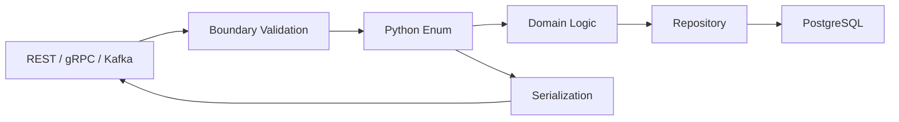

# 19- Enum

## Overview

Python's `enum` module provides a structured way to represent a fixed set of named constants.

Enums are particularly useful when a domain contains a finite set of valid states, modes, categories, or commands:

```text
Order
  │
  ├── PENDING
  ├── CONFIRMED
  ├── SHIPPED
  └── CANCELLED
```

Instead of scattering string literals throughout an application:

```python
if order.status == "pending":
    ...
```

a domain can define:

```python
from enum import Enum


class OrderStatus(Enum):
    PENDING = "pending"
    CONFIRMED = "confirmed"
    SHIPPED = "shipped"
    CANCELLED = "cancelled"
```

and use:

```python
if order.status is OrderStatus.PENDING:
    ...
```

Enums provide:

- named constants
- controlled value sets
- type-level semantics
- readable comparisons
- iteration
- serialization support
- validation boundaries
- explicit domain vocabulary

They are especially valuable in backend systems where values cross boundaries between:

- Python code
- REST APIs
- gRPC
- PostgreSQL
- Redis
- Kafka
- Celery
- configuration
- external services

The important engineering principle is:

> Use an enum when the domain has a finite, intentional set of named alternatives whose identity should be explicit in code.

---

## Why Enums Exist

Without enums, applications commonly use strings or integers:

```python
PENDING = "pending"
CONFIRMED = "confirmed"
SHIPPED = "shipped"
```

This works, but values can be inconsistent:

```python
status = "Pending"
status = "pending"
status = "PENDING"
status = "pendng"
```

An enum centralizes the vocabulary:

```python
class OrderStatus(Enum):
    PENDING = "pending"
    CONFIRMED = "confirmed"
    SHIPPED = "shipped"
```

Now application code can distinguish between:

```text
OrderStatus.PENDING
```

and:

```text
"pending"
```

This creates a stronger boundary between domain concepts and arbitrary strings.

---

## Basic Enum

```python
from enum import Enum


class OrderStatus(Enum):
    PENDING = "pending"
    CONFIRMED = "confirmed"
    SHIPPED = "shipped"
```

Members can be accessed directly:

```python
status = OrderStatus.PENDING

print(status)
print(status.name)
print(status.value)
```

Conceptually:

```text
OrderStatus.PENDING
       │
       ├── name  → "PENDING"
       │
       └── value → "pending"
```

The member itself is the enum object.

Its `.value` is the underlying value associated with that member.

---

## Enum Members

Enum members are singleton-like objects within the enum class.

```python
from enum import Enum


class Environment(Enum):
    DEVELOPMENT = "development"
    STAGING = "staging"
    PRODUCTION = "production"
```

Accessing:

```python
Environment.PRODUCTION
```

returns the member.

Comparing the same member:

```python
Environment.PRODUCTION is Environment.PRODUCTION
```

is true.

The recommended comparison is generally:

```python
if environment is Environment.PRODUCTION:
    ...
```

rather than comparing names or raw values throughout domain logic.

---

## name vs value

These two concepts should remain distinct.

```python
class UserRole(Enum):
    ADMIN = "admin"
    SUPPORT = "support"
```

Then:

```python
UserRole.ADMIN.name
```

returns:

```text
"ADMIN"
```

while:

```python
UserRole.ADMIN.value
```

returns:

```text
"admin"
```

The member name is primarily an internal Python identifier.

The value is often the representation used at an external boundary.

This distinction is useful in APIs and databases:

```text
Python domain
    UserRole.ADMIN
          │
          ▼
external representation
    "admin"
```

---

## Enum Construction

An enum can be constructed from a value:

```python
status = OrderStatus("pending")

assert status is OrderStatus.PENDING
```

An invalid value raises `ValueError`:

```python
OrderStatus("unknown")
```

This makes enums useful as validation boundaries.

For example:

```python
def parse_status(value: str) -> OrderStatus:
    return OrderStatus(value)
```

If external input contains an unsupported value, the conversion fails explicitly.

---

## Enum Lookup by Name

Members can also be accessed by name:

```python
status = OrderStatus["PENDING"]
```

This is different from:

```python
status = OrderStatus("pending")
```

The distinction is:

| Operation | Looks Up |
|---|---|
| `OrderStatus["PENDING"]` | Member name |
| `OrderStatus("pending")` | Member value |

Do not confuse external values with Python member names.

For API/database values, value-based construction is usually the appropriate boundary:

```python
OrderStatus(raw_value)
```

---

## Iterating Over Enums

Enum members can be iterated:

```python
for status in OrderStatus:
    print(status.name, status.value)
```

This is useful for:

- validation
- generating choices
- documentation
- CLI options
- API metadata
- administrative interfaces

The order is the definition order for ordinary enums.

Do not make business logic depend on numeric or declaration order unless ordering is explicitly part of the domain model.

---

## Enum Membership

Enum members can be tested explicitly:

```python
if status is OrderStatus.PENDING:
    process_pending_order()
```

For external values:

```python
try:
    status = OrderStatus(raw_status)
except ValueError:
    reject_request()
```

Avoid maintaining a separate list that duplicates the enum:

```python
VALID_STATUSES = [
    "pending",
    "confirmed",
    "shipped",
]
```

The enum itself should normally be the source of truth.

---

## Enum Equality

Enum members compare equal to themselves:

```python
OrderStatus.PENDING == OrderStatus.PENDING
```

and:

```python
OrderStatus.PENDING is OrderStatus.PENDING
```

Both are true.

However:

```python
OrderStatus.PENDING == "pending"
```

is false for a normal `Enum`.

This is intentional.

The enum member and its underlying value are different objects and concepts.

Use:

```python
status.value
```

when an external representation is required.

---

## Enum vs Constants

Constants:

```python
PENDING = "pending"
```

are appropriate when a value does not require a constrained domain abstraction.

Enums are stronger when:

- the values form a finite set
- invalid values should be rejected
- type-level semantics matter
- the values are used throughout the application
- IDE/static-analysis support is useful
- the domain concept deserves explicit naming

A practical distinction:

```text
Constant
    └── "This is a reusable value"

Enum
    └── "This value belongs to a defined set of alternatives"
```

---

## Enum vs Strings

| Requirement | String | Enum |
|---|---|---|
| Simple external payload | Excellent | Sometimes |
| Finite domain vocabulary | Weak | Excellent |
| Static typing | Limited | Stronger |
| Prevent arbitrary values | No | Yes at conversion boundary |
| Readability in domain logic | Moderate | High |
| Serialization | Direct | Requires `.value` or framework support |
| Database integration | Direct | Requires mapping |
| Refactoring support | Lower | Higher |

Enums should not be introduced for every string field.

Use them where the finite domain has meaningful semantics.

---

## Enum Types

Python provides several enum-related types:

| Type | Primary Use |
|---|---|
| `Enum` | General symbolic enumeration |
| `IntEnum` | Enum members that behave like integers |
| `StrEnum` | Enum members that behave like strings |
| `Flag` | Bitwise-combinable flags |
| `IntFlag` | Integer-compatible bitwise flags |
| `auto()` | Automatic value generation |
| `unique()` | Enforce unique values |

The right choice depends on how the enum interacts with external systems and operators.

---

## StrEnum

`StrEnum` is useful when enum members should also behave as strings.

```python
from enum import StrEnum


class Environment(StrEnum):
    DEVELOPMENT = "development"
    STAGING = "staging"
    PRODUCTION = "production"
```

This is useful for domains where the external representation is naturally textual.

For example:

```python
def build_endpoint(environment: Environment) -> str:
    return f"https://api.{environment}.example.com"
```

Because `StrEnum` is string-compatible, it can integrate naturally with APIs and configuration.

`StrEnum` was introduced in Python 3.11, so projects supporting older Python versions need an alternative approach.

---

## Enum vs StrEnum

```python
from enum import Enum, StrEnum


class Role(Enum):
    ADMIN = "admin"


class StringRole(StrEnum):
    ADMIN = "admin"
```

With a normal `Enum`:

```python
Role.ADMIN == "admin"
```

is false.

With `StrEnum`:

```python
StringRole.ADMIN == "admin"
```

is true.

This difference can be useful at serialization boundaries, but it also means `StrEnum` has stronger interaction with ordinary string APIs.

Do not choose `StrEnum` solely because it requires fewer `.value` accesses. Choose it when string compatibility is semantically useful.

---

## IntEnum

`IntEnum` creates enum members that are also integers.

```python
from enum import IntEnum


class HTTPStatus(IntEnum):
    OK = 200
    NOT_FOUND = 404
    SERVER_ERROR = 500
```

Then:

```python
HTTPStatus.OK == 200
```

is true.

This is useful when an existing protocol or API is fundamentally integer-based.

However, `IntEnum` weakens the separation between the enum member and its underlying integer value.

Use ordinary `Enum` when strong domain separation is more important.

---

## IntEnum and Compatibility

`IntEnum` is particularly useful when integrating with:

- numeric protocol codes
- legacy APIs
- bit-free integer configuration values
- libraries expecting integers

Example:

```python
def is_server_error(status: HTTPStatus) -> bool:
    return 500 <= status <= 599
```

The member participates in integer operations because it inherits integer semantics.

This convenience should not be used to blur domain boundaries unnecessarily.

---

## auto

`auto()` allows enum values to be generated automatically.

```python
from enum import Enum, auto


class ProcessingState(Enum):
    CREATED = auto()
    RUNNING = auto()
    COMPLETED = auto()
    FAILED = auto()
```

The exact generated values depend on the enum type and Python's enum machinery.

For domain values crossing external boundaries, explicit values are generally safer:

```python
class ProcessingState(StrEnum):
    CREATED = "created"
    RUNNING = "running"
    COMPLETED = "completed"
    FAILED = "failed"
```

This makes serialized values stable and reviewable.

---

## auto for Internal Enums

`auto()` is often appropriate for purely internal symbolic states where numeric values have no external meaning.

For example:

```python
from enum import Enum, auto


class ParserState(Enum):
    INITIALIZED = auto()
    READING = auto()
    COMPLETE = auto()
```

The implementation can change without affecting an external contract because consumers do not depend on the numeric values.

---

## unique

`@unique` detects duplicate values.

```python
from enum import Enum, unique


@unique
class Status(Enum):
    ACTIVE = "active"
    ENABLED = "enabled"
```

This is valid because the values differ.

But:

```python
@unique
class Status(Enum):
    ACTIVE = "active"
    ENABLED = "active"
```

raises an error during class creation.

This can prevent accidental aliases when every member is expected to represent a distinct value.

---

## Enum Aliases

Without `@unique`, duplicate values create aliases.

```python
from enum import Enum


class Status(Enum):
    ACTIVE = "active"
    ENABLED = "active"
```

Then:

```python
Status.ENABLED is Status.ACTIVE
```

is true.

The second name is an alias of the first member.

Aliases can be useful for backward compatibility, but they can also hide accidental duplication.

Use `@unique` when aliases are not intentional.

---

## Enum Aliases for Backward Compatibility

Aliases can support migrations:

```python
class UserState(Enum):
    ACTIVE = "active"
    ENABLED = "active"
```

This allows old application terminology to coexist with a preferred canonical name.

However, aliases should be deliberate and documented.

For public APIs, it is often better to maintain stable external values and evolve internal names separately.

---

## Flag

`Flag` is designed for values that can be combined using bitwise operations.

```python
from enum import Flag, auto


class Permission(Flag):
    READ = auto()
    WRITE = auto()
    DELETE = auto()
```

Permissions can be combined:

```python
permissions = Permission.READ | Permission.WRITE
```

Then:

```python
if Permission.READ in permissions:
    ...
```

This models independent boolean capabilities.

---

## Flag vs Enum

A normal enum represents one choice:

```text
OrderStatus
    PENDING
    CONFIRMED
    SHIPPED
```

A flag represents multiple simultaneous capabilities:

```text
Permission
    READ
    WRITE
    DELETE

User
    READ + WRITE
```

Use `Flag` when multiple members can legitimately be active simultaneously.

Do not use ordinary enums for combinable permissions by encoding arbitrary integers manually.

---

## IntFlag

`IntFlag` combines `Flag` behavior with integer compatibility.

```python
from enum import IntFlag, auto


class Permission(IntFlag):
    READ = auto()
    WRITE = auto()
    DELETE = auto()
```

This is useful when integrating with systems that represent bit flags as integers.

For example:

```python
permissions = Permission.READ | Permission.WRITE

raw_value = int(permissions)
```

This can be useful for compact protocol or storage representations.

---

## Bitwise Flags

Flags are generally represented using distinct bit positions:

```text
READ   = 001
WRITE  = 010
DELETE = 100

READ | WRITE
      ↓
     011
```

This allows efficient combination and membership checks.

The abstraction is useful for:

- permissions
- feature capabilities
- operating modes
- protocol flags

Avoid using flags when the states are mutually exclusive.

---

## Enum with Methods

Enums can contain methods.

```python
from enum import StrEnum


class OrderStatus(StrEnum):
    PENDING = "pending"
    CONFIRMED = "confirmed"
    SHIPPED = "shipped"
    CANCELLED = "cancelled"

    def is_terminal(self) -> bool:
        return self in {
            self.SHIPPED,
            self.CANCELLED,
        }
```

Then:

```python
if order.status.is_terminal():
    ...
```

This can keep behavior close to the concept when the behavior is genuinely intrinsic to the enum.

---

## Enum with Properties

Enums can expose derived information:

```python
from enum import StrEnum


class OrderStatus(StrEnum):
    PENDING = "pending"
    CONFIRMED = "confirmed"
    SHIPPED = "shipped"
    CANCELLED = "cancelled"

    @property
    def is_terminal(self) -> bool:
        return self in {
            OrderStatus.SHIPPED,
            OrderStatus.CANCELLED,
        }
```

Then:

```python
if status.is_terminal:
    ...
```

This is useful for stable, intrinsic classification.

Avoid putting large amounts of business logic inside an enum merely because the enum can contain methods.

---

## Enum State Transitions

Enums are useful for representing states, but they do not automatically enforce legal transitions.

For example:

```python
class OrderStatus(StrEnum):
    PENDING = "pending"
    CONFIRMED = "confirmed"
    SHIPPED = "shipped"
    CANCELLED = "cancelled"
```

A transition model can be explicit:

```python
ALLOWED_TRANSITIONS = {
    OrderStatus.PENDING: {
        OrderStatus.CONFIRMED,
        OrderStatus.CANCELLED,
    },
    OrderStatus.CONFIRMED: {
        OrderStatus.SHIPPED,
        OrderStatus.CANCELLED,
    },
    OrderStatus.SHIPPED: set(),
    OrderStatus.CANCELLED: set(),
}
```

Then:

```python
def transition(
    current: OrderStatus,
    target: OrderStatus,
) -> OrderStatus:
    if target not in ALLOWED_TRANSITIONS[current]:
        raise ValueError(
            f"Invalid transition: {current} -> {target}"
        )

    return target
```

This separates:

```text
State vocabulary
    │
    ▼
Enum

State transition rules
    │
    ▼
Domain logic
```

This separation is often easier to maintain than embedding an entire workflow engine inside the enum.

---

## Enum and Pattern Matching

Enums work naturally with Python's structural pattern matching.

```python
match status:
    case OrderStatus.PENDING:
        handle_pending()
    case OrderStatus.CONFIRMED:
        handle_confirmed()
    case OrderStatus.SHIPPED:
        handle_shipped()
    case OrderStatus.CANCELLED:
        handle_cancelled()
```

This makes state-driven control flow explicit.

However, Python does not generally enforce exhaustive enum handling at runtime.

If a new member is added, existing `match` statements may silently fall through.

Production code should therefore include an explicit default/error case where missing handling would be dangerous:

```python
match status:
    case OrderStatus.PENDING:
        handle_pending()
    case OrderStatus.CONFIRMED:
        handle_confirmed()
    case OrderStatus.SHIPPED:
        handle_shipped()
    case OrderStatus.CANCELLED:
        handle_cancelled()
    case _:
        raise ValueError(f"Unhandled status: {status}")
```

---

## Enum and Type Checking

Enums improve static typing.

```python
from enum import StrEnum


class UserRole(StrEnum):
    ADMIN = "admin"
    SUPPORT = "support"
    USER = "user"


def authorize(role: UserRole) -> bool:
    return role in {
        UserRole.ADMIN,
        UserRole.SUPPORT,
    }
```

A type checker can distinguish:

```python
UserRole
```

from:

```python
str
```

depending on the enum type and typing context.

This is useful for preventing accidental mixing of unrelated domain values.

---

## Enum and Dataclasses

Enums frequently work with dataclasses:

```python
from dataclasses import dataclass
from enum import StrEnum


class OrderStatus(StrEnum):
    PENDING = "pending"
    SHIPPED = "shipped"


@dataclass
class Order:
    id: int
    status: OrderStatus
```

The domain model becomes explicit:

```text
Order
 ├── id: int
 └── status: OrderStatus
```

This is preferable to documenting through comments that:

```python
status: str
```

must contain one of several magic strings.

---

## Enum and FastAPI

FastAPI integrates naturally with enum values.

```python
from enum import StrEnum

from fastapi import FastAPI


class OrderStatus(StrEnum):
    PENDING = "pending"
    SHIPPED = "shipped"


app = FastAPI()


@app.get("/orders")
def list_orders(status: OrderStatus | None = None):
    return {
        "status": status,
    }
```

A request such as:

```text
GET /orders?status=pending
```

can be parsed into:

```python
OrderStatus.PENDING
```

Invalid values are rejected by the validation layer.

This is one of the strongest practical benefits of enums at API boundaries.

---

## Enum and REST APIs

Suppose a REST API returns:

```json
{
  "status": "pending"
}
```

The internal model can use:

```python
OrderStatus.PENDING
```

while the wire representation remains:

```text
"pending"
```

This creates a clean boundary:

```text
HTTP JSON
    │
    ▼
"pending"
    │
    ▼
OrderStatus("pending")
    │
    ▼
domain logic
```

Avoid exposing Python enum member names such as:

```text
"PENDING"
```

unless that is intentionally part of the API contract.

External values should generally be stable and domain-oriented.

---

## Enum and gRPC

gRPC uses protobuf enums for schema-level enumerations.

A Python `Enum` can be used in application logic, but protobuf enum values are part of the wire schema.

The boundary should therefore be explicit:

```text
protobuf enum
     │
     ▼
transport adapter
     │
     ▼
Python domain enum
     │
     ▼
business logic
```

Do not assume Python enum names and protobuf enum semantics are interchangeable.

For long-lived APIs, enum evolution should consider:

- backward compatibility
- unknown values
- numeric field stability
- client version skew
- reserved values

---

## Enum and PostgreSQL

Enums can be stored in PostgreSQL in several ways.

### String/VARCHAR Representation

```text
"pending"
"confirmed"
"shipped"
```

This is often the simplest approach.

The Python layer maps:

```python
OrderStatus.PENDING.value
```

to the database representation.

### PostgreSQL ENUM

PostgreSQL also supports database-level enum types.

This can enforce the allowed values at the database layer, but schema evolution becomes an operational concern.

Adding or changing enum values requires database migrations.

### Check Constraint

A `TEXT` or `VARCHAR` column with a `CHECK` constraint can also enforce a finite set.

The choice depends on:

- migration requirements
- operational flexibility
- schema ownership
- compatibility
- query tooling
- deployment strategy

Do not assume a Python enum automatically creates database-level integrity.

---

## Database Boundary

A robust architecture explicitly maps the layers:

```text
Database
   │
   ▼
"pending"
   │
   ▼
Repository mapping
   │
   ▼
OrderStatus.PENDING
   │
   ▼
Domain logic
```

For persistence:

```python
status_value = order.status.value
```

For reconstruction:

```python
status = OrderStatus(row["status"])
```

If invalid database values are possible due to legacy data or migrations, conversion should fail explicitly rather than silently producing an invalid domain state.

---

## Enum and Redis

Redis generally stores primitive serialized values.

For example:

```python
redis.set(
    f"order:{order.id}:status",
    order.status.value,
)
```

When reading:

```python
status = OrderStatus(
    redis.get(f"order:{order.id}:status")
)
```

The enum remains a Python-domain abstraction.

Redis should not be expected to understand the Python enum object itself.

---

## Enum and Kafka

Kafka messages should generally contain stable wire representations:

```json
{
  "event_type": "order.shipped"
}
```

The consumer can convert:

```python
event_type = EventType(payload["event_type"])
```

Avoid serializing Python-specific representations such as:

```text
"EventType.ORDER_SHIPPED"
```

because they couple the wire protocol to implementation details.

Stable values such as:

```text
"order.shipped"
```

are better suited to long-lived event contracts.

---

## Enum Evolution in Event-Driven Systems

Enum evolution is more difficult in distributed systems.

Suppose version 1 knows:

```text
PENDING
CONFIRMED
SHIPPED
```

and version 2 introduces:

```text
REFUNDED
```

Older consumers may receive:

```text
"refunded"
```

and fail to deserialize it.

Therefore, event-driven systems should consider:

- forward compatibility
- unknown-value handling
- consumer version skew
- schema registry policies
- deployment ordering
- dead-letter handling

A Python enum can enforce strictness, but distributed systems may require a more tolerant transport boundary.

---

## Enum and Serialization

A normal enum is not directly JSON-serializable in every context as its intended external representation.

Prefer explicit conversion:

```python
from enum import Enum
import json


class Status(Enum):
    PENDING = "pending"


payload = {
    "status": Status.PENDING.value,
}

encoded = json.dumps(payload)
```

For `StrEnum`, framework serializers may naturally handle string-compatible values, but explicit API contracts are still preferable.

Do not rely on incidental serializer behavior for long-lived external contracts.

---

## Enum Serialization Strategy

A stable strategy is:

```text
Python Enum
    │
    ├── .name  → internal symbolic identifier
    │
    └── .value → external representation
```

For APIs, databases, and events, prefer `.value` unless the enum name itself is intentionally the contract.

This allows internal names to evolve:

```python
class OrderStatus(StrEnum):
    AWAITING_PAYMENT = "pending"
```

while preserving the external value:

```text
"pending"
```

This is particularly useful for backward-compatible refactoring.

---

## Enum and Configuration

Enums can validate configuration:

```python
from enum import StrEnum


class LogFormat(StrEnum):
    TEXT = "text"
    JSON = "json"


def parse_log_format(value: str) -> LogFormat:
    return LogFormat(value)
```

Invalid configuration fails early:

```python
log_format = parse_log_format(config["LOG_FORMAT"])
```

This is preferable to carrying arbitrary strings throughout the application.

For startup configuration, fail-fast validation is usually desirable.

---

## Enum and Environment Variables

Environment variables are strings.

A configuration layer can convert them:

```python
import os
from enum import StrEnum


class Environment(StrEnum):
    DEVELOPMENT = "development"
    STAGING = "staging"
    PRODUCTION = "production"


environment = Environment(
    os.environ["APP_ENV"]
)
```

The application can then operate on:

```python
Environment.PRODUCTION
```

instead of repeatedly comparing:

```python
os.environ["APP_ENV"] == "production"
```

---

## Enum and CLI Applications

Enums are useful for CLI choices.

A framework such as `argparse` can use enum values as choices:

```python
from argparse import ArgumentParser
from enum import StrEnum


class Environment(StrEnum):
    DEVELOPMENT = "development"
    STAGING = "staging"
    PRODUCTION = "production"


parser = ArgumentParser()

parser.add_argument(
    "--environment",
    choices=list(Environment),
)
```

For CLI UX, explicitly controlling the displayed choices may be preferable:

```python
choices=[environment.value for environment in Environment]
```

The parser can then validate external strings while application logic uses enum members.

---

## Enum and Django

Django provides choices support that integrates well with enums.

For example:

```python
from django.db import models


class OrderStatus(models.TextChoices):
    PENDING = "pending", "Pending"
    SHIPPED = "shipped", "Shipped"
    CANCELLED = "cancelled", "Cancelled"
```

Then:

```python
class Order(models.Model):
    status = models.CharField(
        max_length=20,
        choices=OrderStatus,
        default=OrderStatus.PENDING,
    )
```

Django's `TextChoices` is often preferable inside Django models because it integrates with Django's model field and choice machinery.

The broader principle is to use framework-native enum abstractions when they provide meaningful integration.

---

## Enum and Business Logic

Enums should represent vocabulary, not automatically become the entire business layer.

Good:

```python
class PaymentStatus(StrEnum):
    PENDING = "pending"
    PAID = "paid"
    FAILED = "failed"
```

Then domain services handle transitions:

```python
def mark_paid(payment: Payment) -> None:
    if payment.status is not PaymentStatus.PENDING:
        raise InvalidPaymentState()

    payment.status = PaymentStatus.PAID
```

This keeps:

```text
Enum
 └── valid states

Domain service
 └── valid transitions
```

separate.

---

## Enum and State Machines

For simple state machines, enums plus explicit transition maps can be sufficient.

For complex workflows involving:

- persistence
- retries
- timeouts
- compensating actions
- external events
- distributed transactions

a dedicated state-machine abstraction may be more appropriate.

Do not assume:

```python
Enum
```

automatically provides:

```text
workflow engine
```

An enum only represents the finite state vocabulary.

---

## Performance

Enum member access is generally inexpensive, but enums introduce object and lookup overhead compared with raw integers or strings.

For normal backend applications, this overhead is usually insignificant compared with:

- database calls
- network requests
- serialization
- application logic

Do not replace enums with strings solely for micro-performance without profiling.

For extremely hot numerical paths, plain integers or specialized representations may be appropriate.

---

## Memory

Enum members are created when the enum class is defined and reused.

For example:

```python
OrderStatus.PENDING
```

does not create a new enum member each time it is accessed.

This makes enums appropriate for finite sets of reusable symbolic objects.

The memory footprint of a normal enum is generally insignificant compared with large application datasets.

The important concern is usually semantic correctness rather than enum memory usage.

---

## Concurrency

Enum members are effectively immutable symbolic values.

They can safely be shared across threads and asynchronous tasks because application code does not normally mutate an enum member's identity or value.

For example:

```python
status = OrderStatus.PENDING
```

can be safely referenced by multiple concurrent operations.

However, an enum does not make surrounding mutable state thread-safe:

```python
order.status = OrderStatus.SHIPPED
```

still requires correct coordination if multiple workers can update the same order.

The enum provides the state vocabulary, not synchronization.

---

## Security Considerations

Enums can strengthen input validation, but they are not authorization mechanisms.

This is useful:

```python
role = UserRole(raw_role)
```

because unsupported values are rejected.

But this is not sufficient:

```python
if role is UserRole.ADMIN:
    allow()
```

if the role itself came from an untrusted client request.

Authorization must derive from trusted identity and server-controlled state.

Never allow clients to self-assign privileged enum values merely because the value is syntactically valid.

---

## Enum and Authorization

A secure flow is:

```text
Request
   │
   ▼
Authentication
   │
   ▼
Trusted identity / claims
   │
   ▼
Load server-side permissions
   │
   ▼
Enum/domain authorization
   │
   ▼
Allow / deny
```

Not:

```text
Client JSON
   │
   ▼
role = UserRole(payload["role"])
   │
   ▼
allow
```

Enums validate vocabulary; they do not establish trust.

---

## Reliability and Validation

Enums are particularly useful at system boundaries because invalid values can fail early.

```python
def parse_status(raw_status: str) -> OrderStatus:
    try:
        return OrderStatus(raw_status)
    except ValueError as exc:
        raise InvalidOrderStatus(raw_status) from exc
```

This creates a controlled failure boundary.

For REST APIs, this may become a validation error.

For Kafka consumers, it may become:

- a rejected message
- a dead-letter event
- a compatibility fallback

The correct behavior depends on whether unknown values are expected during rolling deployments.

---

## Observability

When logging enum values, prefer stable external values when logs are intended for cross-service analysis:

```python
logger.info(
    "order status changed",
    extra={
        "status": order.status.value,
    },
)
```

This creates consistent logs:

```text
status=pending
status=confirmed
status=shipped
```

instead of Python implementation representations such as:

```text
status=OrderStatus.PENDING
```

Stable values are generally easier to query across services and versions.

---

## Testing Enums

Test the domain behavior and boundary conversions.

```python
from enum import StrEnum


class OrderStatus(StrEnum):
    PENDING = "pending"
    SHIPPED = "shipped"


def test_status_conversion():
    assert OrderStatus("pending") is OrderStatus.PENDING
```

Invalid values:

```python
import pytest


def test_invalid_status():
    with pytest.raises(ValueError):
        OrderStatus("unknown")
```

State transitions:

```python
def test_pending_can_be_shipped_only_if_allowed():
    ...
```

Also test serialization contracts when enum values are part of APIs or events.

---

## Property-Based Testing

For finite enums, tests can iterate through every member:

```python
def test_all_statuses_have_wire_values():
    for status in OrderStatus:
        assert isinstance(status.value, str)
        assert status.value
```

This is useful for catching incomplete mappings.

For transition systems:

```python
for status in OrderStatus:
    validate_transition_rules(status)
```

This can help ensure every enum member has explicitly defined business behavior.

---

## Common Mistakes

### Comparing Enum to Raw Values

```python
if status == "pending":
    ...
```

This is usually incorrect for a normal `Enum`.

Prefer:

```python
if status is OrderStatus.PENDING:
    ...
```

or explicitly convert at the boundary.

### Persisting `.name` Accidentally

Using:

```python
status.name
```

for database/API values can unintentionally couple the external contract to Python naming.

Prefer stable `.value` representations.

### Using auto for External Contracts

```python
class Status(Enum):
    PENDING = auto()
```

can make externally meaningful numeric values opaque.

Use explicit stable values at external boundaries.

### Treating Enum as Authorization

A valid enum value does not mean the caller is authorized to use it.

### Duplicating Values Elsewhere

Avoid maintaining:

```python
VALID_STATUSES = [...]
```

alongside the enum unless there is a specific reason.

### Overusing Enums

Not every string requires an enum.

Introducing enums for arbitrary, open-ended values can add unnecessary complexity.

---

## Production Pitfalls

| Pitfall | Impact | Better Approach |
|---|---|---|
| Serializing `.name` as API contract | Internal rename breaks clients | Use stable `.value` |
| Using `auto()` for wire values | External values become opaque | Use explicit values |
| Python enum without DB constraint | Invalid DB values remain possible | Add DB validation where required |
| Strict enum parsing during rolling deploys | Older consumers reject new values | Design compatibility strategy |
| Enum used as authorization | Security boundary bypass | Authorize from trusted server-side state |
| Duplicate valid-value lists | Drift between sources | Make enum the canonical vocabulary |
| Overly large enum | Poor cohesion | Split unrelated domains |
| Encoding workflow inside enum | Excessive coupling | Keep transition logic in domain layer |
| Using `IntEnum` unnecessarily | Weakens type separation | Prefer `Enum` when possible |
| Local enum assumptions in distributed events | Consumer compatibility failures | Define stable wire contracts |

---

## Enum Evolution

Enums are easy to create and harder to evolve once they become external contracts.

Suppose:

```python
class OrderStatus(StrEnum):
    PENDING = "pending"
    CONFIRMED = "confirmed"
    SHIPPED = "shipped"
```

Later:

```text
CANCELLED
REFUNDED
```

are added.

Before deploying the change, identify every consumer:

```text
Producer
   │
   ├── REST clients
   ├── Kafka consumers
   ├── database
   ├── analytics
   ├── Celery tasks
   └── external integrations
```

Adding a new enum member is not purely a Python change when the enum value crosses service boundaries.

---

## Backward Compatibility

A safe evolution strategy often separates internal and external representations.

For example:

```python
class PaymentState(StrEnum):
    AWAITING_CAPTURE = "pending"
```

The internal name can evolve while the external value remains:

```text
"pending"
```

This allows Python code to become more expressive without breaking clients.

For public APIs and events, treat enum values as versioned contracts.

---

## Unknown Enum Values

Strict parsing:

```python
status = OrderStatus(raw_value)
```

is appropriate when unknown values should immediately fail.

But distributed consumers may need tolerant handling:

```python
try:
    status = OrderStatus(raw_value)
except ValueError:
    handle_unknown_status(raw_value)
```

The right strategy depends on the contract.

Use strictness when:

- invalid values indicate corruption
- the consumer cannot safely continue
- correctness requires known states

Use tolerant handling when:

- forward compatibility is required
- producers can deploy independently
- unknown values can be safely quarantined

---

## Enum and API Versioning

If an enum is part of a REST API:

```json
{
  "status": "pending"
}
```

document the allowed values explicitly.

For API evolution:

```text
v1
 ├── pending
 ├── confirmed
 └── shipped

v2
 ├── pending
 ├── confirmed
 ├── shipped
 └── refunded
```

Clients should not assume that an enum set is permanently closed unless the API contract guarantees it.

Robust clients often include an unknown-value strategy.

---

## Enum Design Guidelines

A well-designed enum should have:

- one cohesive domain
- meaningful member names
- stable values where externally visible
- explicit values for wire contracts
- deliberate aliases
- clear ownership
- well-defined serialization behavior
- documented evolution rules

Avoid:

```python
class MiscValues(Enum):
    ADMIN = "admin"
    HTTP_TIMEOUT = "timeout"
    ORDER_PENDING = "pending"
    DARK_MODE = "dark"
```

This mixes unrelated concepts.

Prefer separate enums:

```python
class UserRole(StrEnum):
    ADMIN = "admin"


class OrderStatus(StrEnum):
    PENDING = "pending"


class Theme(StrEnum):
    DARK = "dark"
```

Cohesion matters.

---

## Senior-Level Design Heuristics

When introducing an enum, ask:

1. Is the domain genuinely finite?
2. Are the values semantically related?
3. Is the enum internal or part of an external contract?
4. Should values be stable across versions?
5. Should the code use `Enum`, `StrEnum`, `IntEnum`, `Flag`, or `IntFlag`?
6. Are aliases intentional?
7. Should `@unique` enforce uniqueness?
8. How are values serialized?
9. How are values persisted in PostgreSQL?
10. What happens when a new member is introduced?
11. Can older services receive the new value?
12. Is unknown-value handling required?
13. Are enum values being confused with authorization?
14. Does state-transition logic belong outside the enum?
15. Would a simple string or constant be sufficient?

The key design question is:

> Is the finite set itself an important domain abstraction, or am I merely wrapping a primitive without gaining meaningful correctness?

---

## Decision Guide

```text
Do you have a finite set of related values?
                │
          ┌─────┴─────┐
          │           │
         No          Yes
          │           │
          ▼           ▼
     str/int/etc.   Are values
                    mutually exclusive?
                         │
                    ┌────┴────┐
                    │         │
                   Yes        No
                    │         │
                    ▼         ▼
                  Enum      Flag
                    │
                    ▼
          Is string compatibility
               important?
                │
           ┌────┴────┐
           │         │
          Yes        No
           │         │
           ▼         ▼
        StrEnum     Enum
```

For numeric protocol compatibility:

```text
Need integer compatibility?
        │
        ├── Yes ──► IntEnum / IntFlag
        │
        └── No ───► Enum / StrEnum / Flag
```

---

## Production Architecture

A clean backend architecture keeps enum responsibilities separated by boundary:



The enum sits inside the domain/application model.

External representations remain explicit:

```text
Wire value
    │
    ▼
validation / conversion
    │
    ▼
Python enum
    │
    ▼
business logic
    │
    ▼
enum.value
    │
    ▼
database / event / response
```

This minimizes accidental coupling between Python implementation details and external contracts.

---

## Production Checklist

Before introducing an enum, verify:

- The values form a cohesive finite domain.
- A primitive string or integer is not already sufficient.
- The enum type matches the required semantics.
- `Enum` is preferred when strong type separation matters.
- `StrEnum` is used when string compatibility is genuinely useful.
- `IntEnum` is used only when integer compatibility is meaningful.
- `Flag` or `IntFlag` is used only for independently combinable capabilities.
- External values are explicit and stable.
- `auto()` is avoided for externally meaningful contracts.
- `@unique` is used when aliases are not intentional.
- `.value` is used for API/database/event representations where appropriate.
- `.name` is not accidentally exposed as a long-lived wire contract.
- Database constraints exist when invalid values must be prevented at the persistence layer.
- API validation converts external values into enum members early.
- Event consumers have a strategy for unknown future values.
- Enum evolution considers rolling deployments and version skew.
- Authorization does not rely solely on enum validation.
- State transition rules are implemented in the appropriate domain layer.
- Enum members are cohesive rather than mixing unrelated concepts.
- Serialization behavior is covered by tests.
- Invalid values have explicit failure behavior.
- Logging uses stable representations appropriate for cross-service observability.

## Key Takeaways

- Use enums when a finite, cohesive set of domain alternatives deserves explicit type-level representation rather than scattered strings or integers.
- `Enum` provides strong semantic separation, while `StrEnum`, `IntEnum`, `Flag`, and `IntFlag` should be chosen only when their compatibility or combination semantics are actually required.
- Treat `.value` as the usual external representation and keep Python member names as internal implementation details unless the name is intentionally part of the contract.
- Enums validate vocabulary and represent state; they do not provide authorization, persistence constraints, distributed compatibility, or complete state-machine behavior by themselves.
- In production systems, enum evolution is an API and data-contract concern: consider PostgreSQL constraints, REST/gRPC/Kafka compatibility, rolling deployments, unknown values, serialization, and backward compatibility before changing the allowed set.