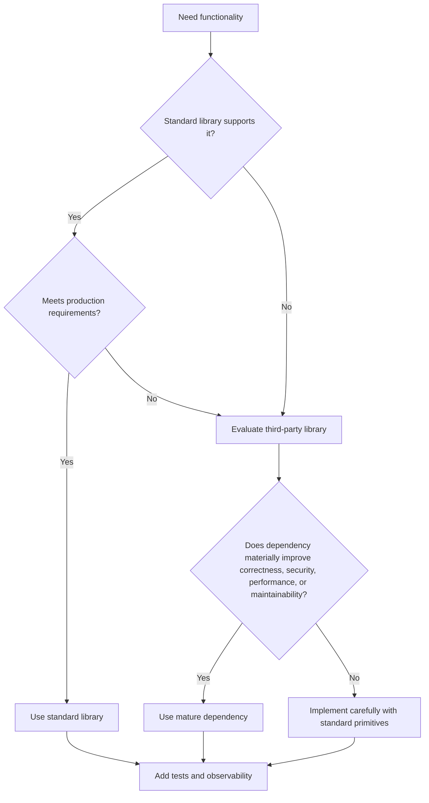

# 20- Standard Library

## Overview

Python's standard library is the collection of modules distributed with Python that provide reusable functionality without requiring third-party dependencies.

For backend engineering, the standard library is more than a collection of convenience functions. It provides foundational building blocks for:

- filesystem and path management
- networking and HTTP
- serialization
- cryptography primitives
- concurrency
- subprocess management
- configuration
- logging
- time handling
- data structures
- parsing
- testing
- performance measurement
- process and runtime inspection

A production Python engineer should know when the standard library is sufficient, when a third-party package is justified, and where standard-library behavior has operational or security implications.

A useful mental model is:

```text
                        Python Standard Library
                                  │
       ┌──────────────┬───────────┼──────────────┬───────────────┐
       ▼              ▼           ▼              ▼               ▼
   Application      Data       Runtime       Networking      Operations
       │              │           │              │               │
    pathlib        json         inspect        socket          logging
    argparse       csv          sys            urllib          subprocess
    configparser   sqlite3      os             email           signal
    dataclasses    collections  gc             ssl             tempfile
       │              │           │              │               │
       └──────────────┴───────────┴──────────────┴───────────────┘
                                  │
                                  ▼
                       Backend Application
```

The standard library should be treated as a set of stable primitives, not as a reason to avoid all dependencies. The right engineering decision depends on functionality, correctness, security, maintainability, performance, and operational requirements.

---

## Standard Library vs Third-Party Dependencies

A common production decision is whether functionality should come from Python itself or an external package.

| Requirement | Standard Library | Third Party |
|---|---|---|
| Path manipulation | `pathlib` | Usually unnecessary |
| JSON | `json` | Usually unnecessary |
| Logging | `logging` | Often extensions are useful |
| CLI parsing | `argparse` | Richer CLI frameworks may help |
| HTTP client | `urllib.request` | `httpx`, `requests` often more ergonomic |
| Async HTTP | Limited primitives | `httpx`, `aiohttp` |
| YAML | Not included | `PyYAML`, `ruamel.yaml` |
| PostgreSQL | No native driver | `psycopg` |
| Redis | No native client | Redis client library |
| Kafka | No native client | Kafka client |
| Web framework | No | Django, FastAPI |
| Testing | `unittest` | pytest and plugins |
| Cryptographic primitives | `hashlib`, `hmac`, `secrets`, `ssl` | Specialized libraries may be required |
| Data processing | `csv`, `sqlite3`, `statistics` | Pandas, NumPy for larger workloads |

A good default is:

> Prefer the standard library when it provides the required semantics cleanly; introduce third-party dependencies when they materially improve capability, correctness, ergonomics, or performance.

---

## Module Discovery

Python exposes the standard library through importable modules:

```python
import pathlib
import json
import logging
```

Some modules are packages containing submodules:

```python
import urllib.parse
import concurrent.futures
```

Useful runtime information can be inspected through:

```python
import sys

print(sys.version)
print(sys.path)
```

The installed Python version determines which standard-library features are available.

Production applications should therefore pin and explicitly test their supported Python versions.

---

## Core Module Categories

The following categories cover the modules most relevant to backend engineering.

| Category | Important Modules |
|---|---|
| Data structures | `collections`, `array`, `heapq`, `bisect` |
| Iteration | `itertools`, `functools` |
| Filesystem | `pathlib`, `os`, `shutil`, `tempfile` |
| Serialization | `json`, `csv`, `pickle`, `struct` |
| Dates and time | `datetime`, `zoneinfo`, `time`, `calendar` |
| Networking | `socket`, `ssl`, `urllib` |
| Concurrency | `threading`, `multiprocessing`, `asyncio`, `concurrent.futures` |
| Processes | `subprocess`, `signal` |
| Configuration | `os`, `configparser`, `tomllib` |
| Logging | `logging`, `logging.handlers` |
| Security | `secrets`, `hashlib`, `hmac`, `ssl` |
| CLI | `argparse`, `sys` |
| Runtime | `sys`, `os`, `platform`, `inspect`, `gc` |
| Testing | `unittest`, `unittest.mock`, `doctest` |
| Performance | `timeit`, `cProfile`, `tracemalloc` |
| Parsing | `re`, `json`, `csv`, `urllib.parse` |
| Database | `sqlite3` |
| Type/data modeling | `dataclasses`, `enum`, `typing` |

The goal is not to memorize every module. The goal is to recognize the appropriate standard-library abstraction when solving a problem.

---

## pathlib

`pathlib` provides object-oriented filesystem path handling.

```python
from pathlib import Path


config_path = Path("/etc/myservice/config.toml")

if config_path.exists():
    content = config_path.read_text(encoding="utf-8")
```

For application code, prefer:

```python
Path(...)
```

over manually constructing paths:

```python
"/var/app/" + filename
```

`pathlib` handles platform-specific path semantics more safely.

---

## pathlib in Backend Applications

A typical application may have:

```text
application/
├── app/
├── migrations/
├── tests/
├── pyproject.toml
└── scripts/
```

Code can locate resources relative to a known path:

```python
from pathlib import Path


BASE_DIR = Path(__file__).resolve().parent
CONFIG_DIR = BASE_DIR / "config"
```

This avoids assumptions about the process's current working directory.

---

## tempfile

`tempfile` creates temporary files and directories safely.

```python
from tempfile import NamedTemporaryFile


with NamedTemporaryFile(
    mode="w",
    encoding="utf-8",
    suffix=".json",
) as file:
    file.write('{"status": "ready"}')
    file.flush()

    process_file(file.name)
```

Use `tempfile` rather than manually generating names in `/tmp`.

Temporary paths can otherwise introduce:

- collisions
- race conditions
- symlink attacks
- permission mistakes

Temporary files should also have an explicit lifecycle.

---

## shutil

`shutil` provides high-level file and directory operations.

Common operations include:

```python
from pathlib import Path
import shutil


source = Path("input.csv")
destination = Path("archive/input.csv")

destination.parent.mkdir(parents=True, exist_ok=True)

shutil.copy2(source, destination)
```

It is useful for:

- copying files
- moving files
- removing directories
- creating archives
- disk usage inspection

Be cautious with destructive operations such as recursive deletion.

---

## os

`os` exposes operating-system functionality.

Common backend uses include:

```python
import os

port = int(os.environ["PORT"])
```

and:

```python
pid = os.getpid()
```

Use higher-level modules where available:

```text
pathlib
   │
   └── preferred for paths

os
   │
   └── preferred for lower-level OS/process/environment operations
```

Avoid using `os.path` for new path-heavy code when `pathlib` provides clearer semantics.

---

## Environment Variables

Environment variables are commonly used for deployment configuration:

```python
import os


database_url = os.environ["DATABASE_URL"]
debug = os.environ.get("DEBUG", "false").lower() == "true"
```

For production systems:

- validate configuration during startup
- fail fast on required missing values
- avoid storing secrets in source code
- avoid logging secret values

Environment variables are configuration inputs, not a complete configuration-management strategy.

---

## sys

`sys` provides access to Python runtime information and process-level behavior.

Common uses:

```python
import sys

if sys.version_info < (3, 12):
    raise RuntimeError("Python 3.12+ is required")
```

Other useful attributes include:

- `sys.argv`
- `sys.executable`
- `sys.path`
- `sys.stdin`
- `sys.stdout`
- `sys.stderr`
- `sys.exit()`

Avoid manipulating `sys.path` dynamically as an ordinary dependency-management strategy.

---

## argparse

`argparse` provides standard command-line argument parsing.

```python
from argparse import ArgumentParser


parser = ArgumentParser()

parser.add_argument(
    "--environment",
    choices=["development", "staging", "production"],
    required=True,
)

args = parser.parse_args()

print(args.environment)
```

It provides:

- validation
- help output
- positional arguments
- optional arguments
- subcommands
- type conversion

It is often sufficient for operational scripts and internal CLI tools.

---

## argparse Subcommands

Backend applications often expose operational commands:

```text
service
├── migrate
├── health-check
├── backfill
└── cleanup
```

`argparse` supports subcommands:

```python
from argparse import ArgumentParser


parser = ArgumentParser()
subparsers = parser.add_subparsers(dest="command", required=True)

migrate_parser = subparsers.add_parser("migrate")
migrate_parser.add_argument("--dry-run", action="store_true")

args = parser.parse_args()
```

This can be useful for deployment and maintenance tooling without introducing a third-party CLI dependency.

---

## json

`json` handles JSON encoding and decoding.

```python
import json


payload = {
    "order_id": 123,
    "status": "pending",
}

encoded = json.dumps(payload)
decoded = json.loads(encoded)
```

For files:

```python
from pathlib import Path
import json


config_path = Path("config.json")

config = json.loads(
    config_path.read_text(encoding="utf-8")
)
```

JSON is commonly used at REST and event boundaries.

---

## JSON Security

Never deserialize untrusted JSON using Python object serialization mechanisms.

JSON itself is data:

```json
{"status": "pending"}
```

but unsafe deserialization mechanisms can execute behavior.

Use:

```python
json.loads(untrusted_input)
```

for JSON data.

Validate the resulting structure before using it.

---

## csv

The `csv` module provides structured CSV processing.

```python
import csv
from pathlib import Path


with Path("orders.csv").open(
    newline="",
    encoding="utf-8",
) as file:
    reader = csv.DictReader(file)

    for row in reader:
        process_order(row)
```

Use the module instead of manually splitting:

```python
line.split(",")
```

because CSV supports:

- quoted values
- embedded commas
- escaped quotes
- different delimiters

---

## sqlite3

`sqlite3` provides access to SQLite databases.

```python
import sqlite3


with sqlite3.connect("application.db") as connection:
    rows = connection.execute(
        """
        SELECT id, status
        FROM orders
        WHERE status = ?
        """,
        ("pending",),
    ).fetchall()
```

Always parameterize SQL values.

Bad:

```python
query = f"SELECT * FROM users WHERE name = '{name}'"
```

Good:

```python
connection.execute(
    "SELECT * FROM users WHERE name = ?",
    (name,),
)
```

SQLite is useful for:

- local applications
- embedded databases
- tests
- prototypes
- small single-node systems

It is not automatically a substitute for PostgreSQL in a distributed backend architecture.

---

## datetime

`datetime` provides date and time types.

Prefer timezone-aware datetimes for production systems:

```python
from datetime import datetime, timezone


now = datetime.now(timezone.utc)
```

Avoid:

```python
datetime.now()
```

when the application needs an unambiguous instant across distributed systems.

---

## zoneinfo

`zoneinfo` provides IANA time zone support.

```python
from datetime import datetime
from zoneinfo import ZoneInfo


kolkata_time = datetime.now(
    ZoneInfo("Asia/Kolkata")
)
```

A robust backend convention is:

```text
Storage / internal processing
        │
        ▼
UTC
        │
        ▼
User-facing conversion
        │
        ▼
Configured IANA timezone
```

Avoid hard-coding UTC offsets because offsets can change with daylight-saving rules in applicable regions.

---

## Time Semantics

Distinguish between:

- an instant in time
- a local wall-clock time
- a duration
- a calendar date

For example:

```python
from datetime import datetime, timedelta, timezone


created_at = datetime.now(timezone.utc)
expires_at = created_at + timedelta(minutes=15)
```

This is appropriate for expiration calculations.

Do not treat a timezone-aware timestamp and a local calendar date as interchangeable concepts.

---

## time

The `time` module provides lower-level time functionality.

For measuring elapsed duration, use a monotonic clock:

```python
import time


started = time.monotonic()

perform_operation()

elapsed = time.monotonic() - started
```

Do not use wall-clock time for latency measurement:

```python
time.time()
```

because the system clock can change.

Use:

```text
time.monotonic()
```

for elapsed-duration measurement.

---

## collections

The `collections` module provides specialized containers.

Important structures include:

- `Counter`
- `defaultdict`
- `deque`
- `ChainMap`
- `OrderedDict`
- `namedtuple`

Example:

```python
from collections import Counter


counts = Counter(["api", "db", "api"])

print(counts["api"])
```

Use the data structure whose semantics match the access pattern.

---

## deque

`deque` is appropriate for efficient operations at both ends.

```python
from collections import deque


recent_requests = deque(maxlen=1_000)

recent_requests.append(request_id)
```

This is useful for:

- bounded queues
- sliding windows
- local work queues
- recent-event buffers

For distributed queues, use infrastructure such as Redis, Kafka, SQS, or another appropriate broker.

---

## itertools

`itertools` provides lazy iterator operations.

```python
from itertools import islice


records = load_records()

for record in islice(records, 1_000):
    process(record)
```

This avoids unnecessarily materializing the entire iterable.

Important functions include:

- `chain`
- `islice`
- `groupby`
- `batched`
- `pairwise`
- `product`
- `combinations`
- `zip_longest`

`itertools` is particularly valuable for memory-efficient pipelines.

---

## functools

`functools` provides higher-order function utilities.

Important functions include:

- `partial`
- `lru_cache`
- `cache`
- `cached_property`
- `wraps`
- `reduce`
- `singledispatch`

Example:

```python
from functools import lru_cache


@lru_cache(maxsize=256)
def calculate_policy(user_id: int):
    return load_policy(user_id)
```

Caching must be designed around:

- memory
- invalidation
- process scope
- mutability
- security context
- concurrency

---

## re

The `re` module provides regular expressions.

```python
import re


pattern = re.compile(
    r"^order-[0-9]+$"
)

if pattern.fullmatch(order_id):
    ...
```

For complete validation, prefer:

```python
pattern.fullmatch(value)
```

over using `search()` and assuming the entire string matched.

Regex should not replace:

- parsers
- database constraints
- authorization
- structured validation

---

## uuid

The `uuid` module generates universally unique identifiers.

```python
from uuid import uuid4


request_id = uuid4()
```

A UUID is useful for:

- correlation identifiers
- entity identifiers
- idempotency-related identifiers
- distributed tracing metadata

However, UUID uniqueness does not provide security by itself.

If an identifier must be unpredictable for security purposes, consider `secrets` and the specific threat model.

---

## secrets

The `secrets` module is designed for security-sensitive random values.

```python
import secrets


token = secrets.token_urlsafe(32)
```

Use it for:

- password reset tokens
- session secrets
- API tokens
- CSRF-related random values
- temporary authentication challenges

Do not use:

```python
import random

random.random()
```

for security-sensitive randomness.

---

## hashlib

`hashlib` provides cryptographic hash functions.

```python
import hashlib


digest = hashlib.sha256(
    b"payload"
).hexdigest()
```

Hashing is useful for:

- integrity checks
- content addressing
- fingerprints
- deterministic digests

Do not use general-purpose hashes such as SHA-256 directly for password storage.

Password hashing requires dedicated password-hashing algorithms with salts and work factors.

---

## hmac

`hmac` provides keyed-hash message authentication.

```python
import hashlib
import hmac


expected = hmac.new(
    secret_key,
    message,
    hashlib.sha256,
).digest()

if not hmac.compare_digest(expected, provided_signature):
    raise ValueError("Invalid signature")
```

`compare_digest()` helps avoid timing-attack issues associated with naive comparisons in security-sensitive contexts.

HMAC is useful for:

- webhook verification
- signed messages
- request authentication
- integrity validation

---

## ssl

The `ssl` module provides TLS support.

It is relevant when Python applications establish secure network connections.

For client-side TLS, prefer verified certificates and secure defaults rather than disabling verification:

```python
import ssl


context = ssl.create_default_context()
```

Avoid:

```python
context.check_hostname = False
context.verify_mode = ssl.CERT_NONE
```

in production unless there is an explicitly controlled and justified trust model.

---

## socket

`socket` exposes low-level network communication.

```python
import socket


with socket.create_connection(
    ("example.internal", 443),
    timeout=2.0,
) as sock:
    ...
```

Most backend applications should use higher-level clients or frameworks instead of implementing protocols directly with sockets.

Understanding sockets is nevertheless important for diagnosing:

- connection failures
- timeouts
- DNS behavior
- TCP lifecycle
- connection pooling
- network backpressure

---

## urllib

`urllib` provides standard-library URL and HTTP functionality.

For example:

```python
from urllib.parse import urlencode


query = urlencode(
    {
        "status": "pending",
        "limit": 100,
    }
)

url = f"https://api.example.com/orders?{query}"
```

`urllib.parse` is especially useful even when a third-party HTTP client is used elsewhere.

---

## HTTP Client Considerations

Python's standard library provides HTTP primitives, but production applications often use specialized clients such as:

- `httpx`
- `requests`
- `aiohttp`

The standard library may be sufficient for simple utilities, but production HTTP clients often need:

- connection pooling
- retries
- timeout configuration
- async support
- richer authentication
- observability hooks
- proxy support
- ergonomic request APIs

Do not implement an HTTP client from scratch merely to avoid a dependency.

---

## asyncio

`asyncio` provides asynchronous concurrency primitives.

```python
import asyncio


async def fetch_data():
    await asyncio.sleep(0.1)
    return {"status": "ok"}


async def main():
    result = await fetch_data()
    print(result)


asyncio.run(main())
```

It is useful for I/O-bound workloads where operations can yield control.

Typical backend uses include:

- async HTTP clients
- high-concurrency network services
- async database drivers
- WebSocket services
- task coordination

Asyncio does not make CPU-bound work automatically parallel.

---

## concurrent.futures

`concurrent.futures` provides high-level executors.

```python
from concurrent.futures import ThreadPoolExecutor


def process_file(path):
    ...


with ThreadPoolExecutor(max_workers=8) as executor:
    results = list(
        executor.map(process_file, paths)
    )
```

The main abstractions are:

- `ThreadPoolExecutor`
- `ProcessPoolExecutor`

Use threads primarily for I/O-bound work and processes when CPU-bound work needs process-level parallelism.

---

## threading

`threading` provides thread-based concurrency.

Important primitives include:

- `Thread`
- `Lock`
- `RLock`
- `Semaphore`
- `Event`
- `Condition`

Example:

```python
from threading import Lock


lock = Lock()
counter = 0


def increment():
    global counter

    with lock:
        counter += 1
```

Locks protect shared mutable state; they do not automatically make an entire architecture thread-safe.

---

## multiprocessing

`multiprocessing` provides process-based concurrency.

It can be useful for CPU-bound workloads that need process isolation.

```python
from multiprocessing import Pool


def transform(value: int) -> int:
    return value * value


with Pool() as pool:
    results = pool.map(transform, values)
```

For production systems, consider whether a process pool is preferable to:

- Celery
- AWS Batch
- ECS jobs
- Kubernetes Jobs
- dedicated worker services

The correct choice depends on workload duration, reliability, scaling, and operational requirements.

---

## subprocess

`subprocess` runs external programs.

```python
import subprocess


result = subprocess.run(
    ["git", "rev-parse", "HEAD"],
    check=True,
    capture_output=True,
    text=True,
)

commit = result.stdout.strip()
```

Prefer argument lists over shell command strings.

Avoid:

```python
subprocess.run(
    f"command {user_input}",
    shell=True,
)
```

when user input can influence the command.

This can create command-injection vulnerabilities.

---

## subprocess Security

The safe pattern is:

```python
subprocess.run(
    ["program", "--option", value],
    check=True,
)
```

The dangerous pattern is:

```python
subprocess.run(
    f"program --option {value}",
    shell=True,
)
```

Security considerations include:

- untrusted arguments
- shell expansion
- environment variables
- executable lookup
- working directory
- filesystem permissions
- process privileges
- resource consumption

If an external process is not necessary, avoid spawning one.

---

## signal

The `signal` module handles operating-system signals.

Backend applications commonly need:

```text
SIGTERM
    │
    ▼
Application
    │
    ├── stop accepting new work
    ├── finish safe in-flight work
    ├── close connections
    └── exit
```

This is important for:

- Docker
- Kubernetes
- ECS
- systemd
- graceful deployments

Signal handling must account for the application's concurrency model.

---

## logging

The `logging` module provides the standard logging framework.

```python
import logging


logger = logging.getLogger(__name__)


logger.info(
    "order processed",
    extra={"order_id": order_id},
)
```

Configure logging centrally rather than configuring handlers independently in every module.

A common architecture is:

```text
Application code
      │
      ▼
logging.Logger
      │
      ▼
handlers / formatters
      │
      ▼
stdout / file / external collector
      │
      ▼
CloudWatch / ELK / OpenTelemetry pipeline
```

---

## Logging Levels

Common levels include:

| Level | Typical Use |
|---|---|
| `DEBUG` | Detailed diagnostics |
| `INFO` | Normal operational events |
| `WARNING` | Unexpected but recoverable condition |
| `ERROR` | Failed operation |
| `CRITICAL` | Severe service-level failure |

Do not use `ERROR` for every unusual condition.

Logs should communicate operational severity accurately.

---

## Structured Logging

The standard `logging` module can support structured logging patterns, although dedicated structured-logging libraries may provide better ergonomics.

Useful fields include:

```text
timestamp
service
environment
request_id
trace_id
operation
duration_ms
status
error_type
```

Avoid:

```python
logger.info(
    f"request from {user_email} failed"
)
```

if the field contains sensitive information or cannot be reliably queried.

---

## Configuration with tomllib

Modern Python includes `tomllib` for reading TOML.

```python
import tomllib
from pathlib import Path


with Path("pyproject.toml").open("rb") as file:
    config = tomllib.load(file)
```

`tomllib` is read-only.

It is useful for:

- application metadata
- tool configuration
- static configuration files
- Python packaging configuration

For mutable configuration formats, another library may be more appropriate.

---

## configparser

`configparser` handles INI-style configuration.

```python
from configparser import ConfigParser


config = ConfigParser()
config.read("service.ini")

database_host = config["database"]["host"]
```

It remains useful for traditional configuration formats, but modern backend applications often use:

- environment variables
- TOML
- typed configuration models
- secret managers

Choose based on deployment requirements rather than familiarity.

---

## dataclasses

`dataclasses` provides concise data models.

```python
from dataclasses import dataclass


@dataclass(frozen=True)
class Order:
    id: int
    status: str
```

They are useful for:

- DTOs
- configuration models
- value objects
- internal data structures

Use framework-native models where a framework already defines persistence or validation semantics.

---

## enum

The `enum` module represents finite symbolic sets.

```python
from enum import StrEnum


class OrderStatus(StrEnum):
    PENDING = "pending"
    SHIPPED = "shipped"
```

Enums are useful at domain boundaries where arbitrary strings would weaken correctness.

They should be designed with API, database, and event evolution in mind.

---

## typing

The `typing` module provides type-system constructs.

Modern Python code can use:

```python
from collections.abc import Sequence


def process_orders(
    orders: Sequence[int],
) -> list[int]:
    return [order * 2 for order in orders]
```

For backend systems, static typing improves:

- refactoring safety
- IDE support
- API clarity
- interface design
- defect detection

Type hints do not replace runtime validation.

---

## inspect

`inspect` provides runtime introspection.

```python
import inspect


def handler(user_id: int) -> str:
    return str(user_id)


print(inspect.signature(handler))
```

It is useful for:

- framework internals
- decorators
- dependency injection
- debugging
- test infrastructure
- dynamic tooling

Avoid building business logic around fragile introspection unless the behavior is explicitly part of the framework design.

---

## contextlib

`contextlib` simplifies context-manager patterns.

```python
from contextlib import contextmanager


@contextmanager
def managed_resource():
    resource = acquire()
    try:
        yield resource
    finally:
        release(resource)
```

It is useful for deterministic resource cleanup:

- files
- locks
- database transactions
- temporary configuration
- tracing spans
- resource ownership

Context managers are especially valuable for ensuring cleanup on exceptions.

---

## copy

The `copy` module provides shallow and deep copying.

```python
from copy import deepcopy


isolated_config = deepcopy(config)
```

Understand whether the object graph contains:

- mutable nested objects
- shared references
- external resources
- custom copy behavior

Blindly using `deepcopy()` can be expensive and may copy more state than intended.

Prefer immutable models or explicit reconstruction when practical.

---

## operator

The `operator` module exposes Python operations as callables.

```python
from operator import itemgetter


orders.sort(key=itemgetter("created_at"))
```

It can make functional pipelines concise and avoid trivial lambdas.

Other useful functions include:

- `attrgetter`
- `itemgetter`
- `methodcaller`
- arithmetic operators
- comparison operators

---

## heapq

`heapq` provides heap-based priority queues.

```python
import heapq


queue = []

heapq.heappush(queue, (10, "low-priority"))
heapq.heappush(queue, (1, "urgent"))

priority, item = heapq.heappop(queue)
```

This is useful for:

- priority scheduling
- top-N calculations
- local task queues
- algorithmic workloads

It is not a replacement for a distributed task queue such as Celery or SQS.

---

## bisect

`bisect` provides binary-search insertion operations for sorted sequences.

```python
from bisect import bisect_left


positions = [10, 20, 30, 40]

index = bisect_left(positions, 25)
```

This can be useful for:

- sorted thresholds
- lookup tables
- interval boundaries
- local ranking logic

Remember that binary search is efficient for lookup, but inserting into a Python list still requires shifting elements.

---

## statistics

The `statistics` module provides common statistical calculations.

```python
from statistics import mean, median


latencies = [12.0, 15.0, 18.0, 21.0]

average = mean(latencies)
middle = median(latencies)
```

It is useful for simple local calculations.

For large-scale numerical workloads, NumPy and specialized analytics systems may be more appropriate.

---

## math

`math` provides mathematical functions and constants.

```python
import math


rounded_pages = math.ceil(total_items / page_size)
```

Useful functions include:

- `ceil`
- `floor`
- `sqrt`
- `log`
- `isclose`
- `prod`

Prefer `math.isclose()` when comparing floating-point values where exact equality is inappropriate.

---

## decimal

`decimal` provides decimal floating-point arithmetic.

It is useful for exact decimal business calculations:

```python
from decimal import Decimal


price = Decimal("19.99")
tax = Decimal("0.18")

total = price * (Decimal("1") + tax)
```

For financial calculations, avoid:

```python
19.99 * 1.18
```

using binary floating-point arithmetic when exact decimal semantics are required.

The correct approach depends on the domain and database representation.

---

## fractions

`fractions.Fraction` represents rational numbers exactly.

```python
from fractions import Fraction


ratio = Fraction(1, 3) + Fraction(1, 6)

print(ratio)
```

It is useful when exact rational arithmetic matters.

It is uncommon in typical web backends but useful for algorithmic and mathematical domains.

---

## random

`random` provides pseudo-random number generation.

```python
import random


retry_delay = random.uniform(0.5, 2.0)
```

This can be appropriate for:

- simulation
- testing
- randomized algorithms
- non-security-sensitive jitter

For security-sensitive randomness, use `secrets`.

---

## queue

The `queue` module provides thread-safe queues.

```python
from queue import Queue


work_queue = Queue(maxsize=1_000)

work_queue.put(task)

task = work_queue.get()
work_queue.task_done()
```

It is useful for in-process producer-consumer patterns.

It does not provide:

- persistence
- distributed delivery
- cross-process durability
- replay
- dead-letter queues

For those requirements, use infrastructure such as Kafka, SQS, Redis, or Celery.

---

## uuid and Idempotency

UUIDs are commonly useful for idempotency keys:

```python
from uuid import uuid4


idempotency_key = str(uuid4())
```

A robust idempotency architecture still requires persistence:

```text
Client
  │
  ▼
Idempotency-Key
  │
  ▼
API
  │
  ▼
PostgreSQL / Redis
  │
  ├── existing result → return it
  │
  └── new request ────► process
```

Generating a UUID alone does not make an operation idempotent.

---

## pathlib + tempfile + subprocess

Standard-library modules often become more useful when combined.

```python
from pathlib import Path
import subprocess
from tempfile import TemporaryDirectory


with TemporaryDirectory() as directory:
    work_dir = Path(directory)

    output_file = work_dir / "output.txt"

    subprocess.run(
        ["some-tool", "--output", str(output_file)],
        check=True,
    )

    result = output_file.read_text(encoding="utf-8")
```

The temporary directory is automatically cleaned up.

This is a strong pattern for controlled integration with external command-line tools.

---

## Standard Library in FastAPI

FastAPI applications frequently rely on standard-library components around the framework:

```text
FastAPI
  │
  ├── pathlib       → filesystem resources
  ├── dataclasses   → internal DTOs
  ├── enum          → domain states
  ├── datetime      → timestamps
  ├── logging       → application logs
  ├── secrets       → secure tokens
  ├── functools     → decorators/caching
  ├── contextlib    → resource lifecycle
  └── asyncio       → async execution
```

The framework does not eliminate the need to understand the underlying Python runtime.

---

## Standard Library in Django

Django applications commonly use:

- `datetime`
- `zoneinfo`
- `pathlib`
- `logging`
- `secrets`
- `uuid`
- `enum`
- `functools`
- `contextlib`
- `json`

Django provides higher-level abstractions for many concerns, so prefer Django-native mechanisms when they provide stronger framework integration.

For example:

```text
Django ORM
    │
    └── preferred over direct sqlite3/PostgreSQL access
```

when operating inside normal Django persistence architecture.

---

## Standard Library in Microservices

A microservice may use the standard library for:

```text
Configuration
 ├── os
 ├── tomllib
 └── pathlib

Runtime
 ├── signal
 ├── logging
 └── contextlib

Security
 ├── secrets
 ├── hmac
 ├── hashlib
 └── ssl

Concurrency
 ├── asyncio
 ├── threading
 └── concurrent.futures
```

External infrastructure handles distributed concerns:

```text
Python process
      │
      ├── Redis
      ├── PostgreSQL
      ├── Kafka
      ├── AWS
      └── Kubernetes
```

The standard library handles local process behavior; infrastructure handles distributed state and coordination.

---

## Standard Library and AWS

AWS-hosted Python applications can use standard-library modules for local concerns:

```text
Lambda / ECS / EKS
        │
        ├── logging
        ├── os
        ├── pathlib
        ├── datetime
        ├── secrets
        └── json
```

AWS SDK functionality normally comes from:

```text
boto3
```

rather than the standard library.

Do not implement AWS service protocols manually with `urllib` unless there is a strong specialized reason.

Use the official SDK for service integration.

---

## Standard Library and Docker

Containers make process-level standard-library knowledge important.

A Python container should generally:

- log to stdout/stderr
- handle `SIGTERM`
- exit with meaningful status codes
- avoid relying on local persistent filesystem state
- use environment/configuration injection
- clean up resources on shutdown

For example:

```python
import signal
import sys


def handle_shutdown(signum, frame):
    shutdown_application()
    sys.exit(0)


signal.signal(signal.SIGTERM, handle_shutdown)
```

The exact shutdown implementation depends on whether the application is synchronous, threaded, or asynchronous.

---

## Standard Library and Kubernetes

Kubernetes may terminate a pod during:

- rolling deployments
- scaling
- node maintenance
- eviction
- configuration changes

Python's:

- `signal`
- `asyncio`
- `contextlib`
- logging infrastructure

can participate in graceful shutdown.

The important lifecycle is:

```text
SIGTERM
   │
   ▼
Stop accepting new work
   │
   ▼
Drain in-flight work
   │
   ▼
Close resources
   │
   ▼
Exit
```

Do not depend on the process receiving unlimited time for cleanup. Kubernetes termination behavior includes deadlines.

---

## Performance Considerations

Standard-library modules are often optimized and should be preferred over handwritten equivalents when semantics match.

For example:

```python
from collections import deque
```

is generally preferable to implementing a custom queue with a list:

```python
items.pop(0)
```

Similarly:

```python
sum(values)
```

is clearer and generally more appropriate than:

```python
reduce(operator.add, values)
```

Performance decisions should be measured with:

- `timeit`
- `cProfile`
- `tracemalloc`
- application metrics
- production profiling

Do not optimize based solely on assumptions.

---

## Memory Efficiency

Many standard-library tools support lazy or bounded processing:

```python
from itertools import islice


records = load_records()

for record in islice(records, 10_000):
    process(record)
```

Avoid:

```python
records = list(load_records())
```

when the source may be large or unbounded.

Useful memory-efficient patterns include:

- generators
- `itertools`
- streaming file reads
- `csv.DictReader`
- bounded `deque`
- `tempfile`
- database cursors where supported

---

## Concurrency and Standard Library

Standard-library concurrency primitives operate within the local process or machine.

```text
Python process
 ├── asyncio
 ├── threads
 ├── processes
 └── queues
```

They do not automatically provide distributed coordination.

For example:

```python
threading.Lock()
```

cannot coordinate:

```text
Pod A
   │
   └── Lock A

Pod B
   │
   └── Lock B
```

Each process has its own lock.

For distributed coordination, use infrastructure designed for that purpose.

---

## Reliability

Standard-library primitives should fail predictably.

Examples:

```python
subprocess.run(..., check=True)
```

turns a non-zero process exit into an exception.

Similarly:

```python
Path(...).read_text(...)
```

can surface filesystem failures explicitly.

Avoid broadly swallowing errors:

```python
try:
    ...
except Exception:
    pass
```

This hides operational failures and makes production diagnosis difficult.

---

## Timeouts

Many standard-library APIs support timeout configuration.

For network operations:

```python
import socket


with socket.create_connection(
    ("service.internal", 443),
    timeout=2.0,
):
    ...
```

Timeouts should be deliberate.

A production service should generally have bounded waiting for:

- network connections
- external commands
- queue operations
- shutdown operations

An unbounded wait can consume worker capacity indefinitely.

---

## Security Considerations

The standard library contains strong security primitives, but they must be used correctly.

Prefer:

| Requirement | Standard Library |
|---|---|
| Secure random token | `secrets` |
| Cryptographic digest | `hashlib` |
| Message authentication | `hmac` |
| TLS | `ssl` |
| Temporary files | `tempfile` |
| Safe URL parsing | `urllib.parse` |
| Password hashing | Dedicated password-hashing library |

Do not confuse:

```text
encoding
≠
encryption

hashing
≠
password hashing

UUID
≠
authentication token

input validation
≠
authorization
```

These distinctions are critical in production systems.

---

## Pickle Security

`pickle` can serialize arbitrary Python objects, but it is unsafe for untrusted input.

Never do:

```python
pickle.loads(untrusted_data)
```

because pickle deserialization can execute arbitrary code.

Use safer formats such as:

- JSON
- CSV
- explicit binary protocols
- validated schemas

when data crosses a trust boundary.

---

## Logging Security

Avoid logging:

- passwords
- API tokens
- session cookies
- authorization headers
- private keys
- sensitive personal data

Bad:

```python
logger.info(
    "request headers=%s",
    request.headers,
)
```

A single log statement can expose credentials.

Logging is part of the security boundary because logs are often shipped to centralized systems with long retention periods.

---

## Operational Considerations

Production standard-library usage should account for:

- filesystem permissions
- process lifecycle
- signal handling
- time zones
- environment configuration
- logging destinations
- resource cleanup
- network timeouts
- subprocess privileges
- memory usage

A useful rule is:

> Every standard-library primitive that touches an external resource should have an explicit lifecycle and failure strategy.

---

## Testing Standard-Library Integration

Standard-library behavior should usually be tested at the application boundary rather than re-testing Python itself.

For example, test your application's interpretation of configuration:

```python
def test_environment_is_parsed():
    environment = parse_environment("production")

    assert environment is Environment.PRODUCTION
```

For filesystem code, use temporary directories:

```python
from pathlib import Path


def test_write_report(tmp_path: Path):
    output = tmp_path / "report.txt"

    write_report(output)

    assert output.exists()
```

For subprocess code, mock or isolate external commands in unit tests and use controlled integration tests where execution behavior itself matters.

---

## Standard Library and Dependency Management

Using the standard library reduces dependency surface area.

Benefits include:

- fewer packages to patch
- fewer transitive dependencies
- simpler container images
- smaller supply-chain surface
- easier deployment
- fewer version conflicts

But dependency minimization should not become an absolute goal.

A mature decision considers:

```text
Capability
   │
   ├── correctness
   ├── security
   ├── maintainability
   ├── performance
   ├── ecosystem maturity
   └── operational cost
```

A well-maintained third-party package can be a better engineering choice than a large custom implementation using only the standard library.

---

## Supply Chain Security

Every dependency adds supply-chain risk.

For third-party packages:

- pin or constrain versions appropriately
- review dependency trees
- scan vulnerabilities
- monitor security advisories
- remove unused packages
- use trusted package sources
- reproduce builds where possible

The standard library reduces this surface, but it does not eliminate the need for security updates.

Python itself must also be patched.

---

## Python Version Compatibility

Standard-library APIs evolve.

For example:

```text
Python 3.10
    └── structural pattern matching

Python 3.11
    └── StrEnum

Python 3.12
    └── itertools.batched

Python 3.13+
    └── newer standard-library enhancements
```

Before using a newer feature:

1. Verify the minimum supported Python version.
2. Check CI matrices.
3. Check production runtime versions.
4. Update container/base-image versions if necessary.
5. Update deployment environments.
6. Test compatibility.

Do not assume the development interpreter matches production.

---

## Standard Library Reference

| Problem | Preferred Module |
|---|---|
| Paths | `pathlib` |
| Environment variables | `os` |
| Temporary resources | `tempfile` |
| File operations | `pathlib`, `shutil` |
| JSON | `json` |
| CSV | `csv` |
| SQLite | `sqlite3` |
| Dates | `datetime` |
| Time zones | `zoneinfo` |
| Secure random values | `secrets` |
| Hashing | `hashlib` |
| Message authentication | `hmac` |
| TLS | `ssl` |
| Regular expressions | `re` |
| UUIDs | `uuid` |
| Logging | `logging` |
| CLI | `argparse` |
| Context managers | `contextlib` |
| Caching/decorators | `functools` |
| Specialized containers | `collections` |
| Iterator pipelines | `itertools` |
| Priority queues | `heapq` |
| Sorted insertion/search | `bisect` |
| Async I/O | `asyncio` |
| Thread/process pools | `concurrent.futures` |
| Threads | `threading` |
| Processes | `multiprocessing` |
| External commands | `subprocess` |
| OS signals | `signal` |
| Introspection | `inspect` |
| Runtime information | `sys`, `platform` |
| Data models | `dataclasses` |
| Finite constants | `enum` |
| Type hints | `typing`, `collections.abc` |
| Decimal arithmetic | `decimal` |
| Benchmarking | `timeit` |
| Profiling | `cProfile` |
| Memory profiling | `tracemalloc` |
| Testing | `unittest` |

---

## Common Mistakes

### Reimplementing Standard-Library Functionality

Bad:

```python
def split_path(path):
    ...
```

when `pathlib` already provides the required behavior.

Prefer existing standard-library abstractions unless the application has a specific domain requirement.

### Using `time.time()` for Latency

Bad:

```python
start = time.time()
...
elapsed = time.time() - start
```

Prefer:

```python
start = time.monotonic()
...
elapsed = time.monotonic() - start
```

### Using random for Secrets

Bad:

```python
random.randint(...)
```

Prefer:

```python
secrets.token_urlsafe(...)
```

### Building Shell Commands with User Input

Bad:

```python
subprocess.run(
    f"tool {user_input}",
    shell=True,
)
```

Prefer argument lists and avoid shell interpretation.

### Treating Local Queues as Distributed Queues

`queue.Queue`, `deque`, and in-process locks do not coordinate across service replicas.

### Ignoring Time Zones

Naive timestamps create ambiguity in distributed systems.

### Swallowing Exceptions

Broad exception suppression makes failures invisible.

### Using Pickle Across Trust Boundaries

Never deserialize untrusted pickle data.

### Assuming Standard Library Means Production-Ready by Default

A module being in the standard library does not remove the need for:

- timeouts
- validation
- security controls
- observability
- resource limits
- lifecycle management

---

## Production Pitfalls

| Pitfall | Consequence | Better Practice |
|---|---|---|
| Manual path concatenation | Platform bugs | `pathlib` |
| Naive datetimes | Incorrect cross-region behavior | Aware UTC datetimes |
| `time.time()` for latency | Clock adjustments affect measurements | `time.monotonic()` |
| `random` for tokens | Predictable security values | `secrets` |
| `shell=True` with input | Command injection | Argument lists |
| Unbounded local caches | Memory growth | Bounded caching |
| In-process queue for distributed work | Work lost on process failure | Kafka/SQS/Celery/etc. |
| Direct `sqlite3` in distributed service | Concurrency/scaling limitations | PostgreSQL or suitable datastore |
| Pickle from untrusted source | Arbitrary code execution | Safe serialization |
| Missing network timeouts | Worker starvation | Explicit timeouts |
| Logging secrets | Credential exposure | Redaction |
| Ignoring signals | Abrupt shutdown | Graceful shutdown |
| Assuming Python version parity | Deployment failures | Pin/test runtime versions |

---

## Senior-Level Engineering Heuristics

When choosing a standard-library module, ask:

1. Does the standard library already provide the required semantics?
2. Is the API sufficiently expressive for the production use case?
3. Does the module have the required concurrency behavior?
4. What are its memory characteristics?
5. Does it support timeouts and cancellation where needed?
6. What happens during process termination?
7. Does the operation cross a trust boundary?
8. Does the module provide safe defaults?
9. Is the functionality process-local or distributed?
10. Would a third-party library materially reduce custom code or risk?
11. What Python versions support the required API?
12. Does the chosen abstraction integrate correctly with Django, FastAPI, Celery, Kubernetes, or AWS?
13. Is the behavior observable?
14. What happens under failure, restart, retry, and partial completion?
15. Is the dependency decision optimizing for total engineering cost rather than dependency count alone?

The standard library is strongest when it provides a small, well-defined primitive.

Use specialized infrastructure when the problem itself is distributed.

---

## Decision Framework



The decision should be based on engineering requirements rather than ideology.

---

## Standard Library vs Infrastructure

A critical senior-level distinction is scope.

```text
Standard Library
       │
       ▼
Single Python process
       │
       ├── filesystem
       ├── memory
       ├── threads
       ├── processes
       ├── local queues
       └── local caches


Distributed Infrastructure
       │
       ▼
Multiple processes / hosts
       │
       ├── PostgreSQL
       ├── Redis
       ├── Kafka
       ├── SQS
       ├── Kubernetes
       └── AWS services
```

For example:

```python
threading.Lock()
```

solves a local synchronization problem.

Redis distributed locking or a database transaction solves a different class of problem.

Likewise:

```python
queue.Queue()
```

is an in-process queue, while:

```text
Kafka / SQS / Celery
```

provides infrastructure for durable or distributed work.

---

## Production Checklist

Before shipping Python code that relies heavily on the standard library, verify:

- The standard-library abstraction matches the actual problem.
- Supported Python versions provide every required API.
- Paths use `pathlib` where appropriate.
- File resources have deterministic cleanup.
- Temporary files use `tempfile`.
- External commands avoid unsafe shell construction.
- Network operations have explicit timeouts.
- TLS certificate verification remains enabled.
- Security-sensitive randomness uses `secrets`.
- Hashing and HMAC are used for the correct security purpose.
- Passwords use dedicated password-hashing algorithms.
- Untrusted data is never deserialized with `pickle`.
- Timestamps use explicit timezone semantics.
- Elapsed time uses a monotonic clock.
- Logs do not expose credentials or sensitive data.
- Local concurrency primitives are not mistaken for distributed coordination.
- Process shutdown handles `SIGTERM` appropriately.
- Caches and queues have bounded resource usage where required.
- SQLite is not being used as an accidental substitute for a production relational database.
- Configuration is validated during startup.
- Exceptions are propagated or handled intentionally.
- Tests isolate filesystem, process, network, and time-dependent behavior.
- Third-party dependencies are introduced when they materially improve the production solution.
- Dependency and Python runtime versions are tested and managed through CI/CD.

## Key Takeaways

- Python's standard library provides the foundational primitives for filesystem access, serialization, networking, concurrency, security, configuration, logging, runtime management, and testing; knowing these primitives reduces unnecessary custom code and dependencies.
- Choose the standard library based on semantics and production requirements, not simply because it is built into Python; specialized libraries are appropriate when they materially improve correctness, capability, or maintainability.
- Process-local primitives such as `threading.Lock`, `queue.Queue`, `lru_cache`, and `asyncio` do not provide distributed coordination, durability, or shared state across Kubernetes replicas.
- Security-sensitive code requires deliberate module selection: use `secrets` for secure randomness, `hmac` for message authentication, `ssl` for verified TLS, parameterized SQL for database access, and never deserialize untrusted `pickle` data.
- Senior Python engineering requires understanding operational boundaries: timeouts, resource cleanup, signal handling, observability, memory limits, Python-version compatibility, failure behavior, and when to move responsibility from local standard-library primitives to distributed infrastructure.