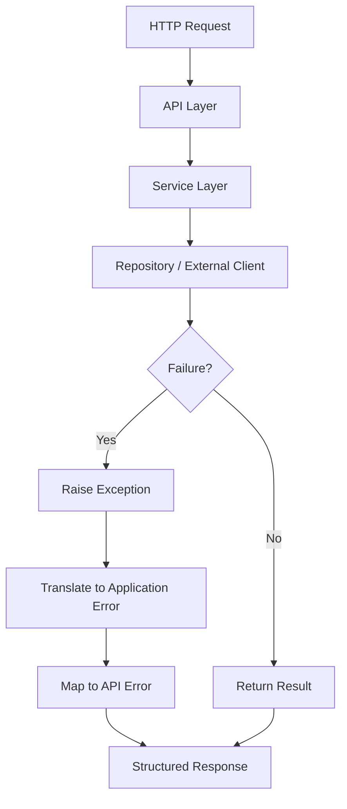
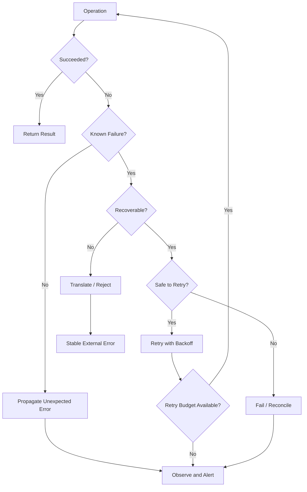

# README

## Overview

This folder covers Python exception handling from basic exception semantics through production-oriented error design, recovery, retries, API error translation, and distributed-system failure handling.

Exception handling is not simply about preventing a program from crashing. In backend systems, exceptions are part of the application's failure model. They communicate that an operation could not complete normally and allow different layers to decide whether the failure should be:

- handled locally
- translated into a domain error
- retried
- rolled back
- logged
- exposed to an API client
- sent to a dead-letter queue
- propagated to a higher layer
- treated as a fatal process-level failure

A useful mental model is:

```text
External Failure
      │
      ▼
Python Exception
      │
      ▼
Application / Domain Layer
      │
      ├── recover
      ├── retry
      ├── rollback
      ├── translate
      ├── log / observe
      └── propagate
              │
              ▼
        System Boundary
              │
       ┌──────┴──────┐
       ▼             ▼
   API Response   Worker Failure
```

The objective of this folder is to make exception behavior deliberate rather than accidental.

---

## Folder Structure

```text
04- Error Handling/
│
├── 01- Exception Fundamentals.md
├── 02- Exception Hierarchy.md
├── 03- Try Except.md
├── 04- Else and Finally.md
├── 05- Raising Exceptions.md
├── 06- Custom Exceptions.md
├── 07- Exception Chaining.md
├── 08- Exception Handling Patterns.md
├── 09- Retry and Recovery.md
├── 10- Error Handling in APIs.md
└── README.md
```

---

## Learning Progression

The folder progresses from Python's exception model toward backend failure-handling architecture.

```text
Exception Fundamentals
        │
        ▼
Exception Hierarchy
        │
        ▼
try / except
        │
        ▼
else / finally
        │
        ▼
raise
        │
        ▼
Custom Exceptions
        │
        ▼
Exception Chaining
        │
        ▼
Exception Handling Patterns
        │
        ▼
Retry and Recovery
        │
        ▼
API Error Handling
```

Each stage builds on the previous one.

---

## Exception Fundamentals

`01- Exception Fundamentals.md` establishes the runtime model of Python exceptions.

Core concepts include:

- what an exception represents
- why exceptions exist
- normal control flow vs exceptional control flow
- exception propagation
- stack unwinding
- traceback generation
- handling vs propagation
- synchronous exception behavior
- asynchronous exception behavior

The important distinction is:

```text
Normal execution
    │
    ▼
statement
    │
    ▼
next statement


Exceptional execution
    │
    ▼
exception raised
    │
    ▼
stack unwinding
    │
    ▼
nearest compatible handler
    │
    ├── handled
    └── propagated
```

Understanding propagation is essential before designing application-level error handling.

---

## Exception Hierarchy

`02- Exception Hierarchy.md` explains Python's exception inheritance model.

Important concepts include:

- `BaseException`
- `Exception`
- built-in exception classes
- inheritance-based matching
- `except` ordering
- broad vs narrow handlers
- `BaseException` vs `Exception`

The hierarchy matters because:

```python
except ValueError:
    ...
```

matches `ValueError` and subclasses, while:

```python
except Exception:
    ...
```

matches most application-level exceptions.

A broad handler can therefore unintentionally capture errors that should have propagated.

---

## try and except

`03- Try Except.md` focuses on the primary exception-handling construct.

A production handler should generally catch the narrowest exception it can meaningfully handle:

```python
try:
    user_id = int(raw_user_id)
except ValueError:
    raise InvalidUserInput("user_id must be an integer")
```

The key design question is not:

> "Can I catch this exception?"

It is:

> "Can this layer make a correct decision about this failure?"

If not, propagate it.

---

## else and finally

`04- Else and Finally.md` covers the complete `try` statement lifecycle.

```python
try:
    result = perform_operation()
except OperationError:
    recover()
else:
    publish_success(result)
finally:
    release_resources()
```

The constructs have distinct responsibilities:

| Construct | Purpose |
|---|---|
| `try` | Operation that may fail |
| `except` | Handle specific exceptions |
| `else` | Execute only when `try` succeeds |
| `finally` | Execute cleanup regardless of outcome |

`finally` is particularly important for deterministic cleanup.

Context managers covered in Intermediate Python often provide a safer and more reusable abstraction for this lifecycle.

---

## Raising Exceptions

`05- Raising Exceptions.md` covers explicit failure signaling.

```python
if amount <= 0:
    raise ValueError("amount must be positive")
```

Raising an exception communicates that the current operation cannot continue under the current conditions.

Production code should raise exceptions that match the abstraction level.

For example:

```text
Database timeout
      │
      ▼
Repository layer
      │
      ▼
RepositoryTimeout
      │
      ▼
Service layer
      │
      ▼
DependencyUnavailable
      │
      ▼
API layer
      │
      ▼
HTTP 503
```

The internal infrastructure error does not necessarily belong directly in the external API contract.

---

## Custom Exceptions

`06- Custom Exceptions.md` covers application-specific exception types.

Example:

```python
class OrderError(Exception):
    """Base exception for order-domain failures."""


class OrderNotFoundError(OrderError):
    """Raised when an order does not exist."""


class InvalidOrderStateError(OrderError):
    """Raised when an order transition is invalid."""
```

Custom exceptions provide:

- semantic meaning
- stable application contracts
- selective handling
- clearer tests
- cleaner API translation

A useful hierarchy is:

```text
Exception
└── ApplicationError
    ├── DomainError
    │   ├── ValidationError
    │   └── InvalidStateError
    └── InfrastructureError
        ├── DatabaseError
        └── ExternalServiceError
```

Do not create custom exception classes merely to rename built-in exceptions. They should represent meaningful application semantics.

---

## Exception Chaining

`07- Exception Chaining.md` covers preserving the relationship between failures.

Explicit chaining:

```python
try:
    record = repository.get_order(order_id)
except DatabaseError as exc:
    raise OrderRepositoryError(
        f"Failed to load order {order_id}"
    ) from exc
```

This preserves both:

```text
Application-level error
        │
        └── caused by
                │
                ▼
        Infrastructure error
```

Exception chaining is valuable for debugging while allowing higher layers to operate on stable application-level exception types.

---

## Exception Handling Patterns

`08- Exception Handling Patterns.md` moves from language syntax to architecture.

Important patterns include:

- catch and recover
- catch and translate
- catch and enrich
- catch and retry
- catch and rollback
- catch and log
- propagate unchanged
- fail fast
- graceful degradation

A useful rule is:

> Handle an exception only when the current layer has enough information and authority to make the correct recovery decision.

Otherwise, propagate it.

---

## Layered Error Handling

Backend systems often have several layers.

```text
HTTP Request
    │
    ▼
API / Controller
    │
    ▼
Service
    │
    ▼
Repository
    │
    ▼
Database / External Service
```

Failures may move upward:

```text
PostgreSQL timeout
        │
        ▼
Database driver exception
        │
        ▼
Repository exception
        │
        ▼
Service-level dependency failure
        │
        ▼
HTTP 503
```

Each layer should add semantic value rather than repeatedly wrapping the same error.

---

## Retry and Recovery

`09- Retry and Recovery.md` focuses on transient failures.

Not every exception should be retried.

A useful classification is:

| Failure | Usually Retry? |
|---|---:|
| Network timeout | Often |
| Temporary connection failure | Often |
| HTTP 429 | Usually, with server guidance |
| HTTP 503 | Often |
| Invalid request | No |
| Authentication failure | Usually no |
| Authorization failure | No |
| Data validation failure | No |
| Unique constraint violation | Usually no |
| Programming bug | No |

Retries should consider:

- idempotency
- exponential backoff
- jitter
- maximum attempts
- timeout budgets
- circuit breakers
- rate limits
- duplicate side effects

Naive retry loops can amplify outages.

---

## Retry Amplification

Consider:

```text
Client
  │
  ▼
API
  │
  ├── retry × 3
  │
  ▼
Service
  │
  ├── retry × 3
  │
  ▼
Database
```

One client request could produce:

```text
3 × 3 = 9
```

downstream attempts.

At scale, this can turn a partial outage into a cascading failure.

Retry policy should therefore be designed across the request path rather than independently in every layer.

---

## API Error Handling

`10- Error Handling in APIs.md` translates internal failures into stable external contracts.

A typical REST mapping might be:

| Internal Condition | HTTP Response |
|---|---|
| Invalid input | `400 Bad Request` |
| Authentication failure | `401 Unauthorized` |
| Permission failure | `403 Forbidden` |
| Resource missing | `404 Not Found` |
| Conflict | `409 Conflict` |
| Rate limit | `429 Too Many Requests` |
| Dependency failure | `502` / `503` |
| Unexpected server failure | `500 Internal Server Error` |

The exact mapping depends on the API contract.

Internal exception details should generally not be exposed directly to clients.

---

## API Error Architecture



A structured API error may contain:

```json
{
  "error": {
    "code": "ORDER_NOT_FOUND",
    "message": "Order was not found",
    "request_id": "8a2d..."
  }
}
```

Avoid returning:

```json
{
  "error": "psycopg.errors.UniqueViolation: ..."
}
```

Internal implementation details are not stable API contracts and may expose sensitive information.

---

## Error Codes vs Exception Messages

Exception messages are primarily useful for developers and logs.

Stable API clients should generally rely on explicit error codes:

```text
ORDER_NOT_FOUND
INVALID_ORDER_STATE
PAYMENT_REQUIRED
RATE_LIMITED
DEPENDENCY_UNAVAILABLE
```

rather than parsing:

```text
"Order 123 does not exist"
```

Messages can change without changing the semantic contract.

---

## Exceptions and Observability

Exceptions should integrate with:

- structured logs
- metrics
- distributed tracing
- request IDs
- trace IDs
- error monitoring

A useful production event might contain:

```text
timestamp
service
environment
request_id
trace_id
operation
exception_type
error_code
duration_ms
dependency
retry_count
```

Avoid logging full request payloads automatically because they may contain credentials or sensitive user data.

---

## Logging Exceptions

Prefer:

```python
try:
    process_payment(payment)
except PaymentGatewayError:
    logger.exception(
        "payment processing failed",
        extra={"payment_id": payment.id},
    )
    raise
```

`logger.exception()` records the current exception and traceback.

Do not do:

```python
except Exception as exc:
    logger.error(str(exc))
```

when the traceback is required for diagnosis.

Also avoid logging the same exception repeatedly at every layer unless each log adds meaningful operational context.

---

## Exceptions and Security

Error handling can become a security boundary.

Avoid exposing:

- database connection details
- SQL statements containing sensitive values
- filesystem paths
- stack traces
- internal service URLs
- credentials
- authorization headers
- secret configuration
- infrastructure topology

For external clients:

```text
Internal failure
      │
      ▼
Detailed internal telemetry
      │
      └── safe external error
```

The client usually needs the semantic outcome, not the internal failure mechanism.

---

## Exceptions and Transactions

Database operations require careful exception handling.

```python
def create_order(repository, order):
    try:
        repository.insert(order)
    except UniqueConstraintError as exc:
        raise OrderAlreadyExists(order.id) from exc
```

Transaction boundaries should normally be owned by the application layer that understands the complete unit of work.

```text
BEGIN
  │
  ├── create order
  ├── update inventory
  └── create audit record
  │
  ├── success → COMMIT
  │
  └── failure → ROLLBACK
```

Do not catch an exception inside a transaction merely to continue if the transaction has entered an invalid or rollback-only state.

The exact transaction behavior depends on the database driver and framework.

---

## Exceptions and Asyncio

Async code has additional failure semantics.

```python
import asyncio


async def process():
    await operation()
```

Exceptions raised inside an awaited coroutine propagate to the caller.

With concurrent tasks, failures need explicit handling.

```python
results = await asyncio.gather(
    operation_a(),
    operation_b(),
    return_exceptions=True,
)
```

Using `return_exceptions=True` changes the result contract: exceptions become values in the returned collection.

It should be used deliberately.

Cancellation also deserves special treatment. Cancellation is part of task lifecycle management and should not be casually swallowed by broad exception handlers.

---

## Exceptions and Background Workers

Celery and other worker systems require a different failure model from synchronous HTTP requests.

```text
Task
 │
 ▼
Attempt
 │
 ├── success → ACK / complete
 │
 └── failure
       │
       ├── retry
       ├── dead-letter
       └── permanent failure
```

A worker exception may cause the message to be retried depending on the queue and acknowledgement semantics.

Therefore, task handlers should consider:

- idempotency
- retry safety
- visibility timeouts
- duplicate delivery
- poison messages
- dead-letter queues
- maximum retry attempts

An exception handler designed for an HTTP request should not automatically be reused unchanged for a durable background task.

---

## Exceptions and Kafka

Kafka consumers need to distinguish between:

```text
Transient processing failure
        │
        └── retry / pause / retry topic

Permanent malformed event
        │
        └── dead-letter handling

Programming failure
        │
        └── alert / stop / deploy fix
```

Blindly catching every exception and continuing can cause offsets to advance while messages are silently lost from the application's processing path.

Error handling must therefore align with consumer offset and delivery semantics.

---

## Exceptions and Distributed Systems

Distributed systems produce failures that local exception handling cannot solve.

Examples include:

- network partitions
- timeouts
- DNS failures
- partial outages
- duplicate requests
- stale data
- dependency overload
- retries arriving after recovery
- process crashes

A Python exception represents a local observation of failure.

It does not necessarily tell you whether the remote operation:

- never happened
- succeeded but the response was lost
- partially completed
- completed and was duplicated

This is why distributed error handling often requires:

- idempotency keys
- transaction boundaries
- durable state
- correlation IDs
- retry policies
- reconciliation jobs
- compensating actions

---

## Exception Handling and Idempotency

Consider a payment request:

```text
Client
  │
  ▼
POST /payments
  │
  ▼
Payment Service
  │
  ▼
Payment Provider
  │
  ├── payment succeeds
  │
  └── response lost
          │
          ▼
       timeout
```

The service may receive a retry.

Without idempotency:

```text
Request 1 → Payment
Request 2 → Payment
```

could produce two charges.

Exception handling alone cannot solve this.

The system needs durable idempotency semantics.

---

## Performance Considerations

Exceptions are primarily a control-flow mechanism for exceptional conditions, not a replacement for ordinary branching.

Avoid using exceptions for predictable high-frequency logic:

```python
for value in values:
    try:
        result = mapping[value]
    except KeyError:
        result = default
```

When appropriate, explicit lookup can be clearer:

```python
result = mapping.get(value, default)
```

The correct choice depends on semantics and workload.

Exception creation and traceback generation also have runtime costs, especially when exceptions are frequent.

The key principle is:

> Exceptions are appropriate for exceptional conditions; ordinary expected outcomes should usually have explicit result semantics.

---

## Memory and Tracebacks

Tracebacks retain references to stack frames and local variables while the exception traceback remains reachable.

This can matter when exceptions are retained in:

- long-lived collections
- caches
- task state
- global structures

Avoid retaining large exception objects unnecessarily.

For example, storing thousands of full traceback-bearing exceptions can retain significant application state.

Operational systems should generally record the necessary diagnostic information and release transient exception state.

---

## Exception Boundaries

A useful architectural pattern is to establish explicit exception boundaries.

```text
Infrastructure
      │
      ▼
Repository / Client
      │
      ▼
Domain / Service
      │
      ▼
API / Worker Boundary
      │
      ▼
External Contract
```

At each boundary, decide whether to:

- preserve
- translate
- enrich
- recover
- retry
- terminate

This avoids arbitrary exception handling scattered throughout the codebase.

---

## Common Mistakes

### Catching `Exception` Everywhere

```python
try:
    ...
except Exception:
    return None
```

This hides programming bugs and infrastructure failures.

### Swallowing Exceptions

```python
except ValueError:
    pass
```

This can silently corrupt application behavior.

### Logging and Raising Without Context

```python
except Exception:
    logger.error("failed")
    raise
```

A structured error with useful context is generally better.

### Returning `None` for Every Failure

`None` cannot distinguish:

```text
not found
invalid input
dependency failure
programming bug
legitimate empty result
```

Explicit exception or result semantics are often clearer.

### Retrying Everything

Retrying permanent failures wastes resources and can amplify outages.

### Retrying Non-Idempotent Operations

A timeout does not prove that the remote operation failed.

### Exposing Tracebacks to Clients

This leaks internal implementation details and can expose sensitive information.

### Catching `BaseException`

`BaseException` includes control-flow exceptions such as:

- `KeyboardInterrupt`
- `SystemExit`
- `GeneratorExit`

Application code should normally catch `Exception`, not `BaseException`.

### Raising Generic Exceptions

```python
raise Exception("something failed")
```

This weakens the error contract.

### Over-Wrapping Exceptions

Adding layers of generic wrappers can make debugging harder without adding semantic value.

---

## Production Failure Model

A mature backend error strategy distinguishes failures by category.

| Category | Example | Typical Response |
|---|---|---|
| Validation | Invalid request | Reject |
| Domain | Invalid state transition | Reject |
| Not found | Missing resource | Translate |
| Conflict | Duplicate resource | Translate |
| Authentication | Invalid credentials | Reject |
| Authorization | Insufficient permission | Reject |
| Transient infrastructure | Timeout | Retry if safe |
| Permanent infrastructure | Unsupported operation | Fail |
| Programming bug | `TypeError` | Alert and fix |
| Process-level failure | Out-of-memory | Restart / recover |
| Distributed ambiguity | Lost response | Reconcile / idempotency |

This classification is more useful than treating all exceptions identically.

---

## Recommended Exception Flow



The exact flow varies by application, but the decisions should be explicit.

---

## Recommended Practices

### Catch Narrowly

```python
try:
    payload = parse_payload(raw)
except JSONDecodeError as exc:
    raise InvalidPayload("Malformed JSON") from exc
```

Do not catch errors that the current layer cannot handle correctly.

### Preserve Causality

Use:

```python
raise ApplicationError(...) from exc
```

when translating an underlying exception.

### Separate Internal and External Errors

Internal errors can be detailed.

External responses should be:

- stable
- safe
- actionable
- versionable

### Make Retry Policy Explicit

Define:

- retryable exceptions
- maximum attempts
- backoff
- jitter
- timeout budget
- idempotency requirements

### Keep Cleanup Deterministic

Prefer context managers and `finally` for resource lifecycle.

### Observe Failures

Every production failure path should have an appropriate telemetry strategy.

---

## Testing Strategy

Exception behavior should be tested as part of the application contract.

Test:

- expected exceptions
- exception types
- exception messages when contractual
- error codes
- chained causes
- retry behavior
- maximum attempts
- cleanup behavior
- rollback behavior
- API mappings
- unexpected exceptions

Example:

```python
import pytest


def test_missing_order_raises():
    with pytest.raises(OrderNotFoundError):
        service.get_order(999)
```

For API tests, verify the external contract rather than internal implementation details.

```text
Internal exception
       │
       ▼
API boundary
       │
       ▼
HTTP status + stable error code
```

---

## Testing Retry Logic

Retry tests should avoid real delays.

A production-quality design should allow the retry mechanism to be controlled or injected during tests.

Verify:

```text
attempt 1 → failure
attempt 2 → failure
attempt 3 → success
```

and:

```text
attempt 1 → failure
attempt 2 → failure
attempt 3 → failure
       │
       ▼
final failure
```

Also test that non-retryable failures do not trigger unnecessary attempts.

---

## Interview Traps

Common interview questions include:

- What happens when an exception is raised?
- How does Python find an exception handler?
- What is stack unwinding?
- What is the difference between `Exception` and `BaseException`?
- Why should exceptions usually be caught narrowly?
- What is the purpose of `else` in `try/except/else`?
- When is `finally` executed?
- What happens if `finally` itself raises?
- What is exception chaining?
- What is the difference between `raise` and `raise exc`?
- Why use custom exceptions?
- Why should APIs avoid returning raw exception messages?
- Which failures should be retried?
- Why are retries dangerous in distributed systems?
- Why does idempotency matter when retrying requests?
- What happens if a network timeout occurs after the remote operation succeeds?
- How should background-worker exceptions differ from HTTP-request exceptions?
- Why should application code generally avoid catching `BaseException`?
- What is the difference between handling an error and translating an error?

---

## Senior Engineering Heuristics

When reviewing exception handling, ask:

1. What failure is being represented?
2. Is the failure expected, unexpected, transient, or permanent?
3. Which layer owns the decision to recover?
4. Should the exception propagate?
5. Is translation adding useful semantic information?
6. Is the operation safe to retry?
7. Could the remote operation have succeeded even if the client timed out?
8. Is the operation idempotent?
9. What happens to database transactions?
10. What happens to external side effects?
11. What telemetry is emitted?
12. Could the error expose sensitive information?
13. Could retries amplify an outage?
14. What happens when the process is restarted?
15. Is the external error contract stable?
16. Can the failure be reproduced and tested deterministically?

The strongest exception-handling designs make failure behavior predictable.

---

## Folder Completion Criteria

A strong understanding of this folder means you can:

- Explain Python's exception model and propagation behavior.
- Navigate the exception hierarchy correctly.
- Use `try`, `except`, `else`, and `finally` deliberately.
- Raise exceptions at appropriate abstraction boundaries.
- Design meaningful custom exception hierarchies.
- Preserve root causes through exception chaining.
- Distinguish handling, translation, recovery, and propagation.
- Design retry policies around transient failures and idempotency.
- Translate internal failures into stable REST or gRPC contracts.
- Handle database, Redis, Kafka, Celery, and external-service failures appropriately.
- Design error handling that works under concurrency and distributed execution.
- Protect clients from sensitive internal error information.
- Integrate exceptions with logging, metrics, tracing, and alerting.
- Test both internal exception semantics and external error contracts.
- Recognize when exception handling is hiding a deeper architectural problem.

## Key Takeaways

- Exceptions are part of a backend system's failure model; catch them only where the current layer can make a correct decision.
- Prefer narrow, semantic exception handling and preserve root causes with exception chaining when translating lower-level failures.
- Retry only failures that are genuinely transient and safe to retry; combine retry limits, backoff, jitter, timeouts, and idempotency to prevent cascading failures.
- Separate internal exception details from external API or worker contracts, exposing stable error codes and safe responses while retaining detailed diagnostics in telemetry.
- Production-grade exception handling must account for transactions, concurrency, distributed failures, resource cleanup, security, observability, and process lifecycle.