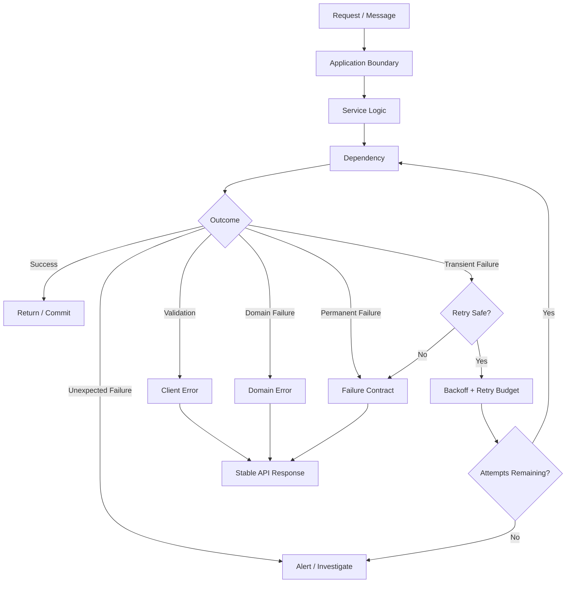

# README

## Overview

This folder covers Python exception handling from the language-level exception model through production backend failure management.

The goal is to understand exceptions as part of application control flow and system design, not merely as syntax for preventing crashes.

In a production backend, failures can originate from:

- invalid client input
- domain rule violations
- database operations
- Redis
- Kafka
- external HTTP services
- filesystem operations
- authentication and authorization
- concurrency
- timeouts
- process termination
- programming defects

A mature error-handling strategy determines which failures should be:

- handled locally
- translated into domain-specific errors
- retried
- rolled back
- propagated
- exposed through an API
- logged and monitored
- sent to a dead-letter path
- treated as fatal

The fundamental flow is:

```text
Operation
    │
    ▼
Exception raised
    │
    ▼
Nearest appropriate boundary
    │
    ├── recover
    ├── retry
    ├── rollback
    ├── translate
    ├── observe
    └── propagate
```

The central engineering principle is:

> Catch an exception only when the current layer can make a correct decision about what to do with the failure.

---

## Folder Structure

```text
04- Error Handling/
│
├── 01- Exception Fundamentals.md
├── 02- Exception Hierarchy.md
├── 03- Try Except.md
├── 04- Else and Finally.md
├── 05- Raising Exceptions.md
├── 06- Custom Exceptions.md
├── 07- Exception Chaining.md
├── 08- Exception Handling Patterns.md
├── 09- Retry and Recovery.md
├── 10- Error Handling in APIs.md
└── README.md
```

---

## Learning Progression

The folder progresses from Python's exception semantics toward distributed backend error handling.

```text
Exception Fundamentals
        │
        ▼
Exception Hierarchy
        │
        ▼
try / except
        │
        ▼
else / finally
        │
        ▼
raise
        │
        ▼
Custom Exceptions
        │
        ▼
Exception Chaining
        │
        ▼
Exception Handling Patterns
        │
        ▼
Retry and Recovery
        │
        ▼
API Error Handling
```

Each document builds on concepts introduced earlier in the sequence.

---

## Exception Fundamentals

`01- Exception Fundamentals.md` establishes how Python represents and propagates exceptional conditions.

Important concepts include:

- exceptions as objects
- raising exceptions
- exception propagation
- stack unwinding
- tracebacks
- handling vs propagation
- synchronous failures
- asynchronous failures

The runtime behavior can be viewed as:

```text
Normal execution
      │
      ▼
Statement
      │
      ▼
Next statement


Exceptional execution
      │
      ▼
Exception raised
      │
      ▼
Stack unwinding
      │
      ▼
Compatible handler found?
      │
 ┌────┴────┐
 ▼         ▼
Yes       No
 │         │
 ▼         ▼
Handle   Propagate
```

This is the foundation for understanding every subsequent document in the folder.

---

## Exception Hierarchy

`02- Exception Hierarchy.md` explains Python's inheritance-based exception model.

Core topics include:

- `BaseException`
- `Exception`
- built-in exception classes
- subclass matching
- handler ordering
- broad vs narrow exception handling
- application-specific hierarchies

The hierarchy matters because exception handlers match subclasses as well as the specified class.

For example:

```python
try:
    value = int(raw_value)
except ValueError:
    handle_invalid_value()
```

A handler for `ValueError` can handle `ValueError` subclasses as well.

The distinction between:

```python
except Exception:
```

and:

```python
except BaseException:
```

is particularly important for production systems.

Application code should normally handle `Exception`, not `BaseException`, because the latter also includes process/control-flow exceptions such as `KeyboardInterrupt`, `SystemExit`, and `GeneratorExit`.

---

## try, except

`03- Try Except.md` focuses on Python's primary exception-handling mechanism.

The key engineering decision is determining whether the current layer has enough information to handle a failure correctly.

For example:

```python
try:
    user_id = int(raw_user_id)
except ValueError as exc:
    raise InvalidUserInput(
        "user_id must be an integer"
    ) from exc
```

The low-level parsing error is translated into an application-level validation error.

A useful distinction is:

| Action | Meaning |
|---|---|
| Handle | Recover locally |
| Translate | Convert to a more meaningful abstraction |
| Enrich | Add useful context |
| Retry | Attempt the operation again |
| Propagate | Let a higher layer decide |
| Suppress | Intentionally ignore the failure |

Most exceptions should not simply be caught and ignored.

---

## else and finally

`04- Else and Finally.md` explains the complete `try` statement lifecycle.

```python
try:
    result = perform_operation()
except OperationError:
    recover()
else:
    publish_success(result)
finally:
    release_resources()
```

Each component has a specific role:

| Construct | Purpose |
|---|---|
| `try` | Operation that may fail |
| `except` | Handle matching failures |
| `else` | Execute only when `try` succeeds |
| `finally` | Execute cleanup regardless of success/failure |

`finally` is particularly important for cleanup, although context managers are generally preferable for reusable resource-management patterns.

---

## Raising Exceptions

`05- Raising Exceptions.md` covers explicit failure signaling.

```python
if amount <= 0:
    raise ValueError("amount must be positive")
```

Raising an exception establishes a contract:

```text
Precondition violated
        │
        ▼
Operation cannot continue
        │
        ▼
Raise meaningful exception
```

At backend boundaries, exceptions should normally become more semantic as they move upward.

```text
PostgreSQL exception
        │
        ▼
Repository exception
        │
        ▼
Domain/service exception
        │
        ▼
API error response
```

A database driver's implementation-specific exception should generally not become part of the public REST API contract.

---

## Custom Exceptions

`06- Custom Exceptions.md` introduces application-specific exception types.

A typical hierarchy might be:

```text
Exception
└── ApplicationError
    ├── DomainError
    │   ├── ValidationError
    │   ├── ResourceNotFoundError
    │   └── InvalidStateError
    │
    └── InfrastructureError
        ├── DatabaseError
        ├── CacheError
        └── ExternalServiceError
```

Custom exceptions provide:

- semantic meaning
- stable handling points
- clearer tests
- cleaner API mapping
- reduced coupling to third-party libraries

They should represent meaningful application concepts rather than simply renaming every built-in exception.

---

## Exception Chaining

`07- Exception Chaining.md` covers preserving the root cause when translating exceptions.

Example:

```python
try:
    order = repository.get(order_id)
except DatabaseError as exc:
    raise OrderRepositoryError(
        f"Failed to load order {order_id}"
    ) from exc
```

This creates a useful causal chain:

```text
OrderRepositoryError
        │
        └── caused by
                │
                ▼
          DatabaseError
```

The service can handle `OrderRepositoryError` without depending on a particular database driver's exception hierarchy while logs and tracebacks still retain the original cause.

---

## Exception Handling Patterns

`08- Exception Handling Patterns.md` moves from syntax into architectural design.

Common patterns include:

- local recovery
- exception translation
- contextual enrichment
- rollback
- retry
- graceful degradation
- propagation
- fail-fast behavior

A layered backend might look like:

```text
HTTP
 │
 ▼
API Layer
 │
 ▼
Service Layer
 │
 ▼
Repository
 │
 ▼
PostgreSQL
```

An infrastructure failure may move upward as:

```text
PostgreSQL timeout
      │
      ▼
Database driver exception
      │
      ▼
Repository-level exception
      │
      ▼
Service-level dependency failure
      │
      ▼
HTTP 503
```

Each layer should add semantic value rather than wrapping errors mechanically.

---

## Retry and Recovery

`09- Retry and Recovery.md` focuses on transient failures.

Not every failure is retryable.

| Failure | Typical Retry Decision |
|---|---|
| Network timeout | Often retry |
| Connection reset | Often retry |
| HTTP 429 | Retry according to rate-limit guidance |
| HTTP 503 | Often retry |
| Invalid input | Do not retry |
| Authentication failure | Usually do not retry |
| Authorization failure | Do not retry |
| Unique constraint violation | Usually do not retry |
| Programming error | Do not retry |

A production retry policy should account for:

- idempotency
- maximum attempts
- exponential backoff
- jitter
- timeout budgets
- rate limits
- circuit breakers
- downstream capacity

Retries are a reliability mechanism, but poorly designed retries can become an outage amplifier.

---

## Retry Amplification

Consider:

```text
Client
  │
  ▼
API
  │
  ├── retry × 3
  │
  ▼
Service
  │
  ├── retry × 3
  │
  ▼
Database
```

One logical request can result in:

```text
3 × 3 = 9 downstream attempts
```

At high traffic volumes, this can overwhelm an already unhealthy dependency.

Retry ownership should therefore be designed across the entire request path.

---

## API Error Handling

`10- Error Handling in APIs.md` covers converting internal failures into stable external contracts.

Typical REST mappings include:

| Condition | Typical HTTP Status |
|---|---:|
| Malformed request | `400` |
| Authentication required/failed | `401` |
| Insufficient permission | `403` |
| Resource not found | `404` |
| State/resource conflict | `409` |
| Validation failure | `422` where appropriate |
| Rate limiting | `429` |
| Upstream failure | `502` / `503` |
| Unexpected server failure | `500` |

The exact mapping should follow the API's contract.

An API should expose stable semantic errors rather than raw Python exceptions.

```json
{
  "error": {
    "code": "ORDER_NOT_FOUND",
    "message": "Order was not found",
    "request_id": "8a2d..."
  }
}
```

---

## Internal vs External Errors

An important boundary is:

```text
Internal exception
      │
      ├── detailed traceback
      ├── infrastructure context
      ├── dependency information
      └── internal identifiers
               │
               ▼
        Observability system


External response
      │
      ├── stable error code
      ├── safe message
      └── request/correlation ID
```

Do not expose:

- stack traces
- SQL errors
- filesystem paths
- internal hostnames
- credentials
- access tokens
- database connection information

The external contract should be stable even when internal implementations change.

---

## Exceptions and Transactions

Exceptions frequently interact with transaction boundaries.

```text
BEGIN
  │
  ├── Create order
  ├── Update inventory
  └── Create audit record
  │
  ├── Success → COMMIT
  │
  └── Failure → ROLLBACK
```

A service that owns the complete unit of work often needs to own the transaction boundary.

Do not catch an exception inside a transaction merely to continue if the underlying transaction is no longer valid.

The exact behavior depends on the database driver, ORM, and transaction-management strategy.

---

## Exceptions and Asyncio

Asynchronous applications have additional failure behavior.

Exceptions raised in awaited coroutines propagate to the awaiting task.

```python
async def process_order():
    await reserve_inventory()
```

When coordinating multiple operations:

```python
results = await asyncio.gather(
    reserve_inventory(),
    create_audit_record(),
)
```

Failure behavior should be understood explicitly.

Using:

```python
await asyncio.gather(
    operation_a(),
    operation_b(),
    return_exceptions=True,
)
```

changes the result contract because exceptions are returned as values.

Cancellation also requires deliberate handling. Broad exception handling should not accidentally suppress task cancellation or prevent cooperative shutdown.

---

## Exceptions and Celery

Background workers have a different failure model from synchronous HTTP requests.

```text
Task
 │
 ▼
Worker
 │
 ▼
Operation
 │
 ├── Success → Complete
 │
 └── Failure
       │
       ├── Retry
       ├── Dead-letter
       └── Permanent failure
```

Production worker tasks should consider:

- idempotency
- duplicate delivery
- acknowledgement semantics
- visibility timeouts
- retry limits
- poison messages
- dead-letter queues
- task time limits

An HTTP request handler can often return an error immediately.

A durable background task may instead need to preserve the work for later processing.

---

## Exceptions and Kafka

Kafka consumers must distinguish between different failure categories.

```text
Message
   │
   ▼
Consumer
   │
   ▼
Processing
   │
   ├── Success
   │      └── commit offset
   │
   ├── Transient failure
   │      └── retry / retry topic
   │
   └── Permanent failure
          └── dead-letter handling
```

Blindly catching every exception and continuing can allow offsets to advance while the application has failed to process the message correctly.

Exception strategy must therefore align with:

- offset management
- retry strategy
- message ordering
- delivery semantics
- idempotency
- dead-letter handling

---

## Exceptions and Distributed Systems

A distributed exception is often only a local observation of an uncertain remote state.

For example:

```text
Client
  │
  ▼
Payment Service
  │
  ▼
Payment Provider
  │
  ├── Payment succeeds
  │
  └── Response lost
          │
          ▼
       Timeout
```

The client sees a timeout, but the payment may already have succeeded.

Therefore:

```text
Timeout
≠
Remote operation definitely failed
```

This distinction is fundamental to distributed error handling.

Systems may require:

- idempotency keys
- durable state
- reconciliation
- compensating actions
- correlation IDs
- retry budgets

---

## Exception Handling and Observability

Production exception handling should integrate with:

- logs
- metrics
- traces
- request IDs
- trace IDs
- error monitoring
- alerting

Useful diagnostic fields include:

```text
service
environment
request_id
trace_id
operation
exception_type
error_code
dependency
retry_count
duration_ms
```

Avoid logging complete request payloads automatically.

Sensitive fields may include:

- passwords
- authorization headers
- API keys
- session tokens
- personal data

Observability systems themselves are production data stores and must be treated accordingly.

---

## Exception Handling and Security

Error handling can expose information if implemented carelessly.

Avoid:

```python
return {
    "error": str(exc),
}
```

when `exc` may contain infrastructure or sensitive information.

Instead:

```python
return {
    "error": {
        "code": "DEPENDENCY_UNAVAILABLE",
        "message": "The service is temporarily unavailable",
    }
}
```

Detailed diagnostics should remain in controlled internal telemetry.

Security-sensitive errors should also avoid revealing whether protected resources exist when that information itself is sensitive.

---

## Performance Considerations

Exceptions have runtime costs because Python must create exception objects and maintain traceback information.

They should therefore not normally be used as the primary mechanism for high-frequency expected outcomes.

Instead of:

```python
try:
    value = mapping[key]
except KeyError:
    value = default
```

use:

```python
value = mapping.get(key, default)
```

when the intended semantics are simply "return a default if absent."

The important rule is not "never use exceptions for control flow." Python APIs sometimes naturally use exceptions for normal protocol boundaries.

The rule is:

> Do not turn frequent, expected business outcomes into exception-heavy control flow without a reason.

---

## Memory Considerations

Tracebacks can retain references to stack frames and local variables while the exception remains reachable.

This matters when exceptions are stored in long-lived structures such as:

- caches
- global collections
- task state
- diagnostic queues

Avoid retaining large traceback-bearing exception objects indefinitely.

In high-volume systems, error telemetry should also be designed to avoid generating enormous amounts of duplicate diagnostic data.

---

## Resource Cleanup

Exceptions must not bypass resource cleanup.

A resource lifecycle should be explicit:

```text
Acquire
   │
   ▼
Use
   │
   ├── success ──► release
   │
   └── failure ──► release
```

Use:

- `finally`
- context managers
- async context managers

where appropriate.

Typical resources include:

- files
- sockets
- database connections
- locks
- temporary files
- HTTP clients

Failure handling and resource lifecycle are closely related concerns.

---

## Exception Boundaries

A mature backend defines explicit exception boundaries.

```text
Infrastructure
      │
      ▼
Repository / Client
      │
      ▼
Service / Domain
      │
      ▼
API / Worker Boundary
      │
      ▼
External Contract
```

At each boundary, decide:

- Should the error be preserved?
- Should it be translated?
- Should context be added?
- Should it be retried?
- Should the operation be rolled back?
- Should it be exposed externally?
- Should it trigger an alert?

This prevents exception handling from becoming scattered throughout the codebase.

---

## Testing Strategy

Exception behavior is part of the application's contract.

Tests should cover:

- expected exception types
- domain error semantics
- exception chaining
- retry behavior
- retry limits
- rollback behavior
- cleanup
- API error mappings
- unexpected exceptions
- cancellation behavior where applicable

Example:

```python
import pytest


def test_missing_order_raises():
    with pytest.raises(OrderNotFoundError):
        service.get_order(999)
```

API tests should generally validate:

```text
Input
  │
  ▼
API
  │
  ▼
HTTP status
  │
  ├── error code
  ├── safe message
  └── request ID
```

rather than asserting implementation-specific traceback text.

---

## Testing Retry Behavior

Retry tests should verify both successful recovery and final failure.

Example scenarios:

```text
Attempt 1 → failure
Attempt 2 → failure
Attempt 3 → success
```

and:

```text
Attempt 1 → failure
Attempt 2 → failure
Attempt 3 → failure
        │
        ▼
Final failure
```

Also verify that permanent failures are not retried.

Avoid real sleep durations in unit tests. Inject or control the retry timing mechanism where practical.

---

## Common Mistakes

### Catching Every Exception

```python
try:
    operation()
except Exception:
    return None
```

This can hide programming bugs, infrastructure failures, and data corruption.

### Swallowing Exceptions

```python
except ValueError:
    pass
```

This is appropriate only when intentionally ignoring the failure is part of the contract.

### Catching `BaseException`

```python
except BaseException:
    ...
```

This can intercept process and control-flow exceptions that should normally propagate.

### Returning `None` for Every Failure

`None` cannot distinguish between:

```text
not found
invalid input
dependency failure
legitimate empty result
```

### Retrying Everything

Permanent failures waste capacity and can amplify outages.

### Retrying Non-Idempotent Operations

A timeout does not prove that the remote operation failed.

### Exposing Raw Exception Messages

Infrastructure errors are not stable external API contracts.

### Logging Without Traceback Information

Using only:

```python
logger.error(str(exc))
```

may discard valuable debugging context.

### Logging Sensitive Data

Tracebacks and contextual fields must be reviewed for secrets and private information.

### Over-Wrapping

An exception hierarchy with many meaningless wrapper classes can make debugging harder.

---

## Production Pitfalls

| Pitfall | Consequence | Better Practice |
|---|---|---|
| Broad exception handlers | Hidden failures | Catch narrowly |
| Infinite retries | Cascading failures | Bounded retry policy |
| No idempotency | Duplicate side effects | Idempotency keys/state |
| Raw exception responses | Information leakage | Stable error contracts |
| Missing traceback | Difficult debugging | Structured exception logging |
| Repeated logging | Noisy telemetry | Log at meaningful boundaries |
| Ignoring cancellation | Stuck async shutdown | Preserve cancellation semantics |
| Local retry policies everywhere | Retry amplification | Define ownership |
| Swallowing Kafka failures | Message-processing gaps | Align with offset strategy |
| Retaining exceptions | Memory growth | Avoid long-lived traceback references |
| Missing transaction boundaries | Partial writes | Explicit unit of work |
| No cleanup | Resource leaks | Context managers/finally |
| Unbounded error cardinality | Expensive observability | Normalize error labels |

---

## Backend Error Architecture

A production service can organize failures around explicit categories:



This separates business semantics from infrastructure implementation details.

---

## Recommended Engineering Practices

### Catch Narrowly

```python
try:
    payload = parse_payload(raw)
except ValueError as exc:
    raise InvalidPayload("Malformed payload") from exc
```

Catch only errors the current layer understands.

### Preserve Causality

Use:

```python
raise ApplicationError(...) from exc
```

when translating failures.

### Keep External Contracts Stable

Use explicit error codes rather than requiring clients to parse exception messages.

### Define Retry Ownership

Avoid independent retry loops at every architectural layer.

### Make Side Effects Idempotent

Especially for:

- payments
- message processing
- webhooks
- provisioning
- background tasks

### Bound Resources

Define limits for:

- retry attempts
- timeouts
- queue size
- cache size
- request size
- processing duration

### Observe Meaningfully

Capture enough context to diagnose failures without exposing sensitive information.

### Preserve Failure Semantics

Do not convert every failure into a generic `500`.

Different failures carry different operational and client-facing meanings.

---

## Senior-Level Decision Framework

When reviewing an exception path, ask:

1. What exactly failed?
2. Is the failure expected or unexpected?
3. Is it transient or permanent?
4. Which layer owns recovery?
5. Should the error be translated?
6. What information should be preserved?
7. Is retry safe?
8. Is the operation idempotent?
9. Could the remote operation have succeeded despite a timeout?
10. What happens to the database transaction?
11. What happens to external side effects?
12. What happens if the process crashes after the side effect?
13. What telemetry is generated?
14. Could the error reveal sensitive information?
15. Could retries amplify an outage?
16. What happens under Kubernetes termination or restart?
17. Is the API or event error contract stable?
18. Can the behavior be tested deterministically?

These questions shift exception handling from syntax-level programming to system-level engineering.

---

## Folder Completion Criteria

A strong understanding of this folder means you can:

- Explain Python exception propagation and stack unwinding.
- Navigate the exception hierarchy correctly.
- Use `try`, `except`, `else`, and `finally` deliberately.
- Raise meaningful exceptions at appropriate boundaries.
- Design custom exception hierarchies.
- Preserve root causes through exception chaining.
- Distinguish handling, translation, recovery, retry, and propagation.
- Classify failures as transient, permanent, domain, validation, or programming errors.
- Design bounded retry strategies with backoff and jitter.
- Recognize why idempotency is essential for safe distributed retries.
- Translate internal exceptions into stable REST or gRPC contracts.
- Handle failures appropriately in PostgreSQL, Redis, Kafka, Celery, and external services.
- Preserve correct behavior under asyncio, threads, processes, and container restarts.
- Integrate exceptions with logs, metrics, tracing, and alerting.
- Protect API clients from sensitive implementation details.
- Test exception behavior and failure contracts deterministically.
- Recognize when exception handling is compensating for a deeper architectural problem.

## Key Takeaways

- Python exceptions are part of the application's failure model; catch them only where the current layer can make a correct recovery or translation decision.
- Exception hierarchy, chaining, and explicit boundaries allow infrastructure failures to be converted into stable domain and API semantics without losing diagnostic context.
- Retry logic must be bounded and designed around transient failures, idempotency, timeout budgets, backoff, jitter, and downstream capacity.
- Distributed failures are often ambiguous: a timeout does not prove that the remote operation failed, so reliable systems may require idempotency, durable state, and reconciliation.
- Production error handling must integrate correctness, transactions, concurrency, resource cleanup, security, observability, and operational failure behavior.