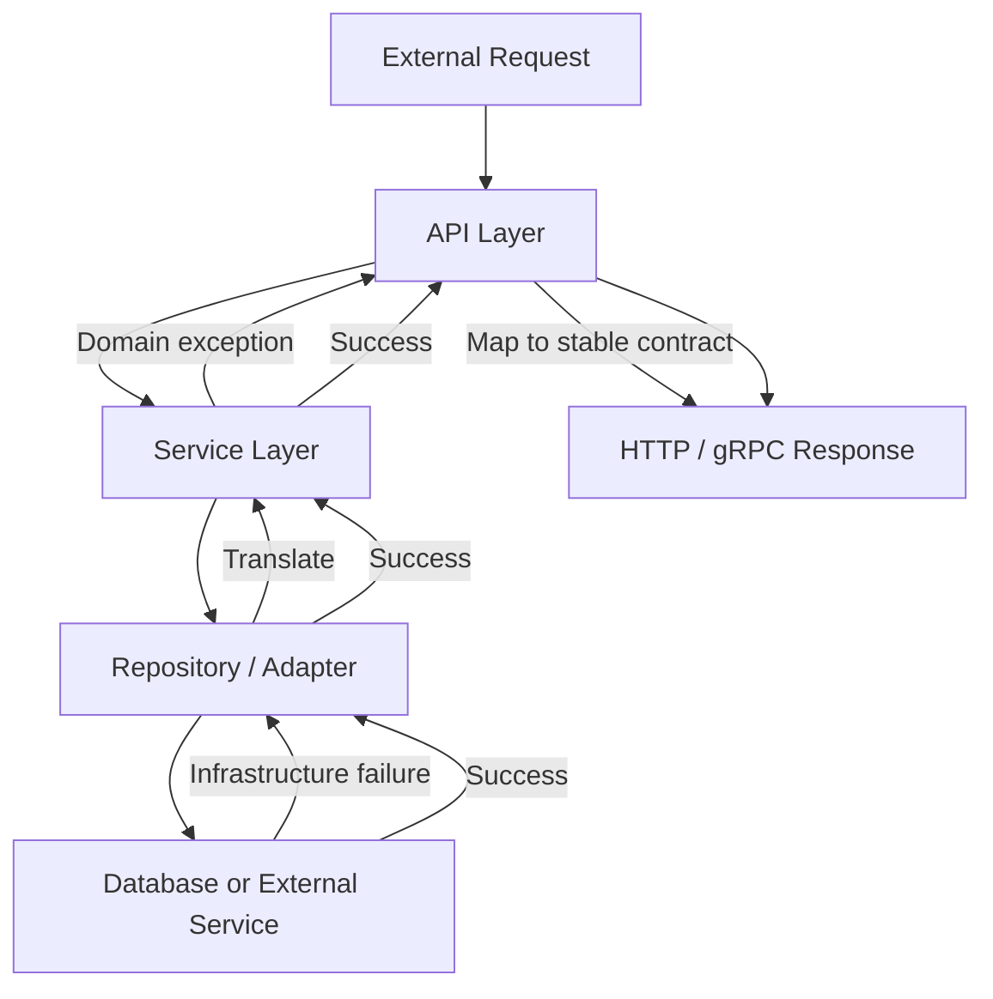

# 05- Raising Exceptions

## Overview

Raising an exception is how Python code explicitly reports that an operation cannot continue normally.

While Python automatically raises many built-in exceptions, production applications frequently need to raise exceptions intentionally when an input violates a contract, a business invariant is broken, an operation cannot be completed, or a lower-level failure must be translated into a higher-level abstraction.

A useful backend model is:

```text
Invalid state / failed operation
              │
              ▼
       raise exception
              │
              ▼
      Propagate up stack
              │
       ┌──────┴──────┐
       │             │
    Handle         Translate
       │             │
       ▼             ▼
   Recovery      Application
                  exception
                       │
                       ▼
                API / worker
                   boundary
```

The goal is not to raise exceptions everywhere. The goal is to establish clear failure contracts between layers.

---

## What `raise` Does

The `raise` statement explicitly raises an exception.

```python
raise ValueError("invalid input")
```

When Python executes this statement:

1. An exception object is created or supplied.
2. Normal execution of the current block stops.
3. Python searches for a matching exception handler.
4. If no handler exists in the current scope, the exception propagates to the caller.
5. The traceback records the execution path that led to the failure.

For example:

```python
def parse_port(value: str) -> int:
    if not value.isdigit():
        raise ValueError("port must be numeric")

    return int(value)
```

The function establishes a clear contract: invalid input results in `ValueError`.

---

## Why Explicitly Raise Exceptions?

Python automatically raises exceptions for many runtime failures:

```python
int("abc")
# ValueError

items[100]
# IndexError

mapping["missing"]
# KeyError
```

Application code also needs to express failures that Python cannot infer automatically.

For example:

```python
def withdraw(account, amount):
    if amount > account.balance:
        raise InsufficientFundsError(
            f"insufficient funds for account {account.id}"
        )

    account.balance -= amount
```

The insufficient-balance condition is a business rule, not a Python runtime error.

---

## Exception Contracts

A function should have a predictable failure contract.

```python
def get_order(order_id: int) -> Order:
    ...
```

Possible contract:

```text
Success
    → Order

Known business failure
    → OrderNotFoundError

Infrastructure failure
    → OrderRepositoryError
```

Callers can then make deliberate decisions:

```python
try:
    order = service.get_order(order_id)
except OrderNotFoundError:
    return None
```

Without a meaningful contract, callers may need to understand implementation-specific exceptions.

---

## Raising Built-in Exceptions

Use built-in exceptions when their semantics accurately describe the failure.

Common choices:

| Exception | Typical use |
|---|---|
| `ValueError` | Correct type, invalid value |
| `TypeError` | Incorrect type or unsupported operand |
| `KeyError` | Required mapping key is absent |
| `IndexError` | Sequence index is invalid |
| `LookupError` | Generic lookup failure |
| `RuntimeError` | Generic runtime failure without a more specific built-in |
| `NotImplementedError` | Required implementation is intentionally unavailable |
| `OSError` family | Operating-system or I/O failures |
| `TimeoutError` | Operation exceeded its timeout |
| `PermissionError` | OS-level permission failure |

For domain-specific failures, a custom exception is often clearer.

---

## `ValueError` vs `TypeError`

This distinction is important.

Use `TypeError` when the object has an inappropriate type:

```python
def set_timeout(timeout: int) -> None:
    if not isinstance(timeout, int):
        raise TypeError("timeout must be an integer")
```

Use `ValueError` when the type is acceptable but the value is invalid:

```python
def set_timeout(timeout: int) -> None:
    if timeout <= 0:
        raise ValueError("timeout must be positive")
```

The distinction makes APIs easier to understand and test.

---

## Raising an Exception Class

Python permits:

```python
raise ValueError
```

which is equivalent to raising an instance created without arguments.

Prefer explicit instances when a useful message or metadata is needed:

```python
raise ValueError("order amount must be positive")
```

For domain exceptions, explicit construction is normally clearer:

```python
raise OrderAlreadyExists(order_id)
```

---

## Raising an Existing Exception Instance

An existing exception object can be raised:

```python
error = ValueError("invalid configuration")
raise error
```

This is useful when an exception has already been constructed and needs to be propagated.

Usually, however, there is no reason to introduce a separate variable:

```python
raise ValueError("invalid configuration")
```

---

## Re-Raising an Exception

Inside an `except` block, bare `raise` re-raises the currently handled exception.

```python
try:
    save_order(order)
except DatabaseError:
    logger.exception("order persistence failed")
    raise
```

This preserves the original exception and traceback context.

Use this when the current layer needs to perform an action such as:

- logging
- metrics
- cleanup
- rollback
- tracing

but does not need to change the failure's meaning.

---

## `raise` vs `raise exc`

Compare:

```python
try:
    operation()
except ValueError:
    raise
```

with:

```python
try:
    operation()
except ValueError as exc:
    raise exc
```

Both propagate the exception, but bare `raise` is the idiomatic choice when the intention is simply to re-raise the current exception.

Use:

```python
raise
```

for straightforward propagation.

Use an explicit `raise ... from ...` when translating or enriching the failure.

---

## Raising Custom Exceptions

Custom exceptions should represent application or domain concepts.

```python
class OrderError(Exception):
    """Base exception for order-related failures."""


class OrderNotFoundError(OrderError):
    """Raised when an order does not exist."""


class OrderAlreadyExistsError(OrderError):
    """Raised when an order already exists."""
```

The hierarchy provides a useful contract:

```text
Exception
    │
    └── OrderError
          ├── OrderNotFoundError
          └── OrderAlreadyExistsError
```

Callers can handle either a specific failure:

```python
except OrderNotFoundError:
    ...
```

or all order failures:

```python
except OrderError:
    ...
```

---

## Raising Domain Exceptions

A service layer can enforce business invariants:

```python
def cancel_order(order: Order) -> None:
    if order.status in {"shipped", "delivered"}:
        raise OrderStateError(
            f"cannot cancel order in state {order.status}"
        )

    order.cancel()
```

The exception communicates a business-level failure rather than exposing an implementation detail.

---

## Raising at the Correct Layer

A common architecture is:

```text
API
 │
 ▼
Service
 │
 ▼
Repository
 │
 ▼
PostgreSQL
```

The database driver may raise:

```text
UniqueViolation
```

The repository can translate it:

```python
try:
    database.insert(order)
except UniqueViolation as exc:
    raise OrderAlreadyExistsError(
        order.id
    ) from exc
```

The service now works with:

```text
OrderAlreadyExistsError
```

rather than PostgreSQL-specific implementation details.

---

## Exception Translation

Exception translation changes the abstraction level of a failure.

```text
PostgreSQL error
      │
      ▼
Repository
      │
      ▼
OrderPersistenceError
      │
      ▼
Service
      │
      ▼
API error response
```

Example:

```python
try:
    repository.save(order)
except DatabaseError as exc:
    raise OrderPersistenceError(
        "Unable to persist order"
    ) from exc
```

This is preferable to exposing database-specific exception types throughout the application.

---

## Preserve the Original Cause

When translating an exception, use:

```python
raise ApplicationError("operation failed") from exc
```

For example:

```python
try:
    response = payment_client.charge(request)
except PaymentTimeoutError as exc:
    raise PaymentUnavailableError(
        "payment provider is unavailable"
    ) from exc
```

Python records the relationship:

```text
ApplicationError
      │
      └── __cause__
              │
              ▼
       PaymentTimeoutError
```

The application receives the higher-level exception while logs and diagnostics can still identify the underlying failure.

---

## Explicit Exception Chaining

The `from` syntax is explicit exception chaining:

```python
raise ServiceError("service operation failed") from exc
```

This sets:

```python
exception.__cause__
```

and communicates that the new exception was deliberately caused by the original exception.

It is especially useful when crossing architectural boundaries.

---

## Suppressing Exception Context

Python also allows:

```python
raise PublicError("request failed") from None
```

This suppresses display of the implicit exception context.

Use this selectively when the lower-level exception should not appear as part of the user-facing or diagnostic exception chain.

Do not use it merely to hide useful debugging information internally.

---

## Implicit Context

When one exception is raised while another is already being handled, Python records the original exception as context.

```python
try:
    operation()
except ValueError:
    raise RuntimeError("operation failed")
```

The resulting exception has:

```python
__context__
```

pointing to the original `ValueError`.

Explicit chaining is generally clearer when the relationship is intentional:

```python
except ValueError as exc:
    raise RuntimeError("operation failed") from exc
```

---

## Adding Diagnostic Notes

Modern Python supports `BaseException.add_note()`.

```python
try:
    process_order(order)
except OrderError as exc:
    exc.add_note(f"order_id={order.id}")
    raise
```

Notes are attached to the exception without changing its primary message or type.

They can be useful for adding diagnostic context such as:

- entity identifiers
- operation names
- configuration context
- processing stages

Do not put secrets or sensitive request data into exception notes.

---

## Exception Metadata

Custom exceptions can expose structured information.

```python
class InsufficientFundsError(Exception):
    def __init__(self, account_id: str, amount: int):
        self.account_id = account_id
        self.amount = amount
        super().__init__(
            f"insufficient funds for account {account_id}"
        )
```

Callers can inspect:

```python
try:
    withdraw(account, amount)
except InsufficientFundsError as exc:
    metrics.increment(
        "withdrawal.insufficient_funds",
        tags={"account_type": account.type},
    )
```

Prefer structured attributes over parsing strings.

---

## Exception Messages

Exception messages should describe the failure clearly.

Prefer:

```python
raise ValueError(
    "timeout must be greater than zero"
)
```

over:

```python
raise ValueError("bad input")
```

For internal exceptions, include useful diagnostic context where safe:

```python
raise OrderPersistenceError(
    f"failed to persist order {order.id}"
)
```

Do not expose internal identifiers, credentials, SQL statements, or infrastructure details through public API error messages.

---

## Raising Exceptions in Validation

Validation code may explicitly raise exceptions:

```python
def validate_order(order: Order) -> None:
    if order.total <= 0:
        raise InvalidOrderError(
            "order total must be greater than zero"
        )

    if not order.items:
        raise InvalidOrderError(
            "order must contain at least one item"
        )
```

This is useful when invalid state should prevent further processing.

For API input validation, framework-level validation such as Pydantic/FastAPI validation may be preferable for structural validation, while domain exceptions remain appropriate for business rules.

---

## Raising Exceptions for State Machines

Exceptions can enforce invalid state transitions:

```python
def ship_order(order: Order) -> None:
    if order.status != OrderStatus.PAID:
        raise InvalidOrderStateError(
            f"cannot ship order in state {order.status}"
        )

    order.status = OrderStatus.SHIPPED
```

This protects domain invariants.

A state machine can therefore be viewed as:

```text
PENDING
   │
   ▼
PAID
   │
   ▼
SHIPPED
```

Attempting an invalid transition raises a domain exception.

---

## Raising Exceptions in APIs

An application service can raise a domain exception:

```python
def get_order(order_id: int) -> Order:
    order = repository.find(order_id)

    if order is None:
        raise OrderNotFoundError(order_id)

    return order
```

The API layer can translate it:

```python
@app.get("/orders/{order_id}")
def get_order(order_id: int):
    try:
        return service.get_order(order_id)
    except OrderNotFoundError:
        raise HTTPException(
            status_code=404,
            detail="Order not found",
        )
```

For larger FastAPI applications, centralized exception handlers are generally preferable to repeating this mapping in every endpoint.

---

## REST Error Mapping

A common mapping is:

| Application condition | HTTP status |
|---|---:|
| Malformed request | `400` |
| Authentication required/failed | `401` |
| Authenticated but forbidden | `403` |
| Resource not found | `404` |
| State or uniqueness conflict | `409` |
| Validation failure | `422` where appropriate |
| Rate limit exceeded | `429` |
| Upstream dependency failure | `502` / `503` |
| Unexpected server failure | `500` |

The exact status should follow the API contract and framework conventions.

Do not make exception classes themselves the external API contract unless their mapping is intentionally centralized and stable.

---

## Raising Exceptions in gRPC

gRPC services typically translate application exceptions into gRPC status codes.

Conceptually:

```text
Domain exception
      │
      ▼
gRPC boundary
      │
      ▼
Status code
      │
      ▼
Remote client
```

For example:

```python
try:
    order = service.get_order(order_id)
except OrderNotFoundError as exc:
    context.abort(
        grpc.StatusCode.NOT_FOUND,
        "order not found",
    )
```

The internal exception hierarchy should remain independent of the wire-level protocol where practical.

---

## Raising Exceptions Around PostgreSQL

Database-specific failures should usually be translated at the repository or infrastructure boundary.

```python
try:
    repository.insert_order(order)
except UniqueViolationError as exc:
    raise OrderAlreadyExistsError(
        order.id
    ) from exc
```

The service layer should not need to understand every PostgreSQL error code.

For transactional operations:

```text
Begin transaction
      │
      ▼
Database operation
      │
 ┌────┴─────┐
 │          │
Success   Exception
 │          │
 ▼          ▼
Commit    Rollback
 │          │
 └────┬─────┘
      ▼
Release
```

Exception handling must align with the transaction boundary.

---

## Raising Exceptions Around Redis

Redis operations can fail because of:

- connection failures
- timeouts
- authentication/configuration issues
- unavailable nodes
- command errors

Translate failures only when the application can provide a more useful abstraction:

```python
try:
    value = redis_client.get(key)
except RedisTimeoutError as exc:
    raise CacheUnavailableError from exc
```

Do not automatically turn every Redis error into a cache miss.

A cache outage and a missing cache entry are different conditions.

---

## Raising Exceptions Around HTTP Clients

External HTTP failures should be categorized carefully.

```python
try:
    response = client.post(
        "/payments",
        json=payload,
    )
except TimeoutError as exc:
    raise PaymentProviderTimeout from exc
```

A response such as HTTP `400` from the provider may not be represented as a transport exception at all.

Therefore, distinguish:

```text
Transport failure
    ├── timeout
    ├── DNS failure
    └── connection reset

Application response
    ├── 4xx
    └── 5xx
```

The client library's behavior determines which cases require explicit raising.

---

## `raise_for_status()`

HTTP clients may provide helpers such as:

```python
response.raise_for_status()
```

This can convert HTTP error responses into exceptions.

For example:

```python
response = client.get(url)
response.raise_for_status()
```

If the response indicates failure, the client may raise an HTTP-related exception.

Whether this is appropriate depends on the application contract.

For expected business responses, explicit status handling may be clearer:

```python
if response.status_code == 404:
    raise CustomerNotFoundError(customer_id)
```

---

## Retryable Exceptions

Exceptions can be used to signal retryable failures:

```python
class TemporaryDependencyError(Exception):
    """Raised when an operation may succeed if retried."""
```

Then:

```python
try:
    call_dependency()
except TemporaryDependencyError:
    schedule_retry()
```

Do not make an exception retryable merely because it sounds temporary.

Retryability depends on:

- operation semantics
- idempotency
- failure type
- timeout budget
- downstream capacity
- rate limits
- transaction state

---

## Idempotency and Raising

A critical distributed-systems problem is:

```text
Client
  │
  ▼
Service
  │
  ▼
Payment provider
  │
  ▼
Charge succeeds
  │
  ▼
Network timeout
```

The service may raise a timeout even though the external operation succeeded.

Blindly retrying can create a duplicate payment.

Therefore, raising an exception does not prove that an external side effect did not occur.

Production systems may require:

- idempotency keys
- operation IDs
- durable state
- reconciliation
- provider-side idempotency
- outbox/inbox patterns

---

## Exceptions in Celery

A Celery task may deliberately raise an exception so the task infrastructure can apply retry or failure behavior.

```python
@app.task(
    autoretry_for=(TemporaryDependencyError,),
    retry_backoff=True,
)
def process_order(order_id: int):
    process(order_id)
```

Alternatively:

```python
@app.task
def process_order(order_id: int):
    try:
        process(order_id)
    except TemporaryDependencyError as exc:
        raise process_order.retry(
            exc=exc,
            countdown=10,
        )
```

Do not catch and suppress exceptions that the worker infrastructure needs to observe.

---

## Exceptions in Kafka Consumers

A Kafka consumer may use exceptions to distinguish:

```text
Processing succeeds
       │
       ▼
Commit / acknowledge


Processing fails
       │
       ▼
Retry / DLQ / pause / failure handling
```

The exact behavior depends on the consumer framework.

Raising an exception is only useful if the surrounding consumer infrastructure interprets it correctly.

---

## Raising Exceptions from Decorators

Decorators can enforce cross-cutting policies:

```python
from functools import wraps


def require_authenticated(func):
    @wraps(func)
    def wrapper(user, *args, **kwargs):
        if user is None:
            raise AuthenticationRequiredError()

        return func(user, *args, **kwargs)

    return wrapper
```

This can be useful for reusable application policies.

However, authentication and authorization should generally be enforced at deliberate security boundaries rather than scattered through arbitrary decorators.

---

## Raising Exceptions from Context Managers

A context manager can raise exceptions during entry or cleanup:

```python
class Transaction:
    def __enter__(self):
        self.begin()
        return self

    def __exit__(self, exc_type, exc_value, traceback):
        if exc_type is not None:
            self.rollback()
        else:
            self.commit()

        self.close()
        return False
```

Returning `False` allows the exception to propagate.

This illustrates how explicit raising and exception propagation interact with resource lifecycle management.

---

## Exception Suppression

An exception can be intentionally suppressed:

```python
try:
    cache.delete(key)
except CacheUnavailableError:
    pass
```

This should only be done when the failure is genuinely non-critical.

For example, failure to invalidate a non-authoritative cache might be tolerated if the database remains the source of truth.

However, suppression should be observable when it matters:

```python
try:
    cache.delete(key)
except CacheUnavailableError:
    logger.warning("cache invalidation failed")
```

Silently suppressing failures is rarely a good default.

---

## Raising from `finally`

Raising from `finally` is technically valid:

```python
try:
    process()
finally:
    if not cleanup_succeeded():
        raise CleanupError("cleanup failed")
```

But it can replace an exception already in flight.

For example:

```python
try:
    raise ProcessingError("processing failed")
finally:
    raise CleanupError("cleanup failed")
```

The cleanup exception becomes the active failure.

Use this behavior only when replacing the original failure is intentional.

---

## Assertions vs `raise`

Assertions are not a general substitute for explicit exceptions.

Avoid:

```python
assert amount > 0
```

for business validation.

Python can disable assertions with optimization settings.

Use:

```python
if amount <= 0:
    raise ValueError("amount must be positive")
```

Use `assert` for internal invariants that indicate programming errors, not user-controlled validation or business rules.

---

## Raising `NotImplementedError`

`NotImplementedError` is useful when a method is intentionally expected to be implemented by subclasses or concrete implementations.

```python
class PaymentGateway:
    def charge(self, request):
        raise NotImplementedError
```

However, modern Python designs may prefer an abstract base class or protocol when enforcing implementation contracts:

```python
from abc import ABC, abstractmethod


class PaymentGateway(ABC):
    @abstractmethod
    def charge(self, request):
        ...
```

`NotImplementedError` communicates a runtime implementation gap; it is not an abstract type system by itself.

---

## Raising `MemoryError`, `KeyboardInterrupt`, and Similar Exceptions

Application code should rarely raise low-level control-flow or resource exceptions manually.

For example, do not use:

```python
raise MemoryError("invalid request")
```

to represent an application failure.

Use a domain-specific exception:

```python
raise RequestTooLargeError()
```

Likewise, `KeyboardInterrupt`, `SystemExit`, and `GeneratorExit` have specialized control-flow semantics.

---

## Performance Considerations

Raising an exception involves more work than returning a normal value.

The exceptional path can involve:

- exception object construction
- traceback creation
- stack unwinding
- exception matching
- logging
- monitoring

Therefore, avoid using exceptions for extremely frequent expected outcomes when an explicit result communicates the state better.

Prefer:

```python
user = repository.find(user_id)

if user is None:
    return None
```

when "not found" is an ordinary expected result.

Use an exception when the operation's contract treats the condition as exceptional.

---

## Memory Considerations

Exceptions may retain traceback information.

A traceback can reference:

```text
Exception
   │
   ▼
Traceback
   │
   ▼
Stack frames
   │
   ▼
Local variables
```

Avoid retaining exceptions indefinitely in:

- global collections
- caches
- long-lived queues
- process-wide state

If exception data must be persisted, prefer extracting safe structured information rather than retaining the entire exception object.

---

## Concurrency Considerations

Raising an exception in one thread does not automatically terminate other threads.

Likewise, an exception in an asyncio task is associated with that task.

For example:

```python
async def worker():
    raise WorkerError("worker failed")
```

The surrounding task orchestration must determine how that failure affects other work.

In concurrent systems, define:

- failure ownership
- cancellation behavior
- task supervision
- retry policy
- partial-success behavior
- cleanup guarantees

Exception propagation alone does not define concurrency semantics.

---

## Security Considerations

Never use exception raising as an authorization mechanism by itself.

For example:

```python
if user.role != "admin":
    raise PermissionDeniedError()
```

The authorization decision must be based on trusted identity and policy evaluation.

Also avoid including secrets in exception messages:

```python
raise AuthenticationError(
    f"invalid token: {token}"
)
```

Prefer:

```python
raise AuthenticationError("authentication failed")
```

Detailed internal diagnostics should be protected and redacted.

---

## Observability

Exceptions should provide enough information for operators to diagnose failures.

Useful information includes:

- exception type
- operation
- resource identifier
- service/component
- retry attempt
- request ID
- trace ID
- upstream dependency
- latency or timeout category

Prefer structured logging:

```python
try:
    charge_payment(payment)
except PaymentProviderError as exc:
    logger.exception(
        "payment operation failed",
        extra={
            "payment_id": payment.id,
            "provider": payment.provider,
        },
    )
    raise
```

Do not include credentials, tokens, payment secrets, or sensitive personal data.

---

## Testing Raised Exceptions

Pytest provides `pytest.raises()`:

```python
import pytest


def test_invalid_order_state():
    with pytest.raises(InvalidOrderStateError):
        service.cancel(order)
```

Test the exception contract directly:

```python
def test_invalid_order_contains_reason():
    with pytest.raises(InvalidOrderStateError) as exc_info:
        service.cancel(order)

    assert "shipped" in str(exc_info.value)
```

When structured attributes exist, prefer testing those:

```python
def test_duplicate_order_contains_id():
    with pytest.raises(OrderAlreadyExistsError) as exc_info:
        service.create(order)

    assert exc_info.value.order_id == order.id
```

This avoids making string formatting the primary API contract.

---

## Testing Exception Chaining

If an exception translation preserves the original cause:

```python
def test_database_error_is_translated():
    with pytest.raises(OrderPersistenceError) as exc_info:
        service.save(order)

    assert isinstance(
        exc_info.value.__cause__,
        DatabaseError,
    )
```

This verifies the abstraction boundary without requiring callers to depend on the original infrastructure exception.

---

## Common Mistakes

| Mistake | Why it is problematic | Better approach |
|---|---|---|
| Raising `Exception` everywhere | Weak semantic contract | Use specific/custom exceptions |
| Using `assert` for validation | Assertions can be disabled | Use explicit exceptions |
| Raising inside `finally` carelessly | Can replace original failure | Keep cleanup deterministic |
| `raise exc` for simple re-raise | Less idiomatic and can affect traceback presentation | Use bare `raise` |
| Losing original cause | Makes diagnosis harder | Use `raise ... from exc` |
| Parsing exception strings | Fragile contract | Use exception types/attributes |
| Including secrets in messages | Security exposure | Redact sensitive data |
| Raising for every normal outcome | Excessive exceptional control flow | Use explicit results where appropriate |
| Translating every error | Can destroy useful semantics | Translate at meaningful boundaries |
| Catching immediately after raising | Adds noise | Let the caller handle it when appropriate |
| Using generic `RuntimeError` for domain rules | Loses business meaning | Create domain exceptions |
| Silently suppressing errors | Hides operational failures | Suppress only deliberately and observe when necessary |

---

## Production Failure Boundary

A well-designed backend often has explicit exception boundaries:



The important design principle is:

```text
Infrastructure semantics
        ↓
Application semantics
        ↓
Protocol semantics
```

Each boundary should expose only the level of detail the next layer actually needs.

---

## Production Checklist

Before intentionally raising an exception, verify:

- The condition is genuinely exceptional for the current abstraction.
- The exception type accurately describes the failure.
- A built-in exception is sufficient before creating a custom one.
- Domain-specific failures use a meaningful exception hierarchy.
- The exception is raised at the correct architectural layer.
- Infrastructure exceptions are translated when necessary.
- Original causes are preserved with `from exc` when useful.
- Structured metadata is available when callers need it.
- Messages do not contain secrets or sensitive data.
- The exception is observable at an appropriate boundary.
- Retryability is explicitly defined rather than inferred from the exception name.
- External side effects and idempotency have been considered.
- Transaction and rollback behavior is correct.
- Async cancellation and concurrent task behavior are understood.
- Tests verify the exception contract.
- API and gRPC mappings remain stable independently of internal exception names.

## Key Takeaways

- Use `raise` to establish explicit failure contracts when an operation cannot continue normally; choose exception types that accurately describe the failure.
- Use custom exception hierarchies for domain semantics and translate infrastructure-specific failures at architectural boundaries.
- Use bare `raise` for simple propagation and `raise NewError(...) from exc` when translating a lower-level failure while preserving its cause.
- Raising an exception does not prove that an external side effect failed; distributed operations require idempotency, transaction, retry, and reconciliation strategies.
- Production exception design should preserve observability and security: structured diagnostics internally, stable error contracts externally, and no accidental leakage or suppression of important failures.