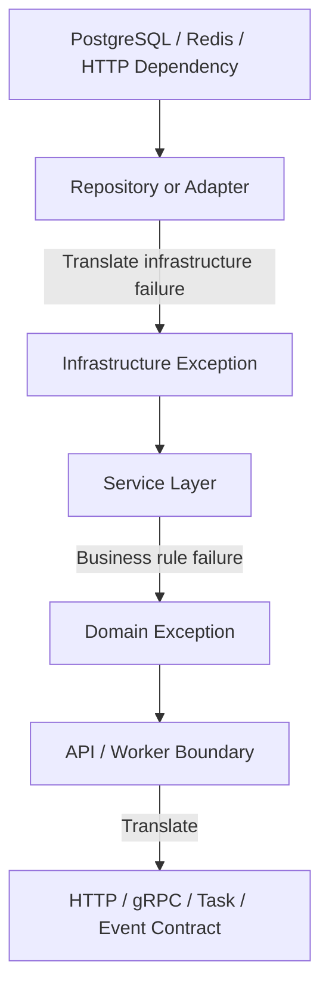

# 06- Custom Exceptions

## Overview

Custom exceptions provide application-specific failure types that communicate domain and architectural meaning more precisely than generic built-in exceptions.

Python already provides a broad exception hierarchy:

```text
Exception
├── ValueError
├── TypeError
├── LookupError
├── OSError
├── RuntimeError
└── ...
```

These exceptions are appropriate for many low-level failures. However, backend applications commonly need to represent concepts such as:

- `OrderNotFoundError`
- `InsufficientFundsError`
- `InvalidOrderStateError`
- `PaymentProviderUnavailableError`
- `UserAlreadyExistsError`
- `AuthorizationError`

A well-designed custom exception hierarchy creates a stable contract between application layers:

```text
Infrastructure failure
        │
        ▼
Repository / Adapter
        │
        ▼
Application exception
        │
        ▼
Service layer
        │
        ▼
API / Worker boundary
        │
        ▼
External error contract
```

The objective is not to create an exception class for every possible failure. Custom exceptions are valuable when they communicate **meaningful application or domain semantics**.

---

## What Is a Custom Exception?

A custom exception is a Python class derived from an existing exception class, usually `Exception` or another semantically appropriate exception.

The simplest form is:

```python
class OrderError(Exception):
    """Base exception for order-related failures."""
```

It can then be raised:

```python
raise OrderError("order processing failed")
```

And handled:

```python
try:
    process_order(order)
except OrderError:
    handle_order_failure()
```

Because the class inherits from `Exception`, it participates in Python's normal exception hierarchy and matching rules.

---

## Why Custom Exceptions Exist

Generic exceptions often lose important application meaning.

Consider:

```python
raise ValueError("order cannot be cancelled")
```

The caller knows that something is invalid, but not necessarily what kind of application failure occurred.

Compare:

```python
raise OrderCancellationError(
    "order cannot be cancelled in its current state"
)
```

The exception type now communicates intent.

A caller can make a precise decision:

```python
try:
    cancel_order(order)
except OrderCancellationError:
    return cancellation_failed()
```

This is particularly useful across service, repository, API, and background-worker boundaries.

---

## When to Use Custom Exceptions

Use a custom exception when:

- the failure represents a domain concept
- callers need to distinguish it from other failures
- multiple modules need a stable failure contract
- infrastructure details should be hidden
- an exception needs structured metadata
- an API or worker boundary needs consistent mapping
- an exception hierarchy provides useful grouping

Avoid creating a custom exception when a standard exception already communicates the semantics clearly.

For example:

```python
raise ValueError("timeout must be positive")
```

is usually preferable to:

```python
class InvalidTimeoutError(Exception):
    ...
```

unless the application repeatedly needs to distinguish `InvalidTimeoutError` from other validation failures.

---

## Basic Custom Exception

A minimal domain exception:

```python
class OrderNotFoundError(Exception):
    """Raised when an order cannot be found."""
```

Usage:

```python
def get_order(order_id: int) -> Order:
    order = repository.find(order_id)

    if order is None:
        raise OrderNotFoundError(
            f"order {order_id} was not found"
        )

    return order
```

This establishes a clear service contract.

---

## Custom Exception Hierarchies

Related exceptions should often share a common base class.

```python
class OrderError(Exception):
    """Base class for order-related failures."""


class OrderNotFoundError(OrderError):
    """Raised when an order does not exist."""


class OrderAlreadyExistsError(OrderError):
    """Raised when an order already exists."""


class InvalidOrderStateError(OrderError):
    """Raised when an order operation violates its state."""
```

The hierarchy becomes:

```text
Exception
    │
    └── OrderError
          ├── OrderNotFoundError
          ├── OrderAlreadyExistsError
          └── InvalidOrderStateError
```

A caller can handle a specific error:

```python
except OrderNotFoundError:
    ...
```

or all order-related errors:

```python
except OrderError:
    ...
```

This is one of the strongest reasons to create a domain-specific base exception.

---

## Application-Level Exception Hierarchy

A larger backend may define separate categories:

```python
class ApplicationError(Exception):
    """Base exception for application failures."""


class DomainError(ApplicationError):
    """Base exception for domain rule violations."""


class InfrastructureError(ApplicationError):
    """Base exception for infrastructure failures."""


class OrderError(DomainError):
    """Base exception for order failures."""


class OrderNotFoundError(OrderError):
    """Order does not exist."""


class OrderPersistenceError(InfrastructureError):
    """Order persistence failed."""
```

Conceptually:

```text
Exception
    │
    └── ApplicationError
          ├── DomainError
          │     └── OrderError
          │           └── OrderNotFoundError
          │
          └── InfrastructureError
                └── OrderPersistenceError
```

This lets higher layers distinguish broad failure categories without knowing implementation details.

---

## Domain Exceptions vs Infrastructure Exceptions

A useful architectural distinction is:

| Category | Example | Usually originates from |
|---|---|---|
| Domain | `InsufficientFundsError` | Business rules |
| Application | `InvalidOperationError` | Application workflow |
| Infrastructure | `DatabaseUnavailableError` | Database/network |
| Integration | `PaymentProviderError` | External service |
| Transport | HTTP/gRPC error | API boundary |

The application should avoid leaking low-level infrastructure exceptions throughout the domain.

For example:

```text
PostgreSQL exception
       │
       ▼
Repository
       │
       ▼
OrderPersistenceError
       │
       ▼
Service
```

This keeps domain logic independent from a particular database driver.

---

## Translating Infrastructure Exceptions

Suppose a PostgreSQL driver raises a unique-constraint exception:

```python
try:
    database.insert_order(order)
except UniqueViolationError as exc:
    raise OrderAlreadyExistsError(
        order.id
    ) from exc
```

The repository translates:

```text
Database-specific exception
          │
          ▼
Application/domain exception
```

The service can then depend on:

```python
except OrderAlreadyExistsError:
    ...
```

rather than importing database-specific classes.

---

## Exception Chaining

Always preserve useful underlying causes when translating exceptions.

```python
try:
    repository.save(order)
except DatabaseError as exc:
    raise OrderPersistenceError(
        f"failed to persist order {order.id}"
    ) from exc
```

The new exception contains:

```python
exc.__cause__
```

pointing to the original exception.

This gives developers both:

- a stable application-level error
- the original infrastructure-level cause

The production flow becomes:

```text
DatabaseError
     │
     │ from
     ▼
OrderPersistenceError
     │
     ▼
API / worker boundary
```

---

## Custom Exception Metadata

Exception classes can contain structured information.

```python
class OrderNotFoundError(Exception):
    def __init__(self, order_id: int):
        self.order_id = order_id
        super().__init__(
            f"order {order_id} was not found"
        )
```

Usage:

```python
try:
    service.get_order(order_id)
except OrderNotFoundError as exc:
    logger.info(
        "order not found",
        extra={"order_id": exc.order_id},
    )
```

This is better than requiring callers to parse:

```python
str(exc)
```

to extract the order ID.

---

## Dataclass-Based Exceptions

For exceptions with several structured fields, a dataclass can sometimes improve readability.

```python
from dataclasses import dataclass


@dataclass
class PaymentDeclinedError(Exception):
    payment_id: str
    reason: str

    def __post_init__(self) -> None:
        super().__init__(
            f"payment {self.payment_id} was declined: {self.reason}"
        )
```

Use this approach carefully.

Exception objects already have behavior and lifecycle semantics, so a dataclass should add real value rather than being used automatically.

---

## Exception `args`

Python exceptions store positional constructor arguments in `args`.

```python
error = ValueError("invalid value")

print(error.args)
```

Output:

```text
('invalid value',)
```

For custom exceptions:

```python
class ResourceNotFoundError(Exception):
    def __init__(self, resource_type: str, resource_id: str):
        self.resource_type = resource_type
        self.resource_id = resource_id
        super().__init__(resource_type, resource_id)
```

However, application code should generally use explicit attributes rather than relying on the structure of `args`.

---

## Custom Exception Messages

A good exception message should be:

- specific
- concise
- actionable for developers
- safe to log
- free of secrets

Prefer:

```python
raise InvalidOrderStateError(
    f"cannot ship order {order.id} in state {order.status}"
)
```

Avoid:

```python
raise InvalidOrderStateError("something went wrong")
```

Do not include:

- passwords
- access tokens
- API keys
- authorization headers
- full payment credentials
- sensitive personal information

---

## Stable Error Codes

For external APIs, exception messages should not usually become the public contract.

A better design is to define stable error codes:

```python
class OrderError(ApplicationError):
    code = "ORDER_ERROR"


class OrderNotFoundError(OrderError):
    code = "ORDER_NOT_FOUND"


class OrderAlreadyExistsError(OrderError):
    code = "ORDER_ALREADY_EXISTS"
```

The API layer can map:

```text
Exception type
      │
      ├── stable code
      ├── HTTP status
      └── safe message
```

For example:

```json
{
  "error": {
    "code": "ORDER_NOT_FOUND",
    "message": "Order not found"
  }
}
```

This allows internal implementation details to evolve without breaking API consumers.

---

## Exception Attributes vs Error Codes

These solve different problems.

| Mechanism | Purpose |
|---|---|
| Exception class | Internal failure classification |
| Exception attributes | Structured diagnostic/context data |
| Error code | Stable external/application contract |
| Exception message | Human-readable diagnostic information |

Do not force one mechanism to perform all four roles.

---

## HTTP API Mapping

FastAPI can translate application exceptions into HTTP responses.

```python
from fastapi import FastAPI, Request
from fastapi.responses import JSONResponse

app = FastAPI()


@app.exception_handler(OrderNotFoundError)
async def order_not_found_handler(
    request: Request,
    exc: OrderNotFoundError,
) -> JSONResponse:
    return JSONResponse(
        status_code=404,
        content={
            "error": {
                "code": "ORDER_NOT_FOUND",
                "message": "Order not found",
            }
        },
    )
```

The domain exception remains independent of HTTP.

```text
Service
   │
   ▼
OrderNotFoundError
   │
   ▼
FastAPI exception handler
   │
   ▼
HTTP 404
```

This is preferable to embedding HTTP concepts directly into domain code.

---

## Django Mapping

Django applications can similarly establish a boundary between application exceptions and HTTP responses.

For example, a service may raise:

```python
raise OrderNotFoundError(order_id)
```

while the view or centralized middleware/exception handling layer determines:

```text
OrderNotFoundError
       │
       ▼
HTTP 404
```

The service does not need to know that the caller is an HTTP client.

---

## gRPC Mapping

The same architectural principle applies to gRPC.

```text
OrderNotFoundError
       │
       ▼
gRPC boundary
       │
       ▼
NOT_FOUND
```

For example:

```python
try:
    order = service.get_order(order_id)
except OrderNotFoundError:
    context.abort(
        grpc.StatusCode.NOT_FOUND,
        "order not found",
    )
```

Internal exception types should not become accidental wire-level contracts.

---

## Custom Exceptions and REST Semantics

A typical mapping might be:

| Custom exception | HTTP status |
|---|---:|
| `InvalidRequestError` | `400` |
| `AuthenticationError` | `401` |
| `PermissionDeniedError` | `403` |
| `ResourceNotFoundError` | `404` |
| `ConflictError` | `409` |
| `ValidationError` | `422` where appropriate |
| `RateLimitExceededError` | `429` |
| `DependencyUnavailableError` | `502` / `503` |
| Unknown exception | `500` |

The mapping should be centralized so that individual endpoints do not implement inconsistent policies.

---

## Generic Base Exceptions

A generic application base exception can provide common behavior:

```python
class ApplicationError(Exception):
    """Base exception for expected application failures."""

    code = "APPLICATION_ERROR"
```

Then:

```python
class ResourceNotFoundError(ApplicationError):
    code = "RESOURCE_NOT_FOUND"
```

This allows a global handler to process known application failures:

```python
@app.exception_handler(ApplicationError)
async def application_error_handler(
    request: Request,
    exc: ApplicationError,
):
    return JSONResponse(
        status_code=500,
        content={
            "error": {
                "code": exc.code,
                "message": str(exc),
            }
        },
    )
```

The actual implementation should determine status codes from explicit metadata or a controlled mapping rather than assuming every `ApplicationError` means `500`.

---

## Adding HTTP Metadata

It is technically possible to put HTTP status information directly into exceptions:

```python
class APIError(ApplicationError):
    status_code = 500
```

However, this couples application exceptions to the HTTP transport.

For domain-heavy architectures, prefer:

```text
Domain exception
       │
       ▼
API exception mapping
       │
       ▼
HTTP status
```

rather than:

```text
Domain exception
       │
       └── status_code = 404
```

The second approach can be reasonable in API-centric applications, but it should be a deliberate architectural choice.

---

## Custom Exceptions for Business Rules

Custom exceptions are particularly valuable for business invariants.

```python
class InsufficientFundsError(DomainError):
    def __init__(
        self,
        account_id: str,
        requested: int,
        available: int,
    ):
        self.account_id = account_id
        self.requested = requested
        self.available = available

        super().__init__(
            f"insufficient funds for account {account_id}"
        )
```

Service logic:

```python
def withdraw(account: Account, amount: int) -> None:
    if amount > account.available_balance:
        raise InsufficientFundsError(
            account_id=account.id,
            requested=amount,
            available=account.available_balance,
        )

    account.withdraw(amount)
```

The exception expresses the domain rule directly.

---

## Custom Exceptions for State Transitions

State machines frequently benefit from custom exceptions.

```python
class InvalidOrderStateError(DomainError):
    def __init__(self, order_id: int, state: str):
        self.order_id = order_id
        self.state = state

        super().__init__(
            f"invalid state transition for order {order_id}: {state}"
        )
```

Then:

```python
def ship_order(order: Order) -> None:
    if order.status != OrderStatus.PAID:
        raise InvalidOrderStateError(
            order_id=order.id,
            state=order.status,
        )

    order.status = OrderStatus.SHIPPED
```

This prevents invalid transitions from silently changing domain state.

---

## Custom Exceptions for External Dependencies

External services can have their own exception models.

Instead of allowing a payment SDK's exceptions to leak:

```python
try:
    payment_sdk.charge(request)
except PaymentSDKTimeout as exc:
    raise PaymentProviderTimeoutError from exc
```

The rest of the application can depend on:

```python
PaymentProviderTimeoutError
```

rather than the SDK's class.

This reduces coupling and simplifies testing.

---

## Retryable Exception Types

A custom hierarchy can explicitly identify transient failures.

```python
class DependencyError(InfrastructureError):
    """Base class for dependency failures."""


class RetryableDependencyError(DependencyError):
    """Dependency failure that may be safely retried."""


class PermanentDependencyError(DependencyError):
    """Dependency failure that should not be retried."""
```

Then:

```python
try:
    client.call()
except RetryableDependencyError:
    schedule_retry()
```

The classification must still be based on actual operation semantics.

A timeout is not automatically safe to retry if the operation may have already produced an external side effect.

---

## Custom Exceptions and Idempotency

Consider:

```text
Service
  │
  ▼
Payment provider
  │
  ▼
Charge succeeds
  │
  ▼
Network timeout
  │
  ▼
PaymentProviderTimeoutError
```

The exception says the client did not receive a successful response.

It does **not** necessarily mean the payment did not happen.

Therefore:

```text
Exception type
    ≠
Proof that side effect failed
```

For distributed operations, combine exceptions with:

- idempotency keys
- operation identifiers
- durable state
- reconciliation
- provider-side status checks

---

## Custom Exceptions and Transactions

A domain exception can trigger transaction rollback depending on the transaction framework.

```python
with transaction():
    order.reserve_inventory()

    if order.invalid_state:
        raise InvalidOrderStateError(order.id)

    repository.save(order)
```

The transaction layer determines whether the exception causes rollback.

The domain exception should describe the business failure rather than directly implementing transaction behavior.

---

## Custom Exceptions and Celery

Celery tasks can use custom exceptions to classify failures.

```python
class TemporaryOrderProcessingError(ApplicationError):
    """Retryable order-processing failure."""
```

A task can propagate the exception:

```python
@app.task
def process_order(order_id: int):
    try:
        service.process(order_id)
    except TemporaryOrderProcessingError as exc:
        raise process_order.retry(
            exc=exc,
            countdown=10,
        )
```

This allows worker behavior to remain separate from domain semantics.

---

## Custom Exceptions and Kafka

Kafka consumers can classify failures:

```text
Event
 │
 ▼
Consumer
 │
 ├── DomainError
 │      └── possibly DLQ / reject
 │
 └── RetryableDependencyError
        └── retry
```

The consumer infrastructure should determine what happens to the event.

Do not assume that merely raising a custom exception guarantees a retry. The consumer framework's offset and retry semantics determine the actual outcome.

---

## Exception Hierarchy Design

A practical hierarchy might be:

```text
Exception
    │
    └── ApplicationError
          │
          ├── DomainError
          │     ├── OrderError
          │     │     ├── OrderNotFoundError
          │     │     ├── OrderAlreadyExistsError
          │     │     └── InvalidOrderStateError
          │     │
          │     └── PaymentError
          │           ├── PaymentDeclinedError
          │           └── InsufficientFundsError
          │
          └── InfrastructureError
                ├── DatabaseError
                ├── CacheError
                └── DependencyError
```

This hierarchy supports both precise and broad handling.

---

## Avoid Excessive Hierarchies

Do not create:

```text
OrderError
├── OrderCreateError
│   ├── OrderCreateDatabaseError
│   ├── OrderCreateValidationError
│   └── OrderCreateSerializationError
├── OrderUpdateError
│   ├── OrderUpdateDatabaseError
│   └── OrderUpdateValidationError
└── ...
```

unless callers genuinely need those distinctions.

An exception hierarchy should encode useful behavioral or semantic differences, not every location where a failure can occur.

---

## Inheritance Strategy

The default recommendation is:

```python
class MyApplicationError(Exception):
    ...
```

Then create meaningful subclasses.

Avoid inheriting from an unrelated built-in exception simply because its name sounds convenient.

For example, do not use:

```python
class PaymentFailedError(KeyError):
    ...
```

unless the failure genuinely has mapping-key semantics.

Exception inheritance affects which handlers catch the exception.

---

## Multiple Inheritance

Python technically supports multiple inheritance for exception classes:

```python
class RetryablePaymentError(
    PaymentError,
    RetryableError,
):
    ...
```

This can be useful for orthogonal classifications.

However, exception classes have implementation details and built-in exception types may have special memory layouts. Python documentation advises caution with multiple inheritance involving built-in exception classes.

Prefer a simple hierarchy unless multiple inheritance provides a clear semantic benefit.

---

## Marker Exceptions

Sometimes an exception exists primarily to classify behavior:

```python
class RetryableError(Exception):
    """Marks failures that may be retried."""
```

Then:

```python
class PaymentTimeoutError(
    PaymentError,
    RetryableError,
):
    ...
```

This can be useful, but the retry system should still verify idempotency and operational constraints.

A marker class should not become an excuse to retry every operation automatically.

---

## Exception Methods

Custom exceptions can expose behavior:

```python
class PaymentError(ApplicationError):
    def is_retryable(self) -> bool:
        return False
```

Subclass:

```python
class PaymentTimeoutError(PaymentError):
    def is_retryable(self) -> bool:
        return True
```

However, simple class-based classification is often easier to reason about:

```python
class RetryablePaymentError(PaymentError):
    ...
```

Prefer the simplest mechanism that expresses the required contract.

---

## Exception Properties

Properties can provide derived diagnostic information:

```python
class RateLimitExceededError(ApplicationError):
    def __init__(self, retry_after: int):
        self.retry_after = retry_after
        super().__init__(
            f"rate limit exceeded; retry after {retry_after}s"
        )
```

An API layer can then map:

```python
except RateLimitExceededError as exc:
    return JSONResponse(
        status_code=429,
        headers={"Retry-After": str(exc.retry_after)},
        content={
            "error": {
                "code": "RATE_LIMITED",
                "message": "Too many requests",
            }
        },
    )
```

This preserves structured information without requiring message parsing.

---

## Serialization Considerations

Exceptions are ordinary Python objects, but they are not automatically appropriate as distributed data contracts.

Avoid sending a custom exception object through Kafka or another external message system as the protocol itself.

Instead, serialize a stable event/error representation:

```json
{
  "error_code": "ORDER_NOT_FOUND",
  "order_id": "12345"
}
```

The receiving service should not need the sender's Python exception class definition to interpret the message.

---

## Pickling and Custom Exceptions

Some Python exception objects can be pickled, but custom exception constructors and attributes can make serialization behavior more complicated.

Do not design distributed protocols around pickled exception objects.

For Celery or other distributed systems, use the framework's supported task-result/error mechanisms and stable serialized payloads.

---

## Logging Custom Exceptions

Custom exceptions should provide useful diagnostic information.

```python
try:
    service.create_order(order)
except OrderError:
    logger.exception(
        "order processing failed",
        extra={"order_id": order.id},
    )
    raise
```

Structured exception attributes are useful for logging:

```python
logger.error(
    "payment declined",
    extra={
        "payment_id": exc.payment_id,
        "reason": exc.reason,
    },
)
```

Do not log sensitive payment data merely because it exists on the exception.

---

## Exception Chaining and Observability

A translated exception should preserve its cause:

```python
try:
    redis_client.get(key)
except RedisError as exc:
    raise CacheUnavailableError(
        f"cache unavailable for key {key}"
    ) from exc
```

Observability systems can then distinguish:

```text
CacheUnavailableError
       │
       └── caused by RedisError
```

This provides stable application semantics while retaining infrastructure diagnostics.

---

## Testing Custom Exceptions

Test the exception contract directly.

```python
def test_order_not_found():
    with pytest.raises(OrderNotFoundError):
        service.get_order(999)
```

If the exception contains structured metadata:

```python
def test_order_not_found_contains_id():
    with pytest.raises(OrderNotFoundError) as exc_info:
        service.get_order(999)

    assert exc_info.value.order_id == 999
```

If the exception is translated:

```python
def test_database_failure_is_translated():
    with pytest.raises(OrderPersistenceError) as exc_info:
        service.save(order)

    assert isinstance(
        exc_info.value.__cause__,
        DatabaseError,
    )
```

---

## Testing Hierarchy Behavior

Verify broad handlers catch intended subclasses:

```python
def test_order_error_catches_not_found():
    with pytest.raises(OrderError):
        raise OrderNotFoundError(123)
```

Also test that unrelated exceptions are not accidentally classified under the same hierarchy.

Exception inheritance is part of the application's behavior contract.

---

## API Contract Testing

If custom exceptions map to API error codes, test the external contract:

```python
def test_missing_order_returns_stable_error(client):
    response = client.get("/orders/999")

    assert response.status_code == 404
    assert response.json()["error"]["code"] == "ORDER_NOT_FOUND"
```

This ensures internal exception refactoring does not accidentally change the public API.

---

## Security Considerations

Custom exceptions can become a source of information leakage.

Avoid:

```python
class AuthenticationError(Exception):
    def __init__(self, token: str):
        self.token = token
        super().__init__(f"invalid token: {token}")
```

Prefer:

```python
class AuthenticationError(Exception):
    """Raised when authentication fails."""
```

And expose:

```json
{
  "error": {
    "code": "AUTHENTICATION_FAILED",
    "message": "Authentication failed"
  }
}
```

Sensitive information should never be included merely because it helps debugging.

---

## Do Not Use Exceptions for Authorization Logic

Exceptions may represent a failed authorization decision:

```python
if not policy.allows(user, resource):
    raise PermissionDeniedError()
```

But the exception itself is not the authorization mechanism.

Authorization should be based on:

- trusted identity
- explicit policy
- resource ownership
- roles/permissions
- security context

The exception is only the result of the decision.

---

## Performance Considerations

Custom exception classes themselves have negligible impact compared with the cost of actually raising and handling exceptions.

The expensive path can include:

- object construction
- traceback creation
- stack unwinding
- logging
- monitoring
- serialization

Do not create elaborate custom exception objects for extremely frequent expected outcomes.

If "not found" is an ordinary high-frequency result in a query API, an explicit `None` or result object may be more appropriate internally.

---

## Memory Considerations

Exceptions may retain traceback information.

A traceback can retain references to:

```text
Exception
   │
   ▼
Traceback
   │
   ▼
Frame
   │
   ▼
Local variables
```

Avoid storing complete exception objects indefinitely in:

- global caches
- long-lived registries
- application state
- persistent queues

Extract the information needed for durable diagnostics instead.

---

## Concurrency Considerations

Custom exceptions are ordinary Python objects and are normally local to the execution path where they are raised.

However, shared exception instances should generally be avoided:

```python
ERROR = PaymentError("payment failed")
```

and repeatedly raised.

Prefer creating a fresh exception for each failure:

```python
raise PaymentError("payment failed")
```

Fresh instances avoid confusing traceback and mutable-state behavior.

In asynchronous or concurrent applications, exception propagation must also be considered alongside:

- task cancellation
- task supervision
- thread boundaries
- process boundaries
- retry behavior
- partial success

---

## Distributed Systems

Custom exceptions are process-local implementation constructs.

They do not automatically cross:

- HTTP
- gRPC
- Kafka
- Celery workers
- process boundaries
- container boundaries

Instead:

```text
Python exception
      │
      ▼
Boundary translation
      │
      ▼
Wire-level error/event
      │
      ▼
Remote service
      │
      ▼
Remote exception / result
```

This distinction is critical in microservice architectures.

---

## High Availability

In a highly available system, exceptions should support graceful degradation rather than simply hiding failures.

For example:

```text
Redis unavailable
      │
      ▼
CacheUnavailableError
      │
      ▼
Service decides
      │
      ├── fallback to PostgreSQL
      └── fail request
```

The exception should communicate enough information for the owning layer to make the correct decision.

Do not automatically turn every infrastructure failure into a successful fallback.

---

## Kubernetes and Deployment

Custom exceptions do not replace process-level failure handling.

A containerized application should distinguish:

```text
Application failure
    └── custom exception


Process lifecycle event
    └── graceful shutdown
```

Do not catch broad exceptions merely to prevent Kubernetes from observing process failures.

A process that is unhealthy should be allowed to fail when that is safer than continuing in an invalid state.

---

## Common Mistakes

| Mistake | Problem | Better approach |
|---|---|---|
| Creating an exception for every condition | Excessive complexity | Create meaningful semantic types |
| Using `Exception` everywhere | Weak contracts | Use specific domain exceptions |
| Inheriting from unrelated built-ins | Incorrect handler semantics | Choose semantically correct bases |
| Exposing exception text in APIs | Information leakage | Use stable error codes/messages |
| Parsing `str(exc)` for data | Fragile | Use structured attributes |
| Losing the original exception | Poor diagnostics | Use exception chaining |
| Putting HTTP status in every domain error | Transport coupling | Map at API boundary |
| Retrying every custom error | Outage amplification | Explicitly classify retryable failures |
| Reusing exception instances | Traceback/state confusion | Create fresh instances |
| Sending exception objects over Kafka | Tight Python coupling | Serialize stable error data |
| Catching custom exceptions too early | Prevents higher-level decisions | Handle at the correct boundary |
| Overly deep hierarchy | Hard to maintain | Encode only useful distinctions |

---

## Production Architecture

A mature backend can use custom exceptions as a controlled translation layer:



The key architectural rule is:

```text
Lower-level implementation
        ↓
Technical exception
        ↓
Application exception
        ↓
Domain/API contract
```

Not every exception needs to be translated. Translation is valuable when it removes an undesirable dependency or establishes a more useful semantic contract.

---

## Recommended Project Structure

A medium-to-large Python backend might organize exceptions as:

```text
src/
├── domain/
│   ├── orders/
│   │   ├── exceptions.py
│   │   ├── models.py
│   │   └── services.py
│   └── payments/
│       ├── exceptions.py
│       └── services.py
│
├── infrastructure/
│   ├── database/
│   │   └── exceptions.py
│   ├── redis/
│   │   └── exceptions.py
│   └── payments/
│       └── exceptions.py
│
└── api/
    └── exception_handlers.py
```

The exact structure depends on architecture and project size.

Avoid creating a single enormous `exceptions.py` containing unrelated failures from every subsystem.

---

## Naming Conventions

Use descriptive names ending in `Error`:

```python
OrderNotFoundError
PaymentDeclinedError
InvalidOrderStateError
DatabaseUnavailableError
CacheConnectionError
```

Prefer:

```python
class OrderNotFoundError(OrderError):
    ...
```

over:

```python
class OrderNotFound(OrderError):
    ...
```

The `Error` suffix makes the class's role immediately apparent.

---

## Exception Design Checklist

Before creating a custom exception, ask:

1. Does a built-in exception already express this failure?
2. Do callers need to distinguish this condition?
3. Is the failure domain-specific?
4. Should it belong to an existing exception hierarchy?
5. Which layer owns the exception?
6. Should infrastructure details be hidden?
7. Does the exception need structured attributes?
8. Should the original cause be preserved?
9. Is the exception retryable?
10. Is retrying safe and idempotent?
11. Does it map to an API or worker contract?
12. Could its message expose sensitive data?
13. Will it be useful in logs and traces?
14. Does its inheritance make handler matching predictable?
15. Does the hierarchy remain simple enough to maintain?

---

## Senior Engineering Heuristics

A strong custom exception design follows several principles.

### Prefer Semantics Over Implementation

Use:

```python
OrderAlreadyExistsError
```

rather than:

```python
PostgresUniqueViolationError
```

when the service should not depend on PostgreSQL.

### Keep Domain Exceptions Transport-Neutral

Prefer:

```python
raise OrderNotFoundError(order_id)
```

and translate it at the API boundary.

### Preserve Causes

Use:

```python
raise OrderPersistenceError from exc
```

when the lower-level failure remains diagnostically important.

### Use Structured Attributes

Prefer:

```python
exc.order_id
```

over parsing:

```python
str(exc)
```

### Keep Hierarchies Shallow

Create inheritance relationships because callers need them, not because every failure needs a unique parent.

### Make Retry Semantics Explicit

An exception named `TemporaryError` should not automatically imply that an operation is safe to repeat.

### Treat External Contracts Separately

Exception classes are internal Python implementation details. HTTP responses, gRPC statuses, and Kafka messages are protocol contracts.

---

## Production Checklist

Before merging custom exception code, verify:

- The exception represents a meaningful application or domain concept.
- A built-in exception was considered first.
- The inheritance hierarchy is intentional.
- Related exceptions share an appropriate base class.
- Infrastructure exceptions are translated at the correct boundary.
- Original causes are preserved when useful.
- Structured attributes are used instead of message parsing.
- Public API error codes are stable and transport-specific.
- Exception messages do not expose secrets or sensitive data.
- Retryability is explicit and operationally safe.
- Idempotency has been considered before retrying.
- Transaction behavior is understood.
- Async, worker, and concurrent execution semantics are understood.
- Exception objects are not retained unnecessarily.
- Tests cover type, metadata, chaining, hierarchy, and external mappings.
- Logs and metrics provide sufficient diagnostic context.
- The hierarchy is simple enough for future engineers to understand.

## Key Takeaways

- Custom exceptions provide stable, meaningful failure contracts for domain and application logic when built-in exceptions are insufficient.
- Design exception hierarchies around semantic relationships so callers can handle either precise failures or meaningful groups of failures.
- Translate infrastructure exceptions at architectural boundaries and preserve the original cause with `raise ... from exc` when it remains diagnostically useful.
- Keep Python exception classes separate from external protocols; map them explicitly to HTTP, gRPC, Kafka, Celery, or other wire-level contracts.
- Good custom exceptions improve reliability only when combined with deliberate retry, idempotency, transaction, observability, security, and resource-lifecycle policies.