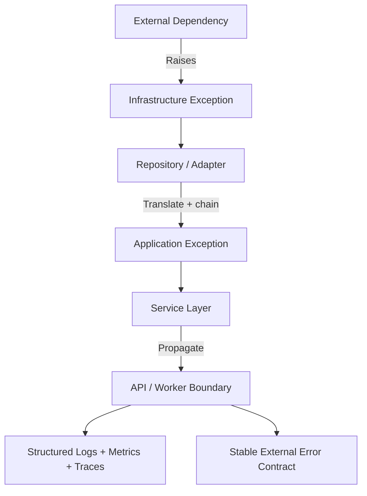

# 07- Exception Chaining

## Overview

Exception chaining is Python's mechanism for preserving the relationship between an exception being handled and another exception raised while handling it.

It is especially important in layered backend systems because a low-level failure often needs to be translated into a higher-level application exception without losing the original cause.

For example:

```text
PostgreSQL driver
      │
      ▼
UniqueViolationError
      │
      │  translated
      ▼
OrderAlreadyExistsError
      │
      ▼
Service layer
      │
      ▼
HTTP 409 Conflict
```

Without chaining, the higher-level exception can hide the original failure.

With chaining:

```python
try:
    repository.save(order)
except UniqueViolationError as exc:
    raise OrderAlreadyExistsError(order.id) from exc
```

Python retains both the application-level failure and its underlying cause.

Exception chaining therefore provides two important properties:

- **Abstraction** — callers receive an exception appropriate to their layer.
- **Diagnostics** — developers can still inspect the underlying failure.

---

## What Is Exception Chaining?

Exception chaining occurs when one exception is raised while another exception is being handled.

Python can associate exceptions through attributes such as:

- `__context__`
- `__cause__`
- `__suppress_context__`

The most explicit form is:

```python
raise NewError("operation failed") from exc
```

This creates an explicit cause relationship.

Conceptually:

```text
Original exception
       │
       ▼
Handled by current layer
       │
       ▼
Higher-level exception
       │
       └── __cause__ → original exception
```

---

## Why Exception Chaining Exists

Backend applications commonly have multiple abstraction layers.

For example:

```text
HTTP API
   │
   ▼
Service
   │
   ▼
Repository
   │
   ▼
PostgreSQL
```

The PostgreSQL driver may raise an implementation-specific exception:

```python
UniqueViolationError
```

The repository should not force the service layer to depend on that database-specific type.

Instead:

```python
try:
    database.insert(order)
except UniqueViolationError as exc:
    raise OrderAlreadyExistsError(order.id) from exc
```

Now the service understands:

```python
OrderAlreadyExistsError
```

while diagnostics retain:

```python
UniqueViolationError
```

---

## Implicit Exception Chaining

Python automatically records exception context when an exception is raised while another exception is being handled.

```python
try:
    operation()
except ValueError:
    raise RuntimeError("operation failed")
```

The resulting `RuntimeError` has:

```python
__context__
```

referring to the original `ValueError`.

The relationship is:

```text
ValueError
    │
    │ exception raised during handling
    ▼
RuntimeError
```

This is called **implicit exception chaining**.

---

## Explicit Exception Chaining

Explicit chaining uses `from`:

```python
try:
    operation()
except ValueError as exc:
    raise RuntimeError("operation failed") from exc
```

This establishes:

```python
new_exception.__cause__ is exc
```

The relationship is now explicit.

Prefer explicit chaining when intentionally translating one exception into another.

---

## `__context__` vs `__cause__`

These attributes represent different relationships.

| Attribute | Meaning |
|---|---|
| `__context__` | Previous exception that was active when a new exception was raised |
| `__cause__` | Explicitly specified cause using `raise ... from exc` |
| `__suppress_context__` | Whether implicit context should be suppressed when displaying the exception |

Example:

```python
try:
    operation()
except ValueError as exc:
    raise RuntimeError("operation failed") from exc
```

The relationship is:

```text
RuntimeError
    │
    └── __cause__
            │
            ▼
        ValueError
```

---

## Explicit vs Implicit Chaining

Compare:

```python
try:
    operation()
except ValueError:
    raise RuntimeError("operation failed")
```

with:

```python
try:
    operation()
except ValueError as exc:
    raise RuntimeError("operation failed") from exc
```

The second version communicates intent more clearly.

It tells future maintainers:

> This new exception intentionally represents the previous exception at a different abstraction level.

---

## Suppressing Context

Python supports:

```python
raise PublicError("request failed") from None
```

This suppresses the implicit exception context when Python displays the exception.

For example:

```python
try:
    parse_internal_format()
except InternalParserError:
    raise InvalidRequestError(
        "request format is invalid"
    ) from None
```

The caller sees the public exception without the internal parser exception being displayed as its context.

Use this deliberately.

Do not suppress context simply because the traceback is inconvenient. Internal diagnostics may still be valuable.

---

## When to Use `from None`

`from None` can be appropriate when:

- an internal implementation detail should not be exposed
- a lower-level exception is not useful at the current boundary
- a cleaner external exception representation is required

For example:

```python
try:
    load_configuration()
except FileNotFoundError:
    raise ConfigurationError(
        "required configuration is missing"
    ) from None
```

The API or startup error can remain focused on the configuration problem.

For internal logging, however, ensure that useful diagnostic information is not accidentally lost.

---

## Traceback Representation

Exception chaining affects Python's traceback output.

For explicit chaining:

```python
try:
    int("abc")
except ValueError as exc:
    raise RuntimeError("parsing failed") from exc
```

Python displays the original exception followed by a message indicating that the second exception was directly caused by the first.

Conceptually:

```text
ValueError
    │
    ▼
During handling...
    │
    ▼
RuntimeError
```

This makes multi-layer failures easier to diagnose.

---

## Exception Chaining Attributes

An exception can expose:

```python
exc.__cause__
exc.__context__
exc.__suppress_context__
exc.__traceback__
```

For example:

```python
try:
    int("abc")
except ValueError as exc:
    try:
        raise RuntimeError("conversion failed") from exc
    except RuntimeError as error:
        assert error.__cause__ is exc
```

These attributes are primarily useful for diagnostics, testing, and advanced exception processing.

Normal application code should usually rely on exception types and explicit application contracts rather than inspecting these attributes routinely.

---

## Chaining Across Layers

A common backend architecture is:

```text
Database
    │
    ▼
Repository
    │
    ▼
Service
    │
    ▼
API
```

Each layer may translate failures:

```text
PostgreSQL exception
        │
        ▼
Repository exception
        │
        ▼
Domain/application exception
        │
        ▼
HTTP/gRPC error
```

Example:

```python
try:
    repository.insert(order)
except DatabaseError as exc:
    raise OrderPersistenceError(
        order.id
    ) from exc
```

Then the service can translate again:

```python
try:
    service.create_order(order)
except OrderPersistenceError as exc:
    raise OrderCreationError(
        "order could not be created"
    ) from exc
```

This creates a chain:

```text
OrderCreationError
       │
       └── cause
             ▼
      OrderPersistenceError
             │
             └── cause
                   ▼
             DatabaseError
```

---

## Avoid Over-Chaining

Chaining every exception at every layer can become noisy:

```text
APIError
  → ServiceError
      → RepositoryError
          → AdapterError
              → DatabaseError
                  → DriverError
```

Not every layer needs to create a new exception.

Translate only when the abstraction meaningfully changes.

A useful rule is:

> Add a new exception when the receiving layer needs a different semantic contract.

Otherwise, propagate the existing exception.

---

## Good Translation Boundary

Good:

```python
try:
    repository.save(order)
except DatabaseError as exc:
    raise OrderPersistenceError(order.id) from exc
```

The repository is changing:

```text
database-specific semantics
        ↓
application persistence semantics
```

This is a meaningful abstraction boundary.

---

## Unnecessary Translation

Avoid:

```python
try:
    service.process()
except OrderError as exc:
    raise OrderError(str(exc)) from exc
```

Nothing meaningful changed.

The code adds another exception layer without improving the contract.

Prefer:

```python
service.process()
```

and allow the existing exception to propagate.

---

## Chaining and Logging

Exception chaining allows the final boundary to log both the high-level failure and its cause.

```python
try:
    service.create_order(order)
except OrderCreationError:
    logger.exception(
        "order creation failed",
        extra={"order_id": order.id},
    )
    raise
```

The traceback can expose the complete chain.

This is generally preferable to independently logging every layer:

```text
Repository logs error
Service logs error
Controller logs error
Global handler logs error
```

which can produce duplicate logs.

---

## Logging Strategy

A useful production strategy is:

```text
Lower layer
    │
    ├── translate
    └── preserve cause
          │
          ▼
Application boundary
    │
    ├── log
    ├── metric
    ├── trace
    └── external response
```

Not every layer should emit an error-level log.

The layer responsible for handling the failure should usually own the primary operational log.

---

## Structured Logging

Custom exceptions can carry structured information:

```python
class OrderPersistenceError(Exception):
    def __init__(self, order_id: int):
        self.order_id = order_id
        super().__init__(
            f"failed to persist order {order_id}"
        )
```

Then:

```python
try:
    repository.save(order)
except OrderPersistenceError as exc:
    logger.exception(
        "order persistence failed",
        extra={"order_id": exc.order_id},
    )
    raise
```

This is preferable to extracting identifiers from exception strings.

---

## Chaining and API Responses

Internal exception chains should normally not be exposed directly to clients.

Internally:

```text
HTTP 500
   │
   ▼
OrderCreationError
   │
   ▼
OrderPersistenceError
   │
   ▼
PostgreSQL error
```

Externally:

```json
{
  "error": {
    "code": "ORDER_CREATION_FAILED",
    "message": "Unable to create order"
  }
}
```

The client needs a stable contract, not Python traceback information.

---

## FastAPI Example

A FastAPI application can translate a custom exception:

```python
@app.exception_handler(OrderNotFoundError)
async def order_not_found_handler(request, exc):
    return JSONResponse(
        status_code=404,
        content={
            "error": {
                "code": "ORDER_NOT_FOUND",
                "message": "Order not found",
            }
        },
    )
```

The service can remain transport-neutral:

```python
try:
    order = repository.find(order_id)
except DatabaseError as exc:
    raise OrderPersistenceError(order_id) from exc
```

This keeps:

```text
Domain/service
    ≠
HTTP transport
```

---

## Django Example

A Django service can similarly translate infrastructure failures:

```python
try:
    order = Order.objects.get(pk=order_id)
except Order.DoesNotExist as exc:
    raise OrderNotFoundError(order_id) from exc
```

The view or centralized exception layer can then map:

```text
OrderNotFoundError
      │
      ▼
HTTP 404
```

The service does not need to expose Django ORM exception classes to callers.

---

## gRPC Example

The same approach works for gRPC:

```python
try:
    order = service.get_order(order_id)
except OrderNotFoundError as exc:
    context.abort(
        grpc.StatusCode.NOT_FOUND,
        "order not found",
    )
```

The internal chain can remain Python-specific while the external representation uses gRPC status semantics.

---

## Database Translation

A repository is a common exception-chaining boundary.

```python
def save_order(order):
    try:
        database.insert(order)
    except DatabaseError as exc:
        raise OrderPersistenceError(
            order_id=order.id,
        ) from exc
```

The chain communicates:

```text
DatabaseError
      │
      ▼
OrderPersistenceError
```

This allows the service layer to handle the application error without coupling itself to the database implementation.

---

## Redis Translation

For Redis:

```python
def get_cached_order(order_id: int):
    try:
        return redis_client.get(f"order:{order_id}")
    except RedisError as exc:
        raise CacheUnavailableError(
            order_id
        ) from exc
```

Do not automatically translate every Redis failure into a cache miss.

These are different states:

```text
Cache miss
    └── key does not exist

Cache failure
    └── Redis cannot be reached
```

The service may choose to degrade on one while failing on the other.

---

## External HTTP Translation

Consider an external payment service:

```python
try:
    response = payment_client.charge(request)
except TimeoutError as exc:
    raise PaymentProviderTimeoutError(
        payment_id=request.payment_id
    ) from exc
```

The application now understands:

```text
PaymentProviderTimeoutError
```

while diagnostics retain:

```text
TimeoutError
```

However, a timeout does not prove that the remote operation did not succeed.

Retry logic must account for possible ambiguous outcomes.

---

## Chaining and Retries

Exception chaining should not automatically imply retry behavior.

For example:

```python
try:
    client.charge(payment)
except TimeoutError as exc:
    raise PaymentProviderTimeoutError from exc
```

The resulting exception identifies the failure category.

Whether it can be retried depends on:

- idempotency
- external side effects
- provider semantics
- timeout budget
- rate limits
- current operation state

The chain explains **why** the failure occurred; it does not determine whether retrying is safe.

---

## Celery

A Celery task may propagate a chained exception:

```python
try:
    process_order(order_id)
except DatabaseError as exc:
    raise OrderProcessingError(order_id) from exc
```

The worker can then use its configured retry/failure behavior.

The important point is that the exception hierarchy and chaining preserve application semantics while the task framework determines delivery and retry behavior.

---

## Kafka

Kafka consumers may similarly translate processing failures:

```python
try:
    process_event(event)
except DatabaseError as exc:
    raise EventProcessingError(
        event_id=event.id
    ) from exc
```

The consumer framework must then determine whether the event is:

- retried
- sent to a dead-letter topic
- skipped
- reprocessed
- treated as permanently failed

Exception chaining provides diagnostic context but does not define Kafka offset semantics.

---

## Async Exception Chaining

Exception chaining works inside asynchronous code:

```python
async def create_payment(request):
    try:
        return await provider.charge(request)
    except ProviderError as exc:
        raise PaymentProviderError(
            request.payment_id
        ) from exc
```

The chain remains available across the asynchronous call stack.

The same principles apply:

- preserve meaningful causes
- avoid broad translation
- do not suppress cancellation accidentally
- maintain observability

---

## Exception Chaining and Cancellation

Asynchronous systems have additional control-flow exceptions and cancellation behavior.

Avoid:

```python
try:
    await operation()
except Exception as exc:
    raise ApplicationError("operation failed") from exc
```

if the handler unintentionally translates failures that should be handled separately by the surrounding async framework.

Exception translation should be deliberate, especially around task cancellation, shutdown, and timeout semantics.

---

## `from None` and Security

Exception chaining is not only a debugging mechanism.

It can also control what internal implementation details appear in traceback representations.

For example:

```python
try:
    parse_internal_request()
except InternalParserError:
    raise InvalidRequestError(
        "invalid request"
    ) from None
```

This can reduce accidental exposure of internal details.

However, do not confuse:

```python
from None
```

with a complete security boundary.

Public API responses should still be explicitly constructed without exposing traceback information.

---

## Security Risks

Do not expose:

```python
{
    "error": str(exc),
    "cause": str(exc.__cause__),
}
```

to clients.

Exception chains can contain:

- SQL statements
- internal hostnames
- filesystem paths
- service URLs
- credentials
- implementation details
- request data

Use a controlled external error representation.

---

## Performance

Exception chaining adds information to exception objects and tracebacks, but the primary performance cost comes from raising and handling exceptions themselves.

The important performance considerations are:

- avoid exceptions for ordinary high-frequency control flow
- avoid unnecessary translation layers
- avoid excessive logging
- avoid serializing complete traceback chains unnecessarily
- avoid retaining exception objects longer than necessary

For normal exceptional paths, the diagnostic value generally outweighs the small additional bookkeeping.

---

## Memory and Traceback Retention

A chained exception can retain references through traceback objects.

Conceptually:

```text
Outer exception
      │
      ├── traceback
      │      └── stack frames
      │
      └── cause
             │
             └── traceback
                    └── stack frames
```

These frames may reference local variables.

Avoid retaining complete exception chains indefinitely in application state.

If durable storage is required, extract safe structured diagnostic information.

---

## Testing Exception Chains

Pytest can verify the exception type:

```python
def test_database_failure_is_translated():
    with pytest.raises(OrderPersistenceError):
        repository.save(order)
```

To verify the cause:

```python
def test_database_failure_preserves_cause():
    with pytest.raises(OrderPersistenceError) as exc_info:
        repository.save(order)

    assert isinstance(
        exc_info.value.__cause__,
        DatabaseError,
    )
```

This is useful when preserving the underlying cause is part of the implementation contract.

---

## Testing `from None`

If suppressing context is intentional:

```python
def test_internal_error_is_hidden():
    with pytest.raises(InvalidRequestError) as exc_info:
        parse_request()

    assert exc_info.value.__suppress_context__ is True
```

Only test this behavior when it is an intentional part of the design.

---

## Testing Multi-Layer Chains

For a layered service:

```python
def test_exception_chain():
    with pytest.raises(OrderCreationError) as exc_info:
        service.create_order(order)

    persistence_error = exc_info.value.__cause__

    assert isinstance(
        persistence_error,
        OrderPersistenceError,
    )

    assert isinstance(
        persistence_error.__cause__,
        DatabaseError,
    )
```

This verifies that the architecture preserves the intended failure path.

Do not over-specify every internal exception layer if those implementation details are expected to change.

---

## Common Mistakes

| Mistake | Problem | Better approach |
|---|---|---|
| Losing the original exception | Poor diagnosis | Use `raise ... from exc` |
| Chaining every layer | Excessive noise | Translate only meaningful boundaries |
| Recreating the same exception | Adds no value | Propagate the original |
| Using `from None` everywhere | Hides diagnostics | Suppress context deliberately |
| Returning chained exceptions to clients | Information leakage | Map to safe external errors |
| Retrying because an exception is chained | Retry semantics are unrelated | Evaluate idempotency and failure type |
| Logging every layer | Duplicate logs | Log at the owning boundary |
| Parsing chained messages | Fragile | Use exception types and attributes |
| Retaining exception chains indefinitely | Memory retention | Persist structured diagnostics |
| Translating cancellation accidentally | Breaks async behavior | Handle cancellation deliberately |
| Overly deep hierarchy | Hard to reason about | Use meaningful abstraction boundaries |

---

## Production Failure Flow

A robust backend failure path can be modeled as:



The exception chain provides the diagnostic relationship:

```text
External failure
      ↓
Infrastructure exception
      ↓
Application exception
      ↓
Protocol-level error
```

The external client should receive only the final controlled contract.

---

## Exception Chaining Decision Guide

| Situation | Recommended approach |
|---|---|
| Same semantic failure | Propagate original exception |
| Meaning changes at boundary | Translate with `from exc` |
| Need diagnostic cause | Preserve `__cause__` |
| Internal context should not appear in traceback | Consider `from None` |
| Public API response | Map exception explicitly |
| Retryable dependency failure | Use explicit retry classification |
| Programming bug | Usually propagate rather than translate |
| Resource cleanup failure | Handle according to resource criticality |
| Distributed operation timed out | Consider ambiguous side effects |
| Async cancellation | Avoid accidental broad translation |

---

## Senior Engineering Perspective

Exception chaining should be treated as an architectural tool rather than merely a traceback feature.

A strong design follows:

```text
Low-level layer
    │
    ├── understand technical failure
    │
    ▼
Translate only when abstraction changes
    │
    ├── preserve original cause
    │
    ▼
Higher-level layer
    │
    ├── decide recovery
    ├── retry if safe
    ├── rollback if required
    └── map to external contract
```

The central distinction is:

```text
Exception type
    → What kind of failure is this at my abstraction level?

Exception cause
    → Why did this failure occur underneath?
```

For example:

```text
HTTP 409
    │
    ▼
OrderAlreadyExistsError
    │
    ▼
UniqueViolationError
    │
    ▼
PostgreSQL
```

The API consumer needs the first level.

The service needs the domain-level meaning.

The operator needs the underlying database cause.

Exception chaining allows all three concerns to coexist without forcing every layer to depend on every lower-level implementation.

---

## Production Checklist

Before introducing exception chaining, verify:

- A new exception actually changes the abstraction or contract.
- The original exception is preserved when it provides useful diagnostics.
- `raise ... from exc` is used for intentional translation.
- `from None` is used only when suppressing context is deliberate.
- Exception messages do not contain secrets or sensitive data.
- External clients never receive raw traceback chains.
- API and gRPC mappings are stable and transport-specific.
- Retry decisions are independent from the mere existence of an exception chain.
- Idempotency is considered before retrying distributed operations.
- Transaction and rollback semantics remain correct.
- Async cancellation is not accidentally translated or suppressed.
- Logs are emitted at an appropriate operational boundary.
- Structured exception attributes are preferred over parsing messages.
- Exception chains are not retained indefinitely.
- Tests verify important cause relationships without over-coupling to implementation details.

## Key Takeaways

- Exception chaining preserves the relationship between a higher-level failure and the lower-level exception that caused it.
- Use `raise NewError(...) from exc` when intentionally translating an exception across an architectural boundary; use bare `raise` when no translation is needed.
- `__cause__` represents explicit chaining, while `__context__` represents implicit exception context; `from None` deliberately suppresses displayed context.
- Exception chains improve diagnostics but do not determine retry safety, transaction behavior, idempotency, or distributed-system semantics.
- Keep exception chains internal and observable, while exposing stable, sanitized error contracts through REST, gRPC, workers, and other external boundaries.