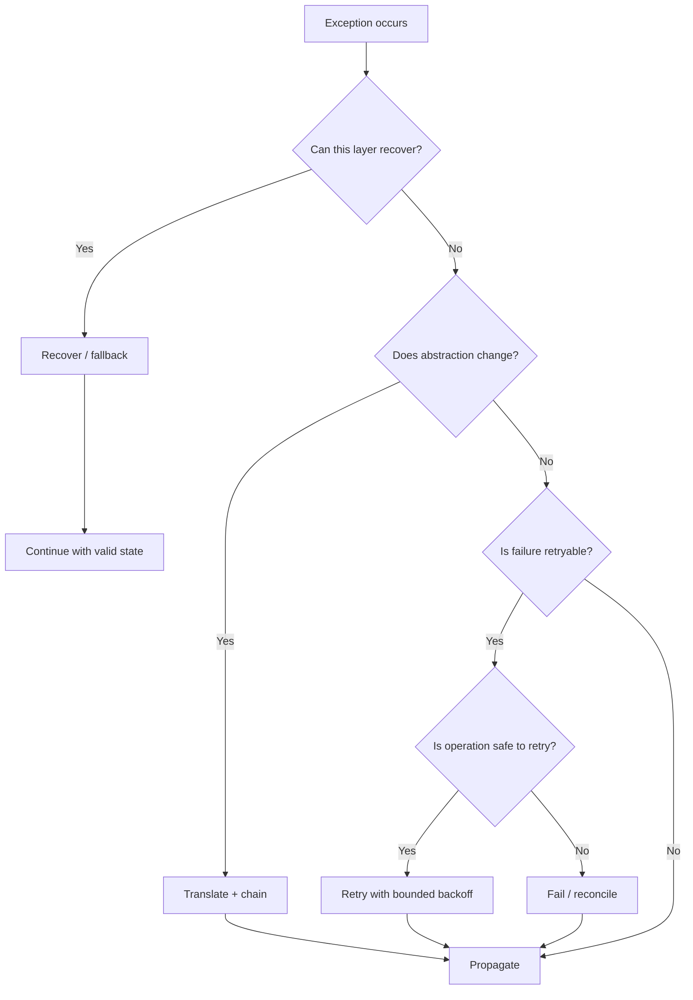
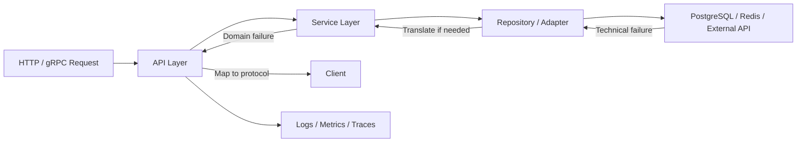

# 08- Exception Handling Patterns

## Overview

Exception handling in production Python is less about writing `try`/`except` blocks and more about deciding **where failures should be handled, translated, retried, propagated, logged, or deliberately ignored**.

A reliable backend normally follows a layered failure model:

```text
Infrastructure
     │
     ▼
Repository / Adapter
     │
     ▼
Service / Domain
     │
     ▼
API / Worker Boundary
     │
     ▼
External Error Contract
```

Each layer should make decisions appropriate to its responsibility.

A repository can translate a database-specific exception. A service can enforce a business invariant. An API boundary can convert an application exception into an HTTP response. A worker can decide whether a failure should be retried.

The strongest exception-handling designs are therefore **localized, explicit, observable, and aligned with recovery semantics**.

---

## Core Exception Handling Patterns

The most useful production patterns are:

| Pattern | Purpose |
|---|---|
| Catch specific exceptions | Handle known failure modes |
| Propagate | Let a higher layer make the decision |
| Translate | Convert implementation-specific failures |
| Enrich | Add structured context while preserving the cause |
| Recover | Restore a valid alternative state |
| Retry | Repeat a transient operation when safe |
| Suppress | Intentionally ignore a known, harmless failure |
| Roll back | Restore transactional consistency |
| Aggregate | Handle multiple concurrent failures |
| Fail fast | Stop when continuing would be unsafe |
| Boundary handling | Convert internal failures into external contracts |

These patterns should not be applied mechanically. The correct pattern depends on whether the operation is recoverable, retryable, idempotent, expected, or a programming error.

---

## Catch Specific Exceptions

Prefer narrow exception handling:

```python
try:
    order = repository.get(order_id)
except OrderNotFoundError:
    return None
```

Avoid:

```python
try:
    order = repository.get(order_id)
except Exception:
    return None
```

The broad version can hide:

- programming errors
- database outages
- serialization failures
- permission errors
- configuration problems
- unexpected bugs

A good handler should be able to answer:

> What failure am I handling, and what correct action can I take here?

If that answer is unclear, the exception probably should propagate.

---

## Exception Handler Ordering

Python evaluates exception handlers from top to bottom.

```python
try:
    operation()
except ConnectionError:
    handle_connection()
except OSError:
    handle_os_error()
```

This works because:

```text
ConnectionError
      │
      └── subclass of OSError
```

The more specific exception must appear before its broader parent.

Incorrect:

```python
try:
    operation()
except OSError:
    handle_os_error()
except ConnectionError:
    handle_connection()
```

The second handler is unreachable for `ConnectionError`.

---

## Grouping Related Exceptions

A tuple can handle multiple exception types with identical behavior:

```python
try:
    response = client.request()
except (ConnectionError, TimeoutError) as exc:
    logger.warning(
        "dependency request failed",
        exc_info=exc,
    )
    raise DependencyUnavailableError from exc
```

Use this when the recovery policy is genuinely identical.

Avoid grouping exceptions merely to reduce code.

If:

```python
ConnectionError
```

requires a retry but:

```python
AuthenticationError
```

requires immediate failure, they should have separate handlers.

---

## Propagate When the Current Layer Cannot Recover

A common mistake is handling an exception simply because it can be caught.

Instead:

```python
def create_order(order):
    repository.save(order)
```

If the repository failure cannot be resolved there, let it propagate.

The service or API boundary may have more context:

```python
try:
    service.create_order(order)
except OrderConflictError:
    return conflict_response()
```

The general principle is:

> Catch an exception only where the application has enough context to make a correct decision.

---

## Translate Infrastructure Exceptions

Infrastructure libraries expose implementation-specific exceptions.

```python
def save_order(order):
    try:
        database.insert(order)
    except DatabaseError as exc:
        raise OrderPersistenceError(order.id) from exc
```

The service now depends on:

```python
OrderPersistenceError
```

instead of a PostgreSQL driver exception.

This creates an abstraction boundary:

```text
PostgreSQL
    │
    ▼
DatabaseError
    │
    ▼
Repository
    │
    ▼
OrderPersistenceError
    │
    ▼
Service
```

Exception translation is useful when the semantic level changes.

---

## Enrich Exceptions

Sometimes the existing exception is useful, but additional context is needed.

```python
try:
    provider.charge(payment)
except TimeoutError as exc:
    raise PaymentProviderTimeoutError(
        payment_id=payment.id,
        provider="stripe",
    ) from exc
```

The new exception provides application context while retaining the underlying cause.

This is preferable to modifying or losing the original exception.

---

## Re-Raise the Current Exception

Inside an exception handler:

```python
try:
    operation()
except DatabaseError:
    logger.exception("database operation failed")
    raise
```

Bare `raise` re-raises the currently handled exception with its original traceback.

Prefer:

```python
raise
```

over:

```python
raise exc
```

when the intention is simply to propagate the same exception.

The latter can alter traceback presentation and communicates less clearly that no translation is intended.

---

## Translate With Exception Chaining

Use:

```python
try:
    database.save(order)
except DatabaseError as exc:
    raise OrderPersistenceError(
        order.id
    ) from exc
```

This establishes:

```text
OrderPersistenceError
        │
        └── __cause__
                │
                ▼
         DatabaseError
```

The higher layer gets a stable application exception while logs and diagnostics retain the underlying failure.

---

## Recover With a Fallback

Recovery is appropriate when an alternative behavior maintains a valid system state.

Example:

```python
def get_product(product_id: int) -> Product:
    try:
        return cache.get(product_id)
    except CacheUnavailableError:
        return repository.get(product_id)
```

The failure path is:

```text
Cache
  │
  ├── success → return cached data
  │
  └── failure
        │
        ▼
    PostgreSQL fallback
```

This is only safe if:

- the fallback is authoritative
- latency is acceptable
- capacity is available
- consistency requirements permit it

A fallback can otherwise turn one failure into a larger outage.

---

## Cache Failure vs Cache Miss

Do not confuse:

```text
Cache miss
```

with:

```text
Cache unavailable
```

For example:

```python
value = cache.get(key)

if value is None:
    return repository.get(key)
```

A cache miss is normal.

But:

```python
try:
    value = cache.get(key)
except RedisError:
    ...
```

represents an infrastructure failure.

These conditions can have very different operational implications.

---

## Fail Fast

Fail fast when continuing could produce incorrect or unsafe state.

```python
def process_payment(payment):
    if payment.amount <= 0:
        raise InvalidPaymentError(
            "payment amount must be positive"
        )
```

Do not attempt to recover from invalid domain state by silently modifying the input.

Failing fast is often preferable for:

- invalid configuration
- impossible state transitions
- corrupted invariants
- missing mandatory dependencies
- programming errors

---

## Do Not Hide Programming Errors

Avoid:

```python
try:
    result = calculate_total(order)
except Exception:
    result = 0
```

If `calculate_total()` contains a programming bug, the application now silently produces incorrect data.

This is more dangerous than failing.

Broad exception handlers should generally exist at controlled boundaries for:

- logging
- metrics
- cleanup
- request/task failure translation

They should not silently convert unknown failures into successful results.

---

## Suppress Harmless Exceptions

Python provides `contextlib.suppress` for deliberate suppression.

```python
from contextlib import suppress

with suppress(FileNotFoundError):
    path.unlink()
```

This is appropriate when the failure means the desired state already exists.

For example:

```text
Desired state:
file does not exist

Actual state:
file does not exist

Result:
success
```

Do not use suppression to hide operational failures.

---

## Cleanup Pattern

Resource cleanup belongs in `finally` or, preferably, a context manager.

```python
connection = acquire_connection()

try:
    process(connection)
finally:
    connection.close()
```

A context manager is usually cleaner:

```python
with connection_pool.connection() as connection:
    process(connection)
```

The key property is:

```text
success ──────┐
              ▼
           cleanup
              ▲
failure ──────┘
```

Cleanup must not depend on the operation succeeding.

---

## `try` / `except` / `else` / `finally`

Use `else` for code that should execute only when the protected operation succeeds.

```python
try:
    result = repository.get(order_id)
except DatabaseError as exc:
    raise OrderPersistenceError(order_id) from exc
else:
    return transform(result)
finally:
    metrics.increment("repository_operation")
```

This keeps the `try` block narrow.

A smaller `try` block reduces the chance of accidentally catching exceptions raised by unrelated code.

---

## Narrow `try` Blocks

Prefer:

```python
try:
    data = json.loads(payload)
except json.JSONDecodeError as exc:
    raise InvalidRequestError("invalid JSON") from exc

order = build_order(data)
validate_order(order)
```

over:

```python
try:
    data = json.loads(payload)
    order = build_order(data)
    validate_order(order)
except Exception:
    raise InvalidRequestError("invalid request")
```

The second version can incorrectly classify a bug in `build_order()` as invalid input.

A `try` block should contain only the operation whose failure you intend to handle.

---

## Validation Pattern

Expected validation failures should normally be represented explicitly.

```python
def validate_order(order: Order) -> None:
    if order.quantity <= 0:
        raise InvalidOrderError(
            "quantity must be greater than zero"
        )

    if not order.currency:
        raise InvalidOrderError(
            "currency is required"
        )
```

The API boundary can then map:

```text
InvalidOrderError
       │
       ▼
HTTP 400 / 422
```

Validation should not be mixed with infrastructure exception handling.

---

## Domain Rule Pattern

Business invariants are good candidates for domain exceptions.

```python
def cancel_order(order: Order) -> None:
    if order.status in {
        OrderStatus.SHIPPED,
        OrderStatus.DELIVERED,
    }:
        raise InvalidOrderStateError(
            order_id=order.id,
            state=order.status,
        )

    order.cancel()
```

The service expresses a business rule directly.

The API layer decides how that rule should be represented externally.

---

## Repository Pattern

Repositories should translate persistence-specific failures where appropriate:

```python
def create(order: Order) -> None:
    try:
        session.add(order)
        session.commit()
    except IntegrityError as exc:
        session.rollback()
        raise OrderPersistenceError(order.id) from exc
```

The important responsibilities are:

- identify the infrastructure failure
- restore transactional state when required
- translate the exception if useful
- preserve the original cause
- avoid leaking driver-specific details

---

## Transaction Rollback Pattern

Database errors can leave a transaction in a failed state.

A transaction-aware pattern should ensure rollback:

```python
try:
    with session.begin():
        repository.save(order)
except IntegrityError as exc:
    raise OrderConflictError(order.id) from exc
```

The exact behavior depends on the database abstraction being used, but the architectural rule is consistent:

> An exception must not leave a transaction in an unusable state.

Do not assume that catching an exception automatically restores database consistency.

---

## Unit of Work Pattern

A service may coordinate multiple operations:

```python
with unit_of_work() as uow:
    order = uow.orders.get(order_id)
    inventory.reserve(order)
    uow.orders.mark_reserved(order)
```

If a domain exception occurs:

```python
raise InsufficientInventoryError(order.id)
```

the unit-of-work boundary can roll back the transaction.

The exception describes the failure; the transaction mechanism controls atomicity.

---

## Retry Pattern

Retry only failures that are:

1. transient
2. retryable
3. safe to repeat
4. bounded by a timeout/deadline

Example:

```python
for attempt in range(3):
    try:
        return dependency.call()
    except TemporaryDependencyError:
        if attempt == 2:
            raise
        time.sleep(2 ** attempt)
```

Production systems should normally use a dedicated retry mechanism rather than hand-written loops scattered throughout business logic.

---

## Exponential Backoff

A typical retry schedule is:

```text
Attempt 1 → immediate
Attempt 2 → short delay
Attempt 3 → longer delay
Attempt 4 → longer delay
```

For example:

```python
delay = min(
    base_delay * (2 ** attempt),
    max_delay,
)
```

Add jitter in distributed systems to reduce synchronized retries:

```text
Backoff
   +
Jitter
   ↓
Reduced retry synchronization
```

---

## Retry Budget

Retries should have explicit limits.

Consider:

```text
API
 │
 ├── retry × 3
 │
 ▼
Service
 │
 ├── retry × 3
 │
 ▼
Database
```

The downstream dependency may receive up to:

```text
3 × 3 = 9 attempts
```

This can amplify an outage.

Prefer defining retry ownership clearly:

```text
Request boundary
      │
      ▼
One controlled retry policy
      │
      ▼
Dependency
```

or another deliberately designed strategy.

---

## Idempotency Before Retry

Never assume:

```text
timeout → operation failed
```

For a payment:

```text
Client
  │
  ▼
Payment Provider
  │
  ├── charge succeeds
  │
  └── response times out
```

The caller sees:

```text
TimeoutError
```

but the payment may have succeeded.

Use:

- idempotency keys
- request IDs
- operation IDs
- provider status checks
- durable state

before automatically retrying side-effecting operations.

---

## Timeout Pattern

Retries without timeouts are dangerous.

A robust dependency call has:

```text
deadline
   │
   ▼
attempt
   │
   ├── success
   ├── retryable failure
   └── timeout
```

Timeouts should be propagated through the call stack where possible.

For example:

```python
response = client.get(
    url,
    timeout=5.0,
)
```

A timeout should not allow a request to consume resources indefinitely.

---

## Retry vs Recovery

These are different patterns.

### Retry

Repeat the same operation:

```text
temporary failure
      │
      ▼
retry
```

### Recovery

Choose an alternative operation:

```text
cache failure
      │
      ▼
database fallback
```

Recovery may be preferable when retrying would only increase load.

---

## Circuit Breaker Pattern

For repeatedly failing dependencies, a circuit breaker can prevent continuous calls.

Conceptually:

```text
             failures
CLOSED ─────────────────► OPEN
  ▲                        │
  │                        │ cooldown
  │                        ▼
  └──── success ───── HALF-OPEN
```

Typical behavior:

| State | Behavior |
|---|---|
| Closed | Requests flow normally |
| Open | Requests fail fast |
| Half-open | Limited test requests determine recovery |

Circuit breakers are especially useful for microservice dependencies, but they must be configured carefully to avoid masking recovery or creating cascading failures.

---

## Bulkhead Pattern

Bulkheads isolate resources between workloads.

For example:

```text
API Service
├── Payment worker pool
├── Email worker pool
└── Reporting worker pool
```

If reporting becomes unhealthy, it should not consume every thread or task slot and prevent payments from processing.

Exception handling works together with bulkheads:

```text
dependency failure
       │
       ▼
exception
       │
       ▼
isolated resource pool
       │
       ▼
controlled degradation
```

---

## Partial Failure Pattern

Distributed systems often have partial success.

For example:

```text
Create order
   │
   ├── PostgreSQL → success
   ├── Inventory  → success
   └── Email      → failure
```

Do not automatically roll back successful operations unless the architecture supports atomic rollback.

Possible strategies include:

- transaction boundaries
- outbox pattern
- compensating actions
- durable retry queues
- idempotent consumers
- reconciliation jobs

Exception handling alone cannot create distributed atomicity.

---

## Exception Handling in FastAPI

A common architecture is:

```text
Endpoint
   │
   ▼
Service
   │
   ▼
Repository
```

The endpoint should avoid repetitive exception conversion:

```python
@app.post("/orders")
async def create_order(request: CreateOrderRequest):
    return await order_service.create(request)
```

Centralized handlers can map application exceptions:

```python
@app.exception_handler(OrderNotFoundError)
async def handle_order_not_found(request, exc):
    return JSONResponse(
        status_code=404,
        content={
            "error": {
                "code": "ORDER_NOT_FOUND",
                "message": "Order not found",
            }
        },
    )
```

This creates consistent behavior across endpoints.

---

## Exception Handling in Django

Django applications can similarly centralize translation through:

- middleware
- view-level handling
- service boundaries
- framework-specific exception handlers

A service can remain independent:

```python
raise OrderNotFoundError(order_id)
```

while the HTTP layer maps it to:

```text
404 Not Found
```

Avoid scattering transport-specific exception logic throughout domain code.

---

## Exception Handling in Background Workers

Workers need a different failure model from synchronous APIs.

For a Celery task:

```python
@app.task
def process_order(order_id: int):
    try:
        service.process(order_id)
    except RetryableDependencyError as exc:
        raise process_order.retry(
            exc=exc,
            countdown=10,
        )
```

The worker should distinguish:

```text
Transient failure
    → retry

Permanent business failure
    → reject / record failure

Unexpected programming error
    → fail + alert
```

Do not retry every exception.

---

## Kafka Consumer Pattern

A consumer may classify processing failures:

```python
try:
    process_event(event)
except RetryableDependencyError:
    raise
except DomainError:
    send_to_dead_letter(event)
```

The exact behavior depends on the Kafka client and consumer architecture.

Important considerations include:

- offset commits
- retry topics
- dead-letter topics
- poison messages
- idempotency
- ordering
- partition behavior

An exception handler should not accidentally acknowledge an event that was not successfully processed.

---

## Exception Handling at API Boundaries

A mature API typically separates:

```text
Expected application failure
        │
        ▼
Known HTTP response

Unexpected programming failure
        │
        ▼
HTTP 500 + operational alert
```

For example:

```text
OrderNotFoundError
      → 404

OrderConflictError
      → 409

ValidationError
      → 400/422

DependencyUnavailableError
      → 502/503

Unexpected exception
      → 500
```

Do not expose Python exception names or tracebacks as API contracts.

---

## Global Catch-All Handlers

A global handler can be useful:

```python
@app.exception_handler(Exception)
async def handle_unexpected_error(request, exc):
    logger.exception(
        "unhandled application error",
        exc_info=exc,
    )

    return JSONResponse(
        status_code=500,
        content={
            "error": {
                "code": "INTERNAL_ERROR",
                "message": "Internal server error",
            }
        },
    )
```

This is a **boundary pattern**, not a replacement for local exception handling.

The handler should:

- log the failure
- emit metrics/traces
- return a safe response
- avoid exposing internal details

It should not silently recover from unknown errors.

---

## Observability Pattern

Exception handling should integrate with observability.

For every meaningful failure, consider:

```text
Exception
   │
   ├── structured log
   ├── metric
   ├── trace/span status
   ├── request ID
   └── dependency metadata
```

Useful metrics include:

- error rate
- error rate by exception type
- retry count
- retry exhaustion
- timeout count
- dependency failure rate
- dead-letter count
- fallback usage

Avoid high-cardinality metric labels such as arbitrary exception messages.

---

## Logging Without Duplication

A common anti-pattern:

```text
Repository logs
Service logs
Controller logs
Global handler logs
```

The same exception can generate four error records.

Prefer:

```text
Repository
   └── translate / propagate

Service
   └── propagate / recover

Boundary
   └── primary error log
```

Lower layers can emit diagnostic logs when they add unique operational information, but error ownership should be deliberate.

---

## Security Pattern

Never expose raw exceptions:

```python
return {
    "error": str(exc),
    "traceback": traceback.format_exc(),
}
```

This can leak:

- SQL statements
- filesystem paths
- service URLs
- credentials
- tokens
- internal architecture
- user data

Instead:

```python
return {
    "error": {
        "code": "INTERNAL_ERROR",
        "message": "Internal server error",
    }
}
```

Detailed diagnostics belong in controlled observability systems.

---

## Exception Handling and Authentication

Authentication failures should not expose excessive information.

Avoid distinguishing publicly between:

```text
user does not exist
```

and:

```text
password is incorrect
```

when doing so creates account-enumeration risk.

The application can retain detailed internal diagnostics while exposing a stable external error.

---

## Exception Handling and Authorization

Authorization should be evaluated using explicit policy.

```python
if not policy.can_update(user, order):
    raise PermissionDeniedError()
```

The exception represents the result of the authorization decision.

Do not use exception handling itself as a substitute for:

- authentication
- authorization
- resource ownership checks
- policy enforcement

---

## Exception Handling and Concurrency

Concurrent execution introduces additional failure patterns.

For threads:

```python
future = executor.submit(process_order, order_id)

try:
    future.result()
except OrderError:
    ...
```

For `asyncio`:

```python
try:
    result = await process_order(order_id)
except OrderError:
    ...
```

When multiple operations execute concurrently, one failure may coexist with successful work.

The design must define whether:

- one failure cancels all work
- failures are collected
- partial results are acceptable
- failed tasks are retried
- cancellation propagates

---

## Exception Groups

Python 3.11+ supports `ExceptionGroup` for representing multiple failures.

For example, concurrent operations may produce:

```text
Task A → TimeoutError
Task B → ValueError
Task C → ConnectionError
```

These can be represented together:

```python
raise ExceptionGroup(
    "batch processing failed",
    [
        TimeoutError("service timeout"),
        ValueError("invalid record"),
        ConnectionError("dependency unavailable"),
    ],
)
```

Python provides `except*` for handling matching portions:

```python
try:
    raise ExceptionGroup(
        "batch failed",
        [
            TimeoutError("timeout"),
            ValueError("invalid input"),
        ],
    )
except* TimeoutError:
    handle_timeout()
except* ValueError:
    handle_invalid_input()
```

This is especially relevant to concurrent and batch-processing systems.

---

## Expected Failure vs Exceptional Failure

Not every negative outcome should be represented by an exception.

For example:

```python
user = repository.find(user_id)

if user is None:
    return None
```

may be appropriate if "not found" is a normal expected result for the internal API.

A different operation may reasonably use:

```python
raise UserNotFoundError(user_id)
```

when absence violates the operation's contract.

The design question is:

> Is this an expected result that callers routinely branch on, or an exceptional condition that should propagate through the failure model?

---

## Result Objects vs Exceptions

For some APIs, explicit result types can make expected outcomes clearer.

Conceptually:

```text
Expected:
    Result[T, E]

Exceptional:
    raise Exception
```

Use exceptions when:

- the failure is exceptional
- propagation across layers is useful
- normal control flow should remain uncluttered

Use explicit results when:

- failure is a routine outcome
- callers frequently branch on it
- exceptions would dominate normal execution

Do not use exceptions as a substitute for ordinary business branching.

---

## Error Translation Matrix

A production application can define an explicit policy:

| Failure | Internal action | External behavior |
|---|---|---|
| Validation failure | Reject | 400/422 |
| Not found | Propagate to boundary | 404 |
| Conflict | Propagate to boundary | 409 |
| Authentication failure | Reject | 401 |
| Authorization failure | Reject | 403 |
| Dependency timeout | Retry if safe | 502/503 |
| Dependency unavailable | Fallback or fail | 502/503 |
| Programming error | Log + fail | 500 |
| Data corruption | Fail fast + alert | 500 |
| Rate limit | Backoff | 429 |

The exact mapping depends on the application's API contract.

---

## Common Anti-Patterns

### Bare `except`

Avoid:

```python
try:
    operation()
except:
    pass
```

This can catch control-flow exceptions such as:

- `KeyboardInterrupt`
- `SystemExit`
- `GeneratorExit`

Normally catch `Exception` or, preferably, a specific subclass.

---

### Broad Catch and Continue

Avoid:

```python
try:
    process()
except Exception:
    logger.exception("processing failed")

return "success"
```

This reports success even though the operation failed.

---

### Logging and Raising the Same Error Everywhere

Avoid:

```python
try:
    operation()
except Exception:
    logger.exception("failed")
    raise
```

at every layer.

Centralize primary failure logging unless a lower layer has unique operational information.

---

### Catching Too Much

Avoid:

```python
try:
    parse()
    validate()
    save()
    publish()
except Exception:
    raise ApplicationError("operation failed")
```

This can turn unrelated failures into the same category.

Use narrow `try` blocks.

---

### Catching Too Early

Avoid:

```python
def repository_call():
    try:
        return database.query()
    except DatabaseError:
        return None
```

if `None` makes the service unable to distinguish:

```text
no record
```

from:

```text
database failure
```

Preserve important failure semantics.

---

### Retry Storms

Avoid independent retry loops at every layer.

```text
API × 3
  ↓
Service × 3
  ↓
Repository × 3
```

This can produce:

```text
3 × 3 × 3 = 27
```

attempts against a failing dependency.

Define retry ownership and budgets explicitly.

---

## Common Production Pitfalls

| Pitfall | Why it happens | Prevention |
|---|---|---|
| Swallowed exception | Broad handler used as safety net | Catch specific failures |
| Incorrect success response | Error logged but execution continues | Return/raise deliberately |
| Retry amplification | Every layer retries | Centralize retry policy |
| Duplicate logs | Every layer logs | Define logging ownership |
| Sensitive error leakage | Raw exception serialized | Use safe external errors |
| Lost database transaction state | Exception caught without rollback | Use transaction boundaries |
| Cache outage becomes DB outage | Unlimited fallback | Bound fallback capacity |
| Timeout without deadline | Operation waits indefinitely | Use explicit timeouts |
| Retrying non-idempotent operation | Timeout mistaken for failure | Use idempotency |
| Poison message loop | Consumer retries permanently bad event | Use DLQ/retry classification |
| Hidden programming bug | `except Exception` returns fallback | Fail fast on unexpected errors |
| Overly deep exception hierarchy | Every failure gets a class | Model only useful distinctions |

---

## Testing Exception Handling

Exception handling should be tested as behavior, not merely as line coverage.

### Test Specific Exceptions

```python
def test_missing_order_raises():
    with pytest.raises(OrderNotFoundError):
        service.get_order(123)
```

### Test Translation

```python
def test_database_error_is_translated():
    with pytest.raises(OrderPersistenceError) as exc_info:
        repository.save(order)

    assert isinstance(
        exc_info.value.__cause__,
        DatabaseError,
    )
```

### Test Recovery

```python
def test_cache_failure_falls_back_to_database():
    cache.get.side_effect = CacheUnavailableError()

    result = service.get_product(123)

    repository.get.assert_called_once_with(123)
    assert result is not None
```

### Test Retry Limits

```python
def test_retry_stops_after_limit():
    client.call.side_effect = TemporaryDependencyError()

    with pytest.raises(TemporaryDependencyError):
        service.call_dependency()

    assert client.call.call_count == 3
```

Tests should verify that failures are:

- classified correctly
- translated correctly
- retried only when appropriate
- not swallowed
- mapped to correct external contracts

---

## Error Handling Decision Tree

A useful decision process is:



This is more useful than memorizing isolated `try`/`except` patterns.

---

## Production Architecture

A robust Python backend can structure exception handling like this:



The responsibilities are intentionally separated:

| Layer | Primary responsibility |
|---|---|
| Repository | Technical failure translation |
| Service | Domain recovery and business rules |
| API | External error mapping |
| Worker | Retry and delivery policy |
| Observability | Diagnostics and alerting |
| Infrastructure | Timeouts, connection management, resilience mechanisms |

---

## Senior Engineering Heuristics

### Handle at the Highest Layer With Enough Context

Do not handle an error merely because it is available.

The correct question is:

> Which layer knows what the correct recovery action is?

### Translate Only When Meaning Changes

If the exception already communicates the correct semantics, propagate it.

If the implementation detail should not leak, translate it.

### Separate Failure Classification From Recovery

An exception type can tell you:

```text
what failed
```

but does not necessarily tell you:

```text
what to do next
```

Recovery requires context.

### Treat Retries as Load Multipliers

Every retry consumes:

- CPU
- network
- connection capacity
- dependency capacity
- latency budget

Retries are resilience mechanisms, but uncontrolled retries are outage amplifiers.

### Preserve Causality

When translating:

```python
raise ApplicationError(...) from exc
```

Do not sacrifice diagnostic information for abstraction.

### Keep External Errors Stable

Internal exception hierarchies can evolve.

External error codes and protocol behavior should change only through deliberate API versioning and compatibility decisions.

---

## Production Checklist

Before shipping exception-handling code, verify:

- Exception handlers catch the narrowest practical types.
- `try` blocks contain only operations whose failures are being handled.
- Expected results are not unnecessarily modeled as exceptions.
- Infrastructure failures are translated only when the abstraction changes.
- Original causes are preserved when useful.
- `raise` is used for simple propagation.
- `from None` is used deliberately.
- Recovery paths maintain valid application state.
- Database transactions are rolled back correctly.
- Retries have explicit limits and timeouts.
- Retryable operations are idempotent or otherwise safe to repeat.
- Retry ownership is clearly defined.
- Fallback capacity is bounded.
- Circuit breakers or bulkheads are considered for unstable dependencies.
- API responses expose stable, sanitized error contracts.
- Sensitive information is excluded from logs and responses.
- Unexpected programming errors are not silently swallowed.
- Worker failures have explicit retry/DLQ semantics.
- Kafka consumers do not acknowledge failed processing accidentally.
- Async cancellation is not unintentionally swallowed or translated.
- Exception logging is not duplicated across every layer.
- Metrics and traces capture meaningful failure categories.
- Tests cover propagation, translation, recovery, retries, and external mappings.

## Key Takeaways

- Effective exception handling is primarily about deciding where to **handle, propagate, translate, recover, retry, or fail fast**, not about adding more `try`/`except` blocks.
- Catch specific exceptions in narrow `try` blocks and handle failures only where the current layer has enough context to make a correct decision.
- Translate exceptions when crossing architectural boundaries, preserve causes, and keep internal exception types separate from HTTP, gRPC, Kafka, and worker contracts.
- Retries require bounded timeouts, backoff, explicit ownership, and safe/idempotent operations; uncontrolled retries can amplify outages.
- Production exception handling must integrate with transactions, concurrency, observability, security, graceful degradation, and distributed-system failure semantics.