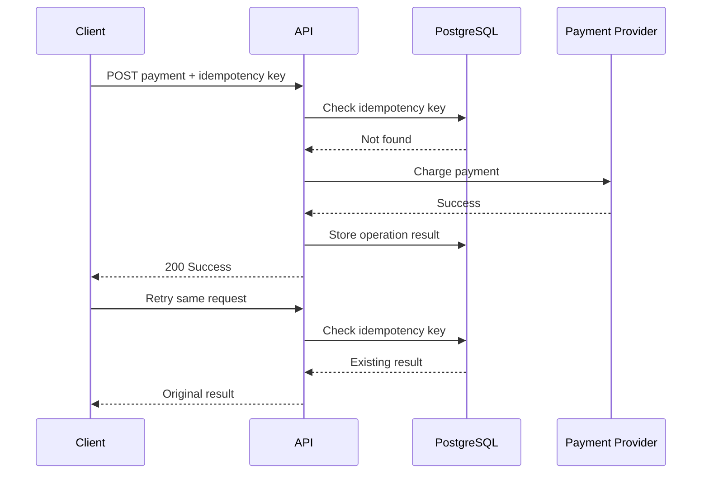
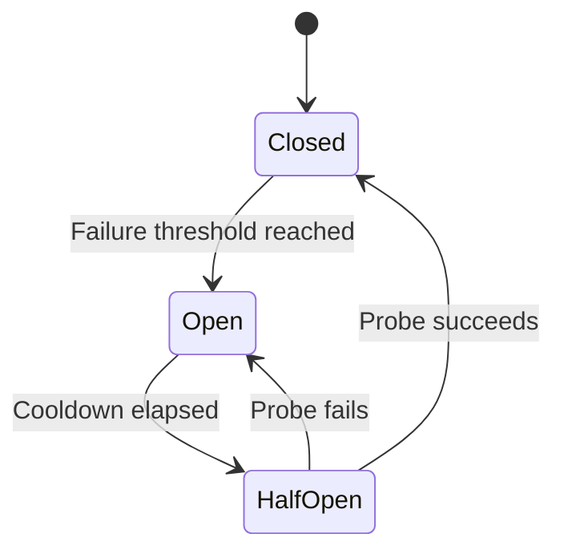
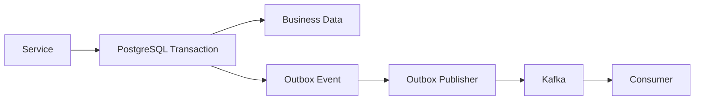
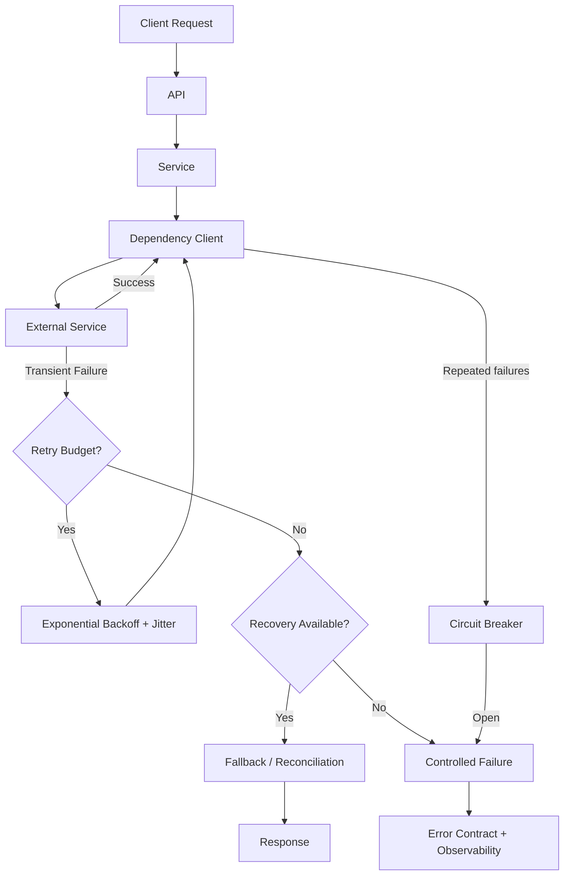

# 09- Retry and Recovery

## Overview

Retries and recovery are resilience mechanisms for dealing with failures that may be temporary, recoverable, or safely repeatable.

In backend systems, failures are normal:

- network connections time out
- databases temporarily reject connections
- Redis becomes unavailable
- downstream APIs return `503`
- Kafka consumers fail during processing
- Kubernetes pods restart
- AWS services experience transient errors
- distributed requests exceed deadlines

A retry attempts the same operation again. Recovery changes the strategy to restore useful behavior without necessarily repeating the failed operation.

```text
Operation
   │
   ▼
Failure
   │
   ├── Permanent ──────► Fail
   │
   ├── Transient ──────► Retry
   │
   ├── Recoverable ────► Fallback / Recovery
   │
   └── Ambiguous ──────► Reconcile / Check State
```

The difficult engineering problem is not implementing a loop. It is determining:

> **Should this operation be retried, how many times, after what delay, and with what guarantees?**

---

## Retry vs Recovery

These concepts are related but different.

### Retry

Retry repeats an operation after a failure.

```text
Request
   │
   ▼
Attempt 1 ── failure
   │
   ▼
Attempt 2 ── failure
   │
   ▼
Attempt 3 ── success
```

Typical retry candidates:

- connection resets
- temporary network failures
- service unavailability
- throttling
- transient database errors

### Recovery

Recovery chooses an alternative path.

```text
Redis
  │
  └── unavailable
          │
          ▼
      PostgreSQL
```

Examples:

- cache → database
- primary service → read replica
- failed message → retry queue
- failed event → dead-letter queue
- partial workflow → compensating action

Retry asks:

> Can I safely try the same thing again?

Recovery asks:

> How can I restore useful behavior despite this failure?

---

## Why Retries Are Necessary

Distributed systems cannot assume that every failure is permanent.

Consider:

```text
Application
    │
    │ HTTP
    ▼
Payment Service
```

A temporary network interruption can produce:

```python
TimeoutError
```

The payment service may still be healthy.

Without retry:

```text
temporary failure → request fails
```

With an appropriate retry policy:

```text
temporary failure
       │
       ▼
bounded retry
       │
       ▼
success
```

Retries improve availability when failures are genuinely transient.

They also introduce additional load, latency, and side effects, so they must be treated as a controlled resilience mechanism rather than a generic error-handling technique.

---

## Failure Classification

Before retrying, classify the failure.

| Failure type | Typical action |
|---|---|
| Validation error | Fail immediately |
| Authentication failure | Fail immediately |
| Authorization failure | Fail immediately |
| Resource not found | Fail or fallback |
| Conflict | Reconcile or fail |
| Connection reset | Retry |
| Temporary timeout | Retry if safe |
| HTTP 429 | Retry after rate-limit guidance |
| HTTP 500 | Potentially retry |
| HTTP 502 | Potentially retry |
| HTTP 503 | Potentially retry |
| HTTP 504 | Potentially retry |
| Malformed response | Usually fail |
| Data corruption | Fail and alert |
| Programming error | Fail and fix |
| Unknown exception | Usually do not blindly retry |

The classification depends on the dependency contract.

A `500` does not automatically mean retrying is safe.

---

## Transient vs Permanent Failures

### Transient Failure

A transient failure may disappear without changing application state.

Examples:

```text
Connection reset
Temporary DNS failure
Service unavailable
Rate limiting
Temporary database overload
```

Retry may be appropriate.

### Permanent Failure

A permanent failure is unlikely to succeed without changing the request or state.

Examples:

```text
Invalid credentials
Malformed request
Missing required field
Unsupported operation
Permission denied
Invalid business state
```

Retrying wastes resources.

---

## Unknown Failure vs Ambiguous Outcome

The most dangerous category is not always "failure."

It is:

> **The client does not know whether the operation succeeded.**

Example:

```text
Client
  │
  │ POST /payments
  ▼
Payment Service
  │
  ├── payment succeeds
  │
  └── response lost
          │
          ▼
       timeout
```

The client sees:

```python
TimeoutError
```

but the server may have successfully charged the customer.

Blindly retrying can create a duplicate payment.

The correct strategy may be:

```text
timeout
  │
  ▼
check operation status
  │
  ├── succeeded → return success
  ├── failed    → retry if safe
  └── unknown   → reconcile
```

This distinction is fundamental in distributed systems.

---

## Idempotency

Retries are safest when operations are idempotent.

An operation is idempotent when repeating it produces the same intended final state.

For example:

```http
PUT /users/123/profile
```

with the same payload can generally be repeated safely.

A payment operation is different:

```http
POST /payments
```

Repeating it may create multiple charges.

Use an idempotency key:

```http
Idempotency-Key: 7f2d2e1e-...
```

The server can persist:

```text
idempotency_key
request_hash
operation_status
response
```

and return the original result for repeated requests.

---

## Idempotency Flow



The idempotency record must be durable enough to survive application restarts.

---

## Retry Preconditions

A production retry should normally satisfy four conditions:

```text
Transient
    +
Retryable
    +
Safe to repeat
    +
Within deadline
```

If any condition is false, retrying may be harmful.

A useful decision table:

| Question | If yes | If no |
|---|---|---|
| Is the failure transient? | Continue | Fail |
| Is the dependency operation retryable? | Continue | Fail |
| Is the operation idempotent/safe? | Continue | Reconcile or fail |
| Is there retry budget remaining? | Retry | Fail |
| Is the request deadline still valid? | Retry | Fail |

---

## Exponential Backoff

Immediate retries can overload an already unhealthy dependency.

Bad:

```text
failure → retry immediately
failure → retry immediately
failure → retry immediately
```

Better:

```text
failure
   │
   ▼
100 ms
   │
   ▼
200 ms
   │
   ▼
400 ms
   │
   ▼
800 ms
```

A typical exponential backoff formula is:

```text
delay = base × 2^attempt
```

Bound it with a maximum:

```text
delay = min(base × 2^attempt, max_delay)
```

Example:

```python
def exponential_backoff(
    attempt: int,
    base_delay: float = 0.5,
    max_delay: float = 10.0,
) -> float:
    return min(
        base_delay * (2 ** attempt),
        max_delay,
    )
```

---

## Jitter

Multiple clients can otherwise synchronize their retries.

Without jitter:

```text
Client A ── retry at 1s ── retry at 2s ── retry at 4s
Client B ── retry at 1s ── retry at 2s ── retry at 4s
Client C ── retry at 1s ── retry at 2s ── retry at 4s
```

This can produce a retry storm.

Jitter randomizes the delay:

```python
import random


def backoff_with_jitter(
    attempt: int,
    base_delay: float = 0.5,
    max_delay: float = 10.0,
) -> float:
    exponential = min(
        base_delay * (2 ** attempt),
        max_delay,
    )

    return random.uniform(0, exponential)
```

Jitter is particularly valuable when many workers or service instances share the same dependency.

---

## Retry Strategies

Common strategies include:

| Strategy | Behavior | Typical use |
|---|---|---|
| Fixed delay | Same delay each time | Simple internal operations |
| Linear backoff | Delay increases linearly | Controlled retry frequency |
| Exponential backoff | Delay grows rapidly | Network/distributed failures |
| Exponential + jitter | Exponential with randomness | Distributed services |
| Server-directed | Honor `Retry-After` | HTTP 429/503 |
| Deadline-based | Retry until deadline | Request-scoped operations |
| Attempt-based | Maximum attempts | Background jobs |

For distributed systems, exponential backoff with jitter is a strong default.

---

## Retry Budget

Retries consume resources.

Every retry may consume:

- CPU
- memory
- network bandwidth
- database connections
- worker slots
- API quota
- request latency

Define a retry budget.

For example:

```text
Maximum attempts: 3
Maximum elapsed time: 5 seconds
Maximum backoff: 2 seconds
```

Do not rely solely on:

```python
for _ in range(100):
    ...
```

A request can exhaust its latency budget long before the attempt count is reached.

---

## Request Deadlines

A retry should respect the remaining request deadline.

Consider:

```text
API timeout = 5 seconds

Attempt 1 = 2 seconds
Backoff    = 1 second
Attempt 2 = 2 seconds
```

The request has already consumed approximately:

```text
2 + 1 + 2 = 5 seconds
```

Another retry is pointless.

A production design should propagate a deadline through dependency calls.

```text
Incoming request
      │
      ▼
5s deadline
      │
      ├── database: 1s
      ├── Redis: 500ms
      └── external API: remaining budget
```

---

## Retry Amplification

Retries multiply load across service layers.

Consider:

```text
API
 │
 ├── 3 attempts
 ▼
Service
 │
 ├── 3 attempts
 ▼
Repository
 │
 └── 3 attempts
```

Worst-case attempts can become:

```text
3 × 3 × 3 = 27
```

This is retry amplification.

During an outage, it can transform:

```text
dependency degradation
```

into:

```text
dependency overload
```

Prefer clearly defined retry ownership.

---

## Where Should Retries Live?

There is no universal answer.

A common architecture is:

```text
API
 │
 ▼
Service
 │
 ▼
Dependency Client
 │
 ▼
External Service
```

The dependency client may own transport-level retries:

```text
connection reset
timeout
temporary HTTP failure
```

while the service owns semantic recovery:

```text
payment status reconciliation
fallback
compensation
```

This separation prevents business logic from being coupled to low-level transport behavior.

---

## Retry at the HTTP Client Layer

Transport-level retry logic can be centralized:

```python
class DependencyClient:
    def __init__(self, http_client):
        self.http_client = http_client

    async def get_order(self, order_id: int):
        return await self.http_client.get(
            f"/orders/{order_id}",
            timeout=2.0,
        )
```

A configured HTTP client or resilience middleware can then apply:

- retryable status codes
- backoff
- jitter
- connection timeout
- read timeout
- total deadline

This keeps retry policy out of individual service methods.

---

## HTTP Retry Semantics

HTTP methods differ in retry safety.

| Method | Typical semantics | Automatic retry |
|---|---|---|
| `GET` | Read | Usually safe |
| `HEAD` | Read metadata | Usually safe |
| `PUT` | Replace state | Usually safe if correctly implemented |
| `DELETE` | Delete state | Often repeatable |
| `POST` | Create/action | Usually requires idempotency |
| `PATCH` | Partial update | Depends on operation |

These are general semantics, not guarantees.

A `POST` with an idempotency key can be safely retried.

A `PUT` that triggers hidden side effects may not be safely retryable.

---

## HTTP `Retry-After`

Servers can explicitly request delayed retries:

```http
HTTP/1.1 429 Too Many Requests
Retry-After: 10
```

Clients should respect server-provided retry guidance when appropriate.

Do not ignore rate limiting and repeatedly retry immediately.

A well-behaved client reduces pressure on the dependency.

---

## Database Retry

Database retries require more care than network retries.

Potentially transient failures include:

- connection interruption
- serialization failures
- deadlocks
- temporary resource exhaustion

But a transaction may have already partially executed before the client receives an error.

Use transaction boundaries:

```python
def update_order(order_id: int) -> None:
    with session.begin():
        order = repository.get(order_id)
        order.status = "processed"
```

If the transaction must be retried, retry the **whole transaction**, not arbitrary individual SQL statements.

Conceptually:

```text
BEGIN
  │
  ├── UPDATE
  ├── INSERT
  └── COMMIT
       │
       └── serialization failure
              │
              ▼
           ROLLBACK
              │
              ▼
        retry transaction
```

---

## PostgreSQL and Serialization Failures

Under PostgreSQL transaction isolation, serialization failures can require the transaction to be retried.

The correct model is:

```text
transaction attempt
       │
       ├── success → commit
       │
       └── serialization failure
                │
                ▼
             rollback
                │
                ▼
          retry transaction
```

Do not simply retry the final SQL statement without reconstructing the transaction context.

---

## Redis Retry

Redis operations may fail because of:

- connection problems
- timeouts
- failover
- temporary unavailability

A cache read is usually safer to retry than a state-changing operation.

For example:

```python
try:
    value = redis.get(key)
except TimeoutError:
    value = None
```

But converting every Redis failure into a cache miss is not always correct.

If Redis stores critical application state rather than optional cache data, silently treating an outage as a miss may cause incorrect behavior.

---

## Cache Recovery

A cache-aside architecture may use:

```text
Request
  │
  ▼
Redis
  │
  ├── hit ───────► return
  │
  ├── miss ──────► PostgreSQL
  │
  └── unavailable
           │
           ▼
       PostgreSQL
```

This is graceful degradation.

However, protect the database from a cache outage.

If millions of requests simultaneously fall back to PostgreSQL, the database can become overloaded.

---

## Cache Stampede

A cache outage or mass expiration can create:

```text
Cache miss
   │
   ├── Request A → DB
   ├── Request B → DB
   ├── Request C → DB
   ├── Request D → DB
   └── ...
```

Mitigation techniques include:

- request coalescing
- single-flight
- randomized TTLs
- stale-while-revalidate
- bounded fallback
- rate limiting
- circuit breakers

Retries alone do not solve cache stampedes.

---

## Recovery With Fallback

A fallback should satisfy explicit correctness requirements.

```python
async def get_product(product_id: int):
    try:
        return await cache.get(product_id)
    except CacheUnavailableError:
        return await repository.get(product_id)
```

Before implementing this, verify:

- database capacity is sufficient
- stale data is acceptable if applicable
- fallback latency is acceptable
- fallback itself has a timeout
- fallback does not recursively retry indefinitely

A fallback without capacity planning can turn graceful degradation into cascading failure.

---

## Circuit Breaker

A circuit breaker prevents repeated calls to a failing dependency.



### Closed

Requests flow normally.

### Open

Requests fail fast without calling the dependency.

### Half-open

A limited number of requests test whether the dependency has recovered.

Circuit breakers are useful when a dependency is repeatedly failing and continuing to call it would waste resources.

---

## Bulkhead Isolation

Retry and recovery policies should consider resource isolation.

```text
Service
├── Payment workers
├── Email workers
└── Reporting workers
```

If email processing repeatedly fails, it should not consume every worker.

Bulkheads limit failure propagation through:

- separate worker pools
- connection pools
- concurrency limits
- queues
- rate limits

Retries work better when resource consumption is bounded.

---

## Celery Retry

Background jobs can use task-level retry semantics:

```python
from celery import shared_task


@shared_task(
    autoretry_for=(TemporaryDependencyError,),
    retry_backoff=True,
    retry_jitter=True,
    max_retries=5,
)
def process_order(order_id: int) -> None:
    process_order_service(order_id)
```

The task should distinguish:

```text
TemporaryDependencyError
    → retry

PermanentDomainError
    → fail permanently

UnexpectedError
    → fail + alert
```

Be careful with `autoretry_for=(Exception,)`.

That can turn programming bugs and permanent failures into repeated background work.

---

## Celery Retry and Idempotency

A retried task can execute more than once.

```text
Worker
  │
  ├── executes task
  ├── external operation succeeds
  └── worker crashes before acknowledgment
          │
          ▼
       task retry
```

The external operation may happen twice.

Use:

- idempotency keys
- unique constraints
- durable task state
- transactional outbox
- deduplication

for side-effecting tasks.

---

## Kafka Retry and Dead-Letter Queues

Kafka consumers often separate failures into:

```text
Event
 │
 ▼
Consumer
 │
 ├── transient → retry topic
 │
 ├── permanent → dead-letter topic
 │
 └── success → commit offset
```

A retry topic can provide delayed processing.

A dead-letter topic prevents permanently invalid messages from blocking normal processing indefinitely.

The consumer must define when an offset is committed relative to successful processing.

---

## Dead-Letter Queue

A dead-letter queue or topic stores messages that cannot be successfully processed after the allowed recovery attempts.

Typical metadata:

```json
{
  "event_id": "evt-123",
  "failure_code": "INVALID_ORDER_STATE",
  "attempts": 5,
  "failed_at": "2026-09-06T12:00:00Z"
}
```

A DLQ should be observable and operationally actionable.

It is not a trash can.

Operations should define:

- retention
- alerting
- replay procedures
- ownership
- security
- remediation workflow

---

## Poison Messages

A poison message is an event that repeatedly fails processing.

Without a DLQ:

```text
message
  ↓
fail
  ↓
retry
  ↓
fail
  ↓
retry
  ↓
...
```

This can block consumer progress.

Classify failures:

```text
Transient
   → retry

Permanent
   → DLQ

Unknown
   → controlled failure + investigation
```

---

## Compensation and Recovery

Some workflows cannot be rolled back atomically.

Example:

```text
Order created
    │
    ▼
Payment charged
    │
    ▼
Inventory reservation
    │
    └── failure
```

You may need a compensating action:

```text
Inventory failure
    │
    ▼
Refund payment
```

This is common in saga-style distributed workflows.

The compensation itself must be:

- idempotent
- observable
- retryable
- durable

Exception handling only detects the failure; the workflow architecture determines how the system recovers.

---

## Recovery State Machines

For complex workflows, explicit state is safer than implicit exception-driven recovery.

Example:

```text
PENDING
   │
   ▼
PAYMENT_PROCESSING
   │
   ├── success ──► PAID
   │
   ├── retryable ─► PAYMENT_RETRY
   │                  │
   │                  ▼
   │             PAYMENT_PROCESSING
   │
   └── permanent ─► PAYMENT_FAILED
```

Persisting workflow state allows recovery after:

- process crashes
- pod restarts
- deployments
- network failures
- worker reassignment

---

## Graceful Degradation

Graceful degradation means reducing functionality while preserving core service behavior.

Example:

```text
Recommendation Service unavailable
             │
             ▼
Return products without recommendations
```

This is preferable to making the entire product page fail when recommendations are non-critical.

Classify dependencies:

| Dependency | Failure strategy |
|---|---|
| Payment | Usually fail safely |
| Authentication | Usually fail closed |
| Recommendations | Fallback/degrade |
| Analytics | Buffer/drop asynchronously |
| Cache | Database fallback if capacity allows |
| Email | Queue for later |
| Critical database | Fail request |

Not every dependency deserves the same recovery policy.

---

## Fail Open vs Fail Closed

Security-sensitive systems often need explicit fail behavior.

### Fail Closed

```text
Authorization service unavailable
        │
        ▼
Deny access
```

This is appropriate when granting access during uncertainty would be unsafe.

### Fail Open

```text
Analytics unavailable
        │
        ▼
Continue request
```

This can be appropriate for non-critical observability or secondary functionality.

The correct choice depends on the consequence of an incorrect decision.

---

## Recovery and Transactions

Retries and recovery must respect transaction boundaries.

Incorrect:

```text
BEGIN
  update A
  call external service
  failure
  retry only external service
COMMIT
```

The database state and external system state may diverge.

A better architecture may use:

```text
Database transaction
        │
        ▼
Outbox event
        │
        ▼
Reliable asynchronous delivery
        │
        ▼
External side effect
```

This separates local atomicity from distributed delivery.

---

## Transactional Outbox

The transactional outbox pattern is useful when a database change and event publication must remain consistent.



The transaction commits both:

```text
business state
+
outbox event
```

A publisher can retry event delivery independently.

This reduces the risk of:

```text
database committed
event lost
```

---

## Recovery After Process Restart

In-memory retry state is fragile.

Avoid relying on:

```python
attempts = {}
```

for durable workflows.

A process restart loses the state.

For background processing, persist important recovery state in:

- PostgreSQL
- Redis when appropriate
- Kafka metadata/topics
- durable task queues
- workflow systems

The correct choice depends on consistency and durability requirements.

---

## Retry State and Memory

Large retry queues or exception objects can consume significant memory.

Avoid retaining:

```python
exceptions = []
```

for large numbers of failures.

Use bounded queues and external durable storage for long-lived recovery workflows.

Exception tracebacks can retain references to stack frames and objects, so retaining exception objects for long periods can unnecessarily extend object lifetimes.

---

## Async Retry

For `asyncio`, retry delays should not block the event loop.

Use:

```python
await asyncio.sleep(delay)
```

not:

```python
time.sleep(delay)
```

Example:

```python
import asyncio


async def call_with_retry(client):
    for attempt in range(3):
        try:
            return await client.call()
        except TemporaryDependencyError:
            if attempt == 2:
                raise

            await asyncio.sleep(
                min(0.5 * (2 ** attempt), 5.0)
            )
```

The sleep yields control to other tasks.

---

## Cancellation

Retry logic must respect cancellation.

An async task that has been cancelled should not continue retrying indefinitely.

Conceptually:

```text
operation
   │
   ├── success → return
   ├── retryable → retry
   └── cancellation → propagate cancellation
```

Do not broadly translate every exception into a retryable application error.

Cancellation is a control-flow mechanism that often needs to propagate immediately.

---

## Timeout + Retry Interaction

Timeouts and retries multiply latency.

Suppose:

```text
Attempt timeout = 2s
Retries = 3
Backoff = 1s + 2s
```

Worst-case elapsed time can approach:

```text
2 + 1 + 2 + 2 = 7 seconds
```

This may violate a 5-second API deadline.

Always reason about the complete latency budget:

```text
Total latency
=
attempt durations
+
backoff delays
+
queueing
+
serialization
+
network overhead
```

---

## Kubernetes Considerations

Kubernetes can restart unhealthy pods, but application-level retries still matter.

Different mechanisms solve different problems:

```text
Application retry
    → transient dependency failure

Kubernetes restart
    → unhealthy process/container

Readiness probe
    → remove instance from traffic

Liveness probe
    → restart unhealthy process
```

Do not use retries to compensate for a permanently broken deployment.

Likewise, do not use aggressive liveness probes as a substitute for dependency resilience.

---

## AWS Considerations

AWS services can return transient failures such as:

- throttling
- temporary service errors
- connection failures

A production client should generally use:

- bounded retries
- exponential backoff
- jitter
- service-specific retry guidance
- request deadlines

Avoid independently implementing retry behavior if the AWS SDK already provides appropriate configurable retry mechanisms.

Application-level retries may still be required for business-level recovery.

---

## Security Considerations

Retries can amplify security problems.

Examples:

- repeated authentication requests can increase load
- repeated payment operations can cause duplicate charges
- retrying authorization operations may expose inconsistent policy decisions
- detailed retry logs can leak sensitive request data
- unbounded retries can become a denial-of-service amplifier

Security-sensitive operations should have explicit retry policies.

Never retry an authentication or authorization failure simply because it is an exception.

---

## Cost Considerations

Retries have direct and indirect cost.

They may increase:

- AWS API usage
- database utilization
- network traffic
- compute consumption
- queue depth
- third-party API charges

For high-volume systems, even a small retry percentage can be expensive.

Monitor:

```text
request volume
+
retry ratio
+
attempt count
+
dependency latency
```

A system with a 2% retry rate may have very different operational characteristics from one with a 30% retry rate.

---

## Observability

Retries must be visible.

Useful metrics include:

```text
retry_attempts_total
retry_exhausted_total
retry_success_after_attempt_total
dependency_timeout_total
dependency_failure_total
fallback_used_total
circuit_breaker_open_total
dead_letter_messages_total
```

Useful log fields include:

```json
{
  "event": "dependency_retry",
  "dependency": "inventory-service",
  "attempt": 2,
  "max_attempts": 3,
  "error_type": "TimeoutError",
  "request_id": "req-123"
}
```

Avoid logging sensitive payloads or credentials.

---

## Alerting

Do not alert on every individual retry.

Retries are often expected.

Alert on meaningful signals such as:

- retry exhaustion
- sustained retry-rate increase
- circuit breaker remaining open
- growing DLQ
- fallback usage exceeding baseline
- dependency timeout rate
- increasing request latency

The goal is to detect degraded system behavior, not normal resilience activity.

---

## Testing Retry Logic

Retry logic should be deterministic in tests.

Inject a sleep/backoff mechanism rather than making tests wait in real time.

Example:

```python
def test_retries_transient_failure(client):
    client.call.side_effect = [
        TemporaryDependencyError(),
        TemporaryDependencyError(),
        "success",
    ]

    result = service.call()

    assert result == "success"
    assert client.call.call_count == 3
```

Also test:

- retry exhaustion
- permanent failures
- timeout behavior
- backoff limits
- jitter bounds
- idempotency
- cancellation
- fallback
- circuit breaker transitions

---

## Testing Recovery

Recovery should be tested as a state transition.

```text
Primary dependency fails
        │
        ▼
Fallback activated
        │
        ▼
Fallback succeeds
        │
        ▼
Request succeeds
```

Also test fallback failure:

```text
Primary fails
   │
   ▼
Fallback fails
   │
   ▼
Controlled failure
```

Never assume the fallback itself is reliable.

---

## Testing Idempotency

For side-effecting operations, test duplicate requests explicitly:

```python
def test_duplicate_payment_request_is_idempotent():
    first = service.charge(
        payment,
        idempotency_key="payment-123",
    )

    second = service.charge(
        payment,
        idempotency_key="payment-123",
    )

    assert second == first
    provider.charge.assert_called_once()
```

This verifies the actual safety property required for retries.

---

## Production Retry Configuration

A centralized configuration can make retry policy explicit:

```python
from dataclasses import dataclass


@dataclass(frozen=True, slots=True)
class RetryPolicy:
    max_attempts: int = 3
    base_delay_seconds: float = 0.2
    max_delay_seconds: float = 2.0
    timeout_seconds: float = 5.0
    jitter: bool = True
```

The policy should be dependency-specific rather than universally applied.

For example:

```text
PostgreSQL
    → short retry for serialization failures

Redis cache
    → limited retry + fallback

Payment API
    → idempotency + reconciliation

Kafka processing
    → durable retry + DLQ
```

---

## Retry Policy Matrix

| Dependency | Retry | Backoff | Idempotency | Fallback |
|---|---|---|---|---|
| PostgreSQL transaction | Selectively | Yes | Transaction semantics | Usually no |
| Redis cache | Limited | Yes | Usually not required for reads | Often |
| External GET API | Usually | Yes | Naturally read-oriented | Sometimes |
| Payment API | Carefully | Yes | Required | Reconciliation |
| Kafka consumer | Durable retry | Yes | Consumer-dependent | DLQ |
| Email provider | Usually | Yes | Provider-dependent | Queue |
| Authentication service | Carefully | Short | Operation-dependent | Usually fail closed |

---

## Common Mistakes

### Retrying Every Exception

```python
except Exception:
    retry()
```

Why it fails:

- programming bugs are retried
- validation errors are retried
- permission failures are retried
- permanent failures consume resources

Classify failures explicitly.

---

### Retrying Without a Timeout

```python
while True:
    try:
        return call()
    except Exception:
        continue
```

This can create infinite resource consumption.

Always use:

- maximum attempts
- maximum elapsed time
- cancellation
- deadline

---

### Retrying Non-Idempotent Operations

```text
POST payment
   │
   ├── succeeds
   └── response lost
          │
          ▼
       retry
```

This can create duplicate side effects.

Use idempotency or reconciliation.

---

### Immediate Retry Loops

```python
for _ in range(5):
    try:
        return call()
    except TemporaryError:
        pass
```

This can hammer an unhealthy dependency.

Use backoff and jitter.

---

### Nested Retries

Retries at every architectural layer can multiply attempts.

Define ownership explicitly.

---

### Treating Timeout as Failure Certainty

A timeout means:

```text
caller does not know the outcome
```

It does not necessarily mean:

```text
operation definitely failed
```

This distinction is critical for payments, order creation, provisioning, and other side-effecting operations.

---

### Unlimited Fallback

A fallback can overload the secondary dependency.

Example:

```text
Redis failure
   ↓
all traffic → PostgreSQL
   ↓
PostgreSQL overload
   ↓
database outage
```

Fallbacks require capacity limits.

---

### Retrying During Shutdown

A service shutting down should not begin long retry sequences that delay termination.

Retry loops should respect application cancellation and shutdown signals.

---

## Interview Traps

### "Should all network errors be retried?"

No.

The operation must be retryable, the failure must be transient, and the side effect must be safe to repeat or reconciled.

### "Is a timeout a transient failure?"

It may be, but the outcome can be ambiguous.

A timeout is not proof that the remote operation failed.

### "Does exponential backoff solve retry storms?"

No.

Large numbers of clients can still synchronize. Jitter reduces synchronization.

### "Should retries happen in every service layer?"

No.

Uncoordinated retries cause amplification.

### "Is `POST` always non-retryable?"

No.

A `POST` can be safely retried when the operation provides appropriate idempotency semantics.

### "Can a circuit breaker replace retries?"

No.

They solve different problems.

```text
Retry
  → tolerate transient failure

Circuit breaker
  → stop repeatedly calling an unhealthy dependency
```

---

## Senior-Level Design Principles

### Retry the Smallest Correct Unit

For a database transaction:

```text
retry whole transaction
```

not:

```text
retry arbitrary SQL statement
```

For a workflow:

```text
retry the idempotent operation
```

not necessarily the entire user request.

The retry boundary must preserve consistency.

### Prefer Deadlines Over Attempt Counts Alone

Three attempts can take:

```text
100 ms
```

or:

```text
30 seconds
```

depending on timeout and backoff configuration.

The user-facing latency budget is usually the more important constraint.

### Make Recovery Explicit

Recovery paths should be visible in architecture and code.

Avoid hidden behavior such as:

```python
except Exception:
    return default_value
```

unless the fallback semantics are explicitly defined.

### Design for Duplicate Execution

Distributed systems should assume that:

```text
at-least-once delivery
```

can produce duplicate processing.

Idempotency and deduplication are often more important than trying to guarantee exactly-once behavior everywhere.

### Measure Recovery Effectiveness

A retry mechanism is useful only if it improves the desired outcome.

Track:

```text
retry attempt
      ↓
retry success
      ↓
retry exhaustion
```

A high retry rate combined with low retry success is usually a signal that the system is wasting resources rather than recovering.

---

## End-to-End Failure Flow

A production request can involve multiple resilience mechanisms:



The important property is that each mechanism has a distinct responsibility:

```text
Timeout
   → bound waiting

Retry
   → tolerate transient failures

Backoff
   → reduce pressure

Jitter
   → avoid synchronization

Circuit breaker
   → stop repeated calls

Fallback
   → preserve useful functionality

Idempotency
   → make repetition safe

Reconciliation
   → resolve ambiguous outcomes

DLQ
   → isolate permanently failing work
```

## Key Takeaways

- Retry only when the failure is transient, the operation is safely repeatable or idempotent, and the remaining deadline and retry budget justify another attempt.
- Use exponential backoff with jitter, explicit timeouts, and bounded attempts to prevent retries from becoming an outage amplifier.
- Treat timeouts on side-effecting operations as potentially ambiguous outcomes; use idempotency keys, durable state, or reconciliation rather than blindly repeating the operation.
- Recovery mechanisms such as fallbacks, circuit breakers, bulkheads, compensation, and dead-letter queues solve different failure modes and should have explicit ownership and capacity limits.
- Production retry systems must be observable, testable, cancellation-aware, and integrated with transactions, background workers, Kafka delivery, databases, APIs, and distributed-system consistency requirements.