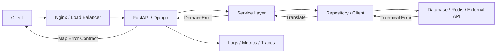

# 10- Error Handling in APIs

## Overview

API error handling is the boundary between internal application failures and externally observable behavior.

A Python backend can have a rich internal exception hierarchy:

```text
DatabaseError
TimeoutError
OrderNotFoundError
OrderConflictError
PaymentProviderTimeoutError
InvalidOrderStateError
```

Clients should not need to understand those Python implementation details.

Instead, the API should expose a stable protocol-level contract:

```json
{
  "error": {
    "code": "ORDER_NOT_FOUND",
    "message": "Order not found",
    "request_id": "req_01J..."
  }
}
```

A production API therefore separates:

```text
Internal exception
      │
      ▼
Exception classification
      │
      ▼
Application error contract
      │
      ▼
HTTP / gRPC response
      │
      ▼
Client
```

Good API error handling provides:

- predictable client behavior
- safe information exposure
- consistent error contracts
- useful diagnostics
- correct HTTP semantics
- reliable retry behavior
- observability
- compatibility across service versions

---

## Why API Error Handling Matters

Without a defined error contract, clients often become coupled to implementation details.

Bad response:

```json
{
  "error": "psycopg.errors.UniqueViolation: duplicate key value violates..."
}
```

Problems include:

- database implementation leakage
- unstable messages
- sensitive information exposure
- poor client parsing
- difficult API versioning
- inconsistent behavior across endpoints

A better response is:

```json
{
  "error": {
    "code": "ORDER_ALREADY_EXISTS",
    "message": "An order with this reference already exists",
    "request_id": "req_123"
  }
}
```

The internal exception can still contain detailed diagnostic information.

---

## API Error Handling Architecture

A typical Python backend can use this flow:



Each layer has a different responsibility.

| Layer | Responsibility |
|---|---|
| Nginx / load balancer | Infrastructure-level failures and timeouts |
| API framework | Request parsing and protocol-level handling |
| Service | Business rules and domain failures |
| Repository | Persistence-specific failures |
| External client | Dependency-specific failures |
| Error handler | Stable external error mapping |
| Observability | Diagnostics, metrics, tracing, alerting |

---

## HTTP Status Codes

HTTP status codes communicate broad failure categories.

| Status | Meaning | Typical API use |
|---:|---|---|
| `400` | Bad Request | Malformed request |
| `401` | Unauthorized | Missing/invalid authentication |
| `403` | Forbidden | Authenticated but not permitted |
| `404` | Not Found | Resource does not exist |
| `405` | Method Not Allowed | Unsupported HTTP method |
| `409` | Conflict | State or uniqueness conflict |
| `412` | Precondition Failed | Conditional request failed |
| `415` | Unsupported Media Type | Unsupported content type |
| `422` | Unprocessable Content | Semantically invalid input |
| `429` | Too Many Requests | Rate limiting |
| `500` | Internal Server Error | Unexpected server failure |
| `502` | Bad Gateway | Invalid upstream response |
| `503` | Service Unavailable | Temporary service/dependency unavailability |
| `504` | Gateway Timeout | Upstream timeout |

Status codes are intentionally broad.

The application error code should provide more precise semantics.

---

## HTTP Status vs Application Error Code

Do not encode all business semantics into HTTP status codes.

For example:

```text
HTTP 409
    ├── ORDER_ALREADY_EXISTS
    ├── ORDER_STATE_CONFLICT
    └── VERSION_CONFLICT
```

The HTTP status communicates the protocol category.

The application error code communicates the specific condition.

Example:

```json
{
  "error": {
    "code": "ORDER_STATE_CONFLICT",
    "message": "The order cannot be cancelled in its current state",
    "request_id": "req_123"
  }
}
```

This gives clients a stable machine-readable identifier.

---

## Stable Error Codes

Prefer:

```text
ORDER_NOT_FOUND
ORDER_ALREADY_EXISTS
INVALID_ORDER_STATE
PAYMENT_REQUIRED
PAYMENT_PROVIDER_UNAVAILABLE
RATE_LIMIT_EXCEEDED
```

over parsing:

```text
"The order could not be found"
```

Messages can change for clarity, localization, or UX reasons.

Error codes should remain stable enough for clients to build deterministic behavior.

---

## Error Response Schema

A practical REST error structure is:

```json
{
  "error": {
    "code": "ORDER_NOT_FOUND",
    "message": "Order not found",
    "request_id": "req_01JABC..."
  }
}
```

Validation errors may include structured fields:

```json
{
  "error": {
    "code": "VALIDATION_ERROR",
    "message": "Request validation failed",
    "fields": {
      "quantity": [
        "must be greater than zero"
      ],
      "currency": [
        "is required"
      ]
    },
    "request_id": "req_01JABC..."
  }
}
```

Keep the schema consistent across endpoints.

---

## Machine-Readable vs Human-Readable Errors

Separate these concerns:

```text
code
  → machine-readable

message
  → human-readable

details
  → optional structured diagnostic information
```

Clients should generally branch on:

```python
if response.error.code == "ORDER_NOT_FOUND":
    ...
```

not:

```python
if "not found" in response.error.message:
    ...
```

---

## Validation Errors

Validation failures should be deterministic and client-actionable.

Example:

```json
{
  "error": {
    "code": "VALIDATION_ERROR",
    "message": "Request validation failed",
    "fields": {
      "email": ["invalid email address"],
      "quantity": ["must be greater than zero"]
    }
  }
}
```

Validation should happen before expensive operations where possible.

```text
HTTP request
    │
    ▼
Parse
    │
    ▼
Validate
    │
    ├── invalid → 400/422
    │
    ▼
Authenticate
    │
    ▼
Authorize
    │
    ▼
Business logic
```

---

## Authentication Errors

Authentication failures commonly use:

```http
401 Unauthorized
```

Examples:

- missing credentials
- expired token
- invalid token
- invalid session

Do not expose excessive diagnostic detail.

Avoid responses such as:

```json
{
  "error": "JWT expired because token was issued at ..."
}
```

unless the API contract specifically requires that information.

---

## Authorization Errors

A caller may be authenticated but lack permission.

```http
403 Forbidden
```

Example:

```json
{
  "error": {
    "code": "ORDER_ACCESS_DENIED",
    "message": "You do not have permission to access this order"
  }
}
```

Authorization failures should not reveal unnecessary information about protected resources.

---

## Resource Not Found

A missing resource generally maps to:

```http
404 Not Found
```

Internally:

```python
raise OrderNotFoundError(order_id)
```

At the API boundary:

```python
ORDER_NOT_FOUND → 404
```

The internal exception can contain the ID, but the public response does not necessarily need to echo it.

---

## Conflict Errors

Use `409 Conflict` when the request conflicts with current resource state.

Examples:

```text
Duplicate order reference
Concurrent update
Invalid state transition
Already-processed operation
```

Example:

```json
{
  "error": {
    "code": "ORDER_STATE_CONFLICT",
    "message": "The order has already been shipped"
  }
}
```

---

## Rate Limiting

A rate-limited request commonly uses:

```http
429 Too Many Requests
```

The response may include:

```http
Retry-After: 30
```

Example:

```json
{
  "error": {
    "code": "RATE_LIMIT_EXCEEDED",
    "message": "Too many requests"
  }
}
```

Clients should use server-provided retry guidance when appropriate.

Servers should avoid encouraging clients to retry immediately.

---

## Dependency Failures

Suppose:

```text
API
 │
 ▼
Order Service
 │
 ▼
Inventory Service
```

If inventory is unavailable, do not expose:

```json
{
  "error": "requests.exceptions.ConnectionError: ..."
}
```

Instead translate:

```text
ConnectionError
      │
      ▼
InventoryUnavailableError
      │
      ▼
503 Service Unavailable
```

Example:

```json
{
  "error": {
    "code": "INVENTORY_UNAVAILABLE",
    "message": "Inventory service is temporarily unavailable",
    "request_id": "req_123"
  }
}
```

---

## 502 vs 503 vs 504

These statuses can be distinguished by failure semantics.

### `502 Bad Gateway`

The server acting as a gateway received an invalid response from an upstream service.

### `503 Service Unavailable`

The service or required dependency is temporarily unavailable.

### `504 Gateway Timeout`

An upstream dependency failed to respond within the allowed time.

The exact mapping depends on the architecture and API gateway behavior.

---

## Unexpected Exceptions

Unexpected exceptions should normally become:

```http
500 Internal Server Error
```

Example:

```python
@app.exception_handler(Exception)
async def handle_unexpected_error(request, exc):
    logger.exception(
        "unhandled API exception",
        extra={"request_id": request.state.request_id},
    )

    return JSONResponse(
        status_code=500,
        content={
            "error": {
                "code": "INTERNAL_ERROR",
                "message": "Internal server error",
                "request_id": request.state.request_id,
            }
        },
    )
```

The client receives a safe response.

The internal logging system receives the detailed exception and traceback.

---

## Never Return Raw Exceptions

Avoid:

```python
return JSONResponse(
    status_code=500,
    content={"error": str(exc)},
)
```

This can expose:

- SQL statements
- file paths
- hostnames
- stack traces
- credentials
- tokens
- internal service names
- user information

Use a stable external representation instead.

---

## Exception-to-HTTP Mapping

A centralized mapping can be explicit:

```python
ERROR_RESPONSES = {
    OrderNotFoundError: (404, "ORDER_NOT_FOUND"),
    OrderConflictError: (409, "ORDER_CONFLICT"),
    ValidationError: (422, "VALIDATION_ERROR"),
    DependencyUnavailableError: (503, "DEPENDENCY_UNAVAILABLE"),
}
```

However, a handler should generally preserve enough information to customize responses where needed.

A dedicated exception model is often clearer for larger systems.

---

## Custom API Exceptions

A custom application exception can contain transport-neutral information:

```python
class ApplicationError(Exception):
    def __init__(
        self,
        code: str,
        message: str,
    ) -> None:
        super().__init__(message)
        self.code = code
        self.message = message
```

Domain-specific exceptions can then inherit from it:

```python
class OrderNotFoundError(ApplicationError):
    def __init__(self, order_id: int) -> None:
        super().__init__(
            code="ORDER_NOT_FOUND",
            message="Order not found",
        )
        self.order_id = order_id
```

The service does not need to know about HTTP.

---

## Keep Domain Code Transport-Neutral

Avoid:

```python
class OrderNotFoundError(HTTPException):
    ...
```

inside the domain layer.

This couples business logic to HTTP.

Prefer:

```text
Domain
  → OrderNotFoundError

API adapter
  → 404
```

The same domain error can then be mapped to:

```text
REST → HTTP 404
gRPC → NOT_FOUND
CLI → exit code
Worker → task failure category
```

---

## FastAPI Exception Handling

FastAPI supports application-wide exception handlers.

```python
from fastapi import FastAPI, Request
from fastapi.responses import JSONResponse

app = FastAPI()


@app.exception_handler(OrderNotFoundError)
async def order_not_found_handler(
    request: Request,
    exc: OrderNotFoundError,
) -> JSONResponse:
    return JSONResponse(
        status_code=404,
        content={
            "error": {
                "code": "ORDER_NOT_FOUND",
                "message": "Order not found",
            }
        },
    )
```

This centralizes transport mapping.

Endpoint code remains focused on application behavior.

---

## FastAPI Validation

FastAPI and Pydantic can perform request validation before endpoint execution.

Conceptually:

```text
HTTP request
    │
    ▼
Pydantic validation
    │
    ├── failure → validation response
    │
    ▼
Endpoint
```

A production API should standardize validation errors rather than allowing every endpoint to expose a different structure.

---

## Django API Error Handling

Django applications can centralize error handling through:

- middleware
- view exception handling
- service-layer exceptions
- framework-specific API exception handlers
- REST framework exception handlers when using Django REST Framework

The architecture should still preserve the same separation:

```text
Domain exception
      │
      ▼
API exception mapping
      │
      ▼
HTTP response
```

---

## REST Error Contract

A consistent API might define:

```json
{
  "error": {
    "code": "ORDER_NOT_FOUND",
    "message": "Order not found",
    "request_id": "req_123",
    "details": {}
  }
}
```

Clients should be able to rely on:

- `code`
- response status
- predictable schema

Optional fields such as `details` should have documented semantics.

---

## Error Contract Versioning

Changing:

```text
ORDER_NOT_FOUND
```

to:

```text
RESOURCE_MISSING
```

can break clients even if the HTTP status remains `404`.

Treat externally visible error codes as part of the API contract.

Changes should consider:

- backward compatibility
- client dependencies
- API versioning
- documentation
- deprecation periods

---

## Request IDs

Every request should have a correlation identifier.

Example:

```http
X-Request-ID: req_01JABC123
```

The same ID should appear in:

- API response
- application logs
- traces
- downstream requests where appropriate
- support/debugging workflows

Example response:

```json
{
  "error": {
    "code": "INTERNAL_ERROR",
    "message": "Internal server error",
    "request_id": "req_01JABC123"
  }
}
```

A client can report the request ID without receiving internal diagnostics.

---

## Correlation Across Microservices

A request may flow through:

```text
Client
  │
  ▼
API Gateway
  │
  ▼
Order Service
  │
  ▼
Payment Service
  │
  ▼
Bank API
```

A trace or correlation context should travel with the request.

```text
trace_id
   │
   ├── API span
   ├── order-service span
   ├── payment-service span
   └── external call span
```

This allows an API error to be traced to the original dependency failure.

---

## Logging API Errors

Log failures at an ownership boundary.

Example structured event:

```json
{
  "event": "api_request_failed",
  "request_id": "req_123",
  "route": "/orders/{order_id}",
  "method": "POST",
  "status_code": 503,
  "error_code": "INVENTORY_UNAVAILABLE",
  "duration_ms": 184,
  "dependency": "inventory-service"
}
```

Do not automatically log request bodies.

Payloads may contain:

- passwords
- access tokens
- payment information
- personal data
- session identifiers

---

## Error Logging Levels

Not every API error should be an application error.

| Condition | Typical level |
|---|---|
| Invalid client input | `INFO` / `DEBUG` |
| Authentication failure | `INFO` / `WARNING` depending on context |
| Rate limiting | `INFO` / `WARNING` |
| Expected business conflict | `INFO` |
| Dependency failure | `WARNING` / `ERROR` |
| Unexpected exception | `ERROR` |
| Data corruption | `ERROR` / alert |

The exact level depends on volume and operational importance.

A client generating invalid input should not necessarily trigger a production incident.

---

## Metrics

Track API errors by stable dimensions:

```text
http_requests_total
http_request_errors_total
```

Useful labels include:

- route template
- HTTP method
- status code
- application error code
- service

Avoid high-cardinality labels such as:

```text
user_id
request_id
raw_exception_message
```

These can make metrics expensive and difficult to operate.

---

## Distributed Error Handling

In microservices, never depend on another service's Python exception classes.

This is invalid architecture:

```text
Service A
    │
    └── expects PaymentServiceException
```

Python exception classes are local implementation details.

Use protocol-level errors:

```json
{
  "code": "PAYMENT_UNAVAILABLE",
  "message": "Payment service temporarily unavailable"
}
```

or gRPC status codes and structured error details.

---

## gRPC Error Handling

gRPC uses status codes rather than HTTP status codes.

Common mappings include:

| Domain condition | gRPC status |
|---|---|
| Invalid input | `INVALID_ARGUMENT` |
| Unauthenticated | `UNAUTHENTICATED` |
| Forbidden | `PERMISSION_DENIED` |
| Not found | `NOT_FOUND` |
| Conflict | `ALREADY_EXISTS` / `ABORTED` depending on semantics |
| Rate limited | `RESOURCE_EXHAUSTED` |
| Temporary dependency failure | `UNAVAILABLE` |
| Timeout/deadline | `DEADLINE_EXCEEDED` |
| Unexpected failure | `INTERNAL` |

The same domain exception can therefore have different transport mappings.

---

## Client Retry Semantics

API errors should communicate enough information for clients to decide whether retrying is appropriate.

For example:

```text
400 → do not retry
401 → refresh credentials if appropriate
404 → usually do not retry
409 → reconcile
429 → retry according to rate limit
503 → potentially retry
504 → potentially retry
```

The server should avoid claiming that an operation definitely failed when the outcome is ambiguous.

---

## Ambiguous API Outcomes

Consider:

```text
POST /payments
      │
      ▼
Payment service
      │
      ├── payment succeeds
      │
      └── response lost
              │
              ▼
           504 timeout
```

The client cannot safely assume:

```text
payment failed
```

The API should support mechanisms such as:

- idempotency keys
- operation IDs
- status endpoints
- reconciliation
- durable state

Example:

```http
POST /payments
Idempotency-Key: pay_123
```

Then:

```http
GET /payments/pay_123
```

can resolve the final state.

---

## Error Handling and Retries

API error handling and retry policy must be designed together.

A response like:

```http
503 Service Unavailable
Retry-After: 5
```

communicates:

```text
temporary failure
+
recommended delay
```

A response like:

```http
400 Bad Request
```

normally communicates:

```text
fix the request
```

Retrying `400` repeatedly creates useless traffic.

---

## Timeouts

API systems should enforce timeouts at multiple boundaries.

```text
Client timeout
      │
      ▼
Load balancer
      │
      ▼
API timeout
      │
      ▼
Dependency timeout
```

Timeout budgets should be coordinated.

For example:

```text
Incoming request deadline = 5s

Database = 1s
Redis = 300ms
External API = remaining budget
```

Avoid configuring every dependency with an independent five-second timeout inside a five-second request.

---

## Nginx and Gateway Errors

Not every API error originates in Python.

Nginx, a load balancer, API Gateway, or Kubernetes ingress may produce:

```text
502
503
504
```

The externally visible error contract should be as consistent as practical across these layers.

For example:

```json
{
  "error": {
    "code": "GATEWAY_TIMEOUT",
    "message": "The request could not be completed in time",
    "request_id": "req_123"
  }
}
```

Infrastructure-generated responses may require separate configuration from application-generated responses.

---

## Kubernetes and API Errors

Kubernetes readiness and liveness behavior affects API error rates.

A failing dependency should not necessarily make the application process unhealthy.

For example:

```text
Redis unavailable
    │
    ▼
Application can still serve core requests
    │
    ▼
Keep pod Ready
```

If the application itself cannot serve meaningful traffic:

```text
Readiness = false
```

This removes the pod from service endpoints.

Do not use liveness probes to restart pods merely because a non-critical dependency is temporarily unavailable.

---

## Graceful Degradation

API error handling can preserve partial functionality.

Example:

```text
GET /products/123

Product Service → success
Recommendation Service → timeout

Response:
product data
recommendations omitted
```

This is appropriate when recommendations are non-critical.

For critical dependencies:

```text
Payment Service → unavailable
```

the API should fail safely rather than returning a misleading success response.

---

## Security Boundaries

API error responses are an information boundary.

Do not expose:

```python
repr(exc)
traceback
database exception
internal hostname
stack frame
filesystem path
```

unless the information is deliberately part of a secure internal API contract.

Use separate representations:

```text
Internal diagnostic
    → logs/traces

External error
    → stable sanitized contract
```

---

## Preventing User Enumeration

Security-sensitive endpoints can accidentally reveal whether a resource exists.

For example:

```text
POST /login
```

should generally avoid exposing different responses for:

```text
unknown user
```

and:

```text
wrong password
```

when account enumeration is a concern.

Similarly, protected resource errors should be designed so that they do not reveal unnecessary information about another user's resources.

---

## Error Responses and Sensitive Data

Never include sensitive fields in generic error details.

Avoid:

```json
{
  "error": {
    "code": "PAYMENT_FAILED",
    "details": {
      "card_number": "4111111111111111"
    }
  }
}
```

Prefer:

```json
{
  "error": {
    "code": "PAYMENT_FAILED",
    "message": "Payment could not be completed"
  }
}
```

Sensitive diagnostic data belongs in controlled systems with appropriate access controls.

---

## Performance Considerations

Exception handling itself is usually not the primary performance concern in an API.

The larger costs come from:

- repeated retries
- expensive traceback generation
- excessive logging
- serialization of large error payloads
- downstream calls during recovery
- database fallbacks during cache outages

Avoid using exceptions for extremely high-frequency ordinary control flow when a normal result is clearer and cheaper.

More importantly, avoid recovery behavior that creates disproportionate downstream load.

---

## Error Payload Size

Keep error responses small.

Do not return:

```json
{
  "error": {
    "traceback": "... thousands of characters ...",
    "debug_context": "...",
    "dependency_response": "..."
  }
}
```

Large error payloads increase:

- network usage
- serialization cost
- client parsing cost
- log volume
- information exposure

Stable, compact error contracts are easier to operate.

---

## API Error Handling with Celery

Long-running operations should often move to background processing.

Instead of:

```text
HTTP request
    │
    ▼
long operation
    │
    ▼
HTTP timeout
```

use:

```text
HTTP request
    │
    ▼
enqueue Celery task
    │
    ▼
202 Accepted
    │
    ▼
client polls operation status
```

Task failures can then be represented independently from the original HTTP request.

---

## API Error Handling with Kafka

For event-driven APIs:

```text
HTTP request
    │
    ▼
Kafka
    │
    ▼
Consumer
    │
    ├── success
    ├── retry
    └── DLQ
```

The API should not claim successful business completion merely because a message was accepted unless that is explicitly the contract.

For example:

```http
202 Accepted
```

may mean:

> The request has been accepted for asynchronous processing.

It does not necessarily mean:

> The business operation completed successfully.

---

## `202 Accepted` and Asynchronous Errors

A robust asynchronous API can return:

```json
{
  "operation_id": "op_123",
  "status": "PENDING"
}
```

The client can later request:

```http
GET /operations/op_123
```

Possible states:

```text
PENDING
RUNNING
SUCCEEDED
FAILED
CANCELLED
```

This prevents background failures from being incorrectly represented as synchronous HTTP success.

---

## Standardized Error Contract

A larger organization may define a shared schema:

```json
{
  "error": {
    "code": "STRING",
    "message": "STRING",
    "details": {},
    "request_id": "STRING"
  }
}
```

Guidelines:

- `code` is stable and machine-readable
- `message` is safe for clients
- `details` contains documented structured information
- `request_id` supports troubleshooting
- stack traces never belong in public responses

---

## Error Mapping Example

A complete service boundary might look like:

```python
class OrderService:
    def get_order(self, order_id: int) -> Order:
        try:
            return self.repository.get(order_id)
        except DatabaseError as exc:
            raise OrderPersistenceError(order_id) from exc
```

The API boundary:

```python
@app.get("/orders/{order_id}")
async def get_order(order_id: int):
    try:
        return service.get_order(order_id)
    except OrderNotFoundError:
        raise HTTPException(
            status_code=404,
            detail={
                "code": "ORDER_NOT_FOUND",
                "message": "Order not found",
            },
        )
```

For larger applications, centralized exception handlers are generally preferable to repeating this mapping in every endpoint.

---

## Centralized Exception Handler Pattern

A scalable structure is:

```text
Endpoint
   │
   ▼
Service
   │
   ├── Domain exception
   │
   ▼
Global exception handler
   │
   ├── status code
   ├── error code
   ├── safe message
   ├── request ID
   └── observability
        │
        ▼
     Response
```

This reduces duplication and makes the API contract easier to audit.

---

## Error Handling Decision Matrix

| Situation | Internal action | HTTP response |
|---|---|---:|
| Invalid JSON | Reject | 400 |
| Validation failure | Reject | 422 |
| Missing authentication | Reject | 401 |
| Insufficient permission | Reject | 403 |
| Resource missing | Raise domain error | 404 |
| State conflict | Raise domain error | 409 |
| Rate limit | Reject + retry guidance | 429 |
| Dependency unavailable | Recover/retry/fail | 502/503 |
| Upstream timeout | Fail/reconcile | 504 |
| Unexpected bug | Log + alert | 500 |
| Async work accepted | Queue work | 202 |

The exact mapping should be part of the API contract.

---

## Common Mistakes

### Returning `200` for Errors

Avoid:

```json
{
  "status": 200,
  "error": "something went wrong"
}
```

HTTP clients, proxies, monitoring systems, and SDKs rely on status semantics.

Use an appropriate status code.

---

### Using `500` for Every Failure

This makes client errors look like server incidents.

Avoid:

```text
Invalid input → 500
Not found → 500
Conflict → 500
```

Use precise protocol semantics.

---

### Returning Raw Exception Messages

Avoid:

```python
return {"error": str(exc)}
```

Internal exceptions are not API contracts.

---

### Parsing Human-Readable Messages

Avoid client logic such as:

```python
if "already exists" in response.text:
    ...
```

Use stable error codes.

---

### Catching Everything at the Endpoint

Avoid:

```python
try:
    return service.execute(request)
except Exception:
    return JSONResponse(status_code=500, ...)
```

This can destroy useful exception semantics.

Use specific handlers and a final global boundary for unexpected failures.

---

### Exposing Stack Traces

Never expose production tracebacks to untrusted clients.

---

### Inconsistent Error Schemas

Avoid:

```text
Endpoint A → {"error": "..."}
Endpoint B → {"message": "..."}
Endpoint C → {"errors": [...]}
```

Define and enforce a consistent contract.

---

### Ignoring Retry Semantics

A `503` without appropriate retry guidance can lead clients to retry aggressively.

Conversely, returning `503` for a permanent validation failure can cause unnecessary retries.

---

## Testing API Errors

API tests should verify the complete contract.

Example:

```python
def test_order_not_found(client, service):
    service.get_order.side_effect = OrderNotFoundError(123)

    response = client.get("/orders/123")

    assert response.status_code == 404
    assert response.json()["error"]["code"] == "ORDER_NOT_FOUND"
```

Test:

- HTTP status
- error code
- response schema
- safe message
- request ID
- field-level validation
- retry headers where applicable
- unexpected exception behavior

---

## Testing Security Properties

Tests should verify that responses do not leak internals.

```python
def test_internal_error_does_not_expose_database_details(
    client,
    service,
):
    service.get_order.side_effect = RuntimeError(
        "password=secret database failure"
    )

    response = client.get("/orders/123")

    body = response.json()

    assert response.status_code == 500
    assert "password=secret" not in str(body)
```

Also verify that sensitive request fields are not unnecessarily logged.

---

## Contract Testing

Microservices should use contract tests to ensure that error responses remain compatible.

For example:

```text
Producer
   │
   ├── ORDER_NOT_FOUND
   ├── ORDER_CONFLICT
   └── DEPENDENCY_UNAVAILABLE
        │
        ▼
Consumer expectations
```

Changing error codes or schema fields should be treated as an API compatibility concern.

---

## Production Checklist

Before deploying an API, verify:

- Error responses use appropriate HTTP status codes.
- Application-specific error codes are stable and documented.
- Error schemas are consistent across endpoints.
- Domain exceptions remain transport-neutral.
- Infrastructure exceptions are translated at appropriate boundaries.
- Unexpected exceptions become safe `500` responses.
- Raw exception messages and tracebacks are never exposed.
- Validation errors are structured and actionable.
- Authentication and authorization errors do not leak sensitive information.
- Request IDs are propagated and returned where appropriate.
- Logs contain sufficient diagnostic context without sensitive payloads.
- Metrics classify failures by stable dimensions.
- Distributed services communicate protocol-level errors, not Python exception classes.
- Retryable responses are distinguishable from permanent failures.
- `Retry-After` is used where appropriate.
- Timeouts and deadlines are configured across dependency boundaries.
- Side-effecting operations support idempotency where retries are possible.
- Async operations expose durable operation state.
- Background failures have retry and DLQ semantics.
- Kubernetes readiness and liveness behavior matches application failure semantics.
- Error contracts are covered by automated tests and contract tests.

## Key Takeaways

- API error handling is a translation boundary: keep rich internal exceptions inside the service and expose stable, sanitized protocol-level error contracts.
- Use HTTP status codes for broad protocol semantics and stable application error codes for machine-readable business meaning.
- Handle expected failures explicitly, while allowing unexpected exceptions to reach a centralized boundary that logs diagnostics and returns a safe `500` response.
- Design API errors together with retries, timeouts, idempotency, asynchronous processing, and distributed-system semantics so clients can distinguish retryable, permanent, and ambiguous outcomes.
- Treat error responses as part of the public API contract and protect them with consistent schemas, observability, security controls, and compatibility testing.