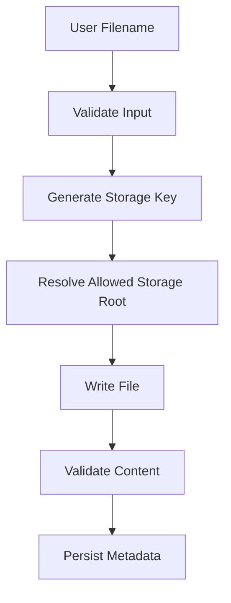

# 02- Pathlib

## Overview

`pathlib` is Python's object-oriented interface for filesystem paths. It provides a platform-independent way to construct, inspect, manipulate, and operate on paths without manually concatenating strings or depending on operating-system-specific path syntax.

For backend engineering, path handling appears in:

- application configuration
- file uploads
- generated reports
- temporary files
- static and media files
- ETL pipelines
- batch processing
- logs
- test fixtures
- Docker containers
- CI/CD workflows
- local development tooling

A path is not the file itself. It is a representation of where a filesystem resource is located.

```text
Path Object
    │
    ├── Construct
    ├── Inspect
    ├── Navigate
    ├── Validate
    └── Perform I/O
            │
            ▼
       Filesystem
```

`pathlib` improves correctness and maintainability, but it does not eliminate filesystem concerns such as permissions, race conditions, path traversal, symlinks, atomicity, or distributed-storage limitations.

---

## Why `pathlib` Exists

Traditional Python code often manipulates paths as strings:

```python
path = "/var/app/data/" + filename
```

This creates several problems:

- platform-specific separators
- accidental duplicate separators
- difficult path composition
- unclear intent
- error-prone normalization
- awkward path inspection

`pathlib` expresses filesystem operations directly:

```python
from pathlib import Path

path = Path("/var/app/data") / filename
```

The `/` operator here is path composition, not string division.

This makes the code both more readable and more portable.

---

## Core Path Types

The most important `pathlib` classes are:

| Type | Purpose |
|---|---|
| `Path` | Concrete filesystem path for the current platform |
| `PurePath` | Platform-independent path manipulation without filesystem access |
| `PurePosixPath` | Pure POSIX-style path manipulation |
| `PureWindowsPath` | Pure Windows-style path manipulation |

For normal application code, `Path` is usually the appropriate choice.

```python
from pathlib import Path

config_path = Path("config") / "settings.json"
```

`Path` can represent paths regardless of whether the target currently exists.

---

## Path Construction

Paths should normally be composed from components rather than manually concatenated.

```python
from pathlib import Path

base_dir = Path("/var/app")
data_dir = base_dir / "data"
orders_file = data_dir / "orders.json"
```

The resulting path is:

```text
/var/app/data/orders.json
```

This works correctly with platform-specific path separators.

Avoid:

```python
path = base_dir + "/data/orders.json"
```

because `base_dir` is no longer a string if it is represented as a `Path`.

---

## Relative and Absolute Paths

A relative path is interpreted relative to the process's current working directory.

```python
path = Path("data/orders.json")
```

An absolute path identifies a location from the filesystem root.

```python
path = Path("/var/app/data/orders.json")
```

Check whether a path is absolute:

```python
if path.is_absolute():
    ...
```

Relative paths are often preferable for application-local resources because they avoid hard-coding deployment-specific filesystem locations.

---

## Current Working Directory

The current working directory is process state.

```python
from pathlib import Path

cwd = Path.cwd()
print(cwd)
```

A relative path such as:

```python
Path("config/settings.json")
```

is interpreted relative to that directory.

Do not assume the working directory is the directory containing the Python module.

For example, this can break:

```python
Path("config/settings.json")
```

when an application is launched from a different directory.

Production applications should explicitly establish their resource roots rather than relying on the caller's working directory.

---

## `__file__` and Application Resources

For resources located relative to a Python module, `__file__` can be useful:

```python
from pathlib import Path

BASE_DIR = Path(__file__).resolve().parent
config_path = BASE_DIR / "config" / "settings.json"
```

For larger applications, however, configuration should generally be injected through environment variables or application configuration rather than assuming a particular source-tree layout.

This distinction matters in:

- Docker images
- packaged applications
- serverless environments
- installed Python packages
- CI/CD pipelines

---

## Path Inspection

`Path` exposes useful components:

```python
from pathlib import Path

path = Path("/var/app/data/orders.json")

print(path.name)
print(path.stem)
print(path.suffix)
print(path.parent)
```

Conceptually:

| Property | Result |
|---|---|
| `name` | `orders.json` |
| `stem` | `orders` |
| `suffix` | `.json` |
| `parent` | `/var/app/data` |

For multiple suffixes:

```python
path = Path("archive.tar.gz")

print(path.name)       # archive.tar.gz
print(path.stem)       # archive.tar
print(path.suffix)     # .gz
print(path.suffixes)   # ['.tar', '.gz']
```

---

## Path Existence

Use:

```python
if path.exists():
    ...
```

to check whether a filesystem entry exists.

You can also distinguish resource types:

```python
if path.is_file():
    ...

if path.is_dir():
    ...

if path.is_symlink():
    ...
```

These checks are useful for validation and application startup.

However, they are not synchronization primitives.

---

## The TOCTOU Problem

This pattern is vulnerable to a race condition:

```python
if path.exists():
    path.read_text()
```

The filesystem can change between the existence check and the read.

This is known as a **time-of-check to time-of-use (TOCTOU)** race.

Another process could:

1. create the file
2. delete it
3. replace it
4. modify it

between the two operations.

Prefer performing the actual operation and handling its exception:

```python
try:
    content = path.read_text(encoding="utf-8")
except FileNotFoundError:
    ...
```

Use existence checks when they are informational rather than security-critical.

---

## Resolving Paths

`resolve()` produces an absolute, normalized path and can resolve symbolic links.

```python
resolved = path.resolve()
```

For example:

```text
./data/../data/orders.json
```

may resolve to:

```text
/var/app/data/orders.json
```

This can be useful when validating that a path remains inside an allowed directory.

However, path resolution semantics can depend on filesystem state, especially when symlinks are involved.

---

## Secure Path Validation

A common file-upload mistake is:

```python
upload_dir / user_supplied_filename
```

without validating the resulting location.

A safer pattern is to establish an allowed root and verify the resolved target remains inside it.

```python
from pathlib import Path


def safe_upload_path(upload_dir: Path, filename: str) -> Path:
    root = upload_dir.resolve()
    candidate = (root / filename).resolve()

    if candidate != root and root not in candidate.parents:
        raise ValueError("path escapes upload directory")

    return candidate
```

For security-sensitive upload systems, prefer generated storage keys rather than allowing arbitrary user-controlled paths.

---

## `joinpath()`

`joinpath()` is an alternative to `/`.

```python
path = Path("/var/app").joinpath("data", "orders.json")
```

Equivalent:

```python
path = Path("/var/app") / "data" / "orders.json"
```

The `/` operator is usually more readable.

---

## Parent and Ancestor Navigation

Navigate upward using `.parent`:

```python
path = Path("/var/app/data/orders.json")

print(path.parent)
print(path.parent.parent)
```

For all ancestors:

```python
for parent in path.parents:
    print(parent)
```

This is useful for locating project roots or validating directory boundaries.

Avoid excessive reliance on fixed numbers of `.parent` calls because directory structures can change.

---

## File Operations

`Path` provides many filesystem operations directly.

```python
from pathlib import Path

path = Path("reports/report.txt")

path.write_text("report data", encoding="utf-8")

content = path.read_text(encoding="utf-8")
```

For binary data:

```python
data = path.read_bytes()
path.write_bytes(b"binary data")
```

For larger files or more control, use `open()`:

```python
with path.open("r", encoding="utf-8") as file:
    for line in file:
        process(line)
```

---

## Creating Directories

Create a directory:

```python
path.mkdir()
```

Create parent directories as necessary:

```python
path.mkdir(parents=True, exist_ok=True)
```

Example:

```python
reports_dir = Path("var/reports/2026")
reports_dir.mkdir(parents=True, exist_ok=True)
```

`exist_ok=True` makes repeated startup or initialization safe when the directory already exists.

---

## Directory Creation Race Conditions

Avoid relying on:

```python
if not path.exists():
    path.mkdir()
```

Another process may create the directory between the check and creation.

Prefer:

```python
path.mkdir(parents=True, exist_ok=True)
```

This delegates the race handling to the filesystem operation.

---

## Directory Listing

For direct children:

```python
for path in Path("data").iterdir():
    print(path)
```

Filter files:

```python
for path in Path("data").iterdir():
    if path.is_file():
        process(path)
```

For large directory trees, avoid unnecessarily constructing a huge list when iteration is sufficient.

---

## Glob and Recursive Search

`glob()` searches according to a pattern:

```python
from pathlib import Path

for path in Path("reports").glob("*.json"):
    process(path)
```

Recursive searching:

```python
for path in Path("reports").rglob("*.json"):
    process(path)
```

This is useful for:

- batch jobs
- migrations
- test fixture discovery
- data processing
- cleanup jobs

Be careful with recursive scans over large filesystems.

---

## `glob()` vs `rglob()`

| Method | Scope | Example |
|---|---|---|
| `glob()` | Matching entries under a directory | `reports.glob("*.json")` |
| `rglob()` | Recursive matching | `reports.rglob("*.json")` |

Prefer the narrowest search scope that satisfies the requirement.

Unbounded recursive scans can become expensive on large directory trees.

---

## Renaming and Moving

Rename:

```python
path.rename(new_path)
```

Example:

```python
source = Path("reports/pending.json")
target = Path("reports/completed.json")

source.rename(target)
```

For moving or replacing files, `replace()` can provide explicit replacement semantics:

```python
source.replace(target)
```

The exact atomicity and filesystem guarantees depend on the operating system and filesystem.

---

## Deleting Files

Delete a file:

```python
path.unlink()
```

Delete a directory:

```python
path.rmdir()
```

`rmdir()` requires the directory to be empty.

For recursive deletion:

```python
import shutil

shutil.rmtree(directory)
```

Be extremely careful with recursive deletion, especially when paths originate from configuration or user input.

---

## File Metadata

`stat()` provides filesystem metadata:

```python
stats = path.stat()

print(stats.st_size)
print(stats.st_mtime)
```

Useful metadata includes:

- file size
- modification time
- permissions
- inode information
- ownership-related fields on supported systems

For applications, avoid assuming all `stat()` fields exist identically across operating systems.

---

## File Size

For a file:

```python
size = path.stat().st_size
```

For example:

```python
if path.stat().st_size > MAX_FILE_SIZE:
    raise ValueError("file too large")
```

When security matters, enforce limits as early as possible rather than waiting until after a potentially expensive operation.

---

## Permissions

`Path` exposes permission-changing operations through `chmod()`:

```python
path.chmod(0o600)
```

This can be useful for sensitive local files.

However, application-level permissions and operating-system permissions are different security layers.

A service may also need:

- container user restrictions
- Kubernetes security contexts
- IAM permissions
- S3 bucket policies
- encryption

---

## Symbolic Links

A symbolic link points to another filesystem entry.

```text
application.log
      ▲
      │
current.log
```

Check for one:

```python
if path.is_symlink():
    ...
```

Symlinks introduce security and correctness considerations.

A path that appears to be inside an allowed directory may resolve through a symlink to a location outside that directory.

Security-sensitive code should reason about resolved paths rather than only lexical paths.

---

## `Path` and File Descriptors

`Path` is a path abstraction, not a replacement for all file APIs.

For advanced operations, Python may require:

- `os`
- `io`
- `fcntl`
- platform-specific APIs
- specialized filesystem libraries

For example:

```python
with path.open("rb") as file:
    data = file.read()
```

The `Path` object handles path representation while the file object handles the actual stream.

This separation is useful:

```text
Path
 │
 └── identifies resource
          │
          ▼
      File object
          │
          └── performs I/O
```

---

## `Path.open()` vs Built-in `open()`

Both are valid.

```python
with path.open("r", encoding="utf-8") as file:
    ...
```

and:

```python
with open(path, "r", encoding="utf-8") as file:
    ...
```

The built-in `open()` accepts path-like objects, so both work with `Path`.

Use whichever makes the surrounding API clearer. `Path.open()` is often convenient when the code is already centered around a `Path`.

---

## Path-Like Objects

Modern Python APIs commonly accept path-like objects implementing `os.PathLike`.

This allows:

```python
from pathlib import Path

path = Path("data/orders.json")
```

to work with many standard-library APIs.

A string can be converted explicitly:

```python
path_string = str(path)
```

Do this only when an API specifically requires a string.

---

## `Path` and Environment Variables

Deployment-specific directories should often come from configuration.

```python
import os
from pathlib import Path

data_dir = Path(
    os.environ.get("APP_DATA_DIR", "/var/app/data")
)
```

For production applications, a dedicated configuration layer is preferable to scattering environment-variable reads throughout business logic.

For example:

```text
Environment
    │
    ▼
Configuration
    │
    ▼
Path objects
    │
    ▼
Application services
```

This keeps deployment concerns separate from application logic.

---

## `Path` in FastAPI and Django

Path handling commonly appears around:

- uploaded files
- generated reports
- static files
- media files
- templates
- configuration
- background-job artifacts

A service layer should avoid embedding deployment-specific paths directly:

```python
REPORT_DIR = Path("/var/app/reports")
```

unless that location is an intentional deployment contract.

Prefer configuration:

```python
settings.report_directory / report_id / "report.json"
```

The application then works consistently across local development, containers, CI, and production.

---

## Path Handling in Docker

Containers commonly use paths such as:

```text
/app
/tmp
/data
```

A `Path` abstraction makes application code independent of hard-coded path separators.

Example:

```python
from pathlib import Path

data_dir = Path("/data")
output_path = data_dir / "exports" / "orders.json"

output_path.parent.mkdir(parents=True, exist_ok=True)
```

However, `pathlib` does not make container storage durable.

If `/data` is container-local storage, data may disappear when the container is replaced.

---

## Kubernetes Considerations

Kubernetes pods have ephemeral filesystems unless persistent storage is explicitly configured.

For example:

```text
Pod
 ├── Container filesystem
 │      └── ephemeral
 │
 └── PersistentVolume
        └── durable storage
```

For durable application files, consider:

- PersistentVolumes
- object storage such as S3
- external databases

For temporary processing, local ephemeral storage may be appropriate.

---

## Object Storage Paths

S3 object keys may look like filesystem paths:

```text
reports/2026/09/orders.json
```

but they are not filesystem paths.

Do not assume:

```python
Path("reports/2026/09/orders.json")
```

has the same semantics as an S3 object key.

Treat object-store keys as application data unless a library explicitly provides path-like semantics.

---

## Path Validation in Backend Systems

A typical secure upload flow is:



A strong design often avoids user-controlled filesystem names completely:

```python
from uuid import uuid4

storage_name = f"{uuid4().hex}.bin"
```

The original filename can be stored separately as metadata.

---

## Normalization

Path strings can contain:

```text
.
..
duplicate separators
symbolic links
relative components
```

Operations such as:

```python
path.resolve()
```

can normalize paths while resolving filesystem state.

Do not confuse lexical normalization with security validation.

For security-sensitive operations, the question is not merely:

> "Does this string look safe?"

It is:

> "Where will this path actually resolve, and can the operation escape the permitted boundary?"

---

## Performance

Path construction itself is inexpensive compared with filesystem I/O.

The expensive operations are usually:

- `stat()`
- directory traversal
- opening files
- reading data
- writing data
- recursive globbing

Avoid unnecessary repeated filesystem calls.

Instead of:

```python
if path.exists():
    size = path.stat().st_size
```

consider whether the application can perform the required operation directly.

Each filesystem interaction may involve system calls and, depending on the environment, network filesystem latency.

---

## Caching Path Information

Do not cache filesystem metadata indefinitely.

Filesystem state can change independently of the Python process.

For example:

```text
Python Process
      │
      ▼
Cached metadata
      │
      X
Filesystem changed externally
```

Long-lived caches can create stale assumptions about:

- file existence
- file size
- modification times
- permissions

Cache only when the consistency model is explicitly understood.

---

## Concurrency

Multiple workers can access the same path concurrently.

Potential problems include:

- two workers creating the same file
- one worker deleting a file while another reads it
- concurrent writes
- partial files
- stale metadata

For generated files, unique identifiers are often safer:

```python
from uuid import uuid4

path = output_dir / f"{uuid4().hex}.json"
```

For shared mutable state, prefer transactional systems such as PostgreSQL rather than coordinating application state through files.

---

## Atomic Operations

For important local-file updates, a common pattern is:

```text
Generate new content
       │
       ▼
Temporary file
       │
       ▼
Flush / sync
       │
       ▼
Atomic replace
       │
       ▼
Final path
```

`Path.replace()` can be used for the final replacement:

```python
temporary_path.replace(target_path)
```

Atomicity guarantees depend on filesystem and platform behavior, so applications requiring strict durability should understand the underlying storage system.

---

## Error Handling

Filesystem operations can fail for many reasons:

```python
from pathlib import Path

path = Path("config/settings.json")

try:
    content = path.read_text(encoding="utf-8")
except FileNotFoundError:
    raise RuntimeError("required configuration is missing")
except PermissionError:
    raise RuntimeError("configuration is not readable")
```

Do not catch every filesystem failure as the same error.

Different failures may require:

- retry
- configuration correction
- permission correction
- fallback
- alerting
- immediate application failure

---

## Common Exceptions

| Exception | Typical cause |
|---|---|
| `FileNotFoundError` | Target does not exist |
| `PermissionError` | Insufficient permissions |
| `IsADirectoryError` | File operation used on directory |
| `NotADirectoryError` | Path component expected to be directory |
| `FileExistsError` | Exclusive creation encountered existing entry |
| `OSError` | General operating-system I/O failure |

Handle specific exceptions where the application can take different actions.

---

## Testing With Temporary Directories

Tests should avoid modifying real application directories.

Python provides `tempfile`, and pytest commonly provides `tmp_path`.

```python
def test_report_is_written(tmp_path):
    report_path = tmp_path / "reports" / "daily.txt"
    report_path.parent.mkdir()

    report_path.write_text(
        "daily report",
        encoding="utf-8",
    )

    assert report_path.read_text(encoding="utf-8") == "daily report"
```

This provides isolated filesystem state for each test.

---

## Maintainability

Pass `Path` objects through application layers instead of repeatedly converting paths to strings.

Prefer:

```python
def generate_report(output_path: Path) -> None:
    ...
```

over:

```python
def generate_report(output_path: str) -> None:
    ...
```

This makes the contract explicit and allows callers to compose paths naturally.

A service should generally receive its storage location through configuration or dependency injection rather than constructing deployment-specific paths internally.

---

## Architecture Pattern

A clean backend design can separate path construction from business logic:

```text
Configuration
     │
     ▼
Storage Settings
     │
     ▼
Path Factory / Storage Adapter
     │
     ▼
Application Service
     │
     ▼
Filesystem / S3
```

For example:

```python
from pathlib import Path


class ReportStorage:
    def __init__(self, root: Path) -> None:
        self.root = root

    def path_for(self, report_id: str) -> Path:
        return self.root / f"{report_id}.json"
```

This makes storage behavior easier to test and replace.

---

## When to Use `pathlib`

Use `pathlib` when:

- working with local filesystem paths
- composing paths
- inspecting files and directories
- creating directories
- finding files
- reading or writing local resources
- passing paths between application layers
- writing cross-platform tooling

It should generally be the default path abstraction in modern Python code.

---

## When `pathlib` Is Not Enough

Use other abstractions when the problem extends beyond local filesystem paths.

Examples:

| Requirement | Appropriate abstraction |
|---|---|
| Local paths | `pathlib.Path` |
| File streams | `io` / file objects |
| Temporary files | `tempfile` |
| File copying | `shutil` |
| Low-level OS behavior | `os` |
| Object storage | S3 SDK |
| Distributed filesystem | Storage-specific client |
| Database state | PostgreSQL / ORM |
| Shared distributed coordination | Redis / database |

`pathlib` should not be forced into representing resources it was not designed to model.

---

## Common Mistakes and Pitfalls

### Manual String Concatenation

```python
path = base + "/" + filename
```

Use:

```python
path = base / filename
```

### Assuming the Working Directory

Relative paths depend on `Path.cwd()`.

Do not assume the process starts from the project root.

### Checking Before Acting

```python
if path.exists():
    path.unlink()
```

The state can change between operations.

Prefer:

```python
try:
    path.unlink()
except FileNotFoundError:
    pass
```

when absence is acceptable.

### Trusting User-Controlled Paths

Never allow arbitrary user input to determine filesystem locations without strict validation.

### Treating `resolve()` as Complete Security

Resolving a path helps establish its actual location but does not automatically make a file operation safe against every race or symlink scenario.

### Recursive Deletion Without Validation

```python
shutil.rmtree(path)
```

can cause catastrophic data loss if `path` is wrong.

### Treating S3 Keys as Filesystem Paths

Object keys may resemble paths but have different semantics.

### Assuming Container Disk Is Durable

Container-local files may disappear during replacement or rescheduling.

### Excessive Filesystem Calls

Repeated `exists()`, `stat()`, and `resolve()` operations can create unnecessary I/O.

### Hard-Coding Deployment Paths

Paths such as `/var/app/data` should be configuration when they vary by environment.

---

## Interview Traps

### Is `Path` a file?

No. A `Path` represents a filesystem location. It does not contain the file's contents.

### Does `Path.exists()` guarantee the file will exist afterward?

No. Filesystem state can change immediately after the check.

### Why is `pathlib` better than string concatenation?

It provides platform-aware composition and a structured API for filesystem operations.

### Does `pathlib` make filesystem operations atomic?

No. `pathlib` provides convenient operations, but atomicity depends on the underlying operation and filesystem.

### Is a relative path always relative to the source file?

No. It is normally interpreted relative to the process's current working directory.

### Is `Path.resolve()` enough to prevent path traversal?

Not by itself. Secure path handling must account for filesystem state, symlinks, races, and the actual storage design.

---

## Production Checklist

Before using `pathlib` in production code, verify:

- `Path` is used instead of manual path concatenation.
- Relative paths have an explicit and understood working-directory contract.
- Deployment-specific directories come from configuration.
- Files are opened with context managers.
- Text encodings are explicit where appropriate.
- User-controlled filenames cannot escape the intended storage boundary.
- Sensitive paths are validated against resolved allowed roots.
- File existence checks are not incorrectly treated as synchronization mechanisms.
- Race conditions are considered for concurrent file operations.
- Recursive deletion has strict validation.
- Large directory trees are not scanned unnecessarily.
- Large files are streamed rather than loaded entirely into memory.
- Local container storage is not assumed to be durable.
- Durable files use appropriate persistent storage or object storage.
- Filesystem errors are handled according to their operational meaning.
- Temporary files use appropriate temporary-storage mechanisms.
- Important updates use atomic replacement patterns where appropriate.
- Tests use isolated temporary directories.
- Path construction is separated from business logic when useful.
- Object-storage keys are not incorrectly modeled as local filesystem paths.
- Monitoring captures meaningful filesystem failures in production workflows.

## Key Takeaways

- `pathlib.Path` should generally be the default abstraction for local filesystem paths in modern Python because it provides readable, platform-aware path composition and filesystem operations.
- A `Path` represents a location, not file contents; distinguish path construction, filesystem metadata, and actual I/O operations.
- Filesystem state is mutable and concurrent, so patterns such as `exists()` followed by an operation are not inherently race-free.
- Secure path handling requires more than string sanitization: account for traversal, symlinks, resolved paths, race conditions, permissions, and user-controlled input.
- In production systems, use configuration and appropriate persistent or object storage rather than hard-coded paths or assuming container-local files are durable.