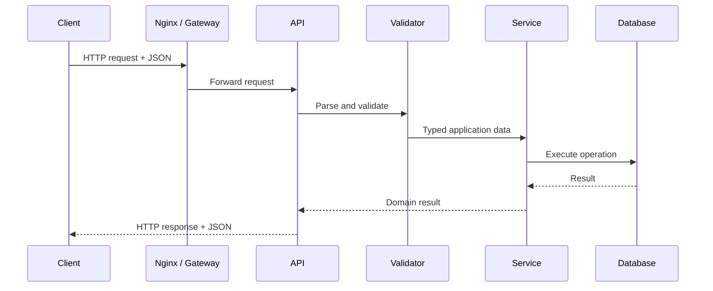

# 06- JSON

## Overview

JSON (JavaScript Object Notation) is a text-based data interchange format built around a small set of structured values:

- objects
- arrays
- strings
- numbers
- booleans
- `null`

It is one of the dominant serialization formats in backend systems because it is:

- human-readable
- language-independent
- easy to transport over HTTP
- widely supported
- naturally compatible with REST APIs
- simple to inspect and debug

Python provides JSON support through the standard-library `json` module.

The important engineering distinction is between **Python objects** and their **JSON representation**:

```text
Python Object
     │
     │ serialization
     ▼
JSON Text / Bytes
     │
     │ deserialization
     ▼
Python Object
```

JSON is not Python's object model. It does not natively represent arbitrary Python objects, classes, sets, tuples, `Decimal`, `datetime`, or exceptions.

Production JSON handling therefore requires deliberate decisions about:

- schema
- types
- validation
- serialization
- compatibility
- security
- payload size
- performance
- error handling

---

## JSON Data Model

The JSON data model consists of:

| JSON type | Python representation |
|---|---|
| Object | `dict` |
| Array | `list` |
| String | `str` |
| Number | `int` / `float` |
| `true` | `True` |
| `false` | `False` |
| `null` | `None` |

Example:

```json
{
  "order_id": 1001,
  "customer": {
    "id": "C001",
    "name": "Alice"
  },
  "items": [
    {
      "sku": "SKU-001",
      "quantity": 2
    }
  ],
  "paid": true,
  "notes": null
}
```

The Python equivalent is approximately:

```python
{
    "order_id": 1001,
    "customer": {
        "id": "C001",
        "name": "Alice",
    },
    "items": [
        {
            "sku": "SKU-001",
            "quantity": 2,
        }
    ],
    "paid": True,
    "notes": None,
}
```

The mapping is convenient, but it is not perfectly lossless for every Python type.

---

## Serialization and Deserialization

### Serialization

Serialization converts an in-memory Python representation into a transport or storage representation.

```python
import json

payload = {
    "order_id": 1001,
    "status": "paid",
}

encoded = json.dumps(payload)

print(encoded)
```

Result:

```text
{"order_id": 1001, "status": "paid"}
```

### Deserialization

Deserialization converts JSON back into Python objects.

```python
decoded = json.loads(encoded)

print(decoded["order_id"])
```

Result:

```text
1001
```

The terminology is often summarized as:

| Operation | Direction |
|---|---|
| Serialization | Python → JSON |
| Deserialization | JSON → Python |

---

## `json.dumps()` and `json.loads()`

Use `dumps()` when JSON is needed as a string:

```python
import json

payload = {"status": "accepted"}

text = json.dumps(payload)
```

Use `loads()` when JSON is already available as a string or bytes-like input:

```python
payload = json.loads(text)
```

The `s` means **string**.

---

## `json.dump()` and `json.load()`

Use `dump()` and `load()` for file-like objects.

```python
import json
from pathlib import Path

path = Path("config.json")

with path.open("w", encoding="utf-8") as file:
    json.dump(
        {"environment": "production"},
        file,
        indent=2,
    )
```

Reading:

```python
with path.open("r", encoding="utf-8") as file:
    config = json.load(file)
```

The distinction is:

| Function | Input/output |
|---|---|
| `dumps()` | Python object → JSON string |
| `loads()` | JSON string/bytes → Python object |
| `dump()` | Python object → file-like object |
| `load()` | file-like object → Python object |

---

## JSON Request Lifecycle

In a REST API, JSON commonly flows through several layers:



A key design principle is that **JSON parsing is not validation**.

For example:

```json
{
  "amount": "abc"
}
```

may be valid JSON but invalid application data.

---

## JSON Syntax

Objects use key-value pairs:

```json
{
  "name": "Alice",
  "age": 30
}
```

Arrays contain ordered values:

```json
[
  "pending",
  "approved",
  "completed"
]
```

Strings require double quotes:

```json
{
  "status": "active"
}
```

This is invalid JSON:

```text
{'status': 'active'}
```

because single-quoted strings are Python syntax, not JSON syntax.

---

## JSON Is Strict About Syntax

Valid JSON:

```json
{
  "id": 1001,
  "active": true
}
```

Invalid JSON:

```json
{
  "id": 1001,
  "active": True,
}
```

Problems include:

- Python's `True` instead of JSON `true`
- trailing comma

This distinction matters when manually creating payloads or debugging integration failures.

---

## Pretty Printing

For human-readable JSON:

```python
import json

text = json.dumps(
    payload,
    indent=2,
)
```

This is useful for:

- configuration files
- debugging
- generated artifacts
- test fixtures

It increases payload size, so compact formatting is normally preferable for network APIs.

---

## Compact JSON

For network-oriented serialization:

```python
text = json.dumps(
    payload,
    separators=(",", ":"),
)
```

This removes unnecessary whitespace.

Do not assume whitespace optimization will materially improve performance for ordinary APIs; payload structure and network behavior usually matter more.

---

## Unicode

Python's JSON implementation handles Unicode.

```python
import json

payload = {
    "city": "Kolkata",
    "message": "こんにちは",
}

text = json.dumps(payload)
```

By default, Python may escape non-ASCII characters:

```text
"\u3053\u3093\u306b\u3061\u306f"
```

Use:

```python
text = json.dumps(
    payload,
    ensure_ascii=False,
)
```

when readable Unicode output is preferred.

---

## JSON Encoding

When JSON must be sent as bytes:

```python
data = json.dumps(
    payload,
    ensure_ascii=False,
).encode("utf-8")
```

The normal web convention is UTF-8.

Conceptually:

```text
Python dict
    │
    ▼
JSON string
    │
    │ UTF-8 encoding
    ▼
HTTP bytes
```

---

## JSON Numbers

JSON has a generic number concept rather than Python's distinct `int` and `float` types.

For example:

```json
{
  "count": 10,
  "ratio": 0.75
}
```

Python typically produces:

```python
10      # int
0.75    # float
```

This can become important across languages because different systems may have different numeric precision limits.

---

## Financial Values in JSON

Avoid assuming that JSON numbers automatically provide financial precision.

For example:

```json
{
  "amount": 19.99
}
```

A Python backend may deserialize this into a floating-point value.

For financial systems, an explicit representation may be safer:

```json
{
  "amount": "19.99",
  "currency": "USD"
}
```

and then:

```python
from decimal import Decimal

amount = Decimal(payload["amount"])
```

The correct representation depends on the API contract and downstream systems.

---

## `parse_float`

Python allows customization of numeric parsing.

```python
import json
from decimal import Decimal

payload = json.loads(
    '{"amount": 19.99}',
    parse_float=Decimal,
)

print(payload["amount"])
```

The resulting value is a `Decimal`.

This can be useful when exact decimal semantics matter.

---

## `parse_int`

Integer parsing can also be customized:

```python
payload = json.loads(
    '{"id": 1001}',
    parse_int=int,
)
```

In most applications, the default behavior is sufficient.

The important point is that deserialization behavior can be configured when interoperability or domain-specific numeric semantics require it.

---

## Unsupported Python Types

The JSON encoder does not natively serialize every Python object.

For example:

```python
from datetime import datetime
import json

payload = {
    "created_at": datetime.now(),
}

json.dumps(payload)
```

raises:

```text
TypeError
```

because `datetime` is not a native JSON type.

The correct solution is to define an explicit representation.

---

## Custom Serialization with `default`

One approach is:

```python
import json
from datetime import datetime, timezone


def serialize(value):
    if isinstance(value, datetime):
        return value.isoformat()

    raise TypeError(
        f"unsupported type: {type(value).__name__}"
    )


payload = {
    "created_at": datetime.now(timezone.utc),
}

text = json.dumps(
    payload,
    default=serialize,
)
```

The serialization contract should be intentional and documented.

Avoid generic "serialize anything" functions that silently convert unknown objects.

---

## Dataclasses and JSON

Dataclasses are not automatically JSON serializable.

```python
from dataclasses import dataclass

@dataclass
class Order:
    id: int
    status: str
```

Convert them to a JSON-compatible structure first:

```python
from dataclasses import asdict
import json

order = Order(
    id=1001,
    status="paid",
)

text = json.dumps(asdict(order))
```

For complex APIs, dedicated schema/serialization libraries may provide stronger validation and clearer contracts.

---

## JSON and Pydantic

FastAPI commonly uses Pydantic models to combine:

- parsing
- validation
- type conversion
- schema generation
- API serialization

Example:

```python
from pydantic import BaseModel


class CreateOrder(BaseModel):
    customer_id: str
    amount: float
```

Conceptually:

```text
JSON
 │
 ▼
Pydantic validation
 │
 ▼
Typed model
 │
 ▼
Application logic
```

For production APIs, schema validation is generally preferable to passing unvalidated dictionaries throughout the service.

---

## JSON and Django

Django provides `JsonResponse` for JSON responses.

```python
from django.http import JsonResponse


def health(request):
    return JsonResponse(
        {
            "status": "ok",
        }
    )
```

Django handles JSON serialization and response headers appropriately for the normal use case.

For request bodies, parse and validate JSON explicitly rather than trusting arbitrary input.

---

## JSON and FastAPI

FastAPI naturally integrates JSON request and response models.

```python
from fastapi import FastAPI
from pydantic import BaseModel

app = FastAPI()


class CreateOrder(BaseModel):
    customer_id: str
    amount: float


@app.post("/orders")
async def create_order(order: CreateOrder):
    return {
        "customer_id": order.customer_id,
        "amount": order.amount,
    }
```

The framework handles much of the HTTP/JSON parsing and schema validation lifecycle.

The application should still enforce domain rules beyond structural validation.

---

## JSON Schema

JSON Schema can formally describe JSON structures.

Example:

```json
{
  "type": "object",
  "required": [
    "customer_id",
    "amount"
  ],
  "properties": {
    "customer_id": {
      "type": "string"
    },
    "amount": {
      "type": "number"
    }
  }
}
```

Schema contracts are useful for:

- API validation
- documentation
- contract testing
- code generation
- interoperability

However, schema validation does not replace business validation.

---

## Schema Evolution

APIs rarely remain static.

A service may evolve from:

```json
{
  "name": "Alice"
}
```

to:

```json
{
  "name": "Alice",
  "email": "alice@example.com"
}
```

Adding optional fields is generally easier to roll out than removing or changing existing fields.

Production API evolution should consider:

- backward compatibility
- forward compatibility
- optional fields
- default values
- versioning
- deprecation
- consumer behavior

Never assume every consumer upgrades simultaneously.

---

## Backward Compatibility

Suppose version 1 returns:

```json
{
  "id": 1001,
  "status": "paid"
}
```

Adding:

```json
{
  "id": 1001,
  "status": "paid",
  "currency": "USD"
}
```

may be backward compatible if consumers ignore unknown fields.

Changing:

```json
"status": "paid"
```

to:

```json
"status": {
  "code": "paid"
}
```

can break existing consumers.

Schema changes should therefore be evaluated from the perspective of all consumers.

---

## JSON API Error Responses

A production API should define a stable error structure.

For example:

```json
{
  "error": {
    "code": "ORDER_NOT_FOUND",
    "message": "Order was not found",
    "request_id": "req_8f7c..."
  }
}
```

Do not expose internal exception details such as:

```text
psycopg2.errors.UniqueViolation(...)
```

to clients.

Internal errors should be mapped to stable application-level contracts.

---

## JSON and REST

REST APIs commonly use:

```http
Content-Type: application/json
```

Request:

```http
POST /orders
Content-Type: application/json
```

Body:

```json
{
  "customer_id": "C001",
  "amount": "125.50"
}
```

Response:

```http
HTTP/1.1 201 Created
Content-Type: application/json
```

Body:

```json
{
  "id": "ORD-1001",
  "status": "created"
}
```

The HTTP contract and JSON contract should be designed together.

---

## JSON and gRPC

gRPC normally uses Protocol Buffers rather than JSON for service-to-service payloads.

```text
REST / external API
        │
        ▼
       JSON

gRPC / internal service
        │
        ▼
   Protobuf binary
```

JSON may still appear around gRPC systems for:

- gateways
- debugging
- external integrations
- REST transcoding

Choose the representation based on interoperability and system requirements rather than using JSON everywhere.

---

## JSON and Kafka

Kafka messages can contain JSON:

```json
{
  "event_type": "order_created",
  "event_id": "evt-1001",
  "order_id": "ORD-1001",
  "occurred_at": "2026-09-06T10:30:00Z"
}
```

Production event schemas should define:

- event type
- event version
- event ID
- timestamp
- required fields
- compatibility rules

For high-volume systems, schema-managed binary formats such as Avro or Protobuf may be more appropriate.

---

## JSON and Redis

Redis commonly stores JSON-like application data as serialized strings or bytes.

```python
import json

value = json.dumps(
    {
        "status": "active",
        "attempts": 2,
    }
)

redis.set(
    "job:1001",
    value,
)
```

Be careful with:

- payload size
- serialization overhead
- TTLs
- cache invalidation
- schema changes

If Redis is being used as a high-throughput cache, repeatedly serializing large JSON structures can become a measurable CPU cost.

---

## JSON and PostgreSQL

PostgreSQL provides `json` and `jsonb`.

`jsonb` stores JSON in a parsed binary representation and supports indexing and efficient querying.

Typical use cases include:

- flexible metadata
- event payloads
- semi-structured attributes

Do not use JSON columns as an automatic replacement for relational modeling.

Use normal columns for data that requires:

- strong relational constraints
- frequent joins
- predictable querying
- foreign keys
- transactional invariants

---

## JSON vs Relational Data

| Requirement | JSON | Relational columns |
|---|---|---|
| Flexible structure | Excellent | Moderate |
| Strong typing | Limited | Excellent |
| Foreign keys | No native JSON equivalent | Excellent |
| Arbitrary metadata | Excellent | Less convenient |
| Complex joins | Poor | Excellent |
| Schema enforcement | External/application | Strong |
| Frequent structured queries | Workload-dependent | Excellent |

A hybrid model is often effective:

```text
PostgreSQL row
 ├── strongly typed columns
 └── jsonb metadata
```

---

## JSON File Handling

JSON can also be used as a file format.

```python
import json
from pathlib import Path

path = Path("config.json")

with path.open("r", encoding="utf-8") as file:
    config = json.load(file)
```

Writing:

```python
with path.open("w", encoding="utf-8") as file:
    json.dump(
        config,
        file,
        indent=2,
        ensure_ascii=False,
    )
```

For configuration files, readable formatting is generally preferable.

---

## JSON Lines

A standard JSON document contains one JSON value.

For large datasets, JSON Lines (JSONL or NDJSON) stores one JSON object per line:

```json
{"id":1,"status":"created"}
{"id":2,"status":"paid"}
{"id":3,"status":"shipped"}
```

This format is useful for:

- logs
- ETL
- streaming
- batch processing
- data pipelines

It allows incremental processing:

```python
import json

with open(
    "events.jsonl",
    encoding="utf-8",
) as file:
    for line in file:
        event = json.loads(line)
        process(event)
```

This avoids loading the complete dataset into memory.

---

## JSON vs JSON Lines

| Characteristic | JSON | JSONL / NDJSON |
|---|---|---|
| Single document | Excellent | Less suitable |
| Streaming records | Limited | Excellent |
| Incremental processing | Less convenient | Excellent |
| Human readability | Good | Good |
| Large datasets | Memory-sensitive | Better suited |
| Record-level recovery | Less convenient | Better |

For very large event or data-processing workloads, JSONL can be substantially more operationally convenient than one enormous JSON array.

---

## Large JSON Documents

A large JSON array:

```json
[
  {...},
  {...},
  {...}
]
```

is harder to process incrementally because the parser must understand the enclosing structure.

For very large datasets, consider:

- JSONL
- streaming parsers
- chunked APIs
- pagination
- Parquet
- database-native bulk formats

Do not assume that because the source is "JSON" it can be safely loaded with one `json.load()` call.

---

## Security Considerations

JSON is safer than Python-specific object deserialization in important ways because standard JSON does not encode arbitrary executable Python objects.

However, JSON input remains untrusted input.

Potential issues include:

- oversized payloads
- deeply nested structures
- duplicate keys
- malicious values
- unexpected types
- injection into downstream systems

Validate JSON before using it.

---

## Never Use `eval()` for JSON

Do not do this:

```python
data = eval(user_input)
```

It can execute arbitrary Python expressions.

Use:

```python
import json

data = json.loads(user_input)
```

JSON parsing should be performed by a JSON parser, not a programming-language evaluator.

---

## JSON vs Pickle

Do not confuse JSON with Python's `pickle`.

| Characteristic | JSON | Pickle |
|---|---|---|
| Human-readable | Yes | No |
| Language-independent | Yes | Primarily Python |
| Arbitrary Python objects | No | Yes |
| Safe for untrusted input | Generally much safer | No |
| API interoperability | Excellent | Poor |
| Schema semantics | External | Python-dependent |

**Never unpickle untrusted data.**

JSON is generally preferable for external interchange.

---

## Denial-of-Service Considerations

JSON parsers consume CPU and memory.

Attackers may send:

- very large payloads
- deeply nested objects
- enormous arrays
- huge strings
- pathological structures

Defenses include:

- request-size limits
- reverse-proxy limits
- application validation
- parser limits where available
- timeouts
- rate limiting
- authentication

For example:

```text
Client
  │
  ▼
Nginx / Gateway
  │
  ├── body-size limit
  ├── timeout
  └── rate limit
  │
  ▼
Application
  │
  ├── JSON parse
  └── schema validation
```

Resource limits should exist before expensive application processing begins.

---

## Duplicate JSON Keys

JSON objects are expected to represent name/value mappings, but duplicate keys can create interoperability problems:

```json
{
  "status": "pending",
  "status": "paid"
}
```

Different implementations may handle duplicates differently.

Do not generate duplicate keys, and treat them carefully when consuming untrusted or poorly controlled JSON.

---

## Deterministic JSON

Sometimes JSON needs stable output for:

- hashing
- signatures
- cache keys
- snapshot tests
- reproducible artifacts

Python can sort keys:

```python
text = json.dumps(
    payload,
    sort_keys=True,
    separators=(",", ":"),
)
```

This produces a more deterministic representation.

However, deterministic serialization alone is not a complete canonicalization standard for all cryptographic applications.

For signatures, use a serialization scheme designed for canonical JSON where required by the protocol.

---

## JSON Serialization Performance

JSON serialization has CPU and memory costs.

Potential bottlenecks include:

```text
Python objects
      │
      ▼
Traversal
      │
      ▼
String generation
      │
      ▼
UTF-8 encoding
      │
      ▼
Network
```

Large nested payloads can consume significant CPU and memory.

Optimization strategies include:

- reducing unnecessary fields
- pagination
- streaming
- avoiding repeated serialization
- using efficient serializers when justified
- choosing a binary format for internal high-throughput communication

Do not optimize JSON serialization before measuring it.

---

## Payload Size

Large JSON responses increase:

- network bandwidth
- serialization CPU
- deserialization CPU
- latency
- memory usage
- load balancer and proxy resource consumption

Prefer:

- pagination
- filtering
- field selection where useful
- compression
- compact structures
- appropriate response boundaries

For very large datasets, a different transport or storage format may be more appropriate.

---

## Compression

JSON compresses well because it contains repeated textual structures.

HTTP responses can use compression such as gzip or Brotli where supported.

Conceptually:

```text
Python object
     │
     ▼
JSON
     │
     ▼
Compression
     │
     ▼
HTTP response
```

Compression trades CPU for lower network transfer.

For already compressed binary data, additional compression usually provides little value.

---

## Observability

Do not log entire JSON payloads by default.

Instead log useful metadata:

```text
request_id
endpoint
method
status_code
payload_size
latency
validation_result
error_code
```

For debugging, selectively log sanitized fields.

Avoid logging:

- passwords
- access tokens
- API keys
- session cookies
- sensitive personal data
- financial information

JSON's readability makes accidental sensitive-data logging particularly easy.

---

## Error Handling

JSON parsing can fail:

```python
import json

try:
    payload = json.loads(raw_body)
except json.JSONDecodeError as exc:
    raise ValueError("invalid JSON request") from exc
```

At an HTTP boundary, translate this into an appropriate client-facing response, typically a validation or malformed-request error.

Do not expose parser internals to clients.

---

## Validation vs Parsing

Consider:

```json
{
  "quantity": -10
}
```

This is syntactically valid JSON.

It may still be invalid domain data.

A robust pipeline is:

```text
Raw HTTP bytes
      │
      ▼
JSON parsing
      │
      ▼
Schema validation
      │
      ▼
Type conversion
      │
      ▼
Domain validation
      │
      ▼
Business logic
```

This separation improves maintainability and error classification.

---

## Testing JSON Contracts

Test both valid and invalid payloads.

```python
import json


def test_order_payload():
    payload = {
        "customer_id": "C001",
        "amount": "125.50",
    }

    encoded = json.dumps(payload)
    decoded = json.loads(encoded)

    assert decoded == payload
```

API tests should additionally verify:

- status codes
- content type
- required fields
- optional fields
- type validation
- malformed JSON
- unknown fields
- error schemas
- backward compatibility

---

## Contract Testing

For microservices, JSON contracts should be tested between producers and consumers.

```text
Producer
   │
   │ JSON contract
   ▼
Consumer
   │
   ▼
Contract Test
```

Contract tests can detect breaking changes before deployment.

This is especially important when services are deployed independently through CI/CD.

---

## JSON Versioning

For long-lived APIs or event streams, versioning may be necessary.

Possible strategies include:

```text
/api/v1/orders
```

or:

```json
{
  "event_type": "order_created",
  "version": 2
}
```

Versioning should be used deliberately.

Adding backward-compatible fields often avoids the need for a new major version.

---

## JSON and Microservices

JSON is common at external service boundaries:

```text
Client
  │
  ▼
API Gateway
  │
  ▼
Order Service
  │
  ├── JSON / REST
  │
  ▼
Payment Service
```

Inside a high-performance service mesh, Protobuf/gRPC may be preferable.

The architectural decision should consider:

- interoperability
- latency
- payload size
- schema governance
- debugging
- organizational boundaries

---

## JSON and Kubernetes

JSON appears throughout Kubernetes operations:

- API objects
- logs
- event payloads
- CLI output
- controller interactions

For example:

```bash
kubectl get pods -o json
```

JSON is useful for machine processing, but production automation should avoid depending on unstable human-readable CLI output.

Prefer structured output when automating operational workflows.

---

## JSON and AWS

AWS services frequently expose JSON-based APIs and events.

Examples include:

- Lambda events
- API Gateway payloads
- EventBridge events
- CloudWatch-related APIs
- IAM policy documents
- infrastructure configuration

For AWS event-driven systems, schema compatibility matters because producers and consumers may evolve independently.

---

## Common Mistakes and Pitfalls

### Confusing Python Dictionaries with JSON

A dictionary is a Python object.

JSON is a serialized representation.

```python
payload = {"active": True}
```

is not itself JSON.

### Using `str()` Instead of JSON Serialization

Do not do:

```python
text = str(payload)
```

This produces Python representation syntax, not reliable JSON.

Use:

```python
text = json.dumps(payload)
```

### Using `eval()` to Parse JSON

This is unsafe.

Use `json.loads()`.

### Assuming JSON Preserves Every Python Type

It does not natively represent:

- `datetime`
- `Decimal`
- `set`
- arbitrary classes
- exceptions

Define explicit representations.

### Using `float` for Financial Semantics

JSON numbers do not guarantee decimal-exact behavior across systems.

Use an explicit contract.

### Loading Huge JSON Documents

`json.load()` can require substantial memory.

Use JSONL, streaming parsers, pagination, or another format for large datasets.

### Returning Internal Exceptions

Do not serialize database exceptions or tracebacks directly into API responses.

### Treating Parsing as Validation

Valid JSON can contain invalid application data.

### Breaking API Consumers

Changing field types or removing fields can break clients.

Treat JSON contracts as compatibility boundaries.

### Logging Entire Payloads

This can leak credentials and sensitive information while increasing log volume and cost.

### Using JSON for Every Internal Protocol

JSON is convenient, but binary schema-based protocols can be better for high-throughput internal communication.

---

## Interview Traps

### What is the difference between `json.dumps()` and `json.dump()`?

`dumps()` returns a JSON string. `dump()` writes JSON to a file-like object.

### What is the difference between `json.loads()` and `json.load()`?

`loads()` parses a string or bytes-like JSON representation. `load()` reads JSON from a file-like object.

### Is JSON strongly typed?

No. JSON has a limited set of data types and does not encode application-level domain types such as Python `datetime` or `Decimal`.

### Why is JSON not ideal for huge datasets?

A conventional JSON document often requires structural parsing and can encourage materializing large object graphs in memory. JSONL or columnar formats are often better for large data pipelines.

### Why is JSON safer than pickle for untrusted data?

Standard JSON represents data rather than arbitrary executable Python object graphs. `pickle` can execute code during deserialization and must not be used with untrusted input.

### Does valid JSON mean valid API input?

No. JSON syntax validation and application/domain validation are separate steps.

### Why can adding a JSON field be safer than changing one?

Consumers commonly ignore unknown fields, while changing an existing field's type or meaning can break existing clients.

---

## Production Checklist

Before using JSON in a production system, verify:

- JSON is parsed with a JSON parser rather than `eval()`.
- Python objects are serialized with `json.dumps()` or an appropriate framework serializer.
- File-based JSON uses `json.load()` and `json.dump()` appropriately.
- JSON encoding is explicitly understood, normally UTF-8.
- API request and response schemas are documented.
- Parsing is separated from schema and domain validation.
- Numeric semantics are explicitly defined.
- Financial values use appropriate decimal representations.
- Unsupported Python types have explicit serialization rules.
- API contracts preserve backward compatibility.
- Error responses use stable application-level schemas.
- Internal exceptions and sensitive details are not exposed.
- Request-size limits are enforced before expensive processing.
- Deeply nested or unusually large payloads are treated as potential resource-exhaustion inputs.
- Large datasets are streamed or processed incrementally where appropriate.
- JSONL is considered for large record-oriented pipelines.
- Pagination is used for large API responses.
- Compression is used where network savings justify CPU cost.
- JSON is not unnecessarily used for large binary payloads.
- PostgreSQL `jsonb` is used intentionally rather than replacing relational modeling indiscriminately.
- Kafka event schemas have explicit compatibility rules.
- Redis JSON payload sizes and serialization overhead are considered.
- gRPC/internal high-throughput communication is evaluated for Protobuf where appropriate.
- JSON payloads are not logged indiscriminately.
- Secrets and sensitive fields are redacted.
- Contract tests cover producer/consumer compatibility.
- Malformed JSON and invalid domain payloads have separate error handling.
- Retry behavior does not accidentally duplicate non-idempotent operations.
- Versioning and deprecation strategies exist for long-lived APIs and events.
- Tests cover Unicode, nested structures, numeric edge cases, invalid input, and large payloads.

## Key Takeaways

- JSON is a limited, text-based interchange format; distinguish serialization from validation and do not assume Python types map perfectly to JSON.
- Use `json.dumps`/`loads` for in-memory conversion and `json.dump`/`load` for file-like objects, with explicit encoding and well-defined serialization rules.
- Production APIs should treat JSON as a compatibility boundary with explicit schemas, backward-compatible evolution, stable error contracts, and strong domain validation.
- Control JSON resource usage through request-size limits, pagination, streaming/JSONL for large datasets, compression, and careful payload design.
- Never use `eval()` or unsafe deserialization for untrusted JSON, and avoid logging complete payloads when they may contain secrets or sensitive data.