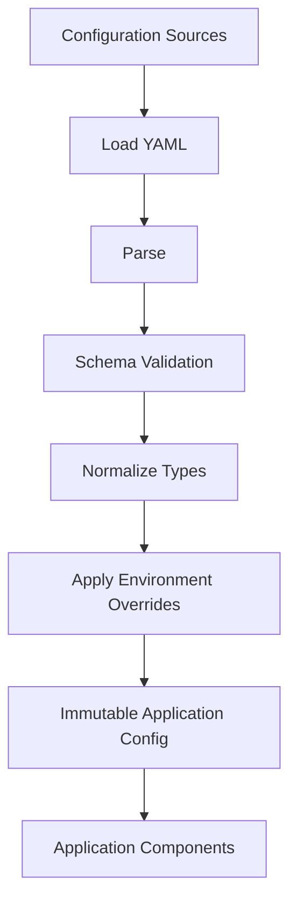

# 07- YAML

## Overview

YAML (YAML Ain't Markup Language) is a human-oriented data serialization format commonly used for configuration, infrastructure definitions, deployment manifests, and application settings.

Compared with JSON, YAML is generally more expressive and easier for humans to edit. It supports features such as:

- mappings
- sequences
- scalar values
- comments
- multiline strings
- anchors and aliases
- multiple scalar styles

Python does not include a YAML parser in its standard library. The most common Python implementation is **PyYAML**, while projects with stricter YAML requirements may use alternatives such as `ruamel.yaml`.

YAML is particularly important in backend engineering because it appears in:

- Docker Compose
- Kubernetes manifests
- CI/CD pipelines
- application configuration
- infrastructure automation
- deployment tooling
- test fixtures
- cloud configuration

The engineering challenge with YAML is not syntax. It is controlling **ambiguity, parser behavior, security, configuration precedence, and schema validation**.

---

## YAML Data Model

YAML represents structured data using mappings, sequences, and scalar values.

A simple YAML document:

```yaml
name: order-service
environment: production
port: 8000
debug: false
```

The approximate Python representation is:

```python
{
    "name": "order-service",
    "environment": "production",
    "port": 8000,
    "debug": False,
}
```

Nested mappings are expressed through indentation:

```yaml
database:
  host: postgres
  port: 5432
  name: orders
```

The equivalent Python structure is:

```python
{
    "database": {
        "host": "postgres",
        "port": 5432,
        "name": "orders",
    }
}
```

---

## Why YAML Exists

JSON is excellent for machine-readable interchange, but configuration files often need additional human-oriented features.

YAML provides:

- comments
- less punctuation
- multiline text
- anchors and aliases
- more expressive scalar representations
- readable nested configuration

For example:

```yaml
# Production database configuration
database:
  host: postgres.internal
  port: 5432
  pool_size: 20
```

The same structure in JSON is more verbose:

```json
{
  "database": {
    "host": "postgres.internal",
    "port": 5432,
    "pool_size": 20
  }
}
```

YAML is therefore often used as a **configuration language**, while JSON is frequently used as an **API interchange format**.

---

## YAML vs JSON

| Capability | YAML | JSON |
|---|---|---|
| Human readability | Excellent | Good |
| Comments | Yes | No |
| API interchange | Good | Excellent |
| Configuration | Excellent | Good |
| Standard-library Python support | No | Yes |
| Syntax complexity | Higher | Lower |
| Parser ambiguity | Higher | Lower |
| Multiline text | Excellent | More verbose |
| Anchors/aliases | Yes | No |
| Security considerations | Significant | Lower |
| Kubernetes usage | Common | Supported |

The more expressive syntax of YAML is also one of its risks.

For public APIs, JSON is usually the better default. For configuration and infrastructure, YAML is often appropriate.

---

## YAML Installation

PyYAML is commonly installed with:

```bash
python -m pip install PyYAML
```

A production project should pin dependencies through its dependency-management strategy rather than relying on an unversioned installation.

For example:

```text
requirements.txt
pyproject.toml
uv.lock
poetry.lock
```

The exact mechanism depends on the project.

---

## Basic YAML Parsing with PyYAML

Import the library:

```python
import yaml
```

Parse a YAML string:

```python
import yaml

text = """
service:
  name: order-service
  port: 8000
"""

config = yaml.safe_load(text)

print(config["service"]["name"])
```

Result:

```text
order-service
```

The parsed structure is composed primarily of Python dictionaries, lists, and scalar values.

---

## `safe_load()`

For application configuration, prefer:

```python
yaml.safe_load(data)
```

rather than:

```python
yaml.load(data)
```

`safe_load()` restricts the types of objects that can be constructed from YAML.

Example:

```python
from pathlib import Path
import yaml

path = Path("config.yaml")

with path.open("r", encoding="utf-8") as file:
    config = yaml.safe_load(file)
```

This should be the default for untrusted or externally controlled YAML.

---

## Why `safe_load()` Matters

YAML is more than a simple dictionary syntax. Some YAML loaders can construct Python-specific objects.

That means unsafe deserialization can potentially become a code-execution vulnerability.

The security boundary is:

```text
Untrusted YAML
      │
      ▼
Safe YAML parser
      │
      ▼
Plain Python data
      │
      ▼
Validation
      │
      ▼
Application
```

Do not deserialize untrusted YAML using an unsafe loader merely because the file "looks like configuration."

---

## `safe_dump()`

To serialize Python data to YAML:

```python
import yaml

config = {
    "service": {
        "name": "order-service",
        "port": 8000,
    }
}

text = yaml.safe_dump(
    config,
    sort_keys=False,
)

print(text)
```

Result:

```yaml
service:
  name: order-service
  port: 8000
```

`safe_dump()` avoids representing arbitrary Python-specific objects.

---

## `dump()` vs `safe_dump()`

| Function | Purpose | Recommendation |
|---|---|---|
| `safe_load()` | Parse YAML safely | Default |
| `load()` | Parse YAML with broader object construction | Avoid for untrusted data |
| `safe_dump()` | Serialize standard data types | Default |
| `dump()` | Serialize broader Python types | Use only intentionally |

The important rule is to treat YAML parsing as a deserialization boundary.

---

## YAML File Reading

A production configuration loader should explicitly control:

- encoding
- path
- parser
- missing files
- malformed YAML
- schema validation

Example:

```python
from pathlib import Path

import yaml


def load_yaml_config(path: Path) -> dict:
    with path.open("r", encoding="utf-8") as file:
        data = yaml.safe_load(file)

    if not isinstance(data, dict):
        raise ValueError("configuration root must be a mapping")

    return data
```

This establishes a useful invariant: callers receive a mapping rather than an arbitrary YAML value.

---

## YAML File Writing

```python
from pathlib import Path

import yaml


def write_yaml_config(path: Path, config: dict) -> None:
    with path.open("w", encoding="utf-8") as file:
        yaml.safe_dump(
            config,
            file,
            sort_keys=False,
            default_flow_style=False,
        )
```

For production configuration, consider atomic replacement when configuration files can be read concurrently.

---

## YAML Scalars

Common scalar types include:

```yaml
name: order-service
port: 8000
enabled: true
ratio: 0.75
description: null
```

These may become:

```python
{
    "name": "order-service",
    "port": 8000,
    "enabled": True,
    "ratio": 0.75,
    "description": None,
}
```

The exact interpretation can depend on the YAML specification and parser version.

This is one reason explicit quoting is valuable for ambiguous configuration values.

---

## Strings and Quoting

YAML supports plain strings:

```yaml
environment: production
```

Single-quoted strings:

```yaml
environment: 'production'
```

Double-quoted strings:

```yaml
environment: "production"
```

When a value could be interpreted as another YAML type, quote it explicitly.

For example:

```yaml
version: "1.0"
port_name: "08080"
```

This makes the intended type clearer.

---

## Boolean Ambiguity

YAML implementations and YAML versions have historically differed in how certain scalar values are interpreted.

Values such as:

```yaml
enabled: yes
disabled: no
```

can create portability concerns.

Prefer explicit YAML booleans:

```yaml
enabled: true
disabled: false
```

When a value must be a string:

```yaml
status: "yes"
```

Explicitness reduces parser-dependent behavior.

---

## Null Values

YAML can represent null:

```yaml
description: null
```

or:

```yaml
description:
```

Both can result in:

```python
None
```

Do not confuse:

```yaml
description: ""
```

with:

```yaml
description: null
```

The first is an empty string; the second represents no value.

---

## Lists

YAML sequences commonly use `-`:

```yaml
allowed_regions:
  - ap-south-1
  - ap-southeast-1
  - us-east-1
```

Python:

```python
{
    "allowed_regions": [
        "ap-south-1",
        "ap-southeast-1",
        "us-east-1",
    ]
}
```

Nested structures are common:

```yaml
workers:
  - name: emails
    concurrency: 4
  - name: reports
    concurrency: 2
```

---

## Flow Style

YAML also supports JSON-like flow syntax:

```yaml
regions: [ap-south-1, us-east-1]
```

and:

```yaml
database: {host: postgres, port: 5432}
```

Block style is generally easier to maintain for larger configuration files.

Flow style can be useful for short collections.

---

## Comments

Comments begin with `#`:

```yaml
# Database connection settings
database:
  host: postgres
  port: 5432
```

Comments are one of YAML's major advantages for configuration.

However, comments are not generally preserved as semantic data when loading and re-dumping through standard serialization workflows.

If preserving formatting and comments is a requirement, use tooling designed for round-trip YAML editing.

---

## Multiline Strings

Literal block style preserves line breaks:

```yaml
description: |
  This service processes
  asynchronous order events.
```

Folded block style folds most line breaks:

```yaml
description: >
  This is a long description
  that can be written across
  multiple lines.
```

This is useful for:

- documentation
- certificates
- scripts
- SQL
- shell commands
- templates

Be careful with indentation because whitespace is part of YAML's block-scalar semantics.

---

## Configuration Example

A realistic backend configuration might look like:

```yaml
application:
  name: order-service
  environment: production

server:
  host: 0.0.0.0
  port: 8000

database:
  host: postgres.internal
  port: 5432
  name: orders
  pool_size: 20

redis:
  host: redis.internal
  port: 6379

logging:
  level: INFO
```

The application should not automatically trust this structure.

It should parse and validate it.

---

## Configuration Loading Architecture

A production configuration flow should look like:



Possible configuration sources include:

- YAML files
- environment variables
- command-line arguments
- secret managers
- AWS Parameter Store
- AWS Secrets Manager

The application should establish one clear configuration object rather than allowing every component to independently read YAML files and environment variables.

---

## YAML Configuration and Environment Variables

Do not commit secrets directly into YAML:

```yaml
database:
  password: super-secret-password
```

Prefer:

```yaml
database:
  host: postgres.internal
  username: app
  password_env: DATABASE_PASSWORD
```

Then resolve the environment variable in Python:

```python
import os

password = os.environ["DATABASE_PASSWORD"]
```

For production systems, secrets may instead come from:

- Kubernetes Secrets
- AWS Secrets Manager
- AWS Systems Manager Parameter Store
- a dedicated secret-management platform

---

## YAML and Docker Compose

Docker Compose commonly uses YAML:

```yaml
services:
  api:
    build: .
    ports:
      - "8000:8000"
    environment:
      DATABASE_HOST: postgres

  postgres:
    image: postgres:18
```

The YAML describes desired service configuration.

Docker Compose then interprets that document according to its own schema.

This demonstrates an important principle:

> YAML provides syntax; the consuming application defines the actual semantics.

---

## YAML and Kubernetes

Kubernetes manifests are commonly written in YAML:

```yaml
apiVersion: apps/v1
kind: Deployment
metadata:
  name: order-api
spec:
  replicas: 3
  selector:
    matchLabels:
      app: order-api
  template:
    metadata:
      labels:
        app: order-api
    spec:
      containers:
        - name: api
          image: example/order-api:1.4.0
          ports:
            - containerPort: 8000
```

Kubernetes validates the resulting object against its API schema.

The workflow is:

```text
YAML
  │
  ▼
YAML parsing
  │
  ▼
Kubernetes object
  │
  ▼
API validation
  │
  ▼
Admission / policy
  │
  ▼
Cluster state
```

YAML itself does not guarantee that a Kubernetes manifest is valid.

---

## YAML and CI/CD

CI/CD systems frequently use YAML to define workflows.

For example, a pipeline might define:

```yaml
steps:
  - run: python -m pytest
  - run: python -m ruff check .
  - run: python -m build
```

Production CI/CD YAML should be treated as executable infrastructure configuration.

Review it with the same rigor as application code.

Consider:

- permissions
- secret exposure
- dependency pinning
- artifact integrity
- branch protections
- deployment approvals
- environment separation

---

## YAML and AWS

YAML commonly appears in AWS tooling and infrastructure workflows.

Examples include:

- CloudFormation templates
- SAM templates
- CI/CD configuration
- deployment configuration
- application configuration

A YAML document may ultimately control infrastructure creation.

Therefore:

```text
YAML edit
    │
    ▼
CI/CD
    │
    ▼
Infrastructure tool
    │
    ▼
AWS API
    │
    ▼
Production infrastructure
```

A syntax error may fail a pipeline, while a semantically valid but incorrect configuration can create operational incidents.

---

## Schema Validation

Parsing only answers:

> "Is this valid YAML?"

It does not answer:

> "Does this configuration satisfy the application's contract?"

Suppose:

```yaml
server:
  port: "invalid"
```

The YAML can be syntactically valid while being operationally incorrect.

Validate configuration after parsing.

Possible approaches include:

- Pydantic
- JSON Schema
- Cerberus
- custom validation
- consumer-specific schema validation

---

## YAML with Pydantic

A typed configuration model provides stronger guarantees.

```python
from pydantic import BaseModel, Field


class ServerConfig(BaseModel):
    host: str
    port: int = Field(gt=0, le=65535)


class AppConfig(BaseModel):
    server: ServerConfig
```

Load and validate:

```python
import yaml

with open("config.yaml", encoding="utf-8") as file:
    raw_config = yaml.safe_load(file)

config = AppConfig.model_validate(raw_config)
```

Now downstream code can operate on validated configuration rather than arbitrary dictionaries.

---

## Configuration Immutability

Once configuration has been loaded and validated, changing it dynamically can create inconsistent application state.

For example:

```text
Component A → old database host
Component B → new database host
Component C → old timeout
```

A safer pattern is:

```text
Load
  ↓
Validate
  ↓
Normalize
  ↓
Freeze / establish immutable config
  ↓
Inject into application
```

Immutable configuration reduces hidden state and makes behavior easier to reason about.

---

## YAML Anchors and Aliases

YAML supports anchors:

```yaml
defaults: &defaults
  timeout: 30
  retries: 3

api:
  <<: *defaults
  endpoint: /orders

worker:
  <<: *defaults
  concurrency: 4
```

Anchors can reduce duplication.

However, they can also make configuration harder to understand.

Use them when they clearly improve maintainability, not simply because the feature exists.

---

## Merge Keys and Portability

YAML merge behavior is an area where tooling and YAML versions can differ.

For infrastructure configurations that are consumed by external systems, verify that the target parser supports the constructs being used.

Do not assume:

```yaml
<<: *defaults
```

has identical behavior across every YAML implementation.

Portability is especially important when configuration moves between:

- local development
- CI
- deployment tooling
- Kubernetes
- cloud tooling

---

## YAML Aliases and Recursive Structures

Aliases can create shared or recursive object structures.

Conceptually:

```yaml
node: &node
  child: *node
```

Not every downstream system expects recursive data.

Avoid advanced YAML object features unless the consuming system explicitly supports them.

Configuration should optimize for predictability, not language expressiveness.

---

## Multiple Documents

YAML can contain multiple documents in one stream:

```yaml
---
name: service-a
---
name: service-b
```

PyYAML provides:

```python
yaml.safe_load_all(text)
```

Example:

```python
import yaml

with open("resources.yaml", encoding="utf-8") as file:
    documents = list(yaml.safe_load_all(file))
```

This is useful when a tool intentionally expects multiple YAML documents, such as some Kubernetes workflows.

Do not use multi-document YAML merely to avoid creating separate configuration files.

---

## YAML Streaming

For multiple YAML documents:

```python
import yaml

with open("resources.yaml", encoding="utf-8") as file:
    for document in yaml.safe_load_all(file):
        process(document)
```

This can avoid materializing all documents simultaneously.

However, YAML parsing can still be CPU-intensive and memory-heavy depending on document complexity.

For large record-oriented datasets, YAML is generally not the appropriate data-processing format.

---

## YAML and Large Data

YAML is optimized primarily for human-oriented configuration, not high-volume data interchange.

Avoid using YAML for:

- millions of records
- large event streams
- high-throughput APIs
- large analytical datasets

Prefer:

- JSONL for simple streaming records
- Parquet for analytical workloads
- Avro/Protobuf for schema-oriented event systems
- database storage for transactional data

---

## Performance Considerations

YAML parsing is generally more computationally expensive than parsing simpler formats such as JSON.

Potential costs include:

- lexical parsing
- indentation handling
- scalar interpretation
- alias processing
- object construction

For startup configuration, this cost is usually negligible.

For high-frequency request processing, parsing configuration YAML on every request is a design error.

Load configuration once during application startup.

---

## Do Not Parse Configuration Per Request

Bad:

```python
def handle_request(request):
    with open("config.yaml", encoding="utf-8") as file:
        config = yaml.safe_load(file)

    return process(request, config)
```

Better:

```python
config = load_config()


def handle_request(request):
    return process(request, config)
```

Configuration should normally be initialized once and injected into components.

---

## YAML and Concurrency

Configuration files are usually read concurrently by multiple processes without issue.

Problems arise when processes write the same file.

Potential failure modes include:

- partial writes
- corrupted YAML
- readers observing inconsistent state
- race conditions
- lost updates

For writable configuration, use atomic replacement:

```text
Write temporary file
       │
       ▼
Flush / fsync as appropriate
       │
       ▼
Atomic replace
       │
       ▼
Configuration becomes visible
```

For distributed systems, avoid using a shared YAML file as a configuration database.

Use an appropriate configuration or secret-management system instead.

---

## YAML in Containers

In Docker containers, configuration can be provided through:

- mounted files
- environment variables
- Docker secrets
- external configuration services

Example:

```text
Container
 ├── application image
 ├── config.yaml
 └── environment variables
```

Keep environment-specific configuration outside the immutable application image where practical.

Do not bake production secrets into Docker images.

---

## YAML in Kubernetes

Kubernetes ConfigMaps can provide non-secret configuration, while Secrets are intended for sensitive values.

A common architecture is:

```text
Git repository
     │
     ▼
Kubernetes manifests
     │
     ├── ConfigMap
     │
     └── Secret reference
             │
             ▼
         Application Pod
```

Avoid putting actual credentials directly into Git-tracked YAML.

Also remember that Kubernetes Secret manifests are not automatically equivalent to strong secret-management controls merely because the values are encoded.

---

## Security Considerations

YAML deserves stronger security attention than many engineers initially expect.

### Unsafe Deserialization

Avoid unsafe loaders for untrusted YAML.

Use:

```python
yaml.safe_load(data)
```

### Secret Exposure

Do not commit:

```yaml
password: production-password
api_key: secret-key
```

### Supply-Chain Risk

A YAML file can influence deployment systems, CI/CD, infrastructure, and automation.

Review changes to:

- Kubernetes manifests
- CI/CD pipelines
- CloudFormation
- deployment configuration

as security-sensitive changes.

### Resource Exhaustion

Large or deeply nested YAML documents can consume significant CPU and memory.

Apply size limits to untrusted inputs.

---

## Configuration Precedence

Real applications often have several configuration sources.

For example:

```text
Default values
      │
      ▼
YAML configuration
      │
      ▼
Environment variables
      │
      ▼
Command-line arguments
      │
      ▼
Runtime overrides
```

The exact precedence should be documented and deterministic.

Avoid having different modules implement their own precedence rules.

---

## Environment-Specific Configuration

A project might contain:

```text
config/
├── base.yaml
├── development.yaml
├── staging.yaml
└── production.yaml
```

This can work for non-secret configuration.

However, environment-specific configuration should not become a large inheritance hierarchy that is difficult to reason about.

A common production approach is:

```text
Base configuration
       +
Environment variables
       +
Secret manager
       =
Runtime configuration
```

---

## Configuration Validation at Startup

Fail fast when required configuration is invalid.

```text
Application startup
       │
       ▼
Load configuration
       │
       ▼
Validate
       │
   ┌───┴────┐
   │        │
 invalid   valid
   │        │
   ▼        ▼
exit      start
```

For Kubernetes, this allows an invalid deployment to fail clearly rather than starting a pod that will repeatedly fail requests.

---

## Reliability and Deployment

Configuration is part of the deployment artifact.

A reliable deployment process should:

- validate YAML syntax
- validate application schemas
- run linting
- run policy checks
- test configuration changes
- use CI/CD gates
- review production changes
- support rollback

Example CI workflow:

```text
Pull Request
     │
     ▼
YAML syntax validation
     │
     ▼
Schema validation
     │
     ▼
Security / policy checks
     │
     ▼
Application tests
     │
     ▼
Deployment
```

---

## Testing YAML Configuration

Test both valid and invalid configuration.

```python
from pathlib import Path

import yaml


def test_config_loads():
    path = Path("tests/fixtures/config.yaml")

    with path.open(encoding="utf-8") as file:
        config = yaml.safe_load(file)

    assert config["server"]["port"] == 8000
```

Also test:

- missing required fields
- incorrect types
- invalid ranges
- unknown fields
- malformed YAML
- environment overrides
- production-specific requirements

Schema validation tests are more valuable than merely testing that a YAML file parses.

---

## Testing Configuration Contracts

For infrastructure and deployment YAML, test the resulting semantics.

For Kubernetes, for example:

```text
YAML
  │
  ▼
Render templates
  │
  ▼
Validate manifests
  │
  ▼
Policy checks
  │
  ▼
Deploy to test environment
```

A YAML file can be syntactically valid while containing:

- incorrect image tags
- invalid resource limits
- incorrect service selectors
- missing probes
- excessive permissions

Syntax checking is only the first layer.

---

## YAML Linting

YAML linters can detect:

- indentation problems
- duplicate keys
- formatting issues
- suspicious values
- style inconsistencies

A CI pipeline might include:

```bash
yamllint .
```

The exact rules should be standardized across the repository.

---

## Common Mistakes and Pitfalls

### Incorrect Indentation

YAML structure depends heavily on indentation.

Bad:

```yaml
database:
 host: postgres
  port: 5432
```

Correct:

```yaml
database:
  host: postgres
  port: 5432
```

### Mixing Tabs and Spaces

Use spaces consistently. Tabs can produce parsing failures or confusing formatting behavior.

### Ambiguous Scalar Values

Avoid relying on parser-specific interpretation.

Prefer:

```yaml
enabled: true
```

instead of:

```yaml
enabled: yes
```

### Storing Secrets in YAML

Do not commit production credentials to configuration files.

### Using Unsafe Loaders

Do not use broad Python-object construction for untrusted YAML.

### Assuming Parsing Means Validation

A successfully parsed document can still violate the application's configuration contract.

### Excessive Anchors

Anchors can reduce duplication but make configuration harder to understand and debug.

### Parsing on Every Request

Load configuration during startup rather than repeatedly parsing the same file.

### Using YAML for Large Data

YAML is usually the wrong format for large-scale data processing.

### Relying on Implicit Types

Explicitly quote values when their intended type could be ambiguous.

### Treating Infrastructure YAML as "Just Configuration"

Kubernetes and CI/CD YAML can control production infrastructure and security boundaries.

Review it accordingly.

---

## Interview Traps

### Is YAML a programming language?

No. YAML is primarily a data serialization/configuration format. Its expressive features can make it look programming-language-like, but its role is representing structured data.

### Is YAML a superset of JSON?

Modern YAML specifications are designed so JSON documents can be interpreted as YAML, but compatibility details depend on YAML versions and parsers. Do not reduce YAML's behavior to "JSON with comments."

### Why use `safe_load()`?

It restricts object construction and is the appropriate default for parsing YAML as data, particularly when input is not fully trusted.

### Why can YAML be dangerous?

Its richer type system and object-construction capabilities in some loaders can create security risks, and complex YAML can introduce parsing and resource-exhaustion concerns.

### Is YAML better than JSON?

Neither is universally better.

Use JSON when you prioritize:

- API interoperability
- predictable syntax
- simpler parsing semantics

Use YAML when you prioritize:

- human-maintained configuration
- comments
- multiline values
- infrastructure configuration

### Why should configuration be validated after parsing?

Parsing validates syntax. It does not establish application-level invariants such as required fields, numeric ranges, allowed values, or cross-field constraints.

### Why should configuration usually be loaded at startup?

Repeated parsing adds unnecessary CPU and I/O overhead and can create inconsistent configuration state during requests.

---

## Production Best Practices

### Prefer Explicit Configuration

Prefer:

```yaml
server:
  port: 8000
  debug: false
```

over relying on implicit defaults scattered throughout application code.

### Validate at the Boundary

Parse and validate YAML before passing configuration deeper into the application.

### Keep Configuration Immutable

Once configuration is validated, expose it through a stable application configuration object.

### Separate Secrets

Keep secrets in:

- environment injection
- Kubernetes Secrets
- AWS Secrets Manager
- AWS Systems Manager Parameter Store

rather than Git-tracked YAML.

### Fail Fast

Reject invalid configuration during startup.

### Version Configuration Contracts

Changes to configuration schemas should be reviewed like API changes.

### Keep YAML Simple

Prefer straightforward mappings and sequences over advanced YAML features unless they provide clear value.

### Automate Validation

Run YAML linting, schema validation, security checks, and deployment validation in CI/CD.

### Use YAML for Configuration, Not Everything

Do not select YAML merely because it is readable. Choose a format based on the workload and system boundary.

---

## YAML vs Common Serialization Formats

| Format | Primary use | Human-readable | Streaming-friendly | Schema support | Python standard library |
|---|---|---:|---:|---:|---:|
| YAML | Configuration | Excellent | Moderate | External | No |
| JSON | APIs / interchange | Good | Moderate | External | Yes |
| JSONL | Event/data streams | Good | Excellent | External | Yes |
| CSV | Tabular exchange | Good | Excellent | Weak | Yes |
| Pickle | Python object persistence | No | Limited | Python-specific | Yes |
| Protobuf | Service/event transport | No | Excellent | Strong | No |
| Parquet | Analytical data | No | Excellent | Strong | No |

The format should follow the system boundary rather than personal preference.

---

## Practical Configuration Loader

A production-oriented loader can combine YAML parsing with validation:

```python
from pathlib import Path

import yaml
from pydantic import BaseModel, Field


class DatabaseConfig(BaseModel):
    host: str
    port: int = Field(gt=0, le=65535)
    name: str
    pool_size: int = Field(gt=0)


class ServerConfig(BaseModel):
    host: str
    port: int = Field(gt=0, le=65535)


class AppConfig(BaseModel):
    server: ServerConfig
    database: DatabaseConfig


def load_config(path: Path) -> AppConfig:
    with path.open("r", encoding="utf-8") as file:
        raw_config = yaml.safe_load(file)

    if not isinstance(raw_config, dict):
        raise ValueError("configuration root must be a mapping")

    return AppConfig.model_validate(raw_config)
```

Application startup:

```python
from pathlib import Path

config = load_config(
    Path("/etc/order-service/config.yaml")
)
```

Downstream components receive `config` rather than opening and parsing the YAML file themselves.

---

## Recommended Architecture

For a production Python service:

```text
                   ┌──────────────────────┐
                   │ YAML Configuration   │
                   └──────────┬───────────┘
                              │
                              ▼
                   ┌──────────────────────┐
                   │ Safe YAML Parser      │
                   │ safe_load()           │
                   └──────────┬───────────┘
                              │
                              ▼
                   ┌──────────────────────┐
                   │ Schema Validation     │
                   │ Pydantic / Schema     │
                   └──────────┬───────────┘
                              │
              ┌───────────────┴────────────────┐
              │                                │
              ▼                                ▼
     Environment / Secrets             Application Defaults
              │                                │
              └───────────────┬────────────────┘
                              ▼
                   ┌──────────────────────┐
                   │ Runtime Config       │
                   │ Immutable / Typed    │
                   └──────────┬───────────┘
                              │
              ┌───────────────┼────────────────┐
              ▼               ▼                ▼
           FastAPI          Celery          DB Client
```

The configuration layer becomes a controlled boundary instead of a collection of ad hoc file reads.

---

## Key Takeaways

- YAML is primarily a human-oriented configuration and serialization format; its richer syntax makes it useful for infrastructure but also introduces more parser and portability concerns than JSON.
- Use `yaml.safe_load()` and `yaml.safe_dump()` for normal application data handling, and never use unsafe YAML object construction for untrusted input.
- Parsing YAML is only syntax processing; production applications should validate the resulting structure, types, ranges, and domain rules before using configuration.
- Keep secrets outside Git-tracked YAML, load configuration once at startup, establish deterministic precedence, and expose validated configuration through a stable application boundary.
- Treat Kubernetes, CI/CD, Docker, and AWS YAML as production code: lint, validate, security-check, test, review, and version configuration changes through CI/CD.