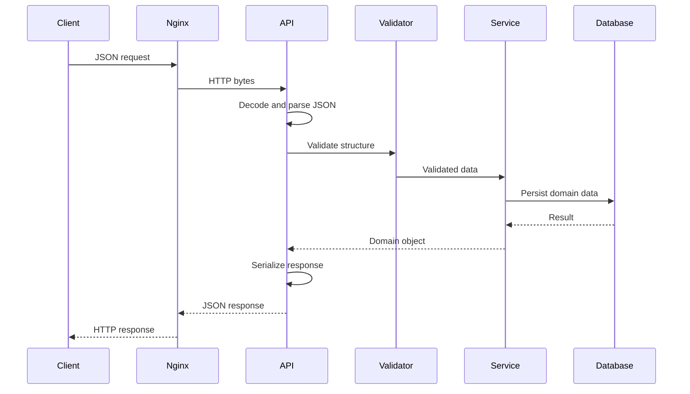
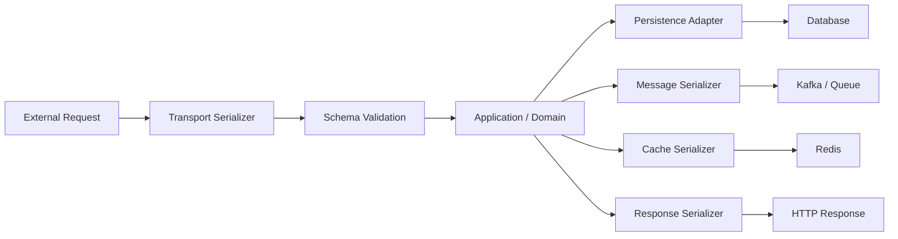

# 09- Serialization

## Overview

Serialization is the process of converting an in-memory data structure or object into a representation that can be:

- stored
- transmitted
- cached
- queued
- logged
- reconstructed later

Deserialization performs the reverse operation.

```text
In-memory data
      │
      │ Serialization
      ▼
Portable representation
      │
      ├── File
      ├── Database
      ├── Redis
      ├── Kafka
      ├── HTTP
      └── Object storage
      │
      │ Deserialization
      ▼
In-memory data
```

Serialization is therefore a boundary between application memory and an external representation.

In Python, common serialization formats include:

- JSON
- YAML
- Pickle
- CSV
- Protobuf
- MessagePack
- Avro
- Parquet

The correct format depends on the boundary, trust model, performance requirements, schema requirements, and lifecycle of the data.

---

## Why Serialization Matters

Backend applications constantly move data between different systems.

A typical request may follow:

```text
HTTP JSON
   │
   ▼
Python objects
   │
   ▼
PostgreSQL
   │
   ▼
Python objects
   │
   ▼
Redis
   │
   ▼
Python objects
   │
   ▼
HTTP JSON
```

Every transition can involve a serialization or deserialization step.

Poor serialization decisions can cause:

- security vulnerabilities
- compatibility failures
- excessive CPU usage
- excessive memory usage
- large network payloads
- difficult migrations
- data corruption
- tightly coupled services

Serialization is therefore an architectural concern, not merely a utility operation.

---

## Serialization vs Encoding vs Parsing

These concepts are related but distinct.

| Concept | Meaning |
|---|---|
| Serialization | Convert structured data into a representation |
| Deserialization | Reconstruct structured data from a representation |
| Encoding | Convert characters/data into another byte representation |
| Decoding | Convert encoded bytes back |
| Parsing | Interpret structured syntax |
| Validation | Verify that data satisfies a defined contract |

For example:

```text
Python dict
    │
    │ serialization
    ▼
JSON string
    │
    │ UTF-8 encoding
    ▼
HTTP bytes
```

On the receiving side:

```text
HTTP bytes
    │
    │ UTF-8 decoding
    ▼
JSON text
    │
    │ parsing
    ▼
Python data
    │
    │ validation
    ▼
Application object
```

Keeping these responsibilities conceptually separate makes system behavior easier to reason about.

---

## Serialization Boundaries

A serialization boundary exists whenever data crosses from one representation or system into another.

Common boundaries include:

| Boundary | Typical format |
|---|---|
| REST API | JSON |
| Browser → backend | JSON / form data |
| Microservice → microservice | JSON / Protobuf |
| Kafka event | JSON / Avro / Protobuf |
| Redis cache | JSON / Pickle / MessagePack |
| PostgreSQL | Native SQL types / JSONB |
| Object storage | JSON / Parquet / binary |
| Process-to-process Python | Pickle |
| Analytical pipeline | Parquet |
| Configuration | YAML / JSON |

The serialization format should be selected based on the boundary rather than applied globally.

---

## Python's Serialization Model

Python objects exist in memory as runtime objects.

For example:

```python
order = {
    "id": 1001,
    "status": "paid",
}
```

The object is not automatically suitable for transmission over a network.

Serialization produces an external representation:

```python
import json

serialized = json.dumps(order)
```

Now:

```text
dict
 ↓
JSON string
```

Deserialization reverses it:

```python
restored = json.loads(serialized)
```

The result is another Python object graph representing the serialized data.

---

## Serialization Is Not Always Lossless

A serialization format may not represent every property of the original object.

For example:

```python
from datetime import datetime, timezone

value = {
    "created_at": datetime.now(timezone.utc),
}
```

JSON does not have a native `datetime` type.

The application must choose a representation:

```python
{
    "created_at": "2026-09-06T12:00:00+00:00"
}
```

This introduces a serialization contract.

Similar decisions are required for:

- `Decimal`
- `UUID`
- `Enum`
- `set`
- custom classes
- binary data
- timezone-aware timestamps

---

## Data Contract

A serialization format becomes much more useful when paired with an explicit contract.

For example:

```json
{
  "order_id": "ORD-1001",
  "amount": "125.50",
  "currency": "USD",
  "created_at": "2026-09-06T12:00:00Z"
}
```

The contract defines:

- field names
- types
- required fields
- optional fields
- allowed values
- semantic meaning
- versioning behavior

The serialization format answers:

> How is the data represented?

The schema answers:

> What does the data mean?

---

## Serialization and Validation

Serialization should not be confused with validation.

This is valid JSON:

```json
{
  "quantity": -10
}
```

but it may violate the application's domain rules.

A robust pipeline is:

```text
External representation
        │
        ▼
Deserialization
        │
        ▼
Schema validation
        │
        ▼
Domain validation
        │
        ▼
Application object
```

Validation should happen at system boundaries rather than relying on internal code to repeatedly defend against malformed structures.

---

## JSON Serialization

JSON is the most common general-purpose serialization format for Python backend APIs.

```python
import json

order = {
    "id": 1001,
    "status": "paid",
}

payload = json.dumps(order)
```

Deserialization:

```python
order = json.loads(payload)
```

Advantages:

- interoperable
- human-readable
- broadly supported
- simple
- suitable for REST APIs

Limitations:

- limited type system
- larger payloads than many binary formats
- parsing overhead
- explicit conversion required for Python-specific types

---

## YAML Serialization

YAML is commonly used for configuration.

```python
import yaml

config = {
    "server": {
        "host": "0.0.0.0",
        "port": 8000,
    }
}

text = yaml.safe_dump(
    config,
    sort_keys=False,
)
```

Use `safe_load()` and `safe_dump()` for normal data handling.

YAML is generally better suited to:

- configuration
- infrastructure manifests
- deployment definitions

than to:

- public APIs
- high-throughput events
- large datasets

---

## Pickle Serialization

Pickle serializes Python object graphs:

```python
import pickle

payload = {
    "job_id": 1001,
    "status": "pending",
}

data = pickle.dumps(payload)
```

It can preserve Python-specific structures that JSON cannot.

However:

```python
pickle.loads(untrusted_data)
```

is unsafe.

Pickle should only be used across tightly controlled trust boundaries.

---

## CSV Serialization

CSV represents tabular data.

```python
import csv

rows = [
    {
        "id": "1001",
        "status": "paid",
    },
    {
        "id": "1002",
        "status": "pending",
    },
]

with open(
    "orders.csv",
    "w",
    newline="",
    encoding="utf-8",
) as file:
    writer = csv.DictWriter(
        file,
        fieldnames=["id", "status"],
    )
    writer.writeheader()
    writer.writerows(rows)
```

CSV is useful for:

- data exports
- imports
- ETL
- spreadsheet interoperability

It is not a strong choice for nested application objects or typed service contracts.

---

## Binary Serialization

Binary formats are often chosen when:

- payload size matters
- latency matters
- throughput is high
- schema enforcement matters

Common formats include:

- Protobuf
- Avro
- MessagePack

A simplified architecture:

```text
Python object
     │
     ▼
Binary serializer
     │
     ▼
Compact bytes
     │
     ▼
Network / Kafka / storage
```

Binary does not automatically mean better. Schema governance, tooling, compatibility, and operational complexity must also be considered.

---

## Serialization Format Comparison

| Format | Human-readable | Cross-language | Schema strength | Typical use |
|---|---:|---:|---:|---|
| JSON | Yes | Excellent | External | REST APIs |
| YAML | Yes | Excellent | External | Configuration |
| Pickle | No | Poor | Python-specific | Controlled Python state |
| CSV | Yes | Excellent | Weak | Tabular exchange |
| Protobuf | No | Excellent | Strong | gRPC / events |
| Avro | No | Excellent | Strong | Kafka / data pipelines |
| Parquet | No | Excellent | Strong | Analytics |
| MessagePack | No | Good | Moderate | Compact messages |

---

## Request Serialization Lifecycle

A typical REST request:



The serialization layer sits directly on the boundary between transport and application logic.

---

## Serialization in FastAPI

FastAPI uses Pydantic models for typed request and response handling.

```python
from fastapi import FastAPI
from pydantic import BaseModel


class OrderResponse(BaseModel):
    id: str
    status: str


app = FastAPI()


@app.get("/orders/{order_id}", response_model=OrderResponse)
async def get_order(order_id: str) -> OrderResponse:
    return OrderResponse(
        id=order_id,
        status="paid",
    )
```

The framework handles much of the serialization pipeline.

The application should still define:

- stable schemas
- domain validation
- versioning
- sensitive-field handling

---

## Serialization in Django

Django provides JSON response support:

```python
from django.http import JsonResponse


def order_status(request):
    return JsonResponse(
        {
            "id": "ORD-1001",
            "status": "paid",
        }
    )
```

For more complex APIs, serializers or schema libraries should establish explicit request and response contracts.

The important architectural principle is to keep serialization concerns close to the API boundary rather than allowing transport-specific structures to leak throughout the domain layer.

---

## Domain Models vs Transport Models

Avoid using one object for every boundary.

For example:

```text
HTTP JSON
   │
   ▼
API DTO
   │
   ▼
Domain model
   │
   ▼
Persistence model
```

These models may have different requirements.

An API response might expose:

```json
{
  "id": "ORD-1001",
  "status": "paid"
}
```

while the database may contain:

```text
id
customer_id
status
payment_provider_id
created_at
updated_at
```

Separating representations prevents internal database structure from becoming an accidental public API contract.

---

## DTO Serialization

A DTO (Data Transfer Object) defines a transport-oriented representation.

Example:

```python
from dataclasses import dataclass


@dataclass(frozen=True)
class OrderDTO:
    id: str
    status: str
```

The DTO can then be serialized:

```python
import json
from dataclasses import asdict

dto = OrderDTO(
    id="ORD-1001",
    status="paid",
)

payload = json.dumps(asdict(dto))
```

This makes the serialization boundary explicit.

---

## Serialization of Dates and Times

Datetime serialization requires an agreed representation.

ISO 8601 is a common choice:

```python
from datetime import datetime, timezone

timestamp = datetime.now(timezone.utc)

value = timestamp.isoformat()
```

Example:

```text
2026-09-06T12:00:00+00:00
```

For APIs and events, UTC timestamps are generally easier to operate consistently.

Avoid ambiguous values such as:

```text
09/06/26 12:00
```

because the timezone and date interpretation are unclear.

---

## Serialization of UUIDs

UUIDs can be represented as strings:

```python
from uuid import UUID, uuid4

order_id = uuid4()

payload = {
    "order_id": str(order_id),
}
```

Result:

```json
{
  "order_id": "4f6c1d9d-..."
}
```

String representations provide excellent cross-language compatibility.

---

## Serialization of Decimal

For financial values, serialize explicitly.

```python
from decimal import Decimal

amount = Decimal("125.50")

payload = {
    "amount": str(amount),
}
```

Result:

```json
{
  "amount": "125.50"
}
```

The receiving system can reconstruct:

```python
from decimal import Decimal

amount = Decimal(payload["amount"])
```

This avoids relying on floating-point semantics across different languages and runtimes.

---

## Serialization of Enums

An enum should have a stable external representation.

```python
from enum import StrEnum


class OrderStatus(StrEnum):
    PENDING = "pending"
    PAID = "paid"
```

Serialize the stable value:

```python
payload = {
    "status": OrderStatus.PAID.value,
}
```

Avoid exposing implementation-specific names unless they are intentionally part of the contract.

---

## Serialization of Binary Data

JSON cannot directly represent arbitrary binary data.

Base64 is sometimes used:

```python
import base64

encoded = base64.b64encode(binary_data).decode("ascii")
```

This increases the representation size.

For large files, do not embed binary content inside JSON unnecessarily.

Prefer:

```text
API
 │
 ├── metadata → JSON
 │
 └── file → object storage
```

For example:

```text
Client
  │
  ▼
FastAPI
  │
  ├── metadata
  │
  └── presigned S3 upload
```

This keeps large binary data out of ordinary API payloads.

---

## Serialization and PostgreSQL

Relational databases often serialize application data into database-native representations.

For example:

```text
Python datetime
      │
      ▼
PostgreSQL timestamp
```

or:

```text
Python dict
      │
      ▼
PostgreSQL jsonb
```

Do not automatically serialize every application object into a JSON column.

Use native relational types where they provide:

- constraints
- indexing
- efficient querying
- referential integrity

Use `jsonb` for genuinely semi-structured data.

---

## Serialization and Redis

Redis commonly stores serialized application values.

Example:

```python
import json

value = json.dumps(
    {
        "status": "active",
        "attempts": 2,
    }
)

redis_client.set(
    "job:1001",
    value,
    ex=3600,
)
```

Consider:

- payload size
- serialization CPU
- cache TTL
- version compatibility
- invalidation
- compression

Cache serialization formats should generally be treated as disposable implementation details unless explicitly designed otherwise.

---

## Serialization and Kafka

Kafka messages are serialized before being written to a topic.

```text
Application object
       │
       ▼
Event serializer
       │
       ▼
Kafka bytes
       │
       ▼
Consumer
       │
       ▼
Event deserializer
```

Production event schemas should define:

- event name
- event ID
- schema version
- timestamp
- required fields
- compatibility rules

For long-lived event streams, schema-aware formats such as Protobuf or Avro can provide stronger guarantees than arbitrary JSON dictionaries.

---

## Serialization and Celery

Background task systems serialize task arguments.

```text
Web Application
      │
      │ serialized task
      ▼
Redis / RabbitMQ
      │
      ▼
Celery Worker
      │
      │ deserialize
      ▼
Task execution
```

Prefer simple, explicit task arguments:

```python
send_invoice.delay(
    invoice_id="INV-1001",
)
```

rather than passing complex mutable application objects.

This improves:

- compatibility
- observability
- retry behavior
- message size
- task reproducibility

---

## Serialization and Multiprocessing

Python process boundaries often require serialization.

```text
Parent Process
      │
      │ serialized arguments
      ▼
IPC
      │
      ▼
Worker Process
      │
      │ deserialized arguments
      ▼
Function
```

Pickle is commonly involved in these boundaries.

Large object graphs can make multiprocessing unexpectedly expensive because data must be serialized and transferred between processes.

Prefer compact arguments and move large data through appropriate shared storage when necessary.

---

## Schema Evolution

Serialization formats do not automatically solve compatibility.

Suppose version 1 produces:

```json
{
  "id": "ORD-1001",
  "status": "paid"
}
```

Version 2 adds:

```json
{
  "id": "ORD-1001",
  "status": "paid",
  "currency": "USD"
}
```

Adding optional fields is often easier to make backward compatible than changing existing field types.

Avoid changes such as:

```json
"status": "paid"
```

to:

```json
"status": {
  "code": "paid"
}
```

without a deliberate migration strategy.

---

## Backward and Forward Compatibility

Two important compatibility concepts are:

### Backward Compatibility

A newer consumer can read data produced by an older producer.

```text
Old Producer
     │
     ▼
Old Format
     │
     ▼
New Consumer
```

### Forward Compatibility

An older consumer can tolerate data produced by a newer producer.

```text
New Producer
     │
     ▼
New Format
     │
     ▼
Old Consumer
```

The exact compatibility behavior depends on the serialization format and schema rules.

---

## Versioning

Long-lived serialized data should have an explicit versioning strategy.

For example:

```json
{
  "schema_version": 2,
  "order_id": "ORD-1001",
  "status": "paid"
}
```

Versioning is particularly important for:

- Kafka events
- persisted files
- cached artifacts with long TTLs
- object storage
- external APIs
- backup data

Short-lived internal data may not require explicit schema versions if the producer and consumer are deployed together.

---

## Canonical Serialization

Sometimes equivalent data needs a deterministic representation.

For example:

```python
import json

payload = {
    "b": 2,
    "a": 1,
}

serialized = json.dumps(
    payload,
    sort_keys=True,
    separators=(",", ":"),
)
```

Deterministic serialization can be useful for:

- cache keys
- snapshots
- reproducible artifacts
- checksums
- signing workflows

However, deterministic JSON produced by a generic serializer is not necessarily equivalent to a formal canonicalization scheme required for cryptographic protocols.

---

## Serialization and Hashing

Serialization is sometimes combined with hashing:

```text
Object
  │
  ▼
Canonical representation
  │
  ▼
SHA-256
  │
  ▼
Digest
```

Example:

```python
import hashlib
import json


def digest(payload: dict) -> str:
    data = json.dumps(
        payload,
        sort_keys=True,
        separators=(",", ":"),
    ).encode("utf-8")

    return hashlib.sha256(data).hexdigest()
```

The representation must be deterministic if equivalent objects are expected to produce identical hashes.

---

## Serialization and Digital Signatures

For signed data, the serialization process is part of the security protocol.

```text
Structured data
      │
      ▼
Canonical serialization
      │
      ▼
Digest
      │
      ▼
Digital signature
```

If two systems serialize the same logical object differently, the signatures may not match.

Therefore, cryptographic protocols should specify the exact canonical serialization rules rather than relying on incidental serializer behavior.

---

## Performance Considerations

Serialization has computational cost.

For a large object:

```text
Object graph
    │
    ├── traversal
    ├── allocation
    ├── encoding
    └── output buffer
```

Deserialization also requires:

```text
Bytes
  │
  ├── parsing
  ├── allocation
  ├── object construction
  └── validation
```

Performance depends on:

- payload size
- nesting depth
- number of fields
- serializer implementation
- data types
- compression
- network speed
- CPU availability

Measure actual workloads before optimizing.

---

## Memory Considerations

Serialization can temporarily require additional memory.

For example:

```python
serialized = json.dumps(large_object)
```

can hold:

```text
large_object
     +
serialized representation
     +
intermediate allocations
```

Large API responses can therefore create memory pressure even when the source data itself fits comfortably in memory.

Use:

- pagination
- streaming
- chunked processing
- iterators
- bounded batches

for large workloads.

---

## Streaming Serialization

For large record-oriented datasets, avoid building one enormous in-memory structure.

JSONL is a practical example:

```python
import json


def write_events(events, file) -> None:
    for event in events:
        file.write(
            json.dumps(event)
        )
        file.write("\n")
```

The application processes one record at a time.

This changes the memory profile from approximately:

```text
O(total records)
```

toward:

```text
O(single record)
```

assuming the input iterator itself is streaming.

---

## Compression

Serialized data can often be compressed.

```text
Object
  │
  ▼
Serialization
  │
  ▼
Compression
  │
  ▼
Network / storage
```

Compression can reduce:

- bandwidth
- object-storage cost
- Kafka transfer volume
- API response size

But it increases CPU consumption and latency.

For small payloads, compression overhead may outweigh the savings.

---

## Network Serialization

In a microservice architecture:

```text
Service A
   │
   ├── serialize
   ▼
Network
   │
   ├── transfer
   ▼
Service B
   │
   ├── deserialize
   ▼
Application
```

Total latency includes:

```text
serialization
+
network
+
deserialization
```

For high-throughput systems, serialization can become a significant part of end-to-end latency.

This is one reason Protobuf/gRPC is frequently used for internal service communication.

---

## Security Considerations

Every deserialization boundary should be treated as a security boundary.

Questions to ask:

- Is the input trusted?
- Can an attacker modify it?
- Is the parser capable of executing code?
- Is the payload size bounded?
- Are nested structures limited?
- Are secrets present?
- Is schema validation enforced?
- Can malformed data cause excessive resource consumption?

Particularly dangerous examples include:

```python
pickle.loads(untrusted_data)
```

and unsafe YAML object construction.

---

## Input Size Limits

Network-facing applications should enforce payload limits.

Example architecture:

```text
Client
  │
  ▼
Nginx / API Gateway
  │
  ├── request-size limit
  ├── timeout
  └── rate limit
  │
  ▼
Application
  │
  ├── deserialize
  └── validate
```

The gateway should reject obviously oversized requests before expensive application processing whenever possible.

---

## Sensitive Data

Serialized objects can accidentally contain sensitive information.

For example:

```python
session = {
    "user_id": "U1001",
    "access_token": "...",
}
```

Serializing the entire object into Redis or a file may persist the token unnecessarily.

Prefer explicit structures:

```python
session = {
    "user_id": "U1001",
}
```

Store secrets through appropriate secret-management mechanisms.

---

## Observability

Serialization should be observable at important system boundaries.

Useful metrics include:

```text
serialization_duration_seconds
deserialization_duration_seconds
serialization_errors_total
deserialization_errors_total
serialized_payload_bytes
deserialized_payload_bytes
```

For APIs, also track:

- request size
- response size
- latency
- validation failures
- status codes

Do not log raw serialized payloads by default.

---

## Reliability

Serialization failures should be classified correctly.

Possible failure categories include:

- malformed input
- schema mismatch
- unsupported type
- corrupted data
- incompatible version
- parser failure
- resource exhaustion

Do not blindly retry every serialization failure.

For example:

```text
Malformed JSON
    │
    ▼
Permanent client error
```

whereas:

```text
Temporary downstream failure
    │
    ▼
Potentially retryable
```

Serialization errors are often deterministic and therefore non-retryable.

---

## Idempotency and Serialization

Serialization does not create idempotency.

A message may be serialized successfully:

```json
{
  "event_id": "evt-1001"
}
```

but processing it twice can still produce duplicate effects.

For distributed systems, combine serialization with:

- stable event IDs
- idempotency keys
- deduplication
- transactional processing
- retry-safe consumers

Serialization defines representation; it does not define delivery semantics.

---

## Disaster Recovery

Serialized data that must survive a disaster should have a defined recovery strategy.

For durable artifacts, record or otherwise establish:

- format
- schema version
- producer version
- encoding
- compression
- integrity information
- compatibility requirements

Backups should be restored in a compatible environment and tested periodically.

A backup that exists but cannot be deserialized is not a reliable recovery mechanism.

---

## Configuration Serialization

Configuration commonly uses YAML or JSON.

Example:

```yaml
database:
  host: postgres
  port: 5432
  pool_size: 20
```

A production application should:

```text
Load
  ↓
Parse
  ↓
Validate
  ↓
Normalize
  ↓
Apply overrides
  ↓
Create runtime configuration
```

Do not let individual components independently parse configuration files.

Centralized configuration handling reduces inconsistency.

---

## Serialization in CI/CD

Serialization formats can become deployment artifacts.

Examples include:

- Kubernetes manifests
- generated configuration
- test fixtures
- deployment metadata
- cached build artifacts

CI/CD should validate these artifacts before deployment.

Typical pipeline:

```text
Commit
  │
  ▼
Lint
  │
  ▼
Schema validation
  │
  ▼
Unit tests
  │
  ▼
Contract tests
  │
  ▼
Build artifact
  │
  ▼
Deploy
```

Serialization changes should be reviewed as compatibility-sensitive changes.

---

## Common Mistakes and Pitfalls

### Using Pickle for Public APIs

Pickle creates Python-specific coupling and an unsafe deserialization boundary.

Use JSON or Protobuf instead.

### Treating Serialization as Validation

A successfully serialized or parsed object may still violate domain rules.

### Serializing Database Models Directly

Database models often contain internal fields and persistence concerns that should not become API contracts.

Use DTOs or explicit response schemas.

### Serializing Entire Objects

Serialize only the fields required by the boundary.

This reduces:

- payload size
- coupling
- security exposure
- compatibility risk

### Ignoring Versioning

Long-lived messages and stored artifacts need compatibility strategies.

### Sending Large Objects Between Processes

Process serialization can dominate runtime for large object graphs.

### Using Base64 for Large Files

Base64 increases payload size and adds unnecessary encoding/decoding overhead.

Use object storage for large binary content.

### Parsing Configuration Repeatedly

Load and validate configuration once during startup.

### Logging Raw Payloads

Serialized payloads may contain credentials or sensitive information.

### Assuming Compression Is Free

Compression consumes CPU and can increase latency.

### Retrying Permanent Serialization Errors

Malformed or incompatible data usually will not become valid through retrying.

### Using JSON Everywhere

JSON is excellent for many APIs but may be inefficient for high-throughput internal protocols or analytical workloads.

---

## Interview Traps

### Is serialization the same as encoding?

No. Serialization converts structured data into a representation. Encoding converts data, often characters, into a particular byte representation.

### Is JSON serialization always reversible?

Not necessarily. JSON cannot natively represent every Python type, so information can be lost unless an explicit representation is defined.

### Why should API models differ from database models?

They serve different contracts. Separating them prevents database implementation details from becoming externally visible and allows each layer to evolve independently.

### Why is serialization expensive?

The serializer must traverse data, allocate output structures, encode values, and potentially copy large amounts of memory. Deserialization similarly parses and allocates objects.

### Why can serialization affect microservice latency?

A request may spend time serializing the request, transferring it, and deserializing it before business logic executes.

### Why is schema versioning important?

Stored messages and events can outlive the application version that produced them. Consumers therefore need a strategy for handling old and new representations.

### Does serialization guarantee idempotency?

No. Serialization only defines representation. Duplicate delivery and duplicate processing require separate idempotency mechanisms.

### Why is pickle dangerous?

Unpickling can execute code during object reconstruction, so untrusted pickle data must never be loaded.

---

## Production Design Principles

### Serialize at Boundaries

Keep serialization logic near:

- HTTP handlers
- message producers
- message consumers
- persistence adapters
- cache adapters

Do not spread transport-specific serialization throughout domain logic.

### Prefer Explicit Contracts

Define:

- field names
- types
- required fields
- versioning
- compatibility rules

### Minimize Payloads

Only serialize what the consumer needs.

### Validate Immediately

Deserialize and validate external data before passing it into trusted application logic.

### Use Stable Representations

Prefer stable representations for:

- UUIDs
- timestamps
- money
- enum values
- identifiers

### Separate Trust Domains

Do not use the same deserialization mechanism for trusted internal state and untrusted external input.

### Measure

Monitor:

- serialization latency
- payload size
- error rates
- memory consumption

### Plan for Evolution

Assume schemas will change.

Design for:

- optional fields
- deprecation
- versioning
- migrations
- backward compatibility

---

## Choosing a Serialization Format

Use the following decision framework:

```text
Is this a public API?
       │
      Yes
       │
       ▼
     JSON
       │
       No
       ▼
Is this configuration?
       │
      Yes
       │
       ▼
     YAML
       │
       No
       ▼
Is this analytical/tabular data?
       │
      Yes
       │
       ▼
Parquet / columnar format
       │
       No
       ▼
Is this high-throughput internal RPC?
       │
      Yes
       │
       ▼
Protobuf / gRPC
       │
       No
       ▼
Is this long-lived event data?
       │
      Yes
       │
       ▼
Avro / Protobuf / JSON + schema
       │
       No
       ▼
Is this controlled Python-only state?
       │
      Yes
       │
       ▼
Pickle may be appropriate
```

This is a guideline, not a strict rule. Workload, compatibility, security, and operational requirements determine the final choice.

---

## Serialization Architecture

A mature backend system typically treats serialization as an explicit infrastructure concern:



Each boundary can use a format appropriate to its requirements.

This avoids forcing one representation across the entire architecture.

---

## Production Checklist

Before introducing or changing serialization, verify:

- The serialization boundary is explicitly identified.
- The format matches the system boundary and workload.
- External input is deserialized with a safe parser.
- Schema validation occurs after parsing.
- Domain validation is separate from syntax validation.
- API models are not accidentally coupled to database models.
- Python-specific types have explicit external representations.
- Datetimes use a consistent timezone and format.
- Financial values have explicit decimal semantics.
- UUIDs and identifiers use stable representations.
- Binary data is not unnecessarily embedded in JSON.
- Large payloads use pagination, streaming, or appropriate storage.
- Serialization and deserialization performance are measured where relevant.
- Payload size is monitored.
- Network-facing request-size limits are enforced.
- Sensitive fields are excluded or redacted.
- Raw serialized payloads are not logged indiscriminately.
- Long-lived data has a schema-versioning strategy.
- Backward and forward compatibility requirements are understood.
- Kafka events use explicit schema governance.
- Redis cache formats account for deployment compatibility.
- Celery task arguments are compact and serialization-friendly.
- Multiprocessing workloads account for IPC serialization costs.
- Pickle is restricted to trusted Python-only boundaries.
- Configuration is parsed and validated once at startup.
- Serialization failures are observable and classified correctly.
- Permanent malformed-data failures are not blindly retried.
- Durable artifacts include sufficient metadata for recovery.
- Backup restoration is tested in a compatible environment.
- CI/CD validates schema and serialization changes before deployment.

## Key Takeaways

- Serialization is the boundary between in-memory application data and representations used for APIs, storage, messaging, caching, and process communication.
- Format selection should follow the boundary: JSON for common APIs, YAML for configuration, Protobuf/Avro for schema-oriented communication, Parquet for analytics, and Pickle only for tightly controlled Python-specific state.
- Parsing and serialization do not replace validation; production systems need explicit schemas, domain validation, compatibility rules, and stable representations for values such as timestamps, money, UUIDs, and enums.
- Serialization has CPU, memory, network, and compatibility costs, so large payloads should use pagination, streaming, batching, compression, or specialized formats where appropriate.
- Every deserialization boundary is a security boundary: never load untrusted Pickle data, enforce resource limits, protect sensitive fields, and design serialized contracts for safe long-term evolution.