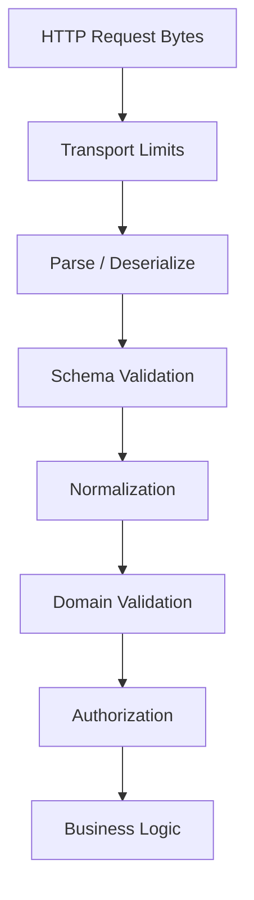
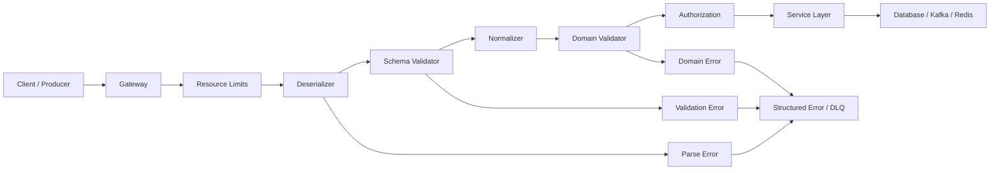

# 10- Deserialization and Validation

## Overview

Deserialization converts an external representation such as JSON, YAML, bytes, or a database value into an in-memory representation that application code can work with.

Validation determines whether the resulting data satisfies the expected structural, type, security, and business constraints.

These operations are related but fundamentally different:

```text
External Data
     │
     ▼
Deserialization
     │
     ▼
Parsed Python Data
     │
     ▼
Schema Validation
     │
     ▼
Normalized / Typed Data
     │
     ▼
Domain Validation
     │
     ▼
Application Logic
```

For backend systems, deserialization is a security and reliability boundary. External data must be treated as untrusted until it has been parsed and validated.

Examples of deserialization boundaries include:

- HTTP request bodies
- Kafka messages
- Redis values
- uploaded files
- configuration files
- S3 objects
- database JSON fields
- CLI arguments
- inter-process messages

A robust system does not simply ask whether input "can be parsed." It establishes that the input is **safe, structurally valid, semantically valid, and compatible with the application's contract**.

---

## Deserialization vs Validation

Consider:

```json
{
  "customer_id": "C001",
  "quantity": -10
}
```

This is syntactically valid JSON.

Python can deserialize it:

```python
import json

payload = json.loads(
    '{"customer_id": "C001", "quantity": -10}'
)
```

But the application may reject it because quantity cannot be negative.

The responsibilities are different:

| Operation | Question answered |
|---|---|
| Parsing | Is the representation syntactically valid? |
| Deserialization | What in-memory structure does it represent? |
| Schema validation | Does it have the expected structure and types? |
| Domain validation | Does it satisfy business rules? |
| Authorization | Is this operation allowed for this caller? |

Keeping these responsibilities separate prevents validation logic from becoming confused with parsing logic.

---

## Why Deserialization Is a Boundary

External representations are outside the application's type and memory model.

For example:

```text
HTTP bytes
     │
     ▼
JSON
     │
     ▼
Python dict
     │
     ▼
Application model
```

The application cannot assume that the incoming bytes contain:

- the expected encoding
- the expected fields
- the expected types
- reasonable sizes
- valid values
- safe content

The deserialization boundary therefore establishes a trust transition:

```text
Untrusted
   │
   │ parse + validate
   ▼
Trusted application representation
```

This boundary should be explicit in the architecture.

---

## Common Deserialization Formats

| Format | Python mechanism | Typical use |
|---|---|---|
| JSON | `json.loads()` | REST APIs |
| YAML | `yaml.safe_load()` | Configuration |
| Pickle | `pickle.loads()` | Controlled Python state |
| CSV | `csv.reader` / `DictReader` | Data import |
| Bytes | `bytes` / parser libraries | Binary protocols |
| Protobuf | Generated protobuf classes | gRPC / events |
| Avro | Avro libraries | Kafka / data pipelines |

The correct parser depends on the input format.

Never parse data with a mechanism that is more powerful than the trust boundary requires.

---

## JSON Deserialization

For JSON:

```python
import json

raw = '{"id": 1001, "status": "paid"}'

payload = json.loads(raw)

print(payload)
```

Result:

```python
{
    "id": 1001,
    "status": "paid",
}
```

Malformed JSON raises an exception:

```python
import json

try:
    payload = json.loads(raw)
except json.JSONDecodeError as exc:
    raise ValueError("invalid JSON") from exc
```

This only establishes that the input is valid JSON.

It does not validate the application contract.

---

## YAML Deserialization

For YAML, use a safe loader:

```python
import yaml

raw = """
service:
  name: order-service
  port: 8000
"""

config = yaml.safe_load(raw)
```

For untrusted or externally supplied YAML, avoid unsafe object-construction loaders.

The parser should produce ordinary data structures that are subsequently validated.

---

## Pickle Deserialization

Pickle is fundamentally different.

```python
import pickle

value = pickle.loads(data)
```

Never perform this operation on untrusted data.

Pickle can reconstruct arbitrary Python object behavior and can result in code execution during deserialization.

The rule is absolute:

> **Do not use pickle as an untrusted data interchange format.**

Use explicit formats such as JSON or Protobuf for external boundaries.

---

## Deserialization Pipeline

A production API typically follows:



Each stage has a different responsibility.

For example:

- transport limits control resource consumption
- parsing interprets syntax
- schema validation checks structure
- normalization establishes canonical values
- domain validation checks business rules
- authorization checks permissions
- business logic performs the operation

---

## Schema Validation

Schema validation checks structural expectations.

Suppose an API requires:

```json
{
  "customer_id": "C001",
  "amount": 125.50
}
```

A schema may define:

```text
customer_id → string, required
amount      → number, required, > 0
```

This provides an explicit contract between producers and consumers.

Schema validation can be implemented with:

- Pydantic
- JSON Schema
- Marshmallow
- dataclasses plus custom validation
- framework-specific serializers

---

## Pydantic Validation

Pydantic is commonly used with FastAPI.

```python
from pydantic import BaseModel, Field


class CreateOrder(BaseModel):
    customer_id: str
    amount: float = Field(gt=0)
```

Validate incoming data:

```python
payload = {
    "customer_id": "C001",
    "amount": 125.50,
}

order = CreateOrder.model_validate(payload)
```

The resulting model provides a stronger boundary than passing arbitrary dictionaries through the application.

---

## Type Conversion

Some validation libraries also perform controlled type conversion.

For example:

```python
from pydantic import BaseModel


class RequestModel(BaseModel):
    quantity: int


request = RequestModel.model_validate(
    {"quantity": "10"}
)

print(request.quantity)
```

Depending on the configured validation behavior, the string may be converted into an integer.

This can be convenient, but automatic coercion should be intentional.

For strict APIs, strict types may be preferable.

---

## Strict Validation

If an API contract requires exact types, avoid silently accepting unrelated representations.

For example:

```python
from pydantic import BaseModel, StrictInt


class RequestModel(BaseModel):
    quantity: StrictInt
```

Now a string such as:

```json
{
  "quantity": "10"
}
```

can be rejected instead of silently converted.

Strictness is particularly useful when:

- API contracts are tightly defined
- type ambiguity could be dangerous
- compatibility matters
- downstream systems expect exact types

---

## Structural Validation

Structural validation verifies:

- object vs array
- required fields
- allowed fields
- nested structures
- field types

Example:

```json
{
  "customer": {
    "id": "C001"
  }
}
```

A validator can establish:

```text
root → object
customer → object
customer.id → string
```

Without structural validation, application code tends to accumulate defensive checks:

```python
if isinstance(payload, dict):
    if "customer" in payload:
        if isinstance(payload["customer"], dict):
            ...
```

Schema models centralize those checks.

---

## Field Validation

Fields can have constraints.

Examples:

```text
age >= 0
quantity > 0
port ∈ [1, 65535]
currency ∈ {"USD", "EUR", "INR"}
email has valid structure
```

Validation should happen close to the input boundary.

Example:

```python
from pydantic import BaseModel, Field


class CreateItem(BaseModel):
    sku: str
    quantity: int = Field(gt=0, le=10_000)
```

This prevents obviously invalid values from reaching deeper layers.

---

## Domain Validation

Not every business rule belongs in schema validation.

Suppose:

```text
quantity > 0
```

is a structural constraint.

But:

```text
customer must be eligible to purchase this product
```

requires domain state and business logic.

A useful separation is:

```text
Schema validation
    │
    ├── required fields
    ├── types
    ├── ranges
    └── formats
          │
          ▼
Domain validation
    │
    ├── business rules
    ├── state transitions
    ├── authorization context
    └── cross-entity constraints
```

Do not attempt to encode every business rule into a transport schema.

---

## Normalization

Normalization transforms accepted input into a canonical representation.

Examples include:

- trimming whitespace
- normalizing case
- converting timestamps to UTC
- canonicalizing phone numbers
- normalizing identifiers

For example:

```python
email = payload["email"].strip().lower()
```

Normalization should be deterministic and documented.

Be careful with transformations that change user-visible data or identifiers.

---

## Validation Order

A practical validation order is:

1. enforce transport/resource limits
2. parse the representation
3. validate structural schema
4. normalize accepted values
5. validate domain constraints
6. authorize the operation
7. execute business logic

For example:

```text
Request
  │
  ▼
Size limit
  │
  ▼
JSON parse
  │
  ▼
Pydantic model
  │
  ▼
Normalization
  │
  ▼
Domain checks
  │
  ▼
Authorization
  │
  ▼
Service
```

This ordering prevents expensive business processing from operating on malformed data.

---

## Validation at API Boundaries

FastAPI provides a natural validation boundary:

```python
from fastapi import FastAPI
from pydantic import BaseModel, Field


class CreateOrder(BaseModel):
    customer_id: str
    amount: float = Field(gt=0)


app = FastAPI()


@app.post("/orders")
async def create_order(order: CreateOrder):
    return {
        "customer_id": order.customer_id,
        "amount": order.amount,
    }
```

The endpoint receives a validated model rather than manually parsing the raw request body.

This reduces repeated validation logic and makes API contracts explicit.

---

## Django Validation

Django provides several validation mechanisms depending on the layer:

- forms
- model validation
- serializers through Django REST Framework
- custom application validation

For API applications using Django REST Framework, serializers commonly establish the deserialization and validation boundary.

The architectural principle remains:

```text
Request
  ↓
Deserializer
  ↓
Validator
  ↓
Application layer
```

---

## Validation Errors

Validation errors should be structured and actionable.

Example:

```json
{
  "error": {
    "code": "VALIDATION_ERROR",
    "fields": {
      "amount": [
        "must be greater than zero"
      ]
    }
  }
}
```

Avoid returning internal stack traces or implementation details.

A stable error contract helps clients handle failures programmatically.

---

## HTTP Status Codes

Typical API behavior:

| Condition | Typical status |
|---|---:|
| Malformed JSON | `400 Bad Request` |
| Invalid request schema | `422 Unprocessable Content` or API-specific `400` |
| Authentication failure | `401 Unauthorized` |
| Authorization failure | `403 Forbidden` |
| Resource not found | `404 Not Found` |
| Conflict | `409 Conflict` |
| Rate limited | `429 Too Many Requests` |

The exact choice should follow the API's established contract.

Consistency is more important than mechanically applying one status code to every validation failure.

---

## Error Boundaries

Do not let low-level parser exceptions leak through every layer.

Instead:

```python
import json


class InvalidRequestError(Exception):
    pass


def parse_json(raw: bytes) -> dict:
    try:
        value = json.loads(raw)
    except json.JSONDecodeError as exc:
        raise InvalidRequestError(
            "request body contains invalid JSON"
        ) from exc

    if not isinstance(value, dict):
        raise InvalidRequestError(
            "request body must be a JSON object"
        )

    return value
```

The API layer can translate `InvalidRequestError` into the service's standard HTTP error response.

---

## Unknown Fields

Consider:

```json
{
  "customer_id": "C001",
  "amount": 100,
  "admin": true
}
```

Should unknown fields be ignored or rejected?

There is no universal answer.

### Ignore Unknown Fields

Advantages:

- easier forward compatibility
- tolerant consumers
- easier client evolution

Limitations:

- typos can be silently ignored
- malicious or unexpected fields can disappear unnoticed

### Reject Unknown Fields

Advantages:

- strict contracts
- catches client mistakes
- easier schema governance

Limitations:

- can reduce forward compatibility
- clients may break when producers add fields

The policy should be explicit.

---

## Partial Updates

PATCH-style APIs require careful handling of omitted versus explicitly null fields.

For example:

```json
{
  "email": null
}
```

may mean:

```text
clear email
```

while:

```json
{}
```

may mean:

```text
leave email unchanged
```

Validation models must preserve this semantic distinction.

This is an example of why validation is more than checking field types.

---

## Cross-Field Validation

Some rules involve multiple fields.

Example:

```json
{
  "start_date": "2026-09-10",
  "end_date": "2026-09-01"
}
```

Each field may be individually valid, but the combination is invalid.

A validator can enforce:

```text
start_date <= end_date
```

Cross-field validation belongs at the schema/domain boundary rather than being scattered throughout endpoint handlers.

---

## Nested Validation

Complex requests often contain nested structures:

```json
{
  "customer": {
    "id": "C001",
    "address": {
      "country": "IN",
      "postal_code": "700001"
    }
  }
}
```

Nested models make the contract explicit:

```python
from pydantic import BaseModel


class Address(BaseModel):
    country: str
    postal_code: str


class Customer(BaseModel):
    id: str
    address: Address


class CreateOrder(BaseModel):
    customer: Customer
```

Validation then occurs recursively through the object graph.

---

## Collection Validation

Lists also require validation.

```python
from pydantic import BaseModel, Field


class BatchRequest(BaseModel):
    order_ids: list[str] = Field(
        min_length=1,
        max_length=100,
    )
```

This prevents:

- empty requests
- unexpectedly huge batches
- excessive downstream database work

Resource limits should complement schema validation.

---

## Security: Resource Exhaustion

Validation itself consumes resources.

An attacker can send:

- enormous strings
- huge arrays
- deeply nested objects
- many unknown fields
- very large JSON documents

Therefore, validate both **content** and **resource usage**.

Controls include:

- request body limits
- reverse-proxy limits
- timeouts
- rate limiting
- authentication
- bounded collection sizes
- bounded string lengths

```text
Nginx / Gateway
      │
      ├── body-size limit
      ├── timeout
      └── rate limit
      │
      ▼
Application
      │
      ├── deserialize
      ├── schema validation
      └── domain validation
```

---

## Security: Injection

Deserialization does not automatically make data safe for downstream systems.

Consider:

```json
{
  "username": "alice' OR '1'='1"
}
```

The value may be valid JSON and valid as a string.

It becomes dangerous only if passed unsafely to another interpreter.

Use parameterized SQL:

```python
cursor.execute(
    "SELECT id FROM users WHERE username = %s",
    (username,),
)
```

Likewise, use safe APIs for:

- shell commands
- HTML rendering
- SQL
- templates
- LDAP
- NoSQL queries

Validation reduces invalid input; it does not replace output encoding or parameterization.

---

## Deserialization and Authentication

Authentication data should be validated separately from ordinary application payloads.

For example:

```text
HTTP request
  │
  ├── Authorization header
  │       ↓
  │   authenticate
  │
  └── JSON body
          ↓
      deserialize
          ↓
       validate
```

Do not assume a valid JSON payload means the caller is authorized to perform the operation.

---

## Deserialization and Authorization

A valid request can still be forbidden.

For example:

```json
{
  "account_id": "A1001",
  "amount": 5000
}
```

Schema validation can establish that the fields are correct.

Authorization must determine whether the authenticated user can operate on `A1001`.

Domain logic may then determine whether the transfer itself is allowed.

These are separate security layers.

---

## Trusted vs Untrusted Sources

Not every input source has the same trust level.

| Source | Default trust |
|---|---|
| Public HTTP request | Untrusted |
| File upload | Untrusted |
| External webhook | Untrusted |
| Kafka from external integration | Untrusted |
| Redis internal cache | Controlled but not automatically trusted |
| PostgreSQL internal table | Controlled |
| Environment variable | Deployment-controlled |
| Signed internal message | Higher trust, but still validate |

Even internal systems can be compromised.

Validation should be applied according to the risk and contract of each boundary.

---

## Schema Validation for Kafka

Kafka consumers should validate event schemas before processing.

```text
Kafka message
     │
     ▼
Deserialize
     │
     ▼
Schema validation
     │
   ┌─┴─┐
   │   │
valid invalid
 │      │
 ▼      ▼
process  DLQ / reject
```

For long-lived events, schema registries and compatibility rules can provide stronger guarantees.

Do not assume that because a message came from Kafka it is structurally correct.

---

## Dead-Letter Handling

Invalid messages in asynchronous systems require careful handling.

For example:

```text
Kafka
  │
  ▼
Consumer
  │
  ▼
Deserialize
  │
  ├── valid ─────► Process
  │
  └── invalid ───► Dead-letter topic
```

Permanent malformed messages should not be retried indefinitely.

Otherwise, one bad message can create:

- retry storms
- increased latency
- consumer lag
- unnecessary cost

Classify failures into retryable and non-retryable categories.

---

## Validation and Idempotency

Validation does not prevent duplicate processing.

Suppose a valid event arrives twice:

```json
{
  "event_id": "evt-1001",
  "order_id": "ORD-1001"
}
```

Both messages may pass validation.

Idempotency requires a separate mechanism:

```text
Validate event
     │
     ▼
Check event_id
     │
 ┌───┴────┐
 │        │
new      seen
 │        │
 ▼        ▼
process   ignore
```

This is particularly important for Kafka, Celery, webhook processing, and payment workflows.

---

## Configuration Deserialization

Configuration should be parsed and validated during startup.

```python
from pathlib import Path

import yaml


def load_config(path: Path) -> dict:
    with path.open(encoding="utf-8") as file:
        config = yaml.safe_load(file)

    if not isinstance(config, dict):
        raise ValueError(
            "configuration root must be an object"
        )

    return config
```

For stronger guarantees, validate against a typed configuration model.

The application should fail fast if required configuration is invalid.

---

## Deserialization from Files

Do not trust file content simply because the file is local.

A file may have originated from:

- user uploads
- S3
- external integrations
- previous application versions
- backups
- shared storage

The correct approach is:

```text
File
 │
 ▼
Size / type checks
 │
 ▼
Parse
 │
 ▼
Validate
 │
 ▼
Process
```

This is especially important for uploaded CSV, JSON, YAML, XML, and binary documents.

---

## Content-Type Is Not Validation

HTTP clients can claim:

```http
Content-Type: application/json
```

while sending invalid or malicious content.

Likewise, a file extension such as:

```text
payload.json
```

does not prove that the file contains valid JSON.

Treat metadata such as:

- MIME type
- filename
- extension

as hints rather than authoritative proof.

The actual content must still be parsed and validated.

---

## Deserialization and File Size

Before parsing a large upload, enforce limits.

For example:

```text
Upload
  │
  ├── maximum size
  ├── allowed media type
  └── authentication
  │
  ▼
Parser
  │
  ▼
Schema validation
```

A parser should not be allowed to allocate unbounded memory simply because a client supplied a large body.

For very large files, use streaming processing rather than materializing the entire file.

---

## Streaming Validation

Large record-oriented inputs can be validated incrementally.

For JSONL:

```python
import json


def process_jsonl(file) -> None:
    for line_number, line in enumerate(file, start=1):
        if not line.strip():
            continue

        try:
            record = json.loads(line)
        except json.JSONDecodeError as exc:
            raise ValueError(
                f"invalid JSON on line {line_number}"
            ) from exc

        validate_record(record)
        process_record(record)
```

This provides bounded memory usage and allows errors to be associated with individual records.

---

## Batch Validation

For large imports, validate in bounded batches.

```text
Input stream
     │
     ▼
Read batch of N records
     │
     ▼
Validate
     │
     ▼
Persist
     │
     ▼
Next batch
```

The batch size should balance:

- memory
- database transaction size
- throughput
- retry cost
- failure isolation

Very large batches can increase rollback cost and memory pressure.

---

## Database Validation

Database constraints remain important even when application-level validation exists.

For example:

```sql
CREATE TABLE orders (
    id BIGSERIAL PRIMARY KEY,
    customer_id TEXT NOT NULL,
    amount NUMERIC(12, 2) CHECK (amount > 0)
);
```

Application validation provides:

- useful client errors
- early rejection
- domain-level checks

Database constraints provide:

- final integrity enforcement
- protection against other writers
- transactional guarantees

Use both where appropriate.

---

## Validation and Transactions

Validation should occur before expensive transactional work when possible.

Example:

```text
Request
  │
  ▼
Deserialize
  │
  ▼
Validate
  │
  ▼
Begin transaction
  │
  ▼
Domain operation
  │
  ▼
Commit
```

This minimizes the time that database transactions remain open.

However, validation that depends on current database state may need to occur inside the transaction to avoid race conditions.

---

## TOCTOU Problems

A common mistake is:

```text
Check condition
     │
     ▼
wait
     │
     ▼
perform operation
```

The condition can change between the check and the operation.

For example:

```text
Check account balance
      │
      ▼
Another transaction modifies balance
      │
      ▼
Perform withdrawal
```

The solution may require:

- database transactions
- row locking
- optimistic concurrency
- atomic SQL operations
- constraints

Validation alone cannot provide concurrency correctness.

---

## Performance Considerations

Validation has a cost.

For large payloads:

```text
Network
  │
  ▼
Parse
  │
  ▼
Allocate Python objects
  │
  ▼
Validate
  │
  ▼
Normalize
  │
  ▼
Business logic
```

Avoid:

- validating the same payload repeatedly
- unnecessary object conversions
- expensive validation inside hot loops
- repeated JSON serialization/deserialization

Validate once at the appropriate boundary and pass the resulting representation downstream.

---

## Avoid Double Deserialization

Bad:

```python
raw = request.body

payload_a = json.loads(raw)
payload_b = json.loads(raw)
```

Better:

```python
payload = json.loads(request.body)

validate(payload)
process(payload)
```

Repeated parsing wastes CPU and may create inconsistent processing paths.

---

## Avoid Repeated Schema Conversion

A common architectural problem is:

```text
JSON
 ↓
dict
 ↓
Pydantic model
 ↓
dict
 ↓
dataclass
 ↓
dict
```

Some conversions are justified at clear boundaries, but unnecessary transformations add:

- CPU cost
- memory allocation
- complexity
- opportunities for information loss

Choose a small number of well-defined representations.

---

## Validation and Concurrency

Validation itself is usually CPU work.

In asynchronous applications, expensive validation can block the event loop.

For example:

```text
FastAPI event loop
      │
      ├── request A
      ├── request B
      ├── request C
      │
      └── expensive CPU validation
```

If validation is computationally expensive, consider:

- reducing payload complexity
- bounding input sizes
- moving CPU-heavy processing to worker processes
- using specialized parsers
- performing heavy processing asynchronously

The GIL and event-loop behavior matter when validation becomes CPU-intensive.

---

## Validation and Caching

Do not assume cached data is permanently valid.

A Redis value may have been created under:

```text
Schema version 1
```

while the current application expects:

```text
Schema version 2
```

Strategies include:

- versioned cache keys
- TTLs
- compatibility logic
- cache invalidation during deployments

Example:

```text
order:v2:1001
```

This can make incompatible cached representations naturally expire or become unused.

---

## Validation and Schema Evolution

External data often outlives the code that produced it.

Examples include:

- Kafka events
- S3 objects
- database records
- cached values
- API requests retried later

Design validators with compatibility in mind.

Possible strategies:

- optional fields
- default values
- explicit versions
- migration layers
- deprecation periods

Avoid making every historical representation invalid immediately after deployment.

---

## Versioned Deserialization

A version field can guide migration:

```json
{
  "schema_version": 2,
  "order_id": "ORD-1001",
  "status": "paid"
}
```

Then:

```python
def deserialize_event(payload: dict):
    version = payload.get("schema_version", 1)

    if version == 1:
        return migrate_v1(payload)

    if version == 2:
        return parse_v2(payload)

    raise ValueError(
        f"unsupported schema version: {version}"
    )
```

Version-aware deserialization is especially useful for durable event streams and persisted artifacts.

---

## Validation and Observability

Track validation failures as structured metrics.

Useful metrics include:

```text
deserialization_errors_total
validation_errors_total
validation_duration_seconds
invalid_message_total
payload_size_bytes
schema_version_distribution
```

For APIs, useful dimensions include:

- endpoint
- HTTP method
- error code
- schema version

Avoid using raw user input as high-cardinality metric labels.

---

## Logging Validation Failures

Log enough information to diagnose the problem without exposing sensitive input.

Good:

```text
request_id=req-1001
endpoint=/orders
error_code=INVALID_AMOUNT
field=amount
```

Avoid:

```text
payload={"password":"secret","token":"..."}
```

Structured logging should provide context without copying the entire request body.

---

## Monitoring Schema Drift

Schema drift occurs when producers gradually emit structures that differ from the expected contract.

Examples:

```text
expected:
amount → number

observed:
amount → string
```

Monitoring can identify:

- unexpected fields
- missing fields
- type changes
- version distribution
- validation failure rates

This is particularly valuable in data pipelines and independently deployed microservices.

---

## Contract Testing

Contract tests verify that producers and consumers agree on the serialized representation.

```text
Producer
   │
   ▼
Serialized contract
   │
   ▼
Consumer validator
   │
   ▼
Contract test
```

Contract testing is valuable for:

- REST APIs
- webhooks
- Kafka
- microservices
- third-party integrations

It detects incompatible changes before they reach production.

---

## Property-Based Testing

Validation logic can benefit from property-based testing.

Instead of testing only:

```text
quantity = 1
quantity = 2
quantity = 10
```

generate a broader range of inputs and assert invariants such as:

```text
accepted quantity > 0
```

This can expose:

- boundary errors
- unexpected coercion
- malformed structures
- integer limits
- Unicode issues

Property-based testing is especially useful for parsers and validation-heavy systems.

---

## Fuzz Testing

Parsers are good candidates for fuzz testing.

Potential inputs include:

- truncated JSON
- deeply nested structures
- invalid UTF-8
- unexpected escape sequences
- enormous strings
- malformed binary data

The goal is to ensure that malformed input results in controlled failure rather than:

- process crashes
- memory exhaustion
- hangs
- unexpected exceptions
- security vulnerabilities

---

## Reliability and Retry Behavior

Deserialization failures are usually deterministic.

For example:

```text
Malformed JSON
    │
    ▼
Retry
    │
    ▼
Malformed JSON
```

Retrying does not fix the input.

Classify errors:

| Error | Usually retry? |
|---|---:|
| Malformed JSON | No |
| Schema mismatch | No |
| Unsupported version | Usually no |
| Corrupted message | Usually no |
| Temporary database failure | Yes |
| Network timeout | Potentially |
| Temporary dependency failure | Potentially |

Permanent malformed messages should generally be rejected, quarantined, or dead-lettered.

---

## Dead-Letter Queues

For asynchronous processing:

```text
Message
  │
  ▼
Deserialize
  │
  ├── success ─────► Validate ─────► Process
  │
  └── failure ─────► Dead Letter
```

Dead-letter records should preserve enough metadata for investigation:

- message ID
- source
- schema version
- failure category
- timestamp
- correlation ID

Avoid storing sensitive payloads unnecessarily.

---

## Disaster Recovery

Historical data may require deserialization during recovery.

Examples:

- Kafka replay
- S3 data restoration
- backup restoration
- cache warm-up
- event reprocessing

Therefore, production systems should retain enough information to understand historical representations.

For long-lived data:

```text
Data
 ├── schema version
 ├── format
 ├── encoding
 └── migration strategy
```

Without this metadata, future applications may not know how to interpret old data.

---

## High Availability

Validation failures should normally affect individual requests or messages rather than destabilizing the entire service.

Good:

```text
Invalid request
    │
    ▼
400 / 422 response
```

Bad:

```text
Invalid request
    │
    ▼
Unhandled exception
    │
    ▼
Worker crash
```

At asynchronous boundaries, isolate malformed messages and continue processing healthy messages when the architecture permits it.

---

## Common Mistakes and Pitfalls

### Confusing Parsing with Validation

```python
payload = json.loads(body)
```

only proves that the body is valid JSON.

### Trusting the Content-Type Header

A client can lie about content type. Parse the actual content.

### Deserializing Pickle from External Input

This can lead to arbitrary code execution.

### Accepting Unlimited Input

Large payloads can exhaust memory and CPU.

### Validating Too Late

Invalid data should not travel deep into the application.

### Validating Only in the Application

Database constraints may still be necessary to protect integrity under concurrency and multiple writers.

### Overusing Automatic Type Coercion

Silent conversion can hide client bugs and create ambiguous contracts.

### Ignoring Unknown Fields

Silently dropping unexpected fields can hide typos or incompatible clients.

### Rejecting Unknown Fields Everywhere

Overly strict consumers can break when producers add backward-compatible fields.

### Repeating Validation

Repeated parsing and model conversion wastes resources.

### Putting Business Rules in Transport Schemas

Transport validation should not become a replacement for domain logic.

### Retrying Permanent Validation Errors

Malformed input will generally remain malformed.

### Logging Full Payloads

Payloads may contain credentials, tokens, personal information, or financial data.

### Treating Internal Storage as Fully Trusted

Redis, Kafka, S3, and databases can be modified by compromised components or credentials.

### Ignoring Schema Evolution

Stored messages and files can outlive the application version that created them.

---

## Interview Traps

### What is the difference between deserialization and validation?

Deserialization converts an external representation into an in-memory structure. Validation determines whether that structure satisfies an expected contract.

### Is valid JSON valid application input?

No. JSON syntax can be valid while the structure, types, values, or business rules are invalid.

### Why validate at the boundary?

It prevents malformed data from propagating through the system and establishes a clear trust boundary.

### Why should Pickle never be used for untrusted input?

Unpickling can execute code as part of object reconstruction.

### Should unknown fields always be rejected?

No. The correct policy depends on compatibility requirements. Strict rejection catches mistakes, while ignoring unknown fields can improve forward compatibility.

### Why are database constraints still required if Pydantic validates input?

Application validation can be bypassed by other writers or race with concurrent transactions. Database constraints provide authoritative integrity enforcement.

### Why isn't validation enough to prevent SQL injection?

Validation checks whether data satisfies an expected contract. SQL injection is prevented through parameterized queries and safe query construction.

### Why are validation errors usually not retryable?

The same invalid input will generally produce the same validation failure. Retrying consumes resources without changing the input.

### Why can large JSON payloads be dangerous?

Parsing and validation require CPU and memory. An attacker can exploit oversized or deeply nested input for resource exhaustion.

---

## Production Best Practices

### Establish Explicit Boundaries

Identify every place where external representations enter the application.

### Parse Once

Deserialize once and pass the validated representation downstream.

### Validate Early

Reject malformed or invalid data before expensive application work.

### Use Typed Models

Use Pydantic, dataclasses with explicit validation, or equivalent schema mechanisms where they improve correctness.

### Keep Domain Rules Separate

Schema validation should handle representation-level constraints; domain services should handle business rules.

### Enforce Resource Limits

Bound:

- body size
- string lengths
- array sizes
- nesting where practical
- processing time

### Protect Durable Data

Use explicit schema versions for data that can outlive application deployments.

### Use Safe Parsers

Prefer:

```python
json.loads(...)
yaml.safe_load(...)
```

and avoid unsafe object deserialization for untrusted data.

### Use Database Constraints

Application validation and database integrity are complementary.

### Design for Evolution

Assume schemas will change and old data will continue to exist.

### Observe Failures

Track parsing failures, validation failures, payload sizes, and schema versions.

### Separate Retryable Errors

Do not retry deterministic malformed-data failures indefinitely.

---

## Production Validation Architecture

A mature backend can structure validation as:



The design separates representation handling from application semantics.

---

## Practical API Example

A production-oriented FastAPI endpoint can keep the boundary concise:

```python
from fastapi import FastAPI
from pydantic import BaseModel, Field


class CreateOrder(BaseModel):
    customer_id: str = Field(min_length=1, max_length=100)
    amount: float = Field(gt=0)


class OrderResponse(BaseModel):
    id: str
    status: str


app = FastAPI()


@app.post(
    "/orders",
    response_model=OrderResponse,
)
async def create_order(
    request: CreateOrder,
) -> OrderResponse:
    # Domain logic would normally be delegated to a service.
    order_id = "ORD-1001"

    return OrderResponse(
        id=order_id,
        status="created",
    )
```

The important architecture is not the framework syntax. It is the boundary:

```text
HTTP JSON
    │
    ▼
Pydantic model
    │
    ▼
Validated application input
    │
    ▼
Service / domain layer
```

---

## Practical Message Consumer Example

An asynchronous consumer should distinguish malformed data from transient processing failures:

```python
import json


def consume_message(raw_message: bytes) -> None:
    try:
        payload = json.loads(raw_message)
    except json.JSONDecodeError as exc:
        send_to_dead_letter(
            raw_message,
            reason="invalid_json",
        )
        return

    try:
        event = validate_event(payload)
    except ValueError:
        send_to_dead_letter(
            raw_message,
            reason="schema_validation_failed",
        )
        return

    process_event(event)
```

A real implementation should also include:

- event IDs
- schema versions
- idempotency
- structured logging
- metrics
- bounded retries
- correlation IDs

---

## Production Checklist

Before exposing a deserialization boundary, verify:

- The input source and trust level are documented.
- The serialization format is explicitly defined.
- A format-specific parser is used.
- Unsafe deserialization mechanisms are prohibited for untrusted input.
- Pickle is restricted to trusted Python-only boundaries.
- YAML uses a safe loader.
- JSON parsing errors are handled explicitly.
- Schema validation occurs after parsing.
- Domain validation is separate from transport validation.
- Type coercion behavior is intentional.
- Required and optional fields are defined.
- Unknown-field behavior is documented.
- String lengths and collection sizes are bounded.
- Request body limits are enforced at the gateway and application layers where appropriate.
- Deeply nested or expensive inputs are considered for resource-exhaustion risk.
- Content-Type and file extensions are not treated as proof of content validity.
- Sensitive fields are excluded from logs.
- Validation errors use stable error codes.
- HTTP status-code behavior is consistent.
- Database constraints enforce authoritative integrity where required.
- Validation occurs before expensive downstream operations where possible.
- Transaction-dependent validation is performed inside appropriate transaction boundaries.
- Schema versions are available for long-lived data where necessary.
- Kafka consumers validate event contracts.
- Invalid asynchronous messages are dead-lettered rather than retried indefinitely.
- Idempotency is handled separately from validation.
- Serialization and validation latency are observable.
- Payload sizes are monitored.
- Contract tests cover producer/consumer compatibility.
- Fuzz or property-based testing is considered for critical parsers.
- Recovery procedures can interpret historical serialized data.
- CI/CD validates schema and configuration changes before deployment.

## Key Takeaways

- Deserialization converts external representations into application data; validation establishes whether that data is structurally, semantically, and operationally acceptable.
- Treat every deserialization boundary as a trust boundary: use safe parsers, enforce resource limits, validate early, and never unpickle untrusted data.
- Separate schema validation from domain validation, authorization, and database integrity so each layer enforces the constraints it is responsible for.
- Production systems must account for schema evolution, retries, idempotency, observability, large payloads, and durable historical data rather than validating only the happy path.
- Parse and validate once at the boundary, then pass a controlled representation into the application while keeping serialization-specific concerns out of core business logic.