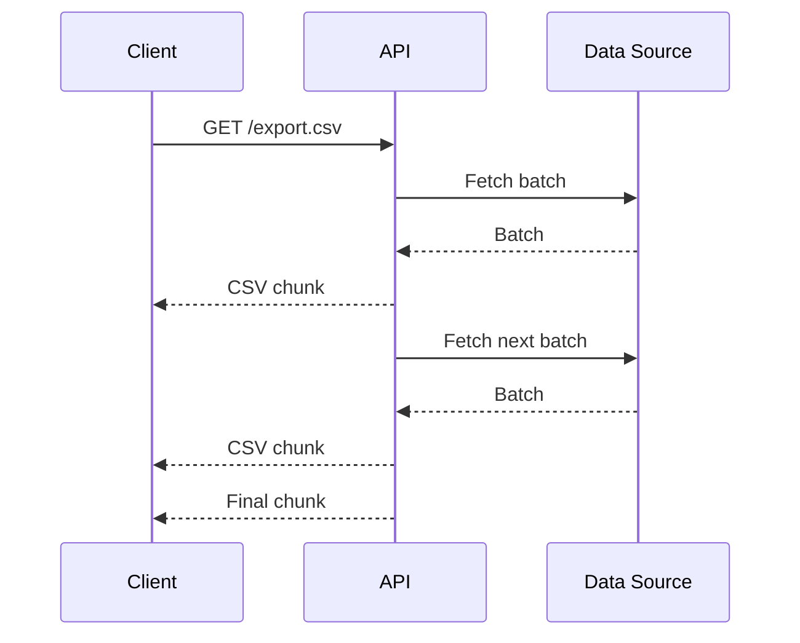
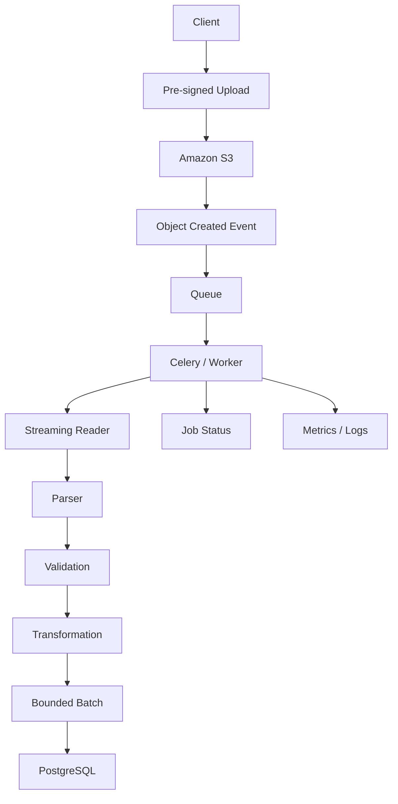

# 11- Streaming Large Files

## Overview

Streaming large files means processing file content incrementally instead of loading the entire file into memory at once.

The distinction is fundamental:

```python
data = file.read()
```

loads the entire remaining file into memory, while:

```python
for line in file:
    process(line)
```

processes the file incrementally.

For small files, both approaches may be acceptable. For production systems handling multi-gigabyte CSV exports, object-storage downloads, log files, database exports, or user uploads, streaming is often required to maintain predictable memory usage and service stability.

The central principle is:

> **Memory usage should depend primarily on the configured chunk or batch size, not on total file size.**

Streaming is therefore closely related to:

- iterators
- generators
- buffering
- backpressure
- HTTP streaming
- chunked uploads and downloads
- database batching
- object storage
- asynchronous processing
- worker queues
- memory management

---

## Why Large Files Are Different

Suppose a service receives a 10 GB file.

A naive implementation:

```python
content = file.read()
```

attempts to construct a representation of the entire file in memory.

This creates several risks:

- excessive RAM consumption
- process termination by the operating system
- container OOM kills
- garbage-collection pressure
- reduced concurrency
- latency spikes
- degraded performance for unrelated requests

A streaming implementation instead keeps only a bounded amount of data in memory:

```text
10 GB file
    │
    ▼
Read 8 MB
    │
    ▼
Process
    │
    ▼
Read next 8 MB
    │
    ▼
Process
    │
    ▼
...
```

Memory usage remains approximately bounded by the active buffers and processing state.

---

## Full Loading vs Streaming

| Approach | Memory usage | Simplicity | Large-file suitability |
|---|---:|---|---|
| `read()` | O(file size) | High | Poor |
| `readline()` | O(line size) | High | Good |
| Iterating over file | O(line size + buffer) | High | Good |
| Chunked `read(size)` | O(chunk size) | Medium | Excellent |
| Generator pipeline | O(pipeline state) | Medium | Excellent |
| Memory mapping | Depends on access pattern | Medium | Specialized |

Streaming is not automatically faster in every situation, but it provides much better memory characteristics.

---

## File Iteration

Python file objects are iterable.

```python
from pathlib import Path


def process_log_file(path: Path) -> None:
    with path.open("rt", encoding="utf-8") as file:
        for line in file:
            process_line(line)
```

Python does not need to construct a list containing every line.

The loop consumes the file incrementally.

This is the preferred pattern for line-oriented files such as:

- logs
- CSV
- JSON Lines
- newline-delimited events
- text exports

---

## How File Iteration Works

Conceptually:

```text
File descriptor
      │
      ▼
Operating system
      │
      ▼
Python buffered I/O
      │
      ▼
Iterator
      │
      ▼
One line at a time
      │
      ▼
Application
```

Python's I/O layer uses buffering so that the application does not necessarily perform an operating-system read for every individual line.

The iterator provides a convenient incremental interface over that buffered stream.

---

## Chunked Binary Reads

For binary data, process explicit chunks.

```python
from pathlib import Path


CHUNK_SIZE = 8 * 1024 * 1024


def process_file(path: Path) -> None:
    with path.open("rb") as file:
        while chunk := file.read(CHUNK_SIZE):
            process_chunk(chunk)
```

This pattern is useful for:

- large binary files
- checksums
- uploads
- downloads
- compression
- encryption pipelines
- object-storage transfers

The chunk size should be configurable rather than arbitrarily large.

---

## Choosing a Chunk Size

There is no universally optimal chunk size.

Common starting points include:

```text
64 KiB
256 KiB
1 MiB
4 MiB
8 MiB
16 MiB
```

The correct value depends on:

- network bandwidth
- storage latency
- CPU processing cost
- memory constraints
- concurrency
- downstream APIs
- cloud-storage behavior

A larger chunk can reduce system-call and network overhead but increases memory usage and failure/retry granularity.

Benchmark representative workloads rather than choosing a value based solely on intuition.

---

## Streaming Text Files

For text files:

```python
from pathlib import Path


def process_text(path: Path) -> None:
    with path.open(
        "rt",
        encoding="utf-8",
        newline="",
    ) as file:
        for line in file:
            process_line(line)
```

Specify the encoding when the format requires a known encoding.

For production data pipelines, assuming the operating system's default encoding can cause environment-specific behavior.

---

## Streaming CSV

Python's CSV module naturally supports streaming.

```python
import csv
from pathlib import Path


def import_csv(path: Path) -> None:
    with path.open(
        "rt",
        encoding="utf-8",
        newline="",
    ) as file:
        reader = csv.DictReader(file)

        for row in reader:
            process_row(row)
```

This avoids:

```python
rows = list(csv.DictReader(file))
```

which materializes the entire dataset.

For very large imports, combine streaming with bounded database batches.

---

## Batch Database Writes

Processing one record at a time can be memory-efficient but inefficient for databases.

A better architecture is:

```text
File
 │
 ▼
Stream records
 │
 ▼
Accumulate bounded batch
 │
 ▼
Database bulk operation
 │
 ▼
Clear batch
 │
 ▼
Continue streaming
```

Example:

```python
from collections.abc import Iterator


BATCH_SIZE = 1_000


def batched_rows(rows: Iterator[dict]) -> Iterator[list[dict]]:
    batch: list[dict] = []

    for row in rows:
        batch.append(row)

        if len(batch) >= BATCH_SIZE:
            yield batch
            batch = []

    if batch:
        yield batch
```

The database layer can then perform one bulk operation per batch.

---

## Streaming JSON Lines

JSON Lines is particularly suitable for streaming because each line represents an independent JSON document.

```python
import json
from pathlib import Path


def process_jsonl(path: Path) -> None:
    with path.open("rt", encoding="utf-8") as file:
        for line_number, line in enumerate(file, start=1):
            if not line.strip():
                continue

            record = json.loads(line)
            process_record(record)
```

A malformed record can be associated with its line number without discarding the entire file.

This is one reason JSONL is often preferable to one enormous JSON array for large data-processing workflows.

---

## Large JSON Arrays

A file such as:

```json
[
  {"id": 1},
  {"id": 2},
  {"id": 3}
]
```

is less straightforward to stream than JSONL because the parser must understand the enclosing array structure.

For large datasets, consider:

```text
JSON array
     │
     ▼
streaming parser
```

or use:

```text
JSONL
```

where each record is independently parseable.

Do not assume that:

```python
json.load(file)
```

is memory-efficient for a multi-gigabyte JSON document.

---

## Streaming CSV with Validation

Streaming does not eliminate validation.

```python
import csv
from pathlib import Path


def parse_quantity(value: str) -> int:
    quantity = int(value)

    if quantity <= 0:
        raise ValueError("quantity must be positive")

    return quantity


def import_orders(path: Path) -> None:
    with path.open(
        "rt",
        encoding="utf-8",
        newline="",
    ) as file:
        reader = csv.DictReader(file)

        for line_number, row in enumerate(reader, start=2):
            try:
                quantity = parse_quantity(row["quantity"])
                process_order(
                    order_id=row["order_id"],
                    quantity=quantity,
                )
            except (KeyError, ValueError) as exc:
                handle_invalid_row(
                    line_number,
                    row,
                    exc,
                )
```

A production importer should define whether invalid rows:

- stop the entire import
- are skipped
- are written to a dead-letter file
- are reported after processing
- are retried

---

## Generator-Based Streaming

Generators are useful for constructing lazy processing pipelines.

```python
from collections.abc import Iterator


def read_lines(path: str) -> Iterator[str]:
    with open(path, encoding="utf-8") as file:
        yield from file


def normalize(lines: Iterator[str]) -> Iterator[str]:
    for line in lines:
        value = line.strip()

        if value:
            yield value


def process(lines: Iterator[str]) -> None:
    for line in lines:
        handle(line)
```

Pipeline:

```text
File
 │
 ▼
read_lines()
 │
 ▼
normalize()
 │
 ▼
process()
```

No intermediate collection containing the entire file is required.

---

## Lazy Evaluation

Generators defer work until values are requested.

```python
records = (transform(row) for row in rows)
```

Compared with:

```python
records = [transform(row) for row in rows]
```

the generator does not materialize all transformed records immediately.

This is especially useful when:

- only part of the dataset may be consumed
- processing can happen incrementally
- memory must remain bounded
- multiple transformations form a pipeline

---

## Streaming Pipelines

A mature file-processing pipeline may look like:

```text
Object Storage
      │
      ▼
Download Stream
      │
      ▼
Decompression
      │
      ▼
Parser
      │
      ▼
Validation
      │
      ▼
Transformation
      │
      ▼
Batch
      │
      ▼
PostgreSQL
```

Each stage should ideally process bounded data rather than materializing the entire dataset.

---

## Backpressure

Backpressure occurs when downstream processing is slower than upstream input.

Example:

```text
File reader
    │
    │ fast
    ▼
Parser
    │
    │ fast
    ▼
Database
    │
    │ slow
    ▼
Commit
```

If the reader continues accumulating data without bounds, memory usage grows.

A streaming system should instead allow downstream capacity to control upstream production.

Conceptually:

```text
Producer ─────► Buffer ─────► Consumer
                  ▲
                  │
             bounded size
```

Backpressure is essential in high-throughput pipelines.

---

## Bounded Queues

For multi-stage pipelines, use bounded queues.

```python
from queue import Queue


queue: Queue[bytes] = Queue(maxsize=100)
```

When the queue reaches capacity, producers block until consumers make progress.

This prevents an overloaded downstream component from causing unbounded memory growth.

For asynchronous systems, `asyncio.Queue(maxsize=...)` provides the same general concept.

---

## Threaded Streaming Pipeline

For I/O-heavy processing, stages can sometimes run concurrently.

```text
Reader Thread
     │
     ▼
Bounded Queue
     │
     ▼
Processor Threads
     │
     ▼
Database / Object Storage
```

The queue provides:

- isolation between stages
- bounded buffering
- backpressure

However, adding concurrency also introduces:

- synchronization
- ordering concerns
- error propagation complexity
- shutdown coordination

Do not add threads merely because a file is large.

---

## Async Streaming

Async streaming is particularly relevant to network-based file processing.

```python
import aiohttp


async def download(url: str):
    async with aiohttp.ClientSession() as session:
        async with session.get(url) as response:
            response.raise_for_status()

            async for chunk in response.content.iter_chunked(
                1024 * 1024
            ):
                process_chunk(chunk)
```

The exact API depends on the HTTP client.

The important design principle is that the response body is consumed incrementally rather than converted into one huge byte string.

---

## FastAPI Streaming Responses

When an API serves a large generated file, avoid constructing the entire response in memory.

FastAPI can return a streaming response:

```python
from collections.abc import Iterator

from fastapi import FastAPI
from fastapi.responses import StreamingResponse


app = FastAPI()


def generate_csv() -> Iterator[str]:
    yield "id,name\n"

    for row in fetch_rows():
        yield f"{row.id},{row.name}\n"


@app.get("/export.csv")
def export_csv() -> StreamingResponse:
    return StreamingResponse(
        generate_csv(),
        media_type="text/csv",
    )
```

The server can send data progressively as it becomes available.

---

## Streaming Response Lifecycle



This reduces application memory requirements and allows clients to begin receiving data before the entire export is generated.

---

## Streaming Uploads

Uploads can also be processed incrementally.

```text
Client
  │
  │ HTTP request body
  ▼
Nginx / Load Balancer
  │
  ▼
Application
  │
  ├── size limits
  ├── authentication
  └── streaming parser
  │
  ▼
Object Storage
```

Do not assume that every upload should first be fully buffered in the application.

For very large uploads, direct-to-object-storage uploads are often preferable.

---

## Direct-to-S3 Uploads

A common architecture is:

```text
Client
   │
   │ pre-signed URL
   ▼
Amazon S3
   │
   ▼
Object Created Event
   │
   ▼
SQS / EventBridge / Lambda
   │
   ▼
Celery / Worker
   │
   ▼
Streaming Processing
```

This avoids routing multi-gigabyte payloads through application servers unnecessarily.

Advantages include:

- reduced application bandwidth
- reduced application memory usage
- better horizontal scalability
- simpler retry behavior
- independent storage lifecycle management

---

## S3 Multipart Uploads

Large objects can be uploaded in parts.

Conceptually:

```text
File
 │
 ├── Part 1
 ├── Part 2
 ├── Part 3
 └── Part N
       │
       ▼
     S3
       │
       ▼
  Complete upload
```

Multipart uploads improve resilience and allow failed parts to be retried without retransmitting the entire object.

The appropriate part size depends on the storage service and workload.

---

## S3 Streaming Downloads

Large objects should also be consumed incrementally.

Conceptually:

```python
response = s3_client.get_object(
    Bucket=bucket,
    Key=key,
)

body = response["Body"]

while chunk := body.read(8 * 1024 * 1024):
    process_chunk(chunk)
```

The exact SDK API varies by AWS SDK and transfer mechanism, but the important property is that the object body is treated as a stream.

---

## HTTP Range Requests

For large files, clients may request only part of an object:

```http
Range: bytes=0-1048575
```

Range requests are useful for:

- resumable downloads
- video
- large binary objects
- partial retrieval
- random access

A streaming architecture can combine range support with object storage to avoid transferring unnecessary data.

---

## Resumable Processing

Large-file processing can take hours.

A failure at 99% completion should not necessarily require starting from byte zero.

Possible checkpoint strategies include:

```text
File
 │
 ├── chunk 1 ✓
 ├── chunk 2 ✓
 ├── chunk 3 ✓
 ├── chunk 4 ✓
 └── chunk 5
```

Checkpoint state may include:

- byte offset
- record number
- partition
- object key
- checksum
- schema version

Checkpointing is more complex than simply tracking a byte offset when records have variable sizes or processing has side effects.

---

## Idempotent Processing

Streaming jobs often need retryability.

Suppose a worker crashes after writing batch 42 but before recording progress.

On retry, batch 42 may be processed again.

Therefore, downstream operations should be idempotent where practical.

Techniques include:

- unique event IDs
- database unique constraints
- upserts
- processed-record tables
- deterministic object keys
- transactional checkpoints

```text
Read
  │
  ▼
Process
  │
  ▼
Persist idempotently
  │
  ▼
Checkpoint
```

Checkpointing before persistence can cause data loss; checkpointing after persistence can cause duplicate work. Idempotency helps resolve this trade-off.

---

## Atomic File Processing

For local file transformations, avoid exposing partially written output.

Bad:

```text
output.csv
  │
  ├── partially written
  └── another process reads it
```

Better:

```text
output.csv.tmp
     │
     ▼
complete write
     │
     ▼
atomic replace
     │
     ▼
output.csv
```

Example:

```python
from pathlib import Path


def write_output(
    target: Path,
    chunks: list[bytes],
) -> None:
    temporary = target.with_suffix(
        target.suffix + ".tmp"
    )

    with temporary.open("wb") as file:
        for chunk in chunks:
            file.write(chunk)

    temporary.replace(target)
```

For very large outputs, `chunks` itself should be a stream rather than an in-memory list.

---

## Compression

Compression changes the streaming pipeline.

```text
Compressed File
      │
      ▼
Streaming Decompressor
      │
      ▼
Parser
      │
      ▼
Validation
      │
      ▼
Processing
```

Do not necessarily decompress the entire archive before processing.

Python provides streaming-friendly interfaces such as:

```python
import gzip


with gzip.open("events.jsonl.gz", "rt", encoding="utf-8") as file:
    for line in file:
        process_line(line)
```

Compression reduces storage and network transfer costs but adds CPU work.

---

## Compression Bombs

Compressed data introduces an additional security risk.

A small compressed payload may expand into an enormous amount of data.

For untrusted compressed input, enforce limits on:

- compressed size
- decompressed size
- record count
- processing duration

Never assume:

```text
small input = small workload
```

---

## Checksums While Streaming

Checksums can be calculated incrementally.

```python
import hashlib
from pathlib import Path


def sha256_file(path: Path) -> str:
    digest = hashlib.sha256()

    with path.open("rb") as file:
        while chunk := file.read(8 * 1024 * 1024):
            digest.update(chunk)

    return digest.hexdigest()
```

Memory remains bounded while the complete file integrity can be verified.

Checksums are useful for:

- data integrity
- duplicate detection
- content addressing
- transfer verification
- pipeline auditing

A checksum provides integrity detection, not authenticity. For authenticity, use an authenticated mechanism such as a digital signature or MAC where appropriate.

---

## Streaming Encryption

Encryption can also be performed incrementally using streaming-capable or chunk-oriented cryptographic designs.

The architecture should avoid:

```text
read entire file
      ↓
encrypt entire file
      ↓
write entire file
```

when file sizes are large.

Instead:

```text
Read chunk
   ↓
Encrypt/process
   ↓
Write chunk
   ↓
Next chunk
```

Cryptographic implementation details must follow a vetted library and algorithm rather than custom encryption code.

---

## Memory Behavior

A useful approximation is:

```text
Memory ≈
    input buffer
  + parser state
  + current record
  + processing state
  + batch
  + output buffer
```

If all these components are bounded, total memory remains approximately bounded.

However, streaming does not guarantee constant memory automatically.

For example:

```python
batch = []

for row in file:
    batch.append(row)
```

is still bounded only if the batch has a fixed maximum size.

This is why **bounded streaming** is more important than merely using an iterator.

---

## Memory-Mapped Files

Python also supports memory mapping:

```python
import mmap


with open("large.bin", "rb") as file:
    with mmap.mmap(
        file.fileno(),
        0,
        access=mmap.ACCESS_READ,
    ) as mapped:
        process(mapped)
```

Memory mapping can be useful for:

- random access
- specialized binary formats
- very large files
- workloads where OS page caching is advantageous

It is not a universal replacement for streaming.

For sequential processing, ordinary buffered I/O is often simpler.

---

## Streaming vs Memory Mapping

| Characteristic | Streaming | Memory mapping |
|---|---|---|
| Sequential processing | Excellent | Good |
| Random access | Limited | Excellent |
| Explicit memory bound | Easy | Less direct |
| Simple implementation | Excellent | Moderate |
| Network streams | Yes | No |
| Object storage streams | Yes | No |
| Very large local files | Excellent | Specialized |
| Parser integration | Usually straightforward | Format-dependent |

Use streaming when data naturally arrives sequentially. Use memory mapping when random access to local files is a core requirement.

---

## Database Export Streaming

Large database exports should avoid materializing millions of rows.

Instead:

```text
PostgreSQL
    │
    ▼
Server-side / batched cursor
    │
    ▼
Application
    │
    ▼
CSV / JSONL stream
    │
    ▼
S3 / HTTP client
```

The exact mechanism depends on the database driver and ORM.

For PostgreSQL, server-side cursors or database-native export facilities can be preferable to fetching the entire result set into application memory.

---

## Django Streaming Responses

Django supports streaming responses through `StreamingHttpResponse`.

```python
from django.http import StreamingHttpResponse


def generate_rows():
    yield "id,name\n"

    for row in fetch_rows():
        yield f"{row.id},{row.name}\n"


def export_view(request):
    response = StreamingHttpResponse(
        generate_rows(),
        content_type="text/csv",
    )
    response["Content-Disposition"] = (
        'attachment; filename="export.csv"'
    )
    return response
```

The generator allows Django to produce response content incrementally.

---

## Nginx Considerations

A reverse proxy can change the behavior of streaming responses.

Important considerations include:

- proxy buffering
- response buffering
- request body size limits
- connection timeouts
- idle timeouts
- upstream timeouts

A streaming application may generate chunks correctly while an intermediary buffers them.

For large downloads and long-running streams, verify behavior across:

```text
Client
  ↓
Nginx / Load Balancer
  ↓
Application
  ↓
Database / Object Storage
```

Do not assume application-level streaming guarantees end-to-end streaming.

---

## Kubernetes Considerations

A container processing a large file must have a memory limit that is consistent with its workload.

For example:

```text
Container memory limit
        │
        ├── Python runtime
        ├── input buffers
        ├── parser
        ├── batches
        └── libraries
```

If a process exceeds its memory limit, Kubernetes may terminate the container with an OOM condition.

Streaming reduces memory pressure, but memory limits should still leave headroom for:

- Python overhead
- framework overhead
- concurrent requests
- native libraries
- temporary allocations

---

## Celery and Background Processing

Large-file processing is often unsuitable for a synchronous HTTP request.

A common architecture is:

```text
Client
  │
  ▼
Upload to S3
  │
  ▼
Application creates job
  │
  ▼
Celery / Worker Queue
  │
  ▼
Stream object
  │
  ▼
Validate + Transform
  │
  ▼
Batch write
  │
  ▼
Update job status
```

The HTTP request returns quickly while the worker performs the long-running operation.

---

## Job State

Large-file jobs should expose explicit state.

```text
PENDING
   │
   ▼
RUNNING
   │
   ├────► FAILED
   │
   ▼
COMPLETED
```

Useful metadata includes:

- file ID
- object key
- total bytes
- processed bytes
- processed records
- failed records
- start time
- completion time
- error reason

This enables operational visibility and client-facing progress reporting.

---

## Progress Tracking

For byte-oriented streams:

```python
processed_bytes += len(chunk)
```

Progress can then be reported as:

```text
processed_bytes / total_bytes
```

For compressed files or transformed pipelines, byte-level progress may not correspond to logical processing progress.

Record counts or stage-specific progress may be more meaningful.

---

## Observability

Useful metrics for streaming jobs include:

| Metric | Purpose |
|---|---|
| bytes_processed_total | Throughput |
| records_processed_total | Work volume |
| processing_duration_seconds | Latency |
| validation_errors_total | Data quality |
| processing_errors_total | Reliability |
| batch_duration_seconds | Database performance |
| queue_depth | Backpressure |
| memory_usage_bytes | Resource behavior |
| throughput_bytes_per_second | Capacity planning |

Log structured events at important lifecycle transitions rather than logging every record.

---

## Avoid Per-Record Logging

Bad:

```python
for row in rows:
    logger.info("processing row %s", row["id"])
```

For millions of rows, this can create enormous log volume.

Prefer periodic progress:

```text
processed_records=1,000,000
processed_bytes=8.4GB
elapsed_seconds=742
```

This reduces:

- logging cost
- CPU overhead
- storage usage
- observability noise

---

## Failure Handling

Streaming jobs should distinguish:

```text
Input error
Processing error
Transient dependency error
Permanent validation error
Infrastructure failure
```

For example:

```text
Malformed row
    → record error
    → continue

Database timeout
    → retry batch

Authentication failure
    → fail job

Process crash
    → resume from checkpoint if supported
```

Do not apply one retry strategy to every failure.

---

## Partial Failure

A large import can contain millions of records.

One invalid record should not necessarily invalidate the entire file.

Possible policies:

### Fail Fast

Stop on the first invalid record.

Useful when:

- the file is expected to be strictly correct
- partial processing is dangerous

### Continue and Report

Skip invalid records and produce an error report.

Useful for:

- bulk data imports
- user-managed CSV files
- ETL workflows

### Quarantine

Send invalid records to a separate destination.

Useful for:

- Kafka
- large event pipelines
- operational recovery

The policy should be explicit before production deployment.

---

## Security Considerations

Large-file processing expands the attack surface.

Protect against:

- oversized uploads
- decompression bombs
- malformed parsers
- path traversal
- malicious filenames
- CSV injection
- resource exhaustion
- unauthorized object access
- accidental sensitive-data logging

Apply controls at multiple layers:

```text
Gateway
  │
  ├── authentication
  ├── request limits
  └── rate limits
  │
  ▼
Application
  │
  ├── parser limits
  ├── validation
  └── authorization
  │
  ▼
Storage
  │
  ├── IAM
  ├── encryption
  └── lifecycle policies
```

---

## Temporary Files

Temporary files may be necessary when:

- downstream APIs require seekable files
- multiple passes are required
- random access is required
- a transformation cannot be performed incrementally

Use secure temporary-file mechanisms rather than predictable filenames.

```python
from tempfile import NamedTemporaryFile


with NamedTemporaryFile(mode="wb") as temporary:
    temporary.write(data)
    temporary.flush()
    process_file(temporary.name)
```

For truly large data, ensure the temporary storage volume has sufficient capacity.

In containers, ephemeral disk limits must be considered.

---

## Local Disk vs Object Storage

| Requirement | Local disk | S3 / Object storage |
|---|---|---|
| Temporary processing | Good | Good |
| Durable storage | Poor | Excellent |
| Horizontal scalability | Limited | Excellent |
| Large datasets | Possible | Excellent |
| Cross-worker access | Complex | Easy |
| Lifecycle management | Manual | Built-in |
| Disaster recovery | Application responsibility | Storage-service capabilities |

For cloud-native systems, object storage is generally preferable for durable large files.

---

## Cost Considerations

Streaming can reduce costs indirectly by lowering:

- application memory requirements
- container sizes
- network duplication
- temporary storage usage
- unnecessary data transfers

However, processing large files still consumes:

- CPU
- network bandwidth
- object-storage requests
- database resources
- worker time

Optimize the entire pipeline rather than focusing only on Python memory usage.

---

## Testing Streaming Code

Tests should verify behavior rather than only final output.

Important cases include:

- empty file
- one-record file
- file smaller than chunk size
- file exactly equal to chunk size
- file larger than chunk size
- malformed record
- oversized record
- truncated input
- encoding errors
- downstream failure
- partial processing
- retry behavior

A useful property is:

```text
Processing a 10 GB file should not require
10 GB of application memory.
```

---

## Testing Memory Behavior

For critical workloads, measure peak memory using representative files.

Useful tools include:

- `tracemalloc`
- pytest plugins
- container memory metrics
- process RSS monitoring
- production profiling tools

Example:

```python
import tracemalloc


tracemalloc.start()

process_large_file()

current, peak = tracemalloc.get_traced_memory()

print(f"peak memory: {peak / 1024 / 1024:.2f} MiB")

tracemalloc.stop()
```

`tracemalloc` tracks Python allocations and does not necessarily represent all native memory used by the process, so container-level measurements are also important.

---

## Performance Benchmarking

Benchmark different:

- chunk sizes
- batch sizes
- parsers
- compression levels
- concurrency levels
- database write strategies

Measure:

```text
throughput
CPU
peak memory
latency
database load
network utilization
error rate
```

An optimization that doubles throughput but triples memory consumption may be a regression in a constrained Kubernetes environment.

---

## Common Mistakes

### Calling `read()` on a Huge File

```python
data = file.read()
```

This defeats streaming and can exhaust memory.

### Converting a Stream to a List

```python
rows = list(reader)
```

This materializes the entire dataset.

### Using an Unbounded Batch

```python
batch.append(row)
```

without a maximum batch size eventually becomes a memory problem.

### Reading One Byte at a Time

```python
while data:
    data = file.read(1)
```

This introduces unnecessary overhead.

Use reasonably sized chunks.

### Logging Every Record

This can become a major performance and cost problem.

### Retaining Processed Records

References accidentally kept in caches, lists, closures, or global state can cause memory growth even when input processing is streamed.

### Assuming Generators Guarantee Low Memory

A generator can still yield objects that downstream code stores indefinitely.

### Ignoring Downstream Backpressure

Fast reading combined with slow processing can create unbounded queues.

### Streaming Through the Application When S3 Direct Upload Is Better

Large client uploads can unnecessarily consume application bandwidth and worker resources.

### Ignoring Proxy Buffering

Nginx or another intermediary may buffer data and defeat expected streaming behavior.

### No Resume Strategy

Long-running jobs can become operationally expensive if every failure requires restarting from byte zero.

---

## Production Architecture

A scalable large-file processing system commonly separates storage, ingestion, and processing:



This architecture provides:

- durable storage
- asynchronous processing
- horizontal worker scaling
- bounded application memory
- retryable jobs
- operational visibility

---

## Scaling Large-File Processing

For a single large file, vertical scaling is not always the best solution.

Instead of:

```text
1 worker
10 GB file
```

consider partitioning:

```text
10 GB dataset
     │
     ├── partition 1 ──► worker 1
     ├── partition 2 ──► worker 2
     ├── partition 3 ──► worker 3
     └── partition N ──► worker N
```

Partitioning can be based on:

- file parts
- date ranges
- record ranges
- database partitions
- Kafka partitions

The data format must support safe partition boundaries.

---

## Parallelism vs Ordering

Parallel processing increases throughput but may change record ordering.

If ordering matters:

```text
record 1
record 2
record 3
```

must not become:

```text
record 2
record 1
record 3
```

unless the downstream system explicitly permits it.

Possible strategies include:

- partition-level ordering
- sequence numbers
- ordered merge stages
- single-consumer processing

Do not introduce parallelism without defining the ordering contract.

---

## Senior-Level Design Principles

A production streaming system should answer:

1. What is the maximum input size?
2. What is the expected throughput?
3. What is the memory budget?
4. What is the chunk size?
5. What is the batch size?
6. Where does backpressure occur?
7. What happens when processing fails halfway through?
8. Can processing resume?
9. Is processing idempotent?
10. Where are durable checkpoints stored?
11. How are malformed records handled?
12. How is progress reported?
13. How are large uploads stored?
14. Can workers process files concurrently?
15. Does ordering matter?
16. What happens if the downstream database is slower than the input?
17. How are metrics and errors observed?
18. What happens during deployment or worker termination?
19. How is historical data reprocessed?
20. What are the storage, compute, and network costs?

These questions are more important than simply knowing how to write:

```python
for chunk in file:
    ...
```

---

## Graceful Shutdown

Long-running file processors must handle worker termination.

A worker should avoid:

```text
receive SIGTERM
     │
     ▼
immediate process exit
```

when possible.

Instead:

```text
SIGTERM
  │
  ▼
stop accepting new work
  │
  ▼
finish / safely checkpoint current batch
  │
  ▼
release resources
  │
  ▼
exit
```

Kubernetes deployments, Celery workers, and autoscaling environments make graceful shutdown especially important.

---

## Production Checklist

Before deploying a large-file processing workflow, verify:

- File size limits are defined.
- Chunk sizes are bounded and configurable.
- Batch sizes are bounded.
- Memory usage is measured with representative workloads.
- Input is processed incrementally.
- No accidental `read()`, `list()`, or full materialization exists.
- Parsers support streaming where required.
- Large JSON workloads use an appropriate streaming format or parser.
- CSV processing uses incremental iteration.
- Downstream queues are bounded.
- Backpressure is explicitly considered.
- Database writes use appropriate batching.
- Transactions are bounded and failure behavior is understood.
- Object storage is used for durable large-file storage where appropriate.
- Direct-to-S3 uploads are considered for large client uploads.
- Multipart upload is considered for very large objects.
- Temporary disk usage is bounded.
- Compression expansion limits are enforced for untrusted input.
- Authentication and authorization protect file access.
- Content validation occurs before processing.
- Sensitive data is excluded from logs.
- Processing is idempotent where retries can duplicate work.
- Long-running jobs have explicit state.
- Progress and throughput are observable.
- Permanent validation errors are not retried indefinitely.
- Transient dependency failures have bounded retries.
- Checkpointing or resumability is implemented where job duration justifies it.
- Worker shutdown behavior is safe.
- Nginx/load-balancer buffering and timeout behavior are verified.
- Kubernetes memory and ephemeral-storage limits match workload requirements.
- Historical files can be reprocessed with compatible schemas.
- Disaster recovery procedures account for large-object restoration.
- CI/CD tests representative large-file paths.

## Key Takeaways

- Stream large files incrementally so memory usage is bounded by chunk, record, parser, and batch state rather than total file size.
- Combine streaming with bounded batches, backpressure, and efficient downstream operations; a generator alone does not guarantee bounded memory.
- For cloud-native systems, prefer durable object storage and asynchronous workers for large-file workflows instead of routing long-running processing through synchronous API requests.
- Production streaming requires idempotency, checkpointing, retry classification, graceful shutdown, validation, observability, and explicit handling of partial failures.
- Optimize the complete pipeline—storage, network, parsing, CPU, memory, database writes, concurrency, and cloud cost—rather than optimizing Python file reads in isolation.