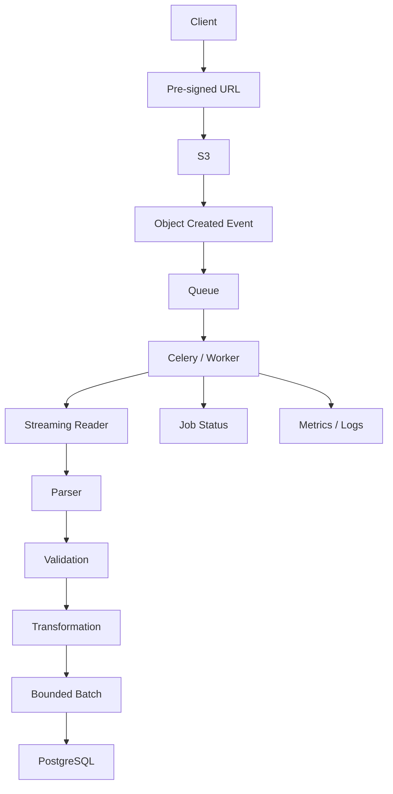

# README

## Overview

The **Files and Serialization** section covers how Python applications interact with data outside the process boundary.

This includes:

- local files and filesystem paths
- text and binary data
- CSV, JSON, and YAML
- serialization and deserialization
- validation and schema enforcement
- large-file and streaming workflows

These topics are foundational for backend systems because application data constantly crosses boundaries:

```text
Client
  │
  ▼
HTTP Request
  │
  ▼
Python Application
  │
  ├── PostgreSQL
  ├── Redis
  ├── Kafka
  ├── S3
  ├── Local Files
  └── External APIs
```

The engineering challenge is not simply reading and writing files. It is controlling **representation, memory, correctness, security, compatibility, reliability, and throughput** when data moves between systems.

---

## What This Section Covers

| File | Topic | Primary Focus |
|---|---|---|
| `01- File Handling.md` | File Handling | Opening, reading, writing, buffering, modes, and safe file operations |
| `02- Pathlib.md` | Pathlib | Portable and safe filesystem path manipulation |
| `03- Text Files.md` | Text Files | Encoding, decoding, newline handling, and text I/O |
| `04- Binary Files.md` | Binary Files | Bytes, binary I/O, chunking, checksums, and binary processing |
| `05- CSV.md` | CSV | Structured tabular data exchange and large imports/exports |
| `06- JSON.md` | JSON | API payloads, structured data, serialization, and schema evolution |
| `07- YAML.md` | YAML | Configuration files, structured configuration, and safe parsing |
| `08- Pickle.md` | Pickle | Python-native object serialization and its security implications |
| `09- Serialization.md` | Serialization | Representation design, format selection, compatibility, and boundaries |
| `10- Deserialization and Validation.md` | Deserialization and Validation | Parsing, schema validation, normalization, and trust boundaries |
| `11- Streaming Large Files.md` | Streaming Large Files | Bounded-memory processing, chunking, backpressure, and large datasets |

---

## Engineering Progression

The files are intentionally ordered from basic filesystem operations toward production-grade data-processing patterns.

```text
Filesystem
    │
    ▼
Paths
    │
    ▼
Text / Binary I/O
    │
    ▼
Structured Formats
    │
    ├── CSV
    ├── JSON
    └── YAML
    │
    ▼
Python Object Serialization
    │
    ▼
Serialization Architecture
    │
    ▼
Deserialization + Validation
    │
    ▼
Large-File Streaming
```

The progression moves from **how data is stored** to **how data is represented**, then to **how data is validated and processed efficiently at scale**.

---

## File Handling

`01- File Handling.md` establishes the Python file I/O model.

Key concepts include:

- `open()`
- file modes
- context managers
- text vs binary I/O
- buffering
- reading and writing
- file descriptors
- streaming
- temporary files
- atomic writes
- concurrent access
- filesystem security

The most important production principle is to explicitly manage resources:

```python
from pathlib import Path


path = Path("data/input.txt")

with path.open("rt", encoding="utf-8") as file:
    for line in file:
        process(line)
```

Using a context manager ensures the file resource is released correctly.

---

## Pathlib

`02- Pathlib.md` covers Python's modern path abstraction.

The key abstraction is:

```python
from pathlib import Path

path = Path("/var/app/data/orders.json")
```

`Path` provides operations for:

- joining paths
- inspecting files
- creating directories
- traversing directories
- matching files
- renaming and replacing files
- reading metadata
- resolving paths

Path handling becomes especially important in:

- Docker
- Kubernetes
- CI/CD
- temporary storage
- uploaded files
- configuration loading
- background jobs

Avoid constructing filesystem paths through manual string concatenation.

---

## Text Files

`03- Text Files.md` explains the relationship between:

```text
bytes
  │
  │ decode
  ▼
str
  │
  │ encode
  ▼
bytes
```

Important concepts include:

- character encodings
- UTF-8
- decoding errors
- newline handling
- buffered text I/O
- streaming lines
- Unicode correctness

Backend systems should avoid relying implicitly on the host operating system's default encoding when the data format has a known encoding.

---

## Binary Files

`04- Binary Files.md` covers raw byte-oriented data.

Python uses:

```python
bytes
bytearray
memoryview
```

for binary processing.

Typical applications include:

- images
- PDFs
- compressed files
- cryptographic data
- network payloads
- object-storage objects
- large file transfers

For large binary objects, use bounded chunk processing:

```python
with path.open("rb") as file:
    while chunk := file.read(8 * 1024 * 1024):
        process_chunk(chunk)
```

This prevents memory usage from growing with total file size.

---

## CSV

`05- CSV.md` covers CSV as a common interchange format for operational and data-engineering workflows.

Python provides:

```python
csv.reader
csv.DictReader
csv.writer
csv.DictWriter
```

Important production concerns include:

- headers
- delimiters
- quoting
- embedded commas
- embedded newlines
- encoding
- BOM handling
- type conversion
- validation
- batch database writes
- large-file processing
- CSV injection

CSV is human-readable and widely supported, but it does not provide a strong schema by itself.

Applications should explicitly validate and convert field types.

---

## JSON

`06- JSON.md` covers the primary structured format used by modern REST APIs.

Python provides:

```python
json.dumps()
json.loads()
json.dump()
json.load()
```

Typical flow:

```text
HTTP bytes
    │
    ▼
JSON parser
    │
    ▼
Python dict/list/scalars
    │
    ▼
Schema validation
    │
    ▼
Application model
```

Important topics include:

- JSON data types
- serialization/deserialization
- Unicode
- numbers
- `Decimal`
- custom types
- Pydantic
- FastAPI
- JSON Schema
- API contracts
- schema evolution
- JSON Lines
- security
- large payloads

JSON is generally appropriate for REST APIs and interoperable service boundaries.

---

## YAML

`07- YAML.md` focuses primarily on configuration-oriented YAML usage.

Typical applications include:

- application configuration
- Docker Compose
- Kubernetes manifests
- CI/CD configuration
- infrastructure definitions

For parsing YAML, safe loading should be preferred:

```python
import yaml

with open("config.yaml", encoding="utf-8") as file:
    config = yaml.safe_load(file)
```

YAML's flexibility can introduce ambiguity around:

- booleans
- nulls
- numeric values
- strings
- implicit typing

Configuration should therefore be validated against an explicit schema where practical.

---

## Pickle

`08- Pickle.md` covers Python's native object serialization mechanism.

Pickle can serialize complex Python object graphs:

```python
import pickle

data = pickle.dumps(value)
value = pickle.loads(data)
```

Its primary limitation is also its most important security property:

> **Never unpickle untrusted data.**

Pickle is appropriate only when the trust boundary is controlled and Python-specific object reconstruction is acceptable.

It should generally not be used for:

- public APIs
- untrusted uploads
- third-party integrations
- externally controlled messages
- long-lived interoperable data formats

---

## Serialization

`09- Serialization.md` moves from individual formats to the broader engineering problem.

Serialization is the transformation of an in-memory representation into a representation suitable for storage or transmission.

```text
Python Object
     │
     ▼
Serialization
     │
     ▼
Bytes / Text
     │
     ▼
Storage / Network
```

The reverse process is deserialization.

The document covers format selection across:

- JSON
- YAML
- Pickle
- CSV
- Protobuf
- Avro
- Parquet

It also addresses:

- schema evolution
- versioning
- canonical representations
- hashing
- signatures
- performance
- memory
- compression
- security
- distributed systems

The important architectural question is not merely:

> "Which serialization library should I use?"

It is:

> "What contract should exist between these two systems, and how long must that contract remain compatible?"

---

## Deserialization and Validation

`10- Deserialization and Validation.md` establishes the trust boundary between external data and application logic.

The recommended pipeline is:

```text
External Input
      │
      ▼
Resource Limits
      │
      ▼
Deserialization
      │
      ▼
Schema Validation
      │
      ▼
Normalization
      │
      ▼
Domain Validation
      │
      ▼
Authorization
      │
      ▼
Business Logic
```

Deserialization answers:

```text
"What data structure does this representation contain?"
```

Validation answers:

```text
"Does this data satisfy our contract?"
```

These should not be treated as the same operation.

For backend APIs, Pydantic models, Django REST Framework serializers, JSON Schema, and database constraints can work together to enforce increasingly strong guarantees.

---

## Streaming Large Files

`11- Streaming Large Files.md` covers processing data without loading the complete dataset into memory.

The fundamental difference is:

```python
data = file.read()
```

versus:

```python
for line in file:
    process(line)
```

For large workloads, the preferred architecture is generally:

```text
Large File
    │
    ▼
Bounded Read
    │
    ▼
Parse
    │
    ▼
Validate
    │
    ▼
Transform
    │
    ▼
Bounded Batch
    │
    ▼
Database / Storage
```

Important production concepts include:

- generators
- chunked reads
- streaming HTTP
- backpressure
- bounded queues
- batch database operations
- S3
- multipart uploads
- Celery
- checkpoints
- idempotency
- resumability
- memory profiling

The goal is to make memory consumption depend primarily on **configured processing state**, not total input size.

---

## Format Selection

Different formats solve different problems.

| Format | Strengths | Typical Use | Main Concern |
|---|---|---|---|
| JSON | Interoperable, human-readable | REST APIs | Larger payloads and weak native schema |
| YAML | Human-friendly configuration | Config files | Ambiguous typing and parser security |
| CSV | Simple tabular exchange | Imports/exports | Weak schema and escaping complexity |
| Pickle | Rich Python object graphs | Controlled internal state | Unsafe for untrusted input |
| Protobuf | Compact, strongly defined schema | gRPC/services | Requires schema/tooling |
| Avro | Schema-driven events | Kafka/data pipelines | Schema management |
| Parquet | Columnar analytics format | Data lakes/ETL | Not intended as a general API format |

Choose a format based on:

- interoperability
- schema requirements
- performance
- storage efficiency
- compatibility requirements
- human readability
- security
- ecosystem support

---

## Backend Integration

Files and serialization appear throughout backend architecture.

### REST APIs

```text
Client
  │
  ▼
HTTP JSON
  │
  ▼
Deserializer
  │
  ▼
Schema Validator
  │
  ▼
Service
```

FastAPI and Django commonly use schema/serializer layers at this boundary.

### gRPC

```text
Protobuf
   │
   ▼
Generated Python Types
   │
   ▼
Service Implementation
```

Protobuf provides stronger contracts than ad hoc JSON structures for many service-to-service APIs.

### Kafka

```text
Producer
   │
   ▼
Serialized Event
   │
   ▼
Kafka
   │
   ▼
Consumer
   │
   ▼
Deserialize + Validate
```

Schema compatibility and versioning become critical because events may remain available long after the producer deployment that created them.

### Redis

Serialization determines how application state is represented inside Redis.

Examples include:

- JSON
- MessagePack
- Pickle
- custom binary formats

The choice must consider:

- compatibility
- security
- performance
- cache invalidation
- deployment versioning

### PostgreSQL

PostgreSQL may contain:

- structured relational columns
- JSON/JSONB
- binary data
- large exports

Application serialization should not replace database constraints when data integrity matters.

### AWS S3

Object storage is commonly used for:

- uploads
- reports
- backups
- data pipelines
- exports
- archival data

Large objects should generally be streamed rather than fully loaded into application memory.

---

## Memory and Performance

File and serialization code can become a significant performance bottleneck.

Important factors include:

- object allocation
- parser CPU cost
- encoding/decoding
- copying
- compression
- network bandwidth
- database throughput
- garbage collection
- concurrency

A useful model is:

```text
Total Processing Time
    =
    Read
    + Parse
    + Validate
    + Transform
    + Persist
```

Optimizing only the Python parser may not improve overall throughput if PostgreSQL or network transfer is the bottleneck.

For large datasets, measure:

```text
Throughput
Peak Memory
CPU
Network
Database Load
Latency
Error Rate
```

---

## Streaming and Backpressure

A high-throughput pipeline should avoid unbounded buffering.

```text
Producer
   │
   ▼
Bounded Buffer
   │
   ▼
Consumer
```

If the consumer slows down, the producer must eventually slow down as well.

This prevents:

- memory growth
- queue explosions
- worker instability
- cascading failures

Backpressure becomes increasingly important when combining Python with:

- Kafka
- Celery
- asynchronous HTTP
- database pipelines
- object storage
- multi-stage ETL

---

## Security Model

Treat external data as untrusted until validated.

Important threats include:

- path traversal
- malicious file uploads
- oversized payloads
- decompression bombs
- unsafe YAML parsing
- unsafe pickle deserialization
- injection attacks
- malformed parser inputs
- sensitive-data exposure
- unauthorized object access

Security should be layered:

```text
Network / Gateway
      │
      ▼
Authentication
      │
      ▼
Resource Limits
      │
      ▼
Deserialization
      │
      ▼
Validation
      │
      ▼
Authorization
      │
      ▼
Business Logic
      │
      ▼
Storage
```

Validation is an important security layer, but it does not replace:

- parameterized SQL
- output encoding
- authentication
- authorization
- encryption
- IAM
- network controls

---

## Reliability

Production file-processing systems should handle:

- partial writes
- corrupted files
- transient storage failures
- database failures
- network failures
- worker crashes
- duplicate processing
- incompatible schemas
- interrupted uploads

Useful patterns include:

- atomic writes
- checksums
- retries with backoff
- idempotency
- checkpoints
- dead-letter queues
- durable object storage
- schema versioning
- graceful shutdown

For long-running jobs, assume that failure will eventually occur and design for recovery rather than relying on uninterrupted execution.

---

## Large-File Architecture

A scalable cloud architecture can separate ingestion from processing:



This architecture avoids forcing the API tier to handle multi-gigabyte synchronous requests.

It also enables:

- horizontal worker scaling
- durable input storage
- independent retries
- bounded memory usage
- asynchronous processing
- operational monitoring

---

## Testing Strategy

Files and serialization code should be tested at multiple levels.

### Unit Tests

Test:

- parsing
- serialization
- validation
- normalization
- path construction
- individual transformations

### Integration Tests

Test:

- filesystem behavior
- PostgreSQL imports/exports
- S3 interactions
- Kafka serialization
- Redis compatibility

### Contract Tests

Verify that producers and consumers agree on:

- field names
- data types
- required fields
- schema versions
- compatibility rules

### Large-File Tests

Test representative files covering:

- empty input
- small input
- multi-chunk input
- malformed records
- oversized records
- encoding failures
- partial failures
- retries
- memory behavior

The important property is not merely that the final output is correct, but that resource consumption remains predictable.

---

## Operational Checklist

Before using file or serialization functionality in production, verify:

- Input formats are explicitly defined.
- Encoding is explicit where appropriate.
- Paths are constructed safely.
- File resources are managed with context managers.
- External data is validated.
- Resource limits are enforced.
- Large files are streamed.
- Batches are bounded.
- Downstream backpressure is handled.
- Unsafe deserialization is prohibited.
- Pickle is restricted to trusted boundaries.
- YAML uses safe parsing.
- Database constraints enforce critical integrity.
- Serialization schemas are versioned where necessary.
- Schema evolution is tested.
- Sensitive payloads are not logged.
- Errors are classified as retryable or permanent.
- Invalid asynchronous messages can be dead-lettered.
- Long-running processing is resumable where justified.
- Idempotency is designed explicitly.
- Metrics cover throughput, errors, latency, and resource usage.
- Cloud storage permissions are least-privilege.
- Temporary storage capacity is monitored.
- Kubernetes memory and ephemeral-storage limits are appropriate.
- CI/CD runs serialization and contract tests.
- Recovery procedures can process historical serialized data.

---

## Common Engineering Mistakes

### Loading Entire Large Files

```python
data = file.read()
```

can cause memory exhaustion.

Prefer incremental processing.

### Treating Serialization as Validation

Valid JSON does not mean valid application data.

### Using Pickle Across Trust Boundaries

Pickle is not a safe interchange format for untrusted data.

### Ignoring Encoding

Different environments can interpret text differently when encoding is implicit.

### Building Paths with Strings

Manual path concatenation is error-prone and can introduce portability or security problems.

### Using Unbounded Batches

Streaming input into an ever-growing list simply moves the memory problem.

### Logging Complete Payloads

Large files and serialized objects may contain sensitive information and can generate enormous logs.

### Retrying Permanent Data Errors

Malformed input generally does not become valid through retries.

### Ignoring Schema Evolution

Stored files and Kafka messages can outlive the code that produced them.

### Routing Large Durable Files Through API Servers

For cloud workloads, direct-to-S3 upload and asynchronous processing can reduce application resource consumption significantly.

---

## Interview Perspective

The section provides several recurring backend interview themes.

### Why is streaming important?

Because it allows large datasets to be processed with bounded memory instead of requiring memory proportional to the entire input.

### Is JSON parsing validation?

No. Parsing establishes syntactic validity; validation establishes application-level correctness.

### Why is Pickle dangerous?

Unpickling can reconstruct arbitrary Python objects and can execute code as part of object reconstruction.

### Why use S3 instead of local disk for large files?

S3 provides durable, scalable object storage that is independent of application-instance lifecycle and easier to share across workers.

### Why are database constraints still necessary?

Application-level validation can be bypassed by other writers or race with concurrent transactions. Database constraints provide authoritative integrity enforcement.

### Why is JSONL useful for large datasets?

Each record is independently parseable, making incremental processing and partial failure handling straightforward.

### What is backpressure?

Backpressure allows a slower downstream consumer to limit upstream production so that buffers do not grow without bound.

### How would you process a 100 GB file in Python?

Use streaming reads, bounded batches, incremental validation, efficient downstream writes, object storage where appropriate, and asynchronous workers. For very large workloads, consider partitioning and parallel processing while preserving required ordering and idempotency guarantees.

---

## Recommended Mental Model

Think of the entire section as a progression through a data boundary:

```text
             DATA BOUNDARY
                  │
        ┌─────────┴─────────┐
        │                   │
     Storage             Network
        │                   │
        └─────────┬─────────┘
                  │
                  ▼
          Representation
                  │
                  ▼
          Deserialization
                  │
                  ▼
             Validation
                  │
                  ▼
            Normalization
                  │
                  ▼
          Domain Processing
                  │
                  ▼
        Persistence / Events
                  │
                  ▼
             Large Scale
                  │
                  ▼
      Streaming + Backpressure
```

At an intermediate level, the focus is learning the Python APIs.

At a senior engineering level, the focus becomes:

- where the boundary exists
- who owns the data contract
- whether the input is trusted
- how much memory processing requires
- how failures are recovered
- how schemas evolve
- how systems behave under load
- how data is secured
- how processing scales horizontally
- how operations are observed

## Key Takeaways

- Files and serialization are application boundaries where representation, validation, security, memory, and compatibility must be designed together.
- Use the simplest appropriate format: JSON for common APIs, CSV for tabular exchange, YAML for controlled configuration, and schema-driven formats such as Protobuf or Avro when stronger contracts are required.
- Treat external data as untrusted, validate it explicitly, use safe parsers, enforce resource limits, and never unpickle untrusted input.
- Large-file processing should use bounded streaming, batching, backpressure, idempotency, and appropriate durable storage rather than loading complete datasets into application memory.
- Production-quality file and serialization systems must account for schema evolution, failure recovery, observability, security, concurrency, deployment, and long-term data compatibility.