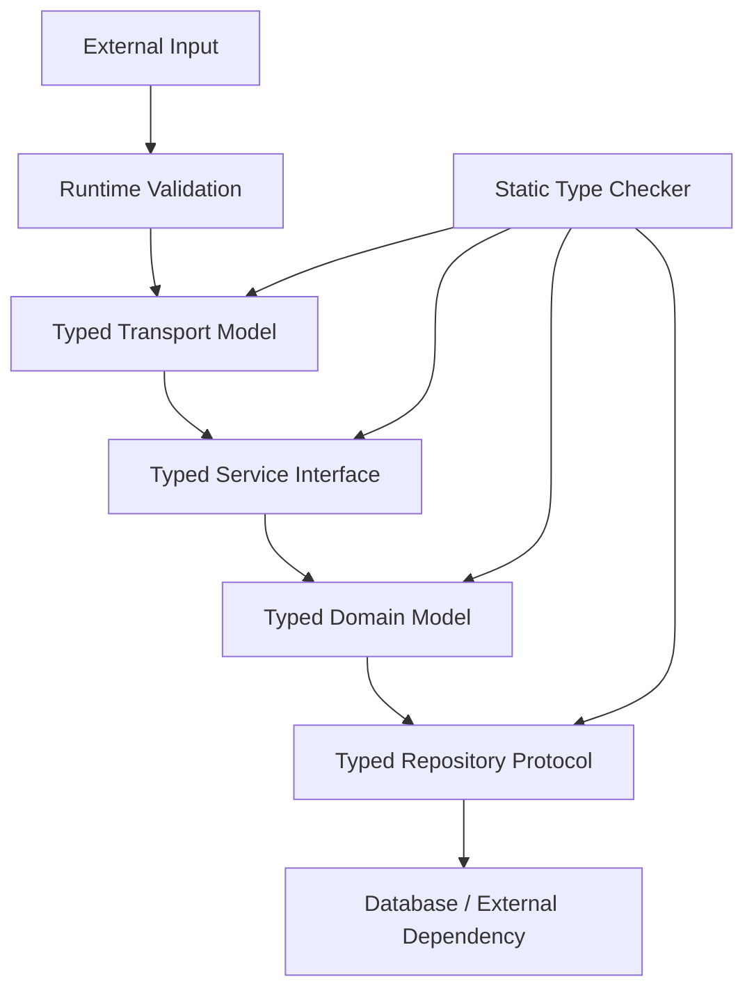

# README

## Overview

The **Type System** section covers Python's mechanisms for expressing, checking, documenting, and enforcing the intended shape of data and behavior.

Python is dynamically typed, but modern Python supports a powerful static type system through:

- type annotations
- built-in generic types
- `TypeVar`
- `Generic`
- `Protocol`
- `TypedDict`
- `TypeGuard`
- `overload`
- `Literal`
- `Final`
- `ClassVar`
- `Self`
- `Annotated`
- static type checkers such as mypy and Pyright

The goal is not to turn Python into a statically typed language. The goal is to make **interfaces, assumptions, and contracts explicit** while retaining Python's runtime flexibility.

A useful mental model is:

```text
Python Runtime
     │
     ├── Executes dynamically typed code
     │
     ▼
Type Annotations
     │
     ├── Document intended contracts
     ├── Enable IDE assistance
     ├── Enable static analysis
     └── Detect many defects before runtime
```

Type hints are therefore primarily a **development-time correctness and maintainability mechanism**. They do not automatically enforce runtime behavior.

---

## Why the Type System Matters

As a Python codebase grows, implicit assumptions become expensive.

Consider:

```python
def create_order(data):
    ...
```

The function provides no information about:

- what `data` contains
- which fields are required
- what the function returns
- which values may be `None`
- which exceptions may occur
- what interface a dependency must implement

A typed interface makes those assumptions visible:

```python
def create_order(request: CreateOrderRequest) -> Order:
    ...
```

This improves:

- readability
- IDE support
- refactoring safety
- code review
- static analysis
- API design
- maintainability
- onboarding
- architectural clarity

For large backend systems, type annotations act as executable documentation for the intended shape of the codebase.

---

## Type Hints vs Runtime Types

Python remains dynamically typed.

```python
def add(a: int, b: int) -> int:
    return a + b
```

The annotations do not automatically prevent:

```python
add("hello", "world")
```

Python will execute the function according to normal runtime semantics.

A static type checker can identify the call as invalid before execution.

```text
Source Code
    │
    ├──────────────► Python Runtime
    │                    │
    │                    ▼
    │                 Execute
    │
    └──────────────► Type Checker
                         │
                         ▼
                  Static Diagnostics
```

This distinction is fundamental:

> **Type hints describe intended types; Python's runtime does not generally enforce them.**

---

## Type Checking Workflow

A production Python project may use:

```text
Developer
    │
    ▼
Python Source
    │
    ├──► Formatter
    ├──► Linter
    ├──► Type Checker
    └──► Tests
             │
             ▼
           CI/CD
```

Typical tooling includes:

- Ruff
- mypy
- Pyright
- pytest
- IDE language servers

Type checking complements tests rather than replacing them.

---

## Basic Type Annotations

Python supports annotations for variables, parameters, and return values.

```python
user_id: int = 1001
name: str = "alice"
active: bool = True
```

Function annotations:

```python
def get_user(user_id: int) -> str:
    return f"user-{user_id}"
```

Return annotations are particularly valuable because they make interfaces easier to understand and compose.

---

## Built-in Generic Types

Modern Python supports generic built-in collections directly.

```python
def get_user_ids() -> list[int]:
    return [1001, 1002, 1003]


def get_user_roles() -> dict[int, str]:
    return {
        1001: "admin",
        1002: "user",
    }


def get_tags() -> set[str]:
    return {"backend", "python"}
```

Prefer:

```python
list[int]
dict[str, int]
set[str]
tuple[str, int]
```

over older forms such as:

```python
List[int]
Dict[str, int]
Set[str]
Tuple[str, int]
```

when targeting modern Python versions.

---

## Optional Values

A value that may be absent should be represented explicitly.

Modern Python can use:

```python
str | None
```

For example:

```python
def get_email(user_id: int) -> str | None:
    ...
```

This communicates that callers must account for both cases:

```python
email = get_email(1001)

if email is not None:
    send_email(email)
```

Avoid pretending that a nullable value is always present.

---

## Union Types

A union indicates that a value may have multiple valid types.

```python
def normalize_id(value: int | str) -> str:
    return str(value)
```

Unions should represent a genuine API contract.

Avoid excessive unions such as:

```python
str | int | float | bytes | list | dict | None
```

when a dedicated model or abstraction would make the interface clearer.

---

## Type Aliases

A type alias gives a meaningful name to a recurring type.

```python
type UserId = int
type Headers = dict[str, str]
```

For older supported Python versions, `TypeAlias` may be required.

Aliases are useful when the underlying type is simple but the semantic meaning matters.

```python
type CustomerId = str
type OrderId = str
```

This improves readability:

```python
def get_order(order_id: OrderId) -> Order:
    ...
```

However, aliases do not create distinct runtime types.

`CustomerId` and `OrderId` remain strings.

---

## NewType

`NewType` provides stronger static distinction for values that share the same runtime representation.

```python
from typing import NewType


UserId = NewType("UserId", int)
OrderId = NewType("OrderId", int)
```

Now:

```python
def get_user(user_id: UserId) -> User:
    ...
```

A type checker can distinguish `UserId` from `OrderId`, while at runtime the value behaves like an integer.

This is useful for preventing accidental identifier mixing.

---

## Any

`Any` disables much of the type checker's protection for a value.

```python
from typing import Any


def process(payload: Any) -> None:
    ...
```

Once a value becomes `Any`, type checking can become permissive:

```python
payload.foo.bar.baz()
```

The checker may not complain.

`Any` is sometimes necessary at integration boundaries, but uncontrolled use effectively creates dynamically typed islands inside an otherwise typed codebase.

Prefer precise types whenever possible.

---

## Unknown Data vs Any

When consuming untrusted or dynamically shaped data, `Any` is often too permissive.

Prefer:

```python
object
```

when the value is genuinely unknown:

```python
def log_value(value: object) -> None:
    print(value)
```

You must narrow `object` before using type-specific operations.

This encourages explicit validation instead of silently bypassing static analysis.

---

## Type Narrowing

Type narrowing means reducing a broad type to a more specific type based on runtime checks.

```python
def process(value: str | int) -> str:
    if isinstance(value, int):
        return str(value * 2)

    return value.upper()
```

The type checker understands that:

```text
inside first branch → int
after branch → str
```

Common narrowing mechanisms include:

- `isinstance`
- `issubclass`
- equality checks
- `is None`
- membership checks
- `TypeGuard`
- pattern matching

---

## TypeGuard

`TypeGuard` allows a custom predicate to communicate narrowing information to a type checker.

```python
from typing import TypeGuard


def is_string_list(value: object) -> TypeGuard[list[str]]:
    return (
        isinstance(value, list)
        and all(isinstance(item, str) for item in value)
    )
```

Then:

```python
value: object = ["a", "b"]

if is_string_list(value):
    for item in value:
        print(item.upper())
```

This is useful when validation logic is reusable and cannot be expressed cleanly with built-in narrowing.

---

## TypedDict

`TypedDict` describes dictionary structures with known keys.

```python
from typing import TypedDict


class UserPayload(TypedDict):
    id: int
    name: str
    active: bool
```

Then:

```python
def process_user(payload: UserPayload) -> None:
    print(payload["name"])
```

`TypedDict` is particularly useful for:

- JSON-like internal structures
- API payloads
- configuration dictionaries
- database result mappings
- intermediate data structures

It provides static structure without changing the runtime object into a custom class.

---

## Required and Not Required Keys

Typed dictionaries can represent partially optional structures.

```python
from typing import NotRequired, TypedDict


class UpdateUserPayload(TypedDict):
    name: NotRequired[str]
    active: NotRequired[bool]
```

This is different from:

```python
name: str | None
```

The distinction is:

```text
NotRequired[str]
→ key may be absent

str | None
→ key must exist but value may be None
```

This distinction matters for PATCH-style APIs and partial updates.

---

## TypedDict vs Dataclass vs Pydantic

| Mechanism | Runtime object | Static typing | Runtime validation | Typical use |
|---|---:|---:|---:|---|
| `TypedDict` | `dict` | Yes | No | JSON-like structures |
| `dataclass` | Class instance | Yes | Limited | Domain/data models |
| Pydantic model | Class instance | Yes | Yes | API/config validation |
| Plain `dict` | `dict` | Weak | No | Dynamic structures |

The choice depends on the boundary.

For external input, runtime validation is often required.

For internal structures already validated elsewhere, `TypedDict` may be sufficient.

---

## Protocols

A `Protocol` defines behavior rather than inheritance.

```python
from typing import Protocol


class UserRepository(Protocol):
    def get_by_id(self, user_id: int) -> User | None:
        ...
```

Any object implementing the compatible method can satisfy the protocol.

```python
class PostgresUserRepository:
    def get_by_id(self, user_id: int) -> User | None:
        ...
```

No explicit inheritance is required.

This enables structural typing.

---

## Why Protocols Matter in Backend Systems

Protocols are useful for dependency inversion.

```text
Service
   │
   ▼
UserRepository Protocol
   ▲
   │
   ├── PostgreSQL Repository
   ├── Redis Repository
   └── Test Fake
```

The service depends on the behavior it requires rather than a concrete implementation.

This improves:

- testing
- dependency injection
- modularity
- substitution
- architecture boundaries

Protocols are especially valuable in ports-and-adapters and hexagonal architectures.

---

## Dependency Injection with Protocols

```python
class UserService:
    def __init__(self, repository: UserRepository):
        self.repository = repository

    def get_user(self, user_id: int) -> User | None:
        return self.repository.get_by_id(user_id)
```

The service does not need to know whether the repository uses:

- PostgreSQL
- Redis
- an HTTP API
- an in-memory fake

The protocol defines the contract.

---

## Generics

Generics allow reusable components to preserve type information.

```python
from typing import Generic, TypeVar


T = TypeVar("T")


class Repository(Generic[T]):
    def get(self, identifier: int) -> T | None:
        ...
```

A concrete repository can then specialize the type:

```python
class UserRepository(Repository[User]):
    ...
```

Generics are useful for:

- repositories
- pagination
- API responses
- result wrappers
- caches
- reusable algorithms
- infrastructure abstractions

---

## Generic API Responses

A reusable response model can preserve the contained type.

Conceptually:

```text
ApiResponse[T]
     │
     ├── ApiResponse[User]
     ├── ApiResponse[Order]
     └── ApiResponse[list[Product]]
```

This is useful when building strongly typed service-layer abstractions.

Avoid introducing generics simply to make straightforward code appear more abstract.

---

## TypeVar

`TypeVar` represents a type parameter.

```python
from typing import TypeVar


T = TypeVar("T")


def first(items: list[T]) -> T:
    return items[0]
```

The return type corresponds to the element type:

```text
list[int] → int
list[str] → str
```

This preserves relationships between input and output types.

---

## Bounded TypeVar

A `TypeVar` can be constrained to a base type.

```python
from typing import TypeVar


T = TypeVar("T", bound="BaseModel")
```

This communicates that `T` must be a subtype of `BaseModel`.

Bounds are useful when generic code requires a known interface or base behavior.

---

## Generic Functions

```python
from collections.abc import Sequence
from typing import TypeVar


T = TypeVar("T")


def first_or_none(items: Sequence[T]) -> T | None:
    return items[0] if items else None
```

Using abstract collection interfaces such as `Sequence` makes APIs more flexible than requiring a concrete `list`.

---

## Variance

Variance describes how generic subtyping behaves when the contained types have subtype relationships.

The three concepts are:

- covariance
- contravariance
- invariance

A simplified mental model:

```text
Covariant
Producer[Child] can substitute Producer[Parent]

Contravariant
Consumer[Parent] can substitute Consumer[Child]

Invariant
Container[Child] and Container[Parent] are unrelated
```

Python's mutable containers are generally invariant in static typing because allowing arbitrary substitution could violate type safety.

For example, a `list[Dog]` cannot generally be treated as a `list[Animal]` because code could then insert a `Cat`.

Variance becomes important when designing reusable generic APIs and protocols.

---

## Iterable and Iterator Types

Use the most general interface required by the function.

Prefer:

```python
from collections.abc import Iterable


def process_users(users: Iterable[User]) -> None:
    for user in users:
        process(user)
```

instead of:

```python
def process_users(users: list[User]) -> None:
    ...
```

when the function does not require list-specific behavior.

This allows callers to provide:

- lists
- tuples
- generators
- database iterators
- custom iterables

This principle is important for memory-efficient backend pipelines.

---

## Callable

Functions can also be typed.

```python
from collections.abc import Callable


def retry(
    operation: Callable[[], bool],
) -> bool:
    return operation()
```

For functions with parameters:

```python
Callable[[int, str], bool]
```

means:

```text
(int, str) → bool
```

`Callable` is useful for:

- callbacks
- strategy functions
- dependency injection
- decorators
- event handlers

---

## Callable Protocols

For complex callable contracts, a protocol can sometimes be clearer than `Callable`.

```python
from typing import Protocol


class Handler(Protocol):
    def __call__(self, payload: dict[str, object]) -> None:
        ...
```

This can be extended with richer behavioral contracts when necessary.

---

## Literal

`Literal` restricts a value to specific constants.

```python
from typing import Literal


SortOrder = Literal["asc", "desc"]


def sort_users(order: SortOrder) -> None:
    ...
```

This is useful for:

- configuration modes
- API parameters
- command options
- state values
- feature flags

It allows static analysis to detect unsupported literal values.

---

## Enum vs Literal

| Requirement | Preferred mechanism |
|---|---|
| Small fixed set of string values | `Literal` |
| Named semantic states | `Enum` |
| Values used heavily in domain logic | `Enum` |
| API parameter alternatives | `Literal` |
| Need runtime enum behavior | `Enum` |

Do not introduce an enum merely to avoid typing a small set of string literals.

---

## Final

`Final` communicates that a name should not be reassigned.

```python
from typing import Final


MAX_RETRIES: Final = 3
```

Static type checkers can flag reassignment.

It is useful for:

- constants
- immutable configuration references
- protocol-level constants

`Final` does not make the underlying object deeply immutable at runtime.

---

## ClassVar

`ClassVar` identifies attributes intended to belong to the class rather than instances.

```python
from typing import ClassVar


class User:
    default_role: ClassVar[str] = "user"
```

This is especially relevant when working with dataclasses and class-level configuration.

---

## Self

`Self` represents the current class type.

```python
from typing import Self


class Query:
    def filter(self, condition: str) -> Self:
        ...
        return self
```

This preserves the concrete subtype through fluent APIs.

It is useful for:

- builder patterns
- fluent interfaces
- inheritance-aware methods
- immutable transformations

---

## Annotated

`Annotated` associates metadata with a type.

```python
from typing import Annotated


UserId = Annotated[int, "positive user identifier"]
```

Frameworks can also use `Annotated` for dependency injection and validation metadata.

FastAPI commonly uses this pattern:

```python
from typing import Annotated

from fastapi import Depends


def get_current_user() -> User:
    ...


CurrentUser = Annotated[User, Depends(get_current_user)]
```

The underlying type remains `User`, while additional metadata communicates framework behavior.

---

## Type Comments and Legacy Syntax

Modern Python generally prefers annotations:

```python
def calculate(value: int) -> float:
    ...
```

rather than legacy comments:

```python
def calculate(value,):
    # type: (int) -> float
    ...
```

Type comments remain relevant when maintaining older code or handling unusual syntax constraints, but new code should generally use standard annotations.

---

## Forward References

Sometimes a type refers to a class defined later.

Modern Python often allows this through postponed annotation behavior or quoted annotations depending on the Python version and configuration.

Example:

```python
class User:
    def manager(self) -> "User | None":
        ...
```

The exact runtime behavior of annotations depends on the Python version and annotation evaluation semantics.

Libraries that inspect annotations at runtime may need special handling.

---

## Runtime Introspection

Annotations are accessible through Python's introspection mechanisms.

```python
def create_user(name: str) -> int:
    return 1001


print(create_user.__annotations__)
```

Frameworks can inspect annotations to construct behavior.

FastAPI, dependency-injection systems, validation libraries, and CLI frameworks can use annotations as metadata.

This creates an important distinction:

```text
Static type checking
        │
        └── compile/development-time analysis

Runtime annotation inspection
        │
        └── framework/application behavior
```

Do not assume these are the same mechanism.

---

## Type Hints Do Not Validate External Input

This is insufficient for untrusted API data:

```python
def create_user(payload: dict[str, object]) -> User:
    ...
```

The annotation does not validate the incoming JSON.

For external boundaries, use runtime validation:

```text
HTTP JSON
   │
   ▼
Pydantic / Serializer
   │
   ▼
Validated model
   │
   ▼
Typed application code
```

Static typing and runtime validation solve different problems.

---

## Type Hints with FastAPI

FastAPI heavily integrates Python annotations into API definitions.

```python
from fastapi import FastAPI
from pydantic import BaseModel


class CreateUser(BaseModel):
    name: str
    email: str


app = FastAPI()


@app.post("/users")
def create_user(request: CreateUser) -> User:
    ...
```

Annotations contribute to:

- request parsing
- validation
- generated OpenAPI schemas
- editor support
- static analysis

This is a strong example of type metadata being useful at both development and runtime boundaries.

---

## Type Hints with Django

Type annotations can be applied throughout Django applications:

```python
def get_user(user_id: int) -> User | None:
    return User.objects.filter(
        id=user_id
    ).first()
```

They are useful in:

- services
- repositories
- serializers
- utility functions
- management commands
- domain models

Django's dynamic ORM APIs can require additional tooling or plugins for maximum static-analysis accuracy.

The goal should be pragmatic type coverage rather than annotating every framework-internal detail manually.

---

## Type Hints with PostgreSQL

Database access often benefits from explicit result types.

```python
class UserRepository:
    def get_by_id(self, user_id: int) -> User | None:
        ...
```

This prevents database-specific details from spreading through business logic.

A useful architecture is:

```text
PostgreSQL
    │
    ▼
Repository
    │
    ▼
Domain Model
    │
    ▼
Service
    │
    ▼
API
```

Types make each boundary explicit.

---

## Type Hints with Kafka

Typed event models make asynchronous contracts easier to reason about.

```python
class OrderCreated:
    event_id: str
    order_id: str
    customer_id: str
```

The actual Kafka payload still requires runtime serialization and validation.

A mature event pipeline uses:

```text
Kafka bytes
    │
    ▼
Deserialize
    │
    ▼
Runtime validation
    │
    ▼
Typed event model
    │
    ▼
Business logic
```

Type hints improve application correctness after the boundary has been established.

---

## Type Hints with Redis

Redis stores bytes or strings rather than Python's static types.

The application therefore needs a boundary:

```text
Redis
  │
  ▼
Deserialize
  │
  ▼
Validate
  │
  ▼
Typed object
```

Versioned serialization is especially important when multiple application versions run during deployment.

---

## Type Hints and Celery

Background task signatures should be explicit.

```python
from celery import shared_task


@shared_task
def process_order(order_id: int) -> None:
    ...
```

The annotation documents the task contract.

It does not validate the message received from the broker.

The worker still needs appropriate runtime validation where the task boundary is externally mutable or safety-critical.

---

## Type Hints and Microservices

Types become especially valuable when service boundaries multiply.

```text
Service A
   │
   │ contract
   ▼
Service B
   │
   │ contract
   ▼
Service C
```

Within a single repository, static types can catch many incompatible changes.

Across independently deployed services, types should be complemented by:

- OpenAPI
- Protobuf
- JSON Schema
- Avro schemas
- contract tests
- runtime validation

Static typing does not cross a network boundary by itself.

---

## Type Checking Configuration

A project should configure one primary static type checker consistently.

For mypy:

```toml
[tool.mypy]
python_version = "3.12"
strict = true
```

For Pyright, configuration can be maintained in `pyproject.toml` or `pyrightconfig.json` depending on project conventions.

The exact strictness level should reflect the maturity of the codebase.

A common migration strategy is:

```text
Untyped
   │
   ▼
Basic annotations
   │
   ▼
Type checking
   │
   ▼
Strict modules
   │
   ▼
Strict project
```

Do not enable maximum strictness without considering existing technical debt and team adoption.

---

## Strictness

Strict type checking commonly catches:

- missing return annotations
- incompatible assignments
- invalid argument types
- unsafe optional handling
- unreachable code
- incompatible overrides
- incomplete generic usage

Strictness is most valuable when the team treats type-checking failures as real defects rather than warnings to ignore.

---

## Type Coverage

Do not measure type quality only by the percentage of annotated lines.

A codebase can be heavily annotated while still relying on:

```python
Any
cast(...)
```

everywhere.

More useful questions include:

- Are public interfaces typed?
- Are service boundaries typed?
- Are nullable values explicit?
- Are generic abstractions precise?
- Are external inputs validated?
- Are unsafe casts minimized?
- Does CI enforce type checking?

Type quality is about correctness of the model, not annotation volume.

---

## `cast`

`cast` tells the type checker to treat a value as another type.

```python
from typing import cast


user = cast(User, repository.get())
```

`cast` does not perform runtime validation.

If the object is not actually a `User`, the program can still fail later.

Use `cast` only when you have stronger knowledge than the type checker and there is no better way to express that knowledge.

Frequent casting is often a sign that the type model or API boundary needs improvement.

---

## `assert` for Narrowing

An assertion can narrow types:

```python
user = get_user(user_id)

assert user is not None

send_email(user.email)
```

This is appropriate only when the invariant is genuinely guaranteed.

Do not use assertions as a replacement for normal input validation.

Remember that assertions can be disabled with Python optimization settings.

---

## Overloads

`@overload` describes multiple valid call signatures for one implementation.

```python
from typing import overload


@overload
def get_value(key: str) -> str | None:
    ...


@overload
def get_value(key: int) -> int | None:
    ...


def get_value(key: str | int) -> str | int | None:
    ...
```

Overloads improve static type inference for APIs whose return type depends on the input type.

The implementation must still correctly handle all declared cases.

---

## When to Use Overloads

Use overloads when:

- the API genuinely has multiple call signatures
- the return type depends on input
- static callers benefit from precise inference

Avoid overloads when a single clean union-based signature is sufficient.

Overloading can make APIs significantly harder to maintain if used excessively.

---

## Type System and API Design

Types should reflect the semantic API.

Prefer:

```python
def charge(
    payment: PaymentRequest,
) -> PaymentResult:
    ...
```

over:

```python
def charge(
    data: dict[str, object],
) -> dict[str, object]:
    ...
```

The second API pushes contract knowledge into every caller.

The first establishes an explicit boundary.

---

## Types and Domain Models

Transport models and domain models do not always need to be identical.

```text
HTTP Request Model
       │
       ▼
Application Service
       │
       ▼
Domain Model
       │
       ▼
Persistence Model
```

For example:

```text
CreateUserRequest
User
UserRecord
```

may have different responsibilities.

Avoid forcing one class to represent every layer merely to reduce the number of types.

---

## Types and Immutability

Type hints can express some immutable intent.

```python
from typing import Final


DEFAULT_TIMEOUT: Final = 30
```

For immutable data structures, use appropriate runtime mechanisms such as:

- frozen dataclasses
- tuples
- immutable domain objects

Static typing alone does not make objects immutable.

---

## Type Hints and Concurrency

Types can make concurrent APIs easier to understand.

```python
from collections.abc import Awaitable, Callable


Handler = Callable[[Event], Awaitable[None]]
```

This makes it explicit that handlers are asynchronous.

For concurrency-heavy systems, type annotations help communicate:

- synchronous vs asynchronous APIs
- callback contracts
- task interfaces
- queue payloads
- worker boundaries

They do not prevent race conditions or deadlocks.

Runtime synchronization is still required.

---

## Type Hints and Performance

Type hints generally have little direct impact on normal Python execution performance.

The primary benefits are development-time:

```text
Type hints
   │
   ├── IDE support
   ├── static analysis
   ├── refactoring
   └── documentation
```

Runtime frameworks that inspect annotations may introduce some processing overhead, but this is separate from ordinary Python execution.

Do not add or remove annotations as a micro-optimization strategy.

---

## Import Cycles

Types can introduce import dependencies.

For example:

```text
module_a
   │
   ▼
module_b
   │
   ▼
module_a
```

This can cause circular imports.

Potential strategies include:

- restructuring modules
- using protocols
- moving shared types
- using local imports where justified
- using forward references appropriately

Persistent circular imports usually indicate an architectural dependency problem rather than merely a typing problem.

---

## Type-Only Imports

Python supports:

```python
from typing import TYPE_CHECKING


if TYPE_CHECKING:
    from .models import User
```

This can prevent runtime imports that are needed only for static analysis.

Use this carefully. Excessive use can make module dependencies harder to understand.

Prefer architectural improvements when circular dependencies become widespread.

---

## Type Checking in CI/CD

A production repository should normally include type checking in CI.

```text
Pull Request
     │
     ├── Tests
     ├── Lint
     ├── Type Check
     └── Build
          │
          ▼
       Merge
```

Example:

```bash
python -m pytest
python -m mypy src/
```

or the project's selected checker and configuration.

Type checking should fail the build when the project contract requires type correctness.

---

## IDE Integration

Modern IDEs use type information for:

- autocomplete
- navigation
- refactoring
- parameter hints
- error highlighting
- symbol discovery

Good type annotations therefore improve developer productivity even when the application never inspects annotations at runtime.

---

## Common Mistakes

### Assuming Type Hints Enforce Runtime Types

```python
def process(value: int):
    ...
```

does not automatically reject a string at runtime.

### Using `Any` Everywhere

This eliminates much of the benefit of static analysis.

### Excessive `cast`

Repeated casts often indicate that the underlying interface is incorrectly typed.

### Using `dict[str, object]` for Every API

This hides the structure that the application actually depends on.

### Typing Concrete Collections Too Narrowly

If a function only needs an iterable, requiring `list[T]` unnecessarily restricts callers.

### Ignoring `None`

If a value can be absent, make that possibility explicit with `T | None`.

### Confusing `NotRequired` with `T | None`

An optional key and a nullable value are different contracts.

### Overengineering with Generics

Not every repository, service, or utility needs a generic abstraction.

### Using `assert` for User Input

Assertions express internal invariants, not reliable external validation.

### Believing Static Types Cross Network Boundaries

A type annotation in Service A does not enforce the payload received by Service B.

### Ignoring Framework Boundaries

Dynamic ORMs, serializers, and third-party libraries may require explicit typing strategies.

### Running the Type Checker Only Locally

If CI does not enforce the contract, type regressions eventually enter the codebase.

---

## Production Type System Strategy

A mature Python backend can use multiple layers:



Runtime validation protects the application from invalid external data.

Static typing protects developers from many incorrect assumptions inside the application.

The two systems reinforce each other.

---

## Recommended Design Principles

### Type Public Interfaces

Prioritize:

- service methods
- repository interfaces
- API handlers
- event handlers
- background tasks
- reusable libraries

### Prefer Precise Types

Use:

```python
User | None
```

instead of hiding uncertainty behind:

```python
Any
```

### Depend on Behavior

Use `Protocol` when a component needs an interface rather than a specific implementation.

### Keep Types Near Their Domain

Do not create one enormous `types.py` containing unrelated application concepts.

### Validate at Boundaries

Use runtime validation for:

- HTTP
- Kafka
- Redis
- files
- external APIs
- configuration

### Keep CI Strict Enough

Type checking should provide meaningful guarantees without becoming an ignored source of warnings.

### Minimize Escapes

Limit:

```python
Any
cast(...)
```

to places where they are genuinely justified.

---

## Type System Decision Guide

| Requirement | Recommended tool |
|---|---|
| Basic parameter/return contract | Type annotations |
| Nullable value | `T | None` |
| Fixed literal choices | `Literal` |
| Semantic identifier over primitive | `NewType` |
| Typed dictionary | `TypedDict` |
| Runtime-validated request | Pydantic / serializer |
| Reusable generic component | `TypeVar` / `Generic` |
| Behavioral interface | `Protocol` |
| Type-dependent overload | `@overload` |
| Narrowing custom predicate | `TypeGuard` |
| Constant binding | `Final` |
| Class-level attribute | `ClassVar` |
| Fluent inheritance-aware API | `Self` |
| Framework metadata | `Annotated` |

---

## Interview Perspective

### Are Python type hints enforced at runtime?

Generally no. They are primarily consumed by static type checkers and tools, although frameworks can inspect annotations at runtime.

### What is the difference between `Any` and `object`?

`Any` largely disables static checking for the value. `object` represents an unknown value while requiring explicit narrowing before type-specific operations.

### What is `Protocol`?

A protocol defines a behavioral interface using structural typing. A class can satisfy the protocol without explicitly inheriting from it.

### Why use `TypedDict`?

It provides static checking for dictionary-shaped data without changing the runtime representation from a normal dictionary.

### Why use `NewType`?

It allows static type checkers to distinguish semantically different values that share the same runtime representation.

### What is `TypeVar` used for?

It preserves relationships between input and output types in reusable generic code.

### Why are `list[Dog]` and `list[Animal]` generally not interchangeable?

Lists are mutable. Treating a list of dogs as a list of animals could allow a cat or another animal to be inserted, violating the original list's type invariant.

### Do type hints replace Pydantic validation?

No. Static typing does not validate untrusted runtime data. External boundaries still require runtime validation.

### Can type annotations prevent race conditions?

No. Types describe data and interfaces; concurrency correctness requires synchronization, transactions, atomic operations, and appropriate concurrency design.

### Should every function be maximally generic?

No. Types should make contracts clearer. Abstraction and generic complexity should be justified by reuse or architectural requirements.

---

## Production Checklist

Before considering a Python service well-typed, verify:

- Public function interfaces have meaningful annotations.
- Return types are explicit for important APIs.
- Nullable values use explicit union types.
- Generic collections use precise element types.
- `Any` is restricted to justified boundaries.
- Dynamic input is validated at runtime.
- `TypedDict` is used for appropriate dictionary-shaped structures.
- Domain models are typed explicitly.
- Service and repository interfaces are typed.
- `Protocol` is used where behavioral abstraction is valuable.
- `TypeVar` and generics are used where they preserve meaningful type relationships.
- `Literal` is used for appropriate fixed-value contracts.
- `NewType` is considered for semantically distinct primitive identifiers.
- Type narrowing is explicit and safe.
- Custom narrowing predicates use `TypeGuard` where appropriate.
- `cast()` is minimized and documented when unavoidable.
- `assert` is not used as a substitute for external validation.
- Framework-specific runtime typing behavior is understood.
- Static type checking runs in CI/CD.
- Type-checking configuration is version-controlled.
- IDE and language-server support works consistently across the team.
- Type errors are treated as engineering defects rather than permanently ignored warnings.
- Type boundaries between REST, gRPC, Kafka, Redis, PostgreSQL, and external APIs are explicit.
- Schema validation and static typing are treated as complementary mechanisms.
- Type-related circular imports are addressed architecturally.
- Generic abstractions remain understandable.
- Types reflect domain semantics rather than merely mirroring implementation details.

## Key Takeaways

- Python type hints primarily provide static contracts, IDE support, and safer refactoring; they do not generally enforce types at runtime.
- Use precise modern constructs such as `T | None`, built-in generics, `TypedDict`, `Protocol`, `TypeVar`, `Literal`, `NewType`, and `TypeGuard` according to the contract being modeled.
- Static typing and runtime validation solve different problems: validate untrusted data at boundaries, then use types to make the internal application contract explicit.
- Strong typing is most valuable at architectural boundaries such as APIs, services, repositories, events, background jobs, and domain models.
- Type safety is a team and CI/CD practice as much as a language feature; consistent checking, minimal `Any`/`cast`, and maintainable abstractions matter more than maximizing annotation volume.