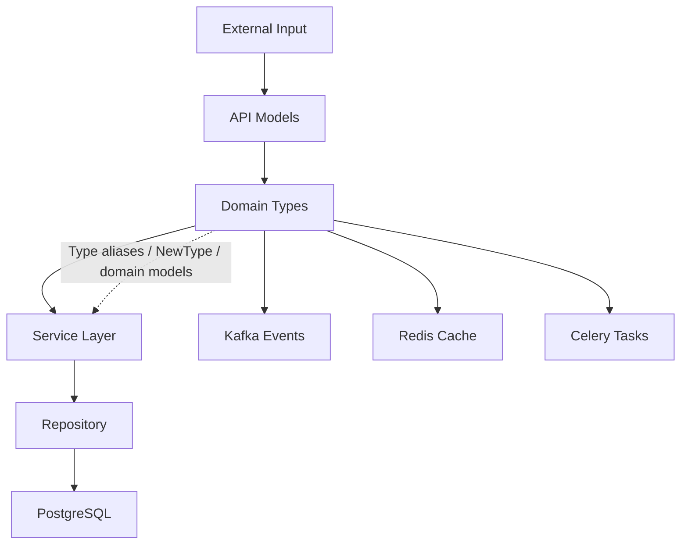

# 06- Type Aliases

## Overview

A type alias gives a type expression a meaningful name.

Instead of repeatedly writing:

```python
dict[int, list[str]]
```

you can define:

```python
type UserTags = dict[int, list[str]]
```

and use:

```python
def get_user_tags() -> UserTags:
    ...
```

Type aliases are primarily a **static typing and readability mechanism**. They do not normally create a new runtime type.

They are particularly valuable when a type expression represents a meaningful domain concept:

```python
type UserId = int
type OrderId = int
type UserTags = dict[UserId, list[str]]
type EventHandler = Callable[[DomainEvent], None]
```

The important engineering distinction is between:

```text
Type alias
    │
    └── gives an existing type expression a name

NewType
    │
    └── creates a statically distinct type

Class / dataclass
    │
    └── creates a runtime domain object
```

Choosing the right mechanism determines how much semantic and runtime protection the codebase receives.

---

## Why Type Aliases Matter

Large backend systems repeatedly use domain-specific structures.

Without aliases:

```python
def load_permissions(
    user_id: int,
) -> dict[str, list[tuple[int, str]]]:
    ...


def save_permissions(
    permissions: dict[str, list[tuple[int, str]]],
) -> None:
    ...
```

The syntax becomes difficult to understand.

With an alias:

```python
type PermissionMap = dict[str, list[tuple[int, str]]]


def load_permissions(user_id: int) -> PermissionMap:
    ...


def save_permissions(permissions: PermissionMap) -> None:
    ...
```

The type now communicates domain intent.

```text
Complex structure
       │
       ▼
PermissionMap
       │
       ├── readable
       ├── reusable
       └── centrally maintainable
```

---

## Modern Type Alias Syntax

Modern Python supports the `type` statement:

```python
type UserId = int
type UserMap = dict[int, User]
```

This syntax was introduced in Python 3.12.

It is generally preferred for new projects targeting Python 3.12+.

For projects supporting older Python versions, use the compatible syntax described later.

---

## Traditional Type Alias Syntax

Before Python 3.12, a type alias was commonly written as:

```python
UserId = int
UserMap = dict[int, User]
```

Static type checkers can recognize these assignments as aliases when the context is unambiguous.

The `typing.TypeAlias` marker can make the intent explicit:

```python
from typing import TypeAlias


UserMap: TypeAlias = dict[int, User]
```

For new Python 3.12+ code, prefer:

```python
type UserMap = dict[int, User]
```

when project compatibility permits it.

---

## Type Alias vs Variable

The modern `type` statement makes the distinction explicit:

```python
type UserIds = list[int]
```

This is a type alias.

By contrast:

```python
user_ids = [1001, 1002]
```

is a runtime value.

The distinction matters because a type alias is consumed by static typing tools, while a normal variable contains runtime data.

---

## Type Aliases Do Not Create New Runtime Types

Consider:

```python
type UserId = int
```

This does not create a new class.

At runtime, values remain ordinary integers:

```python
user_id: UserId = 1001
```

The object is still an `int`.

This means:

```text
UserId
   │
   └── static name for int

runtime value
   │
   └── ordinary int object
```

If the application needs runtime distinction, use `NewType` or a domain class.

---

## Semantic Aliases

Some aliases mainly improve readability.

```python
type UserId = int
type OrderId = int
```

These names communicate domain meaning but do not necessarily make the two types incompatible.

With a simple alias:

```python
type UserId = int
type OrderId = int
```

a type checker generally treats both as the underlying `int`.

Therefore:

```python
order_id: OrderId = user_id
```

does not provide the strong semantic separation that a `NewType` can provide.

---

## When a Simple Alias Is Appropriate

Use a simple alias when the underlying type is already semantically sufficient and the main benefit is readability.

Good examples:

```python
type JSONValue = str | int | float | bool | None
type Headers = Mapping[str, str]
type UserPermissions = frozenset[str]
type EventHandler = Callable[[DomainEvent], None]
```

The alias communicates the role of the structure without requiring a new runtime abstraction.

---

## When a Simple Alias Is Not Enough

Suppose:

```python
type UserId = int
type OrderId = int
```

Both remain `int` from the type checker's perspective.

If accidentally passing an order ID to a function requiring a user ID would be a serious defect, consider:

```python
from typing import NewType


UserId = NewType("UserId", int)
OrderId = NewType("OrderId", int)
```

Now static tooling can distinguish them.

---

## Type Alias vs `NewType`

These solve different problems.

| Mechanism | Example | Creates distinct static type? | Creates runtime class? |
|---|---|---:|---:|
| Type alias | `type UserId = int` | No | No |
| `NewType` | `UserId = NewType("UserId", int)` | Yes | No |
| Dataclass | `@dataclass class UserId` | Yes | Yes |
| Class | `class UserId:` | Yes | Yes |

Use:

```text
Alias
→ naming an existing type

NewType
→ statically distinguishing an existing type

Class/dataclass
→ modeling runtime behavior or state
```

---

## Type Aliases for Complex Collections

Aliases are especially useful for nested generic structures.

Instead of:

```python
dict[str, list[tuple[int, datetime]]]
```

use:

```python
type UserActivity = dict[str, list[tuple[int, datetime]]]
```

Then:

```python
def load_activity() -> UserActivity:
    ...
```

The reader can reason about the domain concept first and inspect the underlying representation when necessary.

---

## Type Aliases for Callables

Callable signatures can become difficult to read:

```python
Callable[
    [Request, User, CancellationToken],
    Awaitable[Response],
]
```

An alias makes the contract reusable:

```python
type RequestHandler = Callable[
    [Request, User, CancellationToken],
    Awaitable[Response],
]
```

Then:

```python
def register_handler(handler: RequestHandler) -> None:
    ...
```

This is particularly useful for:

- middleware
- event handlers
- task functions
- dependency injection
- plugin systems
- callback registries

---

## Type Aliases for Unions

Repeated unions should sometimes receive a domain name.

```python
type UserIdentifier = int | str
```

Then:

```python
def get_user(identifier: UserIdentifier) -> User | None:
    ...
```

This is preferable when the union represents a meaningful concept.

Avoid creating aliases merely to shorten trivial expressions.

---

## Type Aliases for JSON

A recursive JSON type can be modeled explicitly.

For example:

```python
from typing import TypeAlias


JSONScalar: TypeAlias = str | int | float | bool | None
JSONValue: TypeAlias = (
    JSONScalar
    | list["JSONValue"]
    | dict[str, "JSONValue"]
)
```

This describes the recursive JSON value space.

With Python 3.12+ syntax:

```python
type JSONScalar = str | int | float | bool | None
type JSONValue = JSONScalar | list[JSONValue] | dict[str, JSONValue]
```

Recursive aliases should be used carefully because overly broad JSON types can still provide limited domain-level guarantees.

---

## JSON Type Alias vs Domain Model

A generic JSON alias:

```python
type JSONValue = (
    str
    | int
    | float
    | bool
    | None
    | list["JSONValue"]
    | dict[str, "JSONValue"]
)
```

describes valid JSON-like data.

It does not describe business semantics.

For:

```json
{
  "id": 1001,
  "email": "user@example.com"
}
```

a domain model is usually stronger:

```python
class UserResponse(BaseModel):
    id: int
    email: str
```

Use the JSON alias for generic infrastructure.

Use models for application-level contracts.

---

## Type Aliases and `TypedDict`

A type alias is useful for naming a type expression:

```python
type UserMap = dict[int, User]
```

`TypedDict` is useful when the keys and their types are part of the contract:

```python
from typing import TypedDict


class UserPayload(TypedDict):
    id: int
    email: str
    active: bool
```

The distinction is:

```text
dict[int, User]
    → homogeneous mapping

TypedDict
    → fixed dictionary-shaped structure
```

Do not use a generic dictionary alias when the application's correctness depends on specific field names.

---

## Type Aliases and `Literal`

Aliases can name constrained literal values:

```python
from typing import Literal


type Environment = Literal[
    "development",
    "staging",
    "production",
]
```

Then:

```python
def deploy(environment: Environment) -> None:
    ...
```

This provides a precise static contract for finite string values.

For larger domain state machines, an `Enum` may provide stronger runtime semantics.

---

## Type Aliases and Enums

Compare:

```python
type Environment = Literal[
    "development",
    "staging",
    "production",
]
```

with:

```python
from enum import StrEnum


class Environment(StrEnum):
    DEVELOPMENT = "development"
    STAGING = "staging"
    PRODUCTION = "production"
```

Use a literal alias when the values primarily exist as a typing constraint.

Use an enum when the concept has:

- runtime behavior
- methods
- serialization behavior
- reusable constants
- domain semantics

---

## Type Aliases and `Annotated`

Aliases can also name annotated types.

```python
from typing import Annotated


type UserId = Annotated[int, "positive user identifier"]
```

`Annotated` metadata can be consumed by frameworks or tooling.

However, arbitrary metadata does not automatically enforce runtime validation.

If the constraint is security- or correctness-critical, use runtime validation as well.

---

## Type Aliases and `Protocol`

Aliases can name protocol types:

```python
from typing import Protocol


class SupportsClose(Protocol):
    def close(self) -> None:
        ...
```

The protocol itself is already a named type abstraction, so a separate alias is often unnecessary.

A useful rule is:

```text
Simple reusable type expression
    → type alias

Behavioral contract
    → Protocol

Runtime domain object
    → class / dataclass
```

---

## Type Aliases and Generics

Generic type aliases can represent reusable parameterized structures.

Conceptually:

```python
type Result[T] = T | Error
```

Modern Python's generic type-alias syntax is particularly useful when the relationship is meaningful.

For example:

```python
type Page[T] = list[T]
```

Although a simple alias such as this may not add much value.

A more meaningful example is:

```python
type HandlerMap[T] = dict[str, Callable[[T], None]]
```

This communicates a reusable relationship between an event type and its handlers.

---

## Generic Type Alias vs Generic Class

Consider:

```python
type HandlerMap[T] = dict[str, Callable[[T], None]]
```

versus:

```python
class HandlerRegistry[T]:
    ...
```

The alias is appropriate when the underlying dictionary representation is sufficient.

A class is better when the abstraction needs:

- methods
- validation
- lifecycle
- state
- invariants
- logging
- synchronization
- runtime behavior

Do not create a class merely to wrap a type alias.

---

## Type Aliases and Type Parameters

Modern Python supports type parameters:

```python
type Result[T] = T | Error
```

This expresses:

```text
Result[User]
Result[Order]
Result[Payment]
```

with the same structural relationship.

For projects supporting older Python versions, use `TypeVar`:

```python
from typing import TypeVar


T = TypeVar("T")

Result = T | Error
```

The exact syntax and capabilities should match the project's supported Python and type-checker versions.

---

## Type Alias Scope

Aliases can be defined at module scope:

```python
type UserId = int
type UserMap = dict[UserId, User]
```

This is usually preferable for shared application contracts.

Avoid defining important aliases deep inside functions unless they are truly local to that operation.

Module-level aliases provide:

- discoverability
- reuse
- consistent naming
- easier static analysis

---

## Organizing Type Aliases

Large projects may maintain dedicated type modules:

```text
app/
├── domain/
│   ├── models.py
│   └── types.py
├── services/
├── repositories/
└── api/
```

For example:

```python
# domain/types.py

type UserId = int
type OrderId = int
type UserPermissions = frozenset[str]
```

Keep aliases close to the domain they represent.

Do not create a giant global `types.py` containing every unrelated type in a large monolith.

---

## Avoiding Circular Imports

Type aliases can introduce import cycles.

For example:

```text
domain/types.py
      │
      ▼
domain/models.py
      │
      ▼
domain/types.py
```

Use type-only imports when appropriate:

```python
from typing import TYPE_CHECKING

if TYPE_CHECKING:
    from .models import User
```

Then use forward references when required.

However, if aliases and models depend heavily on each other, that can indicate a module-boundary problem.

Fix the architecture rather than accumulating import workarounds.

---

## Type Aliases and Runtime Introspection

A type alias is available to static tooling and may also be represented in Python's typing runtime machinery.

However, do not design business logic around fragile introspection of type aliases.

Runtime application behavior should generally depend on actual objects, classes, and validated models.

Static typing should remain primarily a development-time contract.

---

## Type Aliases and `isinstance()`

Do not assume a type alias is a runtime class.

For example:

```python
type UserIds = list[int]
```

does not mean you can safely use:

```python
isinstance(value, UserIds)
```

to validate element types.

Runtime collection validation must inspect the collection contents or use a validation framework.

The alias describes the intended type relationship; it does not perform runtime validation.

---

## Type Aliases and Runtime Validation

Consider:

```python
type UserPayload = dict[str, object]
```

This does not validate:

```python
payload
```

at runtime.

If the data originates from HTTP, Kafka, Redis, or an external API:

```text
External data
      │
      ▼
Parsing
      │
      ▼
Runtime validation
      │
      ▼
Typed model
```

The alias helps static analysis after the data has been correctly represented.

---

## Type Aliases and PostgreSQL

Database identifiers are often good candidates for aliases:

```python
type UserId = int
type OrderId = int
```

For a larger system where ID mix-ups are costly, consider `NewType`:

```python
from typing import NewType


UserId = NewType("UserId", int)
OrderId = NewType("OrderId", int)
```

This allows static analysis to detect accidental mixing while preserving the lightweight runtime representation of an integer.

---

## Type Aliases and Redis

Cache keys can be named:

```python
type CacheKey = str
```

More useful aliases may describe structured data:

```python
type UserCache = dict[str, User]
```

However, the alias does not guarantee that Redis contains valid serialized `User` objects.

The cache adapter should deserialize and validate data before returning the typed result.

---

## Type Aliases and Kafka

Event unions can be named:

```python
type DomainEvent = (
    UserCreated
    | UserDeleted
    | OrderCreated
    | OrderCancelled
)
```

This gives event dispatchers a readable contract:

```python
def dispatch(event: DomainEvent) -> None:
    ...
```

For evolving distributed systems, version-specific events should generally be normalized before entering the core domain layer.

---

## Type Aliases and REST APIs

Response collections often benefit from aliases:

```python
type UserList = list[User]
```

However, aliases should not replace explicit response models when the API contract contains metadata:

```python
class UserListResponse(BaseModel):
    items: list[User]
    total: int
    next_cursor: str | None
```

A model communicates the wire contract more effectively than a nested generic alias.

---

## Type Aliases and gRPC

Generated gRPC code provides its own message types.

Application-specific aliases can still simplify internal structures:

```python
type UserIds = list[int]
```

Avoid aliasing generated protocol objects merely to rename them unless the alias expresses a meaningful application-level abstraction.

Wire schemas and domain types should remain conceptually separate.

---

## Type Aliases and Celery

Task arguments can use aliases:

```python
type OrderIds = list[int]


def process_orders(order_ids: OrderIds) -> None:
    ...
```

The alias improves readability, but Celery still serializes the actual values.

If the task contract is shared across many services, a schema or DTO may be more appropriate than a Python-only alias.

---

## Type Aliases and AWS

Aliases can make AWS integration code clearer.

For example:

```python
type S3ObjectKey = str
type AwsRequestId = str
```

These are semantic names, but they do not prevent accidental mixing with other strings.

If static distinction is important:

```python
S3ObjectKey = NewType("S3ObjectKey", str)
```

Use stronger modeling when mistakes can cause incorrect resource access or security issues.

---

## Naming Conventions

Type aliases should use PascalCase.

Good:

```python
type UserId = int
type UserMap = dict[int, User]
type RequestHandler = Callable[[Request], Response]
```

Avoid:

```python
type user_id = int
type user_map = dict[int, User]
```

Naming should describe the semantic type, not merely repeat its implementation.

---

## Good Alias Names

Prefer:

```python
type UserIdentifier = int
type PermissionSet = frozenset[str]
type EventHandler = Callable[[DomainEvent], None]
type UserById = dict[UserId, User]
```

over:

```python
type IntList = list[int]
type StringDict = dict[str, str]
```

unless the generic structure itself is the meaningful concept.

---

## Aliases Should Encode Meaning

Compare:

```python
type StringList = list[str]
```

with:

```python
type EmailRecipients = list[str]
```

The second communicates why the list exists.

However, if the semantic type needs validation or behavior, use a domain model instead.

---

## Aliases and API Readability

Consider:

```python
def publish(
    handlers: dict[str, Callable[[DomainEvent], None]],
) -> None:
    ...
```

versus:

```python
type EventHandlers = dict[str, Callable[[DomainEvent], None]]


def publish(
    handlers: EventHandlers,
) -> None:
    ...
```

The alias makes the API signature easier to scan.

This becomes increasingly valuable as type expressions become more complex.

---

## Aliases and Documentation

Type aliases act as executable documentation.

Compare:

```python
def authorize(
    permissions: frozenset[str],
) -> bool:
    ...
```

with:

```python
type PermissionSet = frozenset[str]


def authorize(
    permissions: PermissionSet,
) -> bool:
    ...
```

The second communicates domain intent directly in the function signature.

The implementation remains unchanged.

---

## Aliases and Refactoring

Aliases centralize representation.

Suppose:

```python
type UserTags = list[str]
```

is later changed to:

```python
type UserTags = frozenset[str]
```

many function signatures remain unchanged.

This can simplify refactoring.

However, aliases should not hide breaking semantic changes. Changing mutability, ordering, or uniqueness can still affect callers even when the alias name remains the same.

---

## Aliases Do Not Guarantee Behavioral Compatibility

Changing:

```python
type UserTags = list[str]
```

to:

```python
type UserTags = frozenset[str]
```

changes behavior:

| Property | `list[str]` | `frozenset[str]` |
|---|---|---|
| Mutable | Yes | No |
| Ordered | Yes | No guaranteed sequence semantics |
| Duplicates | Allowed | Removed |
| Hashable | No | Yes |

Therefore, type aliases can simplify representation changes but do not eliminate semantic compatibility concerns.

---

## Type Aliases and Immutability

Aliases can make immutable structures explicit:

```python
type PermissionSet = frozenset[str]
type Coordinates = tuple[float, float]
```

This communicates useful invariants to readers and type checkers.

For production code, immutability can reduce accidental mutation and simplify concurrent access, but the alias itself does not enforce domain invariants beyond the underlying type.

---

## Performance Considerations

Type aliases generally have negligible runtime performance impact.

They do not add:

- object allocation
- method dispatch
- serialization overhead
- network calls
- database operations

The runtime representation remains the underlying type.

Performance considerations come from the aliased type itself:

```python
list[T]
```

and:

```python
frozenset[T]
```

have different memory and lookup characteristics even if both are hidden behind aliases.

---

## Memory Considerations

An alias does not change memory behavior.

For example:

```python
type UserIds = list[int]
```

still creates a normal list.

If a large service processes millions of IDs, the underlying collection determines memory usage.

Use aliases to communicate intent, not as a performance optimization.

---

## Concurrency Considerations

Aliases do not provide synchronization.

This:

```python
type UserCache = dict[UserId, User]
```

does not make concurrent access safe.

Thread safety, process safety, and distributed consistency still require appropriate architecture.

If the underlying data is shared across threads or workers, consider:

- immutability
- locks
- actor/message-passing patterns
- database transactions
- Redis
- process-local ownership

depending on the system.

---

## Security Considerations

A type alias is not a security boundary.

This:

```python
type S3ObjectKey = str
```

does not validate whether a key is authorized or safe.

For security-sensitive types:

```text
raw input
   │
   ▼
validation
   │
   ▼
authorization
   │
   ▼
domain representation
```

Consider `NewType`, dedicated value objects, or validated models when accidental mixing could produce security-sensitive behavior.

---

## Type Aliases and Static Analysis

Aliases become most valuable when the project uses static analysis consistently.

Typical tooling includes:

- mypy
- Pyright
- IDE type analysis
- Ruff typing-related rules
- CI checks

For example:

```text
Developer change
      │
      ▼
Type checker
      │
      ├── incompatible alias usage
      ├── invalid union
      └── incorrect callable
      │
      ▼
CI result
```

Aliases improve static analysis only when the underlying type relationships are precise.

---

## Common Mistakes

### Using Aliases for Every Type

This:

```python
type StringValue = str
type IntegerValue = int
```

usually adds little value.

Create aliases when the name carries meaningful semantic information.

### Confusing Aliases with `NewType`

A simple alias does not create a statically distinct type.

### Expecting Runtime Validation

This:

```python
type UserIds = list[int]
```

does not verify that a runtime list contains integers.

### Hiding Important Mutability

An alias can hide whether the underlying structure is mutable.

Document or choose the underlying type carefully.

### Creating a Giant `types.py`

Unrelated aliases in one module can create:

- import cycles
- poor discoverability
- unclear ownership
- unnecessary coupling

Keep aliases close to their domain.

### Overly Generic Names

Names such as:

```python
type Data = dict[str, object]
```

communicate little.

### Aliasing Domain Models Unnecessarily

This:

```python
type UserResponse = User
```

may obscure whether the API and domain contracts are actually intended to be identical.

### Using Aliases Instead of Models

If runtime validation, behavior, invariants, or serialization rules matter, a model may be more appropriate.

### Using `Any` Inside Aliases

Avoid:

```python
type Payload = dict[str, Any]
```

unless the dynamic structure is genuinely unavoidable.

### Ignoring Version Compatibility

The `type` statement and generic type-alias syntax require a sufficiently modern Python version and compatible tooling.

---

## Production Type Design

A useful progression is:

```text
Simple representation
       │
       ▼
Type alias
       │
       │ semantic distinction needed
       ▼
NewType
       │
       │ runtime behavior / invariants needed
       ▼
Dataclass / value object / class
       │
       │ external validation / schema required
       ▼
Pydantic or dedicated boundary model
```

Example:

```python
type UserId = int
```

may be sufficient initially.

If ID mix-ups become a concern:

```python
UserId = NewType("UserId", int)
```

If the identifier needs runtime validation and behavior:

```python
@dataclass(frozen=True)
class UserId:
    value: int

    def __post_init__(self) -> None:
        if self.value <= 0:
            raise ValueError("UserId must be positive")
```

Each step provides stronger semantics but also introduces more complexity.

---

## Architecture Example

A backend application can keep aliases organized by domain:



The important boundary is that type aliases should describe stable internal concepts rather than merely mirror every external representation.

---

## Production Example

Consider a user service:

```python
from collections.abc import Callable
from typing import NewType


UserId = NewType("UserId", int)
type PermissionSet = frozenset[str]
type UserLoader = Callable[[UserId], User | None]


class UserService:
    def __init__(self, load_user: UserLoader) -> None:
        self.load_user = load_user

    def require_user(self, user_id: UserId) -> User:
        user = self.load_user(user_id)

        if user is None:
            raise UserNotFound(user_id)

        return user
```

This design uses each mechanism for a different purpose:

```text
UserId
   → statically distinct identifier

PermissionSet
   → readable alias for an immutable structure

UserLoader
   → reusable callable contract
```

The result is more expressive without introducing unnecessary runtime abstractions.

---

## Testing Type Alias Usage

Aliases themselves usually do not require dedicated runtime tests because they do not introduce runtime behavior.

Test the semantics represented by the underlying types.

For example, if:

```python
type PermissionSet = frozenset[str]
```

is used to enforce immutable permissions, test the application behavior that depends on immutability.

For `NewType`:

```python
UserId = NewType("UserId", int)
```

static tests or type-checking CI are more important than runtime tests for distinguishing the types.

---

## CI/CD Recommendations

A mature Python project should validate aliases through static analysis.

Recommended checks include:

```text
Pull Request
    │
    ├── Formatting / linting
    ├── Unit tests
    ├── Integration tests
    ├── Type checking
    └── Build
```

When introducing an alias:

- give it a domain-oriented name
- ensure its underlying type is correct
- verify imports do not create cycles
- run the project's type checker
- update dependent interfaces where necessary
- avoid hiding behavioral changes behind unchanged aliases

---

## Decision Guide

| Requirement | Recommended mechanism |
|---|---|
| Name a complex existing type | Type alias |
| Name a domain concept with same underlying semantics | Type alias |
| Distinguish `UserId` from `OrderId` statically | `NewType` |
| Add runtime validation | Dataclass / value object / Pydantic |
| Add runtime behavior | Class / dataclass |
| Fixed dictionary schema | `TypedDict` |
| Shared callable contract | `Callable` alias |
| Shared behavioral interface | `Protocol` |
| Finite string values | `Literal` alias or `Enum` |
| Generic reusable type expression | Generic type alias |
| Dynamic arbitrary data | `Any` only when justified |
| Recursive JSON structure | Recursive type alias |
| Complex external API payload | Pydantic / DTO model |

---

## Interview Traps

### Does a type alias create a new Python type?

No. A normal type alias names an existing type expression.

### What is the difference between an alias and `NewType`?

An alias is another name for an existing type. `NewType` creates a distinct static type while keeping a lightweight underlying runtime representation.

### Does `NewType` create a runtime class?

No. It primarily affects static type checking and behaves like the underlying value at runtime.

### When should you use a class instead?

When the concept needs runtime behavior, validation, invariants, lifecycle, or state.

### What does this mean?

```python
type UserIds = list[int]
```

It creates a reusable name for the type `list[int]`.

### Can a type alias validate values?

No. Runtime validation requires explicit validation logic or a validation framework.

### Can a type alias be used with `isinstance()`?

A type alias does not generally provide a runtime validator for parameterized types. `isinstance()` operates on runtime classes and compatible runtime objects, not static generic element constraints.

### Why use an alias for a complex callable?

It makes function signatures readable and allows the callable contract to be reused consistently.

### When is an alias a code smell?

When it merely renames an obvious primitive without adding semantic value or when it hides a domain concept that actually needs stronger modeling.

### Why not put every alias in one global module?

A giant type module can create import cycles, poor ownership boundaries, and reduced discoverability.

---

## Production Checklist

Before introducing a type alias, verify:

- The alias represents a meaningful reusable concept.
- The name communicates domain semantics rather than implementation trivia.
- The underlying type accurately reflects runtime behavior.
- `type` syntax is compatible with the project's Python version.
- Legacy projects use `TypeAlias` or compatible syntax where appropriate.
- A simple alias is not being confused with `NewType`.
- `NewType` is considered when primitive identifiers must be statically distinguished.
- A dataclass or value object is considered when runtime invariants matter.
- `TypedDict` is used for fixed dictionary-shaped contracts.
- `Protocol` is used for behavioral interfaces rather than aliases where appropriate.
- Generic aliases are used only when the parameterized relationship is meaningful.
- Recursive aliases remain understandable and appropriately narrow.
- `Any` is not being introduced unnecessarily through aliases.
- Aliases do not create avoidable circular imports.
- Aliases are placed close to the domain or abstraction they represent.
- API models are not replaced by aliases when runtime validation is required.
- Database, Redis, Kafka, and Celery boundaries still perform appropriate serialization and validation.
- Aliases do not imply thread safety, immutability, validation, or authorization unless the underlying type and architecture actually provide those guarantees.
- Static analysis runs in CI/CD.
- Representation changes hidden behind an alias are reviewed for behavioral compatibility.
- The alias reduces cognitive load rather than adding another layer of indirection.

## Key Takeaways

- A type alias gives a meaningful name to an existing type expression; it improves readability and static contracts without creating a new runtime type.
- Use `NewType` when primitive values such as `UserId` and `OrderId` need to be statically distinguished, and use classes or value objects when runtime invariants or behavior matter.
- Keep aliases domain-oriented, local to the appropriate architectural boundary, and precise enough to avoid hiding important mutability or data-shape semantics.
- Type aliases do not perform runtime validation, authorization, synchronization, serialization, or security enforcement; those concerns require explicit runtime mechanisms.
- Good type design progresses from simple aliases to `NewType`, protocols, and domain models only when stronger semantic or runtime guarantees are actually required.