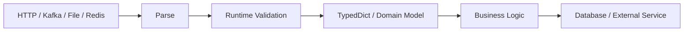

# 07- TypedDict

## Overview

`TypedDict` provides static typing for dictionaries whose keys have a known structure.

A normal dictionary describes only the key and value types:

```python
dict[str, object]
```

A `TypedDict` describes the expected fields individually:

```python
from typing import TypedDict


class UserPayload(TypedDict):
    id: int
    email: str
    active: bool
```

This allows static type checkers to understand dictionary-shaped data without replacing the runtime representation.

At runtime, a `TypedDict` value is still an ordinary `dict`. `TypedDict` does not perform validation, enforce required fields, or create a specialized dictionary class.

The core model is:

```text
TypedDict
    │
    ├── static structure
    ├── key-level type information
    ├── required / optional fields
    └── static-analysis support
          │
          ▼
      ordinary dict
          │
          └── runtime representation
```

This makes `TypedDict` particularly useful for lightweight internal data structures, JSON-like payloads, configuration fragments, and dictionary-shaped interfaces where a full class or validation model would be unnecessary.

---

## Why TypedDict Exists

Backend applications frequently manipulate structured dictionaries:

```python
payload = {
    "user_id": 1001,
    "email": "user@example.com",
    "active": True,
}
```

A broad annotation provides little information:

```python
payload: dict[str, object]
```

A `TypedDict` provides a precise contract:

```python
class UserPayload(TypedDict):
    user_id: int
    email: str
    active: bool
```

Now static tooling can detect mistakes such as:

```python
payload["email"] = 123
```

or:

```python
payload["unknown_field"]
```

depending on the type checker's configuration.

The runtime object remains a dictionary, but the development-time contract becomes substantially stronger.

---

## Basic Syntax

The class-based syntax is the standard form:

```python
from typing import TypedDict


class UserPayload(TypedDict):
    user_id: int
    email: str
    active: bool
```

Usage:

```python
def activate_user(payload: UserPayload) -> UserPayload:
    payload["active"] = True
    return payload
```

The dictionary still behaves like a normal dictionary:

```python
payload = UserPayload(
    user_id=1001,
    email="user@example.com",
    active=False,
)
```

At runtime, this is fundamentally dictionary data rather than an instance of a custom runtime model.

---

## Runtime Behavior

`TypedDict` is primarily a static typing construct.

For example:

```python
class UserPayload(TypedDict):
    user_id: int
    email: str
```

does not mean that Python will automatically reject:

```python
payload = {
    "user_id": "invalid",
    "email": 123,
}
```

Python itself does not enforce the declared field types.

This distinction is critical:

| Concern | `TypedDict` |
|---|---:|
| Static key checking | Yes |
| Static value-type checking | Yes |
| Runtime validation | No |
| Runtime conversion | No |
| Runtime custom behavior | No |
| Dictionary representation | Yes |
| Serialization-friendly | Yes |

If runtime validation is required, use explicit validation or a runtime model such as Pydantic.

---

## Required Fields

By default, fields in a `TypedDict` are required.

```python
class UserPayload(TypedDict):
    id: int
    email: str
```

The intended structure is:

```python
{
    "id": 1001,
    "email": "user@example.com",
}
```

A static type checker can report missing required keys.

---

## Optional Fields Are Not the Same as Nullable Fields

This distinction is one of the most important `TypedDict` concepts.

Consider:

```python
class UserPayload(TypedDict):
    nickname: str | None
```

The key is still required.

Valid:

```python
{"nickname": None}
```

Invalid according to the static contract:

```python
{}
```

If the key itself may be absent, use `NotRequired`:

```python
from typing import NotRequired, TypedDict


class UserPayload(TypedDict):
    nickname: NotRequired[str]
```

Now the key may be omitted.

These represent different states:

```text
Required[str | None]
    ├── key exists with str
    └── key exists with None

NotRequired[str]
    ├── key exists with str
    └── key does not exist
```

---

## `Required` and `NotRequired`

Python provides explicit field-level control:

```python
from typing import NotRequired, Required, TypedDict


class UpdateUserRequest(TypedDict):
    email: NotRequired[str]
    display_name: NotRequired[str]
    active: NotRequired[bool]
    request_id: Required[str]
```

This is useful for PATCH-style APIs where fields may be omitted.

It is also useful when migrating from legacy payload structures where some fields are optional.

---

## `total=False`

A `TypedDict` can make all fields optional:

```python
class UserPatch(TypedDict, total=False):
    email: str
    display_name: str
    active: bool
```

Now every field may be omitted.

Individual fields can then be made required:

```python
class UserPatch(TypedDict, total=False):
    email: str
    display_name: str
    active: bool
    request_id: Required[str]
```

`total=False` is useful when the default behavior is optional fields.

For mixed contracts, explicit `Required` and `NotRequired` often make the intent clearer.

---

## `TypedDict` vs `Optional`

Do not confuse:

```python
email: str | None
```

with:

```python
email: NotRequired[str]
```

The first describes the **value**.

The second describes the **presence of the key**.

For API contracts, this distinction is especially important:

```text
missing
    ≠
present with null
```

This matters for PATCH semantics, configuration merging, partial updates, and event evolution.

---

## Nested TypedDicts

Typed dictionaries can be nested:

```python
class Address(TypedDict):
    city: str
    country: str


class UserPayload(TypedDict):
    id: int
    email: str
    address: Address
```

Then:

```python
payload: UserPayload = {
    "id": 1001,
    "email": "user@example.com",
    "address": {
        "city": "Kolkata",
        "country": "IN",
    },
}
```

Nested `TypedDict` definitions are useful when the nested structure is stable and dictionary semantics are appropriate.

---

## Lists of TypedDicts

A common backend response is a list of structured records:

```python
class UserSummary(TypedDict):
    id: int
    email: str
    active: bool


def list_users() -> list[UserSummary]:
    ...
```

This gives static tooling field-level knowledge while preserving ordinary JSON-compatible dictionaries.

---

## TypedDict with Generic Collections

`TypedDict` fields can contain normal generic types:

```python
class OrderPayload(TypedDict):
    order_id: int
    item_ids: list[int]
    tags: set[str]
    metadata: dict[str, str]
```

Use precise nested types where they provide useful guarantees.

Avoid defaulting to:

```python
metadata: dict[str, object]
```

if the metadata structure is actually known.

---

## TypedDict and Type Aliases

`TypedDict` and type aliases solve different problems.

A type alias:

```python
type UserIds = list[int]
```

names an existing type expression.

A `TypedDict`:

```python
class UserPayload(TypedDict):
    id: int
    email: str
```

defines a dictionary-shaped static contract.

A useful distinction is:

```text
Type alias
    → name a type expression

TypedDict
    → describe a structured dictionary

NewType
    → distinguish a value statically

Dataclass
    → model a runtime object

Pydantic model
    → validate and model runtime data
```

---

## TypedDict vs Dataclass

Both can represent structured application data, but they serve different purposes.

| Feature | `TypedDict` | `dataclass` |
|---|---:|---:|
| Runtime object | `dict` | Class instance |
| Static typing | Yes | Yes |
| Runtime validation | No | Only custom logic |
| Attribute access | No | Yes |
| Key-based access | Yes | No |
| Methods | No | Yes |
| JSON-like representation | Natural | Requires serialization |
| Memory behavior | Dict-based | Object-based |
| Good for external JSON shape | Often | Sometimes |
| Domain behavior | Poor fit | Strong fit |

Use `TypedDict` when dictionary semantics are part of the contract.

Use a dataclass when the object itself has domain meaning, invariants, behavior, or lifecycle.

---

## TypedDict vs Pydantic

`TypedDict` is not a replacement for Pydantic validation.

Consider a FastAPI request:

```python
class CreateUserRequest(TypedDict):
    email: str
    age: int
```

This communicates a static shape but does not validate an incoming HTTP request at runtime.

A Pydantic model can:

```python
from pydantic import BaseModel, EmailStr


class CreateUserRequest(BaseModel):
    email: EmailStr
    age: int
```

The distinction is:

```text
TypedDict
    → static dictionary contract

Pydantic
    → runtime parsing + validation + model behavior
```

For untrusted external input, runtime validation is usually required.

---

## TypedDict and REST APIs

`TypedDict` works well for internal representations of JSON-shaped API data.

For example:

```python
class UserResponse(TypedDict):
    id: int
    email: str
    active: bool
```

An internal service might return:

```python
def build_user_response(user: User) -> UserResponse:
    return {
        "id": user.id,
        "email": user.email,
        "active": user.active,
    }
```

This provides static confidence without introducing a runtime object solely for serialization.

For public APIs with complex validation, OpenAPI generation, aliases, coercion, or constraints, a dedicated API model is usually better.

---

## TypedDict and Django

Django code frequently manipulates dictionaries from:

- serializers
- query transformations
- service-layer results
- configuration
- template contexts
- internal adapters

For example:

```python
class UserSummary(TypedDict):
    id: int
    username: str
    is_active: bool
```

A service function can expose this contract:

```python
def get_user_summary(user_id: int) -> UserSummary:
    ...
```

This is useful when the structure is intentionally dictionary-shaped.

Do not convert Django models into `TypedDict` simply to duplicate the model schema. Use `TypedDict` when the dictionary itself is the intended interface.

---

## TypedDict and PostgreSQL

Database query results are sometimes naturally represented as dictionaries:

```python
class UserRow(TypedDict):
    id: int
    email: str
    created_at: datetime
```

A repository can expose:

```python
def fetch_user(user_id: int) -> UserRow | None:
    ...
```

This is useful for read-oriented projections.

However, do not treat `TypedDict` as a replacement for database constraints.

The database should still enforce:

- `NOT NULL`
- foreign keys
- unique constraints
- check constraints
- data types

`TypedDict` improves application-level static correctness; PostgreSQL remains responsible for database integrity.

---

## TypedDict and Redis

Cached JSON-like structures can be represented using `TypedDict`:

```python
class CachedUser(TypedDict):
    id: int
    email: str
    version: int
```

The Redis adapter should still deserialize and validate data before returning it.

A cache may contain:

```text
old schema
corrupted data
manually modified data
data from an older deployment
```

Static typing cannot detect these runtime conditions.

---

## TypedDict and Kafka

`TypedDict` is useful for representing decoded event payloads:

```python
class UserCreatedPayload(TypedDict):
    user_id: int
    email: str
    occurred_at: str
```

A consumer might expose:

```python
def handle_user_created(
    payload: UserCreatedPayload,
) -> None:
    ...
```

However, Kafka messages are external runtime data.

The actual pipeline should be:

```text
Kafka bytes
    │
    ▼
Deserializer
    │
    ▼
Schema / validation
    │
    ▼
Typed representation
    │
    ▼
Business logic
```

Do not assume a type annotation makes an untrusted Kafka payload safe.

---

## TypedDict and Configuration

`TypedDict` can describe structured configuration:

```python
class DatabaseConfig(TypedDict):
    host: str
    port: int
    database: str
    pool_size: int
```

This is useful for internal configuration structures.

However, environment variables are strings at runtime:

```text
DATABASE_PORT="5432"
```

A configuration loader must parse and validate them before constructing the typed dictionary.

---

## TypedDict and `**kwargs`

A `TypedDict` can describe keyword arguments passed using `**`.

For example:

```python
class ConnectionOptions(TypedDict):
    host: str
    port: int
    timeout: float


def connect(**options: Unpack[ConnectionOptions]) -> None:
    ...
```

This provides static checking for keyword argument names and types.

`Unpack` is particularly useful for typed configuration-style keyword interfaces.

---

## TypedDict and `Unpack`

Consider:

```python
from typing import TypedDict, Unpack


class RetryOptions(TypedDict):
    max_attempts: int
    backoff_seconds: float


def retry(**options: Unpack[RetryOptions]) -> None:
    ...
```

A type checker can understand:

```python
retry(
    max_attempts=5,
    backoff_seconds=1.0,
)
```

This is useful for APIs where keyword arguments represent a structured configuration contract.

Avoid using it merely to create unnecessarily complicated function signatures.

---

## Inheritance

`TypedDict` supports inheritance:

```python
class BaseUser(TypedDict):
    id: int
    email: str


class AdminUser(BaseUser):
    permissions: list[str]
```

This can reduce duplication when structures have a genuine hierarchical relationship.

However, dictionary schemas can become difficult to reason about when inheritance becomes deep.

Prefer shallow composition and explicit structures when possible.

---

## Multiple Inheritance

A `TypedDict` can combine multiple `TypedDict` bases when their fields are compatible:

```python
class AuditFields(TypedDict):
    created_at: str
    updated_at: str


class IdentityFields(TypedDict):
    id: int


class UserRecord(AuditFields, IdentityFields):
    email: str
```

This can be useful for reusable schema fragments.

Avoid excessive inheritance because it can make the final dictionary contract difficult to discover.

---

## Read-Only Fields

Modern Python typing supports `ReadOnly` for typed dictionary items in type-checking contexts.

Conceptually:

```python
from typing import ReadOnly, TypedDict


class UserRecord(TypedDict):
    id: ReadOnly[int]
    email: str
```

This communicates that code should not mutate the field through the typed dictionary interface.

Important: this is a **static restriction**, not a runtime immutable dictionary.

If runtime immutability is required, use an immutable representation such as a frozen dataclass, `Mapping`, or another appropriate value object.

---

## TypedDict and Mapping

If a function only needs to read dictionary-like data, prefer an interface such as:

```python
from collections.abc import Mapping


def get_email(payload: Mapping[str, object]) -> str:
    ...
```

If the exact keys and types matter, use `TypedDict`:

```python
class UserPayload(TypedDict):
    email: str
    active: bool
```

The choice depends on whether the function needs:

```text
generic mapping behavior
        vs
specific dictionary schema
```

---

## Structural Nature of TypedDict

`TypedDict` is structurally typed.

A dictionary with compatible fields can generally satisfy a `TypedDict` contract without explicitly inheriting from it.

For example:

```python
class UserPayload(TypedDict):
    id: int
    email: str
```

A compatible dictionary-shaped object can be passed where `UserPayload` is expected.

This differs from nominal class inheritance and is one reason `TypedDict` works naturally with JSON-like data.

---

## Extra Keys

A common misconception is that:

```python
class UserPayload(TypedDict):
    id: int
    email: str
```

means Python will reject:

```python
{
    "id": 1001,
    "email": "user@example.com",
    "debug": True,
}
```

At runtime, nothing prevents the extra key.

Static type checkers may report extra keys in certain contexts, but this is not runtime schema enforcement.

If an API must reject unknown fields, use a runtime validation layer and configure its behavior explicitly.

---

## TypedDict and Schema Evolution

Distributed systems frequently evolve payloads.

Suppose version one contains:

```python
class UserCreatedV1(TypedDict):
    user_id: int
    email: str
```

Version two adds:

```python
class UserCreatedV2(TypedDict):
    user_id: int
    email: str
    display_name: NotRequired[str]
```

Making newly introduced fields optional can improve compatibility for consumers that still process older messages.

However, `TypedDict` itself does not provide schema negotiation or backward compatibility.

For Kafka or service-to-service contracts, use explicit schema evolution strategies.

---

## PATCH Semantics

`TypedDict` is particularly useful for partial updates:

```python
class UserPatch(TypedDict, total=False):
    email: str
    display_name: str
    active: bool
```

This distinguishes:

```text
field omitted
    → leave unchanged

field present
    → update value
```

If `None` has meaning, combine it with `NotRequired`:

```python
class UserPatch(TypedDict):
    display_name: NotRequired[str | None]
```

Now:

```text
missing
    → do not update

"display_name": "Aranya"
    → set value

"display_name": null
    → explicitly clear value
```

This distinction is important in REST PATCH implementations.

---

## TypedDict and Validation Boundaries

A strong backend architecture separates static typing from runtime validation.



The important principle is:

> Static types describe what the application expects; runtime validation establishes what the application actually received.

Both are useful, but they solve different problems.

---

## TypedDict and Serialization

Because a `TypedDict` is represented as a dictionary, it is naturally compatible with JSON-style serialization:

```python
import json


class UserPayload(TypedDict):
    id: int
    email: str


payload: UserPayload = {
    "id": 1001,
    "email": "user@example.com",
}

encoded = json.dumps(payload)
```

Serialization works because the runtime object is a normal dictionary.

However, JSON serialization does not validate that the dictionary conforms to its `TypedDict` annotation.

---

## TypedDict and Security

Do not treat `TypedDict` as input sanitization.

For example:

```python
class PaymentRequest(TypedDict):
    amount: Decimal
    currency: str
```

The annotation does not guarantee:

- positive amounts
- supported currencies
- authorized users
- valid account ownership
- maximum transaction limits

A secure request pipeline must still perform:

```text
Authentication
    ↓
Authorization
    ↓
Parsing
    ↓
Schema validation
    ↓
Business validation
    ↓
Database transaction
```

Static typing complements these controls but does not replace them.

---

## Performance Considerations

`TypedDict` has almost no additional runtime overhead compared with an ordinary dictionary because the runtime representation is dictionary data.

The main costs come from the dictionary itself:

- key storage
- hash tables
- object references
- allocation
- copying

Type checking occurs outside normal request execution.

This makes `TypedDict` attractive for lightweight internal data transfer where introducing runtime model objects would not provide enough additional value.

---

## Memory Considerations

A `TypedDict` uses dictionary storage.

For high-volume data processing, this can be substantially more expensive than compact structures such as:

- tuples
- arrays
- specialized database rows
- columnar formats

For example, processing millions of dictionary-shaped records in memory can create significant overhead.

If the workload is data-intensive, consider:

- streaming
- generators
- database-side projection
- NumPy/Pandas structures
- Parquet
- bounded batches

`TypedDict` improves type clarity but does not optimize memory layout.

---

## Concurrency Considerations

`TypedDict` does not make dictionaries thread-safe.

This:

```python
class UserState(TypedDict):
    active: bool
```

does not provide synchronization.

If multiple threads can mutate the same dictionary, use appropriate synchronization or redesign ownership.

For async applications, remember that `asyncio` avoids many traditional thread races but does not eliminate logical race conditions around shared mutable state.

---

## Testing TypedDict Code

Because `TypedDict` is primarily static, testing should cover both:

### Static correctness

Run a type checker:

```bash
mypy app/
```

or:

```bash
pyright
```

### Runtime correctness

Test parsing and validation:

```python
def test_user_payload_validation() -> None:
    payload = parse_user_payload(raw_data)

    assert payload["id"] > 0
```

Do not rely on static type checking to test malformed runtime input.

---

## Type Checker Configuration

A typed dictionary becomes significantly more valuable under strict static analysis.

Typical configuration goals include:

- disallowing untyped definitions
- detecting incompatible assignments
- detecting missing keys
- detecting unknown keys
- narrowing optional fields
- checking function boundaries

For a mature backend:

```text
Developer
   │
   ▼
Type annotations
   │
   ▼
mypy / Pyright
   │
   ▼
CI
   │
   ▼
Merge
```

The exact strictness should be introduced progressively in legacy systems rather than creating an unmanageable migration.

---

## Production Architecture Example

Consider an order service:

```python
from typing import NotRequired, TypedDict


class OrderItem(TypedDict):
    product_id: int
    quantity: int


class CreateOrderRequest(TypedDict):
    customer_id: int
    items: list[OrderItem]
    coupon_code: NotRequired[str]
```

An internal service may operate on this structure:

```python
def calculate_order(
    request: CreateOrderRequest,
) -> int:
    total_items = sum(
        item["quantity"]
        for item in request["items"]
    )

    return total_items
```

The type contract makes the expected dictionary shape explicit.

At an HTTP boundary, however, raw JSON should still be parsed and validated before it reaches this function.

---

## TypedDict in a Layered Backend

A practical architecture might look like:

```text
                 External World
                       │
              ┌────────┴────────┐
              │                 │
           REST API          Kafka
              │                 │
              ▼                 ▼
       Runtime validation   Schema validation
              │                 │
              └────────┬────────┘
                       ▼
                 TypedDict / DTO
                       │
                       ▼
                Service Layer
                       │
              ┌────────┼────────┐
              ▼        ▼        ▼
         PostgreSQL  Redis   Celery
```

The `TypedDict` is most valuable between components that intentionally exchange dictionary-shaped data.

It should not become a substitute for every domain model.

---

## Common Mistakes

### Treating TypedDict as Runtime Validation

This is the most important mistake.

```python
class UserPayload(TypedDict):
    id: int
```

does not validate incoming data.

Use runtime validation at trust boundaries.

### Confusing Missing With `None`

These are different:

```python
field: str | None
```

and:

```python
field: NotRequired[str]
```

One allows a null value; the other allows the key to be absent.

### Using TypedDict for Rich Domain Objects

If the object needs behavior, invariants, or methods, a dataclass or domain class is usually better.

### Using `dict[str, Any]` Everywhere

This throws away much of the benefit of static typing.

Prefer a precise `TypedDict` when the structure is known.

### Overusing TypedDict

Not every dictionary requires a schema.

A simple:

```python
dict[str, int]
```

may be clearer than a named `TypedDict`.

### Assuming Extra Keys Are Rejected

Runtime dictionaries can contain arbitrary additional keys.

### Mutating Shared TypedDicts

Typing does not protect against concurrency-related mutation.

### Using TypedDict for Public Validation

For external HTTP or event input, static typing should complement runtime validation rather than replace it.

### Creating Deep TypedDict Inheritance Trees

Complex inheritance hierarchies can make contracts difficult to understand.

Prefer shallow structures and composition.

### Hiding Semantic Differences

Two dictionaries can have identical fields but very different business meanings.

If those concepts need stronger distinction, consider dedicated models or `NewType` for their identifiers.

---

## TypedDict vs Common Alternatives

| Requirement | Recommended choice |
|---|---|
| Known dictionary shape | `TypedDict` |
| Generic mapping | `Mapping[K, V]` |
| Reusable complex type expression | Type alias |
| Static distinction between primitives | `NewType` |
| Runtime domain object | Dataclass / class |
| Runtime input validation | Pydantic / validation layer |
| Fixed JSON/API schema with validation | Pydantic or equivalent |
| Behavioral interface | `Protocol` |
| Simple homogeneous dictionary | `dict[K, V]` |
| Immutable domain value | Frozen dataclass / value object |
| Partial dictionary update | `TypedDict(total=False)` / `NotRequired` |

---

## Production Best Practices

Use `TypedDict` when:

- dictionary semantics are intentional
- keys are known
- field types are stable enough to document
- static analysis provides value
- runtime model behavior is unnecessary
- JSON-like data is passed between internal layers

Prefer a runtime model when:

- input is untrusted
- validation is required
- coercion is required
- serialization rules are complex
- business invariants matter
- the object has behavior
- API documentation generation depends on the model

Keep external and internal contracts conceptually separate:

```text
External JSON
    │
    ▼
Validated API model
    │
    ▼
Internal TypedDict / DTO / domain model
```

Do not allow the convenience of `TypedDict` to bypass boundary validation.

---

## Interview Traps

### Is `TypedDict` a subclass of `dict` at runtime?

It is a static typing construct for dictionary-shaped data. The actual values are ordinary dictionaries.

### Does `TypedDict` validate values?

No.

### What is the difference between `TypedDict` and `dict[str, object]`?

`dict[str, object]` describes arbitrary keys with a common value type. `TypedDict` describes specific keys and their individual value types.

### What is the difference between `NotRequired[str]` and `str | None`?

`NotRequired[str]` allows the key to be absent. `str | None` allows the key to exist with `None`.

### Can a TypedDict contain extra keys?

Runtime dictionaries can. Static type checkers may report unexpected keys in contexts where the dictionary is checked against a `TypedDict`.

### Should FastAPI request bodies always use TypedDict?

No. FastAPI applications commonly benefit from runtime validation models such as Pydantic models at HTTP boundaries.

### Can TypedDict contain nested TypedDicts?

Yes.

### Can TypedDict inherit from another TypedDict?

Yes, and multiple inheritance is also supported when the definitions are compatible.

### Does TypedDict improve runtime performance?

It generally adds no meaningful runtime abstraction over a normal dictionary. Its primary benefit is static analysis and readability.

### When should you use a dataclass instead?

When runtime identity, behavior, invariants, methods, or object-oriented domain modeling matter.

---

## Production Checklist

Before using `TypedDict`, verify:

- The data is intentionally dictionary-shaped.
- The keys have stable, meaningful semantics.
- Field-level type information provides real value.
- Required and optional keys are modeled correctly.
- `NotRequired` is used when absence differs from `None`.
- `Required` is used where mixed optional/required structures need explicitness.
- `total=False` is used intentionally for partial structures.
- Nested structures have appropriate `TypedDict` definitions where useful.
- A generic `dict[K, V]` is not sufficient.
- A type alias is not a better fit.
- A dataclass or domain model is not required.
- Runtime validation exists at untrusted boundaries.
- API input is not trusted merely because it has a `TypedDict` annotation.
- Kafka and Redis payloads are deserialized and validated.
- PostgreSQL remains responsible for database integrity constraints.
- Extra-key behavior is understood.
- Static analysis runs in CI/CD.
- Type checker strictness is appropriate for the codebase.
- Typed dictionaries are not used as a concurrency or security mechanism.
- Large data sets are not unnecessarily materialized as dictionaries.
- Domain semantics are not hidden behind generic dictionary structures.
- Schema evolution is handled explicitly for distributed systems.
- Public API contracts use dedicated validation/schema mechanisms when appropriate.

## Key Takeaways

- `TypedDict` describes the expected structure of dictionary-shaped data for static type checking while keeping the runtime representation as an ordinary `dict`.
- `NotRequired[T]` means a key may be absent, while `T | None` means the key exists but its value may be `None`; this distinction is critical for PATCH and evolving API contracts.
- `TypedDict` is not runtime validation, serialization enforcement, authorization, or concurrency protection; external data still requires explicit validation and security controls.
- Use `TypedDict` for stable dictionary-shaped interfaces, and prefer aliases, `NewType`, dataclasses, `Protocol`, or runtime validation models when those abstractions better match the problem.
- In production systems, combine `TypedDict` with strict static analysis and explicit boundary validation rather than treating type annotations as runtime guarantees.