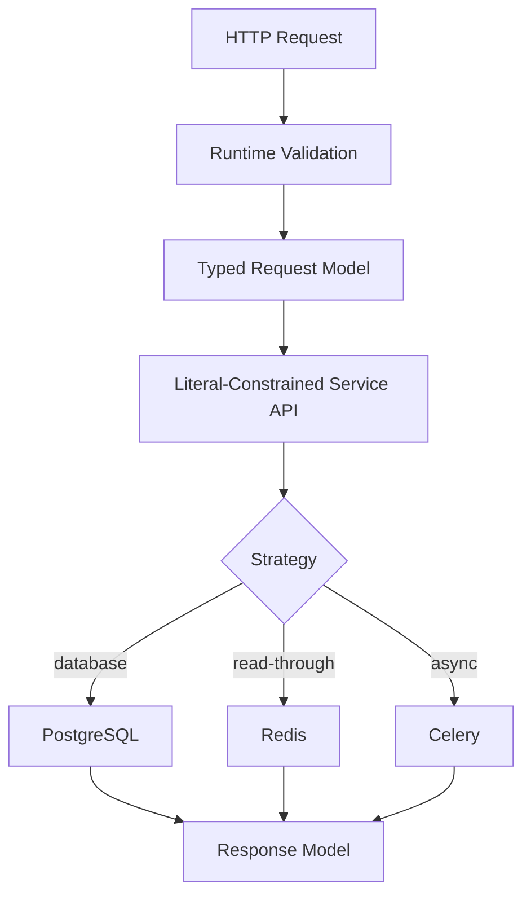

# 08- Literal

## Overview

`Literal` is a typing construct that restricts a value to a specific set of literal values.

Instead of saying:

```python
environment: str
```

you can express:

```python
from typing import Literal

environment: Literal["development", "staging", "production"]
```

This allows static type checkers to reason about **specific values**, not merely broad runtime types.

`Literal` is particularly useful when a backend API or internal function accepts a small, finite set of values:

```python
type Environment = Literal["development", "staging", "production"]
type HttpMethod = Literal["GET", "POST", "PUT", "PATCH", "DELETE"]
type SortOrder = Literal["asc", "desc"]
```

The runtime value remains an ordinary `str`, `int`, `bool`, or other supported literal value. `Literal` does not create a new runtime type and does not perform runtime validation.

The core model is:

```text
Literal
   │
   ├── narrows a broad type
   ├── documents allowed values
   ├── enables static exhaustiveness checks
   └── improves API contracts
          │
          ▼
      ordinary runtime value
```

---

## Why Literal Exists

A broad type often allows more values than an API actually supports.

For example:

```python
def deploy(environment: str) -> None:
    ...
```

The annotation permits any string:

```python
deploy("production")
deploy("staging")
deploy("banana")
```

If only three environments are valid, the type contract should express that:

```python
from typing import Literal


def deploy(
    environment: Literal[
        "development",
        "staging",
        "production",
    ],
) -> None:
    ...
```

Static analysis can now reject invalid values before they reach runtime.

This is useful for:

- API parameters
- configuration modes
- feature flags
- sort directions
- command names
- pagination modes
- event types
- protocol versions
- strategy selectors
- finite state values

---

## Basic Syntax

Import `Literal` from `typing`:

```python
from typing import Literal
```

Then specify allowed values:

```python
def set_environment(
    environment: Literal["development", "staging", "production"],
) -> None:
    ...
```

Valid:

```python
set_environment("development")
set_environment("staging")
set_environment("production")
```

Invalid according to static analysis:

```python
set_environment("testing")
```

The type checker understands the exact allowed values.

---

## Literal Values

`Literal` is designed around literal values rather than arbitrary runtime expressions.

Common examples include:

```python
Literal["GET", "POST"]
Literal[200, 201, 204]
Literal[True]
Literal[False]
```

String literals are especially common in backend applications.

For example:

```python
type SortOrder = Literal["asc", "desc"]
type StatusCode = Literal[200, 201, 202, 204]
```

The underlying runtime values remain ordinary Python values.

---

## Literal vs `str`

Compare:

```python
def sort(order: str) -> None:
    ...
```

with:

```python
def sort(order: Literal["asc", "desc"]) -> None:
    ...
```

The first accepts any string.

The second communicates the actual contract.

| Annotation | Accepted concept |
|---|---|
| `str` | Any string |
| `Literal["asc", "desc"]` | Exactly `"asc"` or `"desc"` |
| `Enum` | Specific enum members |
| `NewType` | Distinct static type based on another type |

Use `Literal` when the allowed values themselves are the important part of the contract.

---

## Literal vs Enum

`Literal` and `Enum` are often alternatives.

```python
from typing import Literal


type Environment = Literal[
    "development",
    "staging",
    "production",
]
```

versus:

```python
from enum import StrEnum


class Environment(StrEnum):
    DEVELOPMENT = "development"
    STAGING = "staging"
    PRODUCTION = "production"
```

The difference is significant.

| Requirement | `Literal` | `Enum` |
|---|---:|---:|
| Static value restriction | Yes | Yes |
| Runtime type | Underlying value | Enum instance |
| Runtime methods | No | Yes |
| Namespace for constants | No | Yes |
| Easy JSON/string representation | Yes | Requires serialization semantics |
| Runtime identity | No | Yes |
| Lightweight API parameter contract | Excellent | Good |
| Rich domain behavior | Poor | Better |

A useful rule:

```text
Small finite set of values
    → Literal

Domain concept with runtime identity/behavior
    → Enum
```

---

## Literal Does Not Validate Runtime Input

This is critical for backend systems.

Consider:

```python
type SortOrder = Literal["asc", "desc"]
```

This does not validate HTTP input.

A client can still send:

```json
{
  "sort": "invalid"
}
```

The request handler needs runtime validation.

The correct architecture is:

```text
HTTP request
    │
    ▼
JSON parsing
    │
    ▼
Runtime validation
    │
    ▼
Literal-constrained application code
    │
    ▼
Business logic
```

Static typing and runtime validation solve different problems.

---

## Literal and FastAPI

FastAPI can use `Literal` for constrained values.

For example:

```python
from typing import Literal

from fastapi import FastAPI, Query


app = FastAPI()

SortOrder = Literal["asc", "desc"]


@app.get("/users")
def list_users(
    order: SortOrder = Query("asc"),
) -> dict[str, str]:
    return {"order": order}
```

The annotation communicates the finite set of supported values.

FastAPI's request validation layer can reject invalid query parameters at runtime, while static analysis checks application code.

This creates two complementary contracts:

```text
Static type contract
        +
Runtime request contract
        =
stronger API boundary
```

---

## Literal and REST APIs

Suppose an endpoint supports:

```text
GET /users?order=asc
GET /users?order=desc
```

Modeling the parameter as:

```python
type SortOrder = Literal["asc", "desc"]
```

is more precise than:

```python
order: str
```

For larger APIs, however, the API schema remains the authoritative external contract.

`Literal` should reinforce that contract inside Python rather than become the only source of validation.

---

## Literal and PATCH APIs

`Literal` is useful when an API accepts a finite set of operations.

For example:

```python
type UserAction = Literal[
    "activate",
    "deactivate",
    "suspend",
]
```

Then:

```python
def apply_user_action(
    action: UserAction,
) -> None:
    ...
```

This makes supported actions explicit.

If each action has substantially different fields or behavior, a discriminated union or dedicated request model may be more appropriate.

---

## Literal and Discriminated Unions

`Literal` becomes especially powerful when used as a discriminator.

Consider:

```python
from typing import Literal

from pydantic import BaseModel


class EmailNotification(BaseModel):
    type: Literal["email"]
    address: str


class SmsNotification(BaseModel):
    type: Literal["sms"]
    phone_number: str
```

These models can form a discriminated union:

```python
Notification = EmailNotification | SmsNotification
```

The `type` field tells the system which structure applies.

Conceptually:

```text
Notification
     │
     ├── type = "email"
     │      └── address
     │
     └── type = "sms"
            └── phone_number
```

This pattern is valuable for versioned APIs, event payloads, commands, and heterogeneous request types.

---

## Literal for State Machines

Finite state machines are another strong use case.

For example:

```python
type OrderStatus = Literal[
    "pending",
    "confirmed",
    "shipped",
    "delivered",
    "cancelled",
]
```

A service can define:

```python
def transition(
    current: OrderStatus,
    target: OrderStatus,
) -> OrderStatus:
    ...
```

The type communicates the valid state vocabulary.

However, `Literal` does not enforce valid **transitions**.

For example:

```text
pending → confirmed
confirmed → shipped
shipped → delivered
```

is a business rule.

That rule must be implemented separately.

---

## Literal and Pattern Matching

`Literal` works well with Python's structural pattern matching.

```python
from typing import Literal


type Command = Literal["start", "stop", "restart"]


def execute(command: Command) -> None:
    match command:
        case "start":
            start_service()
        case "stop":
            stop_service()
        case "restart":
            restart_service()
```

Static type checkers can use the narrowed values when analyzing branches.

For finite domains, this can make unsupported cases easier to detect during development.

---

## Exhaustiveness Checking

Suppose:

```python
type Command = Literal["start", "stop"]
```

and:

```python
def execute(command: Command) -> None:
    match command:
        case "start":
            start_service()
        case "stop":
            stop_service()
```

The type checker can understand that all declared literal values are covered.

This becomes more powerful when combined with `Never` for explicit exhaustiveness checks:

```python
from typing import Never


def assert_never(value: Never) -> Never:
    raise AssertionError(f"Unhandled value: {value}")
```

Then:

```python
def execute(command: Command) -> None:
    match command:
        case "start":
            start_service()
        case "stop":
            stop_service()
        case _:
            assert_never(command)
```

If `Command` later gains another literal:

```python
type Command = Literal["start", "stop", "restart"]
```

a strict type checker can identify the unhandled case.

This is useful for safety-critical business branching.

---

## Literal and Function Overloads

`Literal` can make overloads precise.

For example:

```python
from typing import Literal, overload


@overload
def get_setting(
    name: Literal["timeout"],
) -> int:
    ...


@overload
def get_setting(
    name: Literal["region"],
) -> str:
    ...


def get_setting(name: str) -> int | str:
    if name == "timeout":
        return 30

    if name == "region":
        return "ap-south-1"

    raise KeyError(name)
```

Static analysis can infer the return type from the literal argument.

```python
timeout = get_setting("timeout")
```

is understood as `int`.

```python
region = get_setting("region")
```

is understood as `str`.

This is useful for APIs whose return type depends on a finite selector.

---

## Literal and Configuration

Configuration often contains finite choices:

```python
type LogLevel = Literal[
    "DEBUG",
    "INFO",
    "WARNING",
    "ERROR",
    "CRITICAL",
]
```

An internal configuration API can then expose:

```python
def configure_logging(
    level: LogLevel,
) -> None:
    ...
```

However, environment variables are runtime strings.

Therefore:

```text
Environment variable
        │
        ▼
string value
        │
        ▼
runtime validation
        │
        ▼
LogLevel
```

The annotation alone does not make environment configuration safe.

---

## Literal and Feature Flags

Finite feature states can use `Literal`:

```python
type RolloutMode = Literal[
    "disabled",
    "internal",
    "percentage",
    "enabled",
]
```

This makes strategy code more explicit:

```python
def rollout_mode(
    mode: RolloutMode,
) -> None:
    ...
```

For complex feature-flag systems with metadata, targeting rules, percentage rollouts, and evaluation state, a domain model is more appropriate.

---

## Literal and HTTP Methods

HTTP method values can be represented as:

```python
type HttpMethod = Literal[
    "GET",
    "POST",
    "PUT",
    "PATCH",
    "DELETE",
]
```

This can be useful for internal routing abstractions:

```python
def register_route(
    method: HttpMethod,
    path: str,
) -> None:
    ...
```

Do not create a custom alias if the framework already provides a strong method abstraction that fits the application.

---

## Literal and Status Codes

Specific status codes can be modeled:

```python
type SuccessStatus = Literal[
    200,
    201,
    202,
    204,
]
```

This can be useful for strongly typed internal APIs.

However, status codes are often better represented using framework constants or HTTP-specific abstractions when those already exist.

Do not introduce aliases simply because a finite set exists.

---

## Literal and Kafka Events

Kafka event types often form a finite vocabulary:

```python
type EventType = Literal[
    "user.created",
    "user.deleted",
    "order.created",
    "order.cancelled",
]
```

An event envelope can then use:

```python
class EventEnvelope(TypedDict):
    type: EventType
    version: int
    payload: dict[str, object]
```

This makes event dispatch more explicit.

For a large distributed system, use schema management and compatibility policies in addition to Python typing.

`Literal` is an application-level contract, not a distributed schema registry.

---

## Literal and Redis

Redis keys or command modes may have finite application-level values:

```python
type CachePolicy = Literal[
    "read-through",
    "write-through",
    "write-around",
]
```

The alias can make cache abstractions easier to reason about.

It does not enforce Redis configuration or runtime behavior.

---

## Literal and Celery

Background task strategies can use finite values:

```python
type Priority = Literal[
    "low",
    "normal",
    "high",
]
```

Then:

```python
def enqueue_report(
    report_id: int,
    priority: Priority,
) -> None:
    ...
```

The task infrastructure still receives ordinary serialized values.

If tasks cross service boundaries, validate the task payload rather than relying solely on Python annotations.

---

## Literal and PostgreSQL

A finite application state can sometimes correspond to a PostgreSQL enum or constrained value.

For example:

```python
type PaymentStatus = Literal[
    "pending",
    "authorized",
    "captured",
    "failed",
]
```

PostgreSQL should independently enforce the database invariant using an appropriate schema constraint.

The architecture should therefore maintain two layers:

```text
Python Literal
    → application static contract

PostgreSQL constraint
    → persistent data integrity
```

Neither should be assumed to replace the other.

---

## Literal and Type Aliases

For repeated finite value sets, define an alias:

```python
type Environment = Literal[
    "development",
    "staging",
    "production",
]
```

Then reuse:

```python
def deploy(environment: Environment) -> None:
    ...


def load_config(environment: Environment) -> dict[str, str]:
    ...
```

This is preferable to repeating the same `Literal[...]` expression across many functions.

---

## Literal and `NewType`

`Literal` and `NewType` address different problems.

```python
type Environment = Literal[
    "development",
    "staging",
    "production",
]
```

means:

> The value must be one of these specific values.

By contrast:

```python
from typing import NewType

UserId = NewType("UserId", int)
```

means:

> This integer has a distinct static semantic identity.

Use:

```text
Literal
→ finite allowed values

NewType
→ semantic distinction between values
```

---

## Literal and `Any`

Using `Any` defeats the purpose of a precise finite-value contract.

Avoid:

```python
def deploy(environment: Any) -> None:
    ...
```

Prefer:

```python
type Environment = Literal[
    "development",
    "staging",
    "production",
]
```

This lets static analysis detect invalid callers.

`Any` should be reserved for genuinely dynamic boundaries where precise typing is not currently practical.

---

## Literal and `str | None`

`Literal` can be combined with `None`:

```python
type SortOrder = Literal["asc", "desc"] | None
```

This means:

```text
"asc"
"desc"
None
```

are all valid.

It is different from:

```python
Literal["asc", "desc"]
```

where `None` is not valid.

This distinction is useful for optional configuration and query parameters.

---

## Literal Inside Generic Types

`Literal` can appear inside generic structures:

```python
from typing import Literal


type SupportedMethods = list[
    Literal["GET", "POST"]
]
```

This represents a list whose elements are restricted to those values.

The same concept can appear in mappings:

```python
type RouteConfig = dict[
    Literal["method", "path"],
    str,
]
```

However, if the dictionary has a fixed schema, `TypedDict` is usually clearer.

---

## Literal Unions

A `Literal` expression is often a union of exact values:

```python
Literal["asc", "desc"]
```

Conceptually:

```text
Literal["asc", "desc"]
       │
       ├── "asc"
       └── "desc"
```

This allows the type checker to narrow control flow based on comparisons.

---

## Literal Narrowing

Consider:

```python
type SortOrder = Literal["asc", "desc"]


def execute(order: SortOrder) -> None:
    if order == "asc":
        ...
    else:
        ...
```

Inside the `if` branch, the type checker can narrow `order` to:

```python
Literal["asc"]
```

and in the remaining branch:

```python
Literal["desc"]
```

This enables more precise static analysis.

---

## Literal and Variables

Static type checkers distinguish literal expressions from arbitrary variables.

For example:

```python
environment = "production"
```

may or may not be inferred as the exact literal `"production"` depending on context and type checker behavior.

Explicit annotation can make the contract clear:

```python
from typing import Literal


environment: Literal["production"] = "production"
```

For most application code, prefer typed function boundaries and let type inference do the work where it is reliable.

Avoid excessive explicit literal annotations that add noise.

---

## Literal and Constants

A common pattern is:

```python
PRODUCTION = "production"
```

followed by:

```python
def deploy(
    environment: Literal["production", "staging"],
) -> None:
    ...
```

Static type checkers may not always infer that an ordinary variable is a literal value.

If a constant needs to retain literal typing:

```python
from typing import Final, Literal


PRODUCTION: Final[Literal["production"]] = "production"
```

Use this only when it materially improves the contract.

Do not annotate every string constant with `Literal`.

---

## Literal and `Final`

`Final` and `Literal` have different purposes.

```python
REGION: Final = "ap-south-1"
```

means the variable should not be reassigned.

```python
type Region = Literal[
    "ap-south-1",
    "us-east-1",
]
```

means values of the type are restricted to those strings.

They can be combined when both properties matter:

```python
REGION: Final[Literal["ap-south-1"]] = "ap-south-1"
```

Think:

```text
Final
→ variable binding should not change

Literal
→ allowed value is specific
```

---

## Literal and Protocol Design

Protocols describe behavior:

```python
class Storage(Protocol):
    def save(self, data: bytes) -> None:
        ...
```

`Literal` describes finite values.

They can complement one another:

```python
type Consistency = Literal["strong", "eventual"]
```

A storage abstraction might then expose:

```python
class Storage(Protocol):
    def read(
        self,
        key: str,
        consistency: Consistency,
    ) -> bytes:
        ...
```

The protocol defines **what the object can do**.

The literal defines **which configuration values are accepted**.

---

## Literal and Generic APIs

Generic APIs sometimes use literal parameters to alter behavior.

For example:

```python
from typing import Literal, overload


@overload
def fetch(
    key: str,
    *,
    raw: Literal[True],
) -> bytes:
    ...


@overload
def fetch(
    key: str,
    *,
    raw: Literal[False],
) -> str:
    ...


def fetch(
    key: str,
    *,
    raw: bool,
) -> bytes | str:
    ...
```

Now static analysis can infer different return types based on the literal argument.

This pattern is powerful but should be used sparingly because excessive overloads can make APIs difficult to maintain.

---

## Literal and Backend Architecture

A typical request lifecycle might use `Literal` at several internal decision points:



`Literal` does not perform the runtime validation in this architecture.

It makes the service interfaces precise after validated data has entered the application.

---

## Production Considerations

### API Contracts

Use `Literal` for small finite sets where invalid values are programmer errors.

### Runtime Boundaries

Validate values received from:

- HTTP
- Kafka
- Redis
- environment variables
- files
- CLI arguments
- external services

### Schema Evolution

Adding a new literal can require updates throughout the codebase.

For example:

```python
type Environment = Literal[
    "development",
    "staging",
    "production",
    "preview",
]
```

Existing exhaustive matches may need new branches.

This is usually beneficial because the type checker exposes affected code during development.

### Distributed Systems

A Python literal does not automatically update:

- Kafka schemas
- OpenAPI schemas
- PostgreSQL constraints
- other services
- frontend contracts

Treat distributed contracts explicitly.

---

## Performance

`Literal` has negligible runtime overhead.

It does not create:

- wrapper objects
- runtime validators
- network calls
- additional database operations

Static type information is consumed primarily by development tooling.

The runtime performance of:

```python
environment == "production"
```

is effectively the normal Python string comparison.

The performance benefits are indirect: earlier defect detection can reduce operational failures and debugging cost.

---

## Memory

`Literal` does not introduce a new runtime representation.

A value such as:

```python
"production"
```

remains an ordinary Python string.

The annotation itself is metadata associated with the type system.

Therefore, choosing `Literal` over `str` should be based on correctness and maintainability rather than memory optimization.

---

## Concurrency

`Literal` does not provide synchronization or immutability.

This:

```python
type Mode = Literal["active", "inactive"]
```

does not make shared state thread-safe.

Concurrency correctness still depends on:

- ownership
- locks
- atomic operations
- transactional storage
- event ordering
- idempotency
- appropriate async design

Use `Literal` to describe allowed states, not to enforce state transitions.

---

## Security

Finite-value restrictions can reduce accidental acceptance of unsupported modes, but `Literal` is not a security mechanism.

For example:

```python
type AccessMode = Literal["read", "write"]
```

does not authorize a user to write data.

Authorization must still verify:

```text
Authenticated identity
        │
        ▼
Authorization policy
        │
        ▼
Requested operation
```

Likewise, never assume that a literal-typed path, environment, or resource identifier has been sanitized.

---

## Observability

Literal values can improve observability because finite domains produce standardized dimensions.

For example:

```python
type Operation = Literal[
    "create",
    "update",
    "delete",
]
```

Metrics can consistently record:

```text
operation=create
operation=update
operation=delete
```

This is useful for:

- metrics
- structured logs
- traces
- dashboards
- alerting

Avoid high-cardinality labels. `Literal` is most useful when the value set is intentionally small and bounded.

---

## Reliability

Finite-value contracts reduce an important class of configuration and branching errors.

For example:

```python
type RetryMode = Literal[
    "fixed",
    "exponential",
    "none",
]
```

This makes unsupported modes visible to static analysis.

For reliable production behavior, still combine this with:

- runtime validation
- sensible defaults
- configuration validation at startup
- tests
- monitoring
- safe deployment practices

---

## Testing

Test both static contracts and runtime behavior.

### Static Analysis

```bash
mypy app/
```

or:

```bash
pyright
```

### Runtime Tests

If the application accepts external values:

```python
def test_invalid_environment_is_rejected() -> None:
    with pytest.raises(ValueError):
        parse_environment("invalid")
```

The test verifies runtime validation.

The `Literal` annotation verifies the static application contract.

These are complementary layers.

---

## Common Mistakes

### Using `str` for a Finite Domain

Avoid:

```python
def deploy(environment: str) -> None:
    ...
```

when only a few values are valid.

Prefer a `Literal` alias.

### Assuming Literal Validates Input

It does not.

External values require runtime validation.

### Using Literal for a Large Open-Ended Domain

If hundreds of values are valid or values change dynamically, a literal union may become difficult to maintain.

### Replacing Every Enum with Literal

Use `Enum` when runtime identity, methods, constants, or richer domain behavior matter.

### Using Literal Instead of a State Machine

This:

```python
type Status = Literal["pending", "paid", "cancelled"]
```

does not enforce valid transitions.

### Ignoring Distributed Contracts

Adding a Python literal does not update Kafka schemas, OpenAPI definitions, database constraints, or other services automatically.

### Overusing Literal Annotations

Do not write excessively explicit annotations when normal inference is sufficient.

### Using `Any`

`Any` removes useful static restrictions.

### Confusing `Final` With Literal

`Final` controls reassignment.

`Literal` controls allowed values.

### Assuming Literal Provides Security

Authorization and validation remain runtime responsibilities.

---

## Production Pitfalls

### Literal Set Becomes Too Large

A type like:

```python
Literal[
    "value1",
    "value2",
    # dozens or hundreds more
]
```

can become a maintenance problem.

Consider:

- an enum
- a database-backed configuration
- a registry
- a plugin mechanism

depending on whether the domain is static or dynamic.

### Literal Duplicated Across Modules

Avoid:

```python
Literal["asc", "desc"]
```

being repeated in many modules.

Centralize meaningful shared concepts:

```python
type SortOrder = Literal["asc", "desc"]
```

### Runtime and Static Contracts Diverge

If the runtime accepts:

```text
"preview"
```

but the type says:

```python
Literal["development", "staging", "production"]
```

the codebase contains contradictory contracts.

Keep validation, schemas, and static types synchronized.

### Incomplete Exhaustive Branches

When a literal union changes, update all pattern matches and decision branches.

Static analysis should be part of CI to catch these changes.

---

## Decision Guide

| Requirement | Recommended choice |
|---|---|
| Exactly a few string values | `Literal` |
| Exactly a few integer values | `Literal` |
| Runtime enum behavior | `Enum` |
| Static distinction between primitive values | `NewType` |
| Structured dictionary | `TypedDict` |
| Complex validated request | Pydantic/model |
| Behavioral interface | `Protocol` |
| Open-ended string | `str` |
| Immutable constant binding | `Final` |
| State vocabulary | `Literal` or `Enum` |
| Rich state machine | Domain model / state machine |
| Dynamic externally configured values | Runtime validation + appropriate domain representation |

---

## Production Best Practices

Use `Literal` when:

- the valid value set is small
- the values are stable
- invalid values are meaningful programming errors
- static narrowing provides value
- function behavior depends on a finite selector
- discriminated unions benefit from an explicit discriminator

Prefer `Enum` when:

- values have runtime identity
- constants need methods or behavior
- the concept is a first-class domain object
- runtime enum operations are useful

Prefer a runtime model when:

- input originates outside the process
- validation is required
- fields have cross-field constraints
- schema generation matters
- serialization rules are complex

For distributed systems:

```text
External Contract
       │
       ▼
Runtime Validation
       │
       ▼
Typed Application Contract
       │
       ▼
Business Logic
       │
       ▼
Persistent / Distributed Contract
```

Keep each boundary explicit.

---

## Interview Traps

### What does `Literal` do?

It restricts a type to specific literal values for static type checking.

### Does Literal create a new runtime type?

No.

### Does Literal validate user input?

No. Runtime validation must be performed separately.

### What is the difference between `Literal["active"]` and `str`?

The first permits only the exact literal `"active"`; the second permits any string.

### Literal vs Enum?

`Literal` is primarily a static value restriction. `Enum` creates a runtime enum abstraction with members and optional behavior.

### Literal vs `Final`?

`Literal` restricts the allowed value of a type. `Final` prevents reassignment of a variable or attribute.

### Can Literal be used with `None`?

Yes:

```python
Literal["active", "inactive"] | None
```

### Can Literal be used for discriminated unions?

Yes. This is one of its important advanced uses.

### Can Literal enforce state transitions?

No. It defines the state vocabulary, not the legal transition graph.

### Does Literal improve runtime performance?

Not materially. Its main value is static correctness and maintainability.

### What happens when a new literal is added?

Existing exhaustive branches may need updates. This is often a benefit because static analysis exposes affected code.

### Should every finite value set use Literal?

No. Use it when the static contract is useful. Use enums or domain models when runtime semantics justify them.

---

## Production Checklist

Before introducing `Literal`, verify:

- The value domain is genuinely finite and reasonably small.
- The allowed values are stable enough to encode in application types.
- A broad type such as `str` would lose useful correctness information.
- A type alias is used when the literal set is reused.
- `Enum` is not a better fit for runtime behavior or identity.
- `NewType` is not the actual requirement.
- `Final` is not being confused with value restriction.
- Runtime validation exists for external input.
- FastAPI/Django request validation remains explicit.
- Kafka event payloads are validated before business logic.
- Redis and environment-variable values are validated before use.
- PostgreSQL constraints independently protect persistent invariants.
- Exhaustive branches are checked by the project's type checker.
- CI runs mypy, Pyright, or an equivalent static-analysis tool.
- Literal unions do not become excessively large.
- Distributed service contracts remain synchronized.
- Observability labels use bounded literal domains to avoid high cardinality.
- Literal annotations are not being treated as security controls.
- Literal types describe allowed values but do not replace business transition rules.
- The annotation adds meaningful semantic value rather than unnecessary verbosity.

## Key Takeaways

- `Literal` restricts a type to specific allowed values and gives static type checkers precise information about finite domains.
- It is ideal for stable selectors, configuration modes, API parameters, state vocabularies, and discriminated unions.
- `Literal` provides no runtime validation, authorization, synchronization, or state-transition enforcement; external data still requires explicit runtime controls.
- Use `Literal` for lightweight static value constraints, `Enum` for richer runtime domain semantics, and `NewType` for statically distinct primitive values.
- In production systems, keep `Literal` definitions synchronized with runtime validation, API schemas, database constraints, and distributed-service contracts.