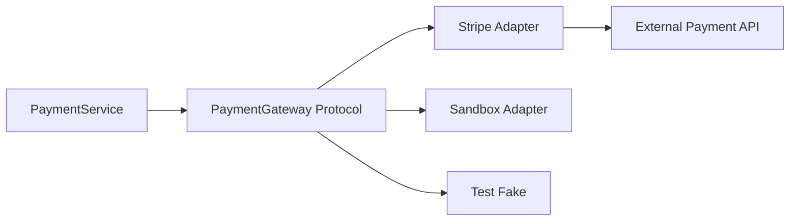

# 11- Protocols

## Overview

Protocols provide a way to define interfaces through **behavior rather than inheritance**.

A protocol describes the operations an object must support:

```python
from typing import Protocol


class UserRepository(Protocol):
    def get(self, user_id: int) -> User | None:
        ...
```

A class does not need to inherit from `UserRepository` to satisfy this contract. If it provides a compatible `get()` method, a static type checker can treat it as implementing the protocol.

This is Python's primary mechanism for **structural typing**.

The distinction is:

```text
Nominal typing
    "You implement this interface because you explicitly inherit from it."

Structural typing
    "You implement this interface because your behavior matches it."
```

Protocols are particularly valuable in backend systems because they reduce coupling between:

- services and infrastructure
- application code and databases
- business logic and external APIs
- production implementations and test doubles
- framework-specific components and domain logic

A well-designed protocol defines the smallest capability the consumer actually needs.

---

## Why Protocols Matter

Consider a service that depends directly on a concrete repository:

```python
class UserService:
    def __init__(self, repository: PostgresUserRepository) -> None:
        self.repository = repository
```

The service is now coupled to PostgreSQL implementation details.

A protocol separates the consumer from the implementation:

```python
class UserRepository(Protocol):
    def get(self, user_id: int) -> User | None:
        ...


class UserService:
    def __init__(self, repository: UserRepository) -> None:
        self.repository = repository
```

Now multiple implementations can satisfy the same contract:

```text
                 ┌─────────────────────┐
                 │   UserRepository    │
                 │      Protocol       │
                 └──────────┬──────────┘
                            │
             ┌──────────────┼──────────────┐
             ▼              ▼              ▼
      PostgreSQL repo   Redis repo     Test fake
```

The service depends on behavior rather than infrastructure.

---

## Structural Typing

Structural typing asks:

> Does this object have the required structure and behavior?

For example:

```python
from typing import Protocol


class Cache(Protocol):
    def get(self, key: str) -> bytes | None:
        ...

    def set(self, key: str, value: bytes, ttl: int) -> None:
        ...
```

A compatible implementation:

```python
class RedisCache:
    def get(self, key: str) -> bytes | None:
        ...

    def set(self, key: str, value: bytes, ttl: int) -> None:
        ...
```

does not need:

```python
class RedisCache(Cache):
    ...
```

for static structural compatibility.

The implementation simply provides the required methods.

---

## Protocol vs Abstract Base Class

Protocols and abstract base classes solve related but different problems.

| Aspect | Protocol | Abstract Base Class |
|---|---|---|
| Typing model | Structural | Nominal |
| Explicit inheritance required | No | Usually yes |
| Shared implementation | Limited | Strong support |
| Runtime `isinstance()` | Optional with `@runtime_checkable` | Native |
| Best for | Behavioral contracts | Shared abstraction/invariants |
| Third-party implementations | Easy to adapt | Requires inheritance or registration |
| Coupling | Low | Higher |
| Static type checking | Excellent | Excellent |

Use a protocol when the important property is:

```text
"Can this object perform these operations?"
```

Use an ABC when the important property is:

```text
"Is this object part of this explicit inheritance hierarchy?"
```

---

## Basic Protocol

A protocol is declared using `typing.Protocol`:

```python
from typing import Protocol


class Logger(Protocol):
    def info(self, message: str) -> None:
        ...

    def error(self, message: str) -> None:
        ...
```

Any compatible object can satisfy the protocol statically:

```python
class ApplicationLogger:
    def info(self, message: str) -> None:
        print(message)

    def error(self, message: str) -> None:
        print(message)
```

Consumer:

```python
def process(logger: Logger) -> None:
    logger.info("Processing request")
```

No explicit inheritance is required.

---

## Protocols as Consumer-Owned Interfaces

A strong design principle is:

> Define the protocol close to the code that consumes it.

Suppose a service only needs:

```python
repository.get(user_id)
```

Do not expose the entire repository implementation.

Prefer:

```python
class UserLookup(Protocol):
    def get(self, user_id: int) -> User | None:
        ...
```

This keeps the dependency surface small.

```text
Large infrastructure interface
        │
        ├── get()
        ├── save()
        ├── delete()
        ├── bulk_insert()
        ├── transaction()
        └── admin_operations()
```

versus:

```text
Consumer-specific protocol
        │
        └── get()
```

The second design reduces coupling and makes implementations easier to substitute.

---

## Why Small Protocols Are Better

Large protocols often become artificial abstractions.

Bad:

```python
class UserRepository(Protocol):
    def get(self, user_id: int) -> User | None:
        ...

    def save(self, user: User) -> User:
        ...

    def delete(self, user_id: int) -> None:
        ...

    def migrate(self) -> None:
        ...

    def rebuild_indexes(self) -> None:
        ...
```

A read-only service may only require:

```python
class UserLookup(Protocol):
    def get(self, user_id: int) -> User | None:
        ...
```

This follows interface segregation and makes testing simpler.

---

## Protocol Attributes

Protocols can specify attributes as well as methods:

```python
class RequestContext(Protocol):
    request_id: str
    user_id: int | None
```

An implementation must expose compatible attributes.

For immutable or read-only attributes, use a property:

```python
class RequestContext(Protocol):
    @property
    def request_id(self) -> str:
        ...
```

This is often preferable because it describes what consumers can read without implying that they can mutate the value.

---

## Protocol Properties

Protocols can define properties:

```python
class Identifiable(Protocol):
    @property
    def id(self) -> int:
        ...
```

Compatible implementations can use a normal property:

```python
class User:
    def __init__(self, user_id: int) -> None:
        self._id = user_id

    @property
    def id(self) -> int:
        return self._id
```

This is useful for domain abstractions where only a capability matters.

---

## Protocol Class Methods and Static Methods

Protocols can describe different kinds of methods:

```python
class Factory(Protocol):
    @classmethod
    def create(cls, payload: dict[str, object]) -> object:
        ...
```

Static methods can also be represented:

```python
class Hasher(Protocol):
    @staticmethod
    def hash(value: bytes) -> bytes:
        ...
```

The contract should match the actual invocation semantics expected by consumers.

---

## Protocol Inheritance

Protocols can extend other protocols:

```python
class Identifiable(Protocol):
    @property
    def id(self) -> int:
        ...


class Timestamped(Protocol):
    @property
    def created_at(self) -> datetime:
        ...


class Entity(Identifiable, Timestamped, Protocol):
    pass
```

This allows capabilities to be composed.

```text
Entity
 ├── Identifiable
 │     └── id
 │
 └── Timestamped
       └── created_at
```

Prefer small composable protocols over one large universal interface.

---

## Protocol Composition

A consumer can require multiple capabilities:

```python
class UserLike(Identifiable, Timestamped, Protocol):
    pass
```

Or generic functions can use multiple constraints through their signatures.

This is useful when an operation genuinely needs several independent capabilities.

Avoid creating protocol hierarchies that merely reproduce traditional inheritance trees.

Protocols are most valuable when they describe **capabilities**.

---

## Generic Protocols

Protocols can be generic.

```python
from typing import Protocol


class Repository[T](Protocol):
    def get(self, entity_id: int) -> T | None:
        ...

    def save(self, entity: T) -> T:
        ...
```

This can represent:

```python
Repository[User]
Repository[Order]
Repository[Payment]
```

The generic protocol combines:

```text
Structural typing
       +
Generics
       =
Reusable behavioral contract
```

This is particularly useful for infrastructure abstractions.

---

## Generic Producer Protocol

A protocol that only produces values can often be covariant.

```python
from typing import Protocol, TypeVar


T_co = TypeVar("T_co", covariant=True)


class Provider(Protocol[T_co]):
    def get(self) -> T_co:
        ...
```

The protocol consumes no `T_co`; it only produces it.

This allows appropriate subtype substitution.

Variance should be introduced deliberately rather than added simply to silence a type checker.

---

## Generic Consumer Protocol

A consumer can be contravariant:

```python
from typing import Protocol, TypeVar


T_contra = TypeVar("T_contra", contravariant=True)


class Handler(Protocol[T_contra]):
    def handle(self, event: T_contra) -> None:
        ...
```

A handler that accepts a broad event type can potentially handle a narrower event type.

This is useful for:

- event handlers
- message consumers
- callbacks
- validation functions
- command handlers

---

## Callable Protocols

A protocol can describe callable objects:

```python
from typing import Protocol


class Authorizer(Protocol):
    def __call__(
        self,
        user_id: int,
        resource_id: int,
    ) -> bool:
        ...
```

Both functions and callable classes can satisfy the protocol:

```python
def authorize(user_id: int, resource_id: int) -> bool:
    return True
```

or:

```python
class PolicyAuthorizer:
    def __call__(
        self,
        user_id: int,
        resource_id: int,
    ) -> bool:
        return True
```

Use `Callable` when the signature alone is sufficient.

Use a callable protocol when the abstraction needs richer structure or a named semantic contract.

---

## Protocol vs Callable

| Requirement | Prefer |
|---|---|
| Simple function signature | `Callable` |
| Named behavioral contract | Protocol |
| Callable object with attributes | Protocol |
| Generic callback | `Callable` / generic protocol |
| Multiple related operations | Protocol |
| Runtime interface behavior | ABC or runtime-checkable protocol |

For example:

```python
Callable[[User], bool]
```

is concise.

But:

```python
class UserAuthorizer(Protocol):
    def __call__(self, user: User) -> bool:
        ...
```

communicates domain meaning.

---

## `@runtime_checkable`

Protocols are primarily static typing constructs.

A protocol can optionally support runtime checks:

```python
from typing import Protocol, runtime_checkable


@runtime_checkable
class Closeable(Protocol):
    def close(self) -> None:
        ...
```

Then:

```python
if isinstance(resource, Closeable):
    resource.close()
```

This checks whether the object structurally exposes the relevant members.

Runtime-checkable protocols have limitations and should not be treated as complete runtime validation mechanisms.

---

## Runtime Protocol Checks

`@runtime_checkable` is useful for lightweight capability detection.

For example:

```python
if isinstance(value, SupportsBytes):
    ...
```

However, runtime protocol checks do not perform full static type analysis.

They also do not validate:

- parameter annotations
- return annotations
- semantic correctness
- business invariants
- data values

A method named `close` existing on an object does not prove that calling it is semantically safe.

---

## Python Version Considerations

Modern Python has evolved protocol support substantially.

For current Python projects:

```python
from typing import Protocol
```

is the standard mechanism.

Protocols integrate with modern type checkers such as:

- mypy
- Pyright
- IDE static analysis

Use the project's supported Python version consistently when designing protocol syntax and typing features.

---

## Protocols and Duck Typing

Protocols formalize an important part of Python's traditional duck typing.

Traditional duck typing:

```python
def process(value: object) -> None:
    value.process()
```

The developer assumes the object has `process()`.

A protocol makes that assumption explicit:

```python
class Processable(Protocol):
    def process(self) -> None:
        ...


def process(value: Processable) -> None:
    value.process()
```

The type checker can now verify the contract.

The runtime behavior remains Pythonic.

---

## Protocols and Dependency Injection

Protocols work particularly well with dependency injection.

```python
class PaymentGateway(Protocol):
    def charge(self, customer_id: int, amount: Decimal) -> str:
        ...
```

Service:

```python
class PaymentService:
    def __init__(self, gateway: PaymentGateway) -> None:
        self.gateway = gateway

    def charge(
        self,
        customer_id: int,
        amount: Decimal,
    ) -> str:
        return self.gateway.charge(customer_id, amount)
```

Production implementation:

```python
class StripePaymentGateway:
    def charge(
        self,
        customer_id: int,
        amount: Decimal,
    ) -> str:
        ...
```

Test implementation:

```python
class FakePaymentGateway:
    def charge(
        self,
        customer_id: int,
        amount: Decimal,
    ) -> str:
        return "test-payment-id"
```

The service does not depend on Stripe.

---

## Dependency Injection Flow



The protocol becomes the stable application boundary.

External implementations can change without requiring the business service to know implementation details.

---

## Protocols and Testing

Protocols can reduce the need for inheritance-based mocks.

For example:

```python
class UserReader(Protocol):
    def get(self, user_id: int) -> User | None:
        ...
```

A test double only needs:

```python
class FakeUserReader:
    def get(self, user_id: int) -> User | None:
        return User(id=user_id)
```

This encourages lightweight test doubles.

However, do not make every dependency a protocol solely to make mocking easier.

The protocol should represent a meaningful architectural boundary.

---

## Protocols and `unittest.mock`

Mocks can be used with protocols, but static typing and runtime mocking are separate concerns.

For example:

```python
from unittest.mock import Mock


repository = Mock(spec=UserRepository)
```

The mock's runtime behavior depends on the mocking framework.

Static type checking does not automatically prove that the mock's configured behavior is semantically correct.

For important infrastructure, small fakes can sometimes provide stronger tests than heavily configured mocks.

---

## Protocols and FastAPI

Protocols are useful for keeping FastAPI route handlers independent from infrastructure.

For example:

```python
class UserService(Protocol):
    async def get_user(self, user_id: int) -> User | None:
        ...
```

A route can depend on the protocol:

```python
@app.get("/users/{user_id}")
async def get_user(
    user_id: int,
    service: UserService = Depends(get_user_service),
) -> User:
    user = await service.get_user(user_id)

    if user is None:
        raise HTTPException(status_code=404)

    return user
```

The actual dependency can be replaced by another implementation in tests or different deployment configurations.

---

## Protocols and Django

In Django applications, protocols can isolate domain or service code from framework-specific infrastructure.

For example:

```python
class UserStore(Protocol):
    def get_by_email(self, email: str) -> User | None:
        ...

    def save(self, user: User) -> User:
        ...
```

A Django ORM adapter implements the protocol:

```python
class DjangoUserStore:
    def get_by_email(self, email: str) -> User | None:
        ...
```

This is useful when the domain layer should not depend directly on ORM APIs.

Do not introduce protocols for every Django model manager method. Use them at meaningful boundaries.

---

## Protocols and PostgreSQL

A PostgreSQL implementation might satisfy:

```python
class UserStore(Protocol):
    def get(self, user_id: int) -> User | None:
        ...
```

The protocol does not describe:

- SQL execution plans
- transaction isolation
- indexes
- locks
- connection pooling

Those remain implementation concerns.

The protocol should expose business-relevant capabilities rather than database-specific mechanisms.

---

## Protocols and Redis

A cache protocol can isolate application code from Redis:

```python
class Cache(Protocol):
    def get(self, key: str) -> bytes | None:
        ...

    def set(self, key: str, value: bytes, ttl: int) -> None:
        ...
```

Redis becomes an implementation detail.

This allows alternatives such as:

```text
Redis
In-memory cache
Local test fake
Another distributed cache
```

The protocol should remain stable while implementations evolve.

---

## Protocols and Kafka

Event consumers can be represented by protocols:

```python
class EventHandler[T](Protocol):
    def handle(self, event: T) -> None:
        ...
```

Different handlers can implement the same behavioral contract.

For asynchronous consumers:

```python
class AsyncEventHandler[T](Protocol):
    async def handle(self, event: T) -> None:
        ...
```

Kafka remains an infrastructure transport.

The business layer receives validated domain events rather than depending on Kafka client APIs.

---

## Protocols and Celery

A task dispatcher can be abstracted:

```python
class TaskDispatcher(Protocol):
    def dispatch(
        self,
        task_name: str,
        payload: dict[str, object],
    ) -> str:
        ...
```

The application can depend on the protocol while Celery implements the infrastructure.

This is useful when:

- task execution may change
- tests should avoid real workers
- multiple task transports exist
- domain code should remain framework-independent

Do not abstract Celery merely to rename `.delay()`.

---

## Protocols and gRPC

A service client protocol can isolate generated gRPC code:

```python
class InventoryClient(Protocol):
    async def get_stock(self, sku: str) -> int:
        ...
```

A gRPC adapter implements it.

The business service depends on:

```text
InventoryClient
```

rather than generated protobuf classes and channel details.

This reduces coupling and makes contract boundaries clearer.

---

## Protocols and REST Clients

A REST client abstraction can similarly be defined:

```python
class UserDirectory(Protocol):
    async def find_user(self, user_id: int) -> User | None:
        ...
```

The concrete implementation handles:

- HTTP
- authentication
- retries
- timeouts
- JSON
- response validation

The application service only depends on the behavioral contract.

---

## Protocols and Microservices

Protocols are especially useful inside a microservice boundary.

A typical structure:

```text
API
 │
 ▼
Application Service
 │
 ├── Repository Protocol ──► PostgreSQL Adapter
 │
 ├── Cache Protocol ───────► Redis Adapter
 │
 ├── Event Publisher ──────► Kafka Adapter
 │
 └── External Client ──────► HTTP/gRPC Adapter
```

The protocols create stable dependency boundaries.

They do not replace distributed contracts such as:

- OpenAPI
- protobuf
- JSON Schema
- Avro
- event schemas

Use protocols inside the Python application and explicit schemas across service boundaries.

---

## Protocols and Serialization

A protocol can describe serialization behavior:

```python
class Serializer[T](Protocol):
    def encode(self, value: T) -> bytes:
        ...

    def decode(self, payload: bytes) -> T:
        ...
```

This does not guarantee that `decode(encode(value))` is lossless.

The implementation still needs:

- schema validation
- compatibility
- versioning
- error handling
- security controls

Protocols describe the interface, not the correctness of the serialized format.

---

## Protocols and Security

Protocols do not provide authentication or authorization.

For example:

```python
class UserService(Protocol):
    def get_user(self, user_id: int) -> User | None:
        ...
```

does not mean callers are authorized to retrieve that user.

Authorization remains explicit:

```text
Request
   │
   ▼
Authentication
   │
   ▼
Authorization
   │
   ▼
Validation
   │
   ▼
Service Protocol
   │
   ▼
Infrastructure
```

Never use structural typing as a security boundary.

---

## Protocols and Performance

Protocols primarily affect static analysis and architecture.

They generally do not add runtime dispatch overhead merely because a parameter is annotated with a protocol.

For example:

```python
def process(repository: UserRepository) -> User:
    return repository.get(1)
```

still performs normal Python method dispatch.

Performance concerns come from:

- database calls
- network calls
- serialization
- locking
- allocations
- algorithmic complexity

not from the protocol annotation itself.

---

## Protocols and Memory

Protocol annotations generally do not change object memory layout.

However, using protocol-oriented architecture may introduce adapters:

```text
Application
    ↓
Protocol
    ↓
Adapter
    ↓
SDK
```

An adapter may add:

- object allocations
- method calls
- conversion logic

This cost is normally negligible compared with network or database operations.

For high-throughput local hot paths, measure rather than assuming.

---

## Protocols and Concurrency

A protocol does not specify thread safety unless the contract explicitly says so.

For example:

```python
class Cache(Protocol):
    def get(self, key: str) -> bytes | None:
        ...
```

does not guarantee:

- thread safety
- process safety
- async safety
- atomicity

If concurrency semantics matter, document them in the contract and enforce them in implementations.

For example, an asynchronous protocol:

```python
class AsyncCache(Protocol):
    async def get(self, key: str) -> bytes | None:
        ...
```

expresses asynchronous usage but still does not guarantee safe concurrent access.

---

## Protocols and Async Interfaces

Synchronous and asynchronous behavior should be modeled explicitly.

Synchronous:

```python
class UserRepository(Protocol):
    def get(self, user_id: int) -> User | None:
        ...
```

Asynchronous:

```python
class AsyncUserRepository(Protocol):
    async def get(self, user_id: int) -> User | None:
        ...
```

Do not hide asynchronous behavior behind a synchronous-looking protocol.

An incorrect abstraction can cause:

- accidental blocking
- event-loop starvation
- poor request latency
- incorrect resource handling

---

## Protocols and Resource Management

Protocols can describe context-manager behavior:

```python
from typing import Protocol


class Transaction(Protocol):
    def __enter__(self) -> "Transaction":
        ...

    def __exit__(
        self,
        exc_type: type[BaseException] | None,
        exc_value: BaseException | None,
        traceback: object | None,
    ) -> bool | None:
        ...
```

For asynchronous resources:

```python
class AsyncTransaction(Protocol):
    async def __aenter__(self) -> "AsyncTransaction":
        ...

    async def __aexit__(
        self,
        exc_type: type[BaseException] | None,
        exc_value: BaseException | None,
        traceback: object | None,
    ) -> bool | None:
        ...
```

Protocols can therefore model infrastructure lifecycle behavior without requiring inheritance.

---

## Protocols and `collections.abc`

Python's standard library already provides many behavioral abstractions:

```python
from collections.abc import Iterable, Mapping, Sequence
```

These should generally be preferred over inventing custom protocols when the standard abstraction exactly matches the required behavior.

For example:

```python
def process_users(users: Iterable[User]) -> None:
    ...
```

is preferable to defining:

```python
class UserCollection(Protocol):
    ...
```

unless the application requires a domain-specific contract.

---

## Protocols and Existing Third-Party Libraries

Protocols are particularly useful for adapting third-party libraries.

Suppose an SDK exposes:

```python
sdk_client.fetch_user(...)
```

but the application needs:

```python
class UserDirectory(Protocol):
    def get_user(self, user_id: int) -> User | None:
        ...
```

An adapter translates between them:

```text
Application
    │
    ▼
UserDirectory Protocol
    │
    ▼
SDK Adapter
    │
    ▼
Third-Party SDK
```

This prevents vendor-specific APIs from spreading through the application.

---

## Protocols and Dependency Inversion

Protocols are a practical implementation of dependency inversion.

Instead of:

```text
Service → PostgreSQL
Service → Redis
Service → Stripe
```

prefer:

```text
             ┌───────────────┐
             │    Service    │
             └───────┬───────┘
                     │
             ┌───────▼────────┐
             │    Protocol    │
             └───────┬────────┘
                     │
          ┌──────────┼──────────┐
          ▼          ▼          ▼
      PostgreSQL   Redis      Stripe
       Adapter     Adapter     Adapter
```

The business logic owns the abstraction.

Infrastructure implements it.

---

## Protocols vs Inheritance

Inheritance communicates an explicit relationship:

```python
class PostgresRepository(BaseRepository):
    ...
```

A protocol communicates capability:

```python
class PostgresRepository:
    def get(self, user_id: int) -> User | None:
        ...
```

The second approach is often preferable when the implementation is external, independently developed, or already has its own inheritance hierarchy.

---

## Protocols vs ABCs vs Duck Typing

| Approach | Static contract | Explicit inheritance | Runtime behavior | Best use |
|---|---:|---:|---|---|
| Duck typing | Weak | No | Direct | Small local code |
| Protocol | Strong | No | Normal Python dispatch | Behavioral boundaries |
| ABC | Strong | Yes | Normal Python dispatch | Shared hierarchy |
| Concrete class | Strong | N/A | Direct | Specific implementation |

A senior Python codebase can use all four appropriately.

The goal is not to replace inheritance with protocols everywhere.

---

## Protocols and Type Narrowing

Protocols can participate in static narrowing.

For example:

```python
from typing import Protocol, TypeGuard


class Closeable(Protocol):
    def close(self) -> None:
        ...


def is_closeable(value: object) -> TypeGuard[Closeable]:
    return callable(getattr(value, "close", None))
```

Then:

```python
if is_closeable(resource):
    resource.close()
```

This combines runtime inspection with static narrowing.

The runtime predicate must be trustworthy. A poorly implemented `TypeGuard` can lie to the type checker.

---

## Protocols and `TypeGuard`

`TypeGuard` is useful when runtime information is needed to establish a static type.

The responsibilities are different:

```text
Protocol
→ defines the required behavior

TypeGuard
→ tells the type checker that a runtime predicate establishes that behavior
```

Do not use `TypeGuard` merely to silence errors.

The predicate must actually justify the narrowed type.

---

## Protocols and `Any`

Protocols are often preferable to `Any` for dynamic dependencies.

Bad:

```python
def process(client: Any) -> User:
    return client.get_user()
```

Better:

```python
class UserClient(Protocol):
    def get_user(self, user_id: int) -> User:
        ...


def process(client: UserClient) -> User:
    return client.get_user(1)
```

The second design documents and checks the required capability.

This is especially useful around third-party SDKs.

---

## Protocols and Type Aliases

A type alias names a type expression:

```python
type UserId = int
```

A protocol defines behavior:

```python
class UserRepository(Protocol):
    def get(self, user_id: int) -> User | None:
        ...
```

They solve different problems.

Use aliases for type composition.

Use protocols for behavioral contracts.

---

## Protocols and TypedDict

`TypedDict` describes dictionary structure:

```python
class UserPayload(TypedDict):
    id: int
    email: str
```

A protocol describes behavior:

```python
class UserReader(Protocol):
    def get(self, user_id: int) -> User | None:
        ...
```

Use:

```text
TypedDict → data shape
Protocol  → behavior
```

They can be combined in a larger application.

---

## Production Architecture Pattern

A practical backend architecture may define protocols in the application layer:

```text
app/
├── domain/
│   ├── models.py
│   └── protocols.py
│
├── services/
│   └── user_service.py
│
├── infrastructure/
│   ├── postgres/
│   ├── redis/
│   ├── kafka/
│   └── external/
│
└── api/
    └── routes.py
```

Example:

```python
# domain/protocols.py

class UserRepository(Protocol):
    async def get(self, user_id: int) -> User | None:
        ...
```

Infrastructure:

```python
# infrastructure/postgres/user_repository.py

class PostgresUserRepository:
    async def get(self, user_id: int) -> User | None:
        ...
```

Service:

```python
# services/user_service.py

class UserService:
    def __init__(self, repository: UserRepository) -> None:
        self.repository = repository
```

This keeps dependency direction explicit.

---

## Dependency Direction

A clean dependency graph is:

```text
API
 │
 ▼
Application Services
 │
 ▼
Domain Protocols
 ▲
 │
Infrastructure Adapters
 │
 ├── PostgreSQL
 ├── Redis
 ├── Kafka
 ├── HTTP
 └── AWS
```

Infrastructure depends on application-owned contracts.

Application code does not need to import infrastructure implementations merely to define its dependency types.

---

## Protocol Placement

A practical rule:

> Put a protocol at the boundary where its behavior is consumed.

For example:

```text
PaymentService
    │
    └── PaymentGateway Protocol
```

rather than:

```text
Infrastructure
    │
    └── GenericInfrastructureProtocol
```

The first reflects the actual dependency.

The second usually creates unnecessary abstraction.

---

## Naming Protocols

Prefer names describing capabilities:

```python
class UserReader(Protocol):
    ...


class PaymentGateway(Protocol):
    ...


class EventPublisher(Protocol):
    ...


class Clock(Protocol):
    ...


class Cache(Protocol):
    ...
```

Avoid generic names such as:

```python
class IService(Protocol):
    ...


class IRepositoryInterface(Protocol):
    ...
```

Python does not require an `I` prefix, and semantic names are usually clearer.

---

## Protocol Design Guidelines

A good protocol should:

- represent one meaningful capability
- contain the smallest useful surface
- use domain-oriented names
- avoid infrastructure details
- have precise types
- model synchronous/asynchronous behavior explicitly
- document important concurrency semantics
- document failure behavior when it matters
- remain stable while implementations evolve

Avoid:

- protocols with dozens of unrelated methods
- protocols created only for mocking
- infrastructure-specific methods in domain contracts
- overly generic `object` or `Any` signatures
- protocol hierarchies that reproduce class inheritance

---

## Common Mistakes

### Assuming Protocol Requires Inheritance

This is unnecessary for static structural compatibility.

```python
class RedisCache(Cache):
    ...
```

can be valid, but it is not required.

### Using `@runtime_checkable` Everywhere

Runtime checking is optional and should be used only when runtime capability detection is actually required.

### Treating Protocols as Runtime Validation

A protocol does not validate arbitrary external data.

Use Pydantic, schema validation, or explicit runtime checks at trust boundaries.

### Creating Protocols for Every Class

A protocol is useful at a dependency boundary, not necessarily for every internal object.

### Defining Giant Protocols

Large protocols increase coupling and make implementations harder to substitute.

### Using Protocol Instead of `collections.abc`

If `Iterable`, `Mapping`, `Sequence`, or another standard abstraction already describes the required behavior, prefer it.

### Hiding Important Semantics

This:

```python
class PaymentGateway(Protocol):
    def charge(...) -> str:
        ...
```

does not explain whether:

- retries are safe
- calls are idempotent
- failures raise exceptions
- authorization is required
- timeouts are enforced

Types describe shape, not every operational guarantee.

---

## Production Pitfalls

### Protocol Does Not Guarantee Semantic Compatibility

Two classes may satisfy:

```python
def send(payload: bytes) -> None:
    ...
```

but one might block for 30 seconds while another is asynchronous.

Structural compatibility is not semantic compatibility.

### Protocol Does Not Guarantee Thread Safety

A shared implementation can satisfy the protocol while remaining unsafe under concurrent access.

### Protocol Does Not Guarantee API Compatibility

A protocol inside a service does not replace OpenAPI or protobuf contracts between services.

### Protocol Can Hide Infrastructure Failures

A clean abstraction should not swallow:

- timeouts
- connection errors
- retries
- transaction failures
- rate limits

Define failure semantics deliberately.

### Over-Abstraction

Too many protocols can make simple code difficult to navigate:

```text
Service
  → Protocol
    → Factory
      → Adapter
        → Wrapper
          → SDK
```

Abstraction should reduce coupling, not increase indirection without benefit.

---

## Security Considerations

When protocols wrap security-sensitive infrastructure, the contract should make security-relevant behavior explicit where practical.

For example:

```python
class SecretStore(Protocol):
    async def get_secret(self, name: str) -> str:
        ...
```

The implementation should enforce:

- IAM authorization
- secret access policies
- encryption
- audit logging
- least privilege
- timeout behavior
- safe error handling

Do not log secret values simply because the protocol exposes them as strings.

Protocol design should not encourage accidental exposure of credentials or sensitive data.

---

## Reliability Considerations

Infrastructure protocols should have well-defined failure behavior.

For example:

```python
class PaymentGateway(Protocol):
    async def charge(
        self,
        customer_id: int,
        amount: Decimal,
        idempotency_key: str,
    ) -> PaymentResult:
        ...
```

Including an idempotency key communicates an important reliability requirement.

Depending on the system, contracts may also need to establish:

- timeout expectations
- retryability
- idempotency
- cancellation behavior
- transaction boundaries
- consistency guarantees

These properties are often more important operationally than the method signatures themselves.

---

## Observability

Protocols can provide stable points for instrumentation.

For example:

```python
class EventPublisher(Protocol):
    async def publish(self, event: Event) -> None:
        ...
```

An adapter can consistently emit:

```text
event.publish.started
event.publish.succeeded
event.publish.failed
```

with bounded metadata such as:

```text
event_type
service
environment
result
```

Avoid exposing sensitive payloads or high-cardinality values in metrics.

---

## High Availability

Protocols can make failover implementations easier to introduce.

For example:

```text
UserRepository Protocol
       │
       ├── Primary PostgreSQL
       ├── Read replica
       └── Failover implementation
```

However, the protocol itself provides no availability guarantee.

HA requires:

- redundant infrastructure
- health checks
- connection management
- timeouts
- retry policies
- failover strategy
- monitoring
- tested recovery procedures

The protocol should remain stable while implementations handle infrastructure resilience.

---

## Disaster Recovery

Protocols can isolate application code from disaster-recovery mechanisms.

For example:

```python
class ObjectStore(Protocol):
    async def put(self, key: str, data: bytes) -> None:
        ...

    async def get(self, key: str) -> bytes:
        ...
```

An AWS implementation may use S3 replication or versioning.

The application does not need to know the storage topology.

However, DR requirements must still define:

- RPO
- RTO
- backup policy
- replication
- restoration procedures
- integrity verification

A protocol does not create disaster recovery by itself.

---

## Cost Considerations

Protocols can reduce long-term engineering cost by isolating infrastructure dependencies.

Examples:

```text
External API
     │
     ▼
Protocol
     │
     ├── Production implementation
     ├── Local development implementation
     └── Test implementation
```

This can reduce expensive integration testing and simplify local development.

However, excessive abstraction creates maintenance cost.

Evaluate:

```text
Reduced coupling
      vs
Additional complexity
```

before introducing a protocol.

---

## Testing Strategy

For a protocol-based architecture, test at multiple levels.

### Unit Tests

Use fakes or mocks for service behavior.

### Contract Tests

Verify that each implementation satisfies the expected behavioral contract.

### Integration Tests

Verify actual:

- PostgreSQL behavior
- Redis behavior
- Kafka behavior
- HTTP APIs
- AWS services

### End-to-End Tests

Verify the full request or event lifecycle.

A useful hierarchy is:

```text
Static typing
    │
    ▼
Unit tests
    │
    ▼
Protocol contract tests
    │
    ▼
Integration tests
    │
    ▼
End-to-end tests
```

Protocols reduce coupling, but they do not eliminate the need to test real infrastructure.

---

## Contract Testing

If multiple implementations satisfy a protocol, define shared behavioral tests.

For example:

```python
def exercise_user_repository(
    repository: UserRepository,
) -> None:
    user = repository.get(1)

    assert user is not None
```

Each implementation can run the same behavioral suite.

This is particularly useful for:

- PostgreSQL vs test implementation
- local vs cloud storage
- production vs sandbox payment gateway
- synchronous vs alternate adapters

The tests should validate semantics, not merely method existence.

---

## Static Analysis

Protocols provide substantial value when static analysis is enabled.

Typical CI commands:

```bash
ruff check .
mypy .
pytest
```

or:

```bash
pyright
pytest
```

A protocol mismatch such as:

```python
class RedisRepository:
    def get(self, user_id: str) -> User | None:
        ...
```

against:

```python
class UserRepository(Protocol):
    def get(self, user_id: int) -> User | None:
        ...
```

can be detected before deployment.

---

## Protocol Validation in CI

A production pipeline should treat type errors as build failures:

```text
Developer
   │
   ▼
Pull Request
   │
   ├── Formatting
   ├── Linting
   ├── Static Type Checking
   ├── Unit Tests
   ├── Integration Tests
   └── Security Checks
           │
           ▼
        Build
           │
           ▼
        Deploy
```

This prevents protocol drift between consumers and implementations.

---

## Protocol Evolution

Changing a protocol can affect every implementation.

Adding a required method:

```python
class Cache(Protocol):
    def get(self, key: str) -> bytes | None:
        ...

    def set(self, key: str, value: bytes) -> None:
        ...

    def delete(self, key: str) -> None:
        ...
```

can break all implementations that previously satisfied the protocol.

Treat widely used protocols as APIs.

Before changing them:

- identify implementations
- identify consumers
- update tests
- update adapters
- run static analysis
- evaluate backward compatibility

Small protocols reduce this change surface.

---

## Protocols Across Service Boundaries

Protocols should generally remain internal to a Python application.

For service-to-service communication, use explicit contracts:

```text
Python service
    │
    ├── Internal dependency
    │      └── Protocol
    │
    └── External service
           └── OpenAPI / protobuf / schema
```

Do not assume that:

```python
class PaymentClient(Protocol):
    ...
```

is a distributed API contract.

The remote service cannot see or enforce Python typing information.

---

## Protocols and OpenAPI

For REST APIs:

```text
Internal Python boundary
        ↓
Protocol
        ↓
HTTP client
        ↓
OpenAPI contract
        ↓
Remote service
```

The protocol describes how local code interacts with the client.

OpenAPI describes how systems communicate over HTTP.

These contracts complement each other.

---

## Protocols and gRPC

For gRPC:

```text
Business Service
      │
      ▼
InventoryClient Protocol
      │
      ▼
gRPC Adapter
      │
      ▼
Generated Stub
      │
      ▼
Remote Service
```

The `.proto` definition remains the distributed contract.

The Python protocol is an application-level abstraction over the generated client.

---

## Senior-Level Design Guidance

A protocol should answer:

> What capability does this consumer require?

It should not answer:

> What does this entire infrastructure component happen to provide?

For example:

```python
class UserReader(Protocol):
    async def get(self, user_id: int) -> User | None:
        ...
```

is usually better than:

```python
class DatabaseProtocol(Protocol):
    async def connect(self) -> None:
        ...

    async def execute(self, query: str) -> object:
        ...

    async def commit(self) -> None:
        ...

    async def rollback(self) -> None:
        ...
```

The first represents an application capability.

The second leaks infrastructure mechanics into the consumer.

---

## When Not to Use Protocols

Do not introduce a protocol when:

- there is only one trivial implementation
- the abstraction has no meaningful boundary
- a standard library interface already exists
- the protocol only exists to satisfy a mocking preference
- the abstraction adds more indirection than value
- the implementation and consumer are intentionally tightly coupled
- domain semantics cannot be meaningfully represented by the interface

Simple code is often the better design.

---

## Protocol Design Checklist

Before creating a protocol, ask:

1. What consumer needs this capability?
2. What is the smallest useful interface?
3. Is the abstraction behavioral?
4. Could `collections.abc` already express it?
5. Should the protocol be generic?
6. Is the operation synchronous or asynchronous?
7. Are concurrency guarantees important?
8. What failures can occur?
9. Are timeout and retry semantics important?
10. Is the protocol application-owned or infrastructure-owned?
11. Can implementations be independently tested?
12. Does the protocol leak infrastructure details?
13. Does the abstraction improve dependency inversion?
14. Will the protocol remain stable as implementations evolve?
15. Would a concrete class or ABC be simpler?

---

## Common Interview Questions

### What is a Protocol in Python?

A protocol defines a behavioral interface that can be satisfied through structural typing without explicit inheritance.

### What is structural typing?

Structural typing determines compatibility from the members and behavior an object provides rather than its explicit inheritance hierarchy.

### Protocol vs ABC?

A protocol primarily enables structural typing. An ABC defines a nominal inheritance-based abstraction and can provide shared implementation and runtime behavior.

### Does a class need to inherit from a protocol?

No. Static compatibility is based on whether the class provides the required structure.

### What does `@runtime_checkable` do?

It enables certain runtime `isinstance()` and `issubclass()` checks against a protocol.

### Does a protocol validate runtime data?

No. Protocols primarily support static type checking.

### Why use protocols for dependency injection?

They allow consumers to depend on minimal behavioral contracts rather than concrete infrastructure implementations.

### Can protocols be generic?

Yes.

```python
class Repository[T](Protocol):
    def get(self, id: int) -> T | None:
        ...
```

### Can protocols be asynchronous?

Yes. Define `async def` methods explicitly.

### Are protocols useful for testing?

Yes, particularly for designing small testable dependency boundaries, although they should not be introduced solely for mocking.

### Do protocols improve runtime performance?

Not inherently. Their primary benefits are static correctness, decoupling, and maintainability.

### Can a protocol replace OpenAPI or protobuf?

No. Protocols are normally application-level Python contracts. OpenAPI and protobuf define distributed communication contracts.

---

## Production Best Practices

Prefer capability-oriented names:

```python
UserReader
PaymentGateway
EventPublisher
Clock
Cache
ObjectStore
```

Keep protocols small:

```python
class Clock(Protocol):
    def now(self) -> datetime:
        ...
```

rather than exposing unrelated operations.

Define protocols near their consumers.

Use generic protocols when the type relationship is meaningful:

```python
class Repository[T](Protocol):
    ...
```

Use standard library abstractions where they already describe the required behavior:

```python
Iterable[T]
Mapping[K, V]
Sequence[T]
```

Use `Callable` for simple callback signatures and callable protocols when a named behavioral abstraction provides additional value.

Model async behavior explicitly.

Document operational semantics that types cannot express, such as:

- timeout expectations
- idempotency
- retryability
- consistency
- concurrency guarantees
- failure modes

Keep distributed contracts separate from Python protocols.

Run static type checking in CI.

Test implementations against behavioral contracts.

Avoid creating protocols purely for abstraction's sake.

---

## Key Takeaways

- Protocols provide structural typing in Python, allowing implementations to satisfy behavioral contracts without explicit inheritance.
- Small, consumer-oriented protocols reduce coupling and are especially effective for dependency injection, repositories, caches, external clients, event publishers, and infrastructure adapters.
- Protocols complement generics, `TypedDict`, `Callable`, `TypeGuard`, and `collections.abc`; each solves a different typing problem.
- Protocols provide static contracts, not runtime validation, security guarantees, concurrency guarantees, or distributed API contracts.
- Production protocol design should optimize for minimal stable boundaries, explicit operational semantics, testability, and low coupling rather than maximum abstraction.