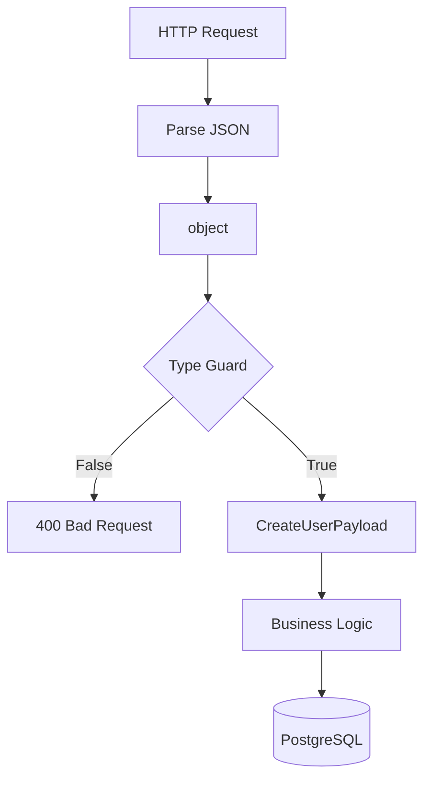

# 12- Type Guards

## Overview

Type guards connect **runtime checks** with **static type narrowing**.

Python's type system is primarily static. A type checker such as mypy or Pyright analyzes source code before execution, while the running application receives ordinary Python objects that may originate from untrusted or dynamically typed sources.

A type guard provides a way to tell a static type checker:

> If this runtime predicate returns `True`, treat the value as a more specific type.

The core mechanism is `TypeGuard`:

```python
from typing import TypeGuard


def is_string_list(value: object) -> TypeGuard[list[str]]:
    return (
        isinstance(value, list)
        and all(isinstance(item, str) for item in value)
    )
```

A caller can then narrow the type:

```python
value: object = ["alice", "bob"]

if is_string_list(value):
    for name in value:
        print(name.upper())
```

The runtime predicate establishes the fact. `TypeGuard` communicates that fact to static analysis.

The key distinction is:

```text
Runtime check
      │
      ▼
Predicate establishes a fact
      │
      ▼
TypeGuard communicates the fact
      │
      ▼
Static type narrowing
```

Type guards are useful when Python's built-in narrowing rules cannot infer a sufficiently precise type from an ordinary `if`, `isinstance()`, `hasattr()`, or other runtime condition.

---

## Why Type Guards Matter

Consider dynamically loaded data:

```python
payload: object = load_json()
```

The type checker cannot safely assume:

```python
payload["users"]
```

because `object` does not guarantee dictionary access.

A runtime validation function can establish a stronger contract:

```python
def is_user_payload(value: object) -> TypeGuard[UserPayload]:
    ...
```

Then:

```python
if is_user_payload(payload):
    process_users(payload["users"])
```

This is particularly useful at boundaries involving:

- JSON
- YAML
- environment configuration
- third-party SDKs
- database records
- message brokers
- HTTP responses
- plugin systems
- dynamically typed libraries

However, a type guard is only as trustworthy as its implementation.

---

## Static Narrowing vs Runtime Validation

These concepts should remain separate.

| Mechanism | Primary purpose | Runtime? | Static typing? |
|---|---|---:|---:|
| `isinstance()` | Runtime type check | Yes | Yes |
| `TypeGuard` | Communicate custom narrowing | Yes | Yes |
| Pydantic | Data validation/model construction | Yes | Indirectly |
| `TypedDict` | Dictionary shape declaration | No | Yes |
| `cast()` | Tell checker to trust a type | No | Yes |
| `assert` | Runtime invariant check | Yes | Yes |
| JSON Schema | Data contract validation | Yes | Via tooling |

A type guard does not replace validation libraries.

For example:

```python
def is_user(value: object) -> TypeGuard[User]:
    ...
```

can establish a static type relationship, but the function must perform sufficient runtime checks before making that claim.

---

## Basic Type Guard

The simplest pattern uses `TypeGuard[T]`:

```python
from typing import TypeGuard


def is_int(value: object) -> TypeGuard[int]:
    return isinstance(value, int)
```

Usage:

```python
value: object = 42

if is_int(value):
    result = value + 1
```

Inside the `if` block, a type checker can treat `value` as `int`.

The function's return value is still an ordinary `bool` at runtime.

Conceptually:

```text
is_int(value)
      │
      ├── False → no narrowing
      │
      └── True  → value narrowed to int
```

---

## How `TypeGuard` Works

The annotation:

```python
TypeGuard[int]
```

does not create a special runtime object.

Conceptually, the implementation is still:

```python
def is_int(value: object) -> bool:
    ...
```

The difference is static typing metadata.

A type checker interprets:

```python
if is_int(value):
```

as a narrowing operation.

This means:

```text
Runtime:
    function returns True/False

Static analysis:
    True branch → treat value as the guarded type
```

The runtime implementation must therefore be correct.

---

## `TypeGuard` vs `bool`

Compare:

```python
def is_user(value: object) -> bool:
    return isinstance(value, User)
```

with:

```python
def is_user(value: object) -> TypeGuard[User]:
    return isinstance(value, User)
```

Both return a normal Boolean at runtime.

The difference is that the second communicates a narrowing relationship to the static type checker.

Use `TypeGuard` when that relationship is important to downstream code.

---

## Built-in Narrowing Without TypeGuard

Python's type checker already understands many standard checks.

For example:

```python
def process(value: str | int) -> str:
    if isinstance(value, str):
        return value.upper()

    return str(value)
```

No custom type guard is necessary.

Similarly:

```python
value: str | None

if value is not None:
    print(value.upper())
```

Static analyzers already understand this narrowing.

Do not create a custom type guard when normal control-flow analysis is sufficient.

---

## When to Use TypeGuard

Type guards are appropriate when:

- the runtime predicate is reusable
- the predicate checks a structural condition
- built-in narrowing cannot express the condition
- the resulting narrowed type is useful
- the predicate represents a meaningful domain capability

Examples:

```text
object → list[str]
object → UserPayload
object → AdminUser
object → SupportedEvent
Sequence[object] → list[User]
```

They are especially valuable when the condition contains multiple runtime checks that static analysis cannot infer on its own.

---

## TypeGuard With Collections

A common use case is narrowing collections.

Suppose:

```python
values: list[object]
```

A normal loop can narrow each individual value:

```python
for value in values:
    if isinstance(value, str):
        print(value.upper())
```

But sometimes the application needs to establish that the **entire collection** satisfies a condition.

```python
def is_string_list(
    value: object,
) -> TypeGuard[list[str]]:
    return (
        isinstance(value, list)
        and all(isinstance(item, str) for item in value)
    )
```

Then:

```python
value: object = ["alice", "bob"]

if is_string_list(value):
    names: list[str] = value
```

The type guard captures the collection-level invariant.

---

## TypeGuard With Dictionaries

Dynamic dictionaries are common at API and messaging boundaries.

```python
from typing import TypeGuard, TypedDict


class UserPayload(TypedDict):
    id: int
    email: str


def is_user_payload(
    value: object,
) -> TypeGuard[UserPayload]:
    if not isinstance(value, dict):
        return False

    return (
        isinstance(value.get("id"), int)
        and isinstance(value.get("email"), str)
    )
```

Usage:

```python
payload: object = load_payload()

if is_user_payload(payload):
    user_id = payload["id"]
    email = payload["email"]
```

The type checker can now use the `TypedDict` structure inside the guarded branch.

---

## TypeGuard and `TypedDict`

`TypedDict` is static metadata.

It does not validate incoming dictionaries.

This means:

```python
class UserPayload(TypedDict):
    id: int
    email: str
```

does not make this runtime-safe:

```python
payload: UserPayload = external_data
```

A type guard can provide lightweight runtime validation:

```python
def is_user_payload(
    value: object,
) -> TypeGuard[UserPayload]:
    ...
```

For complex API contracts, however, a runtime validation model such as Pydantic is usually more maintainable.

---

## TypeGuard and Pydantic

For production API boundaries, Pydantic is often preferable when validation is substantial:

```python
from pydantic import BaseModel


class UserPayload(BaseModel):
    id: int
    email: str
```

Then:

```python
payload = UserPayload.model_validate(raw_payload)
```

The result is already a runtime-validated model.

A custom type guard is more appropriate for lightweight predicates or reusable narrowing logic where constructing a validation model would be unnecessary.

---

## TypeGuard and Protocols

Type guards can narrow to protocols.

```python
from typing import Protocol, TypeGuard


class Closeable(Protocol):
    def close(self) -> None:
        ...


def is_closeable(value: object) -> TypeGuard[Closeable]:
    return callable(getattr(value, "close", None))
```

Usage:

```python
resource: object = get_resource()

if is_closeable(resource):
    resource.close()
```

The runtime predicate establishes the capability, while the protocol defines the static behavior.

This combination is useful for dynamically discovered capabilities.

---

## TypeGuard and Duck Typing

A type guard can formalize duck-typed assumptions.

Without a guard:

```python
def process(value: object) -> None:
    if hasattr(value, "process"):
        value.process()
```

The type checker may not know the full contract.

With a protocol:

```python
class Processable(Protocol):
    def process(self) -> None:
        ...


def is_processable(value: object) -> TypeGuard[Processable]:
    return callable(getattr(value, "process", None))
```

Then:

```python
if is_processable(value):
    value.process()
```

This gives the capability a named static contract.

---

## TypeGuard With Unions

Type guards are useful when narrowing complex unions.

```python
class UserEvent:
    ...


class OrderEvent:
    ...


Event = UserEvent | OrderEvent
```

A guard can distinguish them:

```python
def is_user_event(
    event: Event,
) -> TypeGuard[UserEvent]:
    return isinstance(event, UserEvent)
```

Then:

```python
if is_user_event(event):
    handle_user_event(event)
else:
    handle_order_event(event)
```

This can make event-dispatch code clearer.

---

## TypeGuard for Tagged Data

For dictionary-based events:

```python
class UserCreated(TypedDict):
    type: Literal["user.created"]
    user_id: int


class OrderCreated(TypedDict):
    type: Literal["order.created"]
    order_id: int
```

A guard can narrow the event:

```python
Event = UserCreated | OrderCreated


def is_user_created(
    event: Event,
) -> TypeGuard[UserCreated]:
    return event["type"] == "user.created"
```

Then:

```python
if is_user_created(event):
    process_user(event["user_id"])
else:
    process_order(event["order_id"])
```

This is useful for application-level event routing.

For external Kafka messages, runtime schema validation should still happen before the application trusts the event.

---

## TypeGuard and Pattern Matching

Pattern matching can often perform narrowing without a custom guard:

```python
match event:
    case {"type": "user.created", "user_id": user_id}:
        process_user(user_id)
    case {"type": "order.created", "order_id": order_id}:
        process_order(order_id)
```

Use a type guard when the same predicate is reused in multiple locations.

Use pattern matching directly when the dispatch logic is local and clearer there.

---

## TypeGuard and `Literal`

`Literal` can describe finite values:

```python
EventType = Literal[
    "user.created",
    "order.created",
]
```

A guard can connect a runtime value to a more precise structural type.

This is especially useful for tagged unions:

```text
type field
    │
    ├── user.created
    │       └── UserCreated
    │
    └── order.created
            └── OrderCreated
```

The runtime tag selects the appropriate static branch.

---

## TypeGuard and `Never`

Type guards can support exhaustive logic when combined with `Never`.

```python
from typing import Never


def assert_never(value: Never) -> Never:
    raise AssertionError(f"Unhandled value: {value!r}")
```

For a closed set of statically known cases, an impossible branch can be marked as:

```python
else:
    assert_never(event)
```

This helps static analyzers detect missing cases.

Whether exhaustiveness is fully inferred depends on the type checker and the exact type structure.

---

## TypeGuard vs `cast`

`cast()` tells the type checker:

> Trust me; treat this value as this type.

Example:

```python
from typing import cast


user = cast(User, value)
```

No runtime validation occurs.

A type guard is different:

```python
if is_user(value):
    user = value
```

The guard performs a runtime predicate and communicates the resulting narrowing.

Prefer `TypeGuard` when a meaningful runtime condition can establish the type.

Use `cast()` only when the type is already guaranteed by some external invariant that the checker cannot infer.

---

## TypeGuard vs `assert`

An assertion can also narrow:

```python
assert isinstance(value, User)
value.process()
```

This is often perfectly appropriate for local invariants.

Use a type guard when:

- the predicate is reusable
- the check has domain meaning
- the condition appears in multiple places
- the narrowed type is part of an abstraction

Use `assert` when the condition is a local invariant and failure should indicate a programming error.

---

## TypeGuard vs `isinstance`

If a normal `isinstance()` check is sufficient:

```python
if isinstance(value, User):
    ...
```

prefer it.

A type guard is valuable when the runtime condition is more complicated:

```python
def is_valid_user(value: object) -> TypeGuard[User]:
    return (
        isinstance(value, User)
        and value.id > 0
        and value.email != ""
    )
```

The important question is not:

> Can I use TypeGuard?

It is:

> Does the custom predicate establish a useful type-level fact?

---

## TypeGuard and Generic Types

Type guards can narrow generic types.

```python
from typing import TypeGuard


def is_non_empty_list[T](
    value: list[T],
) -> TypeGuard[list[T]]:
    return bool(value)
```

This example demonstrates generic preservation, but it does not actually narrow the element type.

A more useful generic guard might establish a specific subtype:

```python
def is_user_list(
    value: object,
) -> TypeGuard[list[User]]:
    return (
        isinstance(value, list)
        and all(isinstance(item, User) for item in value)
    )
```

The guard changes the known type from an unknown value to a specific generic collection.

---

## TypeGuard and Generic Protocols

A guard can establish that an object satisfies a generic capability.

For example:

```python
class Serializer[T](Protocol):
    def encode(self, value: T) -> bytes:
        ...
```

A custom runtime predicate can potentially establish a specific protocol specialization when the runtime checks are sufficient.

Be careful with generic protocols: runtime Python generally cannot inspect all static generic parameters reliably.

For example, checking that an object has an `encode()` method does not prove that it is specifically a:

```python
Serializer[User]
```

rather than:

```python
Serializer[Order]
```

The runtime predicate must not claim more precision than it can actually establish.

---

## TypeGuard and `TypeVar`

A type guard can be generic:

```python
from typing import TypeGuard, TypeVar


T = TypeVar("T")


def is_list(value: object) -> TypeGuard[list[T]]:
    ...
```

However, this kind of declaration is often too weak or impossible to implement soundly because the runtime function may not know what `T` is.

A guard should only claim a type that its runtime evidence can justify.

A concrete example:

```python
def is_user_list(
    value: object,
) -> TypeGuard[list[User]]:
    ...
```

is much more meaningful because the runtime predicate can inspect each element.

---

## TypeGuard and `TypeIs`

Modern Python typing also provides `TypeIs` for a related but distinct form of narrowing.

Conceptually:

```text
TypeGuard[T]
    → if predicate is True, narrow to T

TypeIs[T]
    → predicate establishes that the value is T,
      with type intersection behavior on both branches
```

`TypeIs` is useful when the predicate represents a true type identity test and the input type should also be narrowed in the false branch.

Example:

```python
from typing import TypeIs


def is_str(value: object) -> TypeIs[str]:
    return isinstance(value, str)
```

For ordinary custom predicates where the true branch is the important guarantee, `TypeGuard` remains a useful and familiar choice.

The exact narrowing behavior should be verified against the project's Python version and type checker.

---

## TypeGuard and False Branches

A critical property of `TypeGuard` is that it primarily communicates what is true when the predicate returns `True`.

Consider:

```python
def is_positive_int(
    value: object,
) -> TypeGuard[int]:
    return isinstance(value, int) and value > 0
```

When the result is `False`, it does **not** necessarily mean:

```text
value is not an int
```

It could be:

```text
-1
0
"hello"
None
```

Therefore:

```python
if is_positive_int(value):
    ...
else:
    ...
```

does not necessarily provide precise negative narrowing.

This is an important distinction between a predicate that identifies a subtype and a predicate that identifies an arbitrary semantic property.

---

## Unsound Type Guards

A type guard can lie.

Bad:

```python
def is_user(value: object) -> TypeGuard[User]:
    return True
```

This tells the type checker:

```text
True → value is User
```

without establishing that fact.

The result can be runtime failures:

```python
value: object = "not a user"

if is_user(value):
    value.send_email()
```

The static checker may accept the code while the runtime fails.

Type guards therefore move some responsibility from the type checker to the developer.

---

## TypeGuard as a Trust Boundary

A type guard should be treated as a small trusted component.

```text
Dynamic value
      │
      ▼
Type guard
      │
      ├── False → reject / alternate path
      │
      └── True
           │
           ▼
     Narrowed static type
```

If the guard is wrong, all callers can inherit the false assumption.

Keep important guards:

- small
- deterministic
- side-effect free
- thoroughly tested
- easy to inspect
- explicit about what they validate

---

## Backend Request Validation

Consider an API endpoint receiving arbitrary JSON:

```python
payload: object = await request.json()
```

A lightweight guard can establish a basic shape:

```python
def is_create_user_payload(
    value: object,
) -> TypeGuard[CreateUserPayload]:
    if not isinstance(value, dict):
        return False

    return (
        isinstance(value.get("email"), str)
        and isinstance(value.get("name"), str)
    )
```

Request flow:



For production APIs with non-trivial validation, prefer a dedicated validation model rather than growing a collection of custom type guards.

---

## Kafka Event Validation

A Kafka consumer may receive arbitrary decoded data:

```python
payload: object = consumer_message.value
```

A guard can be useful for lightweight dispatch:

```python
def is_user_created(
    payload: object,
) -> TypeGuard[UserCreatedEvent]:
    ...
```

A robust production pipeline should still separate:

```text
Kafka bytes
    │
    ▼
Deserialization
    │
    ▼
Schema validation
    │
    ▼
Type-safe event model
    │
    ▼
Type guard / dispatch
    │
    ▼
Business handler
```

Do not use a type guard as a replacement for Kafka schema management.

---

## Configuration Validation

Environment variables are strings:

```python
value = os.getenv("MAX_CONNECTIONS")
```

A type guard can be useful for application-level parsing:

```python
def is_positive_int_string(value: str) -> TypeGuard[str]:
    return value.isdecimal() and int(value) > 0
```

But this example demonstrates an important limitation: the resulting type remains `str`.

If the application needs an integer:

```python
def parse_positive_int(value: str) -> int:
    parsed = int(value)

    if parsed <= 0:
        raise ValueError("Expected a positive integer")

    return parsed
```

A parser is usually clearer than a type guard when the operation converts one type into another.

---

## TypeGuard vs Parsing

Use a type guard when:

```text
value already has the desired runtime representation
```

Use parsing when:

```text
value needs conversion into another representation
```

For example:

```text
"123" → int
```

is parsing.

Whereas:

```text
object → list[str]
```

after validating the existing structure is type narrowing.

This distinction keeps APIs simpler.

---

## Third-Party SDK Integration

Third-party libraries sometimes return weakly typed values.

For example:

```python
response: object = sdk.fetch()
```

A guard can isolate the SDK boundary:

```python
def is_sdk_user(value: object) -> TypeGuard[SdkUser]:
    ...
```

Application code can then depend on the narrowed representation.

Prefer placing such guards in an adapter module:

```text
infrastructure/
└── vendor/
    ├── client.py
    ├── models.py
    └── guards.py
```

This prevents weak external typing from spreading through the application.

---

## Database Records

Database drivers may return loosely typed mappings:

```python
row: Mapping[str, object]
```

A guard can establish a known structure:

```python
def is_user_row(
    row: Mapping[str, object],
) -> TypeGuard[UserRow]:
    ...
```

However, database schemas already provide authoritative constraints.

Prefer mapping rows into explicit application models where the boundary is important.

Do not rely on type guards to compensate for poorly controlled database schemas.

---

## TypeGuard and Security

Type guards can help reject malformed input, but they are not security mechanisms by themselves.

They should not replace:

- authentication
- authorization
- input size limits
- rate limiting
- SQL parameterization
- output encoding
- secret management

A guard such as:

```python
is_admin_payload(...)
```

does not prove that the caller is an administrator.

It only establishes that the payload has the expected structure.

Keep security decisions separate from type predicates.

---

## Denial-of-Service Considerations

A type guard can itself become expensive.

For example:

```python
def is_string_list(value: object) -> TypeGuard[list[str]]:
    return (
        isinstance(value, list)
        and all(isinstance(item, str) for item in value)
    )
```

For a list containing millions of elements, the guard scans the entire collection.

At external boundaries:

- enforce payload size limits
- bound collection lengths
- reject excessively nested structures
- avoid repeated full validation
- prefer streaming validation for large inputs

A type guard is application code and can consume CPU and memory.

---

## Side Effects

Type guards should generally be side-effect free.

Avoid:

```python
def is_user(value: object) -> TypeGuard[User]:
    audit_database()
    mutate_global_state()
    return ...
```

A predicate may be called repeatedly by different code paths.

Side effects make behavior difficult to reason about and test.

Prefer:

```text
Input
  │
  ▼
Pure predicate
  │
  ▼
True / False
```

---

## Exception Handling

A type guard should normally return `False` when the value does not satisfy the predicate.

For example:

```python
def is_user_payload(value: object) -> TypeGuard[UserPayload]:
    if not isinstance(value, dict):
        return False

    return isinstance(value.get("id"), int)
```

Do not use exceptions as ordinary control flow unless the predicate naturally depends on an operation that may raise.

For complex validation, a validation model with structured errors may be more appropriate.

---

## Testing Type Guards

Type guards require both runtime and static testing.

Runtime tests:

```python
def test_is_user_payload_accepts_valid_payload() -> None:
    assert is_user_payload(
        {"id": 1, "email": "user@example.com"},
    )


def test_is_user_payload_rejects_invalid_payload() -> None:
    assert not is_user_payload(
        {"id": "invalid", "email": "user@example.com"},
    )
```

Static tests should verify that the narrowed type is actually what the team expects.

A guard that returns correct booleans but produces incorrect static narrowing is still defective.

---

## Testing Negative Cases

Test values that are close to the accepted shape:

```python
[
    {},
    {"id": "1", "email": "user@example.com"},
    {"id": 1},
    {"id": 1, "email": None},
    {"id": 1, "email": "user@example.com", "extra": "value"},
]
```

The expected behavior should be explicit.

This is particularly important for security-sensitive or externally supplied data.

---

## Static Analysis

Run the project's type checker against code using the guard:

```bash
mypy .
```

or:

```bash
pyright
```

A useful development pattern is:

```text
Implement guard
      │
      ▼
Runtime tests
      │
      ▼
Static type check
      │
      ▼
Integration tests
```

Do not assume that a passing unit test proves the static narrowing is correct.

---

## TypeGuard and CI/CD

Type guards can create high-impact static assumptions.

A faulty guard may cause large sections of an application to type-check incorrectly.

Therefore:

```text
Pull Request
    │
    ├── Lint
    ├── Unit tests
    ├── Static type checking
    └── Integration tests
            │
            ▼
         Merge
```

Type checking should be part of CI rather than an optional local developer step.

---

## Performance Considerations

A type guard generally has the same runtime cost as the checks inside it.

For example:

```python
isinstance(value, User)
```

is cheap.

But:

```python
all(isinstance(item, User) for item in value)
```

is O(n).

Nested structural validation can become:

```text
O(n)
O(n × m)
```

or worse depending on the structure.

Avoid repeatedly validating the same object.

Once a boundary has established a trusted representation, pass that representation deeper into the application.

---

## TypeGuard and Caching

Do not cache type-guard results blindly for mutable objects.

For example:

```python
if is_valid_payload(payload):
    ...
```

does not mean `payload` remains valid forever if it can be mutated.

This matters particularly for:

- mutable dictionaries
- lists
- shared objects
- concurrent code

A type guard establishes a fact based on the observed state at the time of the check.

---

## Mutation After Narrowing

Consider:

```python
value: object = ["a", "b"]

if is_string_list(value):
    value.append("c")
```

This is safe if the mutation preserves the invariant.

But:

```python
value.append(123)
```

would violate:

```python
list[str]
```

Static type checking should normally catch this if `value` remains narrowed.

The larger principle is:

> A type guarantee is only meaningful while the underlying object remains consistent with the guarantee.

---

## Concurrency Considerations

Type guards do not provide synchronization.

This can be problematic with shared mutable state:

```text
Thread A
    │
    ├── checks object
    │
    └── assumes invariant

Thread B
    │
    └── mutates object
```

If mutation can occur concurrently, the state observed by the guard may no longer be valid when the narrowed value is used.

Use appropriate synchronization or immutable data structures where such races are possible.

---

## TypeGuard and Immutability

Immutable models reduce the risk that a validated value becomes invalid after narrowing.

For example:

```python
@dataclass(frozen=True)
class User:
    id: int
    email: str
```

Once a guard establishes that an object is a `User`, the object's state cannot be arbitrarily changed through normal attribute assignment.

This does not make the object universally thread-safe, but it simplifies reasoning about invariants.

---

## Production Architecture

A useful architecture is:

```text
External Boundary
       │
       ▼
Raw / Dynamic Data
       │
       ▼
Runtime Validation
       │
       ▼
Typed Model
       │
       ▼
Application Service
       │
       ├── Repository Protocol
       ├── Cache Protocol
       └── Event Publisher Protocol
```

Type guards are most useful near the transition from dynamic data to known application behavior.

They should not become the primary validation mechanism throughout every layer.

---

## Guard Placement

Good locations include:

```text
adapters/
    external API response guards

messaging/
    event guards

configuration/
    configuration predicates

domain/
    capability predicates
```

Avoid scattering identical guards throughout route handlers and services.

Centralize reusable predicates.

---

## Type Guards and Layering

A clean boundary can look like:

```python
def parse_event(payload: object) -> Event:
    if is_user_created(payload):
        return UserCreated.model_validate(payload)

    if is_order_created(payload):
        return OrderCreated.model_validate(payload)

    raise InvalidEvent(...)
```

After parsing:

```python
Event
```

becomes the stable internal representation.

Downstream services should not repeatedly inspect raw dictionaries.

---

## Common Mistakes

### Guarding Too Broadly

Bad:

```python
def is_user(value: object) -> TypeGuard[User]:
    return hasattr(value, "id")
```

Having an `id` attribute is rarely enough to establish that an object is a valid `User`.

The guard should check the actual contract it claims to establish.

### Using `TypeGuard` to Silence Errors

Bad:

```python
def is_valid(value: object) -> TypeGuard[User]:
    return True
```

This creates unsound static assumptions.

### Confusing Validation With Narrowing

A type guard does not automatically provide full schema validation.

### Using TypeGuard for Conversion

If the operation changes:

```text
str → int
```

write a parser instead.

### Rechecking Already Validated Data

Validate once at the appropriate boundary and carry the typed model forward.

### Ignoring Mutation

A guard does not freeze the object.

### Performing Expensive Work in Predicates

Avoid network calls, database queries, or expensive computation inside a type guard.

### Using a Custom Guard for `isinstance()`

If this works:

```python
isinstance(value, User)
```

do not create:

```python
is_user(value)
```

unless the named abstraction provides real value.

---

## Production Pitfalls

### Unsound Narrowing

The most dangerous failure mode is claiming a type that runtime evidence does not justify.

```python
TypeGuard[User]
```

must actually establish that the object is a `User` for the intended contract.

### False-Branch Assumptions

`False` does not necessarily mean the value is the opposite type.

### Validation Drift

If a `TypedDict`, Pydantic model, database schema, and type guard all describe the same payload, they can drift apart.

Prefer one authoritative runtime schema where possible.

### Duplicate Validation

Repeatedly traversing large structures wastes CPU.

### Hidden Side Effects

Predicates should not mutate application state.

### External Trust

Never treat a type guard as evidence that an external caller is authorized or trustworthy.

---

## TypeGuard Decision Guide

| Situation | Preferred approach |
|---|---|
| Existing class hierarchy check | `isinstance()` |
| Simple `None` narrowing | `is None` / `is not None` |
| Simple union narrowing | Built-in control-flow narrowing |
| Reusable custom subtype predicate | `TypeGuard` |
| Exact type predicate with intersection-style narrowing | `TypeIs` where appropriate |
| Runtime data validation | Pydantic / schema validation |
| Dictionary shape declaration | `TypedDict` |
| Tell checker to trust an external invariant | `cast()` |
| Local invariant | `assert` |
| String-to-type conversion | Parser |
| Behavioral capability | Protocol |
| Finite value restriction | `Literal` |

---

## Best Practices

Use `TypeGuard` when a reusable runtime predicate establishes a meaningful static type fact.

Prefer built-in narrowing when it is already sufficient.

Keep guards:

- small
- deterministic
- side-effect free
- easy to test
- explicit
- inexpensive where practical

At external boundaries:

```text
parse
  ↓
validate
  ↓
narrow
  ↓
convert
  ↓
use typed model
```

Prefer Pydantic or another dedicated validation mechanism when the validation rules become complex.

Do not let raw dictionaries and `object` values propagate through the entire application.

Keep type guards close to the boundary or capability they describe.

Run both runtime tests and static analysis in CI.

Treat every `TypeGuard` implementation as trusted typing infrastructure because an incorrect guard can make otherwise unsafe code appear type-safe.

---

## Interview Traps

### What is `TypeGuard`?

`TypeGuard[T]` tells a static type checker that a predicate returning `True` establishes that its argument can be treated as type `T`.

### Does TypeGuard change Python's runtime type?

No. It primarily communicates information to static type checkers.

### Does TypeGuard validate data?

Only to the extent that the predicate actually performs runtime validation. The annotation itself performs no validation.

### What happens when the guard returns `False`?

`TypeGuard` primarily specifies narrowing for the true branch. It does not generally mean the value is automatically narrowed to the logical complement in the false branch.

### TypeGuard vs cast?

`cast()` tells the type checker to trust an assertion without performing runtime checking. `TypeGuard` connects an actual runtime predicate to static narrowing.

### TypeGuard vs isinstance?

`isinstance()` already provides built-in narrowing for ordinary runtime class checks. `TypeGuard` is useful for custom predicates that static analysis cannot infer.

### Can TypeGuard narrow TypedDict?

Yes, a correctly implemented guard can narrow a dynamic value to a `TypedDict` type.

### Can TypeGuard narrow Protocols?

Yes. A guard can establish that an object satisfies a protocol when its runtime checks justify that claim.

### Can TypeGuard be generic?

Yes, but the guard must have enough runtime evidence to justify the resulting generic type.

### Does TypeGuard guarantee thread safety?

No. It provides no synchronization or concurrency guarantees.

### Does TypeGuard replace Pydantic?

No. Pydantic provides runtime model validation and transformation. TypeGuard provides a static narrowing contract based on a runtime predicate.

### Can TypeGuard be used for security?

It can help validate structure, but it is not an authentication or authorization mechanism.

---

## Production Checklist

Before introducing a type guard, verify:

- A normal `isinstance()` or built-in narrowing check is not sufficient.
- The predicate establishes a meaningful type-level fact.
- The claimed `TypeGuard[T]` matches what the runtime implementation actually proves.
- The predicate does not lie to the type checker.
- The guard is deterministic.
- The guard has no unnecessary side effects.
- External input is subject to appropriate size and resource limits.
- Complex validation is delegated to an appropriate validation model.
- The guard does not perform network or database operations.
- Mutable objects cannot unexpectedly invalidate the assumed invariant.
- Concurrency implications are understood for shared mutable objects.
- The guard is covered by positive and negative runtime tests.
- Static analysis verifies the expected narrowing.
- Validation rules do not duplicate conflicting schemas unnecessarily.
- Raw dynamic data does not leak deep into application layers.
- Parsing is used when data must be converted rather than merely narrowed.
- `cast()` is not being used where a real runtime predicate is available.
- `TypeIs` is considered when its stronger narrowing semantics are appropriate.
- Protocols are used when the requirement is behavioral rather than data-shaped.
- `TypedDict` is used for static dictionary structure rather than mistaken runtime validation.
- Type guards are run as part of the normal CI type-checking and test pipeline.
- Security decisions remain separate from type predicates.
- Distributed contracts such as OpenAPI, protobuf, and Kafka schemas remain explicit.
- The guard remains simple enough that another engineer can verify its correctness quickly.

## Key Takeaways

- `TypeGuard` connects a runtime predicate to static type narrowing, allowing custom validation logic to establish more precise types than ordinary control-flow analysis can infer.
- A type guard is only as sound as its implementation; an incorrect `TypeGuard[T]` can make unsafe runtime values appear type-safe to static analyzers.
- Prefer built-in narrowing for simple cases, dedicated runtime validation for complex schemas, and `TypeGuard` for reusable predicates that establish meaningful custom type relationships.
- Type guards do not provide serialization, authentication, authorization, concurrency, or distributed-schema guarantees; those concerns require separate runtime and architectural controls.
- Production-quality guards should be small, deterministic, side-effect free, well tested, statically checked, and placed at appropriate boundaries between dynamic and typed application data.