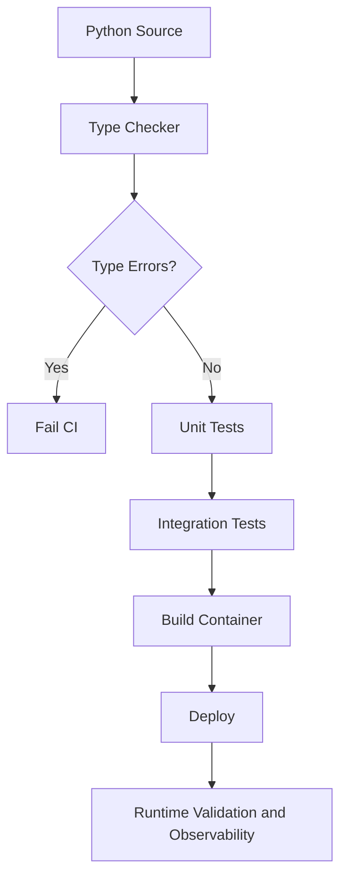

# 14- Static Type Checking

## Overview

Python is dynamically typed at runtime, but modern Python supports a sophisticated **static type system** that can detect many classes of defects before code executes.

Static type checking analyzes Python source code without running the application and verifies whether operations are consistent with declared or inferred types.

Common tools include:

- **mypy**
- **Pyright**
- IDE type analysis
- Ruff's type-related checks where applicable
- CI/CD type-checking pipelines

The overall model is:

```text
Python source code
        │
        ▼
Type annotations + inferred types
        │
        ▼
Static type checker
        │
        ├── Valid
        │
        └── Type errors
                │
                ▼
          Developer fixes code
```

Static type checking does not change Python's runtime semantics. It provides an additional correctness layer around dynamically executed code.

For backend systems, the value is significant because large applications contain many boundaries:

```text
HTTP
 │
 ▼
API layer
 │
 ▼
Service layer
 │
 ▼
Repository
 │
 ▼
PostgreSQL
```

Types help maintain contracts across those boundaries.

---

## Why Static Type Checking Matters

Dynamic typing provides flexibility, but large systems can accumulate implicit assumptions.

Consider:

```python
def calculate_total(price, quantity):
    return price * quantity
```

Nothing prevents:

```python
calculate_total("100", "5")
```

from being called.

With annotations:

```python
def calculate_total(
    price: float,
    quantity: int,
) -> float:
    return price * quantity
```

a static checker can detect incorrect callers before deployment.

The value becomes greater as codebases grow because types provide machine-checkable contracts between components.

Static checking helps detect:

- incorrect argument types
- invalid return values
- missing attributes
- incompatible assignments
- unreachable code
- incorrect generic usage
- invalid overloads
- protocol mismatches
- missing union handling
- incorrect optional handling
- incompatible overrides
- unsafe use of `Any`

---

## Static Typing vs Runtime Typing

These are different mechanisms.

| Aspect | Static type checking | Runtime typing |
|---|---|---|
| Execution time | Before execution | During execution |
| Primary purpose | Detect programming errors | Control runtime behavior |
| Tool | mypy, Pyright | Python interpreter |
| Changes runtime behavior | No | Sometimes |
| Validates external input | No | Yes, with validation |
| IDE support | Yes | Limited |
| Prevents all runtime errors | No | No |
| Requires annotations | Usually benefits heavily | No |

For example:

```python
def get_user(user_id: int) -> User:
    ...
```

does not prevent this at runtime:

```python
get_user("abc")
```

Static checking may reject the call, but Python itself does not enforce the annotation.

---

## The Python Type-Checking Model

A practical mental model is:

```text
                Python Program
                      │
          ┌───────────┴───────────┐
          ▼                       ▼
    Static analysis          Runtime execution
          │                       │
          ▼                       ▼
  Type correctness          Actual objects
          │                       │
          ▼                       ▼
   mypy / Pyright             CPython
```

These systems complement each other.

A production application needs both:

```text
Static correctness
       +
Runtime correctness
       +
Tests
       +
Operational safeguards
```

---

## Type Annotations

Annotations provide information to the type checker.

```python
def create_user(
    email: str,
    age: int,
) -> User:
    ...
```

They communicate:

```text
email → str
age   → int
return → User
```

Annotations also improve:

- IDE autocomplete
- code navigation
- refactoring
- API documentation
- code review
- maintainability

However, annotations are not runtime validation.

---

## Type Inference

Static checkers can infer many types without explicit annotations.

```python
name = "alice"
count = 10
enabled = True
```

A checker can infer:

```text
name    → str
count   → int
enabled → bool
```

Similarly:

```python
users = get_users()

for user in users:
    user.email
```

If `get_users()` is correctly typed, the checker can infer the type of `user`.

Good type systems do not require every local variable to be explicitly annotated.

---

## Explicit vs Inferred Types

Prefer annotations at important boundaries:

```python
def create_order(
    request: CreateOrderRequest,
) -> Order:
    ...
```

Avoid unnecessary annotations:

```python
user_count: int = 0
```

when inference already makes the type obvious.

A practical guideline:

```text
Public API / boundary → annotate
Complex inference      → annotate
Local obvious value    → infer
Dynamic boundary       → annotate and validate
```

---

## Type Checking Workflow

A typical development workflow is:

```text
Write code
   │
   ▼
Run formatter/linter
   │
   ▼
Run static type checker
   │
   ▼
Run unit tests
   │
   ▼
Run integration tests
   │
   ▼
Build application
```

Static checking should happen early because type errors are usually cheaper to fix before runtime testing.

---

## mypy

[mypy](https://mypy.readthedocs.io/) is a widely used static type checker for Python.

Install:

```bash
python -m pip install mypy
```

Run:

```bash
mypy .
```

A more production-oriented configuration might use:

```bash
mypy src tests
```

The exact command depends on the repository layout.

---

## Pyright

[Pyright](https://microsoft.github.io/pyright/) is another major Python type checker.

Install:

```bash
python -m pip install pyright
```

Run:

```bash
pyright
```

Pyright is also the type-analysis engine behind Microsoft's Pylance extension for VS Code.

---

## mypy vs Pyright

Both support modern Python typing, but their behavior and configuration differ.

| Area | mypy | Pyright |
|---|---|---|
| Static type checking | Yes | Yes |
| Python support | Strong | Strong |
| IDE integration | Strong | Strong |
| Configuration | `pyproject.toml`, `mypy.ini`, etc. | `pyproject.toml`, `pyrightconfig.json` |
| Strict mode | Yes | Yes |
| Speed | Good | Often very fast |
| Ecosystem maturity | Very high | Very high |
| Best choice | Project-dependent | Project-dependent |

Do not run multiple type checkers simply because more tools appear safer.

Different inference rules can create unnecessary friction.

Choose one primary checker and standardize it across the repository unless there is a strong reason to use another.

---

## Strict Type Checking

A type checker can operate at different strictness levels.

Loose checking:

```text
More permissive
    ↓
More code accepted
    ↓
More unknown behavior
```

Strict checking:

```text
More constraints
    ↓
More type errors during development
    ↓
Stronger contracts
```

For production backend systems, progressively stricter typing is usually preferable.

Do not necessarily enable every strict rule on day one for a large legacy system.

---

## mypy Strict Mode

A common mypy configuration is:

```toml
[tool.mypy]
python_version = "3.12"
strict = true
```

Strict mode enables multiple checks, including stricter handling of:

- missing annotations
- implicit `Any`
- untyped definitions
- unsafe operations
- redundant casts
- incomplete typing

Teams may enable strictness incrementally rather than migrating an entire legacy repository at once.

---

## Pyright Strict Mode

A `pyrightconfig.json` can specify strict analysis:

```json
{
  "include": ["src", "tests"],
  "typeCheckingMode": "strict"
}
```

Strict mode increases the number of errors reported.

The important engineering goal is not the word `strict`.

The goal is:

> Establish a predictable and enforceable type-quality standard.

---

## Type Checking Configuration

A production repository should centralize configuration.

For example:

```text
project/
├── pyproject.toml
├── src/
├── tests/
└── ...
```

Example:

```toml
[tool.mypy]
python_version = "3.12"
strict = true
files = ["src", "tests"]
exclude = ["^build/", "^dist/"]
```

Keep configuration version-controlled so local development and CI use the same rules.

---

## Python Version Matters

Type-checking behavior depends on the target Python version.

For modern Python:

```python
def find_user(user_id: int) -> User | None:
    ...
```

is preferred over older syntax:

```python
from typing import Optional


def find_user(user_id: int) -> Optional[User]:
    ...
```

Modern type parameter syntax is also available in Python 3.12+:

```python
def first[T](items: list[T]) -> T:
    return items[0]
```

Configure the checker to match the actual supported Python runtime.

Do not configure Python 3.12 typing semantics while deploying Python 3.10.

---

## `Any`

`Any` is one of the most important concepts in static type checking.

```python
from typing import Any

value: Any = external_library()
```

`Any` effectively tells the type checker:

> Permit operations on this value without requiring normal type guarantees.

For example:

```python
value: Any = "hello"

value.missing_method()
value + 123
value.not_a_real_attribute
```

Static checking may not protect these operations.

Excessive `Any` usage can therefore make a typed codebase appear safer than it actually is.

---

## `Any` Leakage

One of the most common problems in typed Python systems is `Any` spreading through the application.

```text
Untyped boundary
      │
      ▼
    Any
      │
      ▼
Service layer
      │
      ▼
Repository
      │
      ▼
Large portion of application becomes weakly typed
```

For example:

```python
def load_data() -> Any:
    ...
```

followed by:

```python
data = load_data()
```

can cause downstream operations to lose type safety.

Prefer to convert dynamic values into precise types at the boundary.

---

## `object` vs `Any`

`object` is safer for unknown runtime values.

```python
value: object
```

The checker does not allow arbitrary operations:

```python
value.upper()
```

because `object` does not guarantee an `upper()` method.

You must narrow:

```python
if isinstance(value, str):
    value.upper()
```

This makes:

```text
Any
→ trust everything

object
→ trust nothing until narrowed
```

For unknown values, prefer `object` when practical.

---

## `cast()`

`cast()` tells the type checker to treat a value as another type.

```python
from typing import cast

user = cast(User, value)
```

It does not validate the value.

Therefore:

```python
cast(User, untrusted_data)
```

does not make the data a valid `User`.

Use `cast()` when a real runtime invariant exists but the checker cannot infer it.

Avoid using `cast()` to silence errors.

---

## Type Narrowing

Static checkers can narrow types based on control flow.

```python
def process(value: str | int) -> str:
    if isinstance(value, str):
        return value.upper()

    return str(value)
```

The checker understands:

```text
Before:
str | int

True branch:
str

False branch:
int
```

Custom predicates can use `TypeGuard` or `TypeIs` where appropriate.

---

## Optional Values

A common backend pattern is:

```python
def find_user(user_id: int) -> User | None:
    ...
```

The caller must handle the possibility of `None`:

```python
user = find_user(user_id)

if user is None:
    raise UserNotFoundError(user_id)

return user.email
```

A strict type checker helps prevent accidental:

```python
user.email
```

when `user` could be `None`.

---

## Generics

Generics express relationships between types.

```python
def first[T](items: list[T]) -> T:
    return items[0]
```

This preserves type information:

```python
names = first(["alice", "bob"])
```

produces:

```text
str
```

while:

```python
ids = first([1, 2, 3])
```

produces:

```text
int
```

Generics are particularly useful for:

- repositories
- pagination
- caches
- response wrappers
- collections
- middleware
- reusable infrastructure

---

## Protocols

Protocols provide structural typing.

```python
from typing import Protocol


class UserRepository(Protocol):
    def get(self, user_id: int) -> User | None:
        ...
```

Any class implementing a compatible interface can satisfy the protocol without inheriting from it.

This is useful for dependency injection:

```text
Service
   │
   ▼
UserRepository protocol
   │
   ├── PostgreSQL implementation
   ├── In-memory implementation
   └── Test fake
```

Static checking verifies compatibility.

---

## TypedDict

`TypedDict` describes dictionary structure:

```python
class UserPayload(TypedDict):
    id: int
    email: str
```

This helps static analysis understand dictionary keys.

However:

```python
payload: UserPayload
```

does not perform runtime validation.

For external JSON:

```text
JSON
 ↓
Runtime validation
 ↓
Typed model
```

is safer than assuming the incoming dictionary satisfies `TypedDict`.

---

## Type Guards

A custom runtime predicate can communicate narrowing:

```python
from typing import TypeGuard


def is_user(value: object) -> TypeGuard[User]:
    return isinstance(value, User)
```

Then:

```python
value: object = get_value()

if is_user(value):
    value.send_email()
```

Type guards are particularly useful for reusable structural predicates.

---

## Overloads

Overloads describe multiple static signatures for one runtime implementation.

```python
from typing import Literal, overload


@overload
def fetch(
    resource: Literal["user"],
) -> User:
    ...


@overload
def fetch(
    resource: Literal["order"],
) -> Order:
    ...


def fetch(
    resource: Literal["user", "order"],
) -> User | Order:
    ...
```

This allows the checker to infer different return types from different arguments.

Overloads are valuable for library APIs and typed infrastructure wrappers.

---

## Callable and ParamSpec

Higher-order functions need careful typing.

For example:

```python
from collections.abc import Callable
from typing import ParamSpec, TypeVar


P = ParamSpec("P")
R = TypeVar("R")


def log_calls(
    function: Callable[P, R],
) -> Callable[P, R]:
    ...
```

`ParamSpec` preserves the parameter structure of the wrapped callable.

This is especially important for decorators because a simple:

```python
Callable[..., Any]
```

would discard useful information.

---

## `Self`

`Self` is useful when a method returns an instance of the current class or subtype.

```python
from typing import Self


class Query:
    def filter(self, **conditions: object) -> Self:
        ...
        return self
```

Subclasses can preserve their own type.

This is often clearer than manually defining a bound `TypeVar`.

---

## Static Checking at Backend Boundaries

The highest-value locations for type checking are boundaries between components.

For example:

```text
HTTP Request
     │
     ▼
Pydantic model
     │
     ▼
Typed service API
     │
     ▼
Repository protocol
     │
     ▼
Database implementation
```

Each boundary should have an explicit contract.

Static checking then verifies the connections between those contracts.

---

## FastAPI

FastAPI benefits heavily from type annotations.

```python
from fastapi import FastAPI


app = FastAPI()


@app.get("/users/{user_id}", response_model=UserResponse)
def get_user(user_id: int) -> UserResponse:
    ...
```

Types help with:

- route parameter declarations
- dependency injection
- request models
- response models
- IDE support
- internal service contracts

FastAPI's runtime validation and Python's static typing complement each other.

---

## Django

Django is historically dynamic, but modern Django applications can be strongly typed.

Useful areas include:

- service functions
- repositories
- serializers
- forms
- model helpers
- management commands
- task functions
- domain models

For dynamically typed framework APIs, use explicit adapters or stubs where appropriate rather than allowing `Any` to spread through the application.

---

## REST APIs

Static types help model local request and response contracts:

```python
class CreateUserRequest(BaseModel):
    email: str
    name: str


class UserResponse(BaseModel):
    id: int
    email: str
    name: str
```

The flow becomes:

```text
JSON
 │
 ▼
Runtime validation
 │
 ▼
CreateUserRequest
 │
 ▼
Service
 │
 ▼
User
 │
 ▼
UserResponse
 │
 ▼
JSON
```

Static checking verifies the Python-side relationships.

OpenAPI remains the external API contract.

---

## gRPC

gRPC and protobuf already provide explicit schemas.

Generated Python types can be combined with static checking to verify application code around generated clients and servers.

The architecture is:

```text
.proto schema
     │
     ▼
Code generation
     │
     ▼
Typed Python client/server
     │
     ▼
Static analysis
```

Do not treat Python annotations as a replacement for protobuf definitions.

---

## PostgreSQL

Repository interfaces can expose precise contracts:

```python
class UserRepository(Protocol):
    def get_by_id(
        self,
        user_id: int,
    ) -> User | None:
        ...

    def save(self, user: User) -> User:
        ...
```

Static checking catches mismatches between:

- service expectations
- repository implementations
- mocks
- fakes
- test fixtures

Database constraints remain runtime guarantees.

---

## Redis

Typed wrappers can prevent inconsistent cache representations.

```python
class UserCache(Protocol):
    def get(self, user_id: int) -> User | None:
        ...

    def set(self, user: User, ttl_seconds: int) -> None:
        ...
```

The actual Redis value is still serialized data.

Static types do not guarantee that an old cache entry has the expected schema.

Cache deserialization and schema-version handling remain runtime responsibilities.

---

## Kafka

Kafka messages are another dynamic boundary.

A useful pipeline is:

```text
Kafka bytes
    │
    ▼
Deserializer
    │
    ▼
Schema validation
    │
    ▼
Typed event
    │
    ▼
Business handler
```

Static checking helps after the event has been converted into a known Python representation.

It does not validate arbitrary Kafka bytes.

---

## Celery

Background tasks should have explicit input and output types:

```python
@app.task
def generate_report(
    report_id: int,
) -> str:
    ...
```

Types help identify mismatches between:

- task callers
- task implementations
- result consumers
- test code

Celery serialization still occurs at runtime, so task payload compatibility must be managed separately.

---

## Docker and Kubernetes

Static type checking should happen before container construction.

A typical CI pipeline:

```text
Commit
  │
  ▼
Lint
  │
  ▼
Type Check
  │
  ▼
Unit Tests
  │
  ▼
Build Docker Image
  │
  ▼
Integration Tests
  │
  ▼
Deploy
  │
  ▼
Kubernetes
```

There is little value in discovering an obvious type error after producing and publishing a production container image.

---

## CI/CD Integration

Example GitHub Actions workflow:

```yaml
name: Python CI

on:
  pull_request:
  push:

jobs:
  quality:
    runs-on: ubuntu-latest

    steps:
      - uses: actions/checkout@v4

      - uses: actions/setup-python@v5
        with:
          python-version: "3.12"

      - run: python -m pip install -e ".[dev]"
      - run: ruff check .
      - run: mypy src tests
      - run: pytest
```

The exact tooling can differ, but static analysis should be a required CI gate for typed production code.

---

## Gradual Typing

Existing Python applications are often partially typed.

Do not assume a large legacy system can be converted instantly.

A practical migration strategy is:

```text
Untyped codebase
      │
      ▼
Type critical boundaries
      │
      ▼
Type core services
      │
      ▼
Type repositories/adapters
      │
      ▼
Reduce Any
      │
      ▼
Increase strictness
```

Start with high-value modules rather than attempting a massive rewrite.

---

## Migration Strategy for Legacy Systems

Useful steps include:

1. Choose a primary type checker.
2. Configure the supported Python version.
3. Establish baseline metrics.
4. Type new code first.
5. Type public interfaces.
6. Replace implicit `Any`.
7. Type infrastructure boundaries.
8. Gradually enable stricter rules.
9. Prevent newly introduced errors.
10. Reduce the existing error budget over time.

The key principle is:

> Do not allow the migration itself to become an excuse for stopping delivery.

---

## Error Budgets for Typing

A legacy codebase may contain thousands of type errors.

Instead of requiring zero errors immediately:

```text
Current baseline
      │
      ▼
Freeze existing errors
      │
      ▼
No new errors allowed
      │
      ▼
Reduce baseline incrementally
```

This allows teams to improve type coverage without blocking unrelated product work.

---

## Type Checking and Tests

Static checking and tests catch different problems.

| Problem | Static checking | Tests |
|---|---:|---:|
| Wrong argument type | Yes | Sometimes |
| Wrong return annotation | Yes | Sometimes |
| Missing runtime validation | No | Yes |
| Business logic bug | Usually no | Yes |
| SQL query failure | No | Yes |
| Incorrect API response | Partially | Yes |
| Impossible attribute access | Yes | Sometimes |
| Race condition | No | Sometimes |
| Authentication bug | No | Yes |
| Schema mismatch | Partially | Yes |

Neither replaces the other.

---

## Type Checking and Property-Based Testing

For complex generic utilities or data transformations, property-based tests can complement static checking.

For example:

```text
Static checking
    → contract relationships

Property-based testing
    → behavioral invariants
```

This is particularly useful for:

- parsers
- serializers
- collection utilities
- protocol adapters
- normalization logic

---

## Type Checking and Code Review

Types should reduce the amount of reasoning required during code review.

For example:

```python
def create_order(
    request: CreateOrderRequest,
    repository: OrderRepository,
) -> Order:
    ...
```

A reviewer can immediately see:

```text
input → request model
dependency → repository interface
output → domain Order
```

This makes architectural boundaries more explicit.

Types should clarify design, not merely satisfy a checker.

---

## Type Checking and Refactoring

One of the strongest benefits of static typing is safe refactoring.

Suppose:

```python
def get_user(id: int) -> User:
    ...
```

changes to:

```python
def get_user(id: UserId) -> User:
    ...
```

The type checker can identify callers that need updates.

This is particularly valuable in:

- monorepos
- large backend services
- shared libraries
- domain-heavy applications
- microservice infrastructure

---

## Type Checking and Dependency Injection

Protocols combined with static checking provide strong dependency contracts.

```python
class PaymentGateway(Protocol):
    def charge(
        self,
        customer_id: str,
        amount_cents: int,
    ) -> PaymentResult:
        ...
```

A service can depend on:

```python
PaymentGateway
```

instead of a concrete Stripe-like implementation.

Static checking verifies that:

- production adapters
- test fakes
- mocks
- alternate providers

satisfy the expected interface.

---

## Type Checking and Architecture

A senior-level use of typing is architectural rather than merely syntactic.

Types can encode:

- domain boundaries
- dependency direction
- data ownership
- API contracts
- repository interfaces
- event structures
- state transitions

For example:

```text
API DTO
  │
  ▼
Application command
  │
  ▼
Domain object
  │
  ▼
Repository protocol
  │
  ▼
Infrastructure implementation
```

Strong types make invalid layer interactions easier to detect.

---

## Type Checking and Dependency Direction

Suppose domain code imports infrastructure directly:

```text
domain → PostgreSQL repository
```

This creates architectural coupling.

A protocol can reverse the dependency:

```text
domain
  │
  ▼
Repository Protocol
  ▲
  │
PostgreSQL implementation
```

Static checking verifies that the implementation satisfies the abstraction.

This makes typing useful as an architectural enforcement mechanism.

---

## Static Analysis and Performance

Static type checking generally does not affect application runtime performance.

The checker runs separately from the application.

However, static analysis has development-time costs:

- CPU
- memory
- CI duration
- IDE analysis time

Large monorepos can require optimization through:

- incremental checking
- module boundaries
- excluding generated files
- avoiding unnecessary plugin complexity
- caching
- parallel CI jobs

Do not sacrifice type quality solely to optimize modest CI overhead.

---

## Type Checking and Generated Code

Generated files can produce large analysis workloads.

Examples include:

- protobuf-generated Python
- OpenAPI-generated clients
- ORM-generated code
- SDK code

Where appropriate:

```text
Generated code
    │
    ├── use supplied type information
    │
    └── exclude implementation internals from checking
```

Do not blindly exclude generated code if application correctness depends on its public types.

---

## Type Checking and Third-Party Libraries

A dependency may provide:

- inline type annotations
- `.pyi` stubs
- incomplete annotations
- incorrect annotations
- no useful typing

When a dependency is poorly typed, isolate it:

```text
Application
    │
    ▼
Typed adapter
    │
    ▼
Third-party library
```

This prevents dynamic typing from contaminating the application.

---

## Type Stubs

A `.pyi` file describes an interface without the implementation.

Example:

```python
def calculate_total(
    amount: Decimal,
    tax_rate: Decimal,
) -> Decimal:
    ...
```

Stubs are useful for:

- third-party packages
- C extensions
- generated interfaces
- libraries whose runtime code is difficult to annotate directly

Static checkers can use stubs to understand APIs that Python itself cannot inspect as strongly.

---

## Type Checking Dynamic Python

Python allows dynamic behavior such as:

```python
setattr(obj, name, value)
getattr(obj, name)
```

and:

```python
__getattr__
__getattribute__
```

Highly dynamic code is harder to type precisely.

This does not mean dynamic features are forbidden.

Instead:

```text
Dynamic infrastructure
        │
        ▼
Typed adapter
        │
        ▼
Typed application
```

Use explicit boundaries around highly dynamic behavior.

---

## Static Checking and Reflection

Reflection can weaken static analysis:

```python
attribute = getattr(obj, name)
```

The checker cannot always know which attribute exists.

Prefer explicit interfaces when practical:

```python
class Handler(Protocol):
    def handle(self, event: Event) -> None:
        ...
```

Then:

```python
handler.handle(event)
```

provides stronger static guarantees.

---

## Static Checking and Monkey Patching

Monkey patching makes type analysis difficult:

```python
SomeClass.new_method = dynamic_function
```

The runtime may accept this, but static analyzers may not understand the modified interface.

Prefer:

- composition
- subclassing
- protocols
- explicit adapters
- dependency injection

for maintainable production systems.

---

## Security Considerations

Static types are not a security boundary.

Never assume:

```python
user_id: int
```

means the caller is authorized to access that user.

Security still requires runtime controls:

```text
Authentication
      ↓
Authorization
      ↓
Input validation
      ↓
Business logic
      ↓
Database constraints
```

Static typing can reduce implementation mistakes but cannot establish trust.

---

## Reliability Considerations

Static checking improves reliability by catching classes of defects before deployment.

It is especially useful for:

- refactoring
- interface changes
- dependency replacement
- API client changes
- repository changes
- event model changes
- configuration changes

It is not sufficient for:

- network failures
- database outages
- timeouts
- race conditions
- incorrect business requirements
- corrupted external data

Use static checking as one layer in a defense-in-depth reliability strategy.

---

## Observability

Static typing does not directly provide runtime observability.

You still need:

- structured logging
- metrics
- distributed tracing
- health checks
- error tracking
- alerting

However, stronger types can improve observability code by making event and metadata structures explicit.

For example:

```python
class RequestContext(TypedDict):
    request_id: str
    user_id: str | None
    route: str
```

This reduces accidental inconsistencies in application metadata.

---

## High Availability

Static type checking has an indirect HA benefit.

It reduces certain deployment defects before they reach production.

A safe delivery pipeline is:

```text
Code
 │
 ├── Static analysis
 ├── Unit tests
 ├── Integration tests
 ├── Container build
 └── Deployment validation
          │
          ▼
       Production
```

For highly available systems, combine this with:

- rolling deployments
- health checks
- readiness probes
- automated rollback
- canary deployments
- database migration safety

Typing is one preventive control, not an HA mechanism.

---

## AWS Considerations

In AWS-backed systems, static checking can be integrated before deployment to:

- ECS
- EKS
- Lambda
- AWS Batch
- containerized workers
- CI/CD pipelines

For example:

```text
Git push
   │
   ▼
CI
   │
   ├── Type checking
   ├── Tests
   └── Security scans
          │
          ▼
      Build image
          │
          ▼
      ECR
          │
          ▼
       ECS/EKS
```

AWS runtime services still require normal validation, security, observability, and operational controls.

---

## Cost Considerations

Static checking adds some CI and developer-machine cost.

For most backend applications, this cost is small compared with:

- failed deployments
- production incidents
- debugging time
- regression testing
- long-term maintenance

For large repositories, optimize the checker rather than disabling important validation.

Use:

- incremental checking
- caching
- targeted package checking
- generated-code exclusions where justified
- parallel CI stages

---

## Common Mistakes

### Treating Annotations as Runtime Validation

```python
def create_user(email: str) -> User:
    ...
```

does not validate incoming HTTP JSON.

Use runtime validation separately.

### Overusing `Any`

`Any` removes valuable static guarantees.

### Using `cast()` to Silence Errors

If the code needs `cast()` everywhere, the type model is probably incomplete.

### Annotating Everything Manually

Excessive annotations make code noisy when inference is already obvious.

### Ignoring Third-Party Boundaries

A poorly typed dependency can introduce `Any` throughout the application.

### Running the Type Checker Only Locally

A type system is most useful when enforced consistently in CI.

### Mixing Type Checkers Without a Reason

Different checkers can produce conflicting results and developer friction.

### Ignoring the Runtime Python Version

Type syntax and checker behavior depend on the target Python version.

### Assuming TypedDict Validates Data

`TypedDict` is primarily static typing information.

### Confusing Static Correctness With Business Correctness

A program can be perfectly typed and still implement the wrong business rule.

---

## Production Pitfalls

### Type Debt

A repository may contain:

```python
Any
cast(...)
# type: ignore
```

everywhere.

These are signals of incomplete type modeling.

Track and reduce them deliberately.

### Blanket Ignore Rules

Avoid:

```python
# type: ignore
```

without documenting why it is necessary.

Prefer targeted ignores when unavoidable.

For example:

```python
# type: ignore[assignment]  # Third-party stub is incorrect.
```

### False Confidence

A clean type-checking run does not mean the application is production-safe.

### Overengineering Types

Extremely complex type expressions can be harder to maintain than the code they describe.

Prefer understandable contracts.

### Framework Fighting

Do not spend disproportionate effort forcing every dynamic framework behavior into an elaborate static model.

Isolate dynamic areas instead.

---

## `# type: ignore`

Sometimes a checker cannot correctly model valid runtime behavior.

A targeted suppression can be appropriate:

```python
value = third_party_function()  # type: ignore[no-untyped-call]
```

Use ignores carefully.

Good:

```text
specific error code
+
reason
+
small scope
```

Bad:

```python
# type: ignore
```

across large sections of code.

Track suppressions as technical debt.

---

## Suppression Strategy

A mature project can enforce:

```text
No unreviewed ignores
No new broad ignores
No unexplained casts
No new Any at core boundaries
```

This keeps the type system from gradually degrading.

---

## Type Checking Policy

A production team can establish rules such as:

| Policy | Recommendation |
|---|---|
| New production code | Typed |
| Public functions | Explicit annotations |
| `Any` | Minimize |
| `cast()` | Justified |
| `type: ignore` | Targeted and reviewed |
| CI type checking | Required |
| External input | Runtime validated |
| Protocols | Preferred for abstractions |
| Generated code | Controlled |
| Python version | Explicitly configured |

The exact policy should match project maturity.

---

## Senior-Level Type System Strategy

At senior engineering level, the objective is not:

> Annotate every line.

The objective is:

> Make important system contracts explicit and mechanically verifiable.

Focus typing effort on:

```text
External boundaries
       ↓
Domain models
       ↓
Service interfaces
       ↓
Repository protocols
       ↓
Infrastructure adapters
       ↓
Shared libraries
```

Local implementation details can often rely on inference.

This produces a strong type system without unnecessary annotation noise.

---

## Type Checking Architecture

A mature backend repository can use:



The important point is that static analysis is an early quality gate rather than a replacement for runtime testing.

---

## Recommended Type Checking Workflow

For a new Python backend:

1. Define the supported Python version.
2. Choose mypy or Pyright as the primary checker.
3. Configure it in version control.
4. Type public functions and important boundaries.
5. Use generics, protocols, `TypedDict`, type guards, and overloads where they provide real value.
6. Minimize `Any`.
7. Keep runtime validation separate.
8. Run the checker locally during development.
9. Make type checking mandatory in CI.
10. Increase strictness as the codebase matures.

---

## Decision Guide

| Problem | Preferred solution |
|---|---|
| Simple local type | Type inference |
| Public function contract | Type annotation |
| Unknown runtime value | `object` + narrowing |
| Dynamic external payload | Runtime validation |
| Dictionary structure | `TypedDict` |
| Reusable generic relationship | `TypeVar` / generics |
| Behavioral abstraction | `Protocol` |
| Runtime narrowing predicate | `TypeGuard` / `TypeIs` |
| Multiple static signatures | `@overload` |
| Callable parameter preservation | `ParamSpec` |
| Subclass-preserving return | `Self` |
| Trusted but invisible invariant | `cast()` |
| Dynamic third-party API | Typed adapter |
| Distributed service contract | OpenAPI / protobuf / schema |
| Type quality enforcement | CI type checking |

---

## Interview Traps

### Is Python statically typed?

Python is dynamically typed at runtime but supports optional static typing through annotations and external type checkers.

### Does Python enforce annotations at runtime?

No. Standard Python does not automatically enforce ordinary type annotations.

### What does mypy do?

It statically analyzes Python code and reports type inconsistencies without executing the application.

### What does Pyright do?

It is another static type checker that analyzes Python type annotations and inferred types.

### Are mypy and Pyright interchangeable?

They solve the same broad problem but can differ in inference, diagnostics, configuration, and supported behavior. A project should generally standardize on one primary checker.

### What is `Any`?

`Any` disables many static type checks for a value and allows it to participate in operations without normal type verification.

### Why is `object` safer than `Any`?

`object` permits only operations guaranteed by the `object` interface until the value is narrowed.

### Does static typing improve runtime performance?

Normally no. Static analysis happens outside normal application execution.

### Does static typing validate JSON?

No. JSON must be parsed and validated at runtime.

### Can static typing prevent all bugs?

No. It catches classes of type-related defects but cannot prove business correctness or operational reliability.

### Why use Protocol?

Protocols provide structural typing and allow abstractions based on behavior rather than inheritance.

### Why use TypeGuard?

TypeGuard connects a runtime predicate with static narrowing.

### Why use overloads?

Overloads describe multiple call signatures when different argument combinations produce different static return types.

### Why use generics?

Generics preserve relationships between input and output types without enumerating concrete types.

### What is gradual typing?

Gradual typing allows typed and dynamically typed Python code to coexist and enables incremental adoption.

### Should every variable be annotated?

No. Good static typing uses inference where the type is obvious and explicit annotations at meaningful boundaries.

### Can a fully typed Python application still fail?

Yes. Network failures, database failures, invalid external data, business logic errors, race conditions, configuration mistakes, and security vulnerabilities remain runtime concerns.

---

## Production Checklist

Before adopting or strengthening static type checking, verify:

- The supported Python version is explicitly configured.
- One primary type checker is selected.
- Type-checking configuration is committed to version control.
- New production code follows the project's typing standard.
- Public functions have explicit parameter and return annotations.
- Important service and repository boundaries are typed.
- `Any` is minimized and justified where necessary.
- Dynamic values use `object` and narrowing where practical.
- `cast()` is used only for real, trusted invariants.
- `type: ignore` is targeted and documented.
- External JSON, Kafka, Redis, database, and HTTP data is runtime validated where required.
- `TypedDict` is not mistaken for runtime validation.
- Protocols are used where behavioral abstractions improve architecture.
- Generics are used where they express reusable type relationships.
- Type guards are used for meaningful runtime narrowing.
- Overloads are used only when distinct call signatures provide real value.
- `ParamSpec` is used for decorators and higher-order callable APIs where needed.
- Static analysis runs in CI.
- Type errors fail the appropriate CI stage.
- Runtime tests remain mandatory.
- Integration tests remain mandatory.
- Security testing is independent of static typing.
- Generated and third-party code is handled deliberately.
- Type-checking performance is monitored for large repositories.
- Type debt such as `Any`, casts, and ignores is tracked.
- Migration from legacy code is incremental rather than blocking all development.
- Type complexity is reviewed for maintainability.
- Static types are treated as engineering contracts, not runtime security boundaries.

## Key Takeaways

- Python remains dynamically typed at runtime, while tools such as mypy and Pyright provide a separate static analysis layer that catches many type-related defects before deployment.
- The highest-value typing is at system boundaries: API models, service interfaces, repositories, event contracts, adapters, and shared libraries; local code should use inference when the type is obvious.
- `Any` weakens type safety, `cast()` does not perform runtime validation, and `TypedDict` does not validate external data; runtime validation and static checking solve different problems.
- Static type checking should complement tests, security controls, runtime validation, and observability rather than attempting to replace them.
- A mature Python codebase treats type checking as an architectural quality gate: consistent configuration, CI enforcement, controlled type debt, explicit contracts, and incremental increases in strictness.