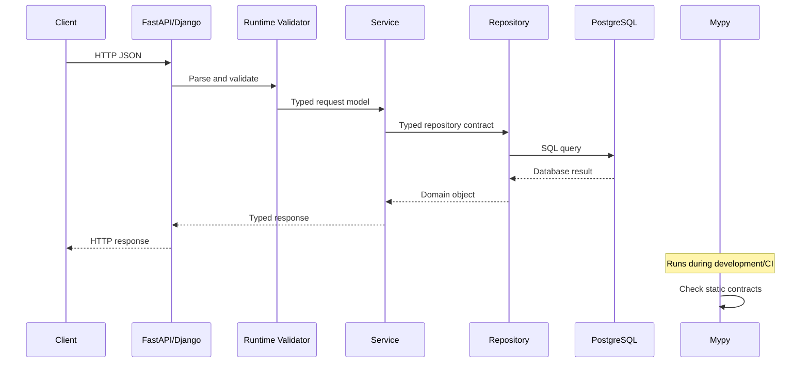

# 15- Mypy

## Overview

[mypy](https://mypy.readthedocs.io/) is a static type checker for Python. It analyzes source code, annotations, inferred types, imports, and control flow to identify type inconsistencies before the application runs.

Python remains dynamically typed at runtime. mypy does not change that runtime behavior; it adds a separate verification layer during development and CI.

For backend engineering, mypy is valuable because type errors frequently occur at boundaries between layers:

```text
HTTP Request
     │
     ▼
API / DTO
     │
     ▼
Service
     │
     ▼
Repository
     │
     ▼
PostgreSQL
```

A well-configured mypy setup turns many implicit assumptions into machine-checkable contracts.

Typical benefits include:

- Detecting incorrect function arguments.
- Detecting incompatible return values.
- Detecting invalid attribute access.
- Detecting unsafe optional handling.
- Detecting incorrect generic usage.
- Verifying protocol implementations.
- Supporting safer refactoring.
- Improving IDE navigation and autocomplete.
- Making architectural contracts more explicit.

mypy is most effective when treated as part of the engineering toolchain rather than as a standalone developer convenience.

---

## What Mypy Does

Consider:

```python
def calculate_total(
    price: float,
    quantity: int,
) -> float:
    return price * quantity
```

An incorrect caller:

```python
calculate_total("100", "5")
```

can be detected statically.

A simplified workflow is:

```text
Python source
     │
     ▼
Parse source
     │
     ▼
Collect annotations
     │
     ▼
Infer types
     │
     ▼
Analyze expressions and control flow
     │
     ▼
Check function and object contracts
     │
     ▼
Report diagnostics
```

The program is not normally executed to discover these errors.

---

## What Mypy Does Not Do

mypy does not:

- Execute business logic.
- Validate HTTP requests at runtime.
- Validate JSON payloads.
- Verify database contents.
- Verify authentication.
- Verify authorization.
- Detect every business logic bug.
- Detect every concurrency bug.
- Replace unit tests.
- Replace integration tests.
- Guarantee runtime type correctness.

For example:

```python
def create_user(email: str) -> User:
    ...
```

does not cause Python to reject:

```python
create_user(123)
```

at runtime.

mypy can identify the incorrect call during static analysis, but runtime validation remains a separate concern.

---

## Installation

Install mypy as a development dependency:

```bash
python -m pip install mypy
```

For a project using `pyproject.toml`:

```bash
python -m pip install --group dev mypy
```

The exact dependency-management command depends on the project's package manager.

Common tools include:

- `pip`
- `uv`
- Poetry
- PDM
- Hatch

Pin the version through the project's dependency-management system so local and CI environments use a known version.

---

## Running Mypy

Check a source directory:

```bash
mypy src
```

Check source and tests:

```bash
mypy src tests
```

Check a specific module:

```bash
mypy src/orders/service.py
```

Display help:

```bash
mypy --help
```

A repository should normally expose a consistent project-level command rather than requiring every developer to remember custom flags.

---

## Basic Example

Given:

```python
def get_user_name(user_id: int) -> str:
    return 123
```

mypy can report that the returned `int` is incompatible with the declared `str` return type.

A corrected implementation:

```python
def get_user_name(user_id: int) -> str:
    return "alice"
```

The important point is that the checker evaluates the relationship between the declared contract and implementation.

---

## Type Inference

mypy can infer types without explicit annotations.

```python
name = "alice"
count = 10
enabled = True
```

mypy can infer:

```text
name    → str
count   → int
enabled → bool
```

Inference also works through expressions:

```python
users = ["alice", "bob"]

for user in users:
    print(user.upper())
```

mypy knows that `user` is a `str`.

Avoid adding annotations when they provide no additional information.

Prefer:

```python
users = load_users()
```

over unnecessarily repeating an obvious inferred type when the surrounding API already provides sufficient information.

---

## Explicit Annotations at Boundaries

Annotations are most valuable at interfaces.

```python
def create_order(
    request: CreateOrderRequest,
    repository: OrderRepository,
) -> Order:
    ...
```

This defines a useful contract:

```text
CreateOrderRequest
       │
       ▼
    Service
       │
       ├── OrderRepository
       │
       ▼
     Order
```

The implementation can still rely heavily on inference internally.

---

## Mypy Configuration

Mypy can be configured through `pyproject.toml`.

A practical starting point:

```toml
[tool.mypy]
python_version = "3.12"
files = ["src", "tests"]
```

A stricter configuration:

```toml
[tool.mypy]
python_version = "3.12"
files = ["src", "tests"]
strict = true
```

Centralizing configuration is important because otherwise developers may run different commands locally and obtain different results.

---

## Important Configuration Options

Common settings include:

| Option | Purpose |
|---|---|
| `python_version` | Target Python version |
| `files` | Default files/modules to check |
| `strict` | Enables a collection of strict checks |
| `exclude` | Excludes matching paths |
| `disallow_untyped_defs` | Requires annotations on function definitions |
| `disallow_any_generics` | Rejects generic types with implicit `Any` |
| `warn_return_any` | Warns when functions return `Any` |
| `check_untyped_defs` | Checks bodies of untyped functions |
| `no_implicit_optional` | Prevents implicit `Optional` behavior |
| `warn_unused_ignores` | Detects unnecessary ignore comments |
| `warn_redundant_casts` | Detects unnecessary casts |
| `ignore_missing_imports` | Controls missing third-party import handling |

Do not blindly enable or disable options. Configuration should reflect the quality standard of the repository.

---

## Strict Mode

Mypy provides a convenient strict mode:

```toml
[tool.mypy]
strict = true
```

Strict mode enables multiple checks designed to reduce unsafe typing.

It is particularly appropriate for:

- new services
- new libraries
- greenfield backend applications
- critical domain modules

Large legacy systems may require gradual adoption.

---

## Strict Mode vs Manual Configuration

`strict = true` is convenient, but teams sometimes configure individual rules explicitly.

For example:

```toml
[tool.mypy]
python_version = "3.12"
disallow_untyped_defs = true
disallow_any_generics = true
warn_return_any = true
warn_unused_ignores = true
warn_redundant_casts = true
no_implicit_optional = true
```

Explicit configuration can make organizational policy easier to understand.

The trade-off is maintenance: manual configuration requires teams to understand which rules are being enforced.

---

## `Any`

`Any` is one of the most important mypy concerns.

```python
from typing import Any

value: Any = load_dynamic_data()
```

Once a value becomes `Any`, mypy permits many operations that it would normally reject.

For example:

```python
value: Any = "hello"

value.not_a_real_method()
value.some_attribute
value + 123
```

This makes `Any` powerful but dangerous.

---

## Any Leakage

A single poorly typed boundary can weaken an entire call chain.

```text
Untyped dependency
       │
       ▼
      Any
       │
       ▼
Service layer
       │
       ▼
Repository layer
       │
       ▼
Large portion of application
```

For example:

```python
def load_configuration() -> Any:
    ...
```

can cause downstream values to lose type information.

Prefer a precise return type:

```python
def load_configuration() -> AppConfig:
    ...
```

or validate dynamic data before converting it into typed application objects.

---

## `object` vs `Any`

When the type is genuinely unknown, `object` is often safer.

```python
def process(value: object) -> None:
    ...
```

This prevents arbitrary operations:

```python
def process(value: object) -> None:
    value.upper()
```

mypy rejects the call because `object` does not guarantee an `upper()` method.

Narrow first:

```python
def process(value: object) -> None:
    if isinstance(value, str):
        print(value.upper())
```

The distinction is:

```text
Any
→ trust everything

object
→ trust nothing until proven
```

---

## Optional Values

Consider:

```python
def find_user(user_id: int) -> User | None:
    ...
```

mypy requires callers to account for `None`.

Correct:

```python
user = find_user(user_id)

if user is None:
    raise UserNotFoundError(user_id)

return user.email
```

Incorrect:

```python
user = find_user(user_id)

return user.email
```

Strict optional checking prevents a common source of runtime `AttributeError`.

---

## Type Narrowing

Mypy understands many control-flow-based narrowing operations.

```python
def normalize(value: str | int) -> str:
    if isinstance(value, str):
        return value.upper()

    return str(value)
```

The type changes conceptually:

```text
Initial:
str | int

After isinstance(value, str):
str

Else branch:
int
```

Mypy uses these narrowed types for subsequent analysis.

---

## `TypeGuard`

Custom predicates can communicate narrowing:

```python
from typing import TypeGuard


def is_user(value: object) -> TypeGuard[User]:
    return isinstance(value, User)
```

Then:

```python
value: object = load_value()

if is_user(value):
    value.send_email()
```

The predicate provides a static relationship between the runtime check and the narrowed type.

The predicate itself must still be logically correct. Mypy cannot prove that a custom `TypeGuard` implementation is truthful.

---

## `TypeIs`

Modern Python typing also includes `TypeIs` for predicates with stronger narrowing semantics.

```python
from typing import TypeIs


def is_string(value: object) -> TypeIs[str]:
    return isinstance(value, str)
```

`TypeIs` can express that the value is a subtype of the original type and provides more precise narrowing behavior than `TypeGuard` in situations where intersection-style narrowing is appropriate.

Use the construct that matches the semantics of the predicate rather than choosing based only on which syntax is newer.

---

## Generics

Mypy uses generics to preserve relationships between values.

Modern Python:

```python
def first[T](items: list[T]) -> T:
    return items[0]
```

This preserves the element type:

```python
names = first(["alice", "bob"])
numbers = first([1, 2, 3])
```

Conceptually:

```text
list[str] → str
list[int] → int
```

Generics are especially useful for:

- repositories
- pagination
- result wrappers
- caches
- reusable infrastructure
- collections
- adapters

---

## TypeVar

Traditional generic declarations can use `TypeVar`:

```python
from typing import TypeVar

T = TypeVar("T")


def first(items: list[T]) -> T:
    return items[0]
```

`TypeVar` describes a relationship between types.

It does not create a runtime wrapper around the object.

---

## Bounded TypeVars

A bound restricts a type variable to a type hierarchy while preserving the concrete subtype.

```python
from typing import TypeVar

T = TypeVar("T", bound=User)


def refresh(user: T) -> T:
    user.reload()
    return user
```

If a subclass is supplied, the relationship can be preserved.

Bounds are useful when generic code needs specific capabilities.

---

## Constrained TypeVars

A constrained type variable enumerates allowed alternatives:

```python
from typing import TypeVar

Number = TypeVar("Number", int, float)
```

This differs from a bound.

Use:

- **bounds** when types must satisfy a common interface or superclass.
- **constraints** when the generic relationship is intentionally restricted to a known set of types.

---

## Generic Classes

Mypy can type reusable classes:

```python
class Repository[T]:
    def __init__(self, items: list[T]) -> None:
        self.items = items

    def get(self, index: int) -> T:
        return self.items[index]
```

Usage:

```python
users = Repository[User]([])
orders = Repository[Order]([])
```

This allows one implementation to preserve domain-specific type information.

---

## Protocols

Mypy supports structural typing through `Protocol`.

```python
from typing import Protocol


class UserRepository(Protocol):
    def get(self, user_id: int) -> User | None:
        ...
```

A concrete implementation does not need to inherit from the protocol:

```python
class PostgresUserRepository:
    def get(self, user_id: int) -> User | None:
        ...
```

Mypy can verify compatibility when the implementation is used where `UserRepository` is expected.

---

## Protocol-Based Dependency Injection

A backend service can depend on a protocol:

```python
class UserService:
    def __init__(self, repository: UserRepository) -> None:
        self.repository = repository
```

Implementations can include:

```text
UserRepository
      │
      ├── PostgreSQL repository
      ├── In-memory repository
      └── Test fake
```

This provides a useful combination:

```text
Protocol
+
Dependency injection
+
Static checking
```

It avoids coupling the service directly to infrastructure.

---

## TypedDict

Mypy understands `TypedDict` structures:

```python
from typing import TypedDict


class UserPayload(TypedDict):
    id: int
    email: str
```

Then:

```python
def send_email(payload: UserPayload) -> None:
    print(payload["email"])
```

Mypy can detect invalid keys and incompatible values.

However, `TypedDict` does not validate arbitrary runtime dictionaries.

For external JSON:

```text
JSON
  │
  ▼
Parse
  │
  ▼
Runtime validation
  │
  ▼
Typed application object
```

---

## `Literal`

Mypy can use `Literal` to model finite values.

```python
from typing import Literal


def set_mode(
    mode: Literal["sync", "async"],
) -> None:
    ...
```

Invalid calls can be detected:

```python
set_mode("invalid")
```

`Literal` works particularly well with:

- state values
- feature modes
- protocol flags
- overloads
- configuration options
- discriminated unions

---

## Overloads

Mypy uses `@overload` to describe multiple call signatures.

```python
from typing import Literal, overload


@overload
def fetch(
    resource: Literal["user"],
) -> User:
    ...


@overload
def fetch(
    resource: Literal["order"],
) -> Order:
    ...


def fetch(
    resource: Literal["user", "order"],
) -> User | Order:
    ...
```

Mypy checks callers against the overload signatures.

Only the final implementation executes at runtime.

---

## `Callable`

Mypy understands callable contracts:

```python
from collections.abc import Callable


def execute(
    operation: Callable[[Order], PaymentResult],
    order: Order,
) -> PaymentResult:
    return operation(order)
```

This is useful for:

- dependency injection
- strategy functions
- callbacks
- task handlers
- middleware
- higher-order functions

---

## `ParamSpec`

For decorators, `ParamSpec` preserves arbitrary callable parameters:

```python
from collections.abc import Callable
from typing import ParamSpec, TypeVar


P = ParamSpec("P")
R = TypeVar("R")


def traced(
    function: Callable[P, R],
) -> Callable[P, R]:
    def wrapper(*args: P.args, **kwargs: P.kwargs) -> R:
        return function(*args, **kwargs)

    return wrapper
```

This is significantly more precise than:

```python
Callable[..., Any]
```

which loses parameter information.

---

## `Self`

Mypy supports `Self` for subtype-preserving APIs:

```python
from typing import Self


class Query:
    def filter(self, **conditions: object) -> Self:
        return self
```

This is useful for:

- fluent APIs
- builders
- query objects
- framework extensions
- chainable domain APIs

---

## Dataclasses and Mypy

Mypy understands standard dataclasses:

```python
from dataclasses import dataclass


@dataclass
class User:
    id: int
    email: str
```

It can infer generated constructor signatures and detect invalid construction:

```python
User(id="abc", email=123)
```

This is particularly useful for DTOs and domain models.

Runtime validation remains separate.

---

## Pydantic and Mypy

Pydantic provides runtime validation while mypy provides static analysis.

```text
                    User input
                       │
                       ▼
                  Pydantic model
                       │
                Runtime validation
                       │
                       ▼
                Typed application
                       │
                       ▼
                    Mypy
              static verification
```

The two systems solve different problems:

| Capability | Pydantic | Mypy |
|---|---:|---:|
| Runtime validation | Yes | No |
| Static analysis | No | Yes |
| JSON parsing | Yes | No |
| Type inference | Limited | Yes |
| Business validation | Can support | No |
| IDE type information | Through annotations | Yes |

FastAPI commonly benefits from both.

---

## Django and Mypy

Mypy can be used with Django applications.

A Django project may contain:

```text
Django
├── models
├── views
├── serializers
├── services
├── repositories
└── tasks
```

Type annotations are particularly valuable in:

- service layers
- repository interfaces
- business logic
- serializers
- task functions
- integration clients

Dynamic framework behavior may require additional typing support or deliberate adapter boundaries.

---

## Database Boundaries

Mypy can verify application-side contracts:

```python
class UserRepository(Protocol):
    def get_by_id(
        self,
        user_id: int,
    ) -> User | None:
        ...
```

It cannot verify that:

- PostgreSQL is available.
- The query returns the intended business data.
- Database constraints are correct.
- A migration is safe.
- A transaction is correctly isolated.

Those require runtime and integration validation.

---

## Kafka and Event Processing

Kafka consumers should deserialize and validate messages before passing them into strongly typed application code.

```text
Kafka bytes
    │
    ▼
Deserializer
    │
    ▼
Schema validation
    │
    ▼
Typed event
    │
    ▼
Mypy-checked handler
    │
    ▼
Business logic
```

For example:

```python
class OrderCreated:
    order_id: int
    customer_id: int
```

The event model gives mypy a known contract after the deserialization boundary.

Mypy itself does not validate Kafka payloads.

---

## Redis

Redis is dynamically typed from the application's perspective.

A typed cache interface can hide serialization details:

```python
class UserCache(Protocol):
    def get(self, user_id: int) -> User | None:
        ...

    def set(
        self,
        user: User,
        ttl_seconds: int,
    ) -> None:
        ...
```

The implementation handles:

```text
User
 ↓
Serialization
 ↓
Redis
 ↓
Deserialization
 ↓
User
```

Mypy verifies the Python interface, not the serialized bytes.

---

## Celery

Typed task functions improve internal contracts:

```python
@app.task
def generate_report(report_id: int) -> str:
    ...
```

Mypy can check Python callers and implementations.

However, Celery's actual transport involves serialization and a worker process.

Therefore, production systems still need:

- compatible task payloads
- schema evolution
- idempotency
- retries
- timeout handling
- runtime validation where required

---

## AWS and Mypy

Static checking fits naturally into AWS deployment pipelines.

Example:

```text
Developer
    │
    ▼
Git
    │
    ▼
CI
    ├── Ruff
    ├── Mypy
    ├── Pytest
    └── Security scans
    │
    ▼
Container build
    │
    ▼
ECR
    │
    ▼
ECS / EKS
```

For Lambda deployments, the same principle applies before packaging and publishing the function artifact.

---

## Mypy and Docker

A Docker build should not be the first place where type errors are discovered.

Prefer:

```text
Local
  → mypy

CI
  → mypy

Build
  → Docker

Deploy
  → Kubernetes / ECS / Lambda
```

You can also run mypy inside a standardized CI container if reproducibility requires it.

---

## CI/CD Integration

A basic CI stage:

```yaml
- name: Type check
  run: mypy src tests
```

A more complete quality pipeline:

```yaml
steps:
  - name: Install dependencies
    run: python -m pip install -e ".[dev]"

  - name: Lint
    run: ruff check .

  - name: Type check
    run: mypy src tests

  - name: Tests
    run: pytest
```

Type checking should generally fail the CI job when errors are introduced.

---

## Pre-Commit Integration

Mypy can be integrated into local pre-commit workflows.

Example:

```yaml
repos:
  - repo: https://github.com/pre-commit/mirrors-mypy
    rev: v1.19.1
    hooks:
      - id: mypy
```

The exact version should be pinned to the version selected by the project.

Pre-commit checks are useful for fast feedback, but CI remains the authoritative enforcement point.

---

## Baseline Strategy for Legacy Projects

A mature legacy codebase may have a large number of type errors.

A practical migration strategy is:

```text
Existing application
       │
       ▼
Run mypy
       │
       ▼
Measure baseline
       │
       ▼
Type new code
       │
       ▼
Prevent new errors
       │
       ▼
Improve existing modules
       │
       ▼
Increase strictness
```

Do not block an entire engineering organization until thousands of historical errors are fixed.

---

## Incremental Typing

A useful migration order is:

1. Public interfaces.
2. Core domain models.
3. Service layer.
4. Repository interfaces.
5. Infrastructure adapters.
6. Background tasks.
7. API handlers.
8. Tests and test utilities.
9. Legacy internals.

This gives the largest architectural benefit early.

---

## Error Baselines

For a legacy application, consider maintaining a baseline outside the critical migration path.

The important policy is:

```text
Existing errors
    ↓
Tracked technical debt

New errors
    ↓
CI failure
```

This prevents the error count from increasing while the team gradually reduces it.

---

## Mypy Error Codes

Mypy diagnostics can include error codes.

For example:

```text
error: Incompatible return value type
[return-value]
```

Targeted ignores can specify an error code:

```python
value = external_call()  # type: ignore[no-untyped-call]
```

This is preferable to broad suppression because the suppression documents exactly which category is being bypassed.

---

## `type: ignore`

Use `type: ignore` sparingly.

Weak:

```python
value = external_call()  # type: ignore
```

Better:

```python
value = external_call()  # type: ignore[no-untyped-call]
```

Best practice is to fix the underlying typing problem when practical.

A suppression may be justified when:

- a third-party stub is incorrect
- runtime behavior is valid but cannot be expressed easily
- generated code has known typing limitations
- an unavoidable framework edge case exists

---

## `warn_unused_ignores`

Enable:

```toml
[tool.mypy]
warn_unused_ignores = true
```

This helps identify suppressions that are no longer necessary.

Without this rule, temporary workarounds can silently become permanent.

---

## `# type: ignore` as Technical Debt

Track broad suppressions:

```text
Any
cast()
type: ignore
```

These should be treated as signals for review.

A useful engineering objective is:

```text
Reduce unsafe escape hatches
+
Increase explicit contracts
+
Preserve developer velocity
```

The goal is not necessarily zero casts or zero ignores.

The goal is justified use.

---

## Missing Imports

Third-party libraries may lack type information.

Mypy can report:

```text
Cannot find implementation or library stub for module
```

Possible approaches include:

1. Install a typing package if available.
2. Use a typed version of the dependency.
3. Add a local stub.
4. Isolate the dependency behind an adapter.
5. Configure selective import handling.

Avoid globally suppressing missing imports if doing so hides real type errors elsewhere.

---

## Third-Party Stubs

A package may provide:

```text
package/
├── __init__.py
├── client.py
└── py.typed
```

The `py.typed` marker indicates that the package distributes type information for consumers.

If a package does not provide useful typing, isolate it:

```text
Application
    │
    ▼
Typed Adapter
    │
    ▼
Third-party API
```

This limits the spread of `Any`.

---

## Stub Files

A `.pyi` stub describes an API without providing implementation logic.

Example:

```python
class PaymentClient:
    def charge(
        self,
        customer_id: str,
        amount_cents: int,
    ) -> PaymentResult:
        ...
```

Stubs are useful for:

- C extensions
- third-party libraries
- generated APIs
- libraries with complex runtime implementations

---

## Mypy Plugins

Some frameworks and libraries require specialized type analysis.

Mypy supports plugins that can provide framework-specific behavior.

Plugins can be powerful but increase complexity.

Before introducing a plugin, evaluate:

- maintenance burden
- mypy version compatibility
- CI performance
- developer onboarding
- framework version compatibility
- whether a simpler adapter or explicit annotation would suffice

Prefer the simplest solution that provides reliable type information.

---

## Mypy and Dynamic Frameworks

Python frameworks often use runtime behavior that static analyzers cannot fully infer.

Examples include:

- dynamically generated attributes
- metaclasses
- descriptors
- ORM fields
- decorators
- dependency injection
- runtime registration

Do not try to encode every dynamic implementation detail into the type system.

Instead, expose stable typed interfaces around dynamic mechanisms.

---

## Decorators

An incorrectly typed decorator can destroy type information.

Weak:

```python
from collections.abc import Callable
from typing import Any


def traced(function: Callable[..., Any]) -> Callable[..., Any]:
    ...
```

This effectively discards the function's parameter and return contract.

Prefer `ParamSpec` and `TypeVar`:

```python
from collections.abc import Callable
from typing import ParamSpec, TypeVar


P = ParamSpec("P")
R = TypeVar("R")


def traced(function: Callable[P, R]) -> Callable[P, R]:
    ...
```

This allows mypy to preserve the callable's interface.

---

## Async Code

Mypy understands asynchronous function types.

```python
async def get_user(user_id: int) -> User:
    ...
```

The function's result when called is an awaitable computation rather than an immediate `User`.

For higher-order async APIs, explicit coroutine or awaitable types may be necessary.

```python
from collections.abc import Awaitable, Callable


Handler = Callable[[Request], Awaitable[Response]]
```

This is useful for:

- FastAPI
- async database clients
- async message consumers
- background workers
- middleware

---

## Concurrency

Mypy can identify type mismatches in concurrent code but cannot prove thread safety.

For example:

```python
from concurrent.futures import ThreadPoolExecutor


def fetch_user(user_id: int) -> User:
    ...


with ThreadPoolExecutor(max_workers=8) as executor:
    users = list(executor.map(fetch_user, [1, 2, 3]))
```

Mypy can verify function compatibility.

It cannot determine whether:

- shared state is race-free
- locks are used correctly
- database transactions are safe
- a cache is thread-safe

Concurrency correctness requires runtime design, testing, and operational analysis.

---

## Performance

Mypy primarily affects development and CI performance rather than application runtime performance.

For large repositories, type checking can become expensive because mypy analyzes:

- dependency graphs
- imported modules
- generic relationships
- protocol compatibility
- overloaded signatures
- inferred types

Useful optimizations include:

- incremental mode
- caching
- focused module boundaries
- avoiding unnecessary plugins
- excluding generated code where appropriate
- running independent CI jobs in parallel

---

## Incremental Checking

Mypy can reuse cached information between runs.

This is important for large repositories where checking the entire dependency graph on every change would be expensive.

A developer workflow should optimize for:

```text
Small change
   ↓
Fast feedback
   ↓
Fix type issue
   ↓
Continue development
```

CI can perform a broader validation.

---

## Monorepos

Large Python monorepos should establish clear package boundaries.

For example:

```text
repository/
├── services/
│   ├── users/
│   ├── orders/
│   └── payments/
├── libraries/
│   ├── auth/
│   └── messaging/
└── infrastructure/
```

Mypy should have an intentional checking strategy rather than blindly analyzing every generated or vendor directory.

Useful practices include:

- explicit source roots
- package boundaries
- stable shared interfaces
- controlled dependencies
- incremental checking
- ownership of typing policy

---

## Mypy and Package Architecture

Types can reveal architectural problems.

Suppose:

```text
Domain
  │
  ▼
Infrastructure
  │
  ▼
Domain
```

creates circular dependencies.

Mypy may expose import and type relationships that make the architectural problem visible.

Possible solutions include:

- dependency inversion
- protocols
- type-only imports
- moving shared domain types
- introducing dedicated interface modules

---

## Type-Only Imports

Some imports exist only for static typing.

Modern Python can use:

```python
from typing import TYPE_CHECKING

if TYPE_CHECKING:
    from infrastructure.payment import PaymentClient
```

This can reduce runtime import cycles.

However, do not use type-only imports to hide poor package architecture indefinitely.

---

## Forward References

Some types refer to classes defined later.

Modern Python can often use:

```python
class User:
    def create_manager(self) -> "UserManager":
        ...
```

or, depending on the supported Python version and configuration:

```python
from __future__ import annotations
```

This can simplify forward references and reduce runtime annotation evaluation concerns.

---

## `reveal_type()`

Mypy provides a useful diagnostic:

```python
from typing import reveal_type

users = load_users()

reveal_type(users)
```

Mypy reports the inferred type.

This is extremely useful when debugging complex generic or union inference.

It should generally be removed from production source unless deliberately used as part of static-analysis tooling.

---

## `assert` and Mypy

Mypy understands assertions:

```python
user = find_user(user_id)

assert user is not None

return user.email
```

After the assertion, mypy can treat `user` as non-optional.

However, remember that `assert` is runtime code and can be disabled with Python optimization settings.

Do not use assertions as the primary mechanism for security or user-input validation.

---

## `assert` vs Validation

Use assertions for programmer invariants:

```python
assert connection.is_ready()
```

Use explicit runtime validation for external input:

```python
if not request.email:
    raise InvalidRequest("email is required")
```

Static analysis and runtime validation should remain conceptually separate.

---

## `Final`

Mypy can enforce values that should not be reassigned:

```python
from typing import Final


MAX_RETRIES: Final = 5
```

This is useful for:

- configuration constants
- protocol identifiers
- immutable application constants
- security-sensitive configuration names

It does not make mutable objects deeply immutable.

---

## `ClassVar`

Mypy can distinguish class-level state from instance fields:

```python
from typing import ClassVar


class Connection:
    active_connections: ClassVar[int] = 0
```

This is useful for accurately modeling class state.

---

## `NewType`

When two values share the same runtime representation but have different domain meanings:

```python
from typing import NewType


UserId = NewType("UserId", int)
OrderId = NewType("OrderId", int)
```

Then:

```python
def get_user(user_id: UserId) -> User:
    ...
```

can prevent accidental mixing of IDs during static checking.

At runtime, `NewType` does not create a new class.

---

## `Literal` + Overload

These features work well together:

```python
from typing import Literal, overload


@overload
def request(
    cache: Literal[True],
) -> CachedResponse:
    ...


@overload
def request(
    cache: Literal[False],
) -> FreshResponse:
    ...


def request(
    cache: bool,
) -> CachedResponse | FreshResponse:
    ...
```

Mypy can infer the return type from the literal argument.

Use this when the API's return type genuinely depends on the argument.

---

## Mypy and API Client Contracts

Consider an internal HTTP client:

```python
class UserClient(Protocol):
    async def get_user(
        self,
        user_id: int,
    ) -> UserResponse:
        ...
```

Mypy can verify consumers against the interface.

Runtime behavior still needs:

- timeout handling
- HTTP status handling
- response schema validation
- retries
- authentication
- observability
- circuit breaking where appropriate

Static typing does not eliminate network uncertainty.

---

## Error Handling

Typed return values can make error behavior explicit.

For example:

```python
def find_user(user_id: int) -> User | None:
    ...
```

Alternatively, exception-based APIs can use:

```python
def require_user(user_id: int) -> User:
    ...
```

The choice should match application semantics.

Do not create complex union types merely to avoid exceptions or vice versa.

---

## Mypy and Result Types

A result abstraction can explicitly represent success and failure:

```python
class Success[T]:
    value: T


class Failure:
    error: Exception


Result = Success[T] | Failure
```

This can be useful in functional-style code, but do not introduce custom result abstractions everywhere.

Python's exception model remains appropriate for many backend operations.

---

## Runtime Validation Boundaries

A strong architecture separates:

```text
Static contract
       │
       ▼
Runtime boundary
       │
       ▼
Validated object
       │
       ▼
Typed application logic
```

For example:

```text
HTTP JSON
   │
   ▼
Pydantic
   │
   ▼
CreateUserRequest
   │
   ▼
Typed service
   │
   ▼
Typed repository protocol
```

Mypy becomes most effective after untrusted data has entered a known application model.

---

## Security Considerations

Mypy is not a security control.

Never use annotations as evidence that data is trusted.

For example:

```python
user_id: int = request.json["user_id"]
```

does not guarantee the incoming value is an integer or that the user is authorized.

Security still requires:

- authentication
- authorization
- input validation
- output encoding
- SQL parameterization
- secret management
- rate limiting
- dependency security
- audit logging

Static typing reduces some implementation risk but does not establish trust.

---

## Reliability Considerations

Mypy contributes to reliability primarily by preventing certain classes of defects from reaching runtime.

It is particularly valuable during:

- large refactors
- dependency upgrades
- API changes
- repository changes
- domain model changes
- event schema changes

Combine it with:

- unit tests
- integration tests
- contract tests
- database tests
- end-to-end tests
- deployment validation

---

## Observability

Mypy does not replace runtime observability.

Production systems still need:

- structured logs
- metrics
- traces
- error reporting
- health checks
- alerting

However, typed models can make observability data more consistent.

For example:

```python
class RequestContext(TypedDict):
    request_id: str
    route: str
    user_id: str | None
```

This reduces accidental metadata inconsistencies.

---

## Disaster Recovery

Mypy does not protect against:

- data loss
- corrupted backups
- regional outages
- failed migrations
- infrastructure failure

For disaster recovery, use:

- automated backups
- restore testing
- multi-AZ architecture
- appropriate replication
- infrastructure-as-code
- documented recovery procedures

Static typing is a development-time reliability control, not a recovery mechanism.

---

## Production Best Practices

A mature mypy setup should generally:

- Pin the mypy version.
- Explicitly configure the Python target version.
- Keep configuration in version control.
- Type important public interfaces.
- Minimize `Any`.
- Prefer inference for obvious local values.
- Use strict checking for new code where practical.
- Keep external data runtime-validated.
- Use protocols for meaningful behavioral abstractions.
- Use generics when relationships between types matter.
- Keep ignores narrow and justified.
- Run mypy in CI.
- Track type debt.
- Keep third-party dynamic code behind adapters.
- Avoid unnecessary plugins.
- Optimize incremental checking for large repositories.

---

## Common Mistakes

### Treating Mypy as Runtime Validation

```python
def process(value: User) -> None:
    ...
```

does not validate a JSON dictionary.

Use Pydantic, explicit validation, or another runtime mechanism at external boundaries.

### Using `Any` Everywhere

This creates the appearance of typing without strong guarantees.

### Silencing Errors With Casts

```python
user = cast(User, value)
```

does not make `value` a `User`.

### Broad `type: ignore`

Large-scale ignores hide real defects.

### Over-Annotating Locals

Excessive annotations make code harder to read without increasing safety.

### Ignoring Third-Party Typing

Allowing `Any` from an external dependency to flow through core services weakens the entire type system.

### Making CI Optional

A type system that is not enforced eventually becomes inconsistent.

### Overusing Advanced Typing

Highly complex generics, overloads, or protocols can make an API harder to maintain.

Use the simplest model that accurately describes the contract.

---

## Production Pitfalls

### Mypy Version Drift

Different developers using different versions can produce different diagnostics.

Pin the version.

### Python Version Drift

The configured typing semantics should match the actual supported runtime.

### Generated Code Explosion

Analyzing large generated files can increase CI time substantially.

### Plugin Instability

Framework-specific plugins can introduce maintenance and upgrade complexity.

### Type Debt Accumulation

Temporary `Any`, casts, and ignores can become permanent.

### False Confidence

A clean mypy run does not mean the application is free of runtime failures.

### Misplaced Validation

Do not move runtime validation responsibilities into static annotations.

---

## Mypy vs Runtime Validation

A production request lifecycle may look like:



Mypy does not participate in the production request path.

---

## Mypy in a Backend Architecture

A mature backend can organize responsibilities as:

```text
                 External World
                       │
                       ▼
              Runtime Validation
                       │
                       ▼
                 Typed DTOs
                       │
                       ▼
                Service Layer
                       │
                ┌──────┴──────┐
                ▼             ▼
          Domain Models   Protocols
                              │
                              ▼
                       Infrastructure
                       ├── PostgreSQL
                       ├── Redis
                       ├── Kafka
                       └── HTTP APIs
```

Mypy verifies the static relationships between these Python components.

Runtime systems remain responsible for validating actual external state.

---

## Recommended Project Structure

A backend repository can keep typing configuration near the project root:

```text
project/
├── pyproject.toml
├── src/
│   └── application/
│       ├── api/
│       ├── domain/
│       ├── services/
│       ├── repositories/
│       └── infrastructure/
├── tests/
└── ...
```

The configuration:

```toml
[tool.mypy]
python_version = "3.12"
files = ["src", "tests"]
strict = true
warn_unused_ignores = true
```

The exact strictness should reflect project maturity.

---

## Decision Guide

| Situation | Recommended Mypy Approach |
|---|---|
| Obvious local variable | Let mypy infer |
| Public function | Explicit parameter and return types |
| Unknown value | Prefer `object` and narrow |
| Dynamic JSON | Runtime validation first |
| Dictionary contract | `TypedDict` |
| Generic relationship | `TypeVar` / generic syntax |
| Behavioral dependency | `Protocol` |
| Runtime predicate | `TypeGuard` / `TypeIs` |
| Multiple call signatures | `@overload` |
| Decorator | `ParamSpec` + `TypeVar` |
| Fluent API | `Self` |
| Domain-distinct primitive | `NewType` |
| Trusted invisible invariant | Carefully justified `cast()` |
| Third-party dynamic library | Typed adapter |
| Legacy application | Incremental typing |
| New backend service | Prefer strict typing from the start |

---

## Interview Traps

### Is mypy part of Python?

No. mypy is an external static type checker.

### Does mypy execute the application?

No. It analyzes Python source statically.

### Does mypy make Python statically typed at runtime?

No. Python remains dynamically typed during execution.

### Does mypy validate API requests?

No. Runtime validation is required.

### Why is `Any` dangerous?

`Any` disables many static checks and can spread weak typing through an application.

### Why is `object` safer than `Any`?

`object` requires the programmer to narrow the value before using operations not guaranteed by `object`.

### Does `cast()` validate an object?

No. `cast()` changes the static type assumption only.

### What is the purpose of `Protocol`?

It enables structural typing, allowing an object to satisfy an interface based on compatible behavior rather than explicit inheritance.

### What is the difference between mypy and pytest?

mypy checks static type contracts; pytest executes tests to verify runtime behavior.

### Can mypy detect a database outage?

No.

### Can mypy detect every business logic bug?

No.

### Why should mypy run in CI?

To ensure type correctness is consistently enforced rather than depending on individual developers running it locally.

### Should every variable be annotated?

No. Mypy can infer many local types. Explicit annotations are most valuable at meaningful interfaces.

### What is gradual typing?

It is the ability to combine typed and dynamically typed Python code and progressively improve type coverage.

### Why use `ParamSpec`?

It preserves the parameter specification of arbitrary callables, making decorators and higher-order functions more precisely typed.

### Why use `TypeVar`?

It expresses relationships between types so generic functions and classes can preserve type information.

---

## Production Checklist

Before standardizing mypy across a production Python repository:

- [ ] Select a supported Python version.
- [ ] Pin the mypy version.
- [ ] Store configuration in `pyproject.toml` or another version-controlled configuration file.
- [ ] Define the directories that should be checked.
- [ ] Establish a consistent local command.
- [ ] Run mypy in CI.
- [ ] Make CI fail on newly introduced type errors.
- [ ] Type public functions and important service boundaries.
- [ ] Type repository and infrastructure interfaces.
- [ ] Minimize `Any`.
- [ ] Prefer `object` for genuinely unknown values.
- [ ] Use runtime validation for external data.
- [ ] Use `Protocol` for meaningful behavioral abstractions.
- [ ] Use generics when they preserve important type relationships.
- [ ] Use `ParamSpec` for decorators where appropriate.
- [ ] Use `Self` for subtype-preserving fluent APIs where appropriate.
- [ ] Keep `type: ignore` comments targeted.
- [ ] Enable `warn_unused_ignores`.
- [ ] Review `cast()` usage.
- [ ] Handle third-party typing problems through adapters or stubs.
- [ ] Control generated-code analysis.
- [ ] Avoid unnecessary mypy plugins.
- [ ] Use incremental checking for large repositories.
- [ ] Monitor CI type-checking duration.
- [ ] Track type debt in legacy systems.
- [ ] Increase strictness progressively where migration is required.
- [ ] Keep static checking separate from runtime validation and testing.
- [ ] Treat a clean mypy run as one quality signal, not proof of production correctness.

## Key Takeaways

- **mypy is a static analysis tool, not a runtime type-enforcement mechanism**; it verifies Python type contracts before execution while Python itself remains dynamically typed.
- **Strong typing is most valuable at application boundaries** such as APIs, services, repositories, event handlers, and infrastructure adapters; local variables should generally rely on inference when appropriate.
- **`Any`, broad `type: ignore`, and unjustified `cast()` weaken mypy's guarantees** and should be treated as controlled escape hatches rather than normal implementation techniques.
- **Mypy complements runtime validation, tests, and operational controls**; Pydantic, database constraints, authentication, integration tests, observability, and deployment safeguards remain necessary.
- **A production mypy strategy is an engineering discipline**: pin versions, centralize configuration, enforce checks in CI, type important interfaces, isolate dynamic dependencies, and progressively reduce type debt.