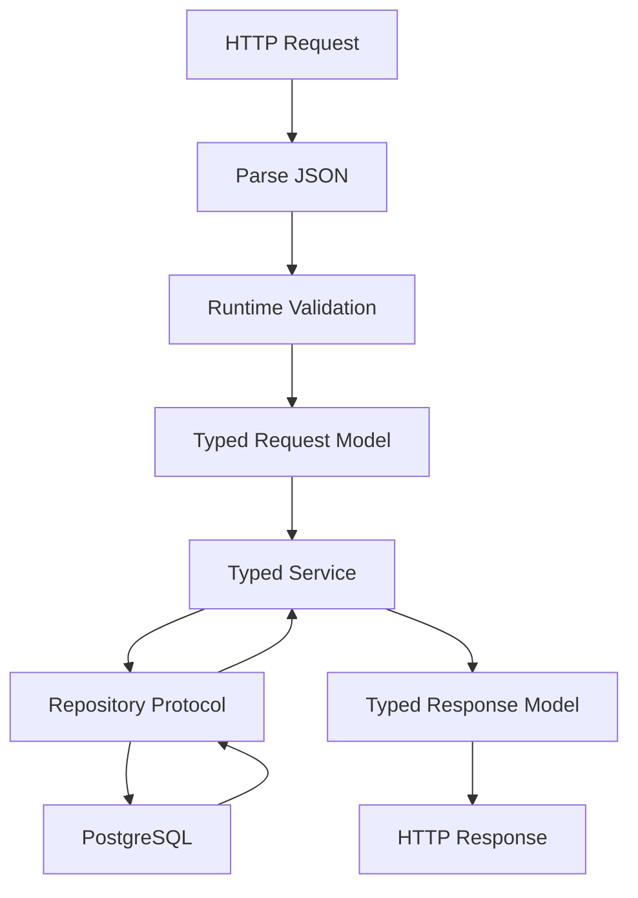

# README

## Overview

The **Type System** section of the Python Forge Playbook covers Python's modern static typing ecosystem and the engineering practices required to use it effectively in production backend systems.

Python is dynamically typed at runtime, but modern Python provides a rich static type system through annotations and tools such as mypy and Pyright. Static typing allows developers to express contracts between functions, classes, services, repositories, infrastructure adapters, APIs, and event-processing components.

The progression in this folder moves from fundamental type annotations to increasingly expressive mechanisms:

```text
Basic Type Hints
      │
      ▼
Built-in Generic Types
      │
      ▼
Unions / Optional
      │
      ▼
Any / Never / NoReturn
      │
      ▼
Callable / Type Aliases
      │
      ▼
TypedDict / Literal
      │
      ▼
TypeVar / Generics
      │
      ▼
Protocols
      │
      ▼
Type Guards
      │
      ▼
Overloads
      │
      ▼
Static Type Checking
      │
      ├── Mypy
      └── Pyright
```

The goal is not to annotate every line of Python. The goal is to create **useful, maintainable, machine-checkable contracts** at the places where incorrect assumptions create the greatest engineering risk.

---

## Why the Type System Matters

As a Python backend grows, implicit assumptions become difficult to maintain.

Consider a service:

```python
def create_order(request, repository):
    ...
```

The caller does not know:

- what type `request` should have
- what methods `repository` must provide
- what the function returns
- whether `None` is possible
- whether the repository is synchronous or asynchronous

A typed interface makes those contracts explicit:

```python
def create_order(
    request: CreateOrderRequest,
    repository: OrderRepository,
) -> Order:
    ...
```

This improves:

- correctness
- refactoring safety
- IDE support
- code review
- maintainability
- architectural clarity
- onboarding
- CI quality gates

Static typing is particularly valuable in systems with many interacting components.

---

## Folder Structure

```text
06- Type System/
│
├── 01- Type Hints.md
├── 02- Built-in Generic Types.md
├── 03- Optional and Union.md
├── 04- Any Never Noreturn.md
├── 05- Callable.md
├── 06- Type Aliases.md
├── 07- TypedDict.md
├── 08- Literal.md
├── 09- TypeVar.md
├── 10- Generics.md
├── 11- Protocols.md
├── 12- Type Guards.md
├── 13- Overloads.md
├── 14- Static Type Checking.md
├── 15- Mypy.md
├── 16- Pyright.md
└── README.md
```

---

## Learning Progression

The files are intentionally ordered so that later concepts build on earlier ones.

| File | Topic | Primary Focus |
|---|---|---|
| `01- Type Hints.md` | Type Hints | Python annotations and the overall typing model |
| `02- Built-in Generic Types.md` | Built-in Generics | `list[T]`, `dict[K, V]`, `tuple`, `Sequence`, `Mapping`, and related types |
| `03- Optional and Union.md` | Optional and Union | Nullable values and multiple possible types |
| `04- Any Never Noreturn.md` | Special Types | `Any`, `Never`, and `NoReturn` |
| `05- Callable.md` | Callable | Functions, callbacks, callable objects, and higher-order APIs |
| `06- Type Aliases.md` | Type Aliases | Reusable and semantic type definitions |
| `07- TypedDict.md` | TypedDict | Static dictionary-shape contracts |
| `08- Literal.md` | Literal | Finite value sets and static value discrimination |
| `09- TypeVar.md` | TypeVar | Generic relationships and constrained typing |
| `10- Generics.md` | Generics | Generic functions, classes, aliases, and application architecture |
| `11- Protocols.md` | Protocols | Structural typing and behavioral interfaces |
| `12- Type Guards.md` | Type Guards | Runtime predicates and static type narrowing |
| `13- Overloads.md` | Overloads | Multiple static call signatures |
| `14- Static Type Checking.md` | Static Type Checking | Static analysis concepts and engineering workflow |
| `15- Mypy.md` | Mypy | Mypy configuration, workflows, CI, and production usage |
| `16- Pyright.md` | Pyright | Pyright configuration, inference, editor integration, and CI |

---

## Type System Mental Model

A useful way to understand Python typing is to separate three concerns:

```text
                 Python Application
                        │
          ┌─────────────┼─────────────┐
          │             │             │
          ▼             ▼             ▼
     Static Types   Runtime Types   Runtime Data
          │             │             │
          ▼             ▼             ▼
    mypy / Pyright   Python VM    Validation
```

These layers interact but are not interchangeable.

### Static Type System

Describes what the code is expected to accept and return.

```python
def get_user(user_id: int) -> User:
    ...
```

### Runtime Type System

Python objects have actual runtime types:

```python
type(user_id)
type(user)
```

### Runtime Validation

External data must be validated independently:

```text
HTTP JSON
   │
   ▼
Pydantic / validation
   │
   ▼
Typed model
   │
   ▼
Application logic
```

A type annotation alone does not validate untrusted data.

---

## Type Hints

Type annotations provide machine-readable contracts.

```python
def calculate_total(
    price: float,
    quantity: int,
) -> float:
    return price * quantity
```

They provide value at:

- function boundaries
- class interfaces
- service contracts
- repository interfaces
- public libraries
- event handlers
- API models

They should not be used merely to decorate every local variable.

---

## Built-in Generic Types

Modern Python supports built-in generic syntax:

```python
users: list[User]
orders_by_id: dict[int, Order]
unique_ids: set[int]
coordinates: tuple[float, float]
```

This provides a concise way to describe container contents.

Generic types become especially important for backend systems involving:

- database results
- API responses
- caches
- queues
- event streams
- pagination
- reusable infrastructure

---

## Optional and Union

Modern Python uses:

```python
User | None
```

instead of requiring:

```python
Optional[User]
```

for most new code.

For example:

```python
def find_user(user_id: int) -> User | None:
    ...
```

This communicates that the lookup may fail without raising an exception.

Union types are also useful when multiple representations are genuinely valid:

```python
str | int
```

Do not confuse:

```text
optional argument
```

with:

```text
argument whose value may be None
```

Those are separate concepts.

---

## Any, Never, and NoReturn

These types have specialized roles.

| Type | Meaning |
|---|---|
| `Any` | Disables many static guarantees for a value |
| `Never` | Represents an impossible type / no possible value |
| `NoReturn` | Describes functions that do not return normally |

`Any` is especially important operationally because it can spread through a codebase and weaken static analysis.

A useful principle is:

```text
Dynamic boundary
     │
     ▼
Unknown / Any
     │
     ▼
Validate / narrow
     │
     ▼
Precise application type
```

Keep dynamic values at system boundaries whenever possible.

---

## Callable

Functions are first-class Python objects, so callable types matter for:

- callbacks
- dependency injection
- strategy functions
- event handlers
- middleware
- decorators
- task functions

Simple callable contracts use:

```python
from collections.abc import Callable


Handler = Callable[[Request], Response]
```

More sophisticated decorators should use `ParamSpec` when parameter preservation matters.

---

## Type Aliases

Type aliases give names to reusable type expressions:

```python
type UserMap = dict[int, User]
type UserResult = User | None
```

Aliases are useful when a complex type expression has architectural or domain meaning.

Do not confuse an alias with a new runtime type.

For stronger semantic distinctions, consider:

- `NewType`
- classes
- dataclasses
- domain value objects

---

## TypedDict

`TypedDict` describes dictionary structure:

```python
class UserPayload(TypedDict):
    id: int
    email: str
```

It is useful for:

- JSON-like internal structures
- configuration dictionaries
- event payloads
- API metadata
- partially structured data

`TypedDict` is primarily static.

It does not automatically validate arbitrary runtime dictionaries.

For external data:

```text
Untrusted dictionary
       │
       ▼
Runtime validation
       │
       ▼
Validated structure
       │
       ▼
Typed application code
```

---

## Literal

`Literal` restricts a type to a finite set of known values:

```python
from typing import Literal


Mode = Literal["sync", "async"]
```

This is useful for:

- modes
- states
- feature flags
- protocol variants
- configuration options
- HTTP-style command values

`Literal` works especially well with:

- overloads
- discriminated unions
- pattern matching
- exhaustive handling

---

## TypeVar

`TypeVar` expresses relationships between types.

```python
from typing import TypeVar


T = TypeVar("T")


def first(items: list[T]) -> T:
    return items[0]
```

The same function preserves different concrete types:

```text
list[str] → str
list[int] → int
list[User] → User
```

`TypeVar` can also express:

- bounds
- constraints
- variance

Use it when a generic relationship matters, not simply because generic syntax is available.

---

## Generics

Generics allow reusable components to preserve type information.

Examples include:

```python
class Repository[T]:
    ...
```

and:

```python
def paginate[T](items: list[T]) -> Page[T]:
    ...
```

Generics are useful for infrastructure such as:

- repositories
- caches
- pagination
- result wrappers
- serializers
- event pipelines
- message handlers

They should remain understandable. Excessively complex generic APIs can reduce maintainability.

---

## Protocols

Protocols provide structural typing.

```python
class UserRepository(Protocol):
    def get(self, user_id: int) -> User | None:
        ...
```

A concrete class does not need to inherit from the protocol.

```text
UserRepository
      ▲
      │
      ├── PostgreSQL implementation
      ├── In-memory implementation
      └── Test fake
```

This is especially valuable for dependency inversion and testing.

A service can depend on behavior rather than a concrete infrastructure implementation.

---

## Type Guards

Type guards connect runtime checks with static narrowing.

```python
def is_user(value: object) -> TypeGuard[User]:
    return isinstance(value, User)
```

Then:

```python
value: object = load_value()

if is_user(value):
    value.send_email()
```

Type guards are useful when the runtime predicate is reusable and the type relationship is meaningful.

The predicate must be correct. A type checker cannot independently prove that a custom guard is truthful.

---

## Overloads

Overloads describe multiple static signatures for one runtime implementation.

```python
@overload
def fetch(kind: Literal["user"]) -> User:
    ...


@overload
def fetch(kind: Literal["order"]) -> Order:
    ...


def fetch(kind: Literal["user", "order"]) -> User | Order:
    ...
```

Use overloads when:

```text
input signature
      │
      ▼
determines static return type
```

Prefer generics when the relationship is parametric and unions when the return type does not depend on the specific input variant.

---

## Static Type Checking

Static type checking analyzes source code without executing the application.

The process is conceptually:

```text
Source Code
    │
    ▼
Annotations + Inference
    │
    ▼
Static Analyzer
    │
    ├── Valid
    │
    └── Type Errors
```

Static checking is particularly useful for:

- refactoring
- API changes
- repository changes
- shared libraries
- domain models
- event contracts
- large codebases

The type checker should normally run before tests and deployment.

---

## Mypy

Mypy is a mature Python static type checker.

Typical usage:

```bash
mypy src tests
```

Configuration can be centralized:

```toml
[tool.mypy]
python_version = "3.12"
strict = true
```

Mypy is useful when a project needs:

- explicit type checking
- strict CI enforcement
- established typing conventions
- mature Python ecosystem integration

It can be introduced incrementally in legacy systems.

---

## Pyright

Pyright is another major Python static type checker.

Typical usage:

```bash
pyright
```

Example configuration:

```json
{
  "include": ["src", "tests"],
  "exclude": ["build", "dist", ".venv"],
  "typeCheckingMode": "strict"
}
```

Pyright is especially useful for:

- fast interactive analysis
- editor integration
- strong type inference
- Pylance-based VS Code workflows
- CI type checking

Mypy and Pyright solve the same broad problem but do not have identical behavior.

---

## Mypy vs Pyright

The project should generally choose one primary checker.

| Consideration | Mypy | Pyright |
|---|---|---|
| Static analysis | Strong | Strong |
| Strict checking | Yes | Yes |
| Generic typing | Yes | Yes |
| Protocols | Yes | Yes |
| Type narrowing | Yes | Yes |
| CLI | `mypy` | `pyright` |
| Configuration | `pyproject.toml`, `mypy.ini`, etc. | `pyrightconfig.json`, `pyproject.toml` |
| VS Code ecosystem | Strong | Excellent through Pylance |
| Inference behavior | Project-dependent | Project-dependent |
| Best choice | Depends on project | Depends on project |

Do not use both merely because two tools appear safer.

A consistent single checker is usually easier to operate.

---

## Type Checking and Runtime Validation

The type system must not be confused with runtime validation.

A production API commonly follows:



Static analysis runs outside this request path:

```text
Developer / CI
      │
      ▼
Mypy / Pyright
      │
      ▼
Validate source-code contracts
```

This distinction is fundamental to production Python engineering.

---

## Backend Architecture

Typing becomes more valuable as an application develops explicit layers.

```text
                    External Clients
                          │
                          ▼
                  REST / gRPC / Events
                          │
                          ▼
                   Runtime Validation
                          │
                          ▼
                       DTOs
                          │
                          ▼
                    Service Layer
                          │
                 ┌────────┴────────┐
                 ▼                 ▼
            Domain Model      Protocols
                                   │
                    ┌──────────────┼──────────────┐
                    ▼              ▼              ▼
               PostgreSQL        Redis          Kafka
```

Static checking verifies the relationships within the Python application.

Runtime systems remain responsible for actual external state.

---

## Django

In Django applications, typing is especially useful in:

- service layers
- repository interfaces
- domain logic
- serializers
- task functions
- API integrations
- management commands

The Django ORM contains substantial dynamic behavior.

Do not allow that dynamic behavior to contaminate the entire application with weak typing.

Use explicit interfaces and adapters around dynamic framework boundaries.

---

## FastAPI

FastAPI naturally integrates Python annotations with runtime validation.

For example:

```python
@app.get("/users/{user_id}", response_model=UserResponse)
async def get_user(user_id: int) -> UserResponse:
    ...
```

The responsibilities remain separate:

```text
FastAPI / Pydantic
→ runtime validation

Mypy / Pyright
→ static analysis
```

Using both provides stronger protection than relying on either independently.

---

## PostgreSQL

Typed repository interfaces make database access contracts explicit:

```python
class UserRepository(Protocol):
    async def get_by_id(
        self,
        user_id: int,
    ) -> User | None:
        ...

    async def save(self, user: User) -> User:
        ...
```

Static analysis can verify application-level contracts.

It cannot verify:

- database availability
- query correctness in all runtime cases
- transaction isolation
- migration safety
- query performance
- actual database contents

Database constraints and integration testing remain necessary.

---

## Redis

Redis is dynamically typed from the application's perspective.

A typed cache abstraction can provide a stable application interface:

```python
class UserCache(Protocol):
    async def get(self, user_id: int) -> User | None:
        ...

    async def set(
        self,
        user: User,
        ttl_seconds: int,
    ) -> None:
        ...
```

Serialization remains a runtime concern:

```text
User
 ↓
Serialize
 ↓
Redis
 ↓
Deserialize
 ↓
User
```

Static types do not validate serialized cache data.

---

## Kafka

Kafka is another dynamic boundary.

A robust event-processing pipeline is:

```text
Kafka bytes
     │
     ▼
Deserializer
     │
     ▼
Schema validation
     │
     ▼
Typed event
     │
     ▼
Typed handler
     │
     ▼
Business logic
```

Mypy and Pyright become valuable after the event has been converted into a known application type.

They do not validate arbitrary Kafka bytes.

---

## Celery

Background jobs should have explicit contracts:

```python
@app.task
def generate_report(report_id: int) -> str:
    ...
```

Static checking can verify Python-side callers and implementations.

Celery still introduces runtime concerns:

- serialization
- retries
- idempotency
- worker compatibility
- task versioning
- timeouts
- failure handling

Typing improves code correctness but does not remove distributed-system concerns.

---

## gRPC

gRPC provides an explicit protobuf schema.

A typical architecture is:

```text
.proto
  │
  ▼
Code Generation
  │
  ▼
Generated Python API
  │
  ▼
Typed Application Code
  │
  ▼
Mypy / Pyright
```

Python typing complements protobuf rather than replacing it.

The protobuf schema remains the distributed contract.

---

## Type System and API Design

Types can make API behavior explicit.

For example:

```python
class CreateOrderRequest(BaseModel):
    customer_id: int
    amount_cents: int
```

and:

```python
def create_order(
    request: CreateOrderRequest,
) -> Order:
    ...
```

This provides a clear relationship between:

```text
Input DTO
   ↓
Application operation
   ↓
Domain output
```

For public APIs, external contracts such as OpenAPI remain important.

---

## Type System and Dependency Injection

Protocols and callables can provide typed dependency injection.

```python
class PaymentGateway(Protocol):
    async def charge(
        self,
        customer_id: str,
        amount_cents: int,
    ) -> PaymentResult:
        ...
```

The service depends on:

```text
PaymentGateway
```

rather than a specific vendor implementation.

This improves:

- testability
- dependency inversion
- substitution
- architecture
- refactoring safety

---

## Type System and Refactoring

One of the highest-value benefits of static typing is safer refactoring.

Suppose a function changes from:

```python
def get_user(user_id: int) -> User:
    ...
```

to:

```python
def get_user(user_id: UserId) -> User:
    ...
```

A static checker can identify incompatible callers.

This becomes increasingly valuable as the number of services and shared libraries grows.

---

## Type System and Testing

Static checking and testing cover different dimensions.

| Concern | Static Type System | Runtime Tests |
|---|---:|---:|
| Incorrect argument type | Yes | Sometimes |
| Incorrect return type | Yes | Sometimes |
| Missing attribute | Yes | Sometimes |
| Runtime validation | No | Yes |
| Business logic | No | Yes |
| Database behavior | No | Yes |
| Network failures | No | Yes |
| Authentication | No | Yes |
| Race conditions | No | Sometimes |
| API behavior | Partially | Yes |

A production system should use both.

---

## Type System and Serialization

Typing describes Python-side structures.

Serialization converts those structures into external representations:

```text
Python Object
     │
     ▼
JSON / Protobuf / Avro
     │
     ▼
Network / Kafka / Redis
     │
     ▼
Deserializer
     │
     ▼
Validated Python Object
```

Static typing does not guarantee serialized data compatibility.

Schema evolution and compatibility must be handled separately.

---

## Type System and Configuration

Configuration is often dynamic at runtime:

```text
Environment
    │
    ▼
Configuration loader
    │
    ▼
Validation
    │
    ▼
Typed configuration model
    │
    ▼
Application
```

A typed configuration model makes assumptions explicit.

For example:

```python
class AppConfig:
    database_url: str
    max_connections: int
    debug: bool
```

Runtime configuration parsing remains necessary.

---

## Security Considerations

Static typing is not a security boundary.

This:

```python
user_id: int
```

does not establish that:

- the client is authenticated
- the user is authorized
- the value came from a trusted source
- the resource belongs to the requester

Security requires runtime controls such as:

- authentication
- authorization
- input validation
- SQL parameterization
- secret management
- rate limiting
- dependency scanning
- audit logging

Use static typing to reduce implementation mistakes, not to establish trust.

---

## Performance and Memory

Static type annotations normally do not impose meaningful application runtime cost by themselves.

Mypy and Pyright run outside the production request path.

Development-time costs can include:

- CPU
- memory
- CI duration
- editor analysis time

Large repositories should optimize analysis through:

- incremental checking
- caching
- clear package boundaries
- controlled generated-code analysis
- limited plugins
- parallel CI stages

Do not sacrifice useful type guarantees simply to reduce modest CI overhead.

---

## Concurrency

Static types can describe concurrent APIs:

```python
from collections.abc import Awaitable, Callable


Handler = Callable[[Request], Awaitable[Response]]
```

They cannot prove:

- absence of race conditions
- correct locking
- transaction safety
- event-loop correctness
- deadlock freedom

Concurrency belongs to the runtime design and testing layers.

---

## Reliability

Static typing improves reliability by preventing some classes of defects before deployment.

It is especially useful for:

- large refactors
- dependency upgrades
- API changes
- domain changes
- repository replacements
- event model changes

It does not prevent:

- database outages
- network failures
- corrupted data
- infrastructure failure
- incorrect business requirements

Use typing as one layer of defense in a broader reliability strategy.

---

## Observability

Static typing does not replace runtime observability.

Production systems still require:

- structured logging
- metrics
- distributed tracing
- error tracking
- health checks
- alerting

Typed models can improve consistency of telemetry structures.

For example:

```python
class RequestContext(TypedDict):
    request_id: str
    route: str
    user_id: str | None
```

This can make application metadata contracts clearer.

---

## High Availability

Static analysis contributes indirectly to availability by preventing some deployment defects.

A production delivery pipeline can be:

```text
Commit
  │
  ▼
Lint
  │
  ▼
Type Check
  │
  ▼
Unit Tests
  │
  ▼
Integration Tests
  │
  ▼
Security Checks
  │
  ▼
Container Build
  │
  ▼
Deployment
  │
  ▼
Health / Readiness Checks
```

High availability still requires:

- redundancy
- health checks
- safe deployments
- rollback
- database resilience
- appropriate multi-AZ architecture
- disaster recovery procedures

---

## CI/CD Strategy

Static checking should be part of CI.

A typical backend pipeline:

```yaml
steps:
  - name: Install dependencies
    run: python -m pip install -e ".[dev]"

  - name: Lint
    run: ruff check .

  - name: Type check
    run: pyright

  - name: Test
    run: pytest
```

For mypy-based projects:

```yaml
- name: Type check
  run: mypy src tests
```

The exact checker is a project decision.

The enforcement principle is the important part.

---

## Legacy Codebases

Large Python applications often begin with little or no typing.

A practical migration strategy is:

```text
Untyped Codebase
      │
      ▼
Choose Checker
      │
      ▼
Establish Baseline
      │
      ▼
Type Public Boundaries
      │
      ▼
Type Core Services
      │
      ▼
Reduce Any
      │
      ▼
Increase Strictness
```

Do not require a complete rewrite before the first useful benefits appear.

---

## Type Debt

Common forms of type debt include:

```python
Any
```

```python
cast(...)
```

```python
# type: ignore
```

and:

```text
untyped functions
```

These are not inherently forbidden, but excessive usage weakens the type system.

A mature codebase tracks and reduces type debt deliberately.

---

## Production Pitfalls

### Treating Types as Runtime Validation

Annotations do not validate HTTP, Kafka, Redis, or database data.

### Excessive `Any`

`Any` can spread from one poorly typed dependency into large portions of the application.

### Unnecessary Casts

A cast can hide an incorrect type model.

### Overusing Advanced Typing

Complex generic expressions can make code harder to understand.

### Ignoring CI

Typing that is not enforced will eventually become inconsistent.

### Mixing Type Checkers Without Purpose

Different checker behavior can create unnecessary developer friction.

### Over-Modeling Dynamic Frameworks

Do not attempt to encode every implementation detail of a dynamic framework.

Create typed boundaries instead.

---

## Production Best Practices

A production Python project should generally:

- Use modern type syntax appropriate for the supported Python version.
- Type public APIs and important internal boundaries.
- Prefer inference for obvious local values.
- Minimize `Any`.
- Narrow unknown values before using them.
- Use `TypedDict` for appropriate dictionary-shaped contracts.
- Use `Protocol` for behavioral abstractions.
- Use generics when relationships between types matter.
- Use `TypeGuard` or `TypeIs` for reusable runtime predicates.
- Use overloads when return types genuinely depend on arguments.
- Use `ParamSpec` for decorators that preserve callable signatures.
- Keep runtime validation separate from static typing.
- Isolate dynamic third-party dependencies behind adapters.
- Run one primary static checker consistently.
- Enforce type checking in CI.
- Treat casts and ignores as controlled escape hatches.
- Increase strictness progressively in legacy applications.

---

## Decision Guide

| Requirement | Preferred Type-System Tool |
|---|---|
| Simple local value | Type inference |
| Public function contract | Type annotation |
| Nullable value | `T \| None` |
| Multiple possible types | Union |
| Unknown value | `object` + narrowing |
| Dynamic escape hatch | `Any`, sparingly |
| Dictionary shape | `TypedDict` |
| Finite value set | `Literal` |
| Reusable type expression | Type alias |
| Distinct domain primitive | `NewType` |
| Generic relationship | `TypeVar` / generics |
| Behavioral interface | `Protocol` |
| Callable interface | `Callable` |
| Decorator parameter preservation | `ParamSpec` |
| Subtype-preserving fluent API | `Self` |
| Runtime narrowing | `TypeGuard` / `TypeIs` |
| Multiple input/output signatures | `@overload` |
| Static checking | Mypy or Pyright |
| Runtime validation | Pydantic / explicit validation |
| Distributed contract | OpenAPI / protobuf / schema registry |

---

## Recommended Engineering Workflow

For a new Python backend:

1. Define the supported Python version.
2. Select one primary static type checker.
3. Configure it in version control.
4. Type public functions and architectural boundaries.
5. Use inference for straightforward local values.
6. Introduce generics only when relationships need to be preserved.
7. Use protocols for dependency inversion and behavioral contracts.
8. Validate external data at runtime.
9. Keep dynamic dependencies behind typed adapters.
10. Run static checking locally during development.
11. Enforce static checking in CI.
12. Track and reduce `Any`, casts, ignores, and other type debt.

---

## Senior-Level Perspective

The purpose of the Python type system is not to turn Python into Java or another statically typed language.

Its value is architectural.

A strong Python type system makes important assumptions explicit:

```text
What enters this function?
        │
        ▼
What does it produce?
        │
        ▼
What dependencies does it require?
        │
        ▼
What behavior does the dependency provide?
        │
        ▼
What states are possible?
        │
        ▼
What values are impossible?
```

At senior engineering level, typing should be used selectively to reduce ambiguity at high-value boundaries.

The strongest codebases generally combine:

```text
Static Types
     +
Runtime Validation
     +
Tests
     +
Database Constraints
     +
Security Controls
     +
Observability
     +
CI/CD Enforcement
```

No individual layer is sufficient by itself.

---

## Interview Perspective

The most important concepts to be able to explain are:

- Python is dynamically typed at runtime but supports optional static typing.
- Type annotations do not normally enforce runtime behavior.
- Mypy and Pyright perform static analysis.
- `Any` weakens static guarantees.
- `object` is safer when the actual type is unknown.
- `TypedDict` describes dictionary structure but does not validate runtime data.
- `Protocol` provides structural typing.
- `TypeVar` expresses relationships between types.
- Generics allow reusable type-safe abstractions.
- `TypeGuard` and `TypeIs` connect runtime predicates with static narrowing.
- `@overload` describes multiple static signatures for one runtime implementation.
- `ParamSpec` preserves callable parameter information.
- Runtime validation and static checking solve different problems.
- Static typing complements tests rather than replacing them.
- CI should enforce the project's type-checking policy.

---

## Key Takeaways

- **Python's type system is an engineering contract layer**: annotations, generics, protocols, TypedDict, TypeVar, type guards, overloads, and related features make important application relationships explicit without changing Python's dynamic runtime model.
- **Type the boundaries that matter most**: APIs, services, repositories, domain models, event handlers, infrastructure adapters, and shared libraries benefit more from precise contracts than from excessive annotation of obvious local variables.
- **Static typing does not replace runtime validation or testing**: HTTP, Kafka, Redis, databases, authentication, authorization, network failures, and business rules still require runtime controls and tests.
- **Mypy and Pyright provide the enforcement layer**: select a primary checker, configure it consistently, run it locally, and make it part of CI/CD so type correctness becomes a repeatable engineering practice.
- **Senior-level typing is about reducing ambiguity, not maximizing annotations**: use the simplest type construct that accurately represents the contract and keep dynamic behavior isolated at well-defined boundaries.