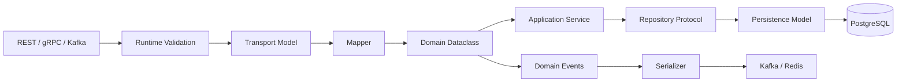

# 01- Dataclasses

## Overview

Python `dataclasses` provide a standard way to define classes whose primary purpose is to represent data.

They reduce repetitive implementation of:

- `__init__`
- `__repr__`
- `__eq__`
- ordering methods
- default values
- field metadata

Dataclasses are especially useful for application models, DTOs, configuration objects, value objects, command objects, and internal data-transfer structures.

They are **not** a database ORM, validation framework, serialization framework, or replacement for domain modeling.

A useful backend mental model is:

```text
External Input
     │
     ▼
Runtime Validation
     │
     ▼
Dataclass / DTO
     │
     ▼
Application Service
     │
     ▼
Domain Logic
     │
     ▼
Repository / Infrastructure
```

The key engineering question is not simply "Can this class be a dataclass?" but:

> "Is this object primarily a data model with predictable fields and value-oriented behavior?"

---

## Why Dataclasses Exist

Before dataclasses, a simple data container often required substantial boilerplate:

```python
class User:
    def __init__(self, user_id: int, email: str) -> None:
        self.user_id = user_id
        self.email = email

    def __repr__(self) -> str:
        return f"User(user_id={self.user_id!r}, email={self.email!r})"

    def __eq__(self, other: object) -> bool:
        if not isinstance(other, User):
            return NotImplemented

        return (
            self.user_id == other.user_id
            and self.email == other.email
        )
```

A dataclass can express the same intent directly:

```python
from dataclasses import dataclass


@dataclass
class User:
    user_id: int
    email: str
```

The class declaration now communicates the important information immediately:

```text
User
├── user_id: int
└── email: str
```

This reduces boilerplate while retaining normal Python class semantics.

---

## Basic Dataclass

The simplest form is:

```python
from dataclasses import dataclass


@dataclass
class User:
    user_id: int
    email: str
```

Python generates an initializer approximately equivalent to:

```python
User(user_id=1, email="alice@example.com")
```

It also provides useful generated methods such as `__repr__` and `__eq__`.

---

## What `@dataclass` Does

The decorator examines annotated class attributes and generates selected methods.

Common generated behavior includes:

| Feature | Default |
|---|---:|
| `__init__` | Yes |
| `__repr__` | Yes |
| `__eq__` | Yes |
| Ordering methods | No |
| Hashing | Depends on configuration |
| Frozen behavior | No |
| Slots | No |
| Keyword-only fields | No |

The decorator does not transform the object into a special runtime container.

A dataclass remains a normal Python class.

---

## Internal Model

Conceptually:

```text
Class definition
      │
      ▼
@dataclass
      │
      ▼
Inspect annotated fields
      │
      ├── Generate __init__
      ├── Generate __repr__
      ├── Generate __eq__
      ├── Generate ordering methods if requested
      └── Configure dataclass metadata
```

The generated methods become ordinary class methods.

This matters because dataclasses do not introduce a separate runtime object model.

---

## Type Annotations Define Fields

Dataclass fields are identified through annotations.

```python
from dataclasses import dataclass


@dataclass
class Order:
    order_id: int
    customer_id: int
    amount_cents: int
```

Unannotated class attributes are not automatically treated as dataclass fields:

```python
@dataclass
class Order:
    order_id: int
    status = "pending"
```

Here, `status` is a class attribute rather than a normal dataclass field.

For a dataclass field:

```python
@dataclass
class Order:
    order_id: int
    status: str = "pending"
```

---

## Generated `__init__`

Given:

```python
@dataclass
class Order:
    order_id: int
    amount_cents: int
    status: str = "pending"
```

Python provides an initializer equivalent in behavior to:

```python
Order(
    order_id=1001,
    amount_cents=2500,
)
```

Required fields must appear before fields with defaults.

This is invalid:

```python
@dataclass
class Order:
    status: str = "pending"
    order_id: int
```

A non-default field cannot follow a default field in the generated constructor.

---

## Default Values

Use simple immutable defaults directly:

```python
@dataclass
class RetryPolicy:
    max_attempts: int = 3
    timeout_seconds: float = 5.0
```

For mutable values such as lists and dictionaries, use `default_factory`.

```python
from dataclasses import dataclass, field


@dataclass
class RequestContext:
    headers: dict[str, str] = field(default_factory=dict)
```

Each instance receives its own dictionary.

---

## The Mutable Default Trap

Avoid:

```python
@dataclass
class RequestContext:
    headers: dict[str, str] = {}
```

The intention is usually:

```text
Request A → {}
Request B → {}
```

but a shared mutable class-level default would be dangerous.

Use:

```python
@dataclass
class RequestContext:
    headers: dict[str, str] = field(default_factory=dict)
```

Now:

```text
Request A → dict A
Request B → dict B
```

The factory executes for each instance.

---

## `field()`

`field()` provides fine-grained control over individual fields.

```python
from dataclasses import dataclass, field


@dataclass
class User:
    user_id: int
    email: str
    tags: list[str] = field(default_factory=list)
```

Useful options include:

- `default`
- `default_factory`
- `init`
- `repr`
- `compare`
- `hash`
- `kw_only`
- `metadata`

---

## Excluding Fields from `__init__`

Some fields should be computed internally:

```python
from dataclasses import dataclass, field


@dataclass
class Order:
    order_id: int
    amount_cents: int
    normalized_amount: int = field(init=False)

    def __post_init__(self) -> None:
        self.normalized_amount = max(self.amount_cents, 0)
```

`normalized_amount` is not accepted by the constructor.

Use this carefully. If initialization logic becomes substantial, a factory method or domain constructor may be clearer.

---

## `__post_init__`

`__post_init__` runs after the generated `__init__`.

```python
from dataclasses import dataclass


@dataclass
class Money:
    amount_cents: int
    currency: str

    def __post_init__(self) -> None:
        if self.amount_cents < 0:
            raise ValueError("amount cannot be negative")

        self.currency = self.currency.upper()
```

This is useful for:

- normalization
- derived values
- invariant checks
- lightweight initialization logic

It should not become a substitute for a full validation framework.

---

## Validation vs Dataclasses

Dataclasses can enforce invariants manually:

```python
@dataclass
class Port:
    value: int

    def __post_init__(self) -> None:
        if not 1 <= self.value <= 65535:
            raise ValueError("invalid port")
```

But dataclasses do not automatically provide:

- JSON validation
- schema validation
- coercion
- rich validation errors
- API request validation

For external input, use an appropriate runtime validation layer such as Pydantic.

---

## Dataclasses and Type Checking

Dataclasses work well with static type checkers such as:

- mypy
- Pyright

For example:

```python
@dataclass
class User:
    user_id: int
    email: str
```

A type checker can detect:

```python
User(user_id="100", email=123)
```

This is a static guarantee.

Runtime Python itself does not enforce the annotations.

---

## `repr`

Dataclasses generate useful representations:

```python
@dataclass
class User:
    user_id: int
    email: str
```

Example:

```text
User(user_id=42, email='alice@example.com')
```

This is useful for debugging and tests.

However, be careful with sensitive fields:

```python
@dataclass
class Credentials:
    username: str
    password: str
```

A generated representation may expose the password.

Use:

```python
from dataclasses import dataclass, field


@dataclass
class Credentials:
    username: str
    password: str = field(repr=False)
```

---

## Equality

Dataclasses generate value-based equality by default.

```python
@dataclass
class Point:
    x: int
    y: int
```

Then:

```python
Point(1, 2) == Point(1, 2)
```

is `True`.

This is useful for:

- value objects
- DTOs
- commands
- configuration
- test assertions

It may be inappropriate for entities whose identity is independent of field equality.

---

## Entity vs Value Object

This distinction is important in domain modeling.

### Entity

An entity is identified by identity:

```text
User ID = 42
```

Two user objects with the same attributes may still represent different lifecycle instances or database identities.

### Value Object

A value object is defined primarily by its value:

```text
Money(1000, "USD")
```

Two equivalent values are generally interchangeable.

Dataclasses naturally fit value-object-style modeling, especially with immutability.

---

## Frozen Dataclasses

Use `frozen=True` when instances should not be mutated after construction.

```python
from dataclasses import dataclass


@dataclass(frozen=True)
class Money:
    amount_cents: int
    currency: str
```

This prevents normal attribute reassignment:

```python
money = Money(1000, "USD")
money.amount_cents = 2000
```

The assignment raises `FrozenInstanceError`.

Frozen dataclasses are useful for:

- value objects
- immutable configuration
- commands
- cache keys
- identifiers

---

## Frozen Does Not Mean Deeply Immutable

Consider:

```python
@dataclass(frozen=True)
class User:
    tags: list[str]
```

The field cannot be rebound:

```python
user.tags = ["admin"]
```

but the list itself remains mutable:

```python
user.tags.append("admin")
```

If deep immutability matters, use immutable field types:

```python
from dataclasses import dataclass


@dataclass(frozen=True)
class User:
    tags: tuple[str, ...]
```

---

## Hashing

Hash behavior depends on dataclass configuration.

A common safe pattern for immutable value objects is:

```python
@dataclass(frozen=True)
class Money:
    amount_cents: int
    currency: str
```

This can make instances suitable for hashing when their fields are hashable.

Do not force hashing onto mutable objects simply to use them as dictionary keys.

The fundamental rule is:

```text
Hashable object
→ equality and hash must remain stable
```

---

## Ordering

Dataclasses can generate ordering methods:

```python
from dataclasses import dataclass


@dataclass(order=True)
class Priority:
    value: int
```

This provides methods such as:

- `__lt__`
- `__le__`
- `__gt__`
- `__ge__`

Use ordering only when the domain has a meaningful total ordering.

Do not add `order=True` merely because sorting is convenient.

---

## `compare=False`

Fields can participate in representation without participating in equality comparisons.

```python
from dataclasses import dataclass, field


@dataclass
class Job:
    job_id: int
    priority: int
    trace_id: str = field(compare=False)
```

Now `trace_id` does not affect generated equality.

This is useful for metadata that should not define object identity or value equality.

---

## `kw_only`

Keyword-only fields improve API clarity.

```python
from dataclasses import dataclass, field


@dataclass
class ClientConfig:
    host: str
    port: int
    timeout: float = field(kw_only=True, default=5.0)
```

Usage:

```python
config = ClientConfig(
    "db.internal",
    5432,
    timeout=10.0,
)
```

This is useful when a constructor contains several configuration values that could otherwise be confused positionally.

---

## `slots=True`

Modern Python dataclasses can generate slots:

```python
from dataclasses import dataclass


@dataclass(slots=True)
class User:
    user_id: int
    email: str
```

Slots can:

- reduce per-instance memory overhead
- prevent arbitrary new attributes
- improve attribute access characteristics in some workloads

They also change class behavior.

For example:

```python
user = User(1, "alice@example.com")
user.debug_value = True
```

will not work when the generated slots do not include that attribute.

Use slots when object shape is intentionally fixed and memory usage matters.

---

## `slots` and Inheritance

Slots interact with inheritance.

A subclass can introduce its own slots, and Python handles inherited slots separately.

Do not assume:

```text
slots=True
```

automatically makes an entire inheritance hierarchy behave as a single flat slot layout.

For performance-sensitive models, benchmark the actual hierarchy.

Composition is often simpler than deep dataclass inheritance.

---

## `weakref_slot`

For dataclasses using slots, weak references may need an explicit slot:

```python
from dataclasses import dataclass


@dataclass(slots=True, weakref_slot=True)
class WorkerState:
    worker_id: str
```

This is only needed when instances must support weak references.

Do not enable it without a concrete requirement.

---

## Dataclass Inheritance

Dataclasses support inheritance:

```python
from dataclasses import dataclass


@dataclass
class Event:
    event_id: str


@dataclass
class UserCreated(Event):
    user_id: int
```

The generated constructor incorporates inherited fields.

However, inheritance can become difficult when:

- defaults appear across hierarchy levels
- initialization logic becomes complex
- subclasses change invariants
- equality semantics become unclear

Prefer composition when the relationship is not genuinely substitutive.

---

## Composition

Composition often produces clearer models:

```python
from dataclasses import dataclass


@dataclass(frozen=True)
class Address:
    city: str
    country: str


@dataclass
class User:
    user_id: int
    email: str
    address: Address
```

This creates explicit value boundaries:

```text
User
├── user_id
├── email
└── Address
    ├── city
    └── country
```

Composition is usually preferable when components represent independent concepts.

---

## Dataclass Methods

Dataclasses can contain behavior.

```python
from dataclasses import dataclass


@dataclass
class Money:
    amount_cents: int
    currency: str

    def add(self, other: "Money") -> "Money":
        if self.currency != other.currency:
            raise ValueError("currency mismatch")

        return Money(
            self.amount_cents + other.amount_cents,
            self.currency,
        )
```

A dataclass is not required to be an anemic data container.

The right balance depends on whether the behavior naturally belongs to the model.

---

## Domain Invariants

Dataclasses can encode domain invariants close to the data.

```python
from dataclasses import dataclass


@dataclass(frozen=True)
class Percentage:
    value: float

    def __post_init__(self) -> None:
        if not 0 <= self.value <= 100:
            raise ValueError("percentage must be between 0 and 100")
```

Now invalid states are rejected at construction.

This is particularly useful for value objects.

---

## Factory Methods

Complex construction can be moved into class methods:

```python
from dataclasses import dataclass


@dataclass(frozen=True)
class UserId:
    value: int

    @classmethod
    def from_string(cls, value: str) -> "UserId":
        parsed = int(value)

        if parsed <= 0:
            raise ValueError("user ID must be positive")

        return cls(parsed)
```

This keeps constructor semantics simple while providing controlled creation paths.

---

## `InitVar`

`InitVar` represents a constructor-only input that is passed to `__post_init__` but is not stored as a normal field.

```python
from dataclasses import InitVar, dataclass


@dataclass
class DatabaseConfig:
    host: str
    password: str = ""
    raw_password: InitVar[str | None] = None

    def __post_init__(self, raw_password: str | None) -> None:
        if raw_password is not None:
            self.password = raw_password
```

Use `InitVar` sparingly.

If the initialization process becomes complicated, a factory or dedicated constructor object may be clearer.

---

## Class Variables

Use `ClassVar` for class-level configuration that should not be treated as an instance field:

```python
from dataclasses import dataclass
from typing import ClassVar


@dataclass
class RetryPolicy:
    max_attempts: int
    DEFAULT_BACKOFF: ClassVar[float] = 1.0
```

This distinguishes:

```text
Instance field
→ max_attempts

Class-level constant
→ DEFAULT_BACKOFF
```

---

## Metadata

Dataclass fields can carry metadata:

```python
from dataclasses import dataclass, field


@dataclass
class User:
    user_id: int = field(metadata={"db_column": "id"})
    email: str = field(metadata={"db_column": "email_address"})
```

Metadata is available to frameworks or application code.

However, metadata has no universal built-in behavior.

Do not assume:

```text
metadata={"db_column": "..."}
```

automatically maps the object to PostgreSQL.

A framework must explicitly interpret that metadata.

---

## Serialization

Dataclasses can be converted to dictionaries:

```python
from dataclasses import asdict


payload = asdict(user)
```

For:

```python
@dataclass
class User:
    user_id: int
    email: str
```

the result resembles:

```python
{
    "user_id": 42,
    "email": "alice@example.com",
}
```

`asdict()` recursively converts nested dataclasses.

Be careful with large object graphs because recursive conversion creates new structures and may increase memory usage.

---

## `astuple`

Dataclasses also provide:

```python
from dataclasses import astuple
```

Example:

```python
@dataclass
class Point:
    x: int
    y: int


astuple(Point(10, 20))
```

produces:

```python
(10, 20)
```

Use this only when positional representation is genuinely useful.

Named dictionary structures are generally easier to evolve and understand.

---

## Dataclasses Are Not JSON Serializers

This:

```python
asdict(user)
```

does not automatically solve all JSON serialization problems.

Fields such as:

```python
datetime
Decimal
UUID
bytes
Enum
```

may require explicit conversion.

For external APIs, define a deliberate serialization contract.

FastAPI/Pydantic models are often better suited to public API serialization.

---

## Dataclasses and Pydantic

Dataclasses and Pydantic models serve overlapping but different roles.

| Concern | Dataclass | Pydantic |
|---|---:|---:|
| Data modeling | Excellent | Excellent |
| Generated constructor | Yes | Yes |
| Static typing | Excellent | Excellent |
| Runtime validation | Manual | Strong |
| JSON schema | No built-in general solution | Strong |
| JSON serialization | Manual | Built-in support |
| Coercion | Manual | Configurable |
| Domain value objects | Excellent | Good |
| API boundary | Possible | Excellent |

A common architecture is:

```text
HTTP JSON
   │
   ▼
Pydantic Request Model
   │
   ▼
Domain Dataclass
   │
   ▼
Service
   │
   ▼
Repository
```

This prevents transport concerns from leaking deeply into the domain model.

---

## Dataclasses and Django Models

Django models represent persistent database entities and provide ORM behavior.

Dataclasses generally represent application-level data.

Avoid treating them as interchangeable.

A useful distinction is:

```text
Django Model
→ persistence model

Dataclass
→ application/domain/value model
```

A service may convert between them:

```text
Django Model
      │
      ▼
Mapper
      │
      ▼
Domain Dataclass
```

This can prevent database-specific behavior from dominating business logic.

---

## Dataclasses and SQLAlchemy

SQLAlchemy supports its own ORM mapping mechanisms and can also integrate with dataclass-style models.

The important design decision is whether the object is primarily:

- persistence-oriented
- domain-oriented
- transport-oriented

Do not introduce dataclasses merely to duplicate an ORM model without a clear architectural reason.

---

## DTOs

Dataclasses are excellent DTOs when runtime validation is handled elsewhere.

Example:

```python
from dataclasses import dataclass


@dataclass(frozen=True)
class CreateOrderCommand:
    customer_id: int
    amount_cents: int
```

The API layer can construct the DTO after validating the request.

```text
HTTP Request
     │
     ▼
Pydantic
     │
     ▼
CreateOrderCommand
     │
     ▼
OrderService
```

This separates external transport models from internal application contracts.

---

## Commands and Events

Dataclasses are useful for application commands:

```python
@dataclass(frozen=True)
class CreateOrder:
    customer_id: int
    amount_cents: int
```

They can also model in-process events:

```python
@dataclass(frozen=True)
class OrderCreated:
    order_id: int
    customer_id: int
```

For events crossing service boundaries, additional schema and compatibility controls are required.

Do not assume a Python dataclass is automatically a durable distributed event contract.

---

## Dataclasses and Kafka

A dataclass can represent an already validated event:

```python
@dataclass(frozen=True)
class OrderCreated:
    order_id: int
    customer_id: int
```

But Kafka still receives serialized bytes.

The complete pipeline is:

```text
Kafka
 │
 ▼
Deserialize
 │
 ▼
Validate schema
 │
 ▼
OrderCreated
 │
 ▼
Business logic
```

For cross-service contracts, consider protobuf, Avro, JSON Schema, or another explicit schema strategy.

---

## Dataclasses and Redis

Dataclasses can represent cached application state:

```python
@dataclass(frozen=True)
class UserSnapshot:
    user_id: int
    email: str
```

The cache still needs:

- serialization
- schema evolution
- TTL management
- invalidation strategy
- compatibility handling

The dataclass defines the Python representation, not the Redis wire format.

---

## Dataclasses and Celery

Dataclasses can be used inside task code:

```python
@dataclass(frozen=True)
class ReportRequest:
    report_id: int
    format: str
```

However, task arguments still cross a serialization boundary.

Avoid relying on Python-specific object serialization when workers may run different versions or implementations.

For durable tasks, prefer stable primitive or explicitly versioned representations.

---

## Immutability and Concurrency

Immutable dataclasses can simplify concurrent systems.

```python
@dataclass(frozen=True)
class JobConfig:
    timeout_seconds: float
    max_attempts: int
```

A shared immutable object is easier to reason about because worker code cannot accidentally mutate its configuration.

However, `frozen=True` does not automatically make nested objects immutable.

Use immutable field types where necessary.

---

## Memory Efficiency

Regular dataclass instances have normal Python object and attribute storage overhead.

For large numbers of objects:

```python
@dataclass(slots=True)
class Event:
    event_id: str
    timestamp: int
```

can reduce memory overhead.

This matters for:

- large ETL pipelines
- event batches
- in-memory caches
- high-cardinality object collections

Do not optimize based on assumptions. Measure object counts and memory usage.

---

## Performance

Dataclass-generated methods are ordinary Python methods.

Performance considerations include:

- constructor cost
- generated equality
- recursive `asdict()`
- hashing
- object allocation
- attribute storage
- memory footprint

Dataclasses are not inherently slow.

For performance-sensitive workloads, benchmark:

```text
normal class
vs
dataclass
vs
dataclass(slots=True)
vs
other specialized representation
```

Choose based on actual workload characteristics.

---

## Large Data Processing

Dataclasses are convenient for moderate-sized domain objects but may be inefficient for very large tabular datasets.

For millions of homogeneous numerical records, consider:

- NumPy arrays
- Pandas DataFrames
- columnar formats
- database-side processing
- streaming structures

A dataclass represents one logical object well; it is not a replacement for a columnar data structure.

---

## Copying

Dataclasses provide `replace()` for creating modified copies:

```python
from dataclasses import dataclass, replace


@dataclass(frozen=True)
class User:
    user_id: int
    email: str


user = User(1, "alice@example.com")
updated = replace(user, email="new@example.com")
```

This works particularly well with immutable models.

Conceptually:

```text
Original
   │
   ├── unchanged
   │
   ▼
replace(...)
   │
   ▼
New instance
```

This avoids mutating the original object.

---

## `asdict()` and Deep Copy Behavior

`asdict()` recursively processes nested dataclasses and constructs new containers.

For large structures:

```python
payload = asdict(large_object)
```

may allocate substantial temporary memory.

Do not use `asdict()` indiscriminately inside high-throughput paths.

Prefer explicit serialization when:

- only a subset of fields is required
- payloads are large
- performance matters
- wire representation must be controlled

---

## Pattern Matching

Dataclasses can participate in structural pattern matching.

```python
from dataclasses import dataclass


@dataclass
class UserCreated:
    user_id: int
    email: str


event = UserCreated(42, "alice@example.com")

match event:
    case UserCreated(user_id, email):
        print(user_id, email)
```

This can be useful for event processing and state modeling.

Keep pattern matching readable; complex nested patterns can become harder to maintain than explicit logic.

---

## Dataclass Transforms

Frameworks can expose dataclass-like behavior to static type checkers using `dataclass_transform`.

This is relevant to libraries that provide model APIs similar to dataclasses.

The concept allows static analyzers to understand generated methods and field behavior even when a framework does not literally use `@dataclass`.

This is primarily an advanced library-design concern rather than something application developers need routinely.

---

## Generic Dataclasses

Dataclasses can be generic:

```python
from dataclasses import dataclass


@dataclass
class Result[T]:
    value: T
```

Usage:

```python
user_result: Result[User]
order_result: Result[Order]
```

Generic dataclasses are useful for:

- result wrappers
- pagination
- typed responses
- reusable application structures

Keep generic abstractions focused. Excessively nested generic types can reduce readability.

---

## Generic DTO Example

A reusable pagination model:

```python
from dataclasses import dataclass


@dataclass(frozen=True)
class Page[T]:
    items: list[T]
    next_cursor: str | None
```

Then:

```python
Page[User]
Page[Order]
```

This preserves the item type across the application.

Static type checkers can use this relationship to catch incorrect assignments.

---

## Dataclasses and Protocols

A dataclass can implement a protocol through structural typing.

```python
from typing import Protocol


class Identifiable(Protocol):
    id: int


@dataclass
class User:
    id: int
    email: str
```

`User` satisfies the protocol structurally.

This allows generic application code to depend on behavior or shape without requiring inheritance.

---

## Dataclasses and Type Checking

A strong combination is:

```text
Dataclass
     +
Type annotations
     +
Mypy / Pyright
     +
Runtime validation
```

For example:

```python
@dataclass(frozen=True)
class CreateUser:
    email: str
```

Static analysis checks how application code uses `CreateUser`.

Runtime validation checks whether external input can safely become a `CreateUser`.

---

## Security Considerations

Dataclasses themselves do not provide security.

Pay particular attention to:

### Sensitive Data

Hide secrets from generated representations:

```python
password: str = field(repr=False)
```

### Untrusted Input

Do not construct domain dataclasses directly from arbitrary request dictionaries.

Validate first.

### Serialization

Do not deserialize untrusted Python objects merely because they correspond to a dataclass.

Use safe, explicit formats.

### Authorization

A typed `UserId` does not prove the current principal is authorized to access that user.

Security decisions remain runtime responsibilities.

---

## Reliability Considerations

Dataclasses can improve reliability by making object construction and invariants explicit.

Useful techniques include:

- immutable value objects
- explicit defaults
- invariant checks
- factory methods
- precise types
- controlled serialization
- explicit mapping between layers

Avoid placing external-system assumptions inside generic data containers.

---

## Testing

Dataclasses are straightforward to test.

```python
def test_money_rejects_negative_amount() -> None:
    with pytest.raises(ValueError):
        Money(-1, "USD")
```

Value equality is particularly useful:

```python
assert Money(1000, "USD") == Money(1000, "USD")
```

Test important invariants rather than testing generated dataclass machinery itself.

You generally do not need tests that assert Python correctly generated `__repr__` or `__eq__` unless your configuration or custom behavior is significant.

---

## Common Mistakes

### Using Mutable Defaults

Bad:

```python
items: list[str] = []
```

Use:

```python
items: list[str] = field(default_factory=list)
```

### Treating Dataclasses as Validation Frameworks

Annotations do not validate runtime input.

### Exposing Secrets Through `repr`

Use `repr=False` for sensitive fields.

### Using Dataclasses as ORM Models Automatically

Persistence models and domain/application models often have different responsibilities.

### Making Everything Frozen

Immutability is useful, but not every application object needs it.

### Using `slots=True` Without Understanding the Tradeoffs

Slots change dynamic attribute behavior and can affect inheritance and framework compatibility.

### Overusing `asdict()`

Large recursive conversions can allocate substantial memory.

### Excessive Inheritance

Deep dataclass hierarchies often create constructor and equality complexity.

### Modeling Every API Payload as a Domain Dataclass

Transport schemas and domain models frequently evolve at different rates.

---

## Production Pitfalls

### Schema Evolution

Changing fields can break serialized representations.

For distributed systems, version external schemas independently from Python class definitions.

### Constructor Compatibility

Adding a required field changes the constructor contract.

Prefer carefully chosen defaults or explicit factories when backward compatibility matters.

### Mutable Nested Objects

`frozen=True` does not protect nested lists or dictionaries.

### Equality Semantics

Generated equality may not match entity identity semantics.

### Framework Compatibility

Some libraries rely on:

- dynamic attributes
- descriptors
- inheritance
- custom metaclasses

Validate compatibility before adding `slots=True` or `frozen=True`.

### Serialization Coupling

Sending dataclass structure directly across service boundaries couples external contracts to internal implementation.

---

## Dataclass vs Other Modeling Tools

| Tool | Best Use |
|---|---|
| Dataclass | Application models, DTOs, value objects |
| Frozen dataclass | Immutable value objects and commands |
| Pydantic model | Runtime-validated external data |
| Django model | Database persistence |
| SQLAlchemy ORM model | Persistence and ORM behavior |
| `TypedDict` | Typed dictionary-shaped structures |
| Named tuple | Small immutable tuple-like records |
| Plain class | Complex stateful behavior |
| `dict` | Dynamic/unstructured data |
| NumPy array | Dense numerical data |
| Pandas DataFrame | Tabular data processing |

The right choice depends on the model's responsibility.

---

## Decision Guide

Use a dataclass when:

- the object has explicit fields
- those fields form a coherent model
- generated initialization is useful
- value equality is useful or acceptable
- the model benefits from type annotations
- custom behavior is relatively focused

Consider another approach when:

- runtime validation is central
- the object is primarily a database persistence model
- the data is highly dynamic
- the object has complex lifecycle behavior
- millions of records require memory-efficient columnar processing
- the object is a distributed wire contract requiring explicit schema evolution

---

## Production Architecture

A mature backend commonly separates transport, application, domain, and persistence representations.



The important principle is that a dataclass should have a clearly defined responsibility.

Do not introduce mappings between every layer merely for abstraction's sake. Add separate models when their contracts genuinely differ.

---

## Example: Production-Oriented Order Flow

```python
from dataclasses import dataclass
from typing import Protocol


@dataclass(frozen=True)
class CreateOrderCommand:
    customer_id: int
    amount_cents: int


@dataclass(frozen=True)
class Order:
    order_id: int
    customer_id: int
    amount_cents: int


class OrderRepository(Protocol):
    async def create(
        self,
        customer_id: int,
        amount_cents: int,
    ) -> Order:
        ...


class OrderService:
    def __init__(self, repository: OrderRepository) -> None:
        self.repository = repository

    async def create_order(
        self,
        command: CreateOrderCommand,
    ) -> Order:
        if command.amount_cents <= 0:
            raise ValueError("order amount must be positive")

        return await self.repository.create(
            customer_id=command.customer_id,
            amount_cents=command.amount_cents,
        )
```

The model responsibilities are clear:

```text
CreateOrderCommand
→ application input

Order
→ domain/application output

OrderRepository
→ behavioral infrastructure contract
```

This structure works well with static type checking and dependency injection.

---

## Operational Best Practices

For production Python systems:

- Prefer dataclasses for explicit data-oriented models.
- Use type annotations consistently.
- Use `default_factory` for mutable defaults.
- Use `frozen=True` for genuine immutable value objects.
- Consider `slots=True` for high-volume objects after measurement.
- Hide sensitive fields from `repr`.
- Keep validation appropriate to the boundary.
- Use Pydantic or equivalent runtime validation for untrusted external data.
- Separate persistence models from domain models when their responsibilities differ.
- Use protocols for infrastructure dependencies.
- Keep distributed schemas explicit and versioned.
- Avoid coupling wire formats directly to Python class layout.
- Avoid unnecessary inheritance.
- Prefer composition for independent concepts.
- Use factory methods when construction rules are complex.
- Keep `__post_init__` focused on local invariants and normalization.
- Avoid large recursive `asdict()` operations in hot paths.
- Use immutable nested types when deep immutability matters.
- Test domain invariants rather than generated boilerplate.
- Run mypy or Pyright in CI for statically typed projects.

---

## Interview Traps

### Are dataclasses immutable?

No. They are mutable by default.

`frozen=True` prevents normal attribute assignment but does not make nested mutable objects deeply immutable.

### Are dataclasses only for DTOs?

No. They can model DTOs, value objects, commands, events, configuration, and domain objects.

### Do dataclasses validate types?

No. Type annotations are not runtime validation.

### What does `default_factory` solve?

It creates a fresh default value for each instance, avoiding shared mutable defaults.

### What does `frozen=True` do?

It prevents normal field reassignment after initialization.

### Does `slots=True` make objects immutable?

No. Slots control attribute storage and dynamic attributes; they do not imply immutability.

### Is `asdict()` a JSON serializer?

No. It converts dataclass structures into dictionaries recursively, but JSON-specific types may still require explicit serialization.

### Should a dataclass replace a Django model?

Usually no. A Django model represents persistence and ORM behavior; a dataclass can represent application or domain data.

### Do dataclasses improve performance automatically?

No. They primarily reduce boilerplate and improve modeling. `slots=True` can reduce memory overhead in suitable workloads, but performance should be measured.

### Can dataclasses contain methods?

Yes. A dataclass is still a normal Python class and can contain behavior.

### When should a dataclass be frozen?

When the model represents a value or object whose state should not change after construction.

### Why use dataclasses with Pydantic?

Pydantic can validate external data while dataclasses can represent internal domain/application models.

---

## Production Checklist

- [ ] Is the class primarily data-oriented?
- [ ] Are all meaningful fields explicitly annotated?
- [ ] Are mutable defaults created with `default_factory`?
- [ ] Are required fields ordered before defaulted fields?
- [ ] Is generated equality appropriate for the model?
- [ ] Is the model an entity or a value object?
- [ ] Should the model be immutable?
- [ ] If frozen, are nested values also appropriately immutable?
- [ ] Would `slots=True` provide measurable value?
- [ ] Are sensitive fields hidden from `repr`?
- [ ] Is `__post_init__` limited to focused initialization and invariants?
- [ ] Should complex construction use a factory method?
- [ ] Are transport and domain models intentionally separated?
- [ ] Is runtime validation performed before constructing internal models?
- [ ] Are persistence concerns kept separate where appropriate?
- [ ] Is serialization explicitly defined?
- [ ] Is distributed schema evolution handled independently?
- [ ] Are large object graphs avoiding unnecessary `asdict()` conversions?
- [ ] Are static types checked with mypy or Pyright?
- [ ] Are domain invariants covered by tests?
- [ ] Have memory and performance assumptions been measured?
- [ ] Have framework compatibility concerns been evaluated?

## Key Takeaways

- **Dataclasses are lightweight, typed Python classes for data-oriented modeling**, reducing boilerplate while retaining normal Python class behavior.
- **Use `default_factory` for mutable defaults and `frozen=True` for genuine immutable value objects**; remember that frozen dataclasses are not deeply immutable.
- **Dataclasses complement rather than replace runtime validation, ORMs, and serialization frameworks**; Pydantic, Django/SQLAlchemy, and explicit wire schemas serve different responsibilities.
- **Production dataclass design is primarily about boundaries and semantics**: distinguish entities from value objects, separate transport and persistence concerns when necessary, and use protocols, factories, and composition where they improve architecture.
- **Optimize deliberately rather than by convention**: `slots=True`, recursive `asdict()`, hashing, inheritance, and object allocation have real tradeoffs that should be evaluated against the workload.