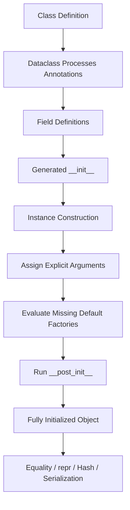
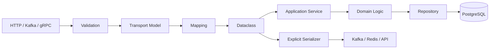

# 02- Fields and Defaults

## Overview

Dataclass fields define the state, construction contract, comparison behavior, representation, and often the invariants of a dataclass.

The `dataclasses.field()` function provides fine-grained control over fields when simple class annotations and defaults are insufficient.

In production code, field configuration matters because a seemingly small decision such as:

```python
items: list[str] = field(default_factory=list)
```

versus:

```python
items: list[str] = []
```

can determine whether instances are safely isolated or accidentally share mutable state.

Field configuration also controls:

- constructor participation
- default values
- default factories
- equality
- representation
- hashing
- keyword-only construction
- metadata
- initialization-only inputs
- class variables
- object layout when combined with `slots=True`

A useful mental model is:

```text
Dataclass Field
      │
      ├── Type annotation
      ├── Constructor behavior
      ├── Default / factory
      ├── Equality / ordering
      ├── Representation
      ├── Hash behavior
      ├── Metadata
      └── Runtime object state
```

Good field design makes object construction predictable and prevents invalid or ambiguous state from propagating through backend systems.

---

## Dataclass Field Fundamentals

A basic field is declared using an annotation:

```python
from dataclasses import dataclass


@dataclass
class User:
    user_id: int
    email: str
```

Each annotation becomes a dataclass field.

The fields determine the generated constructor:

```python
user = User(
    user_id=42,
    email="alice@example.com",
)
```

Internally, the dataclass machinery records field definitions and uses them when generating methods such as `__init__`, `__repr__`, and `__eq__`.

---

## `Field` Objects

The `dataclasses` module exposes field metadata through `fields()`:

```python
from dataclasses import dataclass, fields


@dataclass
class User:
    user_id: int
    email: str


for field_info in fields(User):
    print(field_info.name, field_info.type)
```

This can expose information such as:

- field name
- declared type
- default
- default factory
- initialization behavior
- representation behavior
- comparison behavior
- metadata
- keyword-only configuration

This is useful when implementing generic infrastructure, serializers, mappers, or framework integrations.

Application code should not inspect dataclass internals unnecessarily.

---

## `field()`

The primary mechanism for customizing a dataclass field is `field()`:

```python
from dataclasses import dataclass, field


@dataclass
class User:
    user_id: int
    email: str
    tags: list[str] = field(default_factory=list)
```

Conceptually:

```text
field()
  │
  ├── default
  ├── default_factory
  ├── init
  ├── repr
  ├── compare
  ├── hash
  ├── metadata
  └── kw_only
```

Not every option should be configured explicitly. Use the defaults unless the model has a specific requirement.

---

## Required Fields

A field without a default is required:

```python
@dataclass
class CreateUser:
    email: str
    display_name: str
```

The constructor requires both values:

```python
CreateUser(
    email="alice@example.com",
    display_name="Alice",
)
```

Required fields are appropriate when the object cannot have a meaningful state without the value.

For domain models, prefer required fields for essential invariants rather than allowing partially initialized objects.

---

## Fields with Defaults

A default makes a field optional during construction:

```python
@dataclass
class RetryPolicy:
    max_attempts: int = 3
    timeout_seconds: float = 5.0
```

Usage:

```python
policy = RetryPolicy()
```

produces:

```text
max_attempts = 3
timeout_seconds = 5.0
```

Defaults should represent safe, deterministic behavior.

Avoid defaults that silently hide missing required business information.

---

## Field Ordering

Required fields must precede fields with defaults.

Valid:

```python
@dataclass
class User:
    user_id: int
    email: str
    active: bool = True
```

Invalid:

```python
@dataclass
class User:
    active: bool = True
    user_id: int
```

This mirrors normal Python function argument rules.

The generated constructor would otherwise require a non-default argument after a default argument.

---

## Default Values

Use direct defaults for immutable values:

```python
@dataclass
class ServiceConfig:
    timeout_seconds: float = 5.0
    enabled: bool = True
    region: str = "ap-south-1"
```

Suitable defaults commonly include:

- strings
- integers
- floats
- booleans
- `None`
- immutable objects

For mutable objects, use `default_factory`.

---

## Mutable Defaults

Mutable defaults require special attention.

Avoid:

```python
@dataclass
class Request:
    headers: dict[str, str] = {}
```

Use:

```python
from dataclasses import dataclass, field


@dataclass
class Request:
    headers: dict[str, str] = field(default_factory=dict)
```

The factory is called separately for each instance.

```text
Request A ──► headers A
Request B ──► headers B
Request C ──► headers C
```

This prevents state leakage between instances.

Modern Python versions also reject many direct mutable built-in defaults in dataclasses rather than silently accepting them, but relying on that error instead of using `default_factory` is still the wrong design.

---

## `default_factory`

`default_factory` accepts a zero-argument callable used to construct a field's default value.

```python
from dataclasses import dataclass, field


@dataclass
class Job:
    name: str
    tags: list[str] = field(default_factory=list)
```

Each construction effectively performs:

```python
Job(name="sync", tags=list())
```

The factory is evaluated when the instance is created, not when the class is defined.

---

## Factory for Dictionaries

A common backend example:

```python
@dataclass
class RequestContext:
    headers: dict[str, str] = field(default_factory=dict)
    attributes: dict[str, object] = field(default_factory=dict)
```

Each request gets independent dictionaries.

This is useful for:

- request metadata
- headers
- feature flags
- temporary state
- parsed attributes

Do not use shared mutable objects for per-request state.

---

## Factory for Sets

```python
@dataclass
class Permissions:
    scopes: set[str] = field(default_factory=set)
```

This provides a fresh set per instance.

Set factories are useful when uniqueness is part of the data model.

---

## Factory with a Callable

The factory can be a custom function:

```python
from dataclasses import dataclass, field
from uuid import UUID, uuid4


@dataclass
class Job:
    job_id: UUID = field(default_factory=uuid4)
```

Each instance receives a new UUID.

This is a common pattern for generated identifiers.

However, consider whether IDs should be generated inside the model or assigned by a persistence layer or application service. That is a domain decision, not merely a dataclass decision.

---

## Time-Based Defaults

Do not evaluate dynamic defaults at import time.

Avoid:

```python
from datetime import datetime


@dataclass
class Job:
    created_at: datetime = datetime.now()
```

The timestamp would be created when the module is imported.

Use:

```python
from dataclasses import dataclass, field
from datetime import UTC, datetime


@dataclass
class Job:
    created_at: datetime = field(
        default_factory=lambda: datetime.now(UTC)
    )
```

Now each instance receives its own creation time.

For production systems, timezone-aware UTC timestamps are generally preferable.

---

## Factory Functions

A named factory can improve readability:

```python
from dataclasses import dataclass, field
from datetime import UTC, datetime


def utc_now() -> datetime:
    return datetime.now(UTC)


@dataclass
class Event:
    created_at: datetime = field(default_factory=utc_now)
```

This is often clearer than a lambda when the factory has semantic meaning or requires testing.

It also makes the behavior reusable.

---

## `default` vs `default_factory`

| Requirement | Use |
|---|---|
| Fixed immutable value | `default=` or direct assignment |
| Fresh list per instance | `default_factory=list` |
| Fresh dict per instance | `default_factory=dict` |
| Fresh set per instance | `default_factory=set` |
| Generated UUID | `default_factory=uuid4` |
| Current timestamp | `default_factory=utc_now` |
| Computed default | `default_factory=...` |

The important distinction is:

```text
default
→ store/use this value

default_factory
→ call this function for each instance
```

---

## Optionality vs Defaults

A default value does not necessarily mean the field is nullable.

For example:

```python
@dataclass
class RetryPolicy:
    max_attempts: int = 3
```

means:

```text
max_attempts always has an int value
```

It does not mean:

```text
max_attempts may be None
```

Compare:

```python
@dataclass
class User:
    nickname: str | None = None
```

Here the field is explicitly nullable.

This distinction is important in APIs, databases, and domain models.

---

## Default `None`

A `None` default is appropriate when absence has explicit semantic meaning:

```python
@dataclass
class User:
    user_id: int
    deleted_at: datetime | None = None
```

This represents:

```text
deleted_at = None
→ not deleted

deleted_at = timestamp
→ deleted
```

Do not use `None` merely because a value is inconvenient to provide.

---

## Empty Collection vs `None`

These represent different states:

```python
tags=[]
```

means:

```text
The object has zero tags.
```

while:

```python
tags=None
```

may mean:

```text
Tags were not supplied / are unknown / are not applicable.
```

Choose intentionally.

For collection fields where an empty collection is the natural state, prefer:

```python
tags: list[str] = field(default_factory=list)
```

---

## `init=False`

`init=False` excludes a field from the generated constructor.

```python
from dataclasses import dataclass, field


@dataclass
class Order:
    amount_cents: int
    amount_dollars: float = field(init=False)

    def __post_init__(self) -> None:
        self.amount_dollars = self.amount_cents / 100
```

Usage:

```python
order = Order(amount_cents=2500)
```

This is useful for:

- derived values
- internal caches
- computed state
- fields populated during initialization

It should not be used to hide required business inputs.

---

## Derived Fields

Derived fields can be useful when computation is stable and cheap:

```python
@dataclass
class Rectangle:
    width: float
    height: float
    area: float = field(init=False)

    def __post_init__(self) -> None:
        self.area = self.width * self.height
```

But storing derived state introduces a consistency problem:

```text
width/height change
       │
       ▼
area may become stale
```

For mutable models, prefer a property when the value should always reflect current state:

```python
@dataclass
class Rectangle:
    width: float
    height: float

    @property
    def area(self) -> float:
        return self.width * self.height
```

For immutable models, either approach may be appropriate depending on performance and API requirements.

---

## `repr`

By default, fields participate in generated `repr`.

```python
@dataclass
class User:
    user_id: int
    email: str
```

Example:

```text
User(user_id=42, email='alice@example.com')
```

This is useful for debugging, tests, and logs.

However, generated representations can expose confidential information.

---

## Hiding Fields from `repr`

Use:

```python
from dataclasses import dataclass, field


@dataclass
class Credentials:
    username: str
    password: str = field(repr=False)
```

Now the generated representation does not include the password.

Use this for:

- passwords
- API tokens
- access tokens
- session secrets
- private credentials

This is defense-in-depth. Sensitive data should also be excluded from application logs and tracing systems.

---

## `compare`

Fields participate in generated equality by default.

```python
@dataclass
class Job:
    job_id: int
    trace_id: str
```

Both fields influence:

```python
job_a == job_b
```

A field can be excluded:

```python
from dataclasses import dataclass, field


@dataclass
class Job:
    job_id: int
    trace_id: str = field(compare=False)
```

Now `trace_id` does not affect generated equality.

This is appropriate for fields that are operational metadata rather than business identity.

---

## Equality Design

Consider:

```python
@dataclass
class User:
    user_id: int
    email: str
    last_seen_at: datetime
```

Should two users with the same `user_id` but different `last_seen_at` compare equal?

Generated dataclass equality says no.

If domain semantics say identity is based only on `user_id`, a dataclass's default equality may be inappropriate.

Possible solutions include:

- custom `__eq__`
- an explicit entity class
- a value object
- `compare=False` for non-identity fields

Do not accept generated equality without considering domain semantics.

---

## `hash`

`hash` controls whether a field participates in generated hashing when hashing is enabled.

Example:

```python
from dataclasses import dataclass, field


@dataclass(frozen=True)
class User:
    user_id: int
    cache_metadata: str = field(hash=False)
```

Hash behavior should generally remain aligned with equality.

Avoid configuring `hash=True` for a field that is excluded from equality.

A fundamental invariant is:

```text
a == b
→ hash(a) == hash(b)
```

---

## `hash=False` and `compare=True`

A field can participate in equality but be excluded from hashing:

```python
@dataclass(frozen=True)
class Record:
    identifier: int
    description: str = field(hash=False)
```

This can make sense when hashing a field is expensive but equality still needs to inspect it.

Use this only when the performance tradeoff is understood.

Hash configuration should not be treated as a casual optimization.

---

## `kw_only`

A field can be made keyword-only:

```python
from dataclasses import dataclass, field


@dataclass
class ClientConfig:
    host: str
    port: int
    timeout_seconds: float = field(
        default=5.0,
        kw_only=True,
    )
```

Usage:

```python
config = ClientConfig(
    "db.internal",
    5432,
    timeout_seconds=10.0,
)
```

This prevents accidental positional construction:

```python
ClientConfig("db.internal", 5432, 10.0)
```

Keyword-only fields are useful for optional configuration and APIs where readability matters.

---

## Class-Level `kw_only`

The dataclass itself can make all fields keyword-only:

```python
from dataclasses import dataclass


@dataclass(kw_only=True)
class ServiceConfig:
    host: str
    port: int
    timeout_seconds: float = 5.0
```

Usage:

```python
config = ServiceConfig(
    host="db.internal",
    port=5432,
    timeout_seconds=10.0,
)
```

This is often useful for configuration-heavy objects.

---

## `metadata`

Fields support arbitrary metadata:

```python
from dataclasses import dataclass, field


@dataclass
class User:
    user_id: int = field(
        metadata={"db_column": "id"}
    )
    email: str = field(
        metadata={"db_column": "email_address"}
    )
```

Metadata can be inspected:

```python
from dataclasses import fields


for field_info in fields(User):
    print(field_info.name, field_info.metadata)
```

Metadata is application- or framework-defined.

Python's dataclass machinery does not automatically interpret:

```python
{"db_column": "id"}
```

as a database mapping.

---

## Metadata Design

Use metadata for stable, narrowly scoped integration information.

Good:

```python
field(
    metadata={"redact": True}
)
```

if your logging or serialization infrastructure explicitly understands it.

Avoid turning metadata into an undocumented configuration language:

```python
field(
    metadata={
        "db_column": "...",
        "api_name": "...",
        "graphql_name": "...",
        "kafka_name": "...",
        "validation": "...",
        "permission": "...",
    }
)
```

At that point, a dedicated schema or framework model may be clearer.

---

## `ClassVar` Is Not a Field

Use `ClassVar` for class-level state:

```python
from dataclasses import dataclass
from typing import ClassVar


@dataclass
class RetryPolicy:
    max_attempts: int
    DEFAULT_TIMEOUT: ClassVar[float] = 5.0
```

`DEFAULT_TIMEOUT` is not an instance field.

It does not appear in:

```python
fields(RetryPolicy)
```

and is not included in the generated constructor.

---

## `InitVar`

`InitVar` represents a constructor input that is passed to `__post_init__` but is not stored as a dataclass field.

```python
from dataclasses import InitVar, dataclass


@dataclass
class User:
    email: str
    normalized_email: str = ""
    raw_email: InitVar[str | None] = None

    def __post_init__(self, raw_email: str | None) -> None:
        if raw_email is not None:
            self.normalized_email = raw_email.strip().lower()
```

`raw_email` participates in initialization but does not become persistent instance state.

Use it when an initialization input is intentionally transient.

---

## `InitVar` vs Normal Field

| Requirement | Normal field | `InitVar` |
|---|---:|---:|
| Stored on instance | Yes | No |
| Appears in `fields()` | Yes | No |
| Passed to `__post_init__` | Yes | Yes |
| Constructor argument | Usually | Yes |
| Represents persistent state | Yes | No |

If the value remains meaningful after initialization, it usually should be a normal field.

---

## `__post_init__` and Defaults

`__post_init__` runs after the generated constructor assigns fields.

```python
from dataclasses import dataclass, field


@dataclass
class User:
    email: str
    normalized_email: str = field(init=False)

    def __post_init__(self) -> None:
        self.normalized_email = self.email.strip().lower()
```

The lifecycle is approximately:

```text
User(...)
   │
   ▼
Generated __init__
   │
   ├── Assign email
   └── Assign defaults
   │
   ▼
__post_init__()
   │
   ▼
Fully initialized object
```

This makes `__post_init__` useful for local construction invariants.

---

## `__post_init__` Should Stay Focused

Good:

```python
@dataclass
class Percentage:
    value: float

    def __post_init__(self) -> None:
        if not 0 <= self.value <= 100:
            raise ValueError("percentage out of range")
```

Poor:

```python
@dataclass
class User:
    email: str

    def __post_init__(self) -> None:
        # Database access
        # HTTP request
        # Kafka publishing
        # Redis lookup
        # Authorization
        ...
```

Object construction should generally be deterministic and cheap.

External I/O in initialization makes testing, retries, failure handling, and lifecycle management harder.

---

## Fields with `slots=True`

Field configuration also interacts with object layout.

```python
from dataclasses import dataclass, field


@dataclass(slots=True)
class Event:
    event_id: str
    attributes: dict[str, str] = field(default_factory=dict)
```

The declared fields participate in generated slots.

This can reduce memory overhead for large numbers of objects.

However, the underlying field values remain normal Python objects. Slots do not make dictionaries, lists, or nested objects immutable.

---

## Field Defaults and `slots`

Slots do not change the need for safe defaults.

This remains correct:

```python
@dataclass(slots=True)
class Request:
    headers: dict[str, str] = field(default_factory=dict)
```

The relevant concerns are independent:

```text
default_factory
→ instance isolation

slots
→ attribute storage/layout
```

Do not confuse the two.

---

## Frozen Dataclasses and Fields

Fields behave differently when the dataclass is frozen:

```python
from dataclasses import dataclass, field


@dataclass(frozen=True)
class User:
    user_id: int
    tags: tuple[str, ...] = field(default_factory=tuple)
```

The tuple default is both:

- fresh when created
- immutable

This is a strong pattern for value objects.

For mutable nested structures:

```python
@dataclass(frozen=True)
class User:
    tags: list[str] = field(default_factory=list)
```

the list itself remains mutable.

---

## Field Defaults and Immutability

For deeply immutable models, prefer immutable types:

| Mutable type | Immutable alternative |
|---|---|
| `list[T]` | `tuple[T, ...]` |
| `set[T]` | `frozenset[T]` |
| `dict[K, V]` | immutable mapping abstraction |
| mutable nested object | frozen value object |

For example:

```python
@dataclass(frozen=True)
class User:
    roles: frozenset[str] = field(
        default_factory=frozenset
    )
```

This is safer for shared configuration and concurrent read-heavy systems.

---

## Factory Evaluation Timing

This distinction is important:

```python
@dataclass
class A:
    created_at: datetime = datetime.now(UTC)
```

evaluates the timestamp during class/module creation.

Whereas:

```python
@dataclass
class B:
    created_at: datetime = field(
        default_factory=lambda: datetime.now(UTC)
    )
```

evaluates it for each instance.

The difference is:

```text
default
→ evaluated when the class definition is executed

default_factory
→ called when an instance needs the default
```

This is one of the most important dataclass field concepts.

---

## Default Factories and Dependency Injection

A factory can create a dependency:

```python
@dataclass
class RequestContext:
    request_id: UUID = field(default_factory=uuid4)
```

This is reasonable for self-contained values.

It becomes less desirable when the factory hides application dependencies:

```python
@dataclass
class Service:
    client: ApiClient = field(
        default_factory=create_api_client
    )
```

This makes dependency injection and testing less explicit.

For service dependencies, prefer constructor injection:

```python
@dataclass
class Service:
    client: ApiClient
```

The distinction is:

```text
Data creation
→ default_factory can be appropriate

Infrastructure dependency
→ explicit dependency injection is usually better
```

---

## Configuration Models

Dataclass fields work well for internal configuration:

```python
from dataclasses import dataclass


@dataclass(frozen=True)
class DatabaseConfig:
    host: str
    port: int = 5432
    pool_size: int = 10
    timeout_seconds: float = 5.0
```

Configuration is often immutable after application startup.

For environment variables and untrusted configuration files, parse and validate the input before constructing the dataclass.

---

## REST API Example

A typical API architecture might use Pydantic at the boundary and dataclasses internally:

```python
from dataclasses import dataclass

from pydantic import BaseModel


class CreateUserRequest(BaseModel):
    email: str
    display_name: str


@dataclass(frozen=True)
class CreateUserCommand:
    email: str
    display_name: str
```

The flow becomes:

```text
HTTP JSON
   │
   ▼
Pydantic validation
   │
   ▼
CreateUserCommand
   │
   ▼
Application service
```

Fields therefore define the internal application contract without making the dataclass responsible for HTTP validation.

---

## Database Mapping

Suppose PostgreSQL contains:

```text
users
├── id
├── email
├── created_at
└── deleted_at
```

An application dataclass might be:

```python
@dataclass(frozen=True)
class User:
    user_id: int
    email: str
    created_at: datetime
    deleted_at: datetime | None
```

The database column names and Python field names need not be identical.

A repository or mapper can translate:

```text
PostgreSQL row
      │
      ▼
Mapper
      │
      ▼
User dataclass
```

This keeps persistence representation separate from application representation.

---

## Kafka Event Example

An event model may use fields with explicit defaults:

```python
@dataclass(frozen=True)
class UserUpdated:
    event_id: UUID
    user_id: int
    occurred_at: datetime
    source: str = "user-service"
```

Before publishing, the event must be serialized into an explicit wire format.

Do not assume dataclass field defaults automatically provide Kafka schema compatibility.

When events are durable distributed contracts, consider:

- schema versioning
- backward compatibility
- explicit serialization
- required vs optional fields
- consumer rollout strategy
- dead-letter handling

---

## API and Schema Evolution

Adding a default can help maintain constructor compatibility:

```python
@dataclass
class User:
    user_id: int
    email: str
    status: str = "active"
```

Existing code that constructs:

```python
User(1, "alice@example.com")
```

continues to work.

However, this does not automatically make a distributed API backward compatible.

There are two separate contracts:

```text
Python constructor compatibility
≠
Wire protocol compatibility
```

This distinction is critical in microservices.

---

## Field Aliases

Dataclasses do not natively provide a general-purpose field alias system equivalent to Pydantic.

If your internal model uses:

```python
user_id
```

but an API requires:

```json
{
  "id": 42
}
```

perform explicit mapping or use a serialization layer.

Avoid embedding transport-specific naming conventions into every domain dataclass unless the model is intentionally a transport model.

---

## Field Metadata for Serialization

A custom serializer can use metadata:

```python
from dataclasses import dataclass, field


@dataclass
class User:
    user_id: int = field(
        metadata={"json_name": "id"}
    )
```

A serializer could inspect this metadata.

However, this creates coupling between the dataclass and the serializer.

Prefer explicit serializers when the wire contract is important enough to require precise control.

---

## Performance of Field Factories

A default factory runs during every relevant object construction.

For inexpensive factories:

```python
field(default_factory=list)
```

the overhead is normally negligible.

For expensive factories:

```python
field(default_factory=load_configuration)
```

the cost can become significant.

Do not use a field factory to perform expensive computation or network access.

If creation is expensive, make the operation explicit.

---

## Memory Considerations

Every instance stores its field values.

For an object such as:

```python
@dataclass
class Event:
    event_id: str
    event_type: str
    payload: dict[str, object]
    tags: list[str]
```

the memory cost includes:

- the dataclass instance
- references to each field
- the dictionary object
- dictionary entries
- list object
- list elements
- referenced strings/objects

`slots=True` can reduce instance-level overhead but does not eliminate the cost of referenced objects.

For very large collections, consider whether an object-per-record representation is appropriate at all.

---

## Concurrency Considerations

Field defaults can affect thread and task isolation.

This is safe:

```python
@dataclass
class RequestState:
    values: dict[str, object] = field(default_factory=dict)
```

Each request object gets independent state.

This is dangerous conceptually:

```python
shared_state: dict[str, object] = {}
```

when shared mutable state is unintentionally reused between requests.

`default_factory` solves per-instance isolation, but it does not make shared application state thread-safe.

For genuinely shared state, use appropriate synchronization or external coordination such as Redis.

---

## Security Considerations

Field configuration can affect information exposure.

### Sensitive fields

Use:

```python
secret: str = field(repr=False)
```

### Untrusted values

Defaults should not bypass validation:

```python
@dataclass
class User:
    is_admin: bool = False
```

A missing field should not accidentally become an authorization decision if the request layer has different semantics.

### Serialization

Never automatically expose every dataclass field through an API merely because `asdict()` makes it easy.

Define explicit public representations.

---

## Reliability Considerations

Good defaults should make invalid or dangerous states difficult to construct.

Prefer:

```python
@dataclass(frozen=True)
class RetryPolicy:
    max_attempts: int = 3
    timeout_seconds: float = 5.0
```

combined with validation:

```python
def __post_init__(self) -> None:
    if self.max_attempts < 1:
        raise ValueError("max_attempts must be positive")

    if self.timeout_seconds <= 0:
        raise ValueError("timeout must be positive")
```

Avoid defaults that hide configuration failures.

For infrastructure settings, failing fast at startup is often better than silently using an unsafe fallback.

---

## Testing Field Behavior

Test meaningful field semantics.

```python
from dataclasses import dataclass, field


@dataclass
class RequestContext:
    headers: dict[str, str] = field(default_factory=dict)


def test_headers_are_not_shared() -> None:
    first = RequestContext()
    second = RequestContext()

    first.headers["x-request-id"] = "abc"

    assert second.headers == {}
```

Test dynamic defaults:

```python
def test_each_job_gets_unique_id() -> None:
    first = Job()
    second = Job()

    assert first.job_id != second.job_id
```

Test domain invariants separately from dataclass-generated behavior.

---

## Testing `repr` Safety

Sensitive fields should not appear in representations:

```python
def test_password_is_hidden_from_repr() -> None:
    credentials = Credentials(
        username="alice",
        password="secret",
    )

    assert "secret" not in repr(credentials)
```

This protects against accidental exposure through:

- assertion failures
- debug logs
- exception messages
- tracing
- interactive debugging

---

## Testing Defaults vs Explicit Values

A good test suite distinguishes default behavior from explicit overrides:

```python
def test_retry_policy_default() -> None:
    policy = RetryPolicy()

    assert policy.max_attempts == 3


def test_retry_policy_override() -> None:
    policy = RetryPolicy(max_attempts=5)

    assert policy.max_attempts == 5
```

This ensures the constructor contract remains intentional.

---

## Common Mistakes

### Using Mutable Defaults

Bad:

```python
items: list[str] = []
```

Use:

```python
items: list[str] = field(default_factory=list)
```

### Calling Dynamic Functions for Defaults

Bad:

```python
created_at: datetime = datetime.now(UTC)
```

Use:

```python
created_at: datetime = field(default_factory=utc_now)
```

### Confusing Default with Optionality

This:

```python
timeout: int = 5
```

does not mean:

```text
timeout can be None
```

### Making Infrastructure Dependencies Default Factories

This hides dependencies and makes testing harder.

### Using `init=False` to Hide Required Inputs

If the caller must supply a business-critical value, make it explicit.

### Overusing Metadata

Metadata should not become a replacement for a proper schema or model framework.

### Ignoring Equality Semantics

Generated equality may not represent entity identity.

### Assuming Frozen Means Deeply Immutable

Nested lists and dictionaries remain mutable.

---

## Production Pitfalls

### Import-Time Defaults

Dynamic values accidentally evaluated at module import can remain stale for the lifetime of the process.

### Hidden State

Derived or `init=False` fields can become stale if mutable source fields change.

### Shared Mutable State

Incorrect factories or external shared objects can create cross-request state leakage.

### Sensitive `repr`

Generated representations can leak credentials and personally identifiable information.

### Overloaded Models

A single dataclass used simultaneously as:

```text
HTTP request
+
domain model
+
database row
+
Kafka event
```

usually accumulates conflicting responsibilities.

### Defaults Hiding Configuration Errors

A convenient fallback can cause a service to run with incorrect production behavior instead of failing fast.

---

## Field Selection by Responsibility

| Field Requirement | Recommended Approach |
|---|---|
| Required business value | Normal annotated field |
| Fixed immutable default | Direct default |
| Fresh mutable value | `default_factory` |
| Generated identifier | Factory or explicit service-generated ID |
| Current timestamp | `default_factory` |
| Constructor-only input | `InitVar` |
| Derived state | Property or carefully controlled `init=False` field |
| Sensitive value | `repr=False` |
| Operational metadata | `compare=False` when equality should ignore it |
| Expensive-to-hash field | Consider `hash=False` only with measured rationale |
| Keyword-only configuration | `kw_only=True` |
| Framework-specific information | Narrow `metadata` |
| Class-level constant | `ClassVar` |

---

## Recommended Field Design Pattern

A production-oriented value object might look like:

```python
from dataclasses import dataclass, field
from datetime import UTC, datetime
from uuid import UUID, uuid4


def utc_now() -> datetime:
    return datetime.now(UTC)


@dataclass(frozen=True, slots=True)
class PaymentRequest:
    customer_id: int
    amount_cents: int
    currency: str
    request_id: UUID = field(default_factory=uuid4)
    created_at: datetime = field(default_factory=utc_now)
    metadata: tuple[tuple[str, str], ...] = field(default_factory=tuple)
    secret: str = field(repr=False, compare=False)

    def __post_init__(self) -> None:
        if self.customer_id <= 0:
            raise ValueError("customer_id must be positive")

        if self.amount_cents <= 0:
            raise ValueError("amount_cents must be positive")

        if len(self.currency) != 3:
            raise ValueError("currency must be a three-letter code")
```

This combines several production-oriented techniques:

- explicit required fields
- dynamic defaults
- immutable defaults
- immutable object state
- slots
- sensitive-field protection
- explicit equality semantics
- local invariant validation

The exact combination should still be driven by domain requirements rather than convention.

---

## Dataclass Field Lifecycle

A useful conceptual lifecycle is:



The important distinction is that field configuration affects both construction and downstream object behavior.

---

## Production Architecture

Field design becomes especially important when a model crosses application boundaries.



A dataclass field should represent the contract of the layer where the dataclass lives.

This prevents accidental coupling such as:

```text
PostgreSQL NULL
      ↓
Python None
      ↓
API missing field
```

These may be three different semantics and should not automatically be treated as equivalent.

---

## Backend Engineering Guidelines

For application and domain dataclasses:

- Keep required business fields explicit.
- Use immutable defaults directly.
- Use `default_factory` for per-instance mutable or dynamically generated values.
- Prefer UTC-aware timestamps.
- Distinguish nullable fields from fields with defaults.
- Use `kw_only=True` for configuration-heavy constructors.
- Use `repr=False` for secrets and sensitive values.
- Use `compare=False` for operational metadata when appropriate.
- Treat hash configuration as a semantic decision, not a convenience.
- Use `InitVar` only for genuinely transient constructor inputs.
- Keep `__post_init__` deterministic and free of external I/O.
- Prefer properties over stored derived fields when mutable source state can change.
- Use `frozen=True` for genuine immutable value objects.
- Combine `frozen=True` with immutable nested types when deep immutability matters.
- Consider `slots=True` for high-volume objects after measuring memory impact.
- Keep metadata narrow and documented.
- Separate transport, domain, and persistence models when their contracts differ.
- Do not expose all fields automatically through REST or event serialization.
- Validate untrusted input before constructing trusted internal models.
- Test field semantics that affect correctness, security, or reliability.

---

## Interview Traps

### What is the difference between `default` and `default_factory`?

`default` provides a value, while `default_factory` provides a callable that creates a value for each instance.

### Why should mutable defaults use `default_factory`?

Because each instance should normally receive its own mutable object rather than sharing state.

### When should you use `init=False`?

When a field should not be accepted by the generated constructor, typically because it is derived or populated internally.

### Does `field(default_factory=list)` execute when the class is defined?

No. The factory is called when an instance needs the default.

### Does `frozen=True` make a list field immutable?

No. It prevents rebinding the field but does not freeze the list itself.

### What does `compare=False` do?

It excludes the field from generated equality comparisons.

### What does `repr=False` do?

It excludes the field from the generated `repr`, which is useful for secrets and sensitive information.

### What is `InitVar`?

A constructor-only input passed to `__post_init__` that is not stored as a normal dataclass field.

### What is `ClassVar`?

A type annotation indicating class-level state rather than an instance field.

### Does dataclass metadata have built-in semantics?

No. Metadata is available for application or framework-specific interpretation.

### Does adding a default make an API backward compatible?

Not necessarily. It may preserve Python constructor compatibility while the external wire schema remains incompatible.

### Should infrastructure dependencies use `default_factory`?

Usually not. Explicit dependency injection is clearer and easier to test.

---

## Production Checklist

- [ ] Are required fields explicitly required?
- [ ] Are fields with defaults placed after required fields?
- [ ] Are mutable defaults using `default_factory`?
- [ ] Are dynamic values such as timestamps created per instance?
- [ ] Are defaults semantically different from `None`?
- [ ] Is `None` used only when absence has explicit meaning?
- [ ] Are derived fields better represented as properties?
- [ ] Is `init=False` being used for a legitimate internal field?
- [ ] Are constructor-only inputs appropriate for `InitVar`?
- [ ] Are class-level constants marked with `ClassVar`?
- [ ] Are sensitive fields excluded from `repr`?
- [ ] Are operational fields excluded from equality when appropriate?
- [ ] Is hashing consistent with equality?
- [ ] Would keyword-only fields improve constructor safety?
- [ ] Is metadata narrowly scoped and documented?
- [ ] Are nested mutable objects appropriate for the model?
- [ ] If frozen, is deeper immutability required?
- [ ] Would `slots=True` provide measurable value?
- [ ] Does `__post_init__` avoid external I/O?
- [ ] Are runtime validation responsibilities clearly separated?
- [ ] Are API, domain, persistence, and event models intentionally separated?
- [ ] Are serialized field contracts explicitly defined?
- [ ] Are defaults safe for production behavior?
- [ ] Are field semantics covered by tests?
- [ ] Have memory and construction costs been measured for high-volume models?

## Key Takeaways

- **Use direct defaults for immutable values and `default_factory` for mutable or dynamically generated values**, because factories create the default at instance construction time.
- **Field configuration defines more than constructor behavior**: `init`, `repr`, `compare`, `hash`, `kw_only`, and metadata influence how models are created, compared, represented, and integrated.
- **Distinguish missing, nullable, and empty values explicitly**; `None`, an empty collection, and a concrete default often represent different business states.
- **Treat fields as part of an architectural contract**: separate transport, domain, persistence, and distributed-event models when their responsibilities or evolution requirements differ.
- **Design defaults and field behavior for production safety**: avoid hidden dependencies, stale dynamic defaults, sensitive `repr` output, accidental shared state, and defaults that conceal configuration or validation failures.