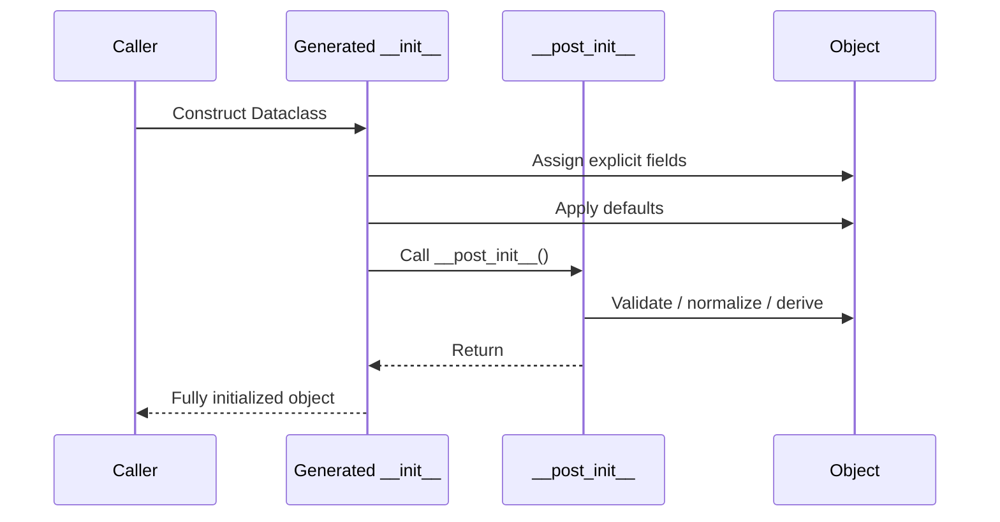
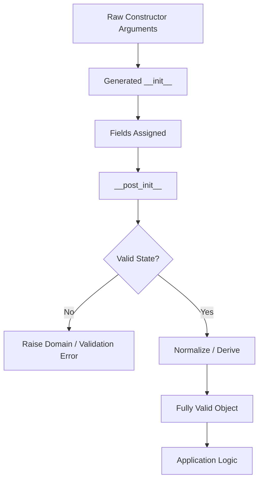

# 03- Post Initialization

## Overview

`__post_init__()` is the standard dataclass hook for executing additional initialization logic after the generated `__init__()` method has assigned the fields.

It is useful when object construction requires logic that cannot be expressed through field defaults alone, such as:

- validating local invariants
- normalizing values
- computing derived state
- coordinating multiple fields
- processing `InitVar` inputs

The important lifecycle is:

```text
Dataclass constructor
        │
        ▼
Generated __init__()
        │
        ├── Assign explicit arguments
        ├── Apply defaults
        └── Call __post_init__()
                    │
                    ▼
             Fully initialized object
```

`__post_init__()` is **not** a general-purpose application lifecycle hook. It should normally remain deterministic, local to the object, and free of external I/O.

A strong production mental model is:

> `__post_init__()` establishes the invariants of an object immediately after its fields have been initialized.

---

## Why `__post_init__()` Exists

The generated dataclass constructor is intentionally simple.

For:

```python
from dataclasses import dataclass


@dataclass
class Money:
    amount_cents: int
    currency: str
```

Python can generate the basic assignments:

```python
def __init__(self, amount_cents: int, currency: str) -> None:
    self.amount_cents = amount_cents
    self.currency = currency
```

But some models require additional work:

```python
@dataclass
class Money:
    amount_cents: int
    currency: str

    def __post_init__(self) -> None:
        if self.amount_cents < 0:
            raise ValueError("amount cannot be negative")

        self.currency = self.currency.upper()
```

The generated constructor handles assignment while `__post_init__()` handles object-specific initialization rules.

---

## Basic Example

```python
from dataclasses import dataclass


@dataclass
class User:
    email: str

    def __post_init__(self) -> None:
        self.email = self.email.strip().lower()
```

Now:

```python
user = User("  Alice@Example.com  ")

assert user.email == "alice@example.com"
```

The normalization happens immediately after construction.

---

## Execution Order

For a dataclass without inheritance, the lifecycle is conceptually:



This ordering is important.

By the time `__post_init__()` runs, normal dataclass fields have already been assigned by the generated constructor.

---

## What `__post_init__()` Receives

A normal `__post_init__()` method takes `self`:

```python
def __post_init__(self) -> None:
    ...
```

If the dataclass contains `InitVar` fields, those values are passed as additional arguments.

```python
from dataclasses import InitVar, dataclass


@dataclass
class User:
    email: str
    raw_email: InitVar[str | None] = None

    def __post_init__(self, raw_email: str | None) -> None:
        if raw_email is not None:
            self.email = raw_email.strip().lower()
```

The `InitVar` value participates in initialization but is not stored as a normal dataclass field.

---

## `__post_init__()` Is Called by the Generated Constructor

A crucial detail is that `__post_init__()` is automatically called when the dataclass decorator generates `__init__()`.

For:

```python
@dataclass
class User:
    email: str

    def __post_init__(self) -> None:
        ...
```

the generated constructor effectively behaves like:

```python
def __init__(self, email: str) -> None:
    self.email = email
    self.__post_init__()
```

This is conceptual rather than the exact source generated internally.

---

## When `__post_init__()` Is Not Automatically Called

If you define your own `__init__()`, dataclasses do not automatically call `__post_init__()` from that custom constructor.

For example:

```python
from dataclasses import dataclass


@dataclass
class User:
    email: str

    def __init__(self, email: str) -> None:
        self.email = email

    def __post_init__(self) -> None:
        self.email = self.email.strip().lower()
```

The custom `__init__()` does not automatically invoke `__post_init__()`.

If you intentionally write a custom constructor, you must decide whether to call it:

```python
def __init__(self, email: str) -> None:
    self.email = email
    self.__post_init__()
```

In practice, if the generated constructor is sufficient, keeping it is usually preferable.

---

## Validation

One of the most useful applications is validating local invariants.

```python
from dataclasses import dataclass


@dataclass
class Port:
    value: int

    def __post_init__(self) -> None:
        if not 1 <= self.value <= 65535:
            raise ValueError("port must be between 1 and 65535")
```

This ensures:

```text
Port(value=5432)
    │
    ▼
valid object
```

while:

```text
Port(value=70000)
    │
    ▼
ValueError
```

This is particularly useful for domain value objects.

---

## Local Invariants

An invariant is a condition that should remain true for a valid object.

Example:

```python
from dataclasses import dataclass


@dataclass(frozen=True)
class Percentage:
    value: float

    def __post_init__(self) -> None:
        if not 0 <= self.value <= 100:
            raise ValueError("percentage must be between 0 and 100")
```

The object cannot be successfully constructed with an invalid percentage.

This creates a useful guarantee:

```text
If Percentage exists
→ its value is within the valid range
```

That guarantee simplifies downstream business logic.

---

## Cross-Field Validation

`__post_init__()` is particularly useful when validity depends on multiple fields.

```python
from dataclasses import dataclass


@dataclass(frozen=True)
class DateRange:
    start: datetime
    end: datetime

    def __post_init__(self) -> None:
        if self.end < self.start:
            raise ValueError("end must not precede start")
```

Neither field is invalid individually.

The invalidity comes from their relationship.

This is a strong use case for post-initialization validation.

---

## Normalization

Normalization converts equivalent input representations into one canonical internal representation.

```python
from dataclasses import dataclass


@dataclass
class Customer:
    email: str
    country: str

    def __post_init__(self) -> None:
        self.email = self.email.strip().lower()
        self.country = self.country.strip().upper()
```

Now downstream code can rely on normalized values.

This can reduce repeated normalization across services.

However, normalization should be predictable and domain-appropriate.

---

## Validation vs Normalization

These are related but different responsibilities.

| Operation | Purpose |
|---|---|
| Validation | Reject invalid state |
| Normalization | Convert valid equivalent inputs into canonical form |
| Derivation | Compute state from existing fields |
| Enrichment | Add external information |
| Persistence | Store data externally |

`__post_init__()` is well suited to the first three.

It is generally a poor place for enrichment or persistence.

---

## Derived Fields

A derived field can be initialized after the input fields exist:

```python
from dataclasses import dataclass, field


@dataclass
class Order:
    amount_cents: int
    amount_dollars: float = field(init=False)

    def __post_init__(self) -> None:
        self.amount_dollars = self.amount_cents / 100
```

This is appropriate when the derived value is intentionally stored.

However, if source fields can change later, stored derived state can become stale.

A property may be safer:

```python
@dataclass
class Order:
    amount_cents: int

    @property
    def amount_dollars(self) -> float:
        return self.amount_cents / 100
```

For mutable models, prefer a property when the derived value is cheap to calculate.

---

## Multiple Derived Fields

Multiple fields can be derived:

```python
from dataclasses import dataclass, field


@dataclass
class Order:
    subtotal_cents: int
    tax_cents: int
    total_cents: int = field(init=False)

    def __post_init__(self) -> None:
        if self.subtotal_cents < 0:
            raise ValueError("subtotal cannot be negative")

        if self.tax_cents < 0:
            raise ValueError("tax cannot be negative")

        self.total_cents = self.subtotal_cents + self.tax_cents
```

The object establishes its invariant during construction.

---

## `InitVar` and `__post_init__()`

`InitVar` is specifically useful when construction requires temporary input.

```python
from dataclasses import InitVar, dataclass


@dataclass
class User:
    email: str
    raw_email: InitVar[str | None] = None

    def __post_init__(self, raw_email: str | None) -> None:
        if raw_email is not None:
            self.email = raw_email.strip().lower()
```

Conceptually:

```text
Constructor input
      │
      ├── normal field ─────► stored on object
      │
      └── InitVar ──────────► __post_init__()
                                  │
                                  ▼
                              discarded
```

Use this when the initialization input itself should not become persistent object state.

---

## `InitVar` Example with Derived State

```python
from dataclasses import InitVar, dataclass


@dataclass
class User:
    normalized_email: str
    raw_email: InitVar[str]

    def __post_init__(self, raw_email: str) -> None:
        normalized = raw_email.strip().lower()

        if "@" not in normalized:
            raise ValueError("invalid email")

        self.normalized_email = normalized
```

A cleaner design may simply make `email` the normal field and perform normalization inside `__post_init__()`.

`InitVar` is most useful when the construction input is meaningfully different from the final stored state.

---

## Frozen Dataclasses

`__post_init__()` also works with frozen dataclasses.

```python
from dataclasses import dataclass


@dataclass(frozen=True)
class Money:
    amount_cents: int
    currency: str

    def __post_init__(self) -> None:
        if self.amount_cents < 0:
            raise ValueError("amount cannot be negative")
```

The validation does not require mutation.

---

## Assigning Fields in Frozen Dataclasses

If initialization must assign a derived field in a frozen dataclass, use `object.__setattr__()`.

```python
from dataclasses import dataclass, field


@dataclass(frozen=True)
class Order:
    amount_cents: int
    amount_dollars: float = field(init=False)

    def __post_init__(self) -> None:
        object.__setattr__(
            self,
            "amount_dollars",
            self.amount_cents / 100,
        )
```

This is an intentional escape hatch provided for initialization logic.

Use it sparingly.

If many fields require `object.__setattr__()`, the model may be overly complicated.

---

## Frozen Models and Invariants

A useful pattern is:

```text
Constructor
   │
   ▼
Validate inputs
   │
   ▼
Normalize / derive
   │
   ▼
Freeze object
   │
   ▼
Immutable valid state
```

This works well for:

- money
- identifiers
- configuration
- commands
- immutable events
- domain value objects

---

## `slots=True` and `__post_init__()`

Slots do not fundamentally change post-initialization behavior:

```python
from dataclasses import dataclass


@dataclass(slots=True)
class User:
    email: str

    def __post_init__(self) -> None:
        self.email = self.email.strip().lower()
```

The generated constructor still initializes fields and invokes `__post_init__()`.

The main difference is object layout and attribute storage.

---

## Inheritance

Dataclass inheritance requires careful attention to initialization.

Consider:

```python
from dataclasses import dataclass


@dataclass
class Event:
    event_id: str

    def __post_init__(self) -> None:
        self.event_id = self.event_id.strip()


@dataclass
class UserCreated(Event):
    user_id: int

    def __post_init__(self) -> None:
        self.user_id = int(self.user_id)
```

The subclass's `__post_init__()` does not automatically call the base class's `__post_init__()`.

Use:

```python
@dataclass
class UserCreated(Event):
    user_id: int

    def __post_init__(self) -> None:
        super().__post_init__()
        self.user_id = int(self.user_id)
```

This is an important inheritance trap.

---

## `super().__post_init__()`

When overriding `__post_init__()` in a dataclass hierarchy, explicitly call the parent implementation when its invariants are required.

```python
@dataclass
class BaseModel:
    name: str

    def __post_init__(self) -> None:
        self.name = self.name.strip()


@dataclass
class User(BaseModel):
    email: str

    def __post_init__(self) -> None:
        super().__post_init__()
        self.email = self.email.strip().lower()
```

The execution order becomes:

```text
User.__post_init__()
        │
        ▼
BaseModel.__post_init__()
        │
        ▼
User-specific initialization
```

---

## Multiple Inheritance

Multiple inheritance makes post-initialization more subtle.

If multiple classes define `__post_init__()`, blindly calling `super()` assumes the hierarchy is designed cooperatively.

For complex inheritance trees:

- understand the MRO
- ensure each class participates consistently
- avoid hidden initialization ordering dependencies
- prefer composition when possible

Dataclass inheritance is convenient for simple hierarchies but should not become a substitute for deliberate object architecture.

---

## Inheritance and Field Ordering

Inherited fields participate in the generated constructor.

For example:

```python
@dataclass
class Base:
    identifier: int


@dataclass
class Child(Base):
    name: str
```

produces a constructor conceptually similar to:

```python
Child(identifier=1, name="example")
```

Defaults across inheritance hierarchies can create ordering conflicts.

Keep inheritance shallow and verify the resulting constructor explicitly.

---

## `__post_init__()` and Properties

Not every transformation belongs in post-initialization.

If a value should always reflect current state:

```python
@dataclass
class Invoice:
    subtotal_cents: int
    tax_cents: int

    @property
    def total_cents(self) -> int:
        return self.subtotal_cents + self.tax_cents
```

is often better than:

```python
@dataclass
class Invoice:
    subtotal_cents: int
    tax_cents: int
    total_cents: int = field(init=False)

    def __post_init__(self) -> None:
        self.total_cents = self.subtotal_cents + self.tax_cents
```

The property avoids stale state.

Use stored derived fields when:

- calculation is expensive
- the value is immutable
- caching is intentional
- serialization requires materialized state

---

## `__post_init__()` and External I/O

Avoid:

```python
@dataclass
class User:
    user_id: int
    profile: dict[str, object] = field(init=False)

    def __post_init__(self) -> None:
        self.profile = load_profile_from_database(self.user_id)
```

This makes object construction perform database I/O.

The consequences include:

- unpredictable latency
- hidden dependencies
- difficult unit testing
- complicated failure behavior
- connection management concerns
- retry ambiguity

Prefer:

```text
Construct object
     │
     ▼
Application service
     │
     ├── repository lookup
     └── domain operation
```

Object construction should generally remain local.

---

## No Network Calls in `__post_init__()`

Avoid:

```python
def __post_init__(self) -> None:
    self.exchange_rate = fetch_exchange_rate(self.currency)
```

Network failures now become object-construction failures.

This complicates:

- request latency
- retries
- timeouts
- circuit breakers
- observability
- dependency injection

External calls belong in application/service layers unless the object is explicitly designed around asynchronous or external lifecycle management.

---

## Async Limitation

`__post_init__()` is synchronous.

You cannot define:

```python
async def __post_init__(self) -> None:
    ...
```

and expect dataclasses to await it.

The generated constructor will not await asynchronous post-initialization.

If initialization requires asynchronous work:

```text
async factory
      │
      ▼
await external dependencies
      │
      ▼
construct dataclass
```

For example:

```python
@dataclass(frozen=True)
class UserProfile:
    user_id: int
    preferences: dict[str, str]


async def create_user_profile(
    user_id: int,
    repository: UserRepository,
) -> UserProfile:
    preferences = await repository.get_preferences(user_id)

    return UserProfile(
        user_id=user_id,
        preferences=preferences,
    )
```

Use an async factory or application service instead of trying to make `__post_init__()` asynchronous.

---

## Exception Handling

Validation failures should generally raise clear exceptions:

```python
@dataclass(frozen=True)
class RetryPolicy:
    max_attempts: int

    def __post_init__(self) -> None:
        if self.max_attempts < 1:
            raise ValueError("max_attempts must be at least 1")
```

At an API boundary, the service layer can translate the exception into an appropriate response.

```text
Dataclass
   │
   └── ValueError
          │
          ▼
Application/API layer
          │
          ▼
HTTP 400 / domain error response
```

Do not make the dataclass responsible for HTTP response construction.

---

## Custom Domain Exceptions

For important domain invariants, a custom exception can provide clearer semantics:

```python
class InvalidMoneyError(ValueError):
    pass


@dataclass(frozen=True)
class Money:
    amount_cents: int
    currency: str

    def __post_init__(self) -> None:
        if self.amount_cents < 0:
            raise InvalidMoneyError(
                "money amount cannot be negative"
            )
```

This allows application code to distinguish domain validation failures from unrelated `ValueError` instances.

Do not create custom exception classes for trivial validation without a meaningful handling requirement.

---

## Runtime Validation Boundaries

A mature backend may use both external validation and internal invariants:

```text
HTTP Request
     │
     ▼
Pydantic validation
     │
     ▼
Dataclass construction
     │
     ▼
__post_init__()
     │
     ▼
Domain invariant
     │
     ▼
Application service
```

These layers have different responsibilities.

### Boundary Validation

Handles:

- malformed JSON
- wrong types
- missing request fields
- schema constraints
- untrusted input

### `__post_init__()`

Handles:

- local object invariants
- normalization
- derived values
- relationships between fields

Do not remove domain invariants merely because the API layer validates the same values.

Internal code may construct the object from:

- Kafka
- Celery
- tests
- database records
- CLI commands
- another service

---

## Pydantic Integration

Pydantic can validate external data:

```python
from pydantic import BaseModel


class CreateUserRequest(BaseModel):
    email: str
    display_name: str
```

The application can then construct:

```python
@dataclass(frozen=True)
class CreateUserCommand:
    email: str
    display_name: str

    def __post_init__(self) -> None:
        if not self.email:
            raise ValueError("email cannot be empty")
```

The two layers provide defense in depth:

```text
Pydantic
→ external schema validation

Dataclass
→ internal domain invariant
```

---

## PostgreSQL Integration

Suppose a database row contains:

```text
amount_cents = 1000
currency = "USD"
```

A repository can map the row into:

```python
@dataclass(frozen=True)
class Money:
    amount_cents: int
    currency: str

    def __post_init__(self) -> None:
        if self.amount_cents < 0:
            raise ValueError("amount cannot be negative")

        object.__setattr__(
            self,
            "currency",
            self.currency.upper(),
        )
```

The database layer provides data, while the dataclass establishes application-level invariants.

Database constraints should still exist.

Application validation does not replace:

```text
CHECK constraints
UNIQUE constraints
FOREIGN KEY constraints
NOT NULL
```

---

## Kafka Integration

For Kafka consumers:

```text
Kafka bytes
    │
    ▼
Deserialize
    │
    ▼
Schema validation
    │
    ▼
Dataclass construction
    │
    ▼
__post_init__()
    │
    ▼
Business processing
```

`__post_init__()` can validate local invariants after deserialization.

However, it should not become the entire event-schema validation system.

For distributed events, use explicit schema contracts and compatibility policies.

---

## Redis Integration

A cached representation can be mapped into a dataclass:

```python
@dataclass(frozen=True)
class UserCache:
    user_id: int
    email: str

    def __post_init__(self) -> None:
        if self.user_id <= 0:
            raise ValueError("invalid user ID")
```

Cache data should still be treated as potentially stale or incompatible.

Post-initialization validation can reject malformed cached state, while cache recovery logic belongs elsewhere.

---

## Celery Integration

For background jobs:

```python
@dataclass(frozen=True)
class ReportJob:
    report_id: int
    format: str

    def __post_init__(self) -> None:
        if self.format not in {"csv", "json"}:
            raise ValueError("unsupported report format")
```

The Celery task can construct the model after validating task arguments.

Avoid putting retry logic, task execution, or network calls inside `__post_init__()`.

---

## Idempotency

Post-initialization can normalize identifiers used by idempotency logic:

```python
@dataclass(frozen=True)
class PaymentRequest:
    idempotency_key: str

    def __post_init__(self) -> None:
        key = self.idempotency_key.strip()

        if not key:
            raise ValueError("idempotency key cannot be empty")

        object.__setattr__(self, "idempotency_key", key)
```

The actual idempotency guarantee still requires persistence or distributed coordination.

The dataclass can normalize the key; Redis/PostgreSQL may enforce uniqueness or state.

---

## Security Considerations

`__post_init__()` can provide useful defensive checks, but it is not an authorization boundary.

For example:

```python
@dataclass(frozen=True)
class FileRequest:
    path: str

    def __post_init__(self) -> None:
        if not self.path:
            raise ValueError("path cannot be empty")
```

This does not make the path safe.

Security-sensitive input may still require:

- canonicalization
- path traversal protection
- authorization
- filesystem boundary checks
- resource limits

Likewise:

```python
@dataclass
class User:
    is_admin: bool
```

does not prove the user is authorized to perform administrative operations.

---

## Resource Exhaustion

Post-initialization validation can reject obviously dangerous values:

```python
@dataclass(frozen=True)
class BatchRequest:
    batch_size: int

    def __post_init__(self) -> None:
        if not 1 <= self.batch_size <= 10_000:
            raise ValueError("batch size out of range")
```

This can protect downstream components from unreasonable work.

However, request-size limits should also exist at appropriate infrastructure boundaries:

```text
Nginx / Load Balancer
        │
        ▼
Application server
        │
        ▼
Runtime validation
        │
        ▼
Domain model
```

Defense should exist at multiple layers.

---

## Performance Considerations

`__post_init__()` runs for every instance created through the generated constructor.

Therefore:

```python
@dataclass
class Event:
    payload: dict[str, object]

    def __post_init__(self) -> None:
        expensive_recursive_validation(self.payload)
```

can become expensive when millions of objects are created.

Consider:

- construction frequency
- validation complexity
- object size
- recursive traversal
- allocation
- serialization overhead

Keep post-initialization work proportional to the object's local invariants.

---

## Avoid Expensive Computation Without a Reason

Bad:

```python
def __post_init__(self) -> None:
    self.statistics = calculate_large_statistics(self.payload)
```

if construction happens frequently and callers do not always need the statistics.

Better options include:

- lazy properties
- explicit computation methods
- service-level processing
- cached computation
- precomputed database values

Object construction should not silently become a performance hotspot.

---

## Memory Considerations

Derived fields created in `__post_init__()` increase object memory usage.

For:

```python
@dataclass
class Event:
    payload: dict[str, object]
    normalized_payload: dict[str, object] = field(init=False)
```

the object may hold both representations.

If normalization creates a new structure, memory can temporarily or permanently increase.

For large payloads:

- avoid unnecessary copies
- normalize only required fields
- stream large inputs where possible
- consider immutable representations
- benchmark memory consumption

---

## Concurrency Considerations

A well-designed `__post_init__()` should be deterministic and local.

This is easy to reason about:

```python
@dataclass(frozen=True)
class JobConfig:
    timeout_seconds: float

    def __post_init__(self) -> None:
        if self.timeout_seconds <= 0:
            raise ValueError("timeout must be positive")
```

This is much harder to reason about:

```python
def __post_init__(self) -> None:
    self.rate = redis_client.get("rate")
```

Now object creation depends on shared external state.

Immutable dataclasses plus deterministic post-initialization are especially useful in concurrent request and worker systems.

---

## Testing `__post_init__()`

Test successful construction:

```python
def test_money_accepts_valid_amount() -> None:
    money = Money(1000, "USD")

    assert money.amount_cents == 1000
```

Test invalid construction:

```python
def test_money_rejects_negative_amount() -> None:
    with pytest.raises(ValueError):
        Money(-1, "USD")
```

Test normalization:

```python
def test_email_is_normalized() -> None:
    user = User("  ALICE@example.com ")

    assert user.email == "alice@example.com"
```

Test cross-field invariants:

```python
def test_date_range_rejects_reversed_dates() -> None:
    with pytest.raises(ValueError):
        DateRange(
            start=datetime(2026, 1, 2),
            end=datetime(2026, 1, 1),
        )
```

---

## Testing Parent and Child Initialization

For inheritance, explicitly test that parent initialization occurs:

```python
def test_child_runs_parent_post_init() -> None:
    user = User(
        name=" Alice ",
        email=" TEST@example.com ",
    )

    assert user.name == "Alice"
    assert user.email == "test@example.com"
```

This catches accidental omission of:

```python
super().__post_init__()
```

---

## Testing Failure Timing

A useful invariant is that invalid objects fail at construction:

```python
with pytest.raises(InvalidMoneyError):
    Money(-100, "USD")
```

This is preferable to allowing:

```python
money = Money(-100, "USD")
```

and discovering the invalid state much later in a payment service.

Failing early reduces the number of possible invalid states in the system.

---

## Logging and Observability

Avoid logging entire objects automatically if their fields may contain sensitive data.

For example:

```python
@dataclass
class AuthRequest:
    username: str
    password: str = field(repr=False)
```

`repr=False` helps, but logging infrastructure should still avoid dumping object dictionaries or serialized payloads indiscriminately.

Observability should capture useful dimensions such as:

- object type
- operation
- validation failure category
- correlation ID
- safe identifiers

rather than sensitive payloads.

---

## Production Error Handling

A useful architecture is:

```text
External Input
      │
      ▼
Boundary Validation
      │
      ▼
Dataclass Construction
      │
      ├── success → application service
      │
      └── invariant failure
                │
                ▼
         Error Translation
                │
                ▼
          API / Job / Consumer
```

For HTTP APIs, domain validation failures may become `400` or `422` responses depending on the API contract.

For Kafka consumers, malformed events may be routed to a dead-letter workflow.

For Celery tasks, the correct response may be task failure, retry, or rejection depending on whether the error is transient.

`__post_init__()` should report the local failure; the surrounding layer decides operational handling.

---

## Reliability and Retry Behavior

Do not retry deterministic validation failures.

For example:

```python
@dataclass(frozen=True)
class PaymentRequest:
    amount_cents: int

    def __post_init__(self) -> None:
        if self.amount_cents <= 0:
            raise ValueError("amount must be positive")
```

Retrying:

```text
invalid amount
→ retry
→ invalid amount
→ retry
→ invalid amount
```

does not improve the situation.

Classify errors into:

```text
Deterministic validation error
→ fail / reject

Transient infrastructure error
→ retry according to policy
```

This distinction belongs to the application or infrastructure layer, but good post-initialization design helps make the classification clear.

---

## Disaster Recovery Considerations

Dataclasses are in-memory representations.

They do not provide durability.

If an object is created from:

```text
PostgreSQL
Kafka
Redis
S3
```

the authoritative recovery mechanism belongs to those systems and their data-management strategies.

`__post_init__()` can reject corrupt or incompatible state after recovery, but it cannot recover lost state.

Production systems should separately consider:

- database backups
- Kafka retention
- object-storage versioning
- Redis rebuild strategies
- schema compatibility
- replay procedures

---

## Dataclass Construction in Docker and Kubernetes

Containerized applications may construct configuration objects during startup:

```python
@dataclass(frozen=True)
class ServiceConfig:
    host: str
    port: int

    def __post_init__(self) -> None:
        if not 1 <= self.port <= 65535:
            raise ValueError("invalid port")
```

If configuration is invalid, failing during startup can be desirable.

This lets:

```text
Container startup
      │
      ▼
Configuration parsing
      │
      ▼
Dataclass construction
      │
      ├── valid → application starts
      │
      └── invalid → process exits
```

Kubernetes can then restart or surface the failed workload rather than keeping an unhealthy service running.

---

## CI/CD Considerations

Post-initialization behavior should be covered by:

- unit tests
- static type checking
- linting
- integration tests where model boundaries matter

A useful CI pipeline is:

```text
Format
  ↓
Lint
  ↓
Type Check
  ↓
Unit Tests
  ↓
Integration Tests
  ↓
Build
  ↓
Deploy
```

Because `__post_init__()` often contains domain invariants, unit tests should provide strong coverage of valid and invalid construction paths.

---

## Common Mistakes

### Putting Database Queries in `__post_init__()`

This creates hidden I/O during construction.

Use an application service or factory instead.

### Making `__post_init__()` Async

Dataclasses do not await it.

Use an async factory or service.

### Forgetting `super().__post_init__()`

Subclass implementations do not automatically invoke the parent hook.

### Using It as a Full Validation Framework

Complex external schema validation belongs at the input boundary.

### Performing Expensive Computation

Construction may happen at very high frequency.

### Mutating Too Much State

Excessive mutation makes initialization harder to reason about.

### Storing Easily Derived Values

Stored derived values can become stale when source fields change.

### Raising HTTP Exceptions

Domain models should not normally depend on FastAPI or HTTP-specific exception types.

### Logging Sensitive Data

Generated `repr` and exception messages can accidentally expose secrets.

---

## Production Pitfalls

### Hidden Dependencies

If construction requires Redis, PostgreSQL, an HTTP client, or AWS, the dataclass becomes difficult to construct and test.

### Environment-Dependent Initialization

An object that behaves differently based on external environment state is harder to reason about.

### Non-Deterministic Defaults

Current time, random identifiers, and environment reads should be used deliberately.

### Duplicate Validation

Repeatedly validating large structures in every layer can create significant overhead.

Use boundary validation plus focused domain invariants.

### Inconsistent Inheritance

A subclass may accidentally bypass parent invariants by replacing `__post_init__()` without calling `super()`.

### Stale Derived State

`init=False` fields initialized once may no longer match mutable source fields.

### Overloaded Constructors

If `__post_init__()` contains extensive branching based on many optional fields, consider a factory, explicit constructors, or separate models.

---

## When to Use `__post_init__()`

Good use cases:

| Use Case | Fit |
|---|---:|
| Validate local invariant | Excellent |
| Cross-field validation | Excellent |
| Normalize simple values | Excellent |
| Compute cheap derived state | Good |
| Process `InitVar` | Excellent |
| Assign frozen derived fields | Good |
| Database lookup | Poor |
| HTTP request | Poor |
| Redis lookup | Poor |
| Kafka publish | Poor |
| Complex workflow | Poor |
| Authorization | Poor |
| Async initialization | Poor |
| Heavy computation | Usually poor |

The guiding principle is:

> Keep `__post_init__()` about making one object valid and internally coherent.

---

## `__post_init__()` vs Factory Method

Use `__post_init__()` when all required information is already available locally.

```python
@dataclass(frozen=True)
class EmailAddress:
    value: str

    def __post_init__(self) -> None:
        normalized = self.value.strip().lower()

        if "@" not in normalized:
            raise ValueError("invalid email")

        object.__setattr__(self, "value", normalized)
```

Use a factory when construction requires a more complex process:

```python
@dataclass(frozen=True)
class UserProfile:
    user_id: int
    preferences: dict[str, str]


async def create_profile(
    user_id: int,
    repository: UserRepository,
) -> UserProfile:
    preferences = await repository.get_preferences(user_id)

    return UserProfile(
        user_id=user_id,
        preferences=preferences,
    )
```

A factory makes external dependencies explicit.

---

## `__post_init__()` vs Property

Use `__post_init__()` when state needs to be established once:

```python
@dataclass
class User:
    email: str
    normalized_email: str = field(init=False)

    def __post_init__(self) -> None:
        self.normalized_email = self.email.strip().lower()
```

Use a property when the value should always be derived from current state:

```python
@dataclass
class User:
    email: str

    @property
    def normalized_email(self) -> str:
        return self.email.strip().lower()
```

The decision depends on:

```text
Is the derived value state?
        │
        ├── Yes → field + __post_init__
        │
        └── No → property
```

---

## Production Example

A robust value object can combine normalization, validation, immutability, and slots:

```python
from dataclasses import dataclass


@dataclass(frozen=True, slots=True)
class Money:
    amount_cents: int
    currency: str

    def __post_init__(self) -> None:
        if self.amount_cents < 0:
            raise ValueError("amount cannot be negative")

        currency = self.currency.strip().upper()

        if len(currency) != 3:
            raise ValueError("currency must be a three-letter code")

        object.__setattr__(self, "currency", currency)
```

The construction contract is now:

```text
Money(...)
   │
   ├── amount must be >= 0
   ├── currency is normalized
   ├── currency must be 3 characters
   ├── object is immutable
   └── object uses slots
```

Downstream code can rely on these invariants.

---

## Production Mental Model

Think of `__post_init__()` as an **invariant boundary**:



The object should leave this boundary in a state that downstream code can safely consume.

---

## Best Practices

- Keep `__post_init__()` deterministic whenever possible.
- Validate invariants close to the model that owns them.
- Normalize only when canonicalization is part of the model's semantics.
- Use `InitVar` for temporary constructor inputs.
- Use `object.__setattr__()` only when necessary with frozen models.
- Call `super().__post_init__()` in cooperative inheritance hierarchies.
- Prefer properties for cheap values that must remain synchronized with mutable state.
- Use factories or application services for asynchronous or external work.
- Keep database, Redis, HTTP, Kafka, and AWS calls outside normal dataclass initialization.
- Avoid expensive computation in high-frequency constructors.
- Keep API-specific exceptions outside domain models.
- Maintain runtime boundary validation separately from domain invariants.
- Test both successful construction and rejected invalid states.
- Protect sensitive data from logging and representations.
- Use immutable dataclasses where stable value semantics simplify concurrency.
- Measure construction and memory costs when creating large numbers of objects.
- Prefer composition and simple models over complex initialization hierarchies.

---

## Interview Traps

### Does every dataclass automatically call `__post_init__()`?

Only when dataclasses generate the constructor that performs the call. A custom `__init__()` does not automatically invoke it.

### When is `__post_init__()` called?

After the generated `__init__()` has initialized the dataclass fields.

### Does `__post_init__()` run before defaults are applied?

No. The generated constructor applies field values/defaults before calling `__post_init__()`.

### Does a subclass automatically call the parent's `__post_init__()`?

No. If the subclass overrides it, the parent implementation must be called explicitly when required.

### Can `__post_init__()` be asynchronous?

No. Dataclasses do not await an async post-initialization method.

### Is `__post_init__()` suitable for database queries?

Usually no. It introduces hidden I/O and makes construction harder to test and reason about.

### Can `__post_init__()` validate multiple fields together?

Yes. Cross-field invariants are one of its strongest use cases.

### Can a frozen dataclass be modified in `__post_init__()`?

Normal assignment is blocked, but controlled initialization can use `object.__setattr__()`.

### Should `__post_init__()` replace Pydantic validation?

No. Pydantic or another validation layer is better suited to untrusted external input. `__post_init__()` should protect internal model invariants.

### Should derived values always be stored in fields?

No. Properties are often better when the value should dynamically reflect mutable source fields.

### Should `__post_init__()` publish Kafka events?

No. Publishing is an external side effect and should normally be handled by an application or infrastructure layer.

### What is the primary purpose of `__post_init__()`?

To perform local post-construction initialization, normalization, validation, and derived-state setup after dataclass fields have been assigned.

---

## Production Checklist

- [ ] Does `__post_init__()` enforce meaningful local invariants?
- [ ] Are validation rules close to the model that owns them?
- [ ] Is normalization deterministic and domain-appropriate?
- [ ] Are defaults already applied before post-initialization logic?
- [ ] Are `InitVar` values used only when they are genuinely transient?
- [ ] Is `__post_init__()` synchronous?
- [ ] Does it avoid database, Redis, HTTP, Kafka, and other external I/O?
- [ ] Does it avoid hidden infrastructure dependencies?
- [ ] Does it avoid unnecessary expensive computation?
- [ ] Are derived fields actually better stored than exposed as properties?
- [ ] Can derived state become stale after mutation?
- [ ] If the dataclass is frozen, is `object.__setattr__()` being used only for controlled initialization?
- [ ] If inheritance is used, are parent `__post_init__()` methods invoked correctly?
- [ ] Are runtime input validation and domain invariant checks intentionally separated?
- [ ] Are exceptions appropriate for the layer rather than tied to HTTP or infrastructure?
- [ ] Are invalid objects rejected immediately?
- [ ] Are deterministic validation failures excluded from retry logic?
- [ ] Are sensitive fields protected from logging and representations?
- [ ] Are high-frequency construction paths benchmarked?
- [ ] Are memory implications of derived fields understood?
- [ ] Are successful and failed initialization paths tested?
- [ ] Are async construction requirements handled through factories or services?
- [ ] Are distributed schemas validated independently of Python dataclass construction?
- [ ] Does the model remain focused on representing one coherent concept?

## Key Takeaways

- **`__post_init__()` runs after the generated dataclass constructor has assigned fields**, making it the natural place for local validation, normalization, and controlled derived-state initialization.
- **Use `__post_init__()` to establish object invariants, not to perform application workflows**; database queries, network calls, Kafka publishing, Redis access, and asynchronous work belong in services or factories.
- **Inheritance requires explicit coordination**: overriding `__post_init__()` does not automatically invoke the parent implementation, so cooperative hierarchies should call `super().__post_init__()` when necessary.
- **Separate boundary validation from domain invariants**: Pydantic or equivalent tools validate untrusted external data, while dataclass post-initialization protects the internal model regardless of where it was constructed.
- **Keep post-initialization cheap and deterministic**; properties, factories, immutable models, and explicit application services are often better choices when derived state, external dependencies, or complex construction logic are involved.