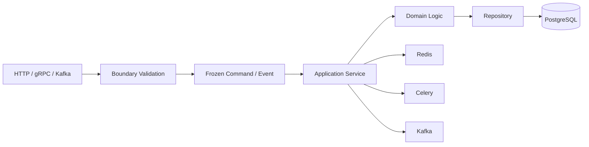

# 04- Frozen Dataclasses

## Overview

A frozen dataclass is a dataclass whose declared instance attributes cannot normally be reassigned after initialization.

It is created with:

```python
from dataclasses import dataclass


@dataclass(frozen=True)
class Money:
    amount_cents: int
    currency: str
```

After construction:

```python
money = Money(1000, "USD")
money.amount_cents = 2000
```

raises `FrozenInstanceError`.

Frozen dataclasses are particularly valuable for:

- value objects
- immutable commands
- configuration
- identifiers
- immutable events
- cache keys
- request snapshots
- data passed safely between concurrent components

The important distinction is:

```text
frozen=True
    ↓
prevents normal attribute reassignment

frozen=True
    ≠
deep immutability
```

If a frozen dataclass contains a mutable list or dictionary, that nested object can still be modified.

---

## Why Frozen Dataclasses Exist

Mutable objects make state changes easy:

```python
user.email = "new@example.com"
```

That can be useful for lifecycle-oriented entities, but it can also create difficult-to-track state transitions.

An immutable object instead follows:

```text
Construct
   │
   ▼
Validate
   │
   ▼
Normalize
   │
   ▼
Stable state
```

Once created, the object's fields cannot normally be reassigned.

This makes the object's state easier to reason about, especially when it is:

- shared between components
- passed across threads
- stored as a cache key
- used as a dictionary key
- treated as a value object
- passed through application layers

---

## Basic Frozen Dataclass

```python
from dataclasses import dataclass


@dataclass(frozen=True)
class Money:
    amount_cents: int
    currency: str
```

Construction remains normal:

```python
money = Money(
    amount_cents=2500,
    currency="USD",
)
```

Attempting to mutate it:

```python
money.amount_cents = 3000
```

raises:

```text
dataclasses.FrozenInstanceError
```

The object is still a normal Python object with dataclass-generated behavior; `frozen=True` changes how attribute assignment is handled.

---

## What `frozen=True` Changes

A frozen dataclass primarily changes assignment behavior.

| Operation | Frozen dataclass |
|---|---:|
| Construct object | Yes |
| Read field | Yes |
| Assign field normally | No |
| Delete field normally | No |
| Modify nested mutable object | Potentially yes |
| Use as hashable object | Often, if fields permit |
| Define methods | Yes |
| Use inheritance | Yes, with constraints |
| Perform custom initialization | Yes |

Frozen dataclasses should therefore be understood as **shallowly immutable by default**.

---

## Internal Behavior

Conceptually, a frozen dataclass prevents normal assignment by generating assignment/deletion methods that raise an exception.

The generated behavior is approximately:

```python
def __setattr__(self, name: str, value: object) -> None:
    raise FrozenInstanceError(...)
```

and similarly for deletion.

During generated initialization, dataclasses use low-level assignment semantics internally so the initial values can still be written.

Conceptually:

```text
Construction
    │
    ▼
Generated __init__
    │
    ▼
Internal field assignment
    │
    ▼
Object becomes frozen
    │
    ▼
Normal assignment → FrozenInstanceError
```

The exact generated implementation is an internal detail, but the important semantic guarantee is that normal post-construction assignment is blocked.

---

## Frozen Does Not Mean Deeply Immutable

Consider:

```python
from dataclasses import dataclass


@dataclass(frozen=True)
class User:
    tags: list[str]
```

This fails:

```python
user.tags = ["admin"]
```

but this can still succeed:

```python
user.tags.append("admin")
```

The reference stored in `tags` has not changed.

Instead:

```text
User
 │
 └── tags ──► mutable list
                 │
                 └── contents can change
```

Therefore, frozen dataclasses provide shallow immutability.

---

## Deep Immutability

When deep immutability is required, use immutable field types.

Instead of:

```python
@dataclass(frozen=True)
class User:
    tags: list[str]
```

prefer:

```python
@dataclass(frozen=True)
class User:
    tags: tuple[str, ...]
```

For sets:

```python
@dataclass(frozen=True)
class User:
    roles: frozenset[str]
```

For mappings, use an immutable mapping abstraction or an immutable representation appropriate to the application.

A strong value-object pattern is:

```text
frozen dataclass
      +
immutable nested values
      =
strong immutable model
```

---

## Why Immutability Matters in Backend Systems

Immutable models reduce the number of possible state transitions.

Instead of:

```text
Object
  │
  ├── mutate A
  ├── mutate B
  ├── mutate C
  └── mutate D
```

you get:

```text
Object A
   │
   │ replace(...)
   ▼
Object B
   │
   │ replace(...)
   ▼
Object C
```

This is particularly useful in:

- concurrent request handling
- event-driven architectures
- functional-style application services
- domain value objects
- configuration
- immutable messages
- caching

Immutability does not eliminate all concurrency problems, but it removes a major class of accidental state mutation.

---

## Value Objects

Frozen dataclasses are an excellent fit for value objects.

For example:

```python
from dataclasses import dataclass


@dataclass(frozen=True)
class Money:
    amount_cents: int
    currency: str

    def __post_init__(self) -> None:
        if self.amount_cents < 0:
            raise ValueError("amount cannot be negative")

        object.__setattr__(
            self,
            "currency",
            self.currency.strip().upper(),
        )
```

The value object provides:

- explicit structure
- value equality
- immutability
- local invariants
- normalization

This is usually a stronger design than passing around loosely structured dictionaries.

---

## Entity vs Value Object

Frozen dataclasses are naturally suited to value-oriented semantics.

Consider:

```text
Money(1000, "USD")
```

The identity is the value itself.

By contrast, a database-backed user:

```text
User(id=42)
```

is typically an entity whose identity is independent of its current attributes.

A useful rule is:

| Model | Typical approach |
|---|---|
| Money | Frozen dataclass |
| EmailAddress | Frozen dataclass |
| Currency | Frozen dataclass / Enum |
| Coordinates | Frozen dataclass |
| Request command | Frozen dataclass |
| Configuration | Frozen dataclass |
| Domain event | Frozen dataclass |
| Database entity | Mutable or ORM-specific model depending on architecture |
| Stateful service | Normal class |

This is a guideline rather than an absolute rule.

---

## Equality

Frozen dataclasses retain dataclass equality semantics.

```python
from dataclasses import dataclass


@dataclass(frozen=True)
class Money:
    amount_cents: int
    currency: str
```

Then:

```python
Money(1000, "USD") == Money(1000, "USD")
```

is `True`.

This is useful for value objects because equivalent values should generally compare equal.

For entities, value equality may be inappropriate.

---

## Hashability

Frozen dataclasses are often hashable when their fields are hashable.

For example:

```python
from dataclasses import dataclass


@dataclass(frozen=True)
class Coordinates:
    latitude: float
    longitude: float
```

The object can potentially be used as:

```python
locations = {
    Coordinates(22.5726, 88.3639),
}
```

Hashability is useful for:

- dictionary keys
- set membership
- memoization
- cache lookup structures

However, hashability is only safe when the values participating in equality and hashing remain stable.

---

## Hashability Requires Hashable Fields

This is problematic:

```python
@dataclass(frozen=True)
class User:
    tags: list[str]
```

The dataclass may not be hashable because `list` is unhashable.

Use:

```python
@dataclass(frozen=True)
class User:
    tags: tuple[str, ...]
```

when hashability and immutable state are both required.

The model design must therefore consider nested field types.

---

## Frozen vs `unsafe_hash`

`unsafe_hash=True` forces hash generation even when normal dataclass rules would not generate it.

This should be used cautiously.

For example:

```python
@dataclass(unsafe_hash=True)
class User:
    tags: list[str]
```

would create a hash despite mutable state being present.

That can violate assumptions required by hash-based collections.

Prefer designing the object so its equality and hash semantics are naturally safe rather than forcing a hash.

---

## Equality and Hash Contract

The core rule remains:

```text
a == b
    implies
hash(a) == hash(b)
```

If fields participating in equality can change after insertion into a set or dictionary, collection behavior becomes unsafe.

Frozen dataclasses reduce this risk by preventing normal field reassignment.

But nested mutable objects can still undermine the guarantee.

---

## `object.__setattr__()`

Frozen dataclasses sometimes need to assign values during `__post_init__()`.

Use:

```python
object.__setattr__(
    self,
    "field_name",
    value,
)
```

Example:

```python
from dataclasses import dataclass, field


@dataclass(frozen=True)
class Order:
    amount_cents: int
    amount_dollars: float = field(init=False)

    def __post_init__(self) -> None:
        object.__setattr__(
            self,
            "amount_dollars",
            self.amount_cents / 100,
        )
```

This is an intentional mechanism for initialization.

It should not be used throughout application code to bypass immutability.

---

## Why `object.__setattr__()` Is Acceptable During Initialization

The lifecycle is:

```text
Constructor
    │
    ▼
Initial state establishment
    │
    ├── validate
    ├── normalize
    └── derive
    │
    ▼
Stable immutable state
```

Using `object.__setattr__()` during construction preserves the intended model:

```text
initialization may establish state
post-construction mutation is prohibited
```

If the class frequently requires low-level mutation after initialization, freezing is probably the wrong abstraction.

---

## Normalization in Frozen Models

Frozen models work well when input should be normalized once.

```python
from dataclasses import dataclass


@dataclass(frozen=True)
class EmailAddress:
    value: str

    def __post_init__(self) -> None:
        normalized = self.value.strip().lower()

        if "@" not in normalized:
            raise ValueError("invalid email address")

        object.__setattr__(
            self,
            "value",
            normalized,
        )
```

Now:

```python
email = EmailAddress(" Alice@Example.com ")
```

produces a stable normalized value.

Downstream code does not need to repeatedly normalize it.

---

## Constructor Validation

Frozen dataclasses are particularly useful when construction establishes a permanent invariant.

```python
from dataclasses import dataclass


@dataclass(frozen=True)
class RetryPolicy:
    max_attempts: int
    timeout_seconds: float

    def __post_init__(self) -> None:
        if self.max_attempts < 1:
            raise ValueError("max_attempts must be positive")

        if self.timeout_seconds <= 0:
            raise ValueError("timeout must be positive")
```

Once constructed:

```text
RetryPolicy
    │
    ├── max_attempts >= 1
    ├── timeout_seconds > 0
    └── fields cannot normally be changed
```

This is a strong configuration model.

---

## Frozen Configuration

Application configuration is a common use case:

```python
from dataclasses import dataclass


@dataclass(frozen=True, slots=True)
class DatabaseConfig:
    host: str
    port: int = 5432
    pool_size: int = 10
    timeout_seconds: float = 5.0
```

Configuration is usually:

```text
load
  ↓
validate
  ↓
construct
  ↓
freeze
  ↓
read throughout application lifetime
```

This reduces accidental configuration mutation.

---

## Environment Variables and Frozen Dataclasses

Do not rely on the dataclass itself to parse untrusted environment strings.

Instead:

```text
Environment
    │
    ▼
Parse / validate
    │
    ▼
Frozen configuration
```

For example:

```python
import os
from dataclasses import dataclass


@dataclass(frozen=True)
class AppConfig:
    debug: bool
    port: int


def load_config() -> AppConfig:
    debug = os.getenv("DEBUG", "false").lower() == "true"
    port = int(os.getenv("PORT", "8000"))

    return AppConfig(
        debug=debug,
        port=port,
    )
```

For complex production configuration, a dedicated validation library may provide stronger guarantees.

---

## Commands

Frozen dataclasses are useful for application commands:

```python
from dataclasses import dataclass


@dataclass(frozen=True)
class CreateOrderCommand:
    customer_id: int
    amount_cents: int
```

A command represents an immutable instruction:

```text
HTTP request
    │
    ▼
Validation
    │
    ▼
CreateOrderCommand
    │
    ▼
Application service
```

The service can safely pass the command through multiple layers without worrying that another component will modify it.

---

## Domain Events

Immutable dataclasses also work well for in-process events:

```python
from dataclasses import dataclass
from datetime import datetime
from uuid import UUID


@dataclass(frozen=True)
class OrderCreated:
    event_id: UUID
    order_id: int
    occurred_at: datetime
```

The event should represent what happened at a point in time.

Changing the event after publication would be conceptually incorrect.

For distributed events, however, Python immutability does not replace explicit schema versioning.

---

## Kafka and Frozen Dataclasses

A typical event pipeline is:


The frozen dataclass provides stable application-level state.

Kafka still requires:

- serialization
- schema management
- compatibility rules
- versioning
- retry handling
- dead-letter handling

Do not confuse object immutability with distributed message immutability.

---

## Redis and Cache Keys

Frozen dataclasses can be useful for representing cache keys:

```python
from dataclasses import dataclass


@dataclass(frozen=True)
class UserCacheKey:
    user_id: int
    locale: str
```

The application can derive a Redis key:

```python
def redis_key(key: UserCacheKey) -> str:
    return f"user:{key.user_id}:locale:{key.locale}"
```

The key object is stable and value-comparable.

This makes accidental mutation less likely during cache operations.

---

## Memoization

Immutable, hashable value objects can work well with memoization:

```python
from dataclasses import dataclass
from functools import lru_cache


@dataclass(frozen=True)
class PricingInput:
    product_id: int
    region: str


@lru_cache(maxsize=1024)
def calculate_price(
    pricing_input: PricingInput,
) -> int:
    ...
```

The key remains stable for the lifetime of the cached entry.

This is useful only when the function's result is deterministic with respect to the input.

---

## Concurrency

Immutable objects simplify concurrency because readers do not need to coordinate writes to the object itself.

For example:

```python
@dataclass(frozen=True)
class RequestOptions:
    timeout_seconds: float
    retry_count: int
```

The same instance can safely be passed to multiple tasks as long as nested state is also appropriately immutable.

This helps reduce:

- race conditions
- accidental shared-state mutation
- synchronization requirements
- debugging complexity

It does not make the entire application thread-safe.

External systems and shared mutable resources still require synchronization or transactional guarantees.

---

## Asyncio

Frozen dataclasses are useful for passing immutable state between asyncio tasks:

```python
@dataclass(frozen=True)
class JobContext:
    job_id: str
    tenant_id: str
```

Multiple coroutines can read the same object without worrying about field reassignment.

This is particularly useful for:

- request context snapshots
- task configuration
- event objects
- command objects

Avoid putting mutable request state inside a frozen model and assuming the model is therefore concurrency-safe.

---

## Threads

The same principle applies to threads.

```text
Thread A ──┐
           │
Thread B ──┼──► Frozen Configuration
           │
Thread C ──┘
```

All threads can safely read immutable fields.

If the fields reference mutable structures, the referenced structures still require synchronization.

---

## Processes

Frozen dataclasses can also be useful as logical models passed to worker processes.

However, process boundaries involve serialization.

For example:

```text
Parent Process
      │
      ▼
Serialization
      │
      ▼
Worker Process
      │
      ▼
Deserialization
```

Immutability does not eliminate serialization overhead or compatibility requirements.

For Celery and multiprocessing, prefer stable serialized representations where workers may run independently.

---

## `replace()`

Frozen dataclasses work particularly well with `dataclasses.replace()`.

```python
from dataclasses import dataclass, replace


@dataclass(frozen=True)
class User:
    user_id: int
    email: str
```

Instead of mutating:

```python
user.email = "new@example.com"
```

create a new object:

```python
updated_user = replace(
    user,
    email="new@example.com",
)
```

Conceptually:

```text
User A
 │
 │ replace(email=...)
 ▼
User B
```

The original object remains unchanged.

---

## Functional Update Pattern

Immutable updates can make state transitions explicit:

```python
from dataclasses import dataclass, replace


@dataclass(frozen=True)
class Order:
    order_id: int
    status: str


def mark_paid(order: Order) -> Order:
    if order.status != "pending":
        raise ValueError("order is not payable")

    return replace(order, status="paid")
```

This is easier to reason about than hidden mutation in complex workflows.

It also makes the transition visible in code.

---

## Immutability and Domain State Machines

Frozen dataclasses can represent individual states:

```python
from dataclasses import dataclass


@dataclass(frozen=True)
class PendingOrder:
    order_id: int


@dataclass(frozen=True)
class PaidOrder:
    order_id: int
    payment_id: str
```

A service can transform:

```text
PendingOrder
      │
      │ payment succeeds
      ▼
PaidOrder
```

This makes state transitions explicit.

Whether separate classes are justified depends on domain complexity.

---

## Frozen Dataclasses and `slots=True`

Combining:

```python
@dataclass(
    frozen=True,
    slots=True,
)
class Event:
    event_id: str
    event_type: str
```

can provide:

- immutability
- reduced instance storage overhead
- fixed attribute layout
- predictable object shape

This combination is often appropriate for high-volume immutable value objects.

However, `slots=True` is not automatically beneficial for every application. Framework compatibility and actual memory requirements should be considered.

---

## Frozen Dataclasses and `weakref`

If a slotted frozen dataclass needs weak references:

```python
from dataclasses import dataclass


@dataclass(
    frozen=True,
    slots=True,
    weakref_slot=True,
)
class CacheValue:
    value: str
```

`weakref_slot=True` explicitly provides the required weak-reference slot.

Only use it when weak references are part of the design.

---

## Inheritance

Frozen dataclasses can participate in inheritance, but mixing frozen and non-frozen classes requires care.

A frozen dataclass cannot simply be treated as a normal mutable subclass hierarchy.

In particular, Python rejects incompatible combinations such as:

```text
non-frozen base
    ↓
frozen subclass
```

and:

```text
frozen base
    ↓
non-frozen subclass
```

when using dataclass freezing semantics.

This restriction exists because allowing the subclass to change mutability semantics would violate the expectations established by the hierarchy.

---

## Prefer Composition Over Complex Frozen Hierarchies

Instead of building:

```text
BaseModel
   ↓
Event
   ↓
UserEvent
   ↓
UserCreatedEvent
   ↓
SpecialUserCreatedEvent
```

consider composing smaller immutable models:

```python
@dataclass(frozen=True)
class UserIdentity:
    user_id: int


@dataclass(frozen=True)
class UserCreated:
    identity: UserIdentity
    email: str
```

This often produces clearer boundaries and fewer inheritance interactions.

---

## Frozen Dataclasses and Pydantic

Frozen dataclasses and Pydantic models overlap but have different purposes.

| Concern | Frozen Dataclass | Pydantic |
|---|---:|---:|
| Immutable application model | Excellent | Excellent |
| Runtime input validation | Manual | Excellent |
| API schema | Limited | Excellent |
| Domain value object | Excellent | Good |
| Serialization | Manual | Strong |
| Static typing | Excellent | Excellent |
| External data parsing | Limited | Excellent |

A common architecture is:

```text
HTTP
 │
 ▼
Pydantic Model
 │
 │ validated
 ▼
Frozen Domain Dataclass
 │
 ▼
Application Service
```

This keeps external parsing and internal domain semantics separate.

---

## Frozen Dataclasses and Django

Django ORM models are generally persistence-oriented and mutable through normal ORM operations.

A frozen dataclass can represent an application-level snapshot:

```python
@dataclass(frozen=True)
class UserSnapshot:
    user_id: int
    email: str
```

The mapping can be:

```text
Django ORM
    │
    ▼
Mapper
    │
    ▼
Frozen Dataclass
```

This can be useful when domain logic should not directly mutate persistence objects.

---

## Database Transactions

Frozen dataclasses do not provide transactional guarantees.

For example:

```python
@dataclass(frozen=True)
class AccountBalance:
    account_id: int
    balance_cents: int
```

The object itself is immutable, but updating the real balance still requires:

- database transactions
- row locking where appropriate
- optimistic concurrency
- unique constraints
- consistency rules

Immutability of an in-memory representation does not imply immutability of persistent state.

---

## Security Considerations

Frozen dataclasses can reduce accidental modification of security-sensitive state, but they are not a security boundary.

For example:

```python
@dataclass(frozen=True)
class AuthorizationContext:
    user_id: int
    roles: frozenset[str]
```

This prevents normal application code from changing the fields.

However:

- authorization still needs runtime enforcement
- external input still needs validation
- secrets still need protection
- nested objects may remain mutable
- Python introspection can bypass ordinary assumptions

Do not treat `frozen=True` as an access-control mechanism.

---

## Sensitive Fields

Immutability does not prevent accidental logging.

Use:

```python
from dataclasses import dataclass, field


@dataclass(frozen=True)
class Credentials:
    username: str
    password: str = field(repr=False)
```

Now generated representations do not expose the password.

Combine this with proper:

- secret management
- log filtering
- tracing redaction
- access controls

---

## Serialization

A frozen dataclass can be serialized, but immutability does not define the wire representation.

For example:

```python
@dataclass(frozen=True)
class Event:
    event_id: UUID
    occurred_at: datetime
```

A serializer must still decide how to represent:

```text
UUID
datetime
Decimal
Enum
bytes
```

For distributed systems, define the schema explicitly.

Avoid relying on Python-specific object serialization as a long-term cross-service contract.

---

## Performance

Frozen dataclasses have some construction overhead because generated initialization must establish fields while respecting frozen semantics.

For most backend workloads, this is insignificant.

Potential performance considerations include:

- constructor cost
- `object.__setattr__()` during initialization
- equality comparisons
- hashing
- object allocation
- nested immutable structures

Do not avoid frozen dataclasses based on theoretical overhead.

Benchmark if object construction is demonstrably part of a hot path.

---

## Memory

`frozen=True` itself does not significantly change the size of the referenced field values.

For large object populations:

```python
@dataclass(frozen=True, slots=True)
class Event:
    event_id: str
    event_type: str
```

can reduce per-instance overhead through slots.

However, the memory cost of:

```python
payload: dict[str, object]
```

still dominates when payloads are large.

Use immutable dataclasses for semantics; use slots or alternative representations for measured memory optimization.

---

## High-Throughput Event Processing

Consider a Kafka consumer processing large volumes of events.

A reasonable model might be:

```python
@dataclass(frozen=True, slots=True)
class OrderCreated:
    event_id: str
    order_id: int
    customer_id: int
```

Benefits include:

- stable event representation
- safe sharing between processing components
- predictable field layout
- low accidental mutation risk

But high throughput still depends heavily on:

- Kafka batch size
- serialization
- network I/O
- database operations
- object allocation
- consumer concurrency
- backpressure

Frozen dataclasses are one part of the design, not the performance solution.

---

## Reliability

Immutability helps reliability by making state transitions explicit.

Instead of:

```python
order.status = "paid"
```

use:

```python
paid_order = replace(
    order,
    status="paid",
)
```

The change is now visible as a new value.

This can make:

- debugging
- testing
- event processing
- retries
- state transitions

easier to reason about.

---

## Retry Safety

Immutable command objects can be reused safely across retry attempts:

```python
@dataclass(frozen=True)
class SendEmailCommand:
    message_id: str
    recipient: str
```

The command remains unchanged:

```text
Attempt 1 ──► same command
Attempt 2 ──► same command
Attempt 3 ──► same command
```

However, idempotency still requires the operation itself to be designed correctly.

An immutable command does not make an external side effect idempotent.

---

## Celery

For Celery workloads, an immutable dataclass can represent the task's validated internal input:

```python
@dataclass(frozen=True)
class ReportRequest:
    report_id: int
    format: str
```

The serialized task payload should still use a stable wire representation.

The architecture remains:

```text
Celery message
      │
      ▼
Deserialize
      │
      ▼
Validate
      │
      ▼
Frozen Dataclass
      │
      ▼
Task Logic
```

Do not assume a Python frozen object can safely cross arbitrary worker versions without serialization compatibility considerations.

---

## Testing

Frozen dataclasses are easy to test because mutation behavior is explicit.

```python
import pytest
from dataclasses import FrozenInstanceError


def test_money_is_immutable() -> None:
    money = Money(1000, "USD")

    with pytest.raises(FrozenInstanceError):
        money.amount_cents = 2000
```

Test nested mutability separately:

```python
def test_frozen_does_not_make_nested_list_immutable() -> None:
    user = User(tags=[])

    user.tags.append("admin")

    assert user.tags == ["admin"]
```

This test documents an important semantic property.

---

## Testing Value Semantics

For value objects:

```python
def test_money_uses_value_equality() -> None:
    assert Money(1000, "USD") == Money(1000, "USD")
```

For hashable immutable objects:

```python
def test_money_can_be_used_as_dictionary_key() -> None:
    prices = {
        Money(1000, "USD"): "valid",
    }

    assert prices[Money(1000, "USD")] == "valid"
```

Only test hashability when it is an intentional part of the model contract.

---

## Common Mistakes

### Assuming Frozen Means Deeply Immutable

Nested lists, dictionaries, and mutable objects remain mutable.

### Using `object.__setattr__()` Everywhere

This defeats the purpose of freezing.

Use it only for controlled initialization.

### Forcing Hashability

Do not use `unsafe_hash=True` simply because a model needs to be placed in a set.

### Freezing ORM Entities Automatically

Persistence models often have legitimate mutable lifecycle state.

### Using Frozen Models for Stateful Services

A service with connection pools, caches, metrics, or lifecycle state is usually not a value object.

### Putting External I/O in `__post_init__()`

Immutability does not make hidden I/O appropriate.

### Assuming Immutability Means Thread Safety

External resources and nested mutable objects may still require synchronization.

### Using `replace()` Without Understanding Semantics

`replace()` creates a new object but does not necessarily perform a deep copy of nested values.

### Exposing Sensitive Data Through `repr`

Frozen does not mean safe to log.

---

## Production Pitfalls

### Shallow Immutability

A frozen container can still reference mutable objects.

### Hidden Shared Mutable State

Factories and external objects can still introduce shared mutable references.

### Over-Freezing Domain Entities

Not every domain model should be immutable.

### Constructor Complexity

If `__post_init__()` requires extensive mutation through `object.__setattr__()`, the model may be too complicated.

### Distributed Schema Coupling

A frozen Python class is not a versioned event schema.

### Memory Misconceptions

Frozen objects are not automatically memory efficient. Use `slots=True` or other representations when measurement shows a need.

### Framework Compatibility

Some frameworks expect dynamic attribute assignment or mutation. Verify compatibility before freezing models used by framework internals.

---

## Frozen Dataclass vs Mutable Dataclass

| Characteristic | Mutable | Frozen |
|---|---:|---:|
| Normal field assignment | Yes | No |
| Value-object semantics | Good | Excellent |
| Configuration | Good | Excellent |
| Commands | Good | Excellent |
| Events | Good | Excellent |
| Stateful entities | Often better | Sometimes inappropriate |
| Accidental mutation risk | Higher | Lower |
| Hashability | Usually not safe | Often possible |
| Nested mutation prevented | No | No |
| `replace()` workflow | Useful | Particularly useful |
| Concurrency reasoning | More complex | Simpler |
| ORM compatibility | Often better | Depends on framework |

---

## Frozen Dataclass vs Named Tuple

| Characteristic | Frozen Dataclass | Named Tuple |
|---|---:|---:|
| Named fields | Yes | Yes |
| Methods | Yes | Yes |
| Defaults | Flexible | More limited |
| Mutable fields possible | Yes | Yes, if referenced |
| Keyword construction | Yes | Yes |
| Inheritance flexibility | Better | More constrained |
| Dataclass field metadata | Yes | No |
| Domain modeling | Excellent | Limited |
| Tuple semantics | No | Yes |
| Slots | Supported | Built-in tuple layout |

Use a named tuple when tuple semantics are genuinely useful.

Use a frozen dataclass when the object is primarily a domain or application model.

---

## Frozen Dataclass vs Pydantic Frozen Model

Pydantic supports immutable/frozen model configurations.

The architectural distinction remains:

```text
Frozen Dataclass
→ Python application/domain model

Pydantic Frozen Model
→ validated model with Pydantic's runtime/schema ecosystem
```

Choose based on whether the object needs:

- runtime parsing
- JSON schema
- serialization
- coercion/strict validation
- domain-oriented simplicity

---

## Production Decision Guide

Use a frozen dataclass when:

- state should not change after construction
- value semantics are appropriate
- object identity is less important than represented value
- the object is passed between application components
- deterministic state improves reliability
- the object is a command or event
- configuration should remain stable
- hashability is useful and all relevant fields are hashable

Prefer a mutable dataclass when:

- the object represents legitimately changing state
- mutation is central to the lifecycle
- nested structures must be modified in place
- framework integration requires mutation

Prefer another model when:

- runtime validation is the dominant requirement
- persistence behavior dominates the model
- external schema generation is central
- the data is highly dynamic
- the object has complex lifecycle behavior

---

## Production Architecture

A common backend architecture separates validated input, immutable application data, and mutable infrastructure state:



The immutable model provides a stable contract inside the application.

External systems remain responsible for:

- persistence
- transactions
- durability
- distributed coordination
- schema evolution

---

## Best Practices

- Use frozen dataclasses primarily for value-oriented models.
- Prefer `frozen=True` for immutable commands, events, configuration, and value objects.
- Use immutable nested types when deep immutability is required.
- Use `tuple` instead of `list` when collection mutation is not part of the model.
- Use `frozenset` when set semantics and immutability are both required.
- Use `object.__setattr__()` only during controlled initialization.
- Validate and normalize values before exposing the object as stable application state.
- Keep `__post_init__()` deterministic and free of external I/O.
- Use `replace()` for explicit immutable state transitions.
- Consider `slots=True` for large populations of immutable objects after measurement.
- Design equality according to domain semantics.
- Treat hashability as a consequence of stable value semantics, not a feature to force.
- Do not assume frozen objects are deeply immutable.
- Do not assume frozen objects are automatically thread-safe.
- Keep persistence transactions separate from in-memory immutability.
- Use explicit serializers for distributed events and API payloads.
- Validate external data before constructing internal frozen models.
- Avoid freezing stateful ORM entities without a clear architectural reason.
- Keep distributed schemas versioned independently of Python class definitions.
- Test both immutability and nested mutability semantics where relevant.

---

## Interview Traps

### Does `frozen=True` make a dataclass immutable?

It makes normal assignment and deletion of its fields illegal, but it does not make nested mutable objects immutable.

### Can a frozen dataclass contain a list?

Yes, but the list itself can still be mutated.

### Why are frozen dataclasses useful as dictionary keys?

When all relevant fields are hashable and equality/hash semantics are stable, frozen dataclasses can provide safe value-based hashing.

### Does frozen automatically mean hashable?

Not always. Field types and dataclass configuration determine whether hashing is appropriate and available.

### What is `FrozenInstanceError`?

The exception raised when normal attribute assignment or deletion is attempted on a frozen dataclass.

### Why does `object.__setattr__()` work on a frozen dataclass?

It bypasses the generated frozen assignment restriction and is useful for controlled initialization, particularly inside `__post_init__()`.

### Should `object.__setattr__()` be used to mutate frozen objects later?

No. Doing so defeats the immutability contract.

### Does frozen make nested dictionaries immutable?

No.

### Does frozen make an application thread-safe?

No. It only protects normal mutation of the dataclass's own fields.

### Can frozen dataclasses be inherited?

Yes, but frozen and non-frozen dataclass inheritance combinations have restrictions. Complex inheritance should be designed carefully.

### Should every domain object be frozen?

No. Value objects, commands, events, and configuration are strong candidates; stateful entities may legitimately require mutation.

### Does a frozen dataclass provide transaction safety?

No. Database transactions and distributed consistency require database or infrastructure mechanisms.

### Does immutability make Kafka events version-safe?

No. Distributed events still require explicit schema evolution and compatibility strategies.

### What is a strong use case for frozen dataclasses?

Immutable value objects and application models whose state should remain stable after construction.

---

## Production Checklist

- [ ] Is immutability actually required by the model's semantics?
- [ ] Is the object a value object, command, event, configuration, or stable snapshot?
- [ ] Are normal field assignments intentionally prohibited?
- [ ] Are nested collections immutable where deep immutability matters?
- [ ] Are mutable fields intentionally retained when required?
- [ ] Are equality semantics appropriate for the model?
- [ ] Are all hash-participating fields stable and hashable?
- [ ] Is `unsafe_hash=True` avoided unless there is a strong justification?
- [ ] Is `object.__setattr__()` limited to controlled initialization?
- [ ] Does `__post_init__()` avoid external I/O?
- [ ] Are local invariants validated during construction?
- [ ] Are dynamic values initialized correctly?
- [ ] Is `replace()` used for immutable state transitions where appropriate?
- [ ] Are ORM entities kept separate when persistence requires mutation?
- [ ] Are external inputs validated before constructing the model?
- [ ] Are API and Kafka serialization contracts explicit?
- [ ] Are distributed schemas versioned independently?
- [ ] Are sensitive fields protected from `repr` and logging?
- [ ] Are concurrency assumptions based on actual immutability of nested values?
- [ ] Would `slots=True` provide measurable memory benefits?
- [ ] Have object construction and hashing costs been measured for hot paths?
- [ ] Are successful and invalid construction paths tested?
- [ ] Is framework compatibility verified before freezing models?
- [ ] Does the model remain simple enough that immutability is an asset rather than an obstacle?

## Key Takeaways

- **`frozen=True` prevents normal post-construction field assignment and makes immutable value-oriented models easier to reason about**, particularly for commands, events, configuration, and value objects.
- **Frozen dataclasses are only shallowly immutable**; nested lists, dictionaries, and other mutable objects can still change unless immutable field types such as `tuple` and `frozenset` are used.
- **`object.__setattr__()` is an initialization mechanism, not a normal mutation technique**; extensive use of it after construction defeats the purpose of a frozen model.
- **Immutability improves concurrency reasoning and state-transition clarity but does not provide transaction safety, authorization, deep thread safety, or distributed schema compatibility**.
- **Use frozen dataclasses deliberately according to domain semantics**: favor them for stable values and messages, while keeping legitimately stateful entities and persistence models mutable where that better matches their lifecycle.