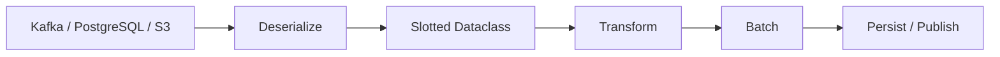

# 05- Slots

## Overview

`slots` is a dataclass option that controls how instances store attributes and whether they maintain a normal instance `__dict__`.

For dataclasses, the modern form is:

```python
from dataclasses import dataclass


@dataclass(slots=True)
class User:
    user_id: int
    email: str
```

Instead of using the traditional per-instance dictionary for attribute storage, the generated class uses `__slots__` for declared fields.

This can provide:

- lower per-instance memory overhead
- faster attribute access in some workloads
- prevention of arbitrary new instance attributes
- a more explicit object layout

The primary production reason to use slots is usually **memory efficiency when creating large numbers of small objects**, not simply speed.

A useful mental model is:

```text
Normal dataclass
    │
    ├── attributes
    └── instance __dict__
             │
             └── dynamic attribute storage

Slotted dataclass
    │
    ├── declared attributes
    └── slot-based storage
```

`slots=True` should be treated as an object-layout decision. It is valuable when the application's object population and memory profile justify it.

---

## Why Slots Exist

A normal Python instance commonly stores instance attributes through a dictionary.

For example:

```python
from dataclasses import dataclass


@dataclass
class User:
    user_id: int
    email: str
```

Conceptually:

```text
User instance
├── __dict__
│   ├── user_id → 42
│   └── email   → "user@example.com"
└── class metadata
```

The dictionary provides flexibility because attributes can be added dynamically:

```python
user.last_login = ...
user.feature_flags = ...
```

That flexibility has a memory cost.

A slotted class instead declares its supported attributes:

```python
@dataclass(slots=True)
class User:
    user_id: int
    email: str
```

Conceptually:

```text
User instance
├── user_id slot → 42
└── email slot   → "user@example.com"
```

There is no normal instance dictionary for those fields.

---

## Basic Syntax

```python
from dataclasses import dataclass


@dataclass(slots=True)
class User:
    user_id: int
    email: str
```

Usage remains familiar:

```python
user = User(
    user_id=42,
    email="user@example.com",
)

print(user.user_id)
print(user.email)
```

The main behavioral difference appears when attempting to create undeclared attributes:

```python
user.last_login = "2026-09-06"
```

A slotted instance normally rejects this because `last_login` is not one of its declared slots.

---

## `slots=True` vs Manual `__slots__`

Before dataclasses supported `slots=True`, developers could define:

```python
class User:
    __slots__ = ("user_id", "email")

    def __init__(self, user_id: int, email: str) -> None:
        self.user_id = user_id
        self.email = email
```

Modern dataclasses simplify this:

```python
@dataclass(slots=True)
class User:
    user_id: int
    email: str
```

The dataclass decorator generates the appropriate slotted class structure.

Prefer `slots=True` when the class is already a dataclass and you want dataclass-generated slot support.

---

## What `slots=True` Changes

| Behavior | Normal Dataclass | `slots=True` |
|---|---:|---:|
| Declared fields | Yes | Yes |
| Normal `__dict__` | Usually | Usually no |
| Arbitrary instance attributes | Yes | No |
| Dataclass methods | Yes | Yes |
| Generated `__init__` | Yes | Yes |
| Generated equality | Yes | Yes |
| `frozen=True` compatible | Yes | Yes |
| Lower instance memory overhead | Usually higher | Often lower |
| Weak references | Usually available | Requires appropriate support |
| Dynamic framework attributes | Easy | Potentially incompatible |

The exact memory savings depend on Python version, object shape, number of fields, and workload.

---

## Attribute Storage

The practical difference is:

```python
normal = User(...)
normal.__dict__
```

may expose:

```python
{
    "user_id": 42,
    "email": "user@example.com",
}
```

A slotted dataclass generally does not provide a normal instance dictionary:

```python
slotted = SlottedUser(...)
slotted.__dict__
```

typically raises `AttributeError`.

This matters for libraries and application code that assume every object has a `__dict__`.

---

## Preventing Arbitrary Attributes

Slots provide a useful structural guarantee.

Without slots:

```python
@dataclass
class RequestContext:
    request_id: str


context = RequestContext("abc")
context.user_id = 42
```

The accidental attribute can exist.

With slots:

```python
@dataclass(slots=True)
class RequestContext:
    request_id: str


context = RequestContext("abc")
context.user_id = 42
```

the assignment fails.

This can catch:

- misspelled attributes
- accidental state additions
- incompatible assumptions
- some classes of programming errors

Slots therefore provide both memory benefits and a stricter object shape.

---

## Slots Are Not a Security Boundary

Preventing arbitrary attributes does not provide meaningful security isolation.

Python code can still:

- inspect class metadata
- access referenced mutable objects
- use reflection
- call methods
- manipulate external state

Do not use slots as an access-control or sandboxing mechanism.

Their primary purposes are object layout, memory efficiency, and structural discipline.

---

## Memory Benefits

The most important practical advantage of slots is often memory reduction.

Suppose an application creates millions of small objects:

```text
Kafka records
      ↓
Dataclass instances
      ↓
Transformation
      ↓
Batch output
```

With ordinary classes, each instance can incur overhead associated with instance dictionaries.

With slots, that overhead can often be reduced.

This matters in:

- high-volume event processing
- ETL pipelines
- large in-memory caches
- batch transformations
- parsers
- data-processing services
- graph-like object structures

The exact benefit should be measured rather than assumed.

---

## Why the Memory Savings Matter

Consider:

```text
1 object
    ↓
small difference

100 objects
    ↓
still small

1,000,000 objects
    ↓
potentially significant
```

Per-instance overhead becomes an architectural concern when object populations become large.

This is why slots are often more valuable in data-heavy systems than ordinary CRUD services.

---

## Example: High-Volume Events

```python
from dataclasses import dataclass


@dataclass(slots=True, frozen=True)
class OrderCreated:
    event_id: str
    order_id: int
    customer_id: int
```

If a Kafka consumer creates hundreds of thousands or millions of event objects during processing, reducing per-object overhead can materially improve memory usage.

The overall performance still depends on:

- deserialization
- Kafka batch size
- database I/O
- serialization
- garbage collection
- object allocation
- concurrency

Slots optimize one part of that pipeline.

---

## Slots and `frozen=True`

The two options are complementary:

```python
from dataclasses import dataclass


@dataclass(
    frozen=True,
    slots=True,
)
class Money:
    amount_cents: int
    currency: str
```

This provides:

```text
frozen=True
→ prevents normal reassignment

slots=True
→ restricts instance attributes and changes storage
```

They solve different problems.

| Option | Primary concern |
|---|---|
| `frozen=True` | Mutation semantics |
| `slots=True` | Attribute storage and object shape |
| `slots=True, frozen=True` | Immutable, compact value object |

This combination is often excellent for small domain value objects.

---

## Slots and `__post_init__()`

Slots work normally with post-initialization:

```python
from dataclasses import dataclass


@dataclass(slots=True)
class EmailAddress:
    value: str

    def __post_init__(self) -> None:
        self.value = self.value.strip().lower()
```

The slot exists for `value`, and `__post_init__()` can assign it normally.

With `frozen=True`, controlled initialization may require:

```python
object.__setattr__(self, "value", normalized)
```

as usual.

---

## Slots and Derived Fields

A slotted dataclass can contain `init=False` fields:

```python
from dataclasses import dataclass, field


@dataclass(slots=True)
class Order:
    subtotal_cents: int
    tax_cents: int
    total_cents: int = field(init=False)

    def __post_init__(self) -> None:
        self.total_cents = (
            self.subtotal_cents + self.tax_cents
        )
```

`total_cents` receives its own slot.

This can be useful when materialized derived state is intentional.

If the derived value is cheap, a property may avoid storing additional state:

```python
@dataclass(slots=True)
class Order:
    subtotal_cents: int
    tax_cents: int

    @property
    def total_cents(self) -> int:
        return self.subtotal_cents + self.tax_cents
```

---

## Slots and `ClassVar`

Class variables are not instance fields:

```python
from dataclasses import dataclass
from typing import ClassVar


@dataclass(slots=True)
class User:
    user_id: int
    model_name: ClassVar[str] = "user"
```

`model_name` belongs to the class rather than each instance.

This is useful for metadata that should not consume per-instance storage.

---

## Slots and `InitVar`

`InitVar` values are temporary constructor inputs:

```python
from dataclasses import InitVar, dataclass


@dataclass(slots=True)
class User:
    email: str
    raw_email: InitVar[str | None] = None

    def __post_init__(self, raw_email: str | None) -> None:
        if raw_email is not None:
            self.email = raw_email.strip().lower()
```

`raw_email` does not become an instance field or slot.

This is useful when initialization requires temporary data that should not remain on the object.

---

## Slots and Inheritance

Inheritance with slots requires more care than ordinary dataclasses.

Consider:

```python
from dataclasses import dataclass


@dataclass(slots=True)
class Event:
    event_id: str


@dataclass(slots=True)
class OrderCreated(Event):
    order_id: int
```

The subclass receives slots for its own fields while inheriting the base slots.

The resulting object conceptually has:

```text
Event slots
├── event_id
│
└── OrderCreated slots
    └── order_id
```

When designing slotted inheritance, verify the hierarchy rather than assuming every class has an independent slot for every inherited attribute.

---

## Inherited Slot Names

A subtle issue is that `__slots__` is not simply a complete list of every field inherited through the hierarchy.

Python merges slot definitions across classes.

Therefore, code should not assume:

```python
Child.__slots__
```

contains every field accessible on the child.

Use dataclass metadata when you need dataclass field information:

```python
from dataclasses import fields


for field_info in fields(OrderCreated):
    print(field_info.name)
```

This is a more reliable abstraction for dataclass field introspection.

---

## Multiple Inheritance

Multiple inheritance and slots can become complex.

Potential issues include:

- incompatible layouts
- duplicate slot names
- MRO interactions
- framework assumptions
- initialization ordering

If a slotted dataclass hierarchy becomes difficult to reason about, composition is usually preferable.

For example:

```python
@dataclass(slots=True, frozen=True)
class UserIdentity:
    user_id: int


@dataclass(slots=True, frozen=True)
class UserCreated:
    identity: UserIdentity
    email: str
```

Composition avoids many multiple-inheritance layout concerns.

---

## Weak References

Normal instances often support weak references.

Slotted classes need explicit support for this.

Modern dataclasses provide:

```python
from dataclasses import dataclass


@dataclass(slots=True, weakref_slot=True)
class CacheEntry:
    key: str
    value: str
```

`weakref_slot=True` adds a `__weakref__` slot.

Use it when another component needs to hold weak references:

```python
import weakref


entry = CacheEntry("key", "value")
reference = weakref.ref(entry)
```

Do not add weak-reference support without a use case because every additional slot has a purpose and object-layout implications.

---

## `weakref_slot=True` Requires Slots

This is intended to be used with:

```python
@dataclass(
    slots=True,
    weakref_slot=True,
)
class CacheEntry:
    ...
```

It is not a replacement for `slots=True`.

The design is:

```text
slots=True
      │
      └── fixed instance layout

weakref_slot=True
      │
      └── additionally support weak references
```

---

## Pickling

Slotted dataclasses can be serialized, but serialization behavior should be tested explicitly for the serializer and Python versions used by the system.

For distributed systems, avoid treating Python object serialization as a stable cross-service contract.

Prefer explicit formats such as:

- JSON
- Protocol Buffers
- Avro
- MessagePack where appropriate

For internal Python-only persistence, verify compatibility before relying on pickle-based workflows.

---

## Serialization With `dataclasses.asdict()`

Slots do not prevent use of:

```python
from dataclasses import asdict


data = asdict(event)
```

For example:

```python
from dataclasses import asdict, dataclass


@dataclass(slots=True)
class Event:
    event_id: str
    order_id: int


event = Event("evt-123", 42)

payload = asdict(event)
```

The important performance consideration is that `asdict()` recursively creates dictionaries and copies nested dataclass structures.

For large event volumes, this conversion can become expensive.

---

## Serialization Performance

A high-throughput pipeline may look like:

```text
Kafka
  │
  ▼
Deserialize
  │
  ▼
Slotted Dataclass
  │
  ▼
Business Logic
  │
  ▼
Serialize
  │
  ▼
Kafka / Database / API
```

Slots can reduce memory overhead inside the pipeline.

But serialization may still dominate runtime.

Measure:

- object creation
- serialization
- deserialization
- allocations
- network I/O
- database operations

Do not assume slots will solve a serialization bottleneck.

---

## FastAPI and REST APIs

A slotted dataclass can represent an internal application model:

```python
from dataclasses import dataclass


@dataclass(slots=True, frozen=True)
class CreateUserCommand:
    email: str
    display_name: str
```

FastAPI request validation can remain a separate concern.

A typical architecture is:

```text
HTTP JSON
   │
   ▼
Pydantic Request Model
   │
   ▼
Frozen Slotted Command
   │
   ▼
Application Service
```

Slots are primarily useful for the internal model, not as a replacement for FastAPI's request validation system.

---

## Django

Django ORM models are not generally candidates for blindly adding slots.

The ORM expects substantial framework-managed behavior and attributes.

Instead, use slotted dataclasses for application-level representations when appropriate:

```text
Django ORM
    │
    ▼
Mapper
    │
    ▼
Slotted Dataclass
    │
    ▼
Domain/Application Logic
```

This keeps persistence concerns separate from compact in-memory models.

Always verify framework compatibility before introducing slots into framework-managed classes.

---

## PostgreSQL Data Mapping

Suppose a query returns:

```text
id
email
status
```

A repository can map it into:

```python
@dataclass(slots=True, frozen=True)
class UserRecord:
    user_id: int
    email: str
    status: str
```

For large result sets, reducing per-row object overhead can be useful.

However, if PostgreSQL returns millions of rows, the larger architectural question is whether the application should materialize all rows at once.

Often the better optimization is:

```text
stream / batch database rows
        +
bounded object population
        +
incremental processing
```

Slots and streaming solve different layers of the memory problem.

---

## Redis

For cache data:

```python
@dataclass(slots=True, frozen=True)
class UserCache:
    user_id: int
    email: str
    version: int
```

This is a compact in-memory representation after cache deserialization.

However, Redis memory usage itself is unaffected by the Python object's slots.

Slots optimize Python process memory, not Redis storage.

---

## Celery

A worker may create many small task models:

```python
@dataclass(slots=True, frozen=True)
class ReportJob:
    report_id: int
    format: str
```

This can reduce per-instance memory overhead inside workers.

The serialized Celery message remains separate from the Python object.

Therefore:

```text
Celery broker
    │
    ▼
Serialized task
    │
    ▼
Worker
    │
    ▼
Slotted dataclass
```

Slots do not reduce broker payload size automatically.

---

## Kubernetes Memory Limits

Slots can become operationally relevant in containers.

Suppose a worker has:

```text
Kubernetes memory limit = 512 MiB
```

and accidentally creates hundreds of thousands of in-memory model objects.

Reducing per-object overhead can increase headroom before:

```text
Python process
     ↓
memory pressure
     ↓
container limit
     ↓
OOMKill
```

But slots should not be used as a substitute for controlling memory growth.

Also address:

- batch sizes
- queue depth
- streaming
- backpressure
- object lifetime
- caching
- concurrency

---

## High Availability

Slots do not directly affect service availability.

They can indirectly help by reducing memory pressure in high-throughput workers.

A robust system still requires:

- bounded memory usage
- health checks
- graceful shutdown
- worker recycling where appropriate
- horizontal scaling
- backpressure
- appropriate Kubernetes resource limits

Memory optimization is one part of availability engineering.

---

## Garbage Collection

Slots can reduce object overhead, but they do not eliminate Python's garbage collection or reference counting behavior.

Objects are still allocated and released according to Python's runtime memory-management mechanisms.

If a workload creates many temporary objects:

```text
deserialize
   ↓
create objects
   ↓
process
   ↓
discard
   ↓
repeat
```

slots may reduce memory per object, but allocation and collection costs still exist.

For high-throughput systems, profile both:

- peak RSS
- allocation rate
- object lifetime
- CPU usage
- garbage-collection behavior

---

## Performance Considerations

Slots can improve attribute access performance in some Python versions and workloads, but the difference is usually less important than memory savings.

Do not write:

> `slots=True` makes every application faster.

A better engineering statement is:

> `slots=True` changes attribute storage and can reduce per-instance overhead; performance effects should be benchmarked for the actual workload.

In many backend systems, network and database latency dominate Python attribute access.

---

## Benchmarking

A simple benchmark can compare representative object populations:

```python
from dataclasses import dataclass
import sys


@dataclass
class NormalEvent:
    event_id: str
    order_id: int


@dataclass(slots=True)
class SlottedEvent:
    event_id: str
    order_id: int


normal = NormalEvent("evt-1", 42)
slotted = SlottedEvent("evt-1", 42)

print(sys.getsizeof(normal))
print(sys.getsizeof(slotted))
```

Be careful when interpreting this result.

For a normal object, the instance dictionary has its own memory characteristics, so `sys.getsizeof(instance)` alone does not necessarily represent the full memory cost.

For meaningful production decisions, measure representative workloads using memory profilers or process-level RSS measurements.

---

## Memory Profiling

Useful tools include:

```bash
python -m tracemalloc
```

and application profiling tools such as:

- `tracemalloc`
- `memray`
- process RSS metrics
- container memory metrics

A production investigation should answer:

```text
Where is memory allocated?
        ↓
How many objects exist?
        ↓
How large are they?
        ↓
How long do they live?
        ↓
Can the object population be bounded?
```

Slots may solve only the per-instance overhead component.

---

## Object Population Matters More Than Individual Objects

A common optimization mistake is focusing on one object:

```text
Object saves 40 bytes
```

The more important question is:

```text
How many objects exist simultaneously?
```

For example:

```text
50 objects
→ negligible

50,000 objects
→ potentially relevant

5,000,000 objects
→ potentially architectural
```

Memory optimization should always consider population size and lifetime.

---

## Slots and Caching

Slotted dataclasses can be useful for large in-memory caches:

```python
@dataclass(slots=True, frozen=True)
class ProductSnapshot:
    product_id: int
    price_cents: int
    currency: str
```

But cache design must also consider:

- eviction
- TTL
- maximum size
- serialization
- invalidation
- memory fragmentation
- process-local vs distributed cache

Slots reduce object overhead but do not provide cache eviction.

---

## Slots and Immutability

A particularly strong pattern is:

```python
@dataclass(
    slots=True,
    frozen=True,
)
class ProductSnapshot:
    product_id: int
    price_cents: int
    currency: str
```

This gives:

```text
slots
  → compact object representation

frozen
  → stable field references

dataclass
  → explicit model semantics
```

For small, frequently created value objects, this is often a good production default when framework compatibility is not a concern.

---

## Mutable Nested Values

Slots do not make nested values immutable:

```python
@dataclass(slots=True)
class User:
    tags: list[str]
```

This remains possible:

```python
user.tags.append("admin")
```

If immutability is required:

```python
@dataclass(slots=True, frozen=True)
class User:
    tags: tuple[str, ...]
```

Again:

```text
slots
→ controls attributes of the object

frozen
→ prevents normal field reassignment

tuple/frozenset/etc.
→ controls nested value mutability
```

These are independent concerns.

---

## Thread Safety

Slots do not make objects thread-safe.

This:

```python
@dataclass(slots=True)
class Counter:
    value: int
```

does not prevent concurrent updates:

```text
Thread A ──┐
           ├── Counter.value
Thread B ──┘
```

If the object is mutable and shared, synchronization may still be required.

If it is immutable:

```python
@dataclass(slots=True, frozen=True)
class RequestContext:
    request_id: str
```

concurrent reads are easier to reason about.

---

## Asyncio

Slotted immutable models are useful for passing stable data between asyncio tasks:

```python
@dataclass(slots=True, frozen=True)
class JobContext:
    job_id: str
    tenant_id: str
```

Multiple tasks can safely reference the same object without normal field reassignment.

However, the object may still contain references to mutable structures.

Slots do not eliminate race conditions involving referenced resources.

---

## Security Considerations

Slots can reduce accidental state injection:

```python
@dataclass(slots=True)
class RequestContext:
    request_id: str
```

An unrelated attribute cannot normally be attached:

```python
context.is_admin = True
```

This can catch programming errors, but it is not authorization.

Authorization must still be explicitly enforced:

```text
Authenticated identity
        ↓
Authorization policy
        ↓
Allowed operation
```

Do not rely on object shape restrictions for security decisions.

---

## Reliability Considerations

Slots can improve reliability indirectly by reducing memory overhead and catching accidental attribute creation.

For example, a typo:

```python
request.user_idd = user_id
```

may silently create a new attribute on a normal object.

With slots, the mistake is detected immediately.

This can turn a subtle production bug into a deterministic test or runtime failure.

---

## Testing

Test the actual contract when slots are intentionally part of the model design.

```python
import pytest


@dataclass(slots=True)
class User:
    user_id: int


def test_unknown_attributes_are_rejected() -> None:
    user = User(42)

    with pytest.raises(AttributeError):
        user.email = "user@example.com"
```

Do not test implementation details unnecessarily.

If the purpose is memory optimization, memory characteristics should be validated through benchmarks rather than unit tests asserting exact object sizes.

---

## Testing Serialization

If slotted models cross serialization boundaries:

```python
from dataclasses import asdict


def test_slotted_model_serializes() -> None:
    user = User(42)

    assert asdict(user) == {
        "user_id": 42,
    }
```

For production serializers, test the actual serializer used by the application rather than relying solely on `asdict()`.

---

## Framework Compatibility

Before adding slots to a model used by a framework, verify whether the framework:

- dynamically attaches attributes
- expects `__dict__`
- uses monkey patching
- stores metadata on instances
- relies on weak references
- expects arbitrary attributes
- uses special lifecycle behavior

This is especially important for:

- ORMs
- serializers
- dependency injection frameworks
- testing libraries
- tracing systems
- proxy objects

A small memory optimization is not worth breaking framework assumptions.

---

## Common Mistakes

### Assuming Slots Automatically Make Code Faster

The main benefit is usually reduced instance overhead. Benchmark before claiming a CPU improvement.

### Assuming Slots Make Objects Immutable

Slots restrict attribute creation; they do not prevent reassignment of declared fields.

### Assuming Slots Make Nested Values Immutable

Lists and dictionaries remain mutable.

### Using Slots on Framework-Managed Objects

Some frameworks depend on dynamic attributes.

### Measuring `sys.getsizeof()` Incorrectly

The reported size of one object does not necessarily represent total memory consumption.

### Adding Slots Without Measuring

For a small application with few long-lived objects, the benefit may be negligible.

### Forgetting Weak References

Slotted objects may require `weakref_slot=True` if weak references are needed.

### Overusing Inheritance

Complex slotted hierarchies can become difficult to maintain.

### Treating Slots as Security

Slots are not an authorization or sandboxing mechanism.

---

## Production Pitfalls

### Dynamic Attribute Requirements

Libraries may expect:

```python
obj.some_dynamic_attribute = value
```

which fails with slots.

### Introspection Assumptions

Code that expects:

```python
obj.__dict__
```

may break.

Prefer dataclass APIs such as:

```python
from dataclasses import fields
```

for model metadata.

### Weak Reference Compatibility

Caching or lifecycle frameworks may rely on weak references.

Add `weakref_slot=True` when required.

### Pickle and Serialization Assumptions

Do not assume every serialization workflow treats slotted objects identically across Python versions and libraries.

### Inheritance Complexity

Mixing slotted and non-slotted classes requires deliberate design.

### Premature Optimization

If memory profiling does not identify object overhead as a meaningful problem, slots may add complexity without meaningful benefit.

---

## Slots in Data-Heavy Backend Architecture

A common data-processing pipeline is:



Slots are most valuable when the `C → D → E` stages create and retain large numbers of small Python objects.

The architecture should still control:

- batch size
- object lifetime
- queue depth
- backpressure
- worker concurrency
- serialization cost

Otherwise, memory can still grow without bound.

---

## Slots and Streaming

Slots and streaming complement each other.

Bad:

```text
Read entire dataset
       ↓
Create millions of objects
       ↓
Process
```

Better:

```text
Read bounded batch
       ↓
Create slotted objects
       ↓
Process
       ↓
Release
       ↓
Next batch
```

The first strategy may exhaust memory even with slots.

The second controls both:

- per-object overhead
- total object population

---

## Slots and Backpressure

In asynchronous or event-driven systems:

```text
Producer
   │
   ▼
Bounded Queue
   │
   ▼
Consumer
   │
   ▼
Slotted Models
```

Slots can reduce memory per object.

The bounded queue limits the number of objects.

Both are necessary for predictable memory behavior.

---

## Cost Considerations

Slots can reduce memory usage, which may reduce:

- container memory requirements
- worker scaling pressure
- infrastructure cost
- OOM-related restarts

But the effect depends on workload.

For example, reducing object overhead by a few percent may have no operational significance if the process spends most of its memory on:

- PostgreSQL result buffers
- large JSON payloads
- image data
- NumPy arrays
- caches
- network buffers

Optimize the largest measured contributors first.

---

## Operational Guidance

For production services:

1. Profile memory before introducing slots.
2. Identify high-population object types.
3. Measure peak object counts.
4. Benchmark normal and slotted versions.
5. Verify framework compatibility.
6. Test serialization and introspection paths.
7. Monitor process RSS after deployment.
8. Combine slots with bounded queues and streaming where appropriate.

Useful operational metrics include:

- container memory usage
- process RSS
- allocation rate
- restart/OOM count
- queue depth
- batch size
- request latency
- worker throughput

---

## Decision Guide

| Situation | Recommendation |
|---|---|
| Millions of small objects | Strong candidate |
| Large ETL batches | Candidate |
| High-volume Kafka processing | Candidate |
| Large in-memory cache | Candidate |
| Immutable value objects | Strong candidate |
| Configuration objects | Optional |
| Ordinary CRUD DTOs | Usually optional |
| Django ORM model | Avoid unless explicitly supported |
| Dynamic plugin objects | Usually avoid |
| Objects requiring `__dict__` | Avoid |
| Objects requiring arbitrary attributes | Avoid |
| Small application with low object counts | Usually unnecessary |

The strongest justification is measured memory pressure or a deliberate object-shape contract.

---

## Recommended Pattern

For compact immutable domain values:

```python
from dataclasses import dataclass


@dataclass(
    slots=True,
    frozen=True,
)
class CurrencyAmount:
    amount_cents: int
    currency: str

    def __post_init__(self) -> None:
        if self.amount_cents < 0:
            raise ValueError(
                "amount cannot be negative"
            )

        currency = self.currency.strip().upper()

        if len(currency) != 3:
            raise ValueError(
                "currency must be a three-letter code"
            )

        object.__setattr__(
            self,
            "currency",
            currency,
        )
```

This combines:

- explicit data modeling
- fixed instance shape
- reduced per-instance overhead
- immutability
- invariant enforcement
- normalization

It is a strong pattern for small value-oriented objects.

---

## Senior-Level Mental Model

Slots should not be viewed simply as a syntax feature.

They are an object-layout optimization and design constraint.

Think in terms of:

```text
Data Model
    │
    ├── Semantics
    │     └── dataclass
    │
    ├── Mutability
    │     └── frozen
    │
    ├── Object Layout
    │     └── slots
    │
    ├── Nested Mutability
    │     └── tuple / frozenset / immutable structures
    │
    └── Lifecycle
          └── __post_init__ / factories / services
```

Each feature solves a different problem.

A senior design chooses the combination based on domain semantics, runtime characteristics, and operational evidence.

---

## Best Practices

- Use `slots=True` when reduced per-instance overhead or fixed object shape is valuable.
- Prefer slots for large populations of small dataclass instances.
- Combine `slots=True` with `frozen=True` for compact immutable value objects when appropriate.
- Use `tuple` and `frozenset` when nested immutability is required.
- Benchmark memory and performance rather than relying on assumptions.
- Measure object populations, not just individual object sizes.
- Use streaming and bounded batches alongside slots for large datasets.
- Use bounded queues to prevent unbounded object accumulation.
- Use `weakref_slot=True` only when weak references are actually required.
- Use `dataclasses.fields()` instead of assuming every dataclass has `__dict__`.
- Verify compatibility with Django, ORMs, serializers, dependency-injection frameworks, and other infrastructure.
- Keep persistence models separate from compact application models when appropriate.
- Avoid complex slotted multiple-inheritance hierarchies.
- Treat slots as an optimization and structural constraint, not a security feature.
- Do not use slots as a substitute for memory profiling or architectural backpressure.
- Test behavior that depends intentionally on the absence of dynamic attributes.
- Monitor process RSS and container memory after deploying memory-sensitive changes.

---

## Interview Traps

### What problem does `slots=True` solve?

It changes instance attribute storage and can reduce per-instance memory overhead while preventing arbitrary instance attributes.

### Does `slots=True` make a dataclass immutable?

No. Use `frozen=True` for normal field immutability.

### Does `slots=True` make nested lists immutable?

No. Slots affect the containing object's attributes, not the objects referenced by those attributes.

### Why can slots reduce memory usage?

They avoid the normal per-instance dictionary used for dynamic attribute storage and use a fixed slot layout instead.

### Does slots always make Python faster?

No. It can affect attribute access performance, but the practical benefit depends on workload. Memory reduction is often the more important advantage.

### Why might a framework break with slots?

Frameworks may rely on dynamic attributes, `__dict__`, weak references, or other assumptions about normal Python instances.

### How do you support weak references with slotted dataclasses?

Use `weakref_slot=True` together with `slots=True`.

### Does `__slots__` contain every inherited dataclass field?

Not necessarily. Inherited slots are defined by base classes. Use dataclass field metadata when inspecting the complete dataclass model.

### Can slotted dataclasses be frozen?

Yes:

```python
@dataclass(slots=True, frozen=True)
class Value:
    ...
```

### Should every dataclass use slots?

No. Use them when memory, object shape, or measured performance characteristics justify the trade-offs.

### Does slots reduce Redis memory?

No. It reduces memory used by Python objects inside the application process, not memory consumed by Redis itself.

### Does slots solve an out-of-memory problem?

Only potentially at the per-object overhead layer. Streaming, batching, backpressure, cache limits, and object lifetime are often more important.

### Is slots a security feature?

No. It is an object-layout and attribute-management feature, not an authorization or isolation mechanism.

---

## Production Checklist

- [ ] Is there a demonstrated memory or object-layout reason to use slots?
- [ ] Has the object population been measured?
- [ ] Has peak process memory been measured?
- [ ] Has `slots=True` been benchmarked against the normal dataclass?
- [ ] Is reduced per-instance overhead actually material to the workload?
- [ ] Are arbitrary instance attributes intentionally prohibited?
- [ ] Does any framework depend on `__dict__`?
- [ ] Does any framework dynamically add instance attributes?
- [ ] Are weak references required?
- [ ] If so, is `weakref_slot=True` configured?
- [ ] Are inherited slotted classes designed deliberately?
- [ ] Is multiple inheritance avoided unless necessary?
- [ ] Are nested mutable values intentionally allowed?
- [ ] If immutability is required, are nested values also immutable?
- [ ] Are `frozen=True` and `slots=True` being treated as separate concerns?
- [ ] Are large datasets processed using bounded batches or streaming?
- [ ] Is backpressure present where producers can outpace consumers?
- [ ] Are serialization costs measured separately from object-layout costs?
- [ ] Are database result sets bounded or streamed where appropriate?
- [ ] Are container memory limits and RSS monitored?
- [ ] Are OOMKills and restart rates monitored?
- [ ] Are serialization and deserialization paths tested?
- [ ] Are introspection paths using dataclass metadata rather than assuming `__dict__`?
- [ ] Are memory optimizations validated in realistic production-like workloads?
- [ ] Is slots being used because of evidence or deliberate object-model requirements rather than premature optimization?

## Key Takeaways

- **`slots=True` changes dataclass instance layout and can substantially reduce per-instance memory overhead when large numbers of small objects are created**, while also preventing arbitrary instance attributes.
- **Slots and immutability solve different problems**: use `slots=True` for object layout and shape, `frozen=True` for normal field reassignment protection, and immutable nested types when deep immutability matters.
- **Slots are most valuable when object population is large and measurable memory pressure exists**; they should be evaluated with realistic profiling rather than assumed to provide universal performance improvements.
- **Framework compatibility matters** because slotted objects generally do not have a normal `__dict__` and cannot accept arbitrary attributes; verify ORM, serializer, dependency-injection, caching, and introspection assumptions before adoption.
- **Slots are only one part of memory-efficient backend design**; bounded batches, streaming, backpressure, controlled object lifetimes, and appropriate concurrency are usually required to prevent unbounded memory growth.