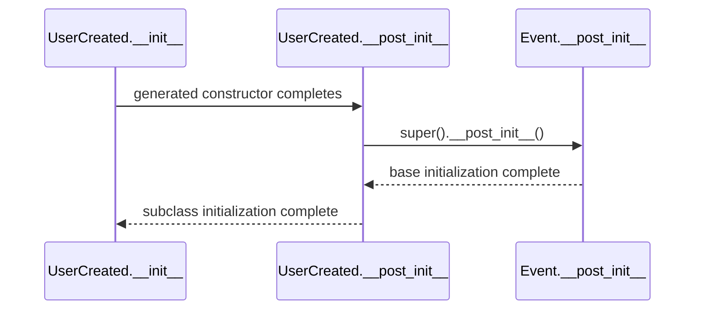
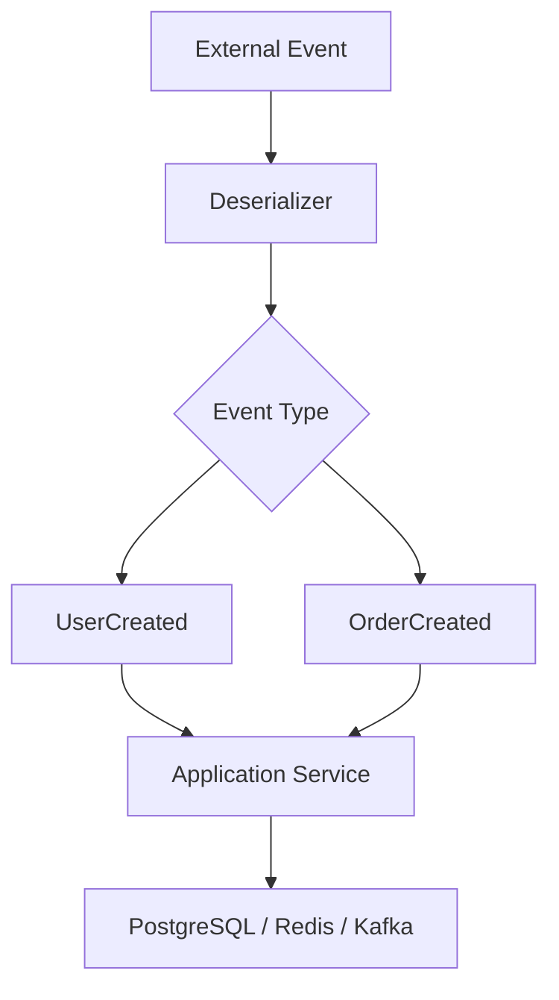

# 06- Dataclass Inheritance

## Overview

Dataclasses support inheritance through Python's normal class inheritance model while extending it with generated fields, constructors, comparison methods, and lifecycle behavior.

Inheritance can be useful when several models share:

- common identity fields
- timestamps
- metadata
- validation rules
- domain behavior
- serialization characteristics

For example:

```python
from dataclasses import dataclass


@dataclass
class Event:
    event_id: str


@dataclass
class UserCreated(Event):
    user_id: int
    email: str
```

The subclass contains the inherited `event_id` field together with its own fields.

Dataclass inheritance is powerful, but it has important interactions with:

- field ordering
- generated `__init__()`
- `__post_init__()`
- defaults
- `kw_only`
- frozen dataclasses
- slots
- multiple inheritance
- equality
- method overriding
- type checking

For production systems, inheritance should be used when the parent-child relationship represents a genuine domain relationship. If the relationship is primarily code reuse, composition is often easier to maintain.

---

## Why Dataclass Inheritance Exists

Without dataclasses, shared model state often requires repetitive constructor and representation code:

```python
class Event:
    def __init__(self, event_id: str) -> None:
        self.event_id = event_id
```

A dataclass lets the base model express the shared structure directly:

```python
from dataclasses import dataclass


@dataclass
class Event:
    event_id: str
```

Subclasses can then extend the model:

```python
@dataclass
class UserCreated(Event):
    user_id: int
```

The resulting design communicates:

```text
Event
 │
 ├── event_id
 │
 └── UserCreated
      └── user_id
```

The main benefit is not merely less code. It is that the inheritance hierarchy becomes part of the model's explicit data contract.

---

## Basic Inheritance

```python
from dataclasses import dataclass


@dataclass
class Event:
    event_id: str


@dataclass
class UserCreated(Event):
    user_id: int
    email: str
```

Construction includes inherited fields:

```python
event = UserCreated(
    event_id="evt-123",
    user_id=42,
    email="user@example.com",
)

print(event.event_id)
print(event.user_id)
print(event.email)
```

The generated subclass constructor effectively accounts for both the base and subclass fields.

Conceptually:

```text
UserCreated.__init__(
    event_id,
    user_id,
    email,
)
```

---

## Field Collection

Dataclasses collect fields across the inheritance hierarchy.

For:

```python
@dataclass
class Event:
    event_id: str


@dataclass
class UserCreated(Event):
    user_id: int
    email: str
```

the effective fields are:

| Field | Declared by | Effective model |
|---|---|---|
| `event_id` | `Event` | `UserCreated` |
| `user_id` | `UserCreated` | `UserCreated` |
| `email` | `UserCreated` | `UserCreated` |

This affects:

- generated `__init__()`
- `repr()`
- equality
- ordering if enabled
- `dataclasses.fields()`
- serialization through `asdict()`

---

## Generated Constructor

The subclass constructor includes inherited fields.

```python
from dataclasses import dataclass
import inspect


@dataclass
class Event:
    event_id: str


@dataclass
class UserCreated(Event):
    user_id: int


print(inspect.signature(UserCreated))
```

Conceptually, the signature is:

```text
(event_id: str, user_id: int)
```

The important point is that dataclass construction is generated from the complete effective field set.

---

## Field Ordering

Field ordering is one of the most important inheritance rules.

Consider:

```python
@dataclass
class Event:
    event_id: str


@dataclass
class UserCreated(Event):
    user_id: int
```

The effective order is:

```text
event_id
user_id
```

The inherited fields appear before fields introduced by the subclass.

This matters because constructor generation follows field order.

---

## Default Field Ordering

The normal dataclass rule applies across inheritance:

> A field without a default cannot follow a field with a default in the generated `__init__()`.

For example:

```python
@dataclass
class Event:
    event_id: str
    source: str = "api"


@dataclass
class UserCreated(Event):
    user_id: int
```

This causes a dataclass construction error because the inherited defaulted field precedes the subclass's required field.

Conceptually, Python would need:

```python
def __init__(
    self,
    event_id: str,
    source: str = "api",
    user_id: int,
):
    ...
```

which violates normal Python function parameter ordering.

---

## Solving Inherited Default Ordering

One option is to make the subclass field keyword-only:

```python
from dataclasses import dataclass


@dataclass
class Event:
    event_id: str
    source: str = "api"


@dataclass
class UserCreated(Event):
    user_id: int = 0
```

Another approach is to redesign the model so required and optional fields have appropriate ownership.

Keyword-only fields are often clearer for evolving models:

```python
from dataclasses import dataclass


@dataclass
class Event:
    event_id: str
    source: str = "api"


@dataclass
class UserCreated(Event):
    user_id: int
```

The exact solution depends on the required constructor contract; `kw_only=True` can also be applied at the class or field level where appropriate.

---

## Keyword-Only Inheritance

Using keyword-only fields can make inheritance safer:

```python
from dataclasses import dataclass


@dataclass
class Event:
    event_id: str


@dataclass
class UserCreated(Event):
    user_id: int
    email: str
```

For larger domain models, a project may choose keyword-only construction:

```python
@dataclass(kw_only=True)
class Event:
    event_id: str


@dataclass(kw_only=True)
class UserCreated(Event):
    user_id: int
    email: str
```

Construction becomes:

```python
event = UserCreated(
    event_id="evt-123",
    user_id=42,
    email="user@example.com",
)
```

Keyword-only models reduce ambiguity when constructors grow over time.

---

## Overriding a Field

A subclass can override an inherited field:

```python
from dataclasses import dataclass


@dataclass
class Event:
    source: str


@dataclass
class UserCreated(Event):
    source: str = "user-service"
```

The subclass's declaration replaces the inherited field definition for the effective dataclass model.

This can affect:

- default values
- type annotations
- field metadata
- constructor behavior
- comparison
- serialization

Field overrides should therefore be deliberate.

---

## Field Type Overrides

Python allows a subclass to redeclare an inherited attribute with a different annotation:

```python
@dataclass
class Event:
    source: str


@dataclass
class InternalEvent(Event):
    source: str
```

More aggressive type changes require careful static type analysis.

For example:

```python
@dataclass
class Event:
    payload: object


@dataclass
class UserEvent(Event):
    payload: dict[str, object]
```

Whether such an override is type-safe depends on how the attribute is used and on the variance rules enforced by the type checker.

Do not use inheritance to force incompatible data contracts merely to avoid creating a new model.

---

## `__post_init__()` in Inheritance

`__post_init__()` is one of the most important dataclass inheritance details.

Consider:

```python
from dataclasses import dataclass


@dataclass
class Event:
    event_id: str

    def __post_init__(self) -> None:
        self.event_id = self.event_id.strip()


@dataclass
class UserCreated(Event):
    email: str

    def __post_init__(self) -> None:
        self.email = self.email.strip().lower()
```

The subclass's `__post_init__()` does **not** automatically call the parent's `__post_init__()`.

Therefore, `Event.__post_init__()` is skipped.

---

## Calling Parent `__post_init__()`

When the parent contains important initialization logic, explicitly call:

```python
@dataclass
class UserCreated(Event):
    email: str

    def __post_init__(self) -> None:
        super().__post_init__()
        self.email = self.email.strip().lower()
```

The lifecycle becomes:



This explicit call is important because Python does not automatically chain arbitrary overridden methods.

---

## Why Explicit `super()` Matters

Suppose the parent validates:

```python
@dataclass
class Event:
    event_id: str

    def __post_init__(self) -> None:
        if not self.event_id:
            raise ValueError("event_id is required")
```

A subclass that omits `super()` can accidentally bypass the invariant:

```python
@dataclass
class UserCreated(Event):
    email: str

    def __post_init__(self) -> None:
        self.email = self.email.lower()
```

Now:

```python
UserCreated(
    event_id="",
    email="user@example.com",
)
```

may bypass the parent's validation.

For domain models, this can create invalid state that is difficult to diagnose later.

---

## `__post_init__()` and Multiple Inheritance

When using multiple inheritance, cooperative initialization becomes more important.

A base class should generally use:

```python
def __post_init__(self) -> None:
    super().__post_init__()
```

only when the hierarchy guarantees that the next class provides a compatible implementation.

Unlike ordinary methods, dataclasses do not automatically synthesize a universal `__post_init__()` contract across arbitrary base classes.

Multiple inheritance should therefore be designed deliberately rather than relying on accidental MRO behavior.

---

## Custom `__init__()` in Inheritance

A custom constructor changes the normal dataclass lifecycle.

Consider:

```python
@dataclass
class Event:
    event_id: str


@dataclass
class UserCreated(Event):
    email: str

    def __init__(
        self,
        event_id: str,
        email: str,
    ) -> None:
        self.event_id = event_id
        self.email = email
```

The dataclass-generated constructor is replaced.

As a result, normal generated constructor behavior no longer applies.

If initialization invariants are required, explicitly design the lifecycle rather than assuming dataclass machinery will call everything automatically.

---

## Calling `super().__init__()`

If a custom subclass constructor calls the parent's constructor:

```python
class UserCreated(Event):
    def __init__(
        self,
        event_id: str,
        email: str,
    ) -> None:
        super().__init__(event_id)
        self.email = email
```

the parent's constructor runs according to normal Python inheritance semantics.

But if the base class is a dataclass, remember that generated constructors and custom constructors are separate implementation choices.

Prefer generated constructors unless custom construction is genuinely required.

---

## `InitVar` in Inheritance

`InitVar` values can participate in post-initialization:

```python
from dataclasses import dataclass, InitVar


@dataclass
class User:
    email: str
    normalize: InitVar[bool] = True

    def __post_init__(self, normalize: bool) -> None:
        if normalize:
            self.email = self.email.strip().lower()
```

A subclass may introduce additional initialization inputs:

```python
@dataclass
class AdminUser(User):
    role: str = "admin"
```

The complete initialization contract must account for inherited and subclass initialization variables.

Use `InitVar` sparingly in inheritance hierarchies because constructor behavior can become difficult to discover as the hierarchy grows.

---

## Frozen Dataclass Inheritance

Frozen and non-frozen dataclasses cannot be mixed arbitrarily.

For example, a non-frozen subclass cannot simply remove the immutability guarantee inherited from a frozen dataclass.

Similarly, a frozen subclass cannot freely inherit from a mutable dataclass.

The rules exist to preserve a coherent assignment contract.

A common and clean design is to keep the hierarchy consistently frozen:

```python
from dataclasses import dataclass


@dataclass(frozen=True)
class Event:
    event_id: str


@dataclass(frozen=True)
class UserCreated(Event):
    user_id: int
```

This produces a consistent immutable model.

---

## Frozen Initialization in Inheritance

With:

```python
@dataclass(frozen=True)
class Event:
    event_id: str
```

normal assignment is prohibited after initialization.

Normalization inside `__post_init__()` requires controlled assignment:

```python
@dataclass(frozen=True)
class Event:
    event_id: str

    def __post_init__(self) -> None:
        object.__setattr__(
            self,
            "event_id",
            self.event_id.strip(),
        )
```

A subclass follows the same rule:

```python
@dataclass(frozen=True)
class UserCreated(Event):
    email: str

    def __post_init__(self) -> None:
        super().__post_init__()

        object.__setattr__(
            self,
            "email",
            self.email.strip().lower(),
        )
```

This preserves the frozen contract while allowing controlled initialization.

---

## Slots and Inheritance

Slots can be combined with inheritance:

```python
from dataclasses import dataclass


@dataclass(slots=True)
class Event:
    event_id: str


@dataclass(slots=True)
class UserCreated(Event):
    user_id: int
```

The base and subclass contribute their respective slots.

Conceptually:

```text
Event
└── slot: event_id

UserCreated
└── inherited slot: event_id
└── own slot: user_id
```

When using slotted hierarchies, avoid relying on the literal contents of `__slots__` to discover all inherited dataclass fields.

Use:

```python
from dataclasses import fields

fields(UserCreated)
```

for dataclass field introspection.

---

## Frozen Slots and Inheritance

A compact immutable hierarchy is possible:

```python
@dataclass(
    frozen=True,
    slots=True,
)
class Event:
    event_id: str


@dataclass(
    frozen=True,
    slots=True,
)
class UserCreated(Event):
    user_id: int
    email: str
```

This is particularly useful for high-volume domain events or value-oriented models.

It combines:

```text
Inheritance
     +
Dataclass-generated model behavior
     +
Immutability
     +
Compact instance layout
```

The additional complexity of inheritance should still be justified by the domain.

---

## Equality in Inherited Dataclasses

Dataclass-generated equality compares instances according to dataclass semantics.

Consider:

```python
from dataclasses import dataclass


@dataclass
class Event:
    event_id: str


@dataclass
class UserCreated(Event):
    user_id: int
```

Two `UserCreated` instances with the same values compare equal:

```python
a = UserCreated("evt-1", 42)
b = UserCreated("evt-1", 42)

assert a == b
```

But inheritance affects the generated comparison structure.

Dataclass equality is generally type-sensitive rather than simply comparing every object that happens to expose the same attributes.

This is one reason domain inheritance should reflect meaningful type identity.

---

## Equality and Domain Semantics

Suppose:

```python
@dataclass
class Event:
    event_id: str


@dataclass
class UserCreated(Event):
    user_id: int
```

If `event_id` is globally unique, it may be tempting to say:

```text
same event_id → same event
```

But generated dataclass equality considers the model's fields and type semantics.

If the domain identity differs from structural equality, implement the domain behavior explicitly instead of assuming dataclass-generated equality represents business identity.

---

## Inheritance and `eq=False`

A class can disable generated equality:

```python
@dataclass(eq=False)
class Event:
    event_id: str
```

This may be appropriate when identity semantics are implemented separately.

Do not disable equality simply because inherited comparison behavior is inconvenient. First determine whether the model represents:

- a value object
- a DTO
- an entity
- an event
- an infrastructure object

The correct equality strategy depends on that distinction.

---

## Ordering

Dataclasses can generate ordering methods:

```python
@dataclass(order=True)
class Event:
    timestamp: int
    event_id: str
```

Inheritance can make ordering semantics harder to reason about because inherited and subclass fields participate in the generated comparison.

Ordering should only be enabled when there is a clear total ordering for the domain.

Do not enable `order=True` merely because sorting is occasionally convenient.

Often an explicit key is clearer:

```python
events.sort(key=lambda event: event.timestamp)
```

---

## `repr()` in Inheritance

Dataclasses generate useful representations that include inherited fields.

```python
event = UserCreated(
    event_id="evt-123",
    user_id=42,
    email="user@example.com",
)

print(event)
```

Conceptually:

```text
UserCreated(event_id='evt-123', user_id=42, email='user@example.com')
```

Be careful when models contain sensitive information.

For example:

```python
@dataclass
class User:
    user_id: int
    password_hash: str
```

A generated `repr()` could expose sensitive information through logs.

Use:

```python
from dataclasses import dataclass, field


@dataclass
class User:
    user_id: int
    password_hash: str = field(repr=False)
```

Inheritance does not remove this logging risk.

---

## Inheritance and `field()`

Subclass fields can use the same dataclass controls:

```python
from dataclasses import dataclass, field


@dataclass
class Event:
    event_id: str


@dataclass
class UserCreated(Event):
    email: str = field(
        repr=False,
        compare=True,
    )
```

This is useful when inherited and subclass fields have different representation or comparison requirements.

---

## Metadata in Inherited Fields

Fields can carry metadata:

```python
from dataclasses import dataclass, field


@dataclass
class Event:
    event_id: str = field(
        metadata={"source": "kafka"}
    )


@dataclass
class UserCreated(Event):
    user_id: int = field(
        metadata={"source": "postgres"}
    )
```

Metadata can support application-level tooling, but it is not interpreted by dataclasses itself.

Avoid using inheritance merely to create metadata hierarchies if a separate schema or registry would be clearer.

---

## Serialization

`dataclasses.asdict()` includes inherited dataclass fields:

```python
from dataclasses import asdict


event = UserCreated(
    event_id="evt-123",
    user_id=42,
    email="user@example.com",
)

payload = asdict(event)
```

The resulting mapping includes the effective fields:

```python
{
    "event_id": "evt-123",
    "user_id": 42,
    "email": "user@example.com",
}
```

This is convenient for internal transformations.

For external APIs or event contracts, prefer explicit schema definitions where the wire format must remain stable.

---

## Inheritance and API Contracts

A common mistake is exposing an inheritance hierarchy directly as a REST API contract.

For example:

```text
BaseEvent
   │
   ├── UserCreated
   ├── OrderCreated
   └── PaymentCreated
```

This may be a useful internal domain model.

But the external API may need:

```text
{
    "type": "user.created",
    "version": 1,
    "data": {...}
}
```

Keep internal inheritance separate from external protocol evolution when compatibility matters.

---

## Event-Driven Systems

Dataclass inheritance can represent internal event families:

```python
from dataclasses import dataclass


@dataclass(frozen=True, slots=True)
class DomainEvent:
    event_id: str
    occurred_at: int


@dataclass(frozen=True, slots=True)
class UserCreated(DomainEvent):
    user_id: int
    email: str


@dataclass(frozen=True, slots=True)
class OrderCreated(DomainEvent):
    order_id: int
    customer_id: int
```

Architecture:



The hierarchy can provide shared event metadata while allowing event-specific payloads.

---

## Kafka and Schema Evolution

Inheritance does not automatically solve distributed schema evolution.

A Python model:

```python
@dataclass
class UserCreated(DomainEvent):
    user_id: int
```

does not guarantee compatibility with consumers written in:

- Java
- Go
- Rust
- TypeScript

For Kafka contracts, explicitly manage:

- event type
- schema version
- required fields
- optional fields
- backward compatibility
- serialization format

Use Protocol Buffers, Avro, or another explicit schema system when appropriate.

Python inheritance should remain an implementation detail unless the wire contract explicitly models the same hierarchy.

---

## FastAPI and Pydantic

Pydantic models are often better suited for external API validation.

A useful architecture is:

```text
HTTP request
     │
     ▼
Pydantic request model
     │
     ▼
Dataclass command/domain model
     │
     ▼
Application service
```

For example:

```python
from dataclasses import dataclass

from pydantic import BaseModel


class CreateUserRequest(BaseModel):
    email: str


@dataclass(frozen=True, slots=True)
class CreateUserCommand:
    email: str
```

The API model handles boundary validation.

The dataclass hierarchy handles internal domain representation.

---

## Django and ORM Models

Do not automatically make Django model inheritance hierarchies into dataclass hierarchies.

Django models have their own:

- field descriptors
- metadata
- managers
- lifecycle
- persistence behavior
- inheritance semantics

A safer separation is:

```text
Django ORM Model
       │
       ▼
Repository / Mapper
       │
       ▼
Dataclass Domain Model
       │
       ▼
Application Service
```

This avoids coupling dataclass generation with ORM lifecycle behavior.

---

## Composition vs Inheritance

A key design decision is whether a child really **is a** parent.

Inheritance:

```python
@dataclass
class DomainEvent:
    event_id: str


@dataclass
class UserCreated(DomainEvent):
    user_id: int
```

Composition:

```python
@dataclass
class EventMetadata:
    event_id: str


@dataclass
class UserCreated:
    metadata: EventMetadata
    user_id: int
```

Inheritance is appropriate when polymorphism is meaningful.

Composition is often better when the shared object is merely reusable data.

---

## When Inheritance Is Appropriate

Use dataclass inheritance when:

- subclasses genuinely represent specialized forms of the parent
- shared fields have consistent semantics
- polymorphic handling is useful
- the hierarchy is relatively stable
- the parent defines meaningful invariants
- consumers benefit from common behavior

Typical examples:

- domain event families
- command hierarchies
- typed messages
- protocol-specific variants
- state-specific domain models

---

## When Composition Is Better

Prefer composition when:

- shared fields are merely reusable metadata
- inheritance exists primarily to reduce duplication
- the hierarchy is changing frequently
- different combinations of features are required
- multiple inheritance would be necessary
- serialization contracts become difficult to understand
- subclasses do not satisfy a meaningful "is-a" relationship

A shallow composition model is often easier to evolve than a deep inheritance tree.

---

## Deep Inheritance Is a Maintenance Risk

Consider:

```text
BaseEvent
    │
    └── AuditedEvent
          │
          └── AuthenticatedEvent
                │
                └── UserEvent
                      │
                      └── UserCreatedEvent
```

Each level can affect:

- constructor ordering
- defaults
- validation
- `__post_init__()`
- equality
- serialization
- slots
- frozen behavior

The effective behavior becomes distributed across the MRO.

For backend systems, prefer shallow hierarchies.

---

## Multiple Inheritance

Multiple inheritance can technically work:

```python
@dataclass
class Identified:
    object_id: str


@dataclass
class Timestamped:
    created_at: int


@dataclass
class Resource(Identified, Timestamped):
    name: str
```

But generated initialization and field ordering become more difficult to reason about as the hierarchy grows.

Potential issues include:

- MRO complexity
- field ordering
- duplicate fields
- default conflicts
- `__post_init__()` chaining
- slots layout
- frozen compatibility

Composition is usually preferable once multiple inheritance becomes structurally important.

---

## Method Resolution Order

Dataclass inheritance still follows Python's normal MRO.

For:

```python
class Child(Base):
    ...
```

Python resolves:

```text
Child
  ↓
Base
  ↓
object
```

For multiple inheritance, Python calculates a more complex MRO.

Dataclasses do not replace Python's inheritance semantics. They add generated methods and field processing on top of them.

This distinction is important during debugging.

---

## Parent Methods and Subclasses

A dataclass subclass inherits normal methods:

```python
@dataclass
class Event:
    event_id: str

    def event_type(self) -> str:
        return "event"


@dataclass
class UserCreated(Event):
    user_id: int

    def event_type(self) -> str:
        return "user.created"
```

The subclass can override behavior normally.

Dataclass inheritance therefore combines:

```text
Python inheritance
+
dataclass field generation
```

Do not assume dataclasses create a separate inheritance mechanism.

---

## Abstract Dataclass Bases

A dataclass can also participate in abstract class designs:

```python
from abc import ABC, abstractmethod
from dataclasses import dataclass


@dataclass
class Command(ABC):
    command_id: str

    @abstractmethod
    def execute(self) -> None:
        ...
```

Concrete subclasses can extend the model:

```python
@dataclass
class CreateUserCommand(Command):
    email: str

    def execute(self) -> None:
        print(f"Creating {self.email}")
```

This can be useful when the parent provides both:

- shared state
- required behavioral contracts

However, a `Protocol` may be more appropriate when structural typing is preferred over inheritance.

---

## Type Checking

Static type checkers understand dataclass inheritance.

For example:

```python
def process_event(event: Event) -> None:
    ...


user_created = UserCreated(
    event_id="evt-123",
    user_id=42,
    email="user@example.com",
)

process_event(user_created)
```

The subclass is accepted because it is an `Event`.

For complex hierarchies, explicit type aliases or discriminated unions can be clearer than deep inheritance.

---

## Pattern Matching

Dataclasses can participate in structural pattern matching.

For example:

```python
@dataclass
class Event:
    event_id: str


@dataclass
class UserCreated(Event):
    user_id: int
```

Pattern matching can distinguish variants:

```python
def handle(event: Event) -> None:
    match event:
        case UserCreated(event_id=event_id, user_id=user_id):
            print(event_id, user_id)
        case Event(event_id=event_id):
            print(event_id)
```

This is useful for internal event dispatch.

For externally sourced messages, validate the payload before constructing the dataclass hierarchy.

---

## Performance Considerations

Inheritance itself is usually not a significant performance bottleneck in ordinary backend workloads.

The more relevant costs are:

- object allocation
- field count
- serialization
- validation
- database access
- network I/O
- memory retention

For high-volume models, combining:

```python
@dataclass(
    slots=True,
    frozen=True,
)
```

can reduce per-instance overhead and make object semantics more predictable.

But benchmark the complete workload rather than optimizing inheritance in isolation.

---

## Memory Considerations

A hierarchy with many inherited fields can produce larger objects simply because the objects contain more state.

For example:

```text
Base
├── id
├── created_at
├── tenant_id
└── source

Subclass
├── status
├── payload
└── metadata
```

The subclass naturally consumes more memory.

Slots can reduce structural overhead, but they cannot eliminate the memory required for actual fields and referenced objects.

If `payload` contains a large dictionary, slots will not make that dictionary smaller.

---

## Concurrency

Immutable inherited dataclasses are useful for concurrent processing:

```python
@dataclass(frozen=True, slots=True)
class Event:
    event_id: str


@dataclass(frozen=True, slots=True)
class UserCreated(Event):
    user_id: int
```

Multiple threads or asyncio tasks can safely share references to the same object when its complete reachable state is appropriately immutable.

However, inheritance does not make mutable objects thread-safe.

The concurrency guarantee comes from the mutability model, not from dataclass inheritance itself.

---

## Security Considerations

Inheritance should not be used to encode authorization.

For example:

```python
@dataclass
class AdminUser(User):
    ...
```

does not mean the object is authorized to perform administrative operations.

Authorization should depend on explicit identity and policy:

```text
Identity
   ↓
Authentication
   ↓
Authorization policy
   ↓
Allowed operation
```

Also ensure inherited `repr()` and serialization do not expose:

- credentials
- tokens
- secrets
- internal identifiers
- sensitive payloads

Use `repr=False` and explicit serialization where necessary.

---

## Reliability Considerations

A parent dataclass can establish invariants shared by every subclass:

```python
@dataclass
class DomainEvent:
    event_id: str

    def __post_init__(self) -> None:
        if not self.event_id:
            raise ValueError("event_id is required")
```

Every subclass should preserve those invariants.

If subclasses can bypass base initialization or validation, the hierarchy becomes unreliable.

For critical domain models:

- keep base invariants minimal and fundamental
- explicitly chain `__post_init__()`
- test every concrete subclass
- avoid hidden side effects
- keep initialization deterministic

---

## Avoid External I/O in `__post_init__()`

Inheritance makes side effects in `__post_init__()` particularly dangerous.

Avoid:

```python
@dataclass
class Event:
    event_id: str

    def __post_init__(self) -> None:
        self.load_from_database()
```

A subclass may instantiate the object in a context where database access is unexpected.

Keep dataclass initialization:

```text
local
deterministic
fast
side-effect free
```

Put external I/O in:

- repositories
- application services
- factories
- async service functions

---

## Testing Inheritance

Test the base invariants:

```python
def test_event_requires_id() -> None:
    with pytest.raises(ValueError):
        UserCreated(
            event_id="",
            user_id=42,
            email="user@example.com",
        )
```

Test subclass-specific invariants separately:

```python
def test_user_created_normalizes_email() -> None:
    event = UserCreated(
        event_id="evt-1",
        user_id=42,
        email=" USER@example.com ",
    )

    assert event.email == "user@example.com"
```

This makes failures easier to localize.

---

## Testing `__post_init__()` Chaining

When base initialization matters, explicitly test it:

```python
def test_base_post_init_is_called() -> None:
    event = UserCreated(
        event_id=" evt-1 ",
        user_id=42,
        email="USER@example.com",
    )

    assert event.event_id == "evt-1"
    assert event.email == "user@example.com"
```

This catches accidental omission of:

```python
super().__post_init__()
```

---

## Production Architecture Example

A backend event model might use:

```python
from dataclasses import dataclass


@dataclass(frozen=True, slots=True)
class DomainEvent:
    event_id: str
    occurred_at: int


@dataclass(frozen=True, slots=True)
class UserCreated(DomainEvent):
    user_id: int
    email: str


@dataclass(frozen=True, slots=True)
class OrderCreated(DomainEvent):
    order_id: int
    customer_id: int
```

Processing:

```text
                    Kafka
                      │
                      ▼
                Deserializer
                      │
                      ▼
              DomainEvent family
                 │          │
                 ▼          ▼
           UserCreated  OrderCreated
                 │          │
                 └────┬─────┘
                      ▼
              Application Service
                 │          │
                 ▼          ▼
             PostgreSQL    Redis
                      │
                      ▼
                    Kafka
```

The base class provides common metadata while concrete events carry type-specific information.

---

## Dataclass Inheritance vs Pydantic Inheritance

| Concern | Dataclass inheritance | Pydantic inheritance |
|---|---|---|
| Primary purpose | Lightweight data modeling | Validated data modeling |
| Runtime validation | Manual | Built in |
| Generated constructor | Yes | Yes |
| Type coercion | No automatic validation | Framework-controlled |
| Serialization | Manual / `asdict()` | Built-in facilities |
| External API boundary | Usually internal | Often suitable |
| Domain value objects | Strong fit | Strong fit |
| Object overhead | Generally low | Framework-dependent |
| Slots | Supported | Framework/version dependent |
| ORM integration | Usually explicit mapping | Framework-specific |

A common architecture is to use Pydantic at the external boundary and dataclasses internally.

---

## Dataclass Inheritance vs Composition

| Factor | Inheritance | Composition |
|---|---|---|
| Shared fields | Natural | Explicit |
| Polymorphism | Strong | Requires explicit protocol/interface |
| Constructor complexity | Can grow quickly | Usually localized |
| Deep hierarchies | Risky | Usually easier |
| Multiple combinations | Poor fit | Strong fit |
| Serialization | Can become implicit | More explicit |
| Domain "is-a" relationship | Strong fit | Weak fit |
| Code reuse only | Often excessive | Strong fit |
| Long-term evolution | Can become rigid | Usually more flexible |

Choose inheritance for semantic relationships, not merely because two classes share fields.

---

## Production Decision Guide

Use dataclass inheritance when:

```text
Is the child genuinely a specialized parent?
        │
       Yes
        │
        ▼
Does the parent define meaningful shared invariants?
        │
       Yes
        │
        ▼
Is polymorphic handling useful?
        │
       Yes
        │
        ▼
Use a shallow dataclass hierarchy
```

Prefer composition when:

```text
Are fields merely shared implementation details?
        │
       Yes
        │
        ▼
Do different combinations of features exist?
        │
       Yes
        │
        ▼
Prefer composition
```

---

## Common Mistakes

### Forgetting `super().__post_init__()`

A subclass override does not automatically execute the parent implementation.

### Adding Defaults to Base Fields

Inherited defaults can make required subclass fields invalid because of Python constructor ordering rules.

### Creating Deep Hierarchies

Every level adds constructor, validation, equality, serialization, and MRO complexity.

### Using Inheritance for Code Reuse

Shared fields alone do not necessarily justify an `is-a` relationship.

### Ignoring Frozen Constraints

Frozen and non-frozen dataclass inheritance combinations are restricted.

### Assuming Slots Are Automatically Inherited Everywhere

Slotted inheritance follows Python's class layout rules. Use dataclass field metadata for model introspection.

### Exposing Internal Hierarchies as API Contracts

Python inheritance is not a substitute for explicit API or event schema versioning.

### Putting I/O in Base Initialization

A database or network call hidden inside inherited `__post_init__()` can make object construction unpredictable.

### Assuming Dataclass Equality Means Business Identity

Structural equality and domain identity are different concepts.

### Overriding Fields Without Reviewing Semantics

Changing a field's default, type, metadata, or comparison behavior can alter the effective contract of every subclass.

---

## Production Pitfalls

### Constructor Fragility

A base class adding a defaulted field can break existing subclasses because generated constructor ordering changes.

Treat shared base fields as part of the constructor contract.

### Hidden Base Invariants

A subclass that forgets `super().__post_init__()` may silently bypass validation.

### Serialization Drift

Adding inherited fields can change serialized output unexpectedly.

External contracts should use explicit schemas.

### Framework Coupling

Frameworks such as Django and Pydantic have their own inheritance semantics. Do not assume dataclass inheritance and framework inheritance behave identically.

### MRO Complexity

Multiple inheritance can make initialization and method dispatch difficult to reason about.

### Sensitive `repr()`

Inherited fields may appear in generated representations and therefore enter logs.

### Memory Growth

Inheritance does not reduce the memory required by inherited fields. Use slots when appropriate and control object population.

---

## Best Practices

- Use inheritance only for genuine domain specialization.
- Keep dataclass inheritance hierarchies shallow.
- Explicitly call `super().__post_init__()` when parent initialization is required.
- Keep `__post_init__()` local, deterministic, and side-effect free.
- Design inherited field defaults carefully.
- Prefer keyword-only fields for large or evolving constructors.
- Treat base-class fields as part of the public constructor contract.
- Keep frozen/non-frozen inheritance consistent.
- Combine `frozen=True` and `slots=True` for compact immutable value-oriented hierarchies when appropriate.
- Prefer composition when inheritance exists primarily for code reuse.
- Avoid multiple inheritance unless its MRO and initialization behavior are well understood.
- Use `dataclasses.fields()` for field introspection across inheritance hierarchies.
- Use explicit schemas for REST and Kafka contracts rather than exposing Python inheritance directly.
- Keep API validation at the boundary and domain modeling inside the application layer.
- Test inherited invariants and subclass-specific invariants independently.
- Use `repr=False` for sensitive fields.
- Benchmark memory for high-volume object populations.
- Avoid database, Redis, HTTP, Kafka, or AWS calls during dataclass construction.
- Monitor memory and object population in high-throughput services.
- Prefer composition when the model is evolving rapidly or requires many orthogonal capabilities.

---

## Interview Traps

### Does a dataclass subclass inherit fields?

Yes. Dataclass fields are collected across the inheritance hierarchy and participate in generated methods.

### Does a subclass automatically call the parent's `__post_init__()`?

No. If the subclass defines `__post_init__()`, it must explicitly call `super().__post_init__()` when the parent implementation is required.

### Does the generated subclass constructor include parent fields?

Yes, inherited dataclass fields participate in the generated constructor.

### Why can inheritance cause a `TypeError` involving defaults?

Because inherited fields are included in constructor ordering. A defaulted base field can appear before a required subclass field, violating Python's function parameter rules.

### Does dataclass inheritance change Python's MRO?

No. Dataclasses use normal Python inheritance and MRO semantics.

### Can a frozen dataclass have a non-frozen dataclass subclass?

No. Dataclass immutability constraints prevent arbitrary weakening of a frozen inheritance contract.

### Does `slots=True` remove inherited fields?

No. Base-class slots remain part of the object layout.

### Should dataclass inheritance be used for API versioning?

Usually no. External API compatibility should be represented with explicit schemas and versioning.

### Is composition always better?

No. Inheritance is appropriate when there is a real semantic subtype relationship and polymorphism provides value.

### Can dataclass subclasses override fields?

Yes. A subclass can redeclare an inherited field, potentially changing its default, annotation, metadata, and other dataclass configuration.

### Does `asdict()` include inherited fields?

Yes. Dataclass fields from the effective model are included.

### Can a dataclass inherit from an abstract base class?

Yes. Dataclasses can participate in normal abstract class hierarchies.

---

## Production Checklist

- [ ] Does the inheritance hierarchy represent a genuine domain relationship?
- [ ] Is the hierarchy shallow?
- [ ] Are inherited fields semantically valid for every subclass?
- [ ] Are base and subclass constructor signatures intentional?
- [ ] Have inherited default fields been reviewed for ordering conflicts?
- [ ] Are keyword-only fields appropriate?
- [ ] Are overridden fields intentionally changing the contract?
- [ ] Does every required parent `__post_init__()` get called?
- [ ] Are `__post_init__()` operations deterministic and side-effect free?
- [ ] Are custom `__init__()` methods truly necessary?
- [ ] Is frozen inheritance consistent?
- [ ] Is `slots=True` appropriate for the object population?
- [ ] Are weak references required?
- [ ] Is multiple inheritance avoided unless justified?
- [ ] Is the MRO easy to understand?
- [ ] Are equality semantics aligned with domain semantics?
- [ ] Are sensitive fields excluded from `repr()`?
- [ ] Is serialization explicitly tested?
- [ ] Are external REST/Kafka contracts independent from Python inheritance where appropriate?
- [ ] Are Pydantic or other boundary validation models separated from internal domain models?
- [ ] Are inherited invariants covered by tests?
- [ ] Are subclass-specific invariants covered by tests?
- [ ] Are high-volume object populations memory-profiled?
- [ ] Are database and network side effects kept outside model construction?
- [ ] Would composition make the model easier to evolve?
- [ ] Has the hierarchy been reviewed for long-term maintainability?

## Key Takeaways

- **Dataclass inheritance follows normal Python inheritance while extending it with inherited fields and generated methods**, so field ordering, MRO, method overriding, and constructor rules all remain important.
- **A subclass does not automatically call its parent's `__post_init__()`**; explicitly use `super().__post_init__()` when parent validation or normalization is required.
- **Inherited default fields can create constructor-ordering failures**, making field defaults, keyword-only parameters, and base-class API stability important design considerations.
- **Use inheritance for genuine domain specialization and polymorphism, not merely for sharing fields or reducing duplication**; composition is often safer for orthogonal or rapidly evolving concerns.
- **For production models, keep hierarchies shallow, separate internal dataclass models from external API/event schemas, and deliberately combine inheritance with `frozen=True` or `slots=True` only when their semantics and operational benefits are justified.**