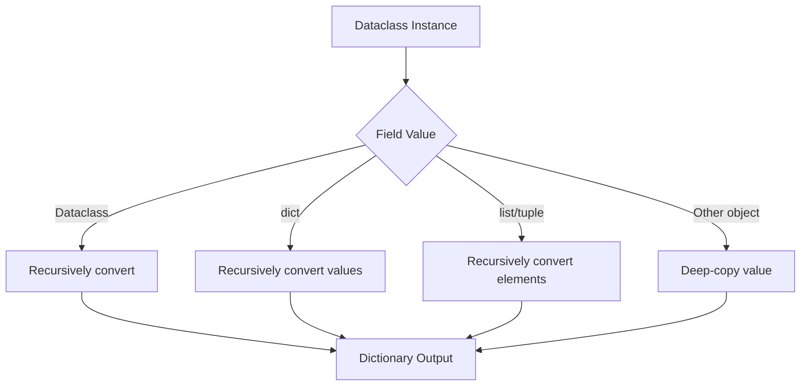

# 07- Asdict and Astuple

## Overview

The `dataclasses` module provides `asdict()` and `astuple()` for converting dataclass instances into recursively converted dictionaries or tuples.

They are useful when application models need to cross a boundary such as:

- JSON serialization
- API responses
- logging
- message publishing
- test assertions
- configuration export
- data transformation

The two functions have different output shapes:

```text
Dataclass instance
       │
       ├── asdict()
       │      ↓
       │   dict[str, object]
       │
       └── astuple()
              ↓
           tuple[object, ...]
```

Example:

```python
from dataclasses import asdict, astuple, dataclass


@dataclass
class User:
    user_id: int
    email: str


user = User(
    user_id=42,
    email="user@example.com",
)

print(asdict(user))
print(astuple(user))
```

Output:

```text
{'user_id': 42, 'email': 'user@example.com'}
(42, 'user@example.com')
```

The important production consideration is that these functions are **conversion utilities, not general-purpose high-performance serializers**. They recursively traverse dataclasses and create new structures, which can be expensive for large or deeply nested object graphs.

---

## `asdict()`

`asdict()` converts a dataclass instance into a dictionary.

Basic usage:

```python
from dataclasses import asdict, dataclass


@dataclass
class User:
    user_id: int
    email: str


user = User(42, "user@example.com")

payload = asdict(user)

print(payload)
```

Result:

```python
{
    "user_id": 42,
    "email": "user@example.com",
}
```

The dictionary keys correspond to dataclass field names.

---

## `astuple()`

`astuple()` converts a dataclass instance into a tuple.

```python
from dataclasses import astuple, dataclass


@dataclass
class User:
    user_id: int
    email: str


user = User(42, "user@example.com")

values = astuple(user)

print(values)
```

Result:

```python
(42, "user@example.com")
```

The tuple follows dataclass field order.

Unlike `asdict()`, there are no field names in the resulting structure.

---

## `asdict()` vs `astuple()`

| Property | `asdict()` | `astuple()` |
|---|---|---|
| Output | `dict` | `tuple` |
| Field names preserved | Yes | No |
| Field order preserved | Yes | Yes |
| Recursive dataclass conversion | Yes | Yes |
| Useful for JSON-like payloads | Strong fit | Usually poor fit |
| Useful for positional data | Sometimes | Strong fit |
| Self-documenting output | Yes | No |
| Mutation of top-level result | Possible | Tuple itself immutable |
| Deep conversion cost | Yes | Yes |

For most backend application boundaries, `asdict()` is more useful because field names remain explicit.

---

## How `asdict()` Works

`asdict()` recursively processes dataclass fields.

Consider:

```python
from dataclasses import asdict, dataclass


@dataclass
class Address:
    city: str
    country: str


@dataclass
class User:
    user_id: int
    address: Address
```

Then:

```python
user = User(
    user_id=42,
    address=Address(
        city="Kolkata",
        country="India",
    ),
)

print(asdict(user))
```

Result:

```python
{
    "user_id": 42,
    "address": {
        "city": "Kolkata",
        "country": "India",
    },
}
```

The nested `Address` dataclass becomes another dictionary.

---

## Recursive Conversion

The conversion process can be viewed as:



This recursive behavior is one of the most useful features of `asdict()` and also one of its biggest performance considerations.

---

## Nested Dataclasses

Nested structures are handled recursively:

```python
from dataclasses import asdict, dataclass


@dataclass
class Product:
    product_id: int
    name: str


@dataclass
class OrderItem:
    product: Product
    quantity: int


@dataclass
class Order:
    order_id: int
    items: list[OrderItem]
```

Conversion:

```python
order = Order(
    order_id=1001,
    items=[
        OrderItem(
            product=Product(
                product_id=10,
                name="Keyboard",
            ),
            quantity=2,
        )
    ],
)

payload = asdict(order)
```

Result:

```python
{
    "order_id": 1001,
    "items": [
        {
            "product": {
                "product_id": 10,
                "name": "Keyboard",
            },
            "quantity": 2,
        }
    ],
}
```

This makes `asdict()` convenient for nested application models.

---

## Lists and Tuples

Nested collections are recursively processed.

```python
from dataclasses import asdict, dataclass


@dataclass
class User:
    user_id: int


@dataclass
class Team:
    users: list[User]


team = Team(
    users=[
        User(1),
        User(2),
    ]
)

print(asdict(team))
```

Result:

```python
{
    "users": [
        {"user_id": 1},
        {"user_id": 2},
    ]
}
```

This behavior is useful for structured payload generation.

---

## Dictionaries

Mappings are also recursively traversed.

```python
from dataclasses import asdict, dataclass


@dataclass
class User:
    user_id: int


@dataclass
class Group:
    members: dict[str, User]


group = Group(
    members={
        "owner": User(1),
        "admin": User(2),
    }
)

print(asdict(group))
```

Result:

```python
{
    "members": {
        "owner": {"user_id": 1},
        "admin": {"user_id": 2},
    }
}
```

The mapping structure is preserved while nested dataclass values are converted.

---

## Non-Dataclass Values

Not every value becomes a dictionary.

For example:

```python
from datetime import datetime
from dataclasses import asdict, dataclass


@dataclass
class Event:
    event_id: str
    occurred_at: datetime
```

The `datetime` remains a `datetime` object:

```python
{
    "event_id": "evt-123",
    "occurred_at": datetime(...),
}
```

`asdict()` does not automatically convert every Python type into JSON-compatible primitives.

This distinction is important:

```text
asdict()
    ≠
JSON serializer
```

---

## `asdict()` Is Not JSON Serialization

This works:

```python
payload = asdict(event)
```

but:

```python
json.dumps(payload)
```

may still fail if the model contains values such as:

- `datetime`
- `Decimal`
- `UUID`
- `Enum`
- custom classes
- bytes

For example:

```python
from dataclasses import asdict, dataclass
from datetime import datetime
import json


@dataclass
class Event:
    event_id: str
    occurred_at: datetime


event = Event(
    event_id="evt-123",
    occurred_at=datetime.now(),
)

payload = asdict(event)

json.dumps(payload)
```

The final JSON serialization requires an explicit strategy for `datetime`.

---

## Explicit JSON Conversion

For external API or event contracts, explicit conversion is often safer:

```python
from dataclasses import dataclass
from datetime import datetime
from uuid import UUID


@dataclass(frozen=True, slots=True)
class Event:
    event_id: UUID
    occurred_at: datetime


def event_to_payload(event: Event) -> dict[str, str]:
    return {
        "event_id": str(event.event_id),
        "occurred_at": event.occurred_at.isoformat(),
    }
```

This makes the wire contract explicit instead of relying on incidental dataclass structure.

---

## `asdict()` and `field(repr=False)`

`repr=False` does not affect `asdict()`.

For example:

```python
from dataclasses import asdict, dataclass, field


@dataclass
class User:
    user_id: int
    password_hash: str = field(repr=False)
```

Then:

```python
user = User(
    user_id=42,
    password_hash="secret",
)

print(user)
print(asdict(user))
```

The password hash is hidden from `repr()` but remains present in the dictionary.

This is an important security distinction.

If a field should not leave the model boundary, use explicit serialization rules.

---

## Sensitive Data

Never assume:

```python
asdict(model)
```

is safe to log.

For example:

```python
@dataclass
class Credentials:
    username: str
    access_token: str
```

Calling:

```python
logger.info("credentials=%s", asdict(credentials))
```

can leak credentials into:

- application logs
- CloudWatch
- centralized logging systems
- SIEM systems
- debugging tools
- retained log archives

Use explicit redaction:

```python
def safe_credentials_payload(
    credentials: Credentials,
) -> dict[str, str]:
    return {
        "username": credentials.username,
        "access_token": "[REDACTED]",
    }
```

---

## Deep Copy Semantics

A critical implementation detail is that `asdict()` does more than simply expose references.

For non-dataclass values, the implementation uses `copy.deepcopy()` semantics.

This means:

```python
payload = asdict(model)
```

should be treated as creating a converted copy rather than a lightweight view.

This has implications for:

- memory
- CPU
- object allocation
- nested mutable structures
- large payloads

---

## Why Deep Copy Matters

Consider:

```python
from dataclasses import asdict, dataclass


@dataclass
class Batch:
    records: list[dict[str, object]]
```

If `records` contains thousands of nested objects:

```text
Dataclass
    │
    └── records
          │
          ├── dict
          │    └── nested values
          ├── dict
          │    └── nested values
          └── ...
```

`asdict()` creates a separate converted structure.

This can temporarily increase memory usage substantially.

For large payloads, explicit serialization or streaming may be more appropriate.

---

## Performance Characteristics

The approximate work performed by `asdict()` is proportional to the number of dataclass fields and nested elements it traverses, but the real cost depends heavily on the object graph.

A useful model is:

```text
Cost ≈ traversal
     + allocations
     + recursive conversion
     + deep-copy work
```

For a small DTO:

```text
small object
→ negligible
```

For millions of nested records:

```text
large object graph
→ significant CPU + memory
```

Do not call `asdict()` repeatedly inside a hot loop without measuring the cost.

---

## High-Throughput Example

Avoid blindly doing:

```python
for event in events:
    publish(asdict(event))
```

when `events` contains hundreds of thousands of complex objects.

Potential costs include:

```text
Dataclass
    ↓
recursive traversal
    ↓
new dictionaries/lists
    ↓
deep copies
    ↓
serializer
    ↓
network
```

A specialized serializer or explicit conversion function may be substantially more efficient.

---

## `asdict()` in REST APIs

A small internal response model can use:

```python
from dataclasses import asdict, dataclass


@dataclass(frozen=True, slots=True)
class UserResponse:
    user_id: int
    email: str
```

Then:

```python
response_payload = asdict(user_response)
```

This is reasonable for simple internal APIs.

However, external APIs often need additional behavior:

- field renaming
- omitted fields
- aliases
- versioning
- datetime encoding
- enum encoding
- validation
- pagination metadata
- backward compatibility

For these cases, an explicit response schema is usually preferable.

---

## FastAPI

FastAPI commonly uses Pydantic for API boundaries.

A clean architecture is:

```text
Database
   ↓
Repository
   ↓
Dataclass domain model
   ↓
Application service
   ↓
Pydantic response model
   ↓
JSON
```

Rather than:

```text
Dataclass
   ↓
asdict()
   ↓
JSON
```

for every external API.

The latter can work, but it makes serialization policy less explicit.

---

## `asdict()` With Pydantic

If an application already uses Pydantic for validation and serialization, introducing `asdict()` as an intermediate representation can create unnecessary conversion.

For example:

```text
Dataclass
   ↓
asdict()
   ↓
dict
   ↓
Pydantic model
   ↓
JSON
```

This may create unnecessary allocations.

Prefer a direct, intentional mapping:

```text
Dataclass
   ↓
Pydantic model
   ↓
JSON
```

when the boundary requires Pydantic.

---

## Django

`asdict()` can be useful for application-layer DTOs:

```python
@dataclass
class UserDTO:
    user_id: int
    email: str
```

After querying Django:

```text
Django ORM
    ↓
Mapper
    ↓
UserDTO
    ↓
asdict()
```

This can be useful for internal transformations.

Do not treat `asdict()` as a Django ORM serializer.

Django models contain framework-specific behavior and metadata that should be handled using Django's serialization or application mapping mechanisms.

---

## PostgreSQL

Suppose a repository maps a row into:

```python
@dataclass(frozen=True, slots=True)
class UserRecord:
    user_id: int
    email: str
    status: str
```

Then:

```python
payload = asdict(user_record)
```

can be useful for internal processing.

For bulk database operations, however, converting every record through `asdict()` may create unnecessary intermediate dictionaries.

For large ETL workloads, prefer:

- database-native bulk operations
- batch mappings
- streaming
- direct parameter structures
- specialized serializers

when they better fit the workload.

---

## Kafka

A domain event might be:

```python
from dataclasses import dataclass


@dataclass(frozen=True, slots=True)
class UserCreated:
    event_id: str
    user_id: int
    email: str
```

`asdict()` can create an intermediate payload:

```python
payload = asdict(event)
```

The final Kafka message still requires:

```text
Dataclass
   ↓
Dictionary
   ↓
Schema-aware serialization
   ↓
Bytes
   ↓
Kafka
```

Do not assume the Python dataclass itself defines the Kafka schema.

For production event contracts, explicitly manage:

- event type
- schema version
- field compatibility
- serialization format
- evolution policy

---

## Redis

`asdict()` can be useful when storing structured application state:

```python
@dataclass
class SessionState:
    user_id: int
    tenant_id: str
    expires_at: int
```

But Redis typically requires serialization:

```text
Dataclass
   ↓
asdict()
   ↓
JSON / MessagePack / custom encoding
   ↓
Redis
```

If serialization performance matters, measure the complete path.

---

## Celery

A dataclass task model can be converted into a serializable payload:

```python
@dataclass(frozen=True, slots=True)
class GenerateReport:
    report_id: int
    format: str
```

Then:

```python
payload = asdict(command)
```

The Celery message still requires a serializer.

For long-lived queues, explicit message schemas are preferable to relying on Python-specific object representations.

---

## `astuple()` and Positional Data

`astuple()` is useful when the consumer expects ordered values.

For example:

```python
from dataclasses import astuple, dataclass


@dataclass
class Point:
    latitude: float
    longitude: float


point = Point(
    latitude=22.5726,
    longitude=88.3639,
)

values = astuple(point)
```

Result:

```python
(22.5726, 88.3639)
```

This can be useful for:

- positional database parameters
- compact internal representations
- tuple-oriented APIs
- testing
- interoperability with tuple-based code

However, losing field names can make code harder to understand.

---

## `astuple()` and Database Parameters

For some database APIs, positional parameters are natural:

```python
@dataclass
class UserInsert:
    email: str
    status: str


command = UserInsert(
    email="user@example.com",
    status="active",
)

parameters = astuple(command)
```

This can produce:

```python
(
    "user@example.com",
    "active",
)
```

Use this only when field ordering and SQL parameter ordering are deliberately aligned.

A safer alternative for complex queries is explicit construction:

```python
parameters = (
    command.email,
    command.status,
)
```

This makes the mapping visible and resistant to field reordering.

---

## Field Ordering Risk With `astuple()`

Because `astuple()` is positional, changing field order changes the output.

Suppose:

```python
@dataclass
class User:
    email: str
    status: str
```

produces:

```python
("user@example.com", "active")
```

If fields are reordered:

```python
@dataclass
class User:
    status: str
    email: str
```

the output becomes:

```python
("active", "user@example.com")
```

This can silently break consumers that depend on positional semantics.

Therefore, `astuple()` should be used only where positional ordering is intentional and stable.

---

## `asdict()` and Field Ordering

`asdict()` preserves field names:

```python
{
    "email": "user@example.com",
    "status": "active",
}
```

Reordering fields in the dataclass does not change the semantic mapping between names and values.

The ordering of dictionary iteration can change, but consumers should not rely on dictionary order for API schema meaning.

Named data is generally more robust than positional data for evolving systems.

---

## Recursive Dataclass Conversion

Consider:

```python
from dataclasses import asdict, dataclass


@dataclass
class Address:
    city: str


@dataclass
class User:
    address: Address


@dataclass
class Account:
    user: User
```

Then:

```python
asdict(account)
```

produces:

```python
{
    "user": {
        "address": {
            "city": "Kolkata",
        },
    },
}
```

The conversion follows the complete nested dataclass graph.

This is convenient but means the complexity grows with graph size.

---

## Circular References

Dataclass object graphs should not contain cycles when using `asdict()` or `astuple()`.

For example:

```python
from dataclasses import dataclass


@dataclass
class Node:
    child: "Node | None" = None
```

A cyclic graph:

```python
a = Node()
a.child = a
```

does not represent a normal tree-shaped serialization structure.

Recursive conversion of cyclic structures can fail rather than producing a meaningful serialized representation.

For domain models, avoid cyclic object graphs at serialization boundaries.

---

## `dict_factory`

`asdict()` supports a `dict_factory` argument.

This allows control over the dictionary construction:

```python
from dataclasses import asdict, dataclass


@dataclass
class User:
    user_id: int
    email: str


def ordered_factory(
    items: list[tuple[str, object]],
) -> dict[str, object]:
    return dict(items)


payload = asdict(
    User(42, "user@example.com"),
    dict_factory=ordered_factory,
)
```

The factory receives field/value pairs.

This can support custom mapping construction, but it does not eliminate the recursive traversal and copying performed by `asdict()`.

---

## Custom Dictionary Output

A factory can also transform keys:

```python
from dataclasses import asdict, dataclass


@dataclass
class User:
    user_id: int
    email: str


def api_factory(
    items: list[tuple[str, object]],
) -> dict[str, object]:
    mapping = {
        "user_id": "userId",
        "email": "email",
    }

    return {
        mapping.get(key, key): value
        for key, value in items
    }


payload = asdict(
    User(42, "user@example.com"),
    dict_factory=api_factory,
)
```

This can be useful for controlled internal transformations.

For complex API contracts, however, an explicit serializer is often clearer.

---

## Why `dict_factory` Is Not a Full Serializer

A `dict_factory` operates after field values have already been recursively processed.

It is therefore not equivalent to a streaming serializer.

Conceptually:

```text
Dataclass
    ↓
Recursive traversal
    ↓
Nested conversion / copying
    ↓
dict_factory
    ↓
Final dictionary
```

If the objective is reducing allocations, a custom serializer that writes directly to the target format may be more appropriate.

---

## Shallow Conversion

Sometimes the desired operation is only:

```text
dataclass
    ↓
field names → existing field values
```

rather than recursive conversion.

A shallow alternative is:

```python
from dataclasses import fields


def shallow_asdict[T](instance: T) -> dict[str, object]:
    return {
        field.name: getattr(instance, field.name)
        for field in fields(instance)
    }
```

This does not provide the same recursive semantics as `asdict()`.

For example, nested dataclasses remain dataclass objects.

Use a shallow conversion only when that is explicitly what the boundary requires.

---

## `fields()` vs `asdict()`

These APIs serve different purposes:

```python
from dataclasses import fields
```

provides metadata about dataclass fields.

```python
from dataclasses import asdict
```

creates a recursively converted dictionary.

Example:

```python
for field_info in fields(user):
    print(field_info.name)
```

Use `fields()` when building custom high-performance or selective serializers.

Use `asdict()` when its recursive copy semantics are appropriate.

---

## Selective Serialization

A production API often should not serialize every field.

For example:

```python
from dataclasses import dataclass


@dataclass
class User:
    user_id: int
    email: str
    internal_status: str
    password_hash: str
```

Blindly calling:

```python
asdict(user)
```

may expose internal fields.

Prefer explicit serialization:

```python
def user_to_response(user: User) -> dict[str, object]:
    return {
        "id": user.user_id,
        "email": user.email,
    }
```

This is more verbose but makes the external contract explicit.

---

## DTOs and Boundary Design

A useful architecture is:

```text
                    Internal Domain
                          │
                    Dataclass Model
                          │
             ┌────────────┴────────────┐
             ▼                         ▼
       Internal Mapping          External Mapping
             │                         │
          asdict()               Explicit Schema
             │                         │
             ▼                         ▼
       Internal Service          REST / Kafka / gRPC
```

The key principle is:

> Serialization should be a boundary decision, not an accidental property of the domain model.

---

## gRPC Considerations

For gRPC, Python dataclass objects are generally not the wire representation.

The flow is more appropriately:

```text
Dataclass
    ↓
Mapper
    ↓
Generated protobuf message
    ↓
gRPC serialization
    ↓
Network
```

Using:

```python
asdict()
```

as an intermediate representation may be unnecessary.

Map directly to the protobuf message when performance and contract clarity matter.

---

## AWS and Cloud Boundaries

When a dataclass is converted into a payload for AWS services, distinguish between:

```text
Python representation
```

and:

```text
AWS wire representation
```

For example:

```text
Dataclass
   ↓
Explicit serialization
   ↓
JSON / bytes
   ↓
SQS / SNS / EventBridge / S3
```

`asdict()` can be one step in the process, but it does not itself define the final AWS-compatible payload.

Explicit schemas are particularly important for long-lived event contracts.

---

## Testing

`asdict()` is useful in tests when structural equality is what matters:

```python
from dataclasses import asdict


def test_user_payload() -> None:
    user = User(
        user_id=42,
        email="user@example.com",
    )

    assert asdict(user) == {
        "user_id": 42,
        "email": "user@example.com",
    }
```

This can be cleaner than asserting every attribute separately.

However, do not make production serialization tests depend entirely on `asdict()` if the production serializer uses a different mapping strategy.

Test the actual boundary contract.

---

## Testing Nested Conversion

```python
def test_nested_dataclass_conversion() -> None:
    order = Order(
        order_id=1001,
        items=[
            OrderItem(
                product=Product(
                    product_id=10,
                    name="Keyboard",
                ),
                quantity=2,
            )
        ],
    )

    assert asdict(order) == {
        "order_id": 1001,
        "items": [
            {
                "product": {
                    "product_id": 10,
                    "name": "Keyboard",
                },
                "quantity": 2,
            }
        ],
    }
```

This verifies the recursive structure.

---

## Testing `astuple()`

```python
def test_user_tuple_conversion() -> None:
    user = User(
        user_id=42,
        email="user@example.com",
    )

    assert astuple(user) == (
        42,
        "user@example.com",
    )
```

For tuple-based contracts, also test that field ordering is intentionally stable.

---

## Performance Testing

When `asdict()` appears in a hot path, benchmark the complete conversion.

Consider measuring:

```text
normal attribute access
        vs
asdict()
        vs
custom serializer
        vs
framework serializer
```

Measure:

- throughput
- latency
- allocations
- peak memory
- CPU time
- payload size

Do not optimize based only on microbenchmarks of a single object.

---

## Memory Considerations

For:

```python
payload = asdict(model)
```

both the original model and converted structure may coexist temporarily:

```text
Original object graph
        │
        ├──────────────┐
        │              │
        ▼              ▼
   Dataclass       Converted dict
   graph           graph
```

For large objects, this can create a substantial temporary memory spike.

This matters in:

- Kubernetes workers
- Celery tasks
- Kafka consumers
- ETL processes
- batch APIs
- large PostgreSQL exports

Streaming serialization may be preferable for very large payloads.

---

## Concurrency

`asdict()` does not provide synchronization.

If another thread mutates a model while conversion occurs:

```text
Thread A
    ↓
asdict(model)

Thread B
    ↓
mutates model
```

the application has a race condition around shared mutable state.

For concurrent processing, immutable dataclasses can simplify reasoning:

```python
@dataclass(frozen=True, slots=True)
class Event:
    event_id: str
    user_id: int
```

But immutability must extend to nested state if deep safety is required.

---

## Reliability

Serialization should be deterministic where the resulting payload is part of a durable contract.

Avoid depending on:

- incidental field order
- implicit Python type conversion
- private dataclass implementation details
- Python-specific object serialization
- implicit inclusion of newly added fields

For durable Kafka events or public REST APIs, explicitly control the schema.

---

## Schema Evolution

Suppose a dataclass changes:

```python
@dataclass
class User:
    user_id: int
    email: str
```

to:

```python
@dataclass
class User:
    user_id: int
    email: str
    status: str
```

A blind:

```python
asdict(user)
```

now produces an additional field.

That may be harmless for some consumers but breaking for others.

For external contracts, define compatibility rules independently of Python dataclass structure.

---

## Security

Serialization is a security boundary whenever data leaves a trusted internal context.

Before using:

```python
asdict(model)
```

ask:

- Which fields are included?
- Are secrets present?
- Are internal identifiers exposed?
- Are authorization-related fields exposed?
- Are PII fields being logged?
- Can new dataclass fields accidentally become externally visible?
- Is the resulting payload validated?

A useful production principle is:

> Serialize explicitly when the output crosses a security or compatibility boundary.

---

## Operational Considerations

Monitor serialization-heavy services for:

- CPU utilization
- memory usage
- request latency
- queue latency
- worker throughput
- payload size
- serialization failures
- OOMKills

For a Kafka consumer, for example:

```text
Kafka batch
    ↓
Dataclass creation
    ↓
asdict()
    ↓
JSON serialization
    ↓
Kafka producer
```

If CPU increases after introducing a new nested model, measure each stage independently.

---

## Common Mistakes

### Treating `asdict()` as JSON Serialization

`asdict()` creates Python dictionaries; it does not guarantee JSON-compatible values.

### Assuming It Is a Zero-Copy Operation

It recursively creates new structures and deep-copies non-dataclass values.

### Serializing Sensitive Fields

Every dataclass field is potentially included.

### Calling It in a Large Hot Loop

Repeated recursive conversion can become expensive.

### Using `astuple()` for Evolving Contracts

Positional structures are fragile when field ordering changes.

### Using `asdict()` for Public APIs Without an Explicit Contract

New fields can unintentionally become externally visible.

### Converting Huge Object Graphs at Once

This can cause temporary memory spikes.

### Assuming `repr=False` Hides a Field From Serialization

`repr=False` affects `repr()`, not `asdict()`.

### Using `asdict()` Before Another Serializer Without Measuring

The intermediate dictionary may create unnecessary allocations.

### Relying on Dictionary Order as a Schema

Consumers should depend on field names and explicit schema semantics.

---

## Production Pitfalls

### Accidental API Exposure

Adding a field to a dataclass can automatically add it to `asdict()` output.

### Secret Leakage

Logging the result of `asdict()` can expose credentials or tokens.

### Double Conversion

A dataclass converted with `asdict()` and then reconstructed into another serialization model can waste CPU and memory.

### Large Payload Memory Spikes

The original object graph and converted structure can coexist.

### Serialization Incompatibility

Python-specific values such as `datetime`, `Decimal`, and `UUID` may require explicit encoding.

### Contract Coupling

External consumers should not be tightly coupled to internal Python model evolution.

### Recursive Graph Problems

Cyclic object graphs are not appropriate for recursive dataclass conversion.

---

## Best Practices

- Use `asdict()` for small and moderately sized dataclass structures where recursive conversion is appropriate.
- Use `astuple()` only when positional semantics are intentional and stable.
- Treat `asdict()` as a Python data conversion utility, not a JSON serializer.
- Explicitly serialize `datetime`, `UUID`, `Decimal`, enums, and other non-JSON-native values.
- Avoid blind `asdict()` calls for public API contracts.
- Prefer explicit serializers for security-sensitive and externally versioned boundaries.
- Use Pydantic or another schema system when external API validation and serialization require richer behavior.
- Keep internal domain models separate from external wire schemas.
- Avoid unnecessary `asdict()` → serializer → model conversion chains.
- Profile CPU and memory usage when converting large or deeply nested models.
- Prefer streaming or batch processing for large datasets.
- Use `fields()` when implementing selective or shallow custom serialization.
- Use `repr=False` for sensitive fields, but never assume it prevents serialization.
- Redact secrets before logging serialized representations.
- Test actual external serialization contracts rather than testing only `asdict()`.
- Treat `astuple()` field ordering as part of the positional contract.
- Avoid serializing cyclic object graphs.
- Use immutable models where concurrent sharing benefits from stable state.
- Monitor serialization CPU, memory, latency, and failure rates in production.

---

## Interview Traps

### What does `asdict()` return?

A recursively converted dictionary representation of a dataclass instance.

### Does `asdict()` recursively convert nested dataclasses?

Yes.

### Does `asdict()` perform a shallow copy?

No. It recursively processes nested dataclasses, dictionaries, lists, and tuples and deep-copies other values.

### Does `asdict()` produce JSON?

No. It produces Python objects, which may still require JSON-specific encoding.

### What does `astuple()` return?

A recursively converted tuple representation following dataclass field order.

### When is `astuple()` preferable?

When the consumer intentionally expects positional tuple data and field ordering is stable.

### Why can `astuple()` be dangerous for evolving systems?

Changing dataclass field order changes the positional output without changing the value names visible to the consumer.

### Does `repr=False` exclude a field from `asdict()`?

No. `repr=False` only controls the generated representation.

### Can `asdict()` be expensive?

Yes. It recursively traverses the object graph, allocates new containers, and deep-copies non-dataclass values.

### Should `asdict()` be used for every FastAPI response?

Not necessarily. Pydantic response models or explicit serializers are often more appropriate for external API contracts.

### Does `asdict()` preserve custom Python types?

It generally leaves non-dataclass values as copied Python objects rather than automatically converting them to JSON primitives.

### Can `asdict()` handle dictionaries containing nested dataclasses?

Yes. Dictionary values are recursively processed.

### Does `dict_factory` avoid recursive conversion?

No. The recursive conversion occurs before the factory constructs the resulting dictionary.

### Is `asdict()` appropriate for large ETL datasets?

It can be, but repeated deep conversion may create significant CPU and memory overhead. Streaming, batching, or specialized serializers may be better.

### Should `asdict()` define a Kafka schema?

No. Kafka schema evolution and compatibility should be managed explicitly.

---

## Production Checklist

- [ ] Is recursive conversion actually required?
- [ ] Is `asdict()` being used for an internal conversion or an external contract?
- [ ] Are all serialized fields intentionally exposed?
- [ ] Are secrets and sensitive fields excluded or redacted?
- [ ] Are `datetime`, `UUID`, `Decimal`, enums, and other special values encoded correctly?
- [ ] Is the output actually JSON-compatible when JSON is required?
- [ ] Has the size of the object graph been measured?
- [ ] Has CPU cost been measured for large conversions?
- [ ] Has peak memory usage been measured?
- [ ] Is the original object graph retained while the converted structure exists?
- [ ] Could a streaming serializer avoid large temporary allocations?
- [ ] Is `asdict()` being called repeatedly inside a hot loop?
- [ ] Would an explicit serializer be clearer or faster?
- [ ] Would `fields()` support a more appropriate shallow or selective conversion?
- [ ] Is `astuple()` being used only where positional ordering is intentional?
- [ ] Are tuple field-order changes covered by tests?
- [ ] Are external API contracts independent from internal dataclass evolution?
- [ ] Are Kafka or other event schemas explicitly versioned?
- [ ] Are serialization boundaries tested using the actual production serializer?
- [ ] Are serialization failures observable?
- [ ] Are payload sizes monitored where relevant?
- [ ] Are Kubernetes and Celery workers protected against memory spikes?
- [ ] Are large PostgreSQL or Kafka batches bounded?
- [ ] Are concurrent models immutable where shared state requires it?
- [ ] Are cyclic object graphs prevented?
- [ ] Has the complete serialization pipeline been benchmarked rather than only `asdict()` itself?

## Key Takeaways

- **`asdict()` recursively converts a dataclass into a dictionary, while `astuple()` recursively converts it into a tuple**, making them useful for controlled internal data transformations.
- **`asdict()` is not a JSON serializer and is not zero-copy**; it creates converted structures and deep-copies non-dataclass values, which can materially affect CPU and memory usage for large object graphs.
- **Use `asdict()` selectively at serialization boundaries and prefer explicit serializers for public APIs, durable Kafka events, security-sensitive payloads, and contracts requiring strict schema evolution.**
- **`astuple()` should be reserved for intentionally positional data**, because changing dataclass field order changes the resulting tuple contract.
- **For production systems, measure serialization cost and memory, avoid unnecessary intermediate conversions, protect sensitive fields, and use bounded or streaming processing for large datasets.**