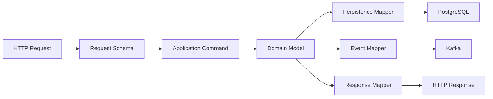
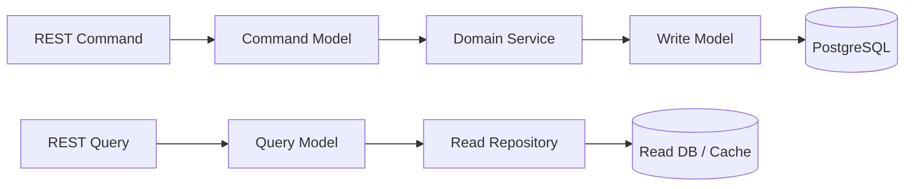
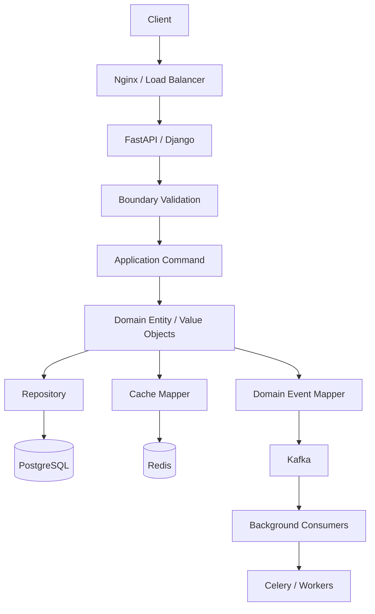

# 08- Data Modeling Patterns

## Overview

Dataclasses provide a lightweight way to represent structured application data, but the real engineering value comes from using them with deliberate modeling patterns.

A backend system rarely has one universal representation of an object. The same business concept may appear as:

```text
HTTP request
    ↓
Request DTO
    ↓
Application command
    ↓
Domain model
    ↓
Persistence model
    ↓
Database row

and later:

Database row
    ↓
Domain model
    ↓
Domain event
    ↓
Kafka message
    ↓
External consumer
```

Using one class for every boundary creates coupling. A better design uses purpose-specific models and explicit transformations.

Dataclasses are particularly effective for:

- value objects
- domain entities
- DTOs
- commands
- events
- configuration models
- query results
- immutable application state
- internal data-transfer structures

The central principle is:

> Model data according to its ownership, lifecycle, mutability, and boundary rather than forcing every representation into one class.

---

## Why Data Modeling Patterns Matter

Poor data modeling often creates problems that are initially invisible.

A single model may gradually become responsible for:

- HTTP validation
- database persistence
- business rules
- serialization
- caching
- authorization
- event publishing

The result is tightly coupled code:

```text
One "User" class
      │
      ├── REST API
      ├── PostgreSQL
      ├── Redis
      ├── Kafka
      ├── authentication
      └── domain logic
```

A more maintainable architecture separates concerns:

```text
HTTP
 │
 ▼
Request DTO
 │
 ▼
Application Command
 │
 ▼
Domain Model
 │
 ├── Repository → PostgreSQL
 ├── Cache      → Redis
 └── Event      → Kafka
```

Dataclasses provide a convenient implementation mechanism for these internal models.

---

## Core Modeling Categories

A useful backend vocabulary is:

| Pattern | Primary purpose | Typical mutability |
|---|---|---|
| Value Object | Represent a value with domain semantics | Immutable |
| Entity | Represent identity and lifecycle | Mutable or controlled |
| DTO | Transfer data between boundaries | Usually immutable |
| Command | Request an operation | Immutable |
| Domain Event | Represent something that happened | Immutable |
| Query Model | Represent read-oriented data | Immutable |
| Persistence Model | Represent database state | Framework-dependent |
| Configuration Model | Represent application configuration | Usually immutable |
| Snapshot | Represent a point-in-time state | Immutable |

The distinction matters because different models have different invariants and lifecycles.

---

## Value Objects

A value object represents a domain value whose identity comes from its contents rather than a database identity.

Examples:

- money
- email address
- currency
- geographic coordinates
- date ranges
- percentages
- phone numbers

Example:

```python
from dataclasses import dataclass


@dataclass(frozen=True, slots=True)
class Money:
    amount_cents: int
    currency: str

    def __post_init__(self) -> None:
        if self.amount_cents < 0:
            raise ValueError("amount cannot be negative")

        currency = self.currency.strip().upper()

        if len(currency) != 3:
            raise ValueError("currency must be a three-letter code")

        object.__setattr__(self, "currency", currency)
```

The important property is semantic behavior.

Instead of:

```python
price = 1999
```

the application can express:

```python
price = Money(1999, "USD")
```

This prevents primitive values from losing domain meaning.

---

## Why Value Objects Should Usually Be Immutable

Consider:

```python
@dataclass(frozen=True, slots=True)
class EmailAddress:
    value: str
```

Once created:

```text
EmailAddress
     │
     └── value = "user@example.com"
```

the value does not change.

This provides:

- predictable behavior
- safer sharing
- easier testing
- easier caching
- safer concurrency
- clearer invariants

For value-oriented models, the combination is often appropriate:

```python
@dataclass(
    frozen=True,
    slots=True,
)
class CurrencyCode:
    value: str
```

---

## Entities

An entity has identity that remains meaningful even when its attributes change.

For example:

```python
from dataclasses import dataclass


@dataclass
class User:
    user_id: int
    email: str
    status: str
```

The user remains the same conceptual entity even if:

```text
email changes
status changes
profile changes
```

The `user_id` provides identity.

This differs from a value object:

```text
Money(100, "USD")
```

where equality is generally based on its values.

---

## Entity Equality

Generated dataclass equality may not match domain identity.

For example:

```python
@dataclass
class User:
    user_id: int
    email: str
```

Two users with the same values compare structurally equal.

But an entity model may require:

```text
same user_id → same entity
```

regardless of other attributes.

If identity semantics differ from structural equality, implement equality intentionally or use an explicit identity comparison.

Do not assume generated `__eq__()` represents business identity.

---

## DTOs

A Data Transfer Object carries data between application boundaries.

Example:

```python
from dataclasses import dataclass


@dataclass(frozen=True, slots=True)
class CreateUserCommand:
    email: str
    display_name: str
```

DTOs should generally contain data needed by a boundary rather than every property of the underlying domain object.

This reduces accidental coupling.

---

## Request DTOs

For an HTTP API:

```text
HTTP JSON
    ↓
Validation
    ↓
Request DTO
    ↓
Application Service
```

Example:

```python
@dataclass(frozen=True, slots=True)
class CreateUserRequest:
    email: str
    display_name: str
```

If FastAPI is being used, Pydantic is often better suited for the actual HTTP boundary because it provides runtime validation and schema generation.

The dataclass can represent the internal command:

```text
Pydantic request
      ↓
CreateUserCommand
      ↓
Service
```

---

## Commands

A command represents an instruction to perform an operation.

```python
from dataclasses import dataclass


@dataclass(frozen=True, slots=True)
class CreateOrder:
    customer_id: int
    currency: str
```

A command generally:

- represents intent
- is immutable
- is consumed by an application service
- should not contain infrastructure behavior

Example:

```python
def create_order(command: CreateOrder) -> int:
    ...
```

The command describes **what should happen**, while the service decides **how it happens**.

---

## Domain Events

A domain event represents something that has already happened.

```python
from dataclasses import dataclass


@dataclass(frozen=True, slots=True)
class UserCreated:
    event_id: str
    user_id: int
    occurred_at: int
```

This differs from a command:

```text
Command
→ "Create this user"

Event
→ "This user was created"
```

Events should generally be immutable because changing a historical event after publication undermines event semantics.

---

## Command vs Event

| Property | Command | Event |
|---|---|---|
| Meaning | Request to perform an action | Fact that an action occurred |
| Tense | Imperative | Past |
| Producer | Caller | Component that performed action |
| Mutability | Immutable | Immutable |
| Example | `CreateOrder` | `OrderCreated` |
| Failure | Operation may fail | Fact already happened |
| Kafka usage | Possible | Common |

Keeping these concepts separate prevents confusing application intent with historical facts.

---

## Query Models

Read paths often need a different shape from write models.

For example:

```python
from dataclasses import dataclass


@dataclass(frozen=True, slots=True)
class OrderSummary:
    order_id: int
    customer_name: str
    total_cents: int
    status: str
```

This may come from a SQL query joining several tables.

It does not need to represent the complete domain entity.

Architecture:

```text
PostgreSQL
    │
    ▼
Optimized SQL
    │
    ▼
OrderSummary
    │
    ▼
REST Response
```

This avoids loading unnecessary domain state for read-only operations.

---

## Persistence Models

A persistence model represents how data is stored.

For example, PostgreSQL may contain:

```text
orders
├── id
├── customer_id
├── currency
├── total_cents
└── status
```

The database representation does not have to match the domain representation.

A mapper can translate:

```text
PostgreSQL Row
      ↓
Persistence Model
      ↓
Domain Model
```

This separation is especially useful when business rules differ from database structure.

---

## Database Mapping

A repository might map database data explicitly:

```python
from dataclasses import dataclass


@dataclass(frozen=True, slots=True)
class OrderRecord:
    order_id: int
    customer_id: int
    total_cents: int
    status: str


@dataclass
class Order:
    order_id: int
    customer_id: int
    total_cents: int
    status: str

    def cancel(self) -> None:
        if self.status == "completed":
            raise ValueError("completed orders cannot be cancelled")

        self.status = "cancelled"
```

The database record contains persistence data.

The domain object contains behavior and invariants.

---

## Mapping Between Models

Explicit mapping is often clearer than implicit conversion:

```python
def to_domain(record: OrderRecord) -> Order:
    return Order(
        order_id=record.order_id,
        customer_id=record.customer_id,
        total_cents=record.total_cents,
        status=record.status,
    )
```

The reverse mapping can be separate:

```python
def to_record(order: Order) -> OrderRecord:
    return OrderRecord(
        order_id=order.order_id,
        customer_id=order.customer_id,
        total_cents=order.total_cents,
        status=order.status,
    )
```

The additional code buys explicit boundaries.

---

## Why Not Use One Model Everywhere?

A single model appears attractive:

```text
User
 ├── database
 ├── API
 ├── cache
 ├── event
 └── business logic
```

But every boundary evolves independently.

The API may require:

```text
display_name
```

while the database requires:

```text
display_name
email_normalized
password_hash
created_at
```

and an event requires:

```text
user_id
occurred_at
```

One model forces unrelated concerns to evolve together.

---

## Anti-Corruption Through Mapping

Explicit mapping creates a boundary between models.



This allows each representation to optimize for its own purpose.

The mapping layer is not unnecessary boilerplate when it protects architectural boundaries.

---

## Composition

Composition models relationships by containing other objects.

```python
from dataclasses import dataclass


@dataclass(frozen=True, slots=True)
class Address:
    city: str
    country: str


@dataclass
class User:
    user_id: int
    address: Address
```

This is often preferable to inheritance when a model simply contains another concept.

For example:

```text
User
 └── Address
```

is clearer than:

```text
Address
   ↑
User
```

---

## Composition vs Inheritance

Use inheritance when:

```text
Child IS-A Parent
```

Use composition when:

```text
Object HAS-A Component
```

Example:

```python
@dataclass
class PaymentMethod:
    ...


@dataclass
class Customer:
    payment_method: PaymentMethod
```

This is generally easier to evolve than creating:

```text
Customer
   ↓
PaymentMethod
```

unless the domain genuinely requires that subtype relationship.

---

## Aggregates

In domain-driven design, an aggregate is a consistency boundary around related domain objects.

For example:

```python
from dataclasses import dataclass, field


@dataclass
class Order:
    order_id: int
    items: list["OrderItem"] = field(default_factory=list)

    def add_item(self, item: "OrderItem") -> None:
        if item.quantity <= 0:
            raise ValueError("quantity must be positive")

        self.items.append(item)


@dataclass(frozen=True, slots=True)
class OrderItem:
    product_id: int
    quantity: int
```

The `Order` controls changes to its items.

The important concept is not the dataclass itself; it is the consistency boundary.

---

## Aggregate Design

Avoid creating giant aggregate models containing every related object.

For example:

```text
Order
 ├── Customer
 ├── Address
 ├── Payment
 ├── Shipment
 ├── Product
 ├── Inventory
 ├── Reviews
 └── AuditHistory
```

This can create:

- large memory graphs
- expensive database loading
- locking complexity
- serialization overhead
- difficult transaction boundaries

Model only the state that must change consistently together.

---

## Immutable Snapshots

A snapshot represents state at a particular point in time.

```python
from dataclasses import dataclass


@dataclass(frozen=True, slots=True)
class InventorySnapshot:
    product_id: int
    available_units: int
    captured_at: int
```

Snapshots are useful for:

- caching
- read models
- event processing
- audit views
- concurrency
- background processing

Because snapshots represent historical or point-in-time state, immutability is usually appropriate.

---

## Configuration Models

Configuration is another strong dataclass use case.

```python
from dataclasses import dataclass


@dataclass(frozen=True, slots=True)
class DatabaseConfig:
    host: str
    port: int
    database: str
    pool_size: int
```

Application startup can construct the configuration once:

```text
Environment
    ↓
Validation
    ↓
DatabaseConfig
    ↓
Application
```

Immutable configuration prevents accidental runtime mutation.

For complex environment parsing and validation, a dedicated configuration library may be more appropriate.

---

## Boundary Models

A mature backend commonly has several model categories:

```text
External Boundary
    │
    ├── Request Model
    └── Response Model
            │
            ▼
Application Boundary
    │
    ├── Command
    └── Query
            │
            ▼
Domain Boundary
    │
    ├── Entity
    ├── Value Object
    └── Domain Event
            │
            ▼
Infrastructure Boundary
    │
    ├── Persistence Model
    └── Integration Model
```

The exact number of models should be driven by architectural boundaries, not by a desire to maximize abstraction.

---

## Avoid Model Explosion

Separating boundaries does not mean creating a class for every function.

Bad:

```text
UserRequest
UserCommand
UserInput
UserPayload
UserDTO
UserData
UserResponse
UserResult
UserRecord
UserModel
```

if they all contain identical fields and have no meaningful behavioral or lifecycle differences.

The goal is **semantic separation**, not class proliferation.

---

## Primitive Obsession

Primitive obsession occurs when domain concepts are represented only by generic primitives.

For example:

```python
amount: int
currency: str
email: str
```

This loses semantic information.

Instead:

```python
@dataclass(frozen=True, slots=True)
class Money:
    amount_cents: int
    currency: str


@dataclass(frozen=True, slots=True)
class EmailAddress:
    value: str
```

Now validation and domain rules have an explicit home.

Use value objects when the domain concept has meaningful invariants or behavior.

---

## Avoid Over-Modeling

Not every string needs a class.

This may be excessive:

```python
@dataclass(frozen=True)
class UserName:
    value: str
```

if the application has no meaningful username-specific rules.

A good decision rule is:

```text
Primitive
   ↓
Does it have domain invariants?
   │
   ├── No → primitive may be sufficient
   │
   └── Yes
         ↓
      Value Object
```

Model concepts when the abstraction improves correctness, clarity, or maintainability.

---

## Validation Placement

Different validation belongs at different layers.

```text
HTTP Boundary
    ↓
Syntax / shape / type validation
    ↓
Application
    ↓
Business rules
    ↓
Domain
    ↓
Persistence constraints
```

For example:

```text
email field exists
→ request validation

email format is acceptable
→ boundary/domain validation

email already belongs to another account
→ database/application rule
```

Do not put every validation rule into `__post_init__()`.

---

## Invariants

An invariant is a condition that should always be true for a valid model.

Example:

```python
@dataclass
class Money:
    amount_cents: int
    currency: str

    def __post_init__(self) -> None:
        if self.amount_cents < 0:
            raise ValueError("negative money is not allowed")
```

After construction:

```text
Money object
     ↓
Invariant guaranteed
```

This makes downstream code simpler because it can rely on the established contract.

---

## `__post_init__()` as a Modeling Tool

Use `__post_init__()` for:

- normalization
- local validation
- cross-field invariants
- derived state

Example:

```python
@dataclass(frozen=True)
class EmailAddress:
    value: str

    def __post_init__(self) -> None:
        normalized = self.value.strip().lower()

        if "@" not in normalized:
            raise ValueError("invalid email address")

        object.__setattr__(
            self,
            "value",
            normalized,
        )
```

Avoid:

- HTTP calls
- database queries
- Redis access
- Kafka publishing
- AWS API calls

Object construction should remain deterministic.

---

## Identity vs Value Semantics

A critical modeling distinction is:

```text
Entity
→ identity matters

Value Object
→ values matter
```

Example:

```text
User #42
```

remains the same user after an email change.

But:

```text
Money(100, "USD")
```

is defined by its value.

This distinction should influence:

- equality
- mutability
- hashing
- persistence
- event design
- caching

---

## Mutable vs Immutable Models

| Model | Typical choice | Reason |
|---|---|---|
| Value Object | Immutable | Value semantics |
| Domain Event | Immutable | Historical fact |
| Command | Immutable | Stable intent |
| Snapshot | Immutable | Point-in-time state |
| Configuration | Immutable | Prevent accidental changes |
| Entity | Mutable/controlled | Lifecycle changes |
| ORM Model | Framework-dependent | Persistence lifecycle |
| Query Result | Immutable | Read-only data |

This is a guideline, not a universal rule.

---

## Slots as a Modeling Choice

For high-volume internal models:

```python
@dataclass(
    frozen=True,
    slots=True,
)
class OrderEvent:
    event_id: str
    order_id: int
    occurred_at: int
```

`slots=True` can reduce per-instance memory overhead.

It is particularly useful when processing large numbers of small objects.

It does not:

- make nested objects immutable
- serialize the object
- make it thread-safe
- reduce database storage
- replace memory profiling

Use slots when object population and memory characteristics justify it.

---

## Serialization Strategy

Do not automatically use:

```python
asdict(model)
```

for every boundary.

For internal structures:

```python
payload = asdict(model)
```

may be sufficient.

For external contracts:

```python
def to_api_response(user: User) -> dict[str, object]:
    return {
        "id": user.user_id,
        "email": user.email,
    }
```

Explicit mapping provides:

- field control
- security
- versioning
- compatibility
- type conversion

---

## API Response Models

A public REST response should be intentionally shaped.

Example:

```python
from dataclasses import dataclass


@dataclass(frozen=True, slots=True)
class UserResponse:
    id: int
    email: str
    display_name: str
```

This is separate from:

```python
@dataclass
class User:
    user_id: int
    email: str
    display_name: str
    password_hash: str
    internal_status: str
```

Never expose a domain or persistence model simply because it happens to be serializable.

---

## Event Models

Events should contain information required by consumers rather than every internal domain field.

```python
@dataclass(frozen=True, slots=True)
class OrderCreated:
    event_id: str
    order_id: int
    customer_id: int
    occurred_at: int
```

Avoid publishing:

```python
@dataclass
class InternalOrder:
    ...
    database_connection: object
    internal_flags: dict[str, bool]
```

External events should be explicit contracts.

---

## Event Versioning

A durable event model should account for schema evolution.

For example:

```python
@dataclass(frozen=True, slots=True)
class OrderCreatedV1:
    event_id: str
    order_id: int
```

A schema registry or explicit event versioning strategy can then manage evolution.

Do not assume Python class inheritance automatically provides backward compatibility.

---

## Microservices

In a microservice architecture:

```text
Service A
   │
   │ event / API
   ▼
Service B
```

each service should own its internal models.

Do not share a Python dataclass package across services merely to avoid duplicate definitions.

Shared model packages can create:

```text
Service A ──┐
            ├── Shared Python Package
Service B ──┤
            └── tightly coupled releases
```

Instead, share explicit contracts where necessary:

- OpenAPI
- Protobuf
- Avro
- JSON Schema

Internal dataclasses remain service-local.

---

## Kafka

For Kafka-based systems:

```text
Domain Model
     ↓
Event Mapper
     ↓
Schema
     ↓
Serializer
     ↓
Kafka
```

The domain model should not automatically become the wire schema.

This separation enables:

- schema evolution
- compatibility rules
- cross-language consumers
- independent service releases

---

## Redis

For Redis caching:

```text
Domain Model
     ↓
Cache Snapshot
     ↓
Serializer
     ↓
Redis
```

A cache model can intentionally omit fields that are unnecessary for the read path.

Example:

```python
@dataclass(frozen=True, slots=True)
class UserCache:
    user_id: int
    display_name: str
    avatar_url: str | None
```

This is often better than caching the entire domain entity.

---

## PostgreSQL

Use domain models for domain behavior and database models for persistence concerns.

For a read-heavy endpoint:

```text
HTTP GET
   ↓
Repository
   ↓
Optimized SQL JOIN
   ↓
OrderSummary
   ↓
Response
```

There is no requirement to construct a complete `Order` aggregate if the endpoint only needs four fields.

This can improve:

- database performance
- network transfer
- Python memory usage
- serialization cost
- latency

---

## CQRS-Oriented Modeling

Command and query paths often benefit from separate models:



The write model can enforce domain invariants while the query model is optimized for retrieval.

Dataclasses work well for both internal representations.

---

## Functional Transformation

Immutable dataclasses work well with transformation pipelines.

For example:

```python
from dataclasses import dataclass, replace


@dataclass(frozen=True, slots=True)
class Order:
    order_id: int
    status: str


def cancel(order: Order) -> Order:
    if order.status == "completed":
        raise ValueError("cannot cancel completed order")

    return replace(order, status="cancelled")
```

This avoids mutating the original object.

It can be useful for:

- event processing
- concurrent workloads
- deterministic testing
- state transitions

---

## State-Specific Models

For complex workflows, separate models can represent valid states.

For example:

```python
@dataclass(frozen=True, slots=True)
class PendingPayment:
    order_id: int


@dataclass(frozen=True, slots=True)
class CompletedPayment:
    order_id: int
    transaction_id: str
```

This can make illegal states harder to represent.

Instead of:

```python
payment.status = "completed"
payment.transaction_id = None
```

the type itself communicates the state.

Use this pattern when state transitions and invariants are complex enough to justify additional types.

---

## Avoid Boolean State Explosion

A model such as:

```python
@dataclass
class Order:
    is_paid: bool
    is_cancelled: bool
    is_shipped: bool
    is_refunded: bool
```

can produce invalid combinations:

```text
is_paid=True
is_cancelled=True
is_shipped=True
is_refunded=True
```

If the domain has mutually exclusive states, use an explicit state model or enum.

```python
from enum import StrEnum


class OrderStatus(StrEnum):
    PENDING = "pending"
    PAID = "paid"
    SHIPPED = "shipped"
    CANCELLED = "cancelled"
```

For highly constrained workflows, state-specific models may provide even stronger guarantees.

---

## Security Considerations

Good data modeling can reduce accidental exposure.

Separate:

```text
UserPersistence
    ├── password_hash
    ├── internal_flags
    └── audit metadata

UserResponse
    ├── id
    ├── email
    └── display_name
```

This makes it harder to accidentally serialize sensitive fields.

Do not rely solely on:

```python
field(repr=False)
```

because that controls representation, not all serialization paths.

Sensitive data should be excluded intentionally from boundary models.

---

## Reliability Considerations

Models should make invalid state difficult to construct.

Prefer:

```python
@dataclass(frozen=True, slots=True)
class Percentage:
    value: int

    def __post_init__(self) -> None:
        if not 0 <= self.value <= 100:
            raise ValueError("percentage must be between 0 and 100")
```

over spreading validation across every caller.

This creates a local invariant:

```text
Percentage instance
        ↓
0 ≤ value ≤ 100
```

Downstream code can operate under that assumption.

---

## Concurrency Considerations

Immutable models are particularly useful when state crosses concurrency boundaries.

For example:

```python
@dataclass(frozen=True, slots=True)
class JobContext:
    job_id: str
    tenant_id: str
```

The same object can safely be shared among asyncio tasks or worker threads as long as the reachable state is appropriately immutable.

For mutable entities, define ownership clearly:

```text
One task owns mutation
        ↓
Other tasks receive immutable snapshots
```

This reduces race-condition risk.

---

## Memory and Performance

Modeling decisions affect runtime behavior.

A large nested object graph:

```text
Order
 ├── Customer
 ├── Address
 ├── Items × 1000
 ├── Product data
 └── Metadata
```

can be significantly more expensive than a compact query model:

```text
OrderSummary
 ├── order_id
 ├── total
 └── status
```

For high-throughput systems:

- use `slots=True` where appropriate
- avoid unnecessary nested objects
- stream large datasets
- use bounded batches
- avoid repeated conversions
- profile before optimizing

The smallest correct model is often the most efficient model.

---

## Serialization Performance

Avoid unnecessary conversion chains:

```text
Dataclass
    ↓
asdict()
    ↓
Pydantic Model
    ↓
dict()
    ↓
JSON
```

when the boundary can be handled more directly.

Every conversion can introduce:

- object allocation
- CPU work
- temporary memory
- type conversion
- additional failure points

Measure the complete pipeline in performance-sensitive services.

---

## Maintainability

Good models make responsibilities obvious.

Prefer:

```text
CreateUserCommand
User
UserCreated
UserResponse
UserRecord
```

when these objects have genuinely different responsibilities.

Avoid:

```text
UserModel
```

being used everywhere simply because it is convenient.

The objective is not maximum abstraction. It is clear ownership of data and behavior.

---

## Testing Strategy

Test each model according to its responsibility.

### Value Objects

Test:

- normalization
- invariants
- equality
- immutability

### Entities

Test:

- identity
- lifecycle transitions
- business rules

### DTOs

Test:

- field structure
- boundary mapping

### Events

Test:

- required fields
- serialization
- schema compatibility

### Mappers

Test:

- source-to-target field mapping
- missing values
- type conversions

This avoids writing identical tests for every representation.

---

## Mapper Testing

A mapper is important enough to test directly:

```python
def test_order_record_maps_to_domain() -> None:
    record = OrderRecord(
        order_id=1001,
        customer_id=42,
        total_cents=1999,
        status="pending",
    )

    order = to_domain(record)

    assert order.order_id == 1001
    assert order.customer_id == 42
    assert order.total_cents == 1999
    assert order.status == "pending"
```

Mapping bugs can otherwise produce subtle production failures.

---

## Observability

Models should not leak sensitive information into observability systems.

Be deliberate about:

- `repr()`
- structured logging
- trace attributes
- metrics labels
- exception messages

Avoid:

```python
logger.info("request=%s", request_model)
```

if the model may contain credentials or sensitive user data.

Prefer explicitly selected fields:

```python
logger.info(
    "user_request",
    extra={
        "user_id": request.user_id,
    },
)
```

---

## Docker and Kubernetes

Data modeling can affect container memory.

For workers processing large batches:

```text
Kafka
  ↓
Deserialize
  ↓
Dataclass objects
  ↓
Transform
  ↓
Batch
```

Avoid unbounded object accumulation.

Use:

- bounded batches
- streaming
- queue limits
- `slots=True` where justified
- worker concurrency limits
- memory monitoring

Kubernetes memory limits expose modeling and batching problems quickly because excessive allocations can lead to OOMKills.

---

## Disaster Recovery

Dataclass models themselves do not provide disaster recovery.

For durable systems, recovery depends on:

- database backups
- replication
- Kafka retention
- object storage
- schema compatibility
- event replay strategy

Modeling matters because durable representations must remain understandable and compatible over time.

Do not make long-lived persisted data depend on fragile Python-specific object layouts.

---

## Decision Framework

When introducing a new model, ask:

```text
What does this object represent?
        │
        ▼
Entity, Value, DTO, Command, Event, Query, or Persistence?
        │
        ▼
Who owns it?
        │
        ▼
Where does it cross a boundary?
        │
        ▼
Should it be mutable?
        │
        ▼
What invariants must always hold?
        │
        ▼
Does it require serialization?
        │
        ▼
Will it exist in high volume?
        │
        ▼
Would slots or frozen semantics help?
```

This prevents modeling decisions from being driven solely by convenience.

---

## Practical Pattern Selection

| Requirement | Recommended pattern |
|---|---|
| Domain value with invariants | Frozen value object |
| Database identity and lifecycle | Entity |
| HTTP input | Boundary validation model |
| Application operation request | Command |
| Historical fact | Immutable domain event |
| Read-only query result | Query model |
| Database representation | Persistence model |
| Cached subset of state | Immutable snapshot |
| Shared configuration | Frozen configuration model |
| Large population of small objects | Slotted dataclass |
| Multiple independent capabilities | Composition |
| True subtype polymorphism | Inheritance |

---

## Production Architecture

A mature Python backend may use:



Different model types can exist at different stages:

```text
Boundary Model
      ↓
Command
      ↓
Domain Model
      ↓
Persistence Model
      ↓
Event Model
```

The mappings are intentional boundaries rather than accidental conversions.

---

## Common Mistakes

### One Model Everywhere

Convenient initially, but creates tight coupling between API, domain, persistence, and messaging.

### Primitive Obsession

Using raw strings and integers for domain concepts with meaningful invariants.

### Over-Modeling

Creating dozens of classes that have no semantic differences.

### Deep Inheritance

Creates fragile constructor and lifecycle behavior.

### Mutable Events

Allows historical facts to change after publication.

### Exposing Domain Models Directly

Can leak internal fields and couple API contracts to implementation details.

### Blind `asdict()`

Can serialize sensitive or internal fields.

### Business Logic in DTOs

DTOs should generally transfer data; domain behavior belongs in domain models or services.

### I/O in Dataclass Initialization

Makes construction unpredictable and difficult to test.

### Giant Aggregates

Creates expensive object graphs and oversized transaction boundaries.

### Shared Python Models Across Microservices

Creates release coupling and prevents independent service evolution.

### Treating Slots as a Universal Optimization

Slots help specific object-layout problems; they do not replace profiling or architectural memory controls.

---

## Production Pitfalls

### Schema Drift

Internal dataclass changes can unintentionally change serialized output.

### Boundary Coupling

Using the same model for REST and Kafka makes independent evolution harder.

### Validation Duplication

Duplicating business rules across request DTOs, entities, and database code can create inconsistent behavior.

### Hidden Invariants

If invalid states can be constructed easily, downstream code must repeatedly defend against them.

### Excessive Mapping

Too many mechanically identical models can increase maintenance cost without providing meaningful isolation.

### Insufficient Mapping

Too few models can couple unrelated boundaries.

The correct balance is based on semantic differences and ownership.

---

## Best Practices

- Model according to domain semantics rather than database tables alone.
- Use frozen dataclasses for value objects, commands, events, snapshots, and configuration when immutability is appropriate.
- Use mutable or explicitly controlled entities when lifecycle changes are part of the domain.
- Keep external request and response models separate from internal domain models when their contracts differ.
- Use Pydantic or equivalent boundary validation for FastAPI-style external inputs where appropriate.
- Use explicit mappers at important architectural boundaries.
- Keep Kafka event schemas independent from internal Python class structures.
- Keep microservice-internal dataclasses service-local.
- Prefer composition for reusable components and inheritance for genuine subtype relationships.
- Keep inheritance hierarchies shallow.
- Use `slots=True` for high-volume small models when profiling supports it.
- Avoid primitive obsession when domain invariants justify value objects.
- Avoid creating abstractions that add no semantic value.
- Keep `__post_init__()` deterministic and free from external I/O.
- Define invariants as close as practical to the model that owns them.
- Keep security-sensitive fields out of external models and logs.
- Avoid exposing persistence models directly through APIs.
- Use query models for read paths that need optimized projections.
- Use bounded batches and streaming for large data-processing workloads.
- Test mappings and boundary serialization explicitly.
- Monitor serialization cost, memory usage, and object populations in high-throughput services.
- Treat durable schemas as compatibility contracts rather than reflections of Python implementation details.

---

## Interview Traps

### What is the difference between an entity and a value object?

An entity is identified by persistent identity; a value object is defined primarily by its values.

### Should domain events be mutable?

Usually no. Events represent facts that have already occurred and should be immutable.

### Should every dataclass be frozen?

No. Immutability should reflect the model's semantics.

### Should every dataclass use slots?

No. Slots are most useful when memory or object-shape considerations justify them.

### Why separate DTOs from domain models?

DTOs represent boundary data contracts; domain models represent application or business semantics.

### Is a database row the same as a domain model?

Not necessarily. Database structure is optimized for persistence, while domain structure is optimized for business behavior.

### Why use value objects instead of primitive types?

They provide explicit domain semantics and centralize invariants.

### Is more modeling always better?

No. Excessive models create unnecessary mapping and maintenance overhead.

### When should composition be preferred over inheritance?

When the relationship is "has-a" or when features are orthogonal rather than genuine subtypes.

### Should Python dataclasses be shared between microservices?

Usually not. Shared Python models create deployment and version coupling. Share explicit contracts instead.

### Should `asdict()` be used for public APIs?

Not blindly. Explicit boundary serialization is often safer for security, compatibility, and versioning.

### Where should database calls happen in a domain model?

Generally in repositories or application/infrastructure services, not in dataclass construction or `__post_init__()`.

### What is the benefit of separate query models?

They allow read paths to retrieve only the data required by a use case instead of materializing complete domain aggregates.

### Why can a giant aggregate be problematic?

It increases memory usage, database loading, transaction scope, locking complexity, and serialization cost.

### How do you decide whether a new dataclass is necessary?

Identify its semantic role, owner, lifecycle, invariants, boundary, and whether its representation genuinely differs from existing models.

---

## Production Checklist

- [ ] Is the model's semantic purpose clearly defined?
- [ ] Is it an entity, value object, DTO, command, event, query model, persistence model, configuration model, or snapshot?
- [ ] Does identity matter?
- [ ] Should the model be mutable?
- [ ] Are all important invariants enforced?
- [ ] Is `__post_init__()` limited to deterministic local initialization?
- [ ] Are external I/O operations kept outside model construction?
- [ ] Are domain models separated from persistence models where appropriate?
- [ ] Are API request and response contracts intentionally defined?
- [ ] Are sensitive fields excluded from external models?
- [ ] Are sensitive fields excluded from logs and traces?
- [ ] Are event models immutable?
- [ ] Are Kafka schemas explicitly versioned and compatibility-managed?
- [ ] Are microservice-internal models kept service-local?
- [ ] Are explicit mappers used at meaningful architectural boundaries?
- [ ] Is composition preferred where inheritance does not represent a true subtype?
- [ ] Is inheritance hierarchy depth controlled?
- [ ] Are query models used when full domain aggregates are unnecessary?
- [ ] Are large aggregates avoided?
- [ ] Is primitive obsession addressed where domain invariants justify value objects?
- [ ] Is over-modeling avoided?
- [ ] Is `slots=True` justified by object population or memory measurements?
- [ ] Is `frozen=True` aligned with the model's semantics?
- [ ] Are nested mutable values intentional?
- [ ] Are serialization paths explicitly tested?
- [ ] Are mapping functions tested?
- [ ] Are large datasets processed with bounded batches or streaming?
- [ ] Are object populations and process memory monitored?
- [ ] Are serialization CPU and memory costs measured?
- [ ] Are durable data formats independent from Python-specific implementation details?
- [ ] Can each model evolve independently where the architecture requires it?
- [ ] Does the model make invalid states difficult to represent?
- [ ] Does the model improve clarity enough to justify its maintenance cost?

## Key Takeaways

- **Dataclasses are most effective when they represent clear semantic roles such as value objects, entities, DTOs, commands, events, query models, and snapshots rather than serving as one universal model for an entire application.**
- **Separate models at meaningful boundaries—especially HTTP, domain, persistence, cache, and messaging boundaries—to prevent implementation details and schema changes from propagating across the system.**
- **Use immutability, value objects, invariants, composition, and slots deliberately**: each solves a different modeling or runtime problem and should be introduced only when its semantics or operational benefits justify the complexity.
- **Prefer explicit mapping and external schemas for REST, Kafka, gRPC, and microservice boundaries**, because Python dataclass structure should not accidentally become a distributed compatibility contract.
- **Good data modeling balances correctness and simplicity**: make invalid states difficult to represent, avoid primitive obsession where it matters, avoid giant or overly fragmented models, and optimize high-volume models only after measuring real workload behavior.