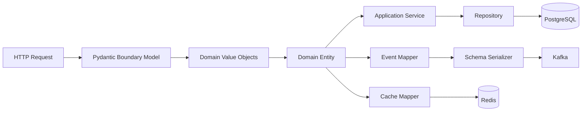

# 09- Value Objects

## Overview

A **Value Object** is a domain model whose meaning is determined by its value rather than by a unique identity.

Typical examples include:

- Money
- Email addresses
- Currency codes
- Phone numbers
- Coordinates
- Date ranges
- Percentages
- Measurements
- IP addresses
- Postal addresses
- Version numbers

Instead of representing a business concept with a primitive:

```python
price: int
currency: str
```

a value object gives that concept an explicit type:

```python
@dataclass(frozen=True, slots=True)
class Money:
    amount_cents: int
    currency: str
```

The goal is not simply to wrap primitives. The goal is to give a domain concept:

- a clear name
- explicit invariants
- well-defined equality
- controlled behavior
- appropriate immutability
- reusable domain semantics

Value objects are particularly useful in backend systems because they prevent domain rules from being scattered throughout request handlers, services, repositories, and database code.

---

## Value Object vs Entity

The fundamental distinction is **value semantics versus identity semantics**.

| Characteristic | Value Object | Entity |
|---|---|---|
| Identity | Not independently important | Important |
| Equality | Based on values | Usually based on identity |
| Typical mutability | Immutable | Often mutable or stateful |
| Lifecycle | Usually short-lived | Persistent lifecycle |
| Examples | `Money`, `EmailAddress` | `User`, `Order` |
| Database identity | Usually none | Usually has an ID |
| Hashing | Often possible | Depends on identity semantics |
| Typical dataclass | `frozen=True, slots=True` | Regular dataclass or controlled mutation |

For example:

```text
User #42
```

remains the same user even when their email changes.

But:

```text
Money(1000, "USD")
```

is equivalent to another:

```text
Money(1000, "USD")
```

because the values define its meaning.

---

## Why Value Objects Exist

Without value objects, domain concepts often become primitive values:

```python
def charge_customer(
    amount: int,
    currency: str,
    email: str,
) -> None:
    ...
```

The caller must know:

- what unit `amount` uses
- whether negative values are valid
- whether currency must be uppercase
- whether email must be normalized
- whether the values are compatible

With value objects:

```python
def charge_customer(
    amount: Money,
    email: EmailAddress,
) -> None:
    ...
```

the function signature communicates domain intent.

The model can enforce invariants before the value reaches business logic.

---

## Primitive Obsession

**Primitive obsession** occurs when domain concepts are represented using generic primitives even though they have meaningful rules.

Example:

```python
amount: int
currency: str
percentage: int
email: str
```

These primitives have different semantics despite having common Python types.

For example:

```python
amount = 100
percentage = 100
```

Both are integers, but they represent fundamentally different concepts.

Value objects restore that semantic distinction:

```python
Money(100, "USD")
Percentage(100)
```

---

## Basic Value Object

A minimal value object can be implemented with a frozen dataclass:

```python
from dataclasses import dataclass


@dataclass(frozen=True, slots=True)
class CurrencyCode:
    value: str
```

Because the dataclass is frozen:

```python
currency = CurrencyCode("USD")
```

cannot normally be changed:

```python
currency.value = "EUR"
```

This raises:

```text
FrozenInstanceError
```

Immutability is useful because a value object's meaning should not change after construction.

---

## Value Object Invariants

A value object becomes more valuable when it owns its validation rules.

```python
from dataclasses import dataclass


@dataclass(frozen=True, slots=True)
class Percentage:
    value: int

    def __post_init__(self) -> None:
        if not 0 <= self.value <= 100:
            raise ValueError(
                "percentage must be between 0 and 100"
            )
```

Now:

```python
Percentage(50)
```

is valid, while:

```python
Percentage(150)
```

fails immediately.

The important property is:

```text
Percentage instance
        ↓
0 ≤ value ≤ 100
```

Downstream code can rely on this invariant.

---

## Normalization

Value objects can normalize input when normalization is part of their domain semantics.

Example:

```python
from dataclasses import dataclass


@dataclass(frozen=True, slots=True)
class CurrencyCode:
    value: str

    def __post_init__(self) -> None:
        normalized = self.value.strip().upper()

        if len(normalized) != 3:
            raise ValueError(
                "currency code must contain three characters"
            )

        object.__setattr__(self, "value", normalized)
```

Now:

```python
CurrencyCode(" usd ")
```

becomes:

```python
CurrencyCode("USD")
```

Normalization should be deterministic and local.

---

## Validation vs Normalization

These are related but different operations.

| Operation | Purpose | Example |
|---|---|---|
| Validation | Reject invalid input | Reject negative percentage |
| Normalization | Convert equivalent representations | `" usd "` → `"USD"` |
| Transformation | Change representation | `Money` → API payload |
| Business decision | Determine application behavior | Apply discount |

Keep business workflows out of simple value-object construction.

---

## `__post_init__()` for Value Objects

`__post_init__()` is a good location for local invariants:

```python
@dataclass(frozen=True, slots=True)
class EmailAddress:
    value: str

    def __post_init__(self) -> None:
        normalized = self.value.strip().lower()

        if "@" not in normalized:
            raise ValueError("invalid email address")

        object.__setattr__(
            self,
            "value",
            normalized,
        )
```

It should generally not perform:

```text
HTTP calls
Database queries
Redis operations
Kafka publishing
AWS API calls
```

Construction should remain deterministic.

---

## Why Immutability Is Usually Appropriate

Consider:

```python
@dataclass(frozen=True, slots=True)
class Money:
    amount_cents: int
    currency: str
```

If an object can be modified after construction:

```python
money.amount_cents = 5000
```

references elsewhere in the application may unexpectedly observe a different value.

With immutable semantics:

```text
Money(1000, "USD")
        │
        ├── Service A
        ├── Service B
        └── Cache key
```

all consumers observe the same state.

This makes value objects easier to:

- share
- cache
- test
- reason about
- use across concurrency boundaries

---

## Shallow vs Deep Immutability

`frozen=True` prevents assignment to dataclass attributes, but it does not make nested objects immutable.

For example:

```python
@dataclass(frozen=True)
class Tags:
    values: list[str]
```

The following is still possible:

```python
tags.values.append("production")
```

The dataclass itself is frozen, but the list is mutable.

For strong value semantics, prefer immutable nested types:

```python
from dataclasses import dataclass


@dataclass(frozen=True, slots=True)
class Tags:
    values: tuple[str, ...]
```

This distinction is important in concurrent systems and cache keys.

---

## Equality

Dataclasses generate structural equality by default.

```python
from dataclasses import dataclass


@dataclass(frozen=True)
class CurrencyCode:
    value: str
```

Then:

```python
CurrencyCode("USD") == CurrencyCode("USD")
```

is:

```text
True
```

This matches value-object semantics.

The equality behavior should represent the domain definition of equivalence.

---

## Equality and Normalization

Normalization can make equivalent values compare equally:

```python
CurrencyCode("usd")
```

and:

```python
CurrencyCode("USD")
```

can both become:

```python
CurrencyCode("USD")
```

This is preferable when case and surrounding whitespace are not meaningful domain differences.

Do not normalize values merely for convenience if the original representation has business significance.

---

## Hashing

Frozen dataclasses can often be hashable when their relevant fields are hashable.

For example:

```python
@dataclass(frozen=True, slots=True)
class CurrencyCode:
    value: str
```

can be used as a dictionary key:

```python
rates = {
    CurrencyCode("USD"): 1.0,
}
```

This can be useful for:

- caches
- dictionaries
- memoization
- sets
- deduplication

Avoid mutable nested fields if hash stability matters.

---

## `unsafe_hash=True`

`unsafe_hash=True` should be used carefully.

Hashing an object that can effectively change after insertion into a set or dictionary can break collection invariants.

For value objects, prefer:

```python
@dataclass(frozen=True)
class ...
```

and use naturally hashable fields.

Do not use `unsafe_hash=True` merely to force an object to become hashable.

---

## Money as a Value Object

Money is one of the strongest examples because raw floating-point values are dangerous for financial calculations.

Prefer:

```python
from dataclasses import dataclass


@dataclass(frozen=True, slots=True)
class Money:
    amount_cents: int
    currency: str

    def __post_init__(self) -> None:
        if self.amount_cents < 0:
            raise ValueError(
                "amount cannot be negative"
            )

        currency = self.currency.strip().upper()

        if len(currency) != 3:
            raise ValueError(
                "currency must be a three-letter code"
            )

        object.__setattr__(
            self,
            "currency",
            currency,
        )
```

Use integer minor units where the domain and currency rules permit it.

For currencies with different minor-unit rules, the model should account for the currency's actual representation requirements rather than assuming every currency has two decimal places.

---

## Money Operations

Value objects can contain domain behavior.

```python
@dataclass(frozen=True, slots=True)
class Money:
    amount_cents: int
    currency: str

    def add(self, other: "Money") -> "Money":
        if self.currency != other.currency:
            raise ValueError(
                "cannot add different currencies"
            )

        return Money(
            amount_cents=self.amount_cents + other.amount_cents,
            currency=self.currency,
        )
```

The invariant is now centralized.

Instead of:

```python
if currency_a != currency_b:
    ...
```

being repeated throughout the application, the value object owns the rule.

---

## Arithmetic Semantics

For richer domain models, operators can express domain operations:

```python
def __add__(self, other: "Money") -> "Money":
    if self.currency != other.currency:
        raise ValueError(
            "currency mismatch"
        )

    return Money(
        self.amount_cents + other.amount_cents,
        self.currency,
    )
```

Then:

```python
total = subtotal + shipping
```

can be valid domain code.

Do not overload operators merely to make code look elegant. Operators should have obvious, mathematically or domain-consistent semantics.

---

## Currency as a Separate Value Object

Instead of:

```python
class Money:
    currency: str
```

a stronger model can be:

```python
@dataclass(frozen=True, slots=True)
class CurrencyCode:
    value: str


@dataclass(frozen=True, slots=True)
class Money:
    amount_cents: int
    currency: CurrencyCode
```

This centralizes currency validation.

The tradeoff is additional object creation and model complexity.

Use the extra abstraction when currency appears throughout the domain and has meaningful rules.

---

## Email Address

Email addresses are another common value-object candidate:

```python
from dataclasses import dataclass


@dataclass(frozen=True, slots=True)
class EmailAddress:
    value: str

    def __post_init__(self) -> None:
        normalized = self.value.strip().lower()

        if not normalized or "@" not in normalized:
            raise ValueError("invalid email address")

        object.__setattr__(
            self,
            "value",
            normalized,
        )
```

In production, validation requirements should match the application's actual email policy.

Avoid implementing an unnecessarily complex email grammar inside the value object unless the business genuinely requires it.

---

## Date Range

A date range can enforce ordering:

```python
from dataclasses import dataclass
from datetime import date


@dataclass(frozen=True, slots=True)
class DateRange:
    start: date
    end: date

    def __post_init__(self) -> None:
        if self.end < self.start:
            raise ValueError(
                "end date cannot precede start date"
            )

    def contains(self, value: date) -> bool:
        return self.start <= value <= self.end
```

This is more expressive than repeatedly passing:

```python
start_date: date
end_date: date
```

through application services.

---

## Coordinates

Coordinates can encapsulate geographic invariants:

```python
from dataclasses import dataclass


@dataclass(frozen=True, slots=True)
class Coordinates:
    latitude: float
    longitude: float

    def __post_init__(self) -> None:
        if not -90 <= self.latitude <= 90:
            raise ValueError("invalid latitude")

        if not -180 <= self.longitude <= 180:
            raise ValueError("invalid longitude")
```

The object guarantees valid coordinate ranges.

---

## Percentage

A percentage is a good example of a constrained scalar:

```python
@dataclass(frozen=True, slots=True)
class Percentage:
    value: int

    def __post_init__(self) -> None:
        if not 0 <= self.value <= 100:
            raise ValueError(
                "percentage must be between 0 and 100"
            )
```

The domain can then use:

```python
discount = Percentage(15)
```

instead of an ambiguous:

```python
discount = 15
```

---

## Value Objects and Domain Entities

Value objects are often components of entities.

```python
from dataclasses import dataclass


@dataclass(frozen=True, slots=True)
class EmailAddress:
    value: str


@dataclass
class User:
    user_id: int
    email: EmailAddress
```

The relationship is:

```text
User
 ├── identity: user_id
 └── value: EmailAddress
```

The user has identity.

The email address has value semantics.

---

## Value Objects and Aggregates

An aggregate can contain several value objects:

```python
@dataclass
class Order:
    order_id: int
    total: Money
    shipping_address: "Address"
```

This keeps domain concepts explicit:

```text
Order
 ├── identity
 ├── Money
 └── Address
```

The aggregate controls business consistency while value objects enforce local invariants.

---

## Address as a Value Object

An address can be modeled as:

```python
@dataclass(frozen=True, slots=True)
class Address:
    line1: str
    city: str
    postal_code: str
    country: str

    def __post_init__(self) -> None:
        if not self.line1.strip():
            raise ValueError("line1 is required")

        if not self.city.strip():
            raise ValueError("city is required")

        if not self.country.strip():
            raise ValueError("country is required")
```

Whether an address should be a value object depends on domain semantics.

If two addresses with identical values are considered equivalent, value semantics are appropriate.

---

## When Not to Use a Value Object

Do not create a value object simply because a primitive exists.

A primitive may be sufficient when:

- there are no meaningful invariants
- the value has no domain-specific behavior
- it is local implementation detail
- the abstraction would only add boilerplate
- the concept appears in one trivial location

For example:

```python
limit: int
```

does not necessarily require:

```python
@dataclass(frozen=True)
class Limit:
    value: int
```

unless the limit has meaningful semantics or rules.

---

## Avoid Over-Modeling

A common mistake is creating classes for every primitive:

```text
UserId
Email
Username
Phone
Country
City
Status
Name
Description
```

without meaningful domain behavior.

This can create:

- excessive constructors
- repetitive mapping
- conversion overhead
- more imports
- harder debugging
- unnecessary cognitive load

The right abstraction level is the one that provides meaningful semantic value.

---

## Value Objects vs Enums

Use a value object when a value has:

- structure
- validation
- behavior
- multiple related attributes

Use an enum when the domain is a finite set of named alternatives.

Example:

```python
from enum import StrEnum


class OrderStatus(StrEnum):
    PENDING = "pending"
    PAID = "paid"
    CANCELLED = "cancelled"
```

This is different from:

```python
@dataclass(frozen=True, slots=True)
class Money:
    amount_cents: int
    currency: str
```

Do not replace every constrained value with an enum.

---

## Value Objects vs Pydantic Models

Pydantic and dataclasses solve overlapping but different problems.

| Concern | Dataclass Value Object | Pydantic Model |
|---|---|---|
| Domain semantics | Strong fit | Possible |
| Runtime validation | Manual | Built-in |
| External API boundary | Usually not primary | Strong fit |
| Serialization | Manual/custom | Strong support |
| Immutability | `frozen=True` | Configuration-dependent |
| Lightweight internal model | Strong fit | Heavier |
| JSON schema | No direct focus | Strong fit |

A common architecture is:

```text
HTTP
 ↓
Pydantic Request
 ↓
Domain Value Objects
 ↓
Domain Entity
```

The boundary model validates transport data.

The value object protects domain invariants.

---

## FastAPI Integration

FastAPI commonly uses Pydantic for HTTP input validation.

A clean boundary can be:

```python
from pydantic import BaseModel, EmailStr


class CreateUserRequest(BaseModel):
    email: EmailStr
    display_name: str
```

Then map into the domain:

```python
def to_domain(
    request: CreateUserRequest,
) -> EmailAddress:
    return EmailAddress(request.email)
```

The responsibilities remain separate:

```text
Pydantic
→ HTTP/schema validation

Value Object
→ domain semantics and invariants
```

---

## Django Integration

Django models should generally remain persistence-oriented.

A domain value object can exist independently:

```python
@dataclass(frozen=True, slots=True)
class Money:
    amount_cents: int
    currency: str
```

A Django model may store:

```text
amount_cents
currency
```

The repository or mapper can construct:

```python
Money(
    amount_cents=row.amount_cents,
    currency=row.currency,
)
```

This keeps the domain model independent of ORM behavior.

---

## PostgreSQL Mapping

A value object may map to multiple columns.

For:

```python
@dataclass(frozen=True, slots=True)
class Money:
    amount_cents: int
    currency: str
```

PostgreSQL might use:

```text
orders
├── total_amount_cents BIGINT
└── total_currency      VARCHAR(3)
```

The mapping is:

```text
Money
 ├── amount_cents → total_amount_cents
 └── currency     → total_currency
```

The domain representation does not need to mirror the database column structure exactly.

---

## Database Constraints

Domain validation does not eliminate database constraints.

For example:

```text
Application
    ↓
Money invariant
    ↓
PostgreSQL constraint
```

The database should still enforce critical persistence invariants where appropriate.

Defense in depth protects against:

- bugs
- multiple services
- direct database writes
- migration mistakes
- race conditions

---

## Redis

Value objects can be useful for cache keys.

For example:

```python
@dataclass(frozen=True, slots=True)
class UserCacheKey:
    user_id: int
    region: str
```

Because the object has value semantics, it can represent a deterministic cache-key concept.

The actual Redis key should still use an explicit stable encoding:

```python
def cache_key(key: UserCacheKey) -> str:
    return f"user:{key.region}:{key.user_id}"
```

Do not rely on Python `repr()` as a durable cache-key format.

---

## Kafka

Value objects can improve domain correctness before event serialization.

Example:

```text
Kafka Consumer
      ↓
Deserialize
      ↓
Domain Value Objects
      ↓
Domain Logic
      ↓
Event
      ↓
Schema-aware Serializer
      ↓
Kafka
```

Do not expose Python value-object implementation details as the distributed schema.

The event schema should remain explicit and language-independent where cross-service compatibility matters.

---

## Celery

A Celery task should generally receive serializable primitive data rather than arbitrary Python domain objects.

Prefer:

```python
@celery_app.task
def process_payment(
    payment_id: int,
    amount_cents: int,
    currency: str,
) -> None:
    ...
```

and construct the domain object inside the worker:

```python
money = Money(
    amount_cents=amount_cents,
    currency=currency,
)
```

This keeps the task boundary explicit and avoids coupling the queue payload to Python object serialization.

---

## Serialization

Value objects should have explicit boundary serialization when necessary.

For:

```python
@dataclass(frozen=True, slots=True)
class Money:
    amount_cents: int
    currency: str
```

an API serializer could be:

```python
def money_to_payload(
    money: Money,
) -> dict[str, object]:
    return {
        "amount_cents": money.amount_cents,
        "currency": money.currency,
    }
```

For an external contract, this is safer than relying on:

```python
asdict(money)
```

because the external representation remains intentional.

---

## `asdict()` and Value Objects

`asdict()` recursively converts dataclasses.

For:

```python
@dataclass(frozen=True)
class Money:
    amount_cents: int
    currency: str
```

this:

```python
asdict(money)
```

produces:

```python
{
    "amount_cents": 1000,
    "currency": "USD",
}
```

This is convenient for internal transformations.

It does not define:

- JSON compatibility
- public API semantics
- security policy
- event schema
- version compatibility

Those concerns should remain explicit.

---

## Value Objects and Concurrency

Immutable value objects are naturally useful in concurrent systems.

For example:

```python
@dataclass(frozen=True, slots=True)
class JobContext:
    job_id: str
    tenant_id: str
```

The same instance can be passed among tasks without one task changing its attributes.

This is useful with:

- `asyncio`
- threads
- Celery workers
- Kafka consumers
- request pipelines

However, `frozen=True` is not a universal thread-safety guarantee. Nested mutable objects can still change.

---

## Performance and Memory

A value object introduces an object allocation compared with a primitive.

For example:

```python
currency = "USD"
```

is cheaper than:

```python
currency = CurrencyCode("USD")
```

at the individual-value level.

But domain systems should optimize for correctness and maintainability first.

If millions of objects are created in a hot path, consider:

- `slots=True`
- object population
- allocation frequency
- batching
- compact representations
- profiling

Do not introduce thousands of wrappers into a high-throughput data pipeline without measuring their cost.

---

## Slots

For high-volume value objects:

```python
@dataclass(frozen=True, slots=True)
class CurrencyCode:
    value: str
```

`slots=True` can reduce per-instance memory overhead and avoid an instance `__dict__`.

This is particularly useful for:

- large in-memory collections
- event processing
- ETL pipelines
- cache objects
- high-volume request processing

Slots are an optimization, not a semantic requirement.

---

## Object Identity

Two equal value objects can still be different Python objects:

```python
a = Money(1000, "USD")
b = Money(1000, "USD")
```

Then:

```python
a == b
```

is:

```text
True
```

but:

```python
a is b
```

is normally:

```text
False
```

Value-object design is concerned with equality of meaning, not Python object identity.

---

## Value Objects in Caching

Because immutable value objects have stable values, they can be useful for memoization.

```python
from functools import lru_cache


@lru_cache(maxsize=1024)
def calculate_tax(
    amount: Money,
) -> int:
    ...
```

This requires the value object and its fields to have stable, hashable semantics.

Caching should still consider:

- TTL
- invalidation
- memory limits
- business freshness
- tenant isolation

Value-object hashability does not solve cache correctness by itself.

---

## Security Considerations

Value objects can centralize security-sensitive normalization and validation, but they do not provide authorization.

For example:

```python
@dataclass(frozen=True, slots=True)
class TenantId:
    value: str
```

can ensure structural validity.

It cannot determine whether:

```text
requester → allowed to access tenant
```

That belongs to authorization logic.

Keep the distinction clear:

```text
Value Object
→ Is this value structurally valid?

Authorization
→ Is this actor allowed to use this value?
```

---

## Sensitive Value Objects

Some value objects contain sensitive information:

```python
@dataclass(frozen=True, slots=True)
class AccessToken:
    value: str
```

Do not assume immutability makes logging safe.

Consider implementing a safe representation:

```python
@dataclass(frozen=True, slots=True)
class AccessToken:
    value: str

    def __repr__(self) -> str:
        return "AccessToken([REDACTED])"
```

Also ensure the value is not accidentally included in:

- API responses
- structured logs
- traces
- metrics
- exceptions
- serialized events

---

## Testing Value Objects

Value objects should have focused unit tests.

Example:

```python
def test_currency_code_normalizes_case() -> None:
    assert CurrencyCode(" usd ").value == "USD"
```

Invalid input:

```python
import pytest


def test_currency_code_rejects_invalid_length() -> None:
    with pytest.raises(ValueError):
        CurrencyCode("US")
```

Equality:

```python
def test_currency_codes_use_value_equality() -> None:
    assert CurrencyCode("USD") == CurrencyCode("USD")
```

Immutability:

```python
def test_currency_code_is_immutable() -> None:
    currency = CurrencyCode("USD")

    with pytest.raises(Exception):
        currency.value = "EUR"
```

Prefer testing the specific exception type in production-quality tests when practical.

---

## Property-Based Testing

Value objects are excellent candidates for property-based testing.

For a percentage:

```text
For every valid percentage:
    0 ≤ value ≤ 100
```

For a date range:

```text
For every valid range:
    start ≤ end
```

For money:

```text
Adding same-currency values preserves currency.
```

Property-based testing can expose edge cases that example-based tests miss.

---

## Contract Testing

If a value object participates in an external contract, test the mapping separately.

Example:

```text
Money
  ↓
API Mapper
  ↓
JSON
```

Test:

```python
def test_money_serialization() -> None:
    money = Money(1999, "USD")

    assert money_to_payload(money) == {
        "amount_cents": 1999,
        "currency": "USD",
    }
```

This protects the boundary contract without coupling it to the internal implementation unnecessarily.

---

## Common Mistakes

### Wrapping Every Primitive

A wrapper without semantics adds complexity without value.

### Making Value Objects Mutable

Mutation undermines value semantics and can make shared state unpredictable.

### Assuming `frozen=True` Means Deep Immutability

Nested lists, dictionaries, and other mutable objects can still change.

### Performing I/O During Construction

Database or network operations make value creation unpredictable.

### Mixing Authorization With Validation

A value object can validate structure but should not decide access rights.

### Using Floating Point for Monetary Values

Binary floating-point arithmetic can produce incorrect financial results.

### Exposing Internal Value Objects Directly

External APIs need explicit schemas and serialization policies.

### Using `repr()` as a Durable Wire Format

Python representation is an implementation detail.

### Overloading Operators Without Clear Semantics

Operators should represent obvious domain operations.

### Creating Value Objects Without Invariants

If a wrapper adds no semantic behavior or constraints, it may not justify its existence.

### Ignoring Database Constraints

Application validation does not replace persistence-level integrity.

---

## Production Pitfalls

### Object Allocation Overhead

Large data-processing workloads can incur significant allocation costs when every primitive becomes an object.

### Model Proliferation

Too many value objects increase mapping and maintenance complexity.

### Inconsistent Normalization

If different code paths normalize the same concept differently, equality and persistence behavior become inconsistent.

### Serialization Drift

Changing internal value-object fields can unintentionally alter API or event output if serialization is automatic.

### Hidden Mutable State

A frozen outer object containing mutable nested data is not deeply immutable.

### Cross-Service Coupling

Publishing Python-specific value-object structures as distributed contracts couples services to implementation details.

### Incorrect Equality

Value equality must reflect actual domain semantics. Some concepts that look value-like may contain identity or contextual semantics.

---

## Best Practices

- Use value objects when a concept has meaningful domain semantics, invariants, or behavior.
- Prefer `frozen=True` for true value semantics.
- Prefer `slots=True` when high object counts make memory efficiency relevant.
- Keep nested state immutable when strong immutability is required.
- Validate invariants at construction time.
- Keep `__post_init__()` deterministic and free from external I/O.
- Normalize values only when normalization matches domain semantics.
- Use structural equality when equality is genuinely value-based.
- Prefer hashable fields for value objects intended as dictionary keys or cache keys.
- Avoid `unsafe_hash=True` unless the consequences are fully understood.
- Use integers or appropriate decimal representations for monetary amounts rather than binary floating-point values.
- Keep authorization outside value-object validation.
- Keep external serialization explicit for APIs, events, and durable storage.
- Separate domain value objects from Pydantic request/response models when their responsibilities differ.
- Map value objects explicitly to PostgreSQL columns when persistence requires multiple fields.
- Use database constraints as defense in depth.
- Keep Celery and other queue payloads explicitly serializable.
- Do not share Python value-object implementations as distributed microservice contracts.
- Test invariants, normalization, equality, immutability, and boundary mappings.
- Use property-based testing when a value object's invariant has a broad input space.
- Avoid value-object proliferation where primitives are sufficient.
- Profile memory and allocation costs in high-volume workloads.

---

## Decision Framework

When deciding whether to create a value object, ask:

```text
Is this primitive representing a meaningful domain concept?
                 │
                 ├── No → Keep the primitive
                 │
                 └── Yes
                      │
                      ▼
          Does it have invariants?
                      │
                      ├── No
                      │    │
                      │    └── Does it have domain behavior?
                      │             │
                      │             ├── No → Primitive may be enough
                      │             └── Yes → Value Object
                      │
                      └── Yes → Value Object
                                │
                                ▼
                         Should it be immutable?
                                │
                                └── Usually yes
```

The final decision should consider:

- domain semantics
- invariant complexity
- reuse
- lifecycle
- serialization
- performance
- maintainability

---

## Value Object Design Checklist

| Question | Recommended decision |
|---|---|
| Does identity matter? | If yes, consider an entity instead |
| Does the value have domain meaning? | Strong candidate |
| Are there invariants? | Centralize them |
| Should it change after creation? | Usually no |
| Are nested fields mutable? | Avoid if deep immutability matters |
| Does it need hashing? | Use immutable, hashable fields |
| Is it externally serialized? | Define an explicit mapping |
| Is it persisted? | Define a persistence mapping |
| Is it high volume? | Consider `slots=True` and profile |
| Does it only wrap a primitive? | Ensure the wrapper provides semantic value |
| Does it cross microservice boundaries? | Share the contract, not Python implementation |

---

## Production Architecture

A value-object-oriented backend can use the following flow:



The key boundary is:

```text
External data
     ↓
Validation
     ↓
Domain value objects
     ↓
Business logic
```

The domain model should not need to understand HTTP, Kafka, Redis, or PostgreSQL implementation details.

---

## Interview Traps

### What is a value object?

A model whose equality and meaning are based on its values rather than an independent identity.

### What is the difference between an entity and a value object?

An entity has identity and lifecycle; a value object is defined by its value.

### Why are value objects commonly immutable?

Immutability protects invariants and makes values safer to share, cache, compare, and use concurrently.

### Does `frozen=True` make a dataclass deeply immutable?

No. Nested mutable objects can still be modified.

### Why is `Money` a good value-object candidate?

It has strong semantics and invariants around amount and currency.

### Why should monetary values generally avoid floating-point representation?

Binary floating-point cannot represent many decimal fractions exactly, which can produce incorrect financial calculations.

### Should every primitive become a value object?

No. Use one when it provides meaningful semantic or correctness benefits.

### Can value objects contain behavior?

Yes. Domain operations such as validation, normalization, comparison, or compatible arithmetic can belong in the value object.

### Should a value object access PostgreSQL?

Generally no. Value objects should remain focused on local domain semantics.

### Can value objects be used as dictionary keys?

Yes, provided they have stable hashable semantics.

### Does a value object provide authorization?

No. It can validate the value but should not determine whether an actor is authorized to use it.

### Should a Python value object be sent directly through Kafka?

Usually no. Map it to an explicit event schema and serialize that schema.

### Why separate Pydantic models from dataclass value objects?

Pydantic is well suited to external runtime validation and serialization; dataclass value objects can enforce internal domain semantics.

### Why use `slots=True`?

It can reduce per-instance memory overhead, which can matter when large numbers of small value objects are created.

### Can a value object represent multiple fields?

Yes. A value object can contain multiple fields when they collectively represent one domain concept, such as money or a date range.

## Key Takeaways

- **A value object represents a domain concept by value rather than identity**, making it ideal for concepts such as money, currency, email addresses, percentages, coordinates, and date ranges.
- **Use immutable dataclasses with explicit invariants for value objects whenever practical**; `frozen=True` protects the outer object, while nested mutable state must be handled separately.
- **Value objects fight primitive obsession by giving domain concepts explicit semantics, validation, equality, and behavior**, but they should not be introduced merely to wrap primitives without meaningful value.
- **Keep value objects independent from infrastructure and external contracts**: map them explicitly to PostgreSQL, REST, Kafka, Redis, Celery, and other boundaries instead of exposing Python implementation details.
- **Good value-object design balances correctness and operational cost**: centralize invariants, use stable equality and hashing, protect sensitive values, consider `slots=True` for high-volume models, and avoid unnecessary model proliferation.