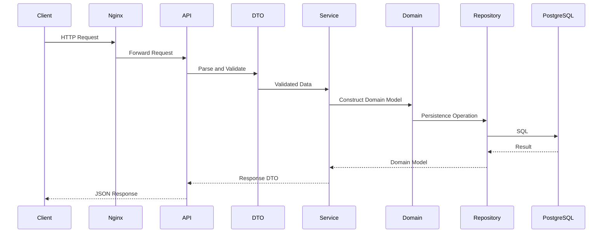

# 10- DTO

## Overview

A **Data Transfer Object (DTO)** is a data structure used to move data across an application boundary without exposing the internal representation of the source or destination model.

DTOs are especially useful in backend systems where data crosses boundaries such as:

- HTTP requests and responses
- service-to-service APIs
- application services
- database repositories
- message queues
- Kafka events
- gRPC services
- background jobs

A DTO primarily represents **transport shape**, not domain behavior.

For example:

```python
from dataclasses import dataclass


@dataclass(frozen=True, slots=True)
class CreateUserRequest:
    email: str
    display_name: str
```

This object describes data required by an application boundary.

It should not automatically become the application's domain model, persistence model, or business entity.

A useful architectural separation is:

```text
Transport DTO
     ↓
Domain Model
     ↓
Persistence Model
```

Each model exists for a different reason.

---

## Why DTOs Exist

Without DTOs, internal models frequently leak across application boundaries.

For example:

```python
@dataclass
class User:
    user_id: int
    email: str
    password_hash: str
    is_admin: bool
    created_at: datetime
```

Returning this object directly from an API is dangerous.

It can expose:

```text
password_hash
is_admin
internal timestamps
internal fields
future implementation details
```

A response DTO provides an explicit public contract:

```python
@dataclass(frozen=True, slots=True)
class UserResponse:
    id: int
    email: str
    display_name: str
```

The API now exposes only the fields intentionally selected for the client.

---

## DTO vs Entity vs Value Object

These models solve different problems.

| Model | Primary Purpose | Identity | Typical Mutability |
|---|---|---|---|
| DTO | Transfer data across boundaries | Usually none | Usually immutable |
| Value Object | Represent domain value semantics | No independent identity | Usually immutable |
| Entity | Represent domain identity and lifecycle | Yes | Often mutable |
| Persistence Model | Represent storage structure | Usually database identity | ORM-dependent |
| API Schema | Represent external contract | Usually none | Usually immutable |

A single business concept may legitimately have several representations.

For example:

```text
HTTP JSON
   ↓
CreateUserRequest DTO
   ↓
User domain entity
   ↓
UserRecord persistence model
```

Trying to make one class serve every layer usually creates coupling.

---

## DTO Characteristics

A well-designed DTO typically:

- contains data
- has explicit fields
- has clear types
- has minimal behavior
- is easy to serialize
- is easy to validate
- is independent of persistence concerns
- is independent of domain lifecycle

DTOs can contain lightweight transformation helpers, but business workflows should normally remain outside them.

---

## DTOs and Dataclasses

Python's `dataclass` is well suited to internal DTOs.

```python
from dataclasses import dataclass


@dataclass(frozen=True, slots=True)
class UserResponse:
    id: int
    email: str
    display_name: str
```

Benefits include:

- generated initialization
- readable representation
- structural equality
- type annotations
- optional immutability
- optional slot-based memory optimization

`frozen=True` is particularly useful for DTOs because transfer objects normally should not change after construction.

---

## Why `slots=True` Can Be Useful

For small DTOs created in large numbers:

```python
@dataclass(frozen=True, slots=True)
class ProductSummary:
    product_id: int
    name: str
    price_cents: int
```

`slots=True` can reduce per-instance memory overhead by avoiding the normal instance `__dict__`.

This can matter in:

- large query results
- batch processing
- Kafka consumers
- ETL pipelines
- high-throughput APIs

Do not use slots purely as a micro-optimization. Profile memory usage when the allocation cost matters.

---

## Request DTO

A request DTO represents data entering an application boundary.

```python
from dataclasses import dataclass


@dataclass(frozen=True, slots=True)
class CreateOrderRequest:
    customer_id: int
    currency: str
    amount_cents: int
```

The DTO answers:

> What data does this operation require?

It does not necessarily answer:

> Is this operation allowed?

Authorization belongs elsewhere.

---

## Response DTO

A response DTO represents data leaving an application boundary.

```python
@dataclass(frozen=True, slots=True)
class OrderResponse:
    order_id: int
    status: str
    amount_cents: int
    currency: str
```

This creates an explicit response contract.

It prevents internal changes from automatically changing the public API.

---

## Input and Output DTOs Should Usually Be Different

Avoid reusing one DTO for both input and output when their semantics differ.

Instead of:

```python
@dataclass
class UserDTO:
    id: int | None
    email: str
    password: str | None
    created_at: datetime | None
```

prefer:

```python
@dataclass(frozen=True, slots=True)
class CreateUserRequest:
    email: str
    password: str


@dataclass(frozen=True, slots=True)
class UserResponse:
    id: int
    email: str
    created_at: datetime
```

This prevents accidental exposure and makes the contract explicit.

---

## DTO Mapping

The mapping between DTOs and domain objects should be explicit.

```python
from dataclasses import dataclass


@dataclass(frozen=True, slots=True)
class CreateUserRequest:
    email: str
    display_name: str


@dataclass(frozen=True, slots=True)
class EmailAddress:
    value: str


@dataclass
class User:
    user_id: int
    email: EmailAddress
    display_name: str
```

Mapping:

```python
def to_domain(
    request: CreateUserRequest,
    user_id: int,
) -> User:
    return User(
        user_id=user_id,
        email=EmailAddress(request.email),
        display_name=request.display_name,
    )
```

The boundary is explicit:

```text
DTO
 ↓
Mapping
 ↓
Domain Model
```

---

## Why Explicit Mapping Matters

Explicit mapping provides a controlled translation boundary.

```text
External representation
        │
        ▼
       DTO
        │
        ▼
     Mapper
        │
        ▼
 Domain representation
```

This prevents:

- transport fields leaking into the domain
- domain fields leaking into APIs
- database schema becoming API schema
- accidental sensitive-field exposure
- tight coupling between layers

The mapping code is often intentionally boring. That is a feature.

---

## DTO Mapping Back to the API

A domain entity can be mapped to a response DTO:

```python
def to_response(user: User) -> UserResponse:
    return UserResponse(
        id=user.user_id,
        email=user.email.value,
        display_name=user.display_name,
    )
```

This makes the public contract explicit.

---

## DTOs and Value Objects

DTOs and value objects can work together.

For example:

```python
@dataclass(frozen=True, slots=True)
class CreatePaymentRequest:
    amount_cents: int
    currency: str
```

The domain can convert these fields into:

```python
Money(
    amount_cents=request.amount_cents,
    currency=CurrencyCode(request.currency),
)
```

The responsibilities are:

```text
DTO
→ Transport structure

Value Object
→ Domain semantics and invariants
```

Do not force the DTO to become the domain value object.

---

## FastAPI and Pydantic

FastAPI commonly uses Pydantic models for HTTP request and response schemas.

```python
from pydantic import BaseModel, EmailStr


class CreateUserRequest(BaseModel):
    email: EmailStr
    display_name: str


class UserResponse(BaseModel):
    id: int
    email: EmailStr
    display_name: str
```

This is also a DTO-style architecture even though the implementation uses Pydantic rather than `dataclass`.

Pydantic provides capabilities particularly useful at external boundaries:

- runtime validation
- parsing
- serialization
- JSON schema generation
- API documentation integration

---

## Dataclass DTO vs Pydantic DTO

| Concern | Dataclass | Pydantic |
|---|---|---|
| Lightweight internal DTO | Excellent | Good |
| Runtime validation | Manual | Strong |
| Parsing external data | Manual | Strong |
| JSON serialization | Manual/custom | Strong |
| JSON Schema | Not primary | Strong |
| Domain model separation | Excellent | Excellent |
| FastAPI integration | Possible | Native |
| Memory overhead | Generally low | Higher |
| Complex validation | Manual | Strong |

A practical architecture is:

```text
HTTP JSON
   ↓
Pydantic request model
   ↓
Domain value objects/entities
   ↓
Application service
```

An internal application-service DTO may still use a dataclass.

---

## Django and DTOs

Django models are persistence-oriented:

```python
class User(models.Model):
    email = models.EmailField()
    display_name = models.CharField(max_length=200)
```

An API should not automatically expose the Django model.

Instead:

```python
@dataclass(frozen=True, slots=True)
class UserResponse:
    id: int
    email: str
    display_name: str
```

Map the ORM object:

```python
def to_response(user: User) -> UserResponse:
    return UserResponse(
        id=user.pk,
        email=user.email,
        display_name=user.display_name,
    )
```

This prevents ORM structure from becoming the external contract.

---

## REST API Request Lifecycle

A typical API architecture looks like:



The DTO boundary protects the domain from the transport protocol.

---

## DTOs in Layered Architecture

A typical backend may use:

```text
Presentation Layer
    │
    ├── Request DTO
    └── Response DTO
    │
    ▼
Application Layer
    │
    └── Application DTO / Command
    │
    ▼
Domain Layer
    │
    ├── Entity
    └── Value Objects
    │
    ▼
Infrastructure Layer
    │
    └── Persistence Model
```

Not every application needs all these layers.

The important principle is that each model has a clear responsibility.

---

## DTOs and Application Services

Application services often accept DTOs representing use-case input.

```python
@dataclass(frozen=True, slots=True)
class CreateOrderCommand:
    customer_id: int
    amount_cents: int
    currency: str
```

The application service can transform the command into domain objects:

```python
class OrderService:
    def create_order(
        self,
        command: CreateOrderCommand,
    ) -> OrderResponse:
        money = Money(
            amount_cents=command.amount_cents,
            currency=command.currency,
        )

        order = self.repository.create(
            customer_id=command.customer_id,
            total=money,
        )

        return to_response(order)
```

This is particularly useful when the application service represents a business use case rather than a generic CRUD operation.

---

## DTOs vs Commands

A DTO is a broad structural concept.

A **Command** is a message representing an intention to perform an operation.

For example:

```python
@dataclass(frozen=True, slots=True)
class CreateOrderCommand:
    customer_id: int
    amount_cents: int
    currency: str
```

The distinction is semantic:

```text
DTO
→ Data being transferred

Command
→ Intent to perform an operation
```

A command can be implemented as a DTO.

The terms describe different architectural concerns.

---

## DTOs vs Query Models

A query DTO may represent data optimized for reading:

```python
@dataclass(frozen=True, slots=True)
class OrderSummary:
    order_id: int
    customer_name: str
    total_cents: int
    status: str
```

It does not need to mirror the `Order` domain entity.

This is particularly useful for:

- dashboards
- reporting
- list endpoints
- search APIs
- CQRS-style read models

A query DTO should represent what the caller needs rather than the entire underlying entity.

---

## Database Projection to DTO

A query can directly produce the required fields:

```sql
SELECT
    o.id AS order_id,
    c.name AS customer_name,
    o.total_cents,
    o.status
FROM orders AS o
JOIN customers AS c
    ON c.id = o.customer_id
WHERE o.status = 'paid';
```

Then map directly to:

```python
@dataclass(frozen=True, slots=True)
class OrderSummary:
    order_id: int
    customer_name: str
    total_cents: int
    status: str
```

This can be more efficient than loading a complete ORM graph when the endpoint only needs a small projection.

---

## DTOs and PostgreSQL

DTOs should not dictate database schema.

For example:

```text
API DTO
    ↓
Domain model
    ↓
Repository mapping
    ↓
PostgreSQL
```

A response DTO might contain:

```python
@dataclass(frozen=True, slots=True)
class UserResponse:
    id: int
    full_name: str
```

while PostgreSQL stores:

```text
first_name
last_name
```

The repository or mapper can combine them.

This separation allows database migrations without unnecessarily breaking clients.

---

## DTOs and Kafka

Kafka messages are transport contracts.

A DTO can represent an internal event payload:

```python
@dataclass(frozen=True, slots=True)
class OrderCreatedEvent:
    event_id: str
    order_id: int
    customer_id: int
    total_cents: int
    currency: str
```

However, Kafka serialization should use an explicit schema:

```text
Domain Event
     ↓
Event DTO
     ↓
Schema Serializer
     ↓
Kafka
```

For cross-service communication, consider schema technologies such as:

- Avro
- Protobuf
- JSON Schema

The distributed contract should not depend on Python dataclass implementation details.

---

## DTO Schema Evolution

DTOs crossing service boundaries must evolve carefully.

Suppose version 1 contains:

```json
{
  "order_id": 123,
  "status": "paid"
}
```

Version 2 adds:

```json
{
  "order_id": 123,
  "status": "paid",
  "currency": "USD"
}
```

Adding an optional field can often be backward-compatible.

Changing:

```text
order_id: integer
```

to:

```text
order_id: string
```

may break consumers.

For distributed systems, evaluate:

- backward compatibility
- forward compatibility
- optional fields
- defaults
- schema versioning
- consumer behavior
- rollout order

---

## gRPC DTOs

gRPC commonly uses Protobuf messages as transport DTOs:

```protobuf
message GetUserResponse {
  int64 user_id = 1;
  string email = 2;
  string display_name = 3;
}
```

The generated Python class is a transport representation.

It should not automatically become the domain entity.

A service can map:

```text
Protobuf Message
      ↓
Domain Model
      ↓
Business Logic
```

This keeps domain code independent of generated transport classes.

---

## Microservices

DTOs are especially important at microservice boundaries.

Suppose:

```text
Order Service
      │
      │ HTTP/gRPC/Kafka
      ▼
Payment Service
```

The services should communicate through explicit contracts.

Avoid:

```python
payment_service.process(order_entity)
```

when that entity contains internal state.

Prefer:

```python
payment_service.process(
    PaymentRequest(
        order_id=order.order_id,
        amount_cents=order.total.amount_cents,
        currency=order.total.currency,
    )
)
```

The receiving service owns its own internal representation.

---

## DTOs Prevent Distributed Coupling

Without DTOs:

```text
Service A domain model
        │
        └──────────────► Service B
```

A change to Service A can unexpectedly affect Service B.

With explicit contracts:

```text
Service A
   │
   ▼
Transport DTO
   │
   ▼
API/Event Contract
   │
   ▼
Transport DTO
   │
   ▼
Service B
```

Each service can evolve its internal domain model independently.

---

## DTOs and Redis

DTOs can represent cached projections:

```python
@dataclass(frozen=True, slots=True)
class UserCacheDTO:
    user_id: int
    display_name: str
    role: str
```

The cache serialization format should remain explicit.

For example:

```python
def to_cache_payload(
    user: UserCacheDTO,
) -> dict[str, object]:
    return {
        "user_id": user.user_id,
        "display_name": user.display_name,
        "role": user.role,
    }
```

Cache DTOs should contain only the data needed for the cached use case.

---

## DTOs and Celery

Background jobs should receive explicit, serializable payloads.

Prefer:

```python
@celery_app.task
def send_order_confirmation(
    order_id: int,
) -> None:
    ...
```

or a serialized command:

```python
@dataclass(frozen=True, slots=True)
class SendOrderConfirmation:
    order_id: int
```

Avoid passing complex ORM entities or live domain objects through task queues.

The worker should reconstruct what it needs from durable state.

---

## DTOs and Serialization

A DTO should have a deliberate serialization strategy.

For simple internal dataclasses:

```python
from dataclasses import asdict


payload = asdict(response)
```

can be convenient.

However, `asdict()` recursively converts nested dataclasses and is not a complete API serialization strategy.

For public contracts, explicit serialization is often safer:

```python
def serialize_user(
    user: UserResponse,
) -> dict[str, object]:
    return {
        "id": user.id,
        "email": user.email,
        "display_name": user.display_name,
    }
```

This prevents internal DTO changes from silently becoming wire-format changes.

---

## DTO Validation

Validation should occur at the appropriate boundary.

For external HTTP input:

```text
HTTP
 ↓
Pydantic validation
 ↓
DTO
 ↓
Domain invariants
```

A DTO can represent validated transport data, while domain objects enforce domain-level invariants.

These are different validation layers.

| Validation | Example |
|---|---|
| Syntax | Is this valid JSON? |
| Type | Is `customer_id` an integer? |
| Transport | Is the required HTTP field present? |
| Domain | Is the amount non-negative? |
| Authorization | Can this user perform the operation? |
| Persistence | Does the foreign key exist? |

Do not put all validation into one DTO class.

---

## DTOs and Security

DTOs provide an important security boundary.

Never automatically serialize internal models:

```python
return user.__dict__
```

or:

```python
return asdict(user)
```

without reviewing the resulting fields.

Explicit response DTOs help prevent:

- password hash exposure
- authorization metadata leakage
- internal identifiers
- infrastructure details
- secrets
- internal audit fields
- sensitive tenant information

A DTO is not itself a security mechanism, but explicit field selection reduces accidental data exposure.

---

## DTOs and Multi-Tenant Systems

In multi-tenant systems, DTO design should consider tenant boundaries.

For example:

```python
@dataclass(frozen=True, slots=True)
class InvoiceResponse:
    invoice_id: int
    amount_cents: int
    currency: str
```

The DTO does not determine whether the requester can access that invoice.

Authorization must happen before returning the DTO:

```text
Request
  ↓
Authenticate
  ↓
Authorize tenant/resource
  ↓
Query allowed data
  ↓
Build DTO
  ↓
Serialize
```

Do not rely on the DTO's fields to enforce tenant isolation.

---

## Performance Considerations

DTOs introduce mapping and object-allocation overhead.

For a normal API request, this cost is usually negligible compared with:

- network latency
- database queries
- serialization
- external service calls

However, in high-throughput workloads, repeated transformations can become measurable.

Potential optimizations include:

- projecting only required database columns
- avoiding unnecessary intermediate models
- using `slots=True`
- batching transformations
- streaming large results
- measuring serialization costs
- avoiding repeated JSON encode/decode cycles

Do not remove DTO boundaries prematurely for performance reasons.

Measure first.

---

## Large Result Sets

Creating millions of DTO instances can consume substantial memory.

Avoid:

```python
rows = repository.fetch_all()

responses = [
    UserResponse(...)
    for row in rows
]
```

when the dataset is extremely large and the entire result is not needed in memory.

Prefer pagination or streaming:

```text
Database
   ↓
Page / Cursor
   ↓
DTOs
   ↓
HTTP Response
```

For APIs, cursor pagination is often preferable to loading unbounded result sets.

---

## DTOs and Streaming

For large exports:

```text
PostgreSQL
   ↓
Chunk
   ↓
DTO / Projection
   ↓
Serialize
   ↓
HTTP Stream / Object Storage
```

Do not construct a massive list of DTOs when the response can be generated incrementally.

This reduces memory pressure and improves scalability.

---

## DTOs and Concurrency

Immutable DTOs are easier to share across asynchronous or concurrent operations.

```python
@dataclass(frozen=True, slots=True)
class RequestContext:
    request_id: str
    tenant_id: str
```

A frozen DTO prevents accidental reassignment:

```python
context.tenant_id = "other-tenant"
```

However, immutability does not automatically make an entire workflow thread-safe.

Shared mutable dependencies still require appropriate synchronization.

---

## DTOs and Observability

DTOs can improve observability by providing structured, predictable data.

For example:

```python
@dataclass(frozen=True, slots=True)
class PaymentResult:
    payment_id: str
    status: str
    amount_cents: int
    currency: str
```

Structured logs can selectively record:

```text
payment_id
status
currency
```

without dumping the entire domain object.

Never log sensitive DTO fields indiscriminately.

Observability systems should have explicit policies for:

- PII
- authentication tokens
- payment information
- credentials
- tenant-sensitive data

---

## DTOs and Reliability

Explicit DTOs improve reliability by making contracts visible.

They help detect:

- missing fields
- incompatible types
- unexpected schema changes
- accidental field exposure
- incorrect mappings

For distributed systems, contract tests should verify the actual serialized representation rather than only the Python class definition.

---

## DTOs and Deployment

DTO changes can require coordinated deployments when they cross service boundaries.

A safe rollout often follows:

```text
1. Deploy consumers that tolerate the new field.
2. Deploy producers that begin sending the new field.
3. Monitor compatibility and errors.
4. Remove old fields only after consumers have migrated.
```

This is particularly important with:

- Kafka
- gRPC
- REST APIs
- asynchronous workers
- independently deployed microservices

---

## DTOs and Docker/Kubernetes

DTOs do not directly affect container orchestration, but DTO design influences runtime behavior.

In Kubernetes:

- large response DTOs increase memory usage
- excessive serialization increases CPU consumption
- unbounded DTO lists can trigger OOM kills
- large API payloads increase network usage

Operational metrics should therefore include:

- response size
- serialization latency
- request latency
- memory usage
- CPU usage
- error rates

Use pagination and bounded payload sizes to protect workloads.

---

## AWS Considerations

DTOs are useful when integrating with AWS service boundaries.

Examples include:

```text
API Gateway → Lambda
SQS → Worker
SNS → Consumer
EventBridge → Service
S3 → Processing Pipeline
```

Keep AWS event/request representations separate from domain objects.

For example:

```text
SQS Message
    ↓
Transport DTO
    ↓
Domain Command
    ↓
Application Service
```

This avoids coupling business logic directly to AWS SDK event structures.

---

## DTOs and Disaster Recovery

Durable messages and stored event payloads should not depend on Python object internals.

Avoid treating:

```python
pickle.dumps(dto)
```

as a durable cross-version contract.

Prefer stable formats such as:

- JSON
- Protobuf
- Avro
- explicitly versioned schemas

For disaster recovery, durable data should remain readable after:

- application upgrades
- dependency changes
- Python version changes
- service migrations
- infrastructure replacement

---

## Pickle and DTOs

Python pickle can serialize Python objects, but it is generally unsuitable for untrusted input and long-lived cross-service contracts.

Do not unpickle data received from untrusted sources.

For distributed DTOs, use explicit serialization formats instead.

---

## Testing DTOs

DTO tests should focus on:

- field correctness
- validation
- serialization
- mapping
- compatibility
- security-sensitive field selection

Example:

```python
def test_user_response_contains_only_public_fields() -> None:
    response = UserResponse(
        id=42,
        email="user@example.com",
        display_name="Example User",
    )

    assert response.id == 42
    assert response.email == "user@example.com"
    assert response.display_name == "Example User"
```

Mapping test:

```python
def test_user_maps_to_response() -> None:
    user = User(
        user_id=42,
        email=EmailAddress("user@example.com"),
        display_name="Example User",
    )

    response = to_response(user)

    assert response == UserResponse(
        id=42,
        email="user@example.com",
        display_name="Example User",
    )
```

---

## Contract Testing

For external APIs, test the serialized contract.

Example:

```python
def test_user_response_contract() -> None:
    response = UserResponse(
        id=42,
        email="user@example.com",
        display_name="Example User",
    )

    payload = {
        "id": response.id,
        "email": response.email,
        "display_name": response.display_name,
    }

    assert set(payload) == {
        "id",
        "email",
        "display_name",
    }
```

For microservices, consumer-driven contract testing can verify that producer changes remain compatible with actual consumers.

---

## Common Mistakes

### Reusing the ORM Model as the API Response

This couples the API contract to database implementation.

### Reusing One DTO Everywhere

A request, domain command, database record, and response often have different semantics.

### Returning `__dict__`

This can expose internal or sensitive fields.

### Blindly Using `asdict()`

It can recursively serialize fields that should not be externally visible.

### Putting Business Logic in DTOs

DTOs should primarily carry data. Complex business behavior belongs in domain/application services.

### Passing ORM Objects Through Queues

ORM objects are tightly coupled to process and persistence state.

### Sending Python Objects Through Kafka

Distributed contracts should be language- and implementation-independent.

### Ignoring Schema Evolution

A field change that looks harmless locally can break independent consumers.

### Creating DTOs for Every Internal Function

Not every function requires a separate data-transfer abstraction.

### Assuming DTO Validation Is Authorization

A structurally valid request can still be unauthorized.

---

## Production Pitfalls

### DTO Explosion

Too many nearly identical DTOs can make a codebase difficult to navigate.

Use separate DTOs when the boundary or semantics genuinely differ.

### Accidental Contract Coupling

Automatic serialization can cause internal field changes to become public API changes.

### Excessive Mapping

Multiple unnecessary model conversions increase CPU usage and code complexity.

### Large DTO Graphs

Returning deeply nested object graphs can increase:

- response size
- serialization latency
- database query complexity
- memory usage

Prefer purpose-built projections.

### Sensitive Data Leakage

A response DTO that accidentally contains internal metadata can become a security incident.

### Distributed Version Incompatibility

Producer and consumer deployments may not happen simultaneously.

Design contracts for gradual rollout.

---

## DTO Design Guidelines

A practical DTO should answer:

> What exact data crosses this boundary?

It should generally have:

- explicit fields
- explicit types
- predictable serialization
- stable semantics
- minimal behavior
- controlled field exposure

Avoid:

```python
@dataclass
class EverythingDTO:
    user: User
    database_row: Any
    request: Request
    internal_cache: dict
```

Prefer purpose-specific DTOs:

```python
@dataclass(frozen=True, slots=True)
class UserResponse:
    id: int
    email: str
```

---

## DTO Naming

Names should communicate the boundary or use case.

Useful names include:

```text
CreateUserRequest
UpdateUserRequest
UserResponse
OrderSummary
PaymentRequest
PaymentResponse
CreateOrderCommand
OrderCreatedEvent
UserCacheEntry
```

Avoid generic names such as:

```text
Data
ResponseData
UserDTO
Object
Payload
Model
```

when the actual semantics are known.

Specific names make architecture easier to understand.

---

## DTO Naming by Boundary

| Boundary | Example |
|---|---|
| HTTP request | `CreateUserRequest` |
| HTTP response | `UserResponse` |
| Application command | `CreateOrderCommand` |
| Query projection | `OrderSummary` |
| Kafka event | `OrderCreatedEvent` |
| gRPC request | `GetUserRequest` |
| Cache representation | `UserCacheEntry` |
| Background task | `SendEmailCommand` |

The naming should reflect the responsibility rather than merely the implementation technology.

---

## DTO Decision Framework

Use a DTO when:

```text
Does data cross a meaningful boundary?
             │
             ├── No
             │    │
             │    └── A local structure may be enough
             │
             └── Yes
                  │
                  ▼
       Does the boundary need a stable shape?
                  │
                  ├── Yes → DTO / schema
                  │
                  └── No
                       │
                       └── Evaluate whether
                           an explicit DTO adds value
```

Then ask:

- Does the source model contain fields that should not cross the boundary?
- Does the destination model have different semantics?
- Does the contract need independent evolution?
- Is validation required?
- Is serialization required?
- Is the boundary owned by another service?

If several answers are yes, a DTO is usually justified.

---

## DTO vs Direct Model Usage

| Approach | Advantages | Limitations |
|---|---|---|
| Direct domain model | Less code | High coupling |
| Direct ORM model | Convenient CRUD | Leaks persistence concerns |
| DTO | Explicit boundary | Requires mapping |
| Pydantic schema | Strong validation and serialization | Additional model layer |
| Protobuf message | Strong distributed contract | Generated code and schema management |

For simple internal CRUD applications, direct model usage may be acceptable.

For larger systems, explicit DTO boundaries generally provide better long-term control.

---

## Recommended Backend Structure

A Python service can organize DTOs by boundary:

```text
app/
├── api/
│   ├── requests/
│   │   └── users.py
│   └── responses/
│       └── users.py
│
├── application/
│   └── commands/
│       └── users.py
│
├── domain/
│   ├── entities/
│   └── value_objects/
│
├── infrastructure/
│   ├── database/
│   └── messaging/
│
└── mappings/
    ├── user_mapper.py
    └── order_mapper.py
```

The exact structure should match the application's size and architecture.

Do not create a large abstraction hierarchy before the system requires it.

---

## Production Checklist

Before introducing or reviewing a DTO, verify:

- [ ] Does it represent a real application boundary?
- [ ] Are its fields explicitly defined?
- [ ] Are request and response semantics separated where appropriate?
- [ ] Is validation performed at the correct layer?
- [ ] Are domain invariants enforced by the domain model?
- [ ] Are sensitive fields excluded?
- [ ] Is serialization explicit for external contracts?
- [ ] Is database structure hidden behind mapping?
- [ ] Is schema evolution considered?
- [ ] Are distributed contracts version-compatible?
- [ ] Are large collections paginated or streamed?
- [ ] Is object allocation acceptable for the workload?
- [ ] Are mapping functions tested?
- [ ] Are API/event contracts tested?
- [ ] Are authorization checks performed independently?

---

## Key Takeaways

- **A DTO is a boundary model for transferring data**, not a replacement for domain entities, value objects, or persistence models.
- **DTOs protect architectural boundaries** by preventing API, database, messaging, and infrastructure representations from becoming tightly coupled to internal domain models.
- **Use explicit request, response, command, query, and event DTOs when their semantics differ**, rather than forcing one generic model to serve every layer.
- **External DTOs require deliberate validation, serialization, security, and schema-evolution strategies**, especially across REST, gRPC, Kafka, queues, and microservices.
- **DTO boundaries introduce mapping and allocation costs, but usually provide substantial maintainability and reliability benefits**; optimize only when profiling demonstrates that transformation overhead is material.