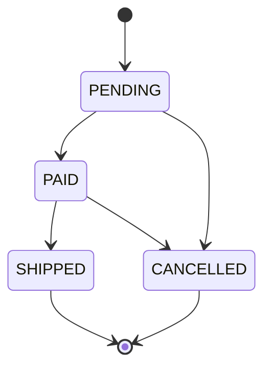
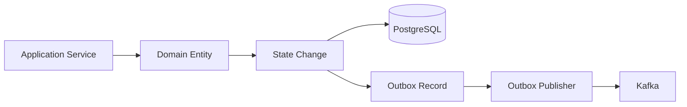

# 11- Domain Models

## Overview

A **domain model** represents the concepts, rules, state, and behavior that are central to a business domain.

In a backend application, the domain model sits between external interfaces and infrastructure:

```text
HTTP / gRPC / Kafka
        ↓
      DTOs
        ↓
   Domain Model
        ↓
Repositories / Infrastructure
        ↓
PostgreSQL / Redis / AWS
```

A domain model is not simply a collection of database fields. It should express the rules that make the business domain valid.

For example, an order is more than:

```python
{
    "id": 123,
    "status": "paid",
    "total": 5000,
}
```

A domain model can express rules such as:

- an order cannot be paid twice
- a cancelled order cannot be shipped
- an order total cannot be negative
- only valid state transitions are allowed
- an order must contain at least one item

The purpose is to make invalid business states difficult to represent and to keep business rules close to the data they govern.

---

## What Is a Domain Model?

A domain model is a software representation of a business concept and its rules.

A domain model may contain:

- entities
- value objects
- domain events
- domain services
- invariants
- state transitions
- domain-specific behavior

A simple domain entity can be represented with a dataclass:

```python
from dataclasses import dataclass


@dataclass
class Order:
    order_id: int
    status: str

    def cancel(self) -> None:
        if self.status == "shipped":
            raise ValueError(
                "shipped orders cannot be cancelled"
            )

        self.status = "cancelled"
```

The important part is not the dataclass itself.

The important part is that the model owns a domain rule:

```text
Order
 └── cancellation rules
```

---

## Why Domain Models Matter

Without a domain model, business rules often become scattered across:

```text
API handlers
service functions
ORM models
repositories
Celery tasks
Kafka consumers
utility functions
```

For example:

```python
if order.status != "shipped":
    order.status = "cancelled"
```

might appear in multiple places.

Over time, different code paths can implement different interpretations of cancellation.

A domain model centralizes the invariant:

```python
order.cancel()
```

Now callers do not need to know the internal cancellation rules.

---

## Domain Model vs Database Model

A database model describes persistence.

A domain model describes business meaning.

These concerns overlap, but they are not identical.

| Concern | Domain Model | Database Model |
|---|---|---|
| Business invariants | Primary responsibility | Limited |
| Persistence | Not primary | Primary |
| Database columns | Not necessarily | Yes |
| Relationships | Business semantics | Foreign keys/joins |
| Transactions | Usually coordinated externally | Persistence mechanism |
| Identity | Domain identity | Database identity |
| SQL behavior | No | Yes |
| ORM dependency | Preferably no | Often yes |

A Django model may represent both in a small application, but larger systems often benefit from separating them.

---

## Domain Model vs DTO

A DTO transfers data.

A domain model represents business semantics.

```text
DTO
→ "What data crossed the boundary?"

Domain Model
→ "What does this data mean and what rules govern it?"
```

For example:

```python
@dataclass(frozen=True, slots=True)
class CreateOrderRequest:
    customer_id: int
    amount_cents: int
    currency: str
```

This is transport-oriented.

The domain may contain:

```python
@dataclass
class Order:
    order_id: int
    total: Money
    status: OrderStatus
```

The domain model uses stronger concepts and behavior.

---

## Domain Model vs Value Object

A **value object** represents a concept through its value.

A **domain entity** represents a concept through identity and lifecycle.

Example:

```text
Order
 ├── order_id        → identity
 ├── status          → state
 ├── total           → Money value object
 └── customer_id     → relationship
```

`Order` is an entity.

`Money` is a value object.

Both can be part of the domain model.

---

## Entities

An entity is a domain object whose identity matters independently of its current values.

Example:

```python
@dataclass
class Order:
    order_id: int
    status: str
```

Two orders may have identical statuses and totals but still be different orders because their identities differ.

```text
Order #1001
Order #1002
```

Their values might currently be identical, but they are not the same business object.

---

## Entity Identity

Identity should normally be stable across state changes.

```python
order = Order(
    order_id=1001,
    status="pending",
)
```

Later:

```python
order.status = "paid"
```

It is still:

```text
Order #1001
```

The state changed, but identity did not.

This is fundamentally different from a value object.

---

## Value Objects Inside Domain Models

Value objects make domain entities more expressive.

```python
from dataclasses import dataclass


@dataclass(frozen=True, slots=True)
class Money:
    amount_cents: int
    currency: str

    def __post_init__(self) -> None:
        if self.amount_cents < 0:
            raise ValueError(
                "amount cannot be negative"
            )

        normalized = self.currency.strip().upper()

        if len(normalized) != 3:
            raise ValueError(
                "currency must contain three characters"
            )

        object.__setattr__(
            self,
            "currency",
            normalized,
        )
```

The entity can then use:

```python
@dataclass
class Order:
    order_id: int
    total: Money
    status: str
```

This is stronger than:

```python
total: int
currency: str
```

because the relationship between amount and currency is explicit.

---

## Domain Invariants

An **invariant** is a condition that must remain true for a valid domain object.

Examples:

```text
Order total >= 0
Payment amount > 0
DateRange.start <= DateRange.end
Cancelled order cannot become shipped
Paid order cannot be paid again
```

A strong domain model protects these conditions.

Example:

```python
from dataclasses import dataclass


@dataclass
class Payment:
    payment_id: str
    amount_cents: int
    status: str

    def __post_init__(self) -> None:
        if self.amount_cents <= 0:
            raise ValueError(
                "payment amount must be positive"
            )
```

The invariant is established during construction.

---

## Behavioral Domain Models

A model becomes more useful when it owns operations that naturally belong to it.

Weak approach:

```python
def cancel_order(order: Order) -> None:
    if order.status == "shipped":
        raise ValueError("cannot cancel")
    order.status = "cancelled"
```

Stronger approach:

```python
@dataclass
class Order:
    order_id: int
    status: str

    def cancel(self) -> None:
        if self.status == "shipped":
            raise ValueError(
                "shipped orders cannot be cancelled"
            )

        self.status = "cancelled"
```

The second design communicates:

```text
Order knows how to cancel itself
```

and centralizes the rule.

---

## Anemic Domain Models

An **anemic domain model** contains mostly data with little or no domain behavior.

Example:

```python
@dataclass
class Order:
    order_id: int
    status: str
    total_cents: int
```

and business logic lives elsewhere:

```python
def cancel_order(order: Order) -> None:
    if order.status == "shipped":
        raise ValueError("cannot cancel")

    order.status = "cancelled"
```

An anemic model is not automatically wrong.

It can be appropriate when:

- the domain is simple
- business rules are minimal
- the application is CRUD-oriented
- the service layer naturally owns orchestration

The problem occurs when complex business rules become scattered across procedural services.

---

## Rich Domain Models

A rich domain model contains behavior closely associated with domain state.

```python
@dataclass
class Order:
    order_id: int
    status: str

    def pay(self) -> None:
        if self.status != "pending":
            raise ValueError(
                "only pending orders can be paid"
            )

        self.status = "paid"

    def ship(self) -> None:
        if self.status != "paid":
            raise ValueError(
                "only paid orders can be shipped"
            )

        self.status = "shipped"
```

The entity controls its legal state transitions.

This reduces the number of places that need to understand the state machine.

---

## State Transitions

Domain entities often behave like state machines.



The model should reject invalid transitions.

For example:

```text
PENDING → PAID       valid
PAID → SHIPPED       valid
SHIPPED → CANCELLED  invalid
CANCELLED → PAID     invalid
```

---

## Explicit State Representation

Use an enum when the state space is finite.

```python
from enum import StrEnum


class OrderStatus(StrEnum):
    PENDING = "pending"
    PAID = "paid"
    SHIPPED = "shipped"
    CANCELLED = "cancelled"
```

Then:

```python
@dataclass
class Order:
    order_id: int
    status: OrderStatus
```

This is safer than scattering string literals throughout the codebase.

---

## Domain Behavior With Enums

```python
@dataclass
class Order:
    order_id: int
    status: OrderStatus

    def pay(self) -> None:
        if self.status != OrderStatus.PENDING:
            raise ValueError(
                "only pending orders can be paid"
            )

        self.status = OrderStatus.PAID
```

The state transition becomes explicit and type-checkable.

---

## Domain Events

Domain models may produce events when meaningful business state changes occur.

For example:

```python
@dataclass(frozen=True, slots=True)
class OrderPaid:
    order_id: int
```

The entity can conceptually transition:

```text
Order
 ↓
pay()
 ↓
OrderPaid
```

The event can then be handled by the application layer.

Avoid making the entity directly publish to Kafka.

Instead:

```text
Domain Model
     ↓
Domain Event
     ↓
Application Service
     ↓
Event Publisher
     ↓
Kafka
```

This keeps infrastructure concerns outside the domain model.

---

## Application Services

Application services orchestrate domain objects and infrastructure.

Example:

```python
class OrderService:
    def __init__(
        self,
        repository: "OrderRepository",
    ) -> None:
        self.repository = repository

    def pay_order(
        self,
        order_id: int,
    ) -> None:
        order = self.repository.get(order_id)

        order.pay()

        self.repository.save(order)
```

The responsibilities are separated:

```text
Application Service
→ orchestrates workflow

Domain Model
→ enforces business rules

Repository
→ persists state
```

---

## Domain Services

Some business operations do not naturally belong to a single entity.

For example:

```text
Currency conversion
Fraud evaluation
Pricing across multiple aggregates
Route calculation
Complex eligibility rules
```

A domain service can represent such logic.

```python
class PricingService:
    def calculate_total(
        self,
        subtotal: Money,
        discount: Percentage,
    ) -> Money:
        ...
```

Do not create domain services merely because a function exists.

Use one when the behavior is genuinely domain-specific but does not have a natural owner.

---

## Domain Model and Dependency Direction

A useful architecture follows dependency inversion:

```text
                ┌──────────────────────┐
                │   Presentation       │
                │ REST / gRPC / Kafka  │
                └──────────┬───────────┘
                           ↓
                ┌──────────────────────┐
                │   Application        │
                │ Services / Commands  │
                └──────────┬───────────┘
                           ↓
                ┌──────────────────────┐
                │      Domain          │
                │ Entities / Values    │
                │ Rules / Events       │
                └──────────┬───────────┘
                           ↑
                ┌──────────────────────┐
                │   Infrastructure     │
                │ DB / Redis / Kafka   │
                └──────────────────────┘
```

The domain should not depend directly on:

- Django ORM
- FastAPI
- SQLAlchemy
- Redis clients
- Kafka clients
- AWS SDKs
- HTTP clients

Infrastructure should adapt to domain interfaces.

---

## Repository Abstraction

The domain/application layer can define a repository contract:

```python
from typing import Protocol


class OrderRepository(Protocol):
    def get(self, order_id: int) -> "Order":
        ...

    def save(self, order: "Order") -> None:
        ...
```

Infrastructure provides the implementation:

```text
Domain/Application
       │
       ▼
 OrderRepository
       ▲
       │
PostgreSQL Repository
```

This reduces coupling between business logic and persistence technology.

---

## Django Architecture

In a Django application, there is a spectrum of architectural complexity.

Simple CRUD:

```text
Django View
    ↓
Django Model
    ↓
PostgreSQL
```

More domain-oriented:

```text
Django View
    ↓
Request DTO
    ↓
Application Service
    ↓
Domain Model
    ↓
Repository
    ↓
Django ORM
    ↓
PostgreSQL
```

The second approach provides stronger separation but introduces additional code.

Use the complexity that the domain justifies.

---

## FastAPI Architecture

A FastAPI service can separate transport and domain concerns:

```text
FastAPI Endpoint
      ↓
Pydantic Request
      ↓
Application Service
      ↓
Domain Entity
      ↓
Repository
      ↓
PostgreSQL
```

Example:

```python
from fastapi import APIRouter


router = APIRouter()


@router.post("/orders")
def create_order(
    request: CreateOrderRequest,
) -> OrderResponse:
    order = order_service.create(request)

    return to_response(order)
```

The endpoint remains thin.

Business rules stay outside the HTTP layer.

---

## Domain Model and PostgreSQL

A domain model does not have to match table structure.

Consider:

```python
@dataclass
class Order:
    order_id: int
    total: Money
    status: OrderStatus
```

PostgreSQL might contain:

```text
orders
├── id
├── total_amount_cents
├── total_currency
└── status
```

The repository maps between representations.

```text
PostgreSQL Row
      ↓
Persistence Model
      ↓
Mapper
      ↓
Domain Entity
```

This allows database design and domain design to evolve independently.

---

## Transactions and Domain Models

A domain model can enforce local invariants, but database transactions protect persistence consistency.

Example:

```text
BEGIN
  ↓
Load Order
  ↓
order.pay()
  ↓
Save Order
  ↓
Create Outbox Event
  ↓
COMMIT
```

If the transaction fails:

```text
ROLLBACK
```

The domain object's in-memory state is not itself a transaction.

Transaction boundaries belong to the application/infrastructure layer.

---

## Domain Events and the Transactional Outbox

When a domain change must produce a Kafka event, avoid:

```text
Update PostgreSQL
       ↓
Publish Kafka
```

without coordination.

A failure between these operations can produce inconsistent state.

A common architecture is:



The database transaction can atomically persist:

```text
business state + outbox event
```

A separate publisher sends the event to Kafka.

---

## Domain Models and Redis

Redis should normally remain infrastructure.

Avoid putting Redis calls directly into entities:

```python
class Order:
    def save_to_redis(self):
        ...
```

Prefer:

```text
Domain Entity
      ↓
Application Service
      ↓
Cache Adapter
      ↓
Redis
```

The domain model remains independent of the cache technology.

---

## Domain Models and Celery

A domain model should generally not enqueue its own Celery task.

Avoid:

```python
class Order:
    def ship(self):
        ...
        celery.send_task(...)
```

Prefer:

```text
Application Service
       ↓
Domain Entity
       ↓
Domain Event
       ↓
Task Publisher
       ↓
Celery
```

This keeps asynchronous infrastructure out of the domain.

---

## Domain Models and gRPC

Generated Protobuf classes are transport representations.

Avoid making them the core domain model:

```text
Protobuf Message
       ↓
Domain Entity
```

Map explicitly:

```python
def to_domain(
    request: GetOrderRequest,
) -> OrderQuery:
    ...
```

This prevents the domain from depending on generated transport code.

---

## Domain Models and Kafka

Kafka events are distributed contracts.

A domain entity should not be serialized directly into Kafka.

Prefer:

```text
Domain Entity
      ↓
Domain Event
      ↓
Event DTO
      ↓
Schema Serializer
      ↓
Kafka
```

This allows the domain model to change without automatically changing the wire protocol.

---

## Aggregates

An **aggregate** is a consistency boundary around related domain objects.

For example:

```text
Order Aggregate
├── Order
├── OrderItem
├── Money
└── ShippingAddress
```

The aggregate root controls changes that must preserve invariants.

Example:

```python
@dataclass
class Order:
    order_id: int
    items: list["OrderItem"]

    def add_item(self, item: "OrderItem") -> None:
        if item.quantity <= 0:
            raise ValueError(
                "quantity must be positive"
            )

        self.items.append(item)
```

The exact aggregate boundary depends on the domain.

Do not automatically treat every related database table as one aggregate.

---

## Aggregate Boundaries and Transactions

A useful rule is:

> Invariants that must be strongly consistent together should normally live within the same aggregate boundary.

For example:

```text
Order
 ├── total
 ├── items
 └── status
```

If adding an item must atomically update the order total, they may belong to the same aggregate.

Across aggregate boundaries, eventual consistency may be more appropriate.

---

## Domain Model and Concurrency

Domain models do not eliminate race conditions.

Consider two workers:

```text
Worker A → Order PENDING → PAY
Worker B → Order PENDING → CANCEL
```

Both may read the same initial state.

Database-level concurrency control may be required:

- optimistic locking
- `SELECT ... FOR UPDATE`
- version columns
- unique constraints
- idempotency keys

The domain model defines valid transitions.

The persistence layer ensures concurrent updates cannot violate those rules.

---

## Optimistic Locking

A domain entity can carry a version:

```python
@dataclass
class Order:
    order_id: int
    status: OrderStatus
    version: int
```

The repository can update conditionally:

```sql
UPDATE orders
SET status = 'paid',
    version = version + 1
WHERE id = $1
  AND version = $2;
```

If no row is updated, another transaction changed the entity.

The repository can raise a concurrency exception.

This allows domain rules and persistence concurrency control to work together.

---

## Idempotency

Domain models are often involved in operations that may be retried.

For example:

```text
HTTP request
   ↓
Payment command
   ↓
Database
   ↓
Timeout
   ↓
Client retries
```

The application should prevent duplicate effects.

Idempotency may use:

- idempotency keys
- unique database constraints
- persisted command records
- state checks
- transactional outbox patterns

A domain model can enforce:

```python
if self.status == OrderStatus.PAID:
    raise AlreadyPaid(...)
```

but distributed idempotency usually requires persistence-level support too.

---

## Exceptions and Domain Errors

Use domain-specific exceptions when they improve clarity.

```python
class InvalidOrderTransition(Exception):
    pass


class OrderAlreadyPaid(Exception):
    pass
```

Then:

```python
def pay(self) -> None:
    if self.status == OrderStatus.PAID:
        raise OrderAlreadyPaid(
            f"order {self.order_id} is already paid"
        )

    if self.status != OrderStatus.PENDING:
        raise InvalidOrderTransition(
            f"cannot pay order in {self.status} state"
        )

    self.status = OrderStatus.PAID
```

The application layer can translate these into transport-specific responses.

```text
Domain Exception
      ↓
Application Layer
      ↓
HTTP 409 / gRPC FAILED_PRECONDITION
```

The domain should not raise FastAPI or HTTP-specific exceptions.

---

## Domain Models and Type Hints

Type annotations make domain semantics clearer.

Prefer:

```python
@dataclass
class Order:
    order_id: int
    status: OrderStatus
    total: Money
```

over:

```python
@dataclass
class Order:
    order_id: int
    status: str
    total: dict
```

Static typing helps detect invalid combinations before runtime.

Tools such as mypy and Pyright can enforce these contracts during CI/CD.

---

## Domain Models and Pattern Matching

Python structural pattern matching can be useful for state-dependent logic.

```python
match order.status:
    case OrderStatus.PENDING:
        ...
    case OrderStatus.PAID:
        ...
    case OrderStatus.SHIPPED:
        ...
    case OrderStatus.CANCELLED:
        ...
```

For core invariants, explicit methods such as:

```python
order.pay()
order.ship()
order.cancel()
```

are often clearer because they encapsulate the state transition.

Use pattern matching where it improves readability rather than replacing domain behavior indiscriminately.

---

## Dataclass Configuration

Domain entities often use:

```python
@dataclass
class Order:
    ...
```

rather than:

```python
@dataclass(frozen=True)
class Order:
    ...
```

because entities frequently change state through controlled methods.

Value objects are more commonly:

```python
@dataclass(frozen=True, slots=True)
class Money:
    ...
```

A useful distinction is:

```text
Entity
→ identity + controlled state transitions

Value Object
→ immutable value semantics
```

---

## Equality of Domain Entities

Be careful with generated dataclass equality.

This:

```python
@dataclass
class Order:
    order_id: int
    status: OrderStatus
```

generally gives structural equality based on fields.

But domain entities may require identity-based equality.

For example:

```text
Order #1001
```

may be considered the same entity even if other state differs.

Do not assume generated dataclass equality always matches domain identity semantics.

If identity semantics are important, define them explicitly.

---

## Domain Models and Serialization

Avoid making domain entities responsible for JSON serialization.

Instead:

```text
Domain Entity
      ↓
Mapper
      ↓
Response DTO
      ↓
JSON
```

This prevents domain classes from becoming coupled to:

- HTTP
- JSON
- API versioning
- Pydantic
- framework-specific serializers

The domain should remain transport-independent.

---

## Security Boundaries

Domain models can enforce business invariants, but security has multiple layers.

For example:

```text
Authentication
→ Who is the caller?

Authorization
→ What can the caller do?

Domain Rules
→ What states and operations are valid?

Persistence Constraints
→ What data relationships are allowed?
```

Do not assume:

```python
order.cancel()
```

means the caller is authorized to cancel the order.

Authorization should normally be checked before invoking the operation.

---

## Tenant Isolation

In multi-tenant systems, domain operations must respect tenant context.

For example:

```python
@dataclass
class Order:
    order_id: int
    tenant_id: str
    status: OrderStatus
```

The domain may ensure the tenant identity is part of the entity.

However, the repository/query layer must also enforce tenant scoping:

```sql
SELECT *
FROM orders
WHERE id = $1
  AND tenant_id = $2;
```

Never rely solely on an in-memory domain model to prevent cross-tenant access.

---

## Observability

Domain models should remain free from logging and metrics infrastructure where practical.

Instead, application services can emit structured telemetry around domain operations:

```text
order.pay()
    ↓
Application Service
    ├── metric: order_payment_attempts
    ├── trace span
    ├── structured log
    └── domain operation
```

Useful metrics include:

- invalid transition count
- payment failures
- cancellation failures
- processing latency
- domain exception rates
- transaction retries

Avoid logging sensitive domain fields.

---

## Testing Domain Models

Domain models are particularly well suited to unit testing because they should have minimal infrastructure dependencies.

Example:

```python
def test_pending_order_can_be_paid() -> None:
    order = Order(
        order_id=1001,
        status=OrderStatus.PENDING,
    )

    order.pay()

    assert order.status == OrderStatus.PAID
```

Invalid transition:

```python
import pytest


def test_shipped_order_cannot_be_paid() -> None:
    order = Order(
        order_id=1001,
        status=OrderStatus.SHIPPED,
    )

    with pytest.raises(InvalidOrderTransition):
        order.pay()
```

These tests execute without:

- PostgreSQL
- Redis
- Kafka
- HTTP
- Docker

That makes them fast and deterministic.

---

## Property-Based Testing

Domain invariants are good candidates for property-based testing.

For example:

```text
For every valid Order:
    total >= 0

For every legal state transition:
    resulting state is valid

For every cancelled Order:
    shipping is rejected
```

This is useful when the domain has many combinations of:

- items
- discounts
- currencies
- states
- quantities
- dates

---

## Integration Testing

Unit tests are not enough for persistence behavior.

Integration tests should verify:

```text
Domain Model
     ↓
Repository
     ↓
PostgreSQL
```

Important cases include:

- transaction boundaries
- optimistic locking
- unique constraints
- foreign keys
- serialization
- concurrent updates
- outbox persistence

A domain rule and its database representation should both be tested where consistency depends on both.

---

## Performance

Domain models introduce object allocation and mapping overhead.

For typical API workloads, this is usually small relative to:

- database latency
- network latency
- JSON serialization
- external service calls

In high-volume workloads, profile:

- object allocations
- mapping time
- serialization
- memory consumption
- garbage collection pressure

Use:

```python
@dataclass(slots=True)
```

where appropriate for memory-sensitive object populations.

Do not sacrifice clear domain boundaries based on assumptions about performance.

---

## Scalability

Domain models support scalability indirectly by separating business rules from infrastructure.

For example:

```text
                ┌── API Instance 1
Client ────────►├── API Instance 2
                └── API Instance 3
                         │
                         ▼
                  Domain Logic
                         │
                ┌────────┴────────┐
                ▼                 ▼
           PostgreSQL          Kafka
```

The domain code can remain stateless between requests when entity state is persisted externally.

Scalability still depends on:

- database design
- caching
- queue partitioning
- connection pools
- transaction duration
- idempotency
- horizontal scaling

A well-designed domain model does not automatically make a system scalable.

---

## High Availability

Domain models themselves are generally process-local.

High availability is provided by the surrounding architecture:

- multiple application instances
- PostgreSQL replication
- Redis high availability where required
- Kafka replication
- load balancing
- health checks
- automated deployment
- failure recovery

Nginx or a cloud load balancer may distribute requests:

```text
Client
  ↓
Load Balancer / Nginx
  ├── API instance
  ├── API instance
  └── API instance
```

Each instance reconstructs domain objects from durable state.

---

## Disaster Recovery

Domain models should not be treated as durable state.

Durability belongs to:

- PostgreSQL
- Kafka
- object storage
- backups
- replicated infrastructure

A production design should ensure domain state can be reconstructed after:

- container replacement
- application restart
- node failure
- regional outage
- deployment rollback

This is another reason to avoid embedding critical state only inside in-memory domain objects.

---

## Deployment and CI/CD

Domain model changes should be tested independently and then against integration boundaries.

A CI pipeline may run:

```text
Lint
 ↓
Type Check
 ↓
Domain Unit Tests
 ↓
Integration Tests
 ↓
API Tests
 ↓
Build Docker Image
 ↓
Deploy
```

When a domain change modifies persistence or events, also validate:

- database migrations
- event schemas
- API contracts
- backward compatibility
- consumer behavior

---

## Domain Model Complexity

Not every backend requires Domain-Driven Design or rich entities.

A simple CRUD service may be better represented as:

```text
FastAPI
  ↓
Service
  ↓
ORM
  ↓
PostgreSQL
```

Introducing:

```text
Entities
Value Objects
Aggregates
Domain Services
Repositories
Factories
Domain Events
```

for a simple CRUD application can create unnecessary complexity.

Use domain modeling when the business rules justify it.

---

## When to Use Rich Domain Models

Rich domain models are particularly valuable when:

- business rules are complex
- state transitions are important
- invariants span multiple fields
- workflows have many edge cases
- business logic changes frequently
- multiple interfaces invoke the same rules
- correctness matters more than simple CRUD throughput

Examples include:

- payments
- order processing
- subscriptions
- billing
- inventory
- logistics
- workflow systems
- authorization policies
- financial systems

---

## When a Simpler Model Is Better

A rich domain model may be unnecessary when:

- the service is primarily CRUD
- data has little business behavior
- most operations are simple projections
- there are few invariants
- the domain is unlikely to evolve
- the added abstraction has no measurable benefit

Architecture should follow domain complexity, not architectural fashion.

---

## Common Mistakes

### Treating ORM Models as Domain Models

ORM models contain persistence concerns that can leak into business logic.

### Putting Business Rules in API Handlers

This duplicates logic across HTTP, gRPC, Kafka, and background-job entry points.

### Making Every Entity Immutable

Entities often need controlled state transitions.

### Making Every Entity Mutable

Unrestricted mutation makes invariants difficult to protect.

### Creating Giant Domain Classes

A domain entity should not become a dumping ground for unrelated business operations.

### Calling Infrastructure From Domain Objects

Database, Redis, Kafka, HTTP, and AWS calls create infrastructure coupling.

### Overusing Domain Services

Not every function deserves a domain-service class.

### Ignoring Aggregate Boundaries

Loading and modifying large object graphs can create transaction and concurrency problems.

### Using Dataclass Equality Blindly

Generated equality may not match domain identity semantics.

### Treating Domain Events as Kafka Events

A domain event represents business meaning; a Kafka message is a distributed transport representation.

### Mixing Authorization With Domain State

A valid domain operation does not imply the caller is authorized to perform it.

---

## Production Pitfalls

### Business Logic Duplication

The same rule may appear in REST handlers, Kafka consumers, and Celery tasks.

Centralize reusable domain rules.

### Transaction Leakage

A domain method should not implicitly assume a database transaction exists.

The application layer should establish the transaction boundary.

### Lazy ORM Objects in Domain Logic

Passing ORM entities deep into the domain can introduce hidden database access and persistence coupling.

### Overly Large Aggregates

Large aggregates increase:

- locking
- transaction duration
- memory usage
- contention
- serialization cost

### Event Ordering Assumptions

A domain state transition may generate events that are processed asynchronously.

Consumers should handle:

- retries
- duplicate events
- delayed events
- ordering constraints

### Incomplete Invariants

Protecting an invariant only in Python may not be sufficient when multiple workers or services can write the same data.

Use database constraints and concurrency controls where required.

---

## Best Practices

- Keep domain rules close to the domain state they govern.
- Distinguish entities from value objects.
- Use value objects for meaningful concepts with strong invariants.
- Use enums for finite domain states.
- Make state transitions explicit.
- Keep infrastructure dependencies outside the domain layer.
- Use application services for workflow orchestration.
- Use domain services only for behavior without a natural entity owner.
- Keep DTOs separate from domain models when boundary semantics differ.
- Map persistence models to domain models explicitly when separation is valuable.
- Use repository abstractions when infrastructure independence provides meaningful value.
- Treat aggregates as consistency boundaries rather than database-table groupings.
- Use database transactions to protect persistence consistency.
- Use optimistic locking or row locking where concurrent updates require it.
- Design retryable operations for idempotency.
- Use the transactional outbox pattern for reliable database-to-Kafka publication.
- Keep domain exceptions transport-independent.
- Test domain invariants without infrastructure.
- Add integration tests for database and concurrency behavior.
- Keep external API and event schemas independent from Python object structure.
- Avoid over-engineering simple CRUD services.

---

## Recommended Domain Structure

A moderately complex Python backend might use:

```text
app/
├── api/
│   ├── requests/
│   └── responses/
│
├── application/
│   ├── commands/
│   └── services/
│
├── domain/
│   ├── entities/
│   ├── value_objects/
│   ├── events/
│   ├── services/
│   └── exceptions/
│
├── infrastructure/
│   ├── database/
│   ├── messaging/
│   ├── cache/
│   └── external_services/
│
└── mappings/
```

For a smaller service, this can be simplified considerably.

The structure should communicate dependency direction rather than satisfy a fixed directory convention.

---

## Practical End-to-End Example

A payment workflow can be modeled as:

```text
HTTP Request
     ↓
Pydantic Request DTO
     ↓
Application Service
     ↓
Payment Entity
     ↓
Money Value Object
     ↓
Payment State Transition
     ↓
PostgreSQL Transaction
     ↓
Outbox Event
     ↓
Kafka
```

Domain:

```python
from dataclasses import dataclass
from enum import StrEnum


class PaymentStatus(StrEnum):
    PENDING = "pending"
    COMPLETED = "completed"
    FAILED = "failed"


class PaymentAlreadyCompleted(Exception):
    pass


class InvalidPaymentTransition(Exception):
    pass


@dataclass
class Payment:
    payment_id: str
    amount: Money
    status: PaymentStatus

    def complete(self) -> None:
        if self.status == PaymentStatus.COMPLETED:
            raise PaymentAlreadyCompleted(
                f"payment {self.payment_id} is already completed"
            )

        if self.status != PaymentStatus.PENDING:
            raise InvalidPaymentTransition(
                f"cannot complete payment in {self.status} state"
            )

        self.status = PaymentStatus.COMPLETED
```

Application service:

```python
class PaymentService:
    def __init__(
        self,
        repository: "PaymentRepository",
        event_publisher: "EventPublisher",
    ) -> None:
        self.repository = repository
        self.event_publisher = event_publisher

    def complete_payment(
        self,
        payment_id: str,
    ) -> None:
        payment = self.repository.get(payment_id)

        payment.complete()

        self.repository.save(payment)

        self.event_publisher.publish(
            PaymentCompleted(
                payment_id=payment.payment_id,
            )
        )
```

In a production system, the persistence update and durable event publication would normally require a transactional strategy such as an outbox.

---

## Architecture Decision Guide

| Situation | Recommended Approach |
|---|---|
| Simple CRUD | ORM model + service may be enough |
| Strong domain invariants | Domain entities |
| Reusable constrained values | Value objects |
| Complex workflows | Application services + domain behavior |
| Complex cross-entity rules | Carefully designed aggregates/domain services |
| External API boundary | DTO/Pydantic models |
| Persistence separation required | Persistence model + mapper |
| Distributed events | Explicit event schema |
| High concurrency | Domain rules + database concurrency control |
| Simple internal utility | Avoid unnecessary domain abstractions |

---

## Interview Traps

### Is a domain model the same as an ORM model?

No. An ORM model represents persistence; a domain model represents business concepts and rules.

### What is an anemic domain model?

A model containing mostly data while business behavior lives elsewhere.

### Is an anemic model always bad?

No. It can be appropriate for simple CRUD systems. It becomes problematic when complex business rules are scattered across procedural services.

### What is an aggregate?

A consistency boundary containing related domain objects and controlled by an aggregate root.

### Should domain models call repositories?

Generally no. Domain models should not depend directly on infrastructure.

### Where should transactions be managed?

Usually at the application/infrastructure boundary, around the domain operation and persistence changes.

### Should domain models publish Kafka events?

Generally no. Domain models can produce domain events, while infrastructure/application components publish them.

### Are domain events and Kafka events the same?

No. A domain event represents business meaning; a Kafka message is a transport mechanism and contract.

### Should domain entities be immutable?

Not necessarily. Entities often require controlled state changes, while value objects are commonly immutable.

### Why use value objects inside domain entities?

They provide stronger semantics, validation, and invariants for concepts represented by multiple primitives.

### Can domain models enforce concurrency?

They can enforce valid state transitions, but database-level mechanisms are usually required to prevent concurrent transactions from violating those rules.

### When should you avoid rich domain modeling?

When the application is simple CRUD and the additional abstraction does not provide meaningful correctness or maintainability benefits.

## Key Takeaways

- **Domain models represent business meaning, state, behavior, and invariants**, rather than merely mirroring database tables or API payloads.
- **Entities, value objects, aggregates, domain events, and domain services have distinct responsibilities** and should be introduced only when the domain complexity justifies them.
- **Keep domain logic independent from infrastructure** such as Django ORM, PostgreSQL, Redis, Kafka, Celery, HTTP clients, and AWS SDKs; application services should orchestrate those boundaries.
- **Domain rules are necessary but not sufficient for distributed correctness**: transactions, database constraints, locking, idempotency, and patterns such as transactional outbox are required where persistence and concurrency demand them.
- **Use the simplest model that safely represents the domain**; rich domain architecture is valuable for complex business rules but is unnecessary overhead for straightforward CRUD systems.