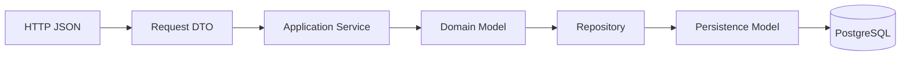
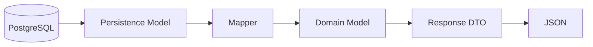
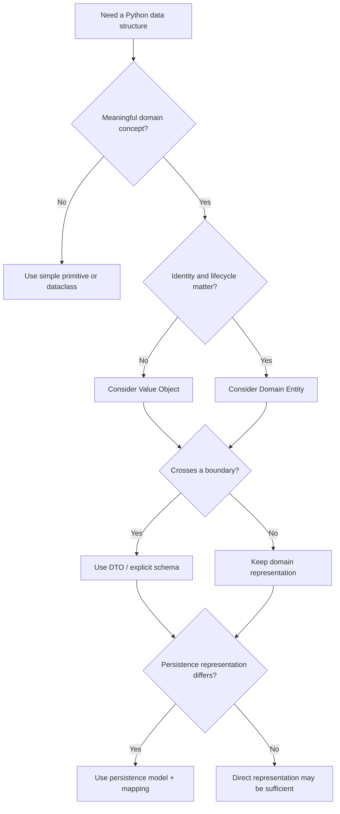

# README

## Overview

This section covers **dataclasses and data modeling patterns for Python backend systems**.

The goal is to move from using Python classes as simple containers toward deliberately modeling application and domain data.

The section progresses from the mechanics of dataclasses to increasingly architectural concepts:

```text
Dataclass Mechanics
       ↓
Fields and Defaults
       ↓
Initialization / Immutability / Slots
       ↓
Inheritance / Serialization
       ↓
Value Objects
       ↓
DTOs
       ↓
Domain Models
       ↓
Application Data Modeling Patterns
```

The emphasis is on understanding **when a data structure should be a dataclass, what semantics it should expose, and how it should interact with APIs, databases, messaging systems, and domain logic**.

---

## Why Data Modeling Matters

Backend applications continuously transform data between representations:

```text
HTTP JSON
   ↓
Request Model
   ↓
Application Command
   ↓
Domain Model
   ↓
Persistence Model
   ↓
PostgreSQL
```

The same business concept can have different representations at different boundaries.

For example, an order may appear as:

```text
CreateOrderRequest
Order
OrderItem
Money
OrderRecord
OrderResponse
OrderCreatedEvent
```

These objects may contain overlapping data while serving completely different purposes.

Good data modeling makes those responsibilities explicit.

Poor data modeling tends to produce:

- primitive obsession
- giant mutable dictionaries
- leaking ORM models
- duplicated validation
- accidental API contracts
- unclear ownership of business rules
- excessive coupling between layers

---

## Section Structure

| File | Topic | Primary Concern |
|---|---|---|
| `01- Dataclasses.md` | Dataclasses | Core dataclass mechanics and configuration |
| `02- Fields and Defaults.md` | Fields and Defaults | Field behavior, defaults, factories, and metadata |
| `03- Post Initialization.md` | Post Initialization | Construction-time validation and derived state |
| `04- Frozen Dataclasses.md` | Frozen Dataclasses | Immutability and value semantics |
| `05- Slots.md` | Slots | Memory efficiency and attribute layout |
| `06- Dataclass Inheritance.md` | Dataclass Inheritance | Inheritance, MRO, fields, and initialization |
| `07- Asdict and Astuple.md` | Asdict and Astuple | Dataclass conversion and serialization boundaries |
| `08- Data Modeling Patterns.md` | Data Modeling Patterns | Common backend and domain modeling patterns |
| `09- Value Objects.md` | Value Objects | Value semantics, invariants, and immutable domain concepts |
| `10- DTO.md` | DTO | Data transfer across application and service boundaries |
| `11- Domain Models.md` | Domain Models | Entities, invariants, behavior, aggregates, and domain architecture |

---

## Learning Path

The files should be approached in sequence because later modeling patterns depend on the mechanics established earlier.

### Dataclass Foundations

Start with:

```text
01- Dataclasses.md
02- Fields and Defaults.md
03- Post Initialization.md
```

These establish:

- generated methods
- fields
- defaults
- factories
- initialization
- validation
- derived fields
- `InitVar`
- metadata

The goal is to understand exactly what Python generates and how dataclass configuration changes runtime behavior.

---

### Immutability and Memory

Continue with:

```text
04- Frozen Dataclasses.md
05- Slots.md
```

These cover two important production concerns:

```text
frozen=True
    → object semantics

slots=True
    → object representation and memory
```

They should not be confused.

A frozen object is not necessarily memory-efficient, and a slotted object is not necessarily immutable.

A common production pattern for small immutable value objects is:

```python
from dataclasses import dataclass


@dataclass(frozen=True, slots=True)
class CurrencyCode:
    value: str
```

---

### Inheritance and Conversion

Then study:

```text
06- Dataclass Inheritance.md
07- Asdict and Astuple.md
```

These topics become important when dataclasses interact with:

- inheritance
- serializers
- nested structures
- API boundaries
- persistence
- event payloads

The important architectural lesson is that dataclass structure should not automatically become an external contract.

---

### Data Modeling Patterns

Next:

```text
08- Data Modeling Patterns.md
```

This introduces the broader design space:

```text
Primitive
   ↓
Dataclass
   ↓
Value Object
   ↓
DTO
   ↓
Entity
   ↓
Aggregate
```

Not every application needs every level.

The purpose is to understand the tradeoff between:

- simplicity
- correctness
- encapsulation
- maintainability
- performance
- architectural coupling

---

### Domain-Oriented Modeling

Finish with:

```text
09- Value Objects.md
10- DTO.md
11- Domain Models.md
```

These files move from Python language mechanics into backend architecture.

The distinction between the concepts is critical:

```text
Value Object
→ What does this value mean?

DTO
→ What data crosses this boundary?

Domain Model
→ What business rules govern this concept?
```

---

## Core Modeling Concepts

### Dataclass

A dataclass reduces boilerplate for classes whose primary purpose involves structured state.

```python
from dataclasses import dataclass


@dataclass
class User:
    user_id: int
    email: str
```

It can generate methods such as:

- `__init__`
- `__repr__`
- `__eq__`

depending on configuration.

Dataclasses are a language-level modeling mechanism, not an architectural pattern by themselves.

---

### Value Object

A value object is defined by its value rather than independent identity.

```python
@dataclass(frozen=True, slots=True)
class Money:
    amount_cents: int
    currency: str
```

Two equal `Money` objects represent the same value.

Value objects are useful for concepts with meaningful:

- invariants
- normalization
- equality
- behavior
- immutable semantics

---

### DTO

A DTO represents data crossing a boundary.

```python
@dataclass(frozen=True, slots=True)
class UserResponse:
    id: int
    email: str
    display_name: str
```

DTOs are commonly used for:

- HTTP APIs
- application commands
- query projections
- Kafka messages
- gRPC boundaries
- background jobs

The DTO's structure should represent the boundary contract rather than internal domain structure.

---

### Domain Model

A domain model represents business concepts and rules.

```python
@dataclass
class Order:
    order_id: int
    status: OrderStatus

    def cancel(self) -> None:
        if self.status == OrderStatus.SHIPPED:
            raise InvalidOrderTransition(
                "shipped orders cannot be cancelled"
            )

        self.status = OrderStatus.CANCELLED
```

The important distinction is behavior and invariants.

The model is not merely carrying data.

---

## Domain Modeling Hierarchy

A useful mental model is:

```text
                 Application
                      │
          ┌───────────┴───────────┐
          │                       │
        DTOs                 Commands
          │                       │
          └───────────┬───────────┘
                      ↓
                Domain Model
                      │
          ┌───────────┴───────────┐
          │                       │
       Entities             Value Objects
          │                       │
          └───────────┬───────────┘
                      ↓
                Infrastructure
          ┌───────────┼───────────┐
          ↓           ↓           ↓
      PostgreSQL    Redis       Kafka
```

This is not a mandatory architecture.

It is a way to reason about responsibility and dependency direction.

---

## Choosing the Right Model

Use the simplest model that provides the required semantics.

| Requirement | Suitable Model |
|---|---|
| Simple grouped data | Dataclass |
| Immutable constrained value | Value object |
| HTTP request/response | DTO / Pydantic model |
| Business identity and lifecycle | Entity |
| Related objects sharing consistency rules | Aggregate |
| Cross-object domain behavior | Domain service |
| Database representation | Persistence model |
| Distributed message | Event DTO / schema |

Avoid introducing abstractions simply because they are available.

---

## DTO → Domain → Persistence

A common backend data flow is:



The reverse flow may be:



Each transformation creates an explicit boundary.

---

## Dataclasses and FastAPI

FastAPI commonly uses Pydantic models at the HTTP boundary.

```python
from pydantic import BaseModel, EmailStr


class CreateUserRequest(BaseModel):
    email: EmailStr
    display_name: str
```

The application can then construct domain objects:

```python
email = EmailAddress(request.email)
```

A useful separation is:

```text
FastAPI / Pydantic
→ transport validation

Dataclass value objects
→ domain invariants

Domain entities
→ business behavior
```

---

## Dataclasses and Django

Django models are primarily persistence-oriented.

A domain-oriented application may separate:

```text
Django ORM Model
      ↓
Mapper
      ↓
Domain Entity
```

This separation becomes increasingly valuable when:

- business rules are complex
- multiple interfaces use the same domain
- persistence structure differs from domain structure
- testing domain behavior independently is important

For simple CRUD applications, the Django model may be sufficient.

---

## Dataclasses and PostgreSQL

Domain models do not need to mirror PostgreSQL tables.

For example:

```python
@dataclass
class Money:
    amount_cents: int
    currency: str
```

can map to:

```text
orders
├── total_amount_cents
└── total_currency
```

This allows the database schema and domain representation to evolve independently.

Critical invariants should still be enforced at the database layer where appropriate.

---

## Dataclasses and Redis

Dataclasses can represent:

- cache entries
- cache-key components
- serialized projections
- request context

Example:

```python
@dataclass(frozen=True, slots=True)
class UserCacheEntry:
    user_id: int
    display_name: str
    role: str
```

The actual Redis serialization should remain explicit.

Do not make Redis client behavior part of the dataclass itself.

---

## Dataclasses and Kafka

Dataclasses are useful for internal event representations:

```python
@dataclass(frozen=True, slots=True)
class OrderCreated:
    order_id: int
    customer_id: int
    amount_cents: int
```

But a Kafka event is a distributed contract.

The production boundary should be:

```text
Domain Event
     ↓
Event DTO
     ↓
Schema
     ↓
Serializer
     ↓
Kafka
```

Avoid publishing Python-specific object representations as durable service contracts.

---

## Dataclasses and Celery

Celery tasks should generally receive explicit, serializable data.

Prefer:

```python
@celery_app.task
def process_order(order_id: int) -> None:
    ...
```

rather than passing:

```python
Order(...)
```

through the queue.

The worker can reconstruct the required domain state from durable storage.

This improves:

- retry behavior
- compatibility
- observability
- serialization safety
- deployment independence

---

## Validation Strategy

Validation should happen at multiple appropriate layers.

```text
External Input
      ↓
Transport Validation
      ↓
DTO
      ↓
Domain Invariants
      ↓
Application Rules
      ↓
Persistence Constraints
```

Examples:

| Layer | Example |
|---|---|
| Transport | JSON field exists |
| Type | `customer_id` is an integer |
| Value Object | Currency code is valid |
| Domain | Order cannot ship before payment |
| Authorization | User may modify this order |
| Database | Foreign key exists |
| Concurrency | Version has not changed |

Do not attempt to place all validation inside a single model.

---

## Immutability Strategy

A practical rule is:

```text
Value Object
→ Usually immutable

DTO
→ Usually immutable

Entity
→ Controlled mutation is often appropriate

Persistence Model
→ Framework-dependent
```

For example:

```python
@dataclass(frozen=True, slots=True)
class Money:
    amount_cents: int
    currency: str
```

while:

```python
@dataclass
class Order:
    order_id: int
    status: OrderStatus

    def pay(self) -> None:
        self.status = OrderStatus.PAID
```

The distinction reflects different semantics rather than personal style.

---

## Serialization Strategy

Do not assume:

```python
asdict(model)
```

is an appropriate public serialization strategy.

For internal transformations it can be useful.

For public contracts, prefer explicit serialization:

```python
def to_payload(
    response: UserResponse,
) -> dict[str, object]:
    return {
        "id": response.id,
        "email": response.email,
        "display_name": response.display_name,
    }
```

This prevents internal model changes from silently changing external contracts.

---

## Performance Considerations

Dataclass objects have allocation and memory costs.

For ordinary backend requests, those costs are usually much smaller than:

- database latency
- network latency
- JSON serialization
- external API calls

For high-volume workloads, consider:

- `slots=True`
- pagination
- streaming
- database projections
- batching
- avoiding unnecessary model conversions
- profiling allocations

Do not remove useful domain boundaries based on unmeasured performance assumptions.

---

## Memory Considerations

Large numbers of small objects can produce significant memory usage.

For example:

```text
10,000 objects
→ manageable

10,000,000 objects
→ object overhead becomes significant
```

`slots=True` can reduce per-instance overhead.

However, the correct solution may instead be:

- process data in chunks
- use generators
- query only required columns
- avoid retaining unnecessary objects
- stream results

Data modeling and data-processing architecture should be considered together.

---

## Concurrency Considerations

Immutable dataclasses are easier to share across concurrent operations.

```python
@dataclass(frozen=True, slots=True)
class RequestContext:
    request_id: str
    tenant_id: str
```

However:

```text
immutable object
≠
thread-safe application
≠
transaction-safe database operation
```

Domain entities involved in concurrent updates still require persistence-level coordination such as:

- optimistic locking
- row locks
- unique constraints
- transactions
- idempotency keys

---

## Security Considerations

Explicit models reduce accidental data exposure.

Avoid:

```python
return user.__dict__
```

or indiscriminately serializing domain objects.

Response DTOs should contain only fields intentionally exposed.

Be especially careful with:

- password hashes
- access tokens
- API keys
- PII
- tenant identifiers
- internal authorization metadata
- infrastructure details

A model abstraction is not an authorization mechanism.

---

## Reliability Considerations

Good data modeling should make invalid states harder to represent.

For example:

```text
Primitive:
amount = -500

Value Object:
Money(-500, "USD")
       ↓
Rejected immediately
```

Similarly:

```text
Order
  ↓
ship()
  ↓
Validate current state
  ↓
Reject invalid transition
```

This reduces the number of invalid states that downstream code must handle.

---

## Distributed Systems Considerations

Model boundaries become particularly important when data crosses services.

```text
Service A
  │
  ├── Domain Model
  │
  ▼
Event / API Contract
  │
  ▼
Service B
  │
  └── Domain Model
```

Service B should not depend on Service A's internal Python classes.

Each service should own:

- its domain model
- its internal invariants
- its persistence representation

Shared contracts should be explicit and versioned.

---

## Schema Evolution

When DTOs or events cross service boundaries, changes must account for independent deployments.

A safer evolution pattern is:

```text
Producer adds optional field
        ↓
Consumers become tolerant
        ↓
Producer begins populating field
        ↓
Monitor adoption
        ↓
Retire old representation later
```

Avoid assuming all services deploy simultaneously.

This is especially important for:

- Kafka
- REST APIs
- gRPC
- Celery
- SQS
- EventBridge

---

## Testing Strategy

Data models should be tested at the appropriate level.

### Unit Tests

Test:

- invariants
- state transitions
- normalization
- equality
- immutability
- domain behavior

### Mapping Tests

Test:

```text
DTO ↔ Domain
Domain ↔ Persistence
Domain → Event
Domain → Response
```

### Integration Tests

Test:

- PostgreSQL constraints
- transactions
- optimistic locking
- serialization
- repository behavior
- messaging integration

### Contract Tests

Test the actual external representation for:

- REST
- gRPC
- Kafka
- other service boundaries

---

## Recommended Project Organization

A moderately complex Python backend can organize models by responsibility:

```text
app/
├── api/
│   ├── requests/
│   └── responses/
│
├── application/
│   ├── commands/
│   ├── queries/
│   └── services/
│
├── domain/
│   ├── entities/
│   ├── value_objects/
│   ├── events/
│   ├── services/
│   └── exceptions/
│
├── infrastructure/
│   ├── database/
│   ├── cache/
│   └── messaging/
│
└── mappings/
```

For a small service, this can be simplified:

```text
app/
├── models.py
├── schemas.py
├── services.py
└── repositories.py
```

The directory structure should follow actual complexity rather than architectural fashion.

---

## Production Design Principles

### Prefer Explicit Boundaries

Make transformations visible:

```text
Request DTO
    ↓
Domain
    ↓
Persistence
```

rather than allowing implicit coupling.

### Keep Domain Logic Framework-Independent

Business rules should not require:

```python
from fastapi import HTTPException
```

or:

```python
from django.db import models
```

inside the core domain.

### Protect Invariants

Use:

- constructors
- value objects
- domain methods
- database constraints
- transactions
- concurrency controls

as appropriate.

### Keep Contracts Stable

Internal model changes should not accidentally change:

- REST responses
- gRPC messages
- Kafka events
- cache formats
- durable records

### Avoid Over-Engineering

A simple CRUD service does not automatically need:

```text
DDD
Aggregates
Domain Services
Repositories
Factories
Event buses
```

Introduce abstractions when they solve actual problems.

---

## Common Mistakes

| Mistake | Why It Happens | Better Approach |
|---|---|---|
| ORM model becomes API contract | Convenience | Explicit response DTO |
| One DTO used everywhere | Avoiding duplication | Separate by responsibility |
| Every primitive becomes a class | Over-modeling | Model meaningful concepts |
| Domain calls database | Convenience | Application/service + repository |
| DTO contains business logic | Responsibilities mixed | Keep domain behavior in domain |
| `frozen=True` assumed deeply immutable | Misunderstanding | Use immutable nested values |
| `asdict()` used as API serializer | Convenience | Explicit boundary serialization |
| ORM objects sent through Celery | Easy implementation | Send stable identifiers/data |
| Python objects published to Kafka | Serialization convenience | Use explicit event schemas |
| Domain equality assumed to be dataclass equality | Default behavior | Define identity semantics explicitly |

---

## Architecture Tradeoffs

| Approach | Simplicity | Domain Isolation | Mapping Cost | Best Fit |
|---|---:|---:|---:|---|
| ORM everywhere | High | Low | Low | Simple CRUD |
| Dataclasses + services | Medium | Medium | Medium | Moderate applications |
| DTO + domain + persistence models | Lower | High | Higher | Complex backends |
| Rich domain model | Lower | Very High | Higher | Complex business domains |
| Event-driven domain architecture | Lowest | Very High | High | Distributed workflows |

There is no universally correct architecture.

The correct level of modeling depends on:

- business complexity
- team size
- service lifetime
- number of interfaces
- number of integrations
- rate of domain change
- operational requirements

---

## Senior-Level Design Questions

When designing a model, ask:

1. **Who owns this data?**
2. **What does this object represent?**
3. **Does identity matter?**
4. **What invariants must always hold?**
5. **Should the object be mutable?**
6. **Does it cross a boundary?**
7. **Who owns serialization?**
8. **Does persistence need a separate representation?**
9. **What happens during concurrent updates?**
10. **How will the model evolve?**
11. **Could this abstraction expose sensitive data?**
12. **Is the complexity justified by the domain?**

These questions are more valuable than simply asking whether a class should be a dataclass.

---

## Practical Decision Tree



---

## Production Checklist

Before finalizing a data model, verify:

- [ ] The model has a clearly defined responsibility.
- [ ] Identity versus value semantics are explicit.
- [ ] Domain invariants are enforced at the appropriate layer.
- [ ] Mutable and immutable state are deliberate choices.
- [ ] Nested mutability has been considered.
- [ ] External contracts do not accidentally expose internal fields.
- [ ] Serialization is explicit where contract stability matters.
- [ ] ORM and persistence concerns are not leaking unnecessarily into the domain.
- [ ] Database constraints protect critical invariants.
- [ ] Concurrent updates have an appropriate strategy.
- [ ] Distributed events and APIs can evolve safely.
- [ ] Sensitive fields are excluded from logs and responses.
- [ ] Large collections do not create unnecessary memory pressure.
- [ ] Domain behavior can be tested without infrastructure where practical.
- [ ] Integration and contract tests cover external boundaries.
- [ ] The abstraction level is justified by actual domain complexity.

---

## Key Takeaways

- **Dataclasses provide the Python mechanics for structured data, but good data modeling requires explicit semantics, ownership, invariants, and boundaries.**
- **Value objects, DTOs, entities, persistence models, and domain models solve different problems** and should not be collapsed into one generic model without a clear reason.
- **Strong backend architectures separate transport, domain, and persistence representations when their responsibilities differ**, allowing APIs, databases, Kafka, Redis, and internal business logic to evolve independently.
- **Immutability, validation, type safety, database constraints, transactions, and concurrency controls work together** to make invalid states harder to create and maintain.
- **Use the simplest modeling strategy that safely represents the domain**; additional abstractions should earn their complexity through correctness, maintainability, or operational value.