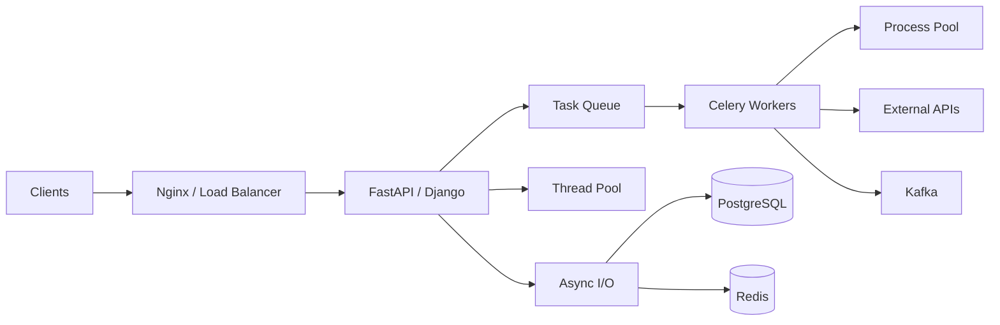

# README

## Overview

This section covers **Python concurrency and parallelism**, with a focus on how backend applications execute multiple units of work efficiently and safely.

Concurrency is not simply "doing multiple things at once." It is about structuring a program so multiple operations can make progress during overlapping periods of execution.

Parallelism is about executing work simultaneously across independent execution resources.

The distinction matters because Python provides several execution models:

```text
Concurrency
├── asyncio
├── Threads
└── Task coordination

Parallelism
├── Processes
├── Multiple CPU cores
└── Distributed workers

Shared execution concerns
├── Synchronization
├── Race conditions
├── Deadlocks
├── Cancellation
└── Resource limits
```

The section progresses from concurrency fundamentals to Python's execution model, synchronization, `asyncio`, threads, processes, and production concurrency patterns.

---

## Why Concurrency Matters in Backend Systems

Backend applications frequently spend time waiting for external resources:

```text
HTTP request
    ↓
PostgreSQL query ────── wait
    ↓
Redis lookup ────────── wait
    ↓
External API ────────── wait
    ↓
Response
```

If one execution unit blocks during every wait, application throughput can suffer.

Concurrency allows other work to make progress while one operation is waiting:

```text
Request A → PostgreSQL ───────── wait ───────── result
Request B → Redis → result
Request C → HTTP ───── wait ───── result
Request D → PostgreSQL → result
```

This is especially important for:

- FastAPI
- Django
- HTTP clients
- database access
- Redis
- Kafka consumers
- Celery workers
- background jobs
- high-throughput APIs

---

## Concurrency vs Parallelism

These concepts should not be treated as synonyms.

| Concept | Meaning | Typical Python Mechanism |
|---|---|---|
| Concurrency | Multiple tasks make progress during overlapping periods | `asyncio`, threads |
| Parallelism | Multiple tasks execute simultaneously | Processes, multiple workers |
| Asynchronous execution | Work can suspend while waiting | `asyncio` |
| Multithreading | Multiple threads execute within a process | `threading`, thread pools |
| Multiprocessing | Multiple processes execute independently | `multiprocessing`, process pools |
| Distributed execution | Work executes across machines | Celery, Kafka consumers, Kubernetes |

A useful mental model is:

```text
Concurrency
→ How many tasks can be in progress?

Parallelism
→ How many tasks can execute simultaneously?
```

---

## I/O-Bound vs CPU-Bound Work

Choosing a concurrency mechanism starts with understanding the workload.

### I/O-Bound Work

The program spends significant time waiting for:

- PostgreSQL
- Redis
- HTTP APIs
- filesystem operations
- network sockets
- Kafka
- AWS services

Example:

```text
CPU ── work ── wait ─────────── work ── wait ── work
```

Concurrency can significantly improve throughput.

### CPU-Bound Work

The program spends most of its time performing computation:

- compression
- image processing
- cryptographic calculations
- numerical computation
- large transformations
- CPU-heavy parsing

Example:

```text
CPU ───────────────────────────────────── work
```

Threads may not provide the expected parallel speedup for pure Python CPU-bound code under the traditional CPython GIL model. Processes or native code that releases the GIL may be more appropriate.

---

## The Python Execution Model

Concurrency decisions depend on how Python executes code.

In CPython, a Python process typically contains:

```text
Process
└── Python interpreter
    ├── Threads
    │   ├── Thread A
    │   ├── Thread B
    │   └── Thread C
    └── Python objects / runtime state
```

The **Global Interpreter Lock (GIL)** historically means that only one thread executes Python bytecode at a time within a standard CPython interpreter.

This does not mean Python threads are useless.

Threads can still be highly effective for I/O-bound workloads because a thread can wait on I/O while another thread executes.

Modern CPython also has optional free-threaded builds in supported Python versions, so the traditional GIL model should not be treated as an immutable property of every CPython deployment. Production architecture should be based on the actual Python build and dependencies being deployed.

---

## Concurrency Models in Python

The major approaches covered in this section are:

```text
Python Concurrency
│
├── asyncio
│   └── Cooperative concurrency
│
├── Threads
│   └── Concurrent execution within a process
│
├── Processes
│   └── Independent interpreter processes
│
└── Distributed Workers
    └── Celery / Kafka / Kubernetes
```

Each model has different:

- scheduling behavior
- memory characteristics
- failure modes
- scaling properties
- debugging complexity
- operational costs

---

## Cooperative Concurrency

`asyncio` uses cooperative scheduling.

An asynchronous task voluntarily gives control back to the event loop when it reaches an awaitable operation.

Conceptually:

```text
Task A
  ↓
await I/O
  ↓
Event Loop
  ↓
Task B
  ↓
await I/O
  ↓
Event Loop
  ↓
Task C
```

The event loop can continue scheduling other tasks while Task A waits.

---

## Event Loop

An event loop coordinates asynchronous tasks.

```text
                 ┌───────────────┐
                 │   Event Loop  │
                 └───────┬───────┘
                         │
          ┌──────────────┼──────────────┐
          ↓              ↓              ↓
       Task A          Task B          Task C
          │              │              │
       await I/O      await I/O       CPU work
          │              │
          └──────┬───────┘
                 ↓
           Ready to resume
```

The event loop is effective when tasks frequently perform non-blocking I/O.

A blocking operation inside the event loop can prevent other tasks from making progress.

---

## Basic Async Concurrency

```python
import asyncio


async def fetch_data(name: str, delay: float) -> str:
    await asyncio.sleep(delay)
    return f"{name} complete"


async def main() -> None:
    results = await asyncio.gather(
        fetch_data("database", 1.0),
        fetch_data("redis", 0.5),
        fetch_data("external-api", 0.8),
    )

    print(results)


asyncio.run(main())
```

The operations overlap rather than executing strictly one after another.

This pattern is useful when the operations are independent and use asynchronous APIs.

---

## Sequential vs Concurrent Execution

Sequential:

```python
async def sequential() -> None:
    first = await fetch_data("first", 1.0)
    second = await fetch_data("second", 1.0)

    print(first, second)
```

Approximate elapsed time:

```text
1s + 1s = 2s
```

Concurrent:

```python
async def concurrent() -> None:
    first, second = await asyncio.gather(
        fetch_data("first", 1.0),
        fetch_data("second", 1.0),
    )

    print(first, second)
```

Approximate elapsed time:

```text
max(1s, 1s) = 1s
```

Actual production latency also depends on:

- connection pools
- network latency
- server capacity
- scheduling
- retries
- contention

---

## Threads

Threads provide concurrent execution within a process.

```python
from concurrent.futures import ThreadPoolExecutor


def fetch_resource(url: str) -> str:
    ...


with ThreadPoolExecutor(max_workers=8) as executor:
    results = list(
        executor.map(
            fetch_resource,
            urls,
        )
    )
```

Threads are often useful when:

- the library is synchronous
- the workload is I/O-bound
- converting an existing synchronous codebase to `asyncio` is not justified

They are particularly useful for integrating synchronous libraries into otherwise concurrent applications.

---

## Processes

Processes provide separate Python interpreter processes.

```python
from concurrent.futures import ProcessPoolExecutor


def calculate(value: int) -> int:
    return value * value


with ProcessPoolExecutor() as executor:
    results = list(
        executor.map(calculate, values)
    )
```

Processes are useful for CPU-bound work because separate processes can execute on separate CPU cores.

Tradeoffs include:

- process startup cost
- memory duplication
- inter-process communication
- serialization
- worker lifecycle management

---

## Decision Matrix

| Workload | Preferred Approach |
|---|---|
| Async network I/O | `asyncio` |
| Existing synchronous I/O library | Threads |
| CPU-heavy Python computation | Processes |
| Independent background jobs | Celery / worker processes |
| Streaming events | Async or threaded consumers |
| Distributed workload | Celery / Kafka / Kubernetes |
| Small synchronous CRUD service | Synchronous execution may be sufficient |

The correct choice depends on workload characteristics rather than framework preference.

---

## Blocking Code in Async Applications

A common production mistake is calling blocking code from an event loop.

Bad:

```python
async def endpoint() -> dict[str, str]:
    result = blocking_database_call()
    return {"result": result}
```

If `blocking_database_call()` blocks for 500 ms, it can prevent other tasks on that event loop from progressing.

Better options include:

- use an asynchronous client
- move blocking work to a thread
- move CPU-heavy work to a process
- use a background worker

---

## Async and FastAPI

FastAPI commonly benefits from asynchronous execution for I/O-heavy workloads.

Example:

```python
from fastapi import FastAPI

app = FastAPI()


@app.get("/profile")
async def profile() -> dict[str, str]:
    profile = await profile_client.fetch()
    return profile
```

The important requirement is that the downstream client must actually provide non-blocking asynchronous behavior.

Changing:

```python
def endpoint()
```

to:

```python
async def endpoint()
```

does not automatically make blocking code asynchronous.

---

## Async and Django

Django supports asynchronous request handling and asynchronous views, but the complete request path still depends on the libraries and operations used.

An async view that performs blocking database or filesystem operations can still block execution.

The same principle applies:

```text
async endpoint
    ↓
async dependency
    ↓
async database/network operation
```

Async architecture only provides its intended benefits when blocking work is controlled.

---

## Threads and the GIL

The GIL is often oversimplified as:

> "Python cannot use multiple threads."

That statement is inaccurate.

Threads can:

- overlap I/O
- wait on network operations
- use libraries that release the GIL
- integrate with synchronous systems

For pure Python CPU-bound work, traditional GIL behavior prevents multiple threads from executing Python bytecode simultaneously within the same interpreter.

Use processes or appropriate native implementations when CPU parallelism is required.

---

## Race Conditions

A race condition occurs when correctness depends on the timing or ordering of concurrent operations.

Example:

```python
counter += 1
```

Conceptually involves:

```text
read counter
    ↓
add 1
    ↓
write counter
```

Two concurrent workers can interleave these operations.

```text
Worker A → read 10
Worker B → read 10
Worker A → write 11
Worker B → write 11
```

Expected:

```text
12
```

Actual:

```text
11
```

The general lesson is that apparently simple operations may involve multiple steps.

---

## Shared Mutable State

Shared mutable state increases concurrency complexity.

Example:

```python
class Metrics:
    def __init__(self) -> None:
        self.count = 0

    def increment(self) -> None:
        self.count += 1
```

If multiple threads modify the same state, synchronization may be required.

Safer designs often prefer:

- immutable data
- message passing
- isolated state
- database atomic operations
- synchronization primitives

---

## Locks

A lock protects a critical section.

```python
import threading


class Counter:
    def __init__(self) -> None:
        self._value = 0
        self._lock = threading.Lock()

    def increment(self) -> None:
        with self._lock:
            self._value += 1
```

Only one thread at a time can enter the protected section.

Locks provide correctness but introduce:

- contention
- waiting
- potential deadlocks
- reduced parallelism

Use the smallest appropriate critical section.

---

## Synchronization Primitives

Python provides several synchronization mechanisms.

| Primitive | Typical Use |
|---|---|
| `Lock` | Mutual exclusion |
| `RLock` | Reentrant mutual exclusion |
| `Semaphore` | Limit concurrent access |
| `Event` | Signal between threads |
| `Condition` | Coordinate state changes |
| `Queue` | Thread-safe producer/consumer communication |
| `asyncio.Lock` | Mutual exclusion between async tasks |
| `asyncio.Semaphore` | Limit async concurrency |

Choose based on the coordination problem rather than using locks everywhere.

---

## Semaphores and Resource Limits

A semaphore can limit concurrent access to a resource.

For example, an API client may allow only 20 concurrent requests:

```python
import asyncio


semaphore = asyncio.Semaphore(20)


async def fetch(url: str) -> str:
    async with semaphore:
        return await client.get(url)
```

This prevents unbounded concurrency from overwhelming:

- downstream services
- connection pools
- CPU
- memory
- file descriptors

Concurrency limits are an important production control.

---

## Queues

Producer-consumer designs reduce direct coordination between workers.

```text
Producer
   ↓
Queue
   ↓
Worker 1
Worker 2
Worker 3
```

Python's `queue.Queue` is useful for threads.

`asyncio.Queue` is useful for asynchronous tasks.

Distributed systems can use:

- Kafka
- SQS
- RabbitMQ
- Celery brokers

The queue becomes a form of backpressure and workload buffering.

---

## Backpressure

Backpressure occurs when a producer must slow down because consumers cannot keep up.

Without backpressure:

```text
Producer
  ↓
Unlimited tasks
  ↓
Memory exhaustion
  ↓
Process failure
```

With bounded concurrency:

```text
Producer
  ↓
Bounded queue
  ↓
Workers
  ↓
Controlled throughput
```

Production systems should generally have explicit limits on:

- queue depth
- concurrent tasks
- request rates
- connection counts
- batch sizes

---

## Cancellation

Asynchronous tasks may need to stop before completion.

Examples:

- client disconnected
- request timeout
- deployment shutdown
- upstream cancellation
- application termination

Async code should treat cancellation as a normal control-flow event.

Do not blindly catch every exception:

```python
try:
    await operation()
except Exception:
    ...
```

without understanding cancellation semantics.

Cleanup should use appropriate `try/finally` logic while allowing cancellation to propagate when required.

---

## Timeouts

Every external operation should have a bounded execution time where practical.

Conceptually:

```text
Request
   ↓
Database
   ↓
Timeout
   ↓
Cancel / Fail
   ↓
Release resources
```

Timeouts prevent a small number of stalled operations from consuming all available concurrency.

Apply timeouts at appropriate layers:

- HTTP clients
- database operations
- Redis operations
- Kafka operations
- Celery tasks
- application requests

Avoid unlimited waits in production services.

---

## Deadlocks

A deadlock occurs when concurrent tasks wait indefinitely for each other.

Example:

```text
Thread A
  holds Lock 1
  waits for Lock 2

Thread B
  holds Lock 2
  waits for Lock 1
```

Neither can proceed.

Avoid deadlocks through:

- consistent lock ordering
- minimizing lock scope
- avoiding nested locks
- timeouts where appropriate
- reducing shared mutable state

---

## Asyncio Deadlocks and Starvation

Async applications can suffer from logical deadlocks or starvation even without traditional thread locks.

Examples include:

- tasks waiting on each other
- unbounded CPU work blocking the event loop
- tasks never yielding
- incorrect queue coordination

A task performing long synchronous CPU work inside an event loop can starve every other task on that loop.

---

## Thread Pools

Thread pools are useful for bounded execution of blocking operations.

```python
import asyncio


async def call_legacy_api(url: str) -> str:
    return await asyncio.to_thread(
        legacy_client.fetch,
        url,
    )
```

This allows blocking synchronous work to execute in a worker thread rather than directly blocking the event loop.

The thread pool should still be bounded appropriately.

---

## Process Pools

Process pools are useful for CPU-heavy functions.

```python
import asyncio
from concurrent.futures import ProcessPoolExecutor


def expensive_calculation(value: int) -> int:
    ...


async def main() -> None:
    loop = asyncio.get_running_loop()

    with ProcessPoolExecutor() as pool:
        result = await loop.run_in_executor(
            pool,
            expensive_calculation,
            10,
        )

        print(result)
```

Process pools have serialization and process-management overhead, so they are not automatically faster for small tasks.

---

## Serialization Cost

Moving data between processes requires communication.

Conceptually:

```text
Process A
   ↓
Serialize
   ↓
IPC
   ↓
Deserialize
   ↓
Process B
```

Large Python objects can make multiprocessing expensive.

Prefer:

- compact inputs
- coarse-grained tasks
- minimal data transfer
- shared external storage where appropriate

---

## Concurrency and Databases

Database concurrency requires more than Python synchronization.

Suppose two API requests update the same order:

```text
Request A ─┐
           ├── PostgreSQL
Request B ─┘
```

A Python `Lock` inside one application process does not protect against:

- another API instance
- another Kubernetes pod
- another worker
- another service

Database concurrency control may require:

- transactions
- row locks
- optimistic locking
- unique constraints
- atomic updates

---

## Distributed Concurrency

Once an application is horizontally scaled:

```text
Load Balancer
   ├── Pod A
   ├── Pod B
   └── Pod C
```

process-local synchronization is no longer sufficient for shared business state.

A lock in Pod A cannot automatically coordinate with Pod B.

Distributed coordination may use:

- PostgreSQL transactions
- database locks
- Redis-based coordination
- Kafka partition ordering
- queue serialization
- idempotency keys

Choose the simplest mechanism that satisfies the consistency requirement.

---

## Concurrency and Redis

Redis can provide atomic operations useful for coordination.

For example:

```text
INCR
SET NX
Lua scripts
distributed counters
rate limiting
```

However, distributed locks are difficult to implement correctly.

Before introducing a Redis lock, consider whether the problem can instead be solved using:

- database constraints
- atomic state transitions
- queue partitioning
- idempotency

Prefer correctness over clever distributed synchronization.

---

## Concurrency and Kafka

Kafka provides useful ordering semantics within a partition.

A common pattern is:

```text
Events
  ↓
Partition by order_id
  ↓
Consumer
  ↓
Sequential processing for one key
```

This can simplify concurrency for entity-specific workflows.

However:

```text
same key → ordered within partition
```

does not mean the entire Kafka system is globally ordered.

Consumers still need to handle:

- retries
- duplicates
- rebalances
- failures
- lag

---

## Concurrency and Celery

Celery provides distributed background execution.

A common architecture is:

```text
API
 ↓
Queue / Broker
 ↓
Celery Workers
 ├── Worker 1
 ├── Worker 2
 └── Worker 3
 ↓
PostgreSQL / Redis / External APIs
```

Concurrency can be controlled through worker configuration and task design.

Important production concerns include:

- task idempotency
- retries
- visibility timeouts
- worker concurrency
- queue depth
- task timeouts
- resource limits

---

## Concurrency Limits

More concurrency is not always better.

Suppose:

```text
Database pool = 20 connections
Application concurrency = 500
```

If all 500 tasks attempt database access simultaneously, the database becomes the bottleneck.

A better architecture aligns limits:

```text
Requests
   ↓
Concurrency limit
   ↓
Application workers
   ↓
DB pool limit
   ↓
PostgreSQL capacity
```

Tune concurrency against downstream capacity.

---

## Connection Pools

Connection pools are themselves concurrency controls.

For example:

```text
100 concurrent requests
       ↓
DB pool: 20
       ↓
20 active database operations
80 waiting
```

Increasing application concurrency without increasing database capacity can increase latency rather than throughput.

Monitor:

- pool utilization
- wait time
- query latency
- database CPU
- active connections

---

## Concurrency and HTTP Clients

An HTTP client should typically have:

- connection limits
- request timeouts
- retry policies
- cancellation handling
- concurrency limits

A poorly controlled async client can create hundreds or thousands of simultaneous outbound requests.

This can overload:

- the downstream service
- local sockets
- DNS
- connection pools
- NAT gateways
- memory

---

## Concurrency and Nginx

Nginx may handle many simultaneous client connections efficiently, but application capacity remains bounded.

A typical flow is:

```text
Internet
   ↓
Nginx / Load Balancer
   ↓
Application Pods
   ↓
Worker Concurrency
   ↓
Database / Cache
```

The system's effective throughput is constrained by its bottleneck.

Concurrency should therefore be designed across the entire request path rather than only inside Python.

---

## Kubernetes and Concurrency

Kubernetes provides another scaling dimension:

```text
Pod 1
Pod 2
Pod 3
...
Pod N
```

Horizontal scaling increases independent execution capacity.

But increasing pod count can also increase:

- database connections
- Redis connections
- Kafka consumers
- outbound requests
- memory consumption
- infrastructure cost

For example:

```text
10 pods × 20 DB connections
= up to 200 DB connections
```

Concurrency configuration must account for replica count.

---

## CPU and Memory Limits

Kubernetes resource limits influence concurrency decisions.

If each worker can consume significant memory:

```text
Pod memory limit = 512 MiB
Worker concurrency = 100
```

the application may experience memory pressure or OOM termination.

Use realistic load tests and monitor:

- CPU throttling
- memory usage
- garbage collection
- request latency
- worker utilization

---

## High Availability

Concurrency mechanisms should account for failure.

A production worker can:

- crash
- restart
- lose network connectivity
- be terminated during deployment
- lose access to dependencies

Reliable designs use:

- durable queues
- idempotent operations
- retries
- timeouts
- health checks
- graceful shutdown
- persistent state

Never assume a concurrent task will always complete.

---

## Graceful Shutdown

Production services need to stop accepting new work while allowing in-flight operations to finish where possible.

A conceptual shutdown sequence is:

```text
SIGTERM
   ↓
Stop accepting new work
   ↓
Stop scheduling new tasks
   ↓
Allow in-flight tasks to finish
   ↓
Close connections
   ↓
Flush buffers
   ↓
Exit
```

Kubernetes commonly sends `SIGTERM` before terminating a container.

Applications should configure appropriate shutdown and termination timeouts.

---

## Observability

Concurrency bugs are often timing-dependent and difficult to reproduce.

Useful telemetry includes:

- active tasks
- queue depth
- worker utilization
- event-loop lag
- thread-pool utilization
- process utilization
- lock contention
- database pool wait time
- request latency
- timeout rates
- cancellation rates
- retry counts

Distributed tracing is particularly useful for following asynchronous workflows.

---

## Event Loop Monitoring

For async applications, event-loop responsiveness is an important operational signal.

If the event loop is blocked:

```text
Task A → CPU/blocking operation
          │
          └──── blocks loop
                 ↓
Task B ───────── wait
Task C ───────── wait
Task D ───────── wait
```

Symptoms may include:

- sudden latency spikes
- timeout cascades
- low apparent CPU utilization
- many pending tasks

Profile and identify blocking calls rather than simply increasing worker counts.

---

## Testing Concurrent Code

Concurrency requires more than ordinary unit tests.

Test:

- race conditions
- timeouts
- cancellation
- retries
- task failures
- worker crashes
- queue saturation
- lock contention
- duplicate processing
- concurrent database updates

Tests should avoid relying on arbitrary `sleep()` calls for synchronization.

Prefer:

- explicit events
- barriers
- queues
- deterministic coordination
- controlled clocks where appropriate

---

## Load Testing

Concurrency behavior should be measured under realistic load.

Useful metrics include:

```text
Requests/sec
p50 latency
p95 latency
p99 latency
CPU
Memory
DB pool utilization
Queue depth
Error rate
Timeout rate
```

A system that works correctly for 10 concurrent requests may fail at 1,000.

Load tests should include realistic downstream limits.

---

## Common Mistakes

### Assuming `async def` Makes Everything Asynchronous

It does not. Blocking operations can still block the event loop.

### Using Threads for CPU-Bound Python Work

Traditional CPython GIL behavior can prevent the expected parallel speedup.

### Creating Unlimited Tasks

Unbounded concurrency can exhaust memory, sockets, database connections, or downstream capacity.

### Using Locks Everywhere

Locks can hide architectural problems and introduce contention or deadlocks.

### Using Process Pools for Tiny Tasks

Process creation and serialization overhead may exceed the computational benefit.

### Ignoring Cancellation

Cancelled requests and shutdowns can leave resources or state inconsistent if cleanup is not handled correctly.

### Assuming Process-Local Locks Are Distributed Locks

A Python lock protects state within a process, not across Kubernetes replicas.

### Ignoring Database Concurrency

Application-level synchronization does not replace database transactions and locking.

### Retrying Non-Idempotent Operations

Retries can duplicate side effects.

### Using `sleep()` to Coordinate Tests

Timing-based synchronization creates flaky tests.

---

## Production Pitfalls

### Concurrency Amplification

A single inbound request may create multiple downstream operations:

```text
1 request
  ↓
5 outbound requests
  ↓
3 database operations
```

At scale, concurrency multiplies rapidly.

### Connection Pool Exhaustion

High application concurrency can overwhelm database or HTTP connection pools.

### Retry Storms

Retries can amplify load during an outage:

```text
Failure
  ↓
Retry
  ↓
More load
  ↓
More failures
  ↓
More retries
```

Use bounded retries, exponential backoff, and jitter.

### Queue Backlog

A queue absorbs bursts but does not remove capacity constraints.

Monitor queue age and depth.

### Event-Loop Blocking

One blocking operation can degrade many asynchronous requests sharing the same loop.

### Lock Contention

Large critical sections reduce concurrency and can create latency spikes.

### Shutdown Data Loss

Workers terminated without graceful shutdown may lose in-flight work unless the system provides durable recovery semantics.

---

## Performance Principles

Concurrency improves performance only when the workload has exploitable waiting or parallelism.

A useful model is:

```text
Throughput
≈
available execution capacity
/
work per operation
```

For I/O-heavy systems, concurrency can hide waiting time.

For CPU-heavy systems, parallelism can use additional CPU cores.

But both are constrained by:

```text
CPU
Memory
Network
Database
Connections
Downstream services
Locks
Queues
```

The bottleneck determines actual system throughput.

---

## Concurrency Strategy

A production decision process can be:

```text
What type of workload?
        │
        ├── I/O-bound
        │     │
        │     ├── Async-compatible libraries?
        │     │       │
        │     │       ├── Yes → asyncio
        │     │       └── No  → threads / worker
        │     │
        │     └── Distributed?
        │             └── Queue / workers
        │
        └── CPU-bound
              │
              ├── Native code releases GIL?
              │       └── Consider threads
              │
              └── Pure Python
                      └── Processes / distributed workers
```

This should be combined with capacity planning and profiling.

---

## Recommended Practices

- Identify whether work is I/O-bound or CPU-bound before choosing a concurrency model.
- Prefer `asyncio` for genuinely asynchronous I/O workloads.
- Use threads to integrate synchronous blocking libraries when appropriate.
- Use processes for CPU-bound Python work when process overhead is justified.
- Keep event-loop operations non-blocking.
- Bound concurrency explicitly.
- Match application concurrency to database and downstream capacity.
- Use timeouts for external operations.
- Design retry policies with exponential backoff and jitter.
- Make retried operations idempotent.
- Minimize shared mutable state.
- Keep critical sections small.
- Establish consistent lock ordering when multiple locks are required.
- Use queues for producer-consumer workloads.
- Use backpressure rather than allowing unbounded task creation.
- Use database-level concurrency controls for shared persistent state.
- Treat process-local synchronization separately from distributed coordination.
- Design background jobs for retries, duplicate delivery, and worker failure.
- Implement graceful shutdown.
- Measure event-loop lag and worker utilization in production.
- Load-test concurrency behavior before increasing production limits.
- Prefer architecture that reduces synchronization requirements over increasingly complex locking.

---

## Practical Backend Architecture

A production Python service may combine multiple concurrency models:



Each mechanism has a specific role:

```text
Async I/O
→ high-concurrency network operations

Thread pool
→ blocking synchronous libraries

Process pool
→ CPU-heavy local computation

Celery
→ durable/background distributed work

Kafka
→ event streaming and decoupling
```

Using multiple mechanisms is appropriate when the workload requires it, but unnecessary concurrency models increase operational complexity.

---

## Senior-Level Design Principles

At senior engineering level, concurrency is primarily a **capacity, correctness, and failure-management problem**, not merely a threading problem.

When designing a concurrent system, reason about:

```text
Workload
   ↓
Concurrency Model
   ↓
Resource Limits
   ↓
Backpressure
   ↓
Failure Semantics
   ↓
Data Consistency
   ↓
Observability
   ↓
Scaling Strategy
```

For example, increasing worker concurrency without increasing database capacity can make the system slower.

Increasing retries without considering downstream failure can create a retry storm.

Adding locks without understanding ownership can create deadlocks.

The objective is not maximum concurrency.

The objective is **controlled concurrency that improves throughput without compromising correctness or system stability**.

---

## Key Takeaways

- **Concurrency and parallelism are different:** concurrency overlaps progress, while parallelism executes work simultaneously; Python provides `asyncio`, threads, processes, and distributed workers for different workload characteristics.
- **Choose the execution model based on the workload:** `asyncio` is effective for non-blocking I/O, threads are useful for blocking I/O integrations, and processes are appropriate for CPU-bound Python workloads when parallel execution is required.
- **Bounded concurrency is a production requirement:** connection pools, semaphores, queues, worker limits, timeouts, and backpressure prevent application concurrency from overwhelming CPU, memory, databases, or downstream services.
- **Concurrency correctness requires more than Python synchronization:** race conditions, idempotency, transactions, database locking, distributed coordination, retries, cancellation, and graceful shutdown must be designed together.
- **Measure before tuning:** event-loop lag, latency percentiles, queue depth, connection-pool utilization, CPU, memory, and error rates reveal whether additional concurrency will improve throughput or amplify the bottleneck.