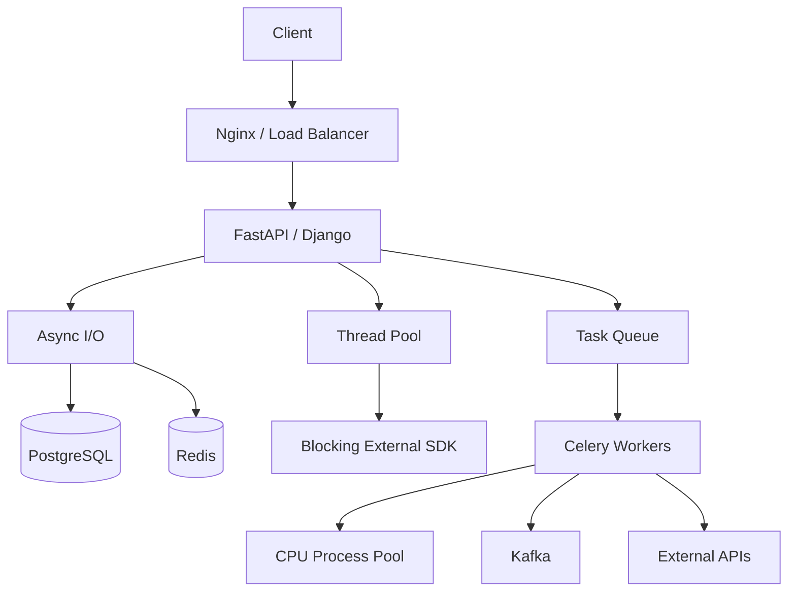

# 02- Processes vs Threads

## Overview

Python provides multiple ways to execute work concurrently or in parallel. Two of the most important are **threads** and **processes**.

The distinction is fundamental to backend engineering because the choice affects:

- CPU utilization
- I/O throughput
- memory consumption
- application architecture
- failure isolation
- serialization overhead
- scalability
- debugging
- deployment behavior

At a high level:

```text
Threads
└── Multiple execution paths
    └── Shared process memory

Processes
└── Multiple independent execution environments
    └── Separate process memory
```

The correct choice depends primarily on whether the workload is **I/O-bound or CPU-bound**, whether state needs to be shared, and whether the workload must scale beyond a single Python process.

---

## Threads vs Processes

A thread is an execution unit inside a process.

A process is an independently managed operating-system execution environment.

```text
Process A
├── Python interpreter
├── Memory
├── Thread 1
├── Thread 2
└── Thread 3

Process B
├── Python interpreter
├── Separate memory
├── Thread 1
└── Thread 2
```

Threads within the same process generally share process memory.

Processes have separate address spaces and communicate through explicit mechanisms.

---

## Core Comparison

| Characteristic | Threads | Processes |
|---|---|---|
| Memory | Shared within process | Separate address spaces |
| Startup cost | Lower | Higher |
| Communication | Shared objects, queues, locks | IPC, queues, pipes, serialization |
| I/O-bound work | Excellent | Good |
| CPU-bound Python work | Limited under traditional GIL model | Excellent |
| Failure isolation | Lower | Higher |
| Memory overhead | Lower | Higher |
| Synchronization | Locks/events/queues | IPC/shared memory/external systems |
| Serialization overhead | Usually low | Often significant |
| Debugging | Can be difficult | Can be difficult |
| Horizontal scaling | Limited to process | Can use multiple CPU cores |
| Typical backend use | Blocking I/O | CPU-heavy workers |

---

## What Is a Thread?

A thread is a schedulable execution path inside a process.

For example:

```text
Application Process
│
├── Main Thread
│
├── Worker Thread A
│
├── Worker Thread B
│
└── Worker Thread C
```

Threads share important process-level resources such as:

- memory
- file descriptors
- imported modules
- heap objects
- sockets

This makes communication relatively inexpensive.

However, shared memory also creates synchronization problems.

---

## Why Threads Exist

Threads are useful when one execution path frequently waits for external work.

For example:

```text
Thread A
   ↓
HTTP request
   ↓
wait...

Thread B
   ↓
PostgreSQL query
   ↓
wait...

Thread C
   ↓
Redis operation
   ↓
wait...
```

While one thread waits, another can make progress.

This makes threads useful for synchronous I/O-bound applications and libraries.

---

## Python Threading

Python provides the `threading` module for creating and coordinating threads.

```python
import threading


def process_request(request_id: int) -> None:
    print(f"Processing request {request_id}")


threads = [
    threading.Thread(
        target=process_request,
        args=(request_id,),
    )
    for request_id in range(4)
]

for thread in threads:
    thread.start()

for thread in threads:
    thread.join()
```

For application code, manually creating threads for every unit of work is usually not the best design.

Thread pools are generally easier to manage.

---

## Thread Pools

The `concurrent.futures` module provides a higher-level API.

```python
from concurrent.futures import ThreadPoolExecutor


def fetch_customer(customer_id: int) -> dict:
    return customer_client.get(customer_id)


with ThreadPoolExecutor(max_workers=16) as executor:
    customers = list(
        executor.map(fetch_customer, customer_ids)
    )
```

A thread pool provides:

- bounded concurrency
- worker reuse
- simpler lifecycle management
- task submission APIs
- result and exception handling

The pool size should be chosen based on workload and downstream capacity.

---

## Thread Safety

Thread-safe code behaves correctly when accessed concurrently by multiple threads.

Consider:

```python
class Counter:
    def __init__(self) -> None:
        self.value = 0

    def increment(self) -> None:
        self.value += 1
```

Multiple threads modifying the same mutable state can create correctness problems.

Protect shared state when necessary:

```python
import threading


class Counter:
    def __init__(self) -> None:
        self.value = 0
        self._lock = threading.Lock()

    def increment(self) -> None:
        with self._lock:
            self.value += 1
```

However, reducing shared state is often better than adding increasingly complex locking.

---

## Thread Memory Model

Threads share process memory.

Conceptually:

```text
Process Memory
│
├── Global objects
├── Heap
│   ├── Customer object
│   ├── Cache
│   └── Configuration
│
├── Thread A stack
├── Thread B stack
└── Thread C stack
```

This provides efficient communication but also means one thread can accidentally modify state observed by another.

Shared mutable state is therefore a major source of concurrency bugs.

---

## What Is a Process?

A process is an operating-system-managed execution environment with its own virtual address space.

```text
Process A
├── Interpreter
├── Heap
├── Stack
└── File descriptors

Process B
├── Interpreter
├── Heap
├── Stack
└── File descriptors
```

Processes are isolated from each other at the memory-address-space level.

This provides stronger failure isolation and enables execution across multiple CPU cores.

---

## Why Processes Exist

Processes are particularly useful when work is CPU-bound.

Example:

```text
Process 1 → CPU Core 1
Process 2 → CPU Core 2
Process 3 → CPU Core 3
Process 4 → CPU Core 4
```

For CPU-heavy Python workloads, separate processes can provide actual parallel execution even when the interpreter uses the traditional GIL model.

---

## Python Multiprocessing

Python provides the `multiprocessing` module.

```python
from multiprocessing import Pool


def calculate(value: int) -> int:
    return value * value


if __name__ == "__main__":
    with Pool(processes=4) as pool:
        results = pool.map(calculate, range(100))
```

The `if __name__ == "__main__"` guard is important for portability and especially for process start methods that spawn a fresh interpreter.

---

## Process Pools

For most application code, `ProcessPoolExecutor` provides a convenient interface.

```python
from concurrent.futures import ProcessPoolExecutor


def transform_batch(batch: list[int]) -> list[int]:
    return [value * value for value in batch]


with ProcessPoolExecutor(max_workers=4) as executor:
    results = list(
        executor.map(transform_batch, batches)
    )
```

Process pools are appropriate when tasks are:

- CPU-intensive
- sufficiently large to amortize process overhead
- independent
- serializable

---

## The Global Interpreter Lock

The **Global Interpreter Lock (GIL)** is an important implementation detail of CPython.

In traditional GIL-enabled CPython execution, only one thread at a time executes Python bytecode within a particular interpreter.

This affects CPU-bound pure Python code.

```text
Thread A → Python bytecode
Thread B → waiting for GIL

Thread A → releases GIL
Thread B → Python bytecode
```

Therefore, adding threads does not generally turn CPU-bound pure Python code into multi-core parallel computation.

However, the GIL does not prevent useful threading for I/O-bound work.

---

## GIL and I/O

During many blocking I/O operations, the interpreter can release the GIL.

Conceptually:

```text
Thread A
  ↓
Python code
  ↓
Socket I/O
  ↓
waiting without occupying Python execution

Thread B
  ↓
Python code
  ↓
continues execution
```

This is why threads can be highly effective for synchronous HTTP clients, filesystem operations, and other I/O-heavy workloads.

Native extensions can also release the GIL during suitable operations.

---

## Free-Threaded CPython

Modern CPython also supports optional **free-threaded builds** in supported versions.

In such builds, the GIL can be disabled, allowing Python threads to execute Python code concurrently across CPU cores.

This changes the traditional "threads cannot parallelize Python CPU work" rule.

However, free-threaded execution does not automatically make existing applications faster.

Potential concerns include:

- thread-safety assumptions
- third-party extension compatibility
- synchronization overhead
- contention
- increased complexity

Production decisions should therefore consider the actual interpreter build and dependency compatibility rather than assuming either GIL-enabled or free-threaded behavior universally.

---

## Threads for I/O-Bound Work

Consider a backend service that must call several independent external APIs.

Sequential execution:

```text
API A → 300 ms
API B → 400 ms
API C → 500 ms

Total ≈ 1200 ms
```

Concurrent threads:

```text
API A ───── 300 ms
API B ───────── 400 ms
API C ───────────── 500 ms

Total ≈ 500 ms
```

Actual latency depends on connection setup, scheduling, downstream capacity, and network conditions.

---

## Processes for CPU-Bound Work

Suppose a service needs to process CPU-intensive documents.

Sequential:

```text
Document A → CPU
Document B → CPU
Document C → CPU
Document D → CPU
```

Processes:

```text
Process 1 → Document A → CPU Core 1
Process 2 → Document B → CPU Core 2
Process 3 → Document C → CPU Core 3
Process 4 → Document D → CPU Core 4
```

Independent processes can use multiple CPU cores simultaneously.

---

## Process Communication

Because processes do not normally share ordinary Python objects, they require communication mechanisms.

Common mechanisms include:

- `multiprocessing.Queue`
- `multiprocessing.Pipe`
- shared memory
- manager objects
- files
- sockets
- external databases
- Redis
- Kafka

For larger systems, an external queue or event system is often preferable to tightly coupling worker processes.

---

## Serialization Between Processes

Process pools commonly serialize function arguments and return values.

Conceptually:

```text
Parent Process
    ↓
Serialize arguments
    ↓
IPC
    ↓
Worker Process
    ↓
Deserialize
    ↓
Execute
    ↓
Serialize result
    ↓
IPC
    ↓
Parent Process
```

Large objects can make multiprocessing significantly more expensive.

For example:

```python
large_dataframe = ...
executor.submit(process, large_dataframe)
```

may involve substantial serialization and memory overhead.

Prefer coarse-grained tasks and compact inputs where possible.

---

## Copy-on-Write and Process Creation

On operating systems and start methods that use `fork`, a child process can initially share physical memory pages with its parent through copy-on-write.

Conceptually:

```text
Parent
 ├── Memory page A
 ├── Memory page B
 └── Memory page C
       │
       └── fork
            ↓
Child initially references shared pages
```

If either process modifies a shared page, the operating system can create a private copy.

This can make process startup efficient in some environments, but it should not be treated as free shared memory.

Modern Python deployments also frequently use the `spawn` start method, either by default or by explicit choice, depending on platform and configuration.

---

## Process Start Methods

Python supports different process start methods.

| Method | Characteristics |
|---|---|
| `spawn` | Starts a fresh interpreter |
| `fork` | Child inherits process state using OS fork semantics |
| `forkserver` | Uses a dedicated server process to fork workers |

The available and default methods vary by operating system and Python version.

Production code should avoid relying implicitly on fork-specific behavior.

---

## Threads vs Processes: Memory

Threads:

```text
One process
└── Shared memory
```

Processes:

```text
Process A → Memory A
Process B → Memory B
Process C → Memory C
```

Processes generally consume more memory.

This matters in:

- Docker containers
- Kubernetes pods
- AWS ECS tasks
- EC2 instances
- memory-constrained workloads

A configuration such as:

```text
8 processes × 500 MB
≈ potentially several GB of memory
```

can become expensive quickly.

Actual memory sharing and private-page behavior depend on the operating system and workload.

---

## Threads vs Processes: Failure Isolation

A thread failure occurs within the same process.

A serious process-level failure can terminate the entire process and therefore all of its threads.

Processes provide stronger isolation:

```text
Process A
├── Worker A1
└── Worker A2

Process B
├── Worker B1
└── Worker B2
```

A failure in Process A does not inherently corrupt the memory of Process B.

This is valuable for untrusted, unstable, or resource-intensive workloads.

---

## Threads vs Processes: Startup Cost

Threads are relatively lightweight.

Processes require additional operating-system and interpreter resources.

Therefore:

```text
Small frequent tasks
→ threads may be cheaper

Large CPU-heavy tasks
→ processes may justify the overhead
```

Do not create a new process for every tiny operation.

Use pools or long-lived workers.

---

## Shared State

Threads make shared state easy to access:

```python
cache = {}

# Multiple threads can access cache.
```

But shared state requires careful synchronization.

Processes require explicit communication:

```text
Process A
    ↓
Queue / IPC
    ↓
Process B
```

This makes process boundaries more cumbersome but can force cleaner architecture.

---

## Thread Synchronization

Common synchronization primitives include:

- `Lock`
- `RLock`
- `Semaphore`
- `Event`
- `Condition`
- `Queue`

Example:

```python
import threading


lock = threading.Lock()


def update_state() -> None:
    with lock:
        modify_shared_state()
```

Keep critical sections small.

Do not hold locks while performing slow network or database operations unless there is a strong correctness reason.

---

## Process Synchronization

Multiprocessing provides synchronization primitives as well, but synchronization across processes is more expensive and complex.

For distributed applications, external coordination is usually more appropriate.

For example:

```text
Application Pod A
Application Pod B
Application Pod C
        │
        ↓
PostgreSQL / Redis / Kafka
```

A Python `threading.Lock` cannot coordinate these separate processes.

---

## Database Concurrency

Suppose two API requests update the same account.

```text
Request A ─┐
           ├── PostgreSQL
Request B ─┘
```

A process-local lock does not protect against:

- another process
- another pod
- another service
- direct database access

Use database mechanisms where appropriate:

- transactions
- row-level locks
- unique constraints
- atomic updates
- optimistic locking

Concurrency control belongs at the layer where the shared state actually exists.

---

## FastAPI and Threads

FastAPI applications may need threads when synchronous blocking libraries are unavoidable.

For example:

```python
import asyncio


async def call_legacy_service() -> dict:
    return await asyncio.to_thread(
        legacy_client.fetch_data,
    )
```

This moves the blocking synchronous operation away from the event-loop thread.

The thread pool must still be bounded.

---

## FastAPI and Processes

CPU-intensive operations should generally not execute directly inside an event loop.

Potential architecture:

```text
FastAPI
   ↓
Task Queue
   ↓
CPU Worker Processes
   ↓
Result Storage
```

For substantial workloads, Celery or another worker architecture is usually more operationally appropriate than creating ad hoc process pools inside request handlers.

---

## Django and Threads

Django applications may encounter synchronous operations that are expensive or blocking.

Thread pools can help isolate blocking external calls, but database access and framework lifecycle rules must be respected.

Avoid assuming that every Django object is safe to share between threads.

In particular, connection management and request-scoped state should follow Django's documented lifecycle behavior.

---

## Celery Workers

Celery is often a better choice when concurrency needs to extend beyond a single web process.

```text
HTTP Request
    ↓
Celery Queue
    ↓
Worker Pool
    ├── Worker
    ├── Worker
    ├── Worker
    └── Worker
```

Celery supports different worker pool models and can scale independently from the API layer.

This provides better isolation for:

- long-running jobs
- CPU-heavy processing
- retries
- scheduled work
- asynchronous workflows

---

## Kubernetes Scaling

In Kubernetes, scaling processes may be better represented by scaling pods.

```text
Deployment
├── Pod 1
├── Pod 2
├── Pod 3
└── Pod 4
```

Each pod may contain one or more application workers.

Be careful with nested concurrency:

```text
4 pods
×
4 processes
×
8 threads
=
128 execution units
```

This can easily overwhelm downstream services.

Concurrency must be planned across all layers.

---

## Resource Capacity

Suppose:

```text
Kubernetes replicas = 5
Worker processes/pod = 4
Database connections/process = 10
```

Potential database connections:

```text
5 × 4 × 10 = 200
```

Increasing process or thread counts without considering downstream resources can create a database outage.

Always model:

```text
replicas
× workers
× connections
× concurrency
```

against actual infrastructure capacity.

---

## Thread Pools and Connection Pools

A thread pool and a database connection pool solve different problems.

```text
Thread Pool
→ limits concurrent application execution

Database Pool
→ limits concurrent database connections
```

They interact.

If:

```text
Threads = 100
DB connections = 10
```

up to 90 threads may wait for database access.

If:

```text
Threads = 10
DB connections = 100
```

the database may have unused capacity.

Tune these values together.

---

## When to Prefer Threads

Threads are generally appropriate when:

- work is I/O-bound
- libraries are synchronous
- tasks spend significant time waiting
- shared memory is useful
- task payloads are large and expensive to serialize
- process isolation is unnecessary

Typical examples:

- synchronous HTTP clients
- filesystem operations
- blocking SDK calls
- legacy libraries
- some database integrations

---

## When to Prefer Processes

Processes are generally appropriate when:

- work is CPU-bound
- tasks can execute independently
- multiple CPU cores should be used
- stronger failure isolation is useful
- serialization overhead is acceptable

Typical examples:

- CPU-heavy transformations
- image processing
- document processing
- computational workloads
- large pure-Python calculations

---

## When Neither Is the Best Choice

Threads and processes are not always the correct architecture.

Consider `asyncio` for:

- high-volume non-blocking network I/O
- WebSocket services
- concurrent HTTP calls
- asynchronous database access

Consider Celery or another worker system for:

- durable background processing
- retries
- scheduled jobs
- long-running tasks
- distributed execution

Consider Kafka for:

- event streaming
- partition-based ordering
- consumer groups
- asynchronous service decoupling

---

## Decision Matrix

| Requirement | Recommended Approach |
|---|---|
| High-volume async HTTP calls | `asyncio` |
| Blocking synchronous HTTP client | Thread pool |
| Legacy blocking SDK | Thread pool |
| Pure Python CPU-heavy work | Process pool |
| Large CPU-intensive background jobs | Worker processes |
| Durable asynchronous jobs | Celery |
| Event streaming | Kafka |
| Shared persistent state | PostgreSQL / Redis / appropriate datastore |
| Simple synchronous CRUD | Synchronous execution may be sufficient |

---

## Practical Example: Concurrent API Aggregation

A service needs to retrieve data from three independent systems.

### Thread-based approach

Useful when all clients are synchronous:

```python
from concurrent.futures import ThreadPoolExecutor


def fetch_customer(customer_id: int) -> dict:
    return customer_client.get(customer_id)


def fetch_orders(customer_id: int) -> list[dict]:
    return order_client.get_for_customer(customer_id)


def fetch_preferences(customer_id: int) -> dict:
    return preference_client.get(customer_id)


def build_profile(customer_id: int) -> dict:
    with ThreadPoolExecutor(max_workers=3) as executor:
        customer = executor.submit(
            fetch_customer,
            customer_id,
        )
        orders = executor.submit(
            fetch_orders,
            customer_id,
        )
        preferences = executor.submit(
            fetch_preferences,
            customer_id,
        )

        return {
            "customer": customer.result(),
            "orders": orders.result(),
            "preferences": preferences.result(),
        }
```

For a fully asynchronous service, native async clients and `asyncio` may be preferable.

---

## Practical Example: CPU Worker

For CPU-intensive transformation:

```python
from concurrent.futures import ProcessPoolExecutor


def transform_document(document: bytes) -> bytes:
    return expensive_cpu_transformation(document)


def transform_documents(
    documents: list[bytes],
) -> list[bytes]:
    with ProcessPoolExecutor(max_workers=4) as executor:
        return list(
            executor.map(
                transform_document,
                documents,
            )
        )
```

The workload should be large enough that process and serialization overhead do not dominate execution time.

---

## Avoid Oversubscription

Oversubscription occurs when there are more runnable execution units than the system can efficiently execute.

Example:

```text
CPU cores = 8

Processes = 16
Threads/process = 8

Potential threads = 128
```

For CPU-bound workloads, this can cause:

- context-switch overhead
- cache inefficiency
- CPU contention
- increased latency
- memory pressure

More workers do not necessarily mean more throughput.

---

## Monitoring Threads

Useful metrics include:

- active thread count
- thread-pool queue depth
- task execution latency
- task wait time
- lock contention
- CPU utilization
- memory utilization
- downstream connection-pool utilization

Unexpected thread growth can indicate:

- unbounded task creation
- blocked I/O
- connection leaks
- insufficient pool sizing
- deadlocks

---

## Monitoring Processes

Monitor:

- process count
- CPU per process
- RSS memory
- process restarts
- task throughput
- task latency
- worker failures
- queue depth

For Kubernetes, also monitor:

- pod restarts
- OOM kills
- CPU throttling
- memory limits
- readiness/liveness behavior

---

## Debugging Thread Problems

Thread bugs can be difficult because scheduling is nondeterministic.

Typical symptoms include:

- intermittent failures
- corrupted shared state
- deadlocks
- inconsistent counters
- occasional timeouts

Useful techniques include:

- structured logging
- thread names
- tracing
- deterministic synchronization in tests
- lock instrumentation
- thread dumps
- stress testing

Avoid relying on `time.sleep()` to reproduce synchronization problems.

---

## Debugging Process Problems

Process failures can be easier to isolate but harder to inspect.

Common problems include:

- serialization errors
- worker crashes
- excessive memory usage
- process startup failures
- child-process lifecycle issues
- missing initialization
- platform-specific start-method behavior

Log process identifiers where useful:

```python
import os
import logging


logger = logging.getLogger(__name__)


logger.info(
    "processing task",
    extra={"process_id": os.getpid()},
)
```

---

## Security Considerations

Concurrency can introduce security issues when shared state is incorrectly synchronized.

Examples include:

- race conditions in authorization checks
- duplicate payment processing
- concurrent token updates
- inconsistent tenant state
- cache poisoning through race conditions
- temporary privilege-state inconsistencies

Security-sensitive operations should use atomic state transitions and authoritative persistence-layer checks.

Do not rely solely on in-memory synchronization for authorization or financial correctness.

---

## Reliability and Idempotency

Concurrent execution increases the probability that operations overlap or are retried.

For side-effecting operations, design for idempotency.

Example:

```text
Request
  ↓
Generate idempotency key
  ↓
Atomic persistence check
  ↓
Perform operation once
  ↓
Store result
```

This is especially important for:

- payments
- order creation
- message processing
- webhook handling
- Celery tasks
- Kafka consumers

---

## Disaster Recovery

Process and thread state is generally ephemeral.

Do not rely on in-memory concurrent state for durable recovery.

Persist important state in systems such as:

- PostgreSQL
- Redis where appropriate
- Kafka
- durable object storage
- managed queues

A restarted process should be able to reconstruct required state from durable sources.

---

## Testing Strategy

Test thread and process behavior separately from ordinary business logic.

### Unit tests

Verify:

- task behavior
- error handling
- synchronization boundaries
- idempotency

### Concurrency tests

Verify:

- simultaneous access
- race conditions
- task cancellation
- queue saturation
- timeout behavior

### Integration tests

Verify:

- PostgreSQL concurrency
- Redis coordination
- Kafka delivery
- Celery retries
- external API behavior

### Load tests

Measure:

- throughput
- p95/p99 latency
- CPU
- memory
- connection utilization
- queue depth

Concurrency correctness and performance should both be tested.

---

## Common Mistakes

### Using Threads for Every Problem

Threads are not a universal concurrency solution.

Choose based on workload characteristics.

### Assuming the GIL Makes Threads Useless

Threads remain highly useful for I/O-bound work.

### Assuming Processes Are Always Faster

Serialization, startup, IPC, and memory costs can dominate small workloads.

### Sharing Too Much Mutable State

Shared state increases synchronization complexity.

Prefer immutable data or message passing when possible.

### Creating Unlimited Threads

Unbounded thread creation can exhaust memory and operating-system resources.

Use bounded pools.

### Creating Too Many Processes

Excess processes can cause CPU and memory contention.

Match worker count to available CPU and workload characteristics.

### Ignoring Serialization

Passing large objects between processes can be expensive.

Prefer compact task inputs and coarse-grained work.

### Using Process-Local Locks for Distributed State

A lock inside one process does not coordinate other processes or Kubernetes pods.

### Forgetting the Main Guard

Process-based code should use the appropriate entry-point guard:

```python
if __name__ == "__main__":
    ...
```

This is especially important with the `spawn` start method.

---

## Production Pitfalls

### Thread Pool Exhaustion

If all worker threads are blocked on slow dependencies, new tasks queue up.

```text
Requests
   ↓
Thread Pool
   ↓
All threads blocked
   ↓
Queue grows
   ↓
Latency increases
```

Use timeouts and bounded queues.

### Process Memory Explosion

Multiple workers can significantly increase memory consumption.

Measure actual RSS rather than assuming memory is shared.

### Database Connection Explosion

Nested concurrency can multiply connection usage:

```text
Pods × Processes × Connections
```

Plan the resulting maximum.

### Retry Amplification

Concurrent retries can turn a downstream outage into a cascading failure.

Use:

- exponential backoff
- jitter
- bounded retries
- circuit breakers where appropriate

### Graceful Shutdown Failures

Workers should stop accepting new work and finish or safely abandon in-flight work according to the application's durability model.

---

## Performance Tuning

Do not choose thread or process counts from generic recommendations alone.

Measure:

```text
Workload
  ↓
Profile
  ↓
Identify bottleneck
  ↓
Set concurrency limit
  ↓
Load test
  ↓
Observe downstream impact
  ↓
Tune
```

Important variables include:

- CPU core count
- task duration
- I/O wait time
- memory per worker
- serialization size
- database capacity
- downstream rate limits
- network bandwidth

---

## Architecture Example

A production backend may use all three major concurrency models:



The key is separation of responsibilities:

| Work | Mechanism |
|---|---|
| Non-blocking HTTP I/O | `asyncio` |
| Blocking synchronous SDK | Threads |
| CPU-heavy transformation | Processes |
| Durable background work | Celery |
| Event streaming | Kafka |
| Persistent consistency | PostgreSQL |

---

## Senior-Level Decision Framework

When deciding between threads and processes, evaluate these questions:

1. Is the workload CPU-bound or I/O-bound?
2. Does the workload use synchronous or asynchronous libraries?
3. Does it need multiple CPU cores?
4. How expensive is serialization?
5. How much memory does each worker require?
6. Does the work require shared mutable state?
7. What failure isolation is required?
8. What are the downstream connection and rate limits?
9. Does the work need durable execution?
10. Will the application run as multiple Kubernetes replicas?
11. What happens when a worker crashes?
12. Can the operation be safely retried?

A strong design usually emerges from these constraints rather than from choosing a concurrency technology first.

---

## Interview Traps

### "The GIL Means Python Cannot Use Multiple Cores"

Incorrect as a blanket statement.

Traditional GIL-enabled CPython limits simultaneous Python-bytecode execution between threads in one interpreter, while processes can execute independently across cores. Modern free-threaded CPython builds also change this model.

### "Threads Are Faster Than Processes"

Neither is inherently faster.

Threads generally have lower overhead, while processes provide stronger isolation and CPU parallelism.

### "Processes Share Memory"

Ordinary Python objects are not directly shared between independent processes.

Explicit IPC or shared-memory mechanisms are required.

### "A Lock Makes Distributed Systems Safe"

A local lock only coordinates participants that share that lock.

Distributed correctness requires coordination at the appropriate shared-state layer.

### "More Workers Increase Throughput"

Only until the system reaches a bottleneck.

After that, additional workers can increase contention, latency, and cost.

### "Asyncio Replaces Threads and Processes"

It does not.

`asyncio`, threads, and processes solve different execution problems and can be combined when appropriate.

---

## Production Checklist

Before deploying a threaded or process-based workload, verify:

- [ ] Workload type has been identified as CPU-bound or I/O-bound.
- [ ] Thread/process count is explicitly bounded.
- [ ] Downstream connection limits have been considered.
- [ ] Database capacity has been modeled.
- [ ] Memory usage per worker has been measured.
- [ ] Blocking operations are not accidentally running on an async event loop.
- [ ] Process arguments and results are efficiently serializable.
- [ ] Shared mutable state has been minimized.
- [ ] Synchronization mechanisms have been reviewed for deadlocks.
- [ ] Timeouts are configured.
- [ ] Retries are bounded and use backoff.
- [ ] Side effects are idempotent where necessary.
- [ ] Graceful shutdown is implemented.
- [ ] Worker crashes are recoverable.
- [ ] Queue depth and worker utilization are observable.
- [ ] CPU, memory, latency, and throughput are monitored.
- [ ] Concurrency has been load-tested.
- [ ] Kubernetes replica scaling has been included in capacity calculations.
- [ ] Operational limits and downstream rate limits are documented.

## Key Takeaways

- **Threads share process memory and are generally best suited to I/O-bound or blocking synchronous work; processes provide stronger isolation and are the primary mechanism for CPU parallelism in traditional GIL-enabled CPython.**
- **The GIL does not make Python threading useless:** I/O operations and suitable native code can release the GIL, and modern CPython also supports optional free-threaded builds.
- **Processes introduce real costs:** startup, memory, inter-process communication, and serialization can make them inefficient for small tasks.
- **Concurrency must be bounded and capacity-aware:** worker counts must be evaluated against CPU, memory, database connections, downstream rate limits, Kubernetes replicas, and queue capacity.
- **Production concurrency is a correctness problem as much as a performance problem:** race conditions, synchronization, idempotency, retries, cancellation, graceful shutdown, and failure isolation must be designed together.