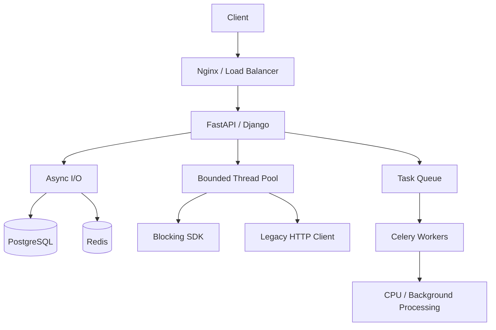

# 04- Threading

## Overview

Python threading provides a way to execute multiple threads within a single process. Threads share the process's memory and operating-system resources, making them relatively lightweight and efficient for workloads that spend significant time waiting on I/O.

Threading is especially relevant in backend systems that interact with:

- HTTP APIs
- PostgreSQL
- Redis
- filesystem operations
- cloud SDKs
- legacy synchronous libraries
- blocking network clients
- background workers

In traditional GIL-enabled CPython, threads do not generally provide parallel execution of pure Python bytecode. They can still provide substantial concurrency for I/O-bound workloads because threads can make progress while other threads are blocked on I/O.

The fundamental model is:

```text
Python Process
│
├── Thread A ──┐
├── Thread B ──┤
├── Thread C ──┤── shared process memory
└── Thread D ──┘
```

Threading is therefore both a performance mechanism and a synchronization problem.

---

## What Is a Thread?

A thread is an independently schedulable execution path inside a process.

A process can contain multiple threads:

```text
Process
├── Main Thread
├── Worker Thread 1
├── Worker Thread 2
└── Worker Thread 3
```

Threads within the same process generally share:

- heap objects
- global state
- imported modules
- file descriptors
- sockets
- process-level resources

Each thread maintains its own execution state, including its call stack and instruction position.

---

## Why Use Threads?

Threads are useful when work can overlap without requiring separate processes.

Typical workloads include:

```text
Application
│
├── Thread A → HTTP request → waiting
├── Thread B → PostgreSQL query → waiting
├── Thread C → Redis request → waiting
└── Thread D → filesystem operation → waiting
```

While one thread waits for I/O, another thread can execute.

This can improve throughput for blocking I/O without requiring a complete migration to asynchronous APIs.

---

## Threading vs Other Concurrency Models

| Model | Best Fit | Memory | CPU Parallelism in Traditional GIL-enabled CPython |
|---|---|---|---|
| Threads | Blocking I/O | Shared | Limited for Python bytecode |
| `asyncio` | Non-blocking I/O | Shared event-loop state | No |
| Processes | CPU-bound work | Isolated | Yes |
| Celery workers | Distributed background work | Isolated workers | Yes, depending on worker pool |
| Kafka consumers | Event-driven distributed work | Isolated consumers | Yes across processes/instances |

Threading is particularly valuable when the codebase or dependency ecosystem is synchronous.

---

## Creating Threads

Python's `threading` module provides low-level thread management.

```python
import threading


def process_request(request_id: int) -> None:
    print(f"Processing request {request_id}")


thread = threading.Thread(
    target=process_request,
    args=(42,),
)

thread.start()
thread.join()
```

`start()` schedules the thread for execution.

`join()` waits for the thread to terminate.

Avoid creating large numbers of ad hoc threads in production. Prefer bounded thread pools for application workloads.

---

## Thread Lifecycle

A typical thread lifecycle is:

```text
Created
   ↓
Started
   ↓
Runnable
   ↓
Running
   ↓
Waiting / blocked
   ↓
Runnable
   ↓
Completed
```

The operating system and Python runtime determine when threads are scheduled.

Python code should not depend on a specific scheduling order.

---

## Thread Scheduling

Thread scheduling is nondeterministic from the application's perspective.

Consider:

```python
thread_a.start()
thread_b.start()
```

You cannot assume:

```text
A always runs before B
```

The actual order can vary because of:

- operating-system scheduling
- I/O timing
- CPU availability
- synchronization
- interpreter behavior

Concurrent code must therefore be correct regardless of execution order.

---

## Thread Pools

For backend applications, `ThreadPoolExecutor` is usually preferable to manually creating threads.

```python
from concurrent.futures import ThreadPoolExecutor


def fetch_customer(customer_id: int) -> dict:
    return customer_client.get(customer_id)


def fetch_customers(
    customer_ids: list[int],
) -> list[dict]:
    with ThreadPoolExecutor(max_workers=16) as executor:
        return list(
            executor.map(
                fetch_customer,
                customer_ids,
            )
        )
```

A thread pool provides:

- bounded worker count
- thread reuse
- simpler lifecycle management
- result collection
- exception propagation
- controlled concurrency

---

## Choosing Thread Pool Size

There is no universal optimal thread count.

The correct value depends on:

- task duration
- I/O wait time
- CPU availability
- downstream capacity
- database connection limits
- memory
- rate limits

For I/O-heavy workloads, a thread pool may contain more threads than available CPU cores.

For CPU-heavy Python workloads under traditional GIL-enabled CPython, increasing threads generally does not provide equivalent CPU scaling.

---

## Thread Pool and Downstream Capacity

Suppose:

```text
Thread pool = 100
Database pool = 20
```

Only approximately 20 database operations can execute concurrently if the database pool is the limiting resource.

The remaining threads may wait.

Increasing thread count can therefore increase:

- memory usage
- scheduling overhead
- queueing
- latency

without increasing throughput.

---

## Thread Safety

A component is thread-safe when concurrent access does not cause incorrect behavior or violate its invariants.

Thread safety is not automatically provided by Python's interpreter.

For example:

```python
class Inventory:
    def __init__(self) -> None:
        self.quantity = 100

    def reserve(self, amount: int) -> None:
        if self.quantity >= amount:
            self.quantity -= amount
```

Two threads can observe the same available quantity and both modify it.

The problem is a concurrency invariant:

```text
check quantity
    ↓
modify quantity
```

The complete operation may need synchronization.

---

## Race Conditions

A race condition occurs when correctness depends on timing between concurrent operations.

Consider:

```text
Initial quantity = 10

Thread A → read 10
Thread B → read 10

Thread A → subtract 7 → 3
Thread B → subtract 7 → 3
```

Two reservations were accepted even though only one should have succeeded.

The GIL does not solve this business-level race condition.

---

## Locks

A `Lock` provides mutual exclusion.

```python
import threading


class Counter:
    def __init__(self) -> None:
        self._value = 0
        self._lock = threading.Lock()

    def increment(self) -> None:
        with self._lock:
            self._value += 1
```

Only one thread can hold the lock at a time.

The `with` statement ensures the lock is released when the block exits, including when an exception occurs.

---

## Critical Sections

The code protected by a lock is the critical section.

```python
with lock:
    update_shared_state()
```

Keep critical sections:

- small
- deterministic
- local
- free from unnecessary I/O

Avoid:

```python
with lock:
    database_call()
    http_call()
    expensive_computation()
```

unless the lock is genuinely required across those operations.

Long critical sections create contention and increase the probability of deadlocks.

---

## Reentrant Locks

`threading.RLock` is a reentrant lock.

The same thread can acquire it multiple times.

```python
import threading


class Service:
    def __init__(self) -> None:
        self._lock = threading.RLock()

    def outer(self) -> None:
        with self._lock:
            self.inner()

    def inner(self) -> None:
        with self._lock:
            perform_operation()
```

An `RLock` can be useful when nested calls legitimately require the same lock.

Do not use it simply because ordinary `Lock` causes a deadlock. First understand the locking design.

---

## Semaphores

A semaphore limits how many threads can enter a section concurrently.

```python
import threading


api_limit = threading.Semaphore(10)


def call_external_api() -> dict:
    with api_limit:
        return external_client.fetch()
```

This is useful for protecting finite resources.

Examples:

- external API rate limits
- database-heavy operations
- filesystem resources
- connection-limited services

---

## Events

An `Event` allows one thread to signal another.

```python
import threading


shutdown_event = threading.Event()


def worker() -> None:
    while not shutdown_event.is_set():
        process_next_task()


worker_thread = threading.Thread(target=worker)
worker_thread.start()

shutdown_event.set()
worker_thread.join()
```

Events are useful for:

- shutdown signals
- initialization notifications
- coordination between workers
- state changes

---

## Conditions

A `Condition` allows threads to wait until a particular state becomes true.

```python
import threading


condition = threading.Condition()
items: list[str] = []


def consume() -> str:
    with condition:
        while not items:
            condition.wait()

        return items.pop(0)


def produce(item: str) -> None:
    with condition:
        items.append(item)
        condition.notify()
```

The `while` condition is important because a thread should re-check the state after waking.

---

## Queues

A queue is often safer than manually sharing mutable state.

```python
from queue import Queue
import threading


tasks: Queue[int] = Queue()


def worker() -> None:
    while True:
        task = tasks.get()

        try:
            process(task)
        finally:
            tasks.task_done()


thread = threading.Thread(
    target=worker,
    daemon=True,
)

thread.start()
```

Queues provide a natural producer-consumer architecture:

```text
Producer
   ↓
Thread-safe Queue
   ↓
Worker Threads
```

They reduce direct coordination between producers and consumers.

---

## Producer-Consumer Pattern

A bounded queue provides both coordination and backpressure.

```text
Producers
 ├── Producer A
 ├── Producer B
 └── Producer C
        │
        ↓
   Bounded Queue
        │
        ↓
 Workers
 ├── Worker A
 ├── Worker B
 └── Worker C
```

If workers cannot keep up, the queue reaches capacity and producers must wait or reject work.

This is usually safer than allowing unlimited tasks to accumulate in memory.

---

## Bounded Queues

Prefer bounded queues for workloads where memory growth is a concern.

```python
from queue import Queue


tasks: Queue[dict] = Queue(maxsize=1000)
```

A bounded queue provides an explicit capacity boundary.

Without one:

```text
Producer rate > Consumer rate
        ↓
Queue grows indefinitely
        ↓
Memory increases
        ↓
Application failure
```

---

## Thread Exceptions

Exceptions raised in worker threads do not automatically terminate the main thread.

Using `ThreadPoolExecutor` makes exception handling easier.

```python
from concurrent.futures import ThreadPoolExecutor


def process(item: int) -> int:
    if item < 0:
        raise ValueError("item must be non-negative")

    return item * 2


with ThreadPoolExecutor(max_workers=4) as executor:
    future = executor.submit(process, -1)

    try:
        result = future.result()
    except ValueError:
        handle_failure()
```

A production application must explicitly define how worker failures are handled.

---

## Futures

A `Future` represents work that has been submitted but may not have completed.

```python
from concurrent.futures import ThreadPoolExecutor


with ThreadPoolExecutor(max_workers=4) as executor:
    future = executor.submit(fetch_customer, 42)

    customer = future.result()
```

A future can be:

- pending
- running
- completed
- failed
- cancelled

Useful methods include:

```python
future.result()
future.exception()
future.done()
future.cancel()
```

---

## Timeouts

Never assume external operations will complete quickly.

A future can have a timeout:

```python
from concurrent.futures import ThreadPoolExecutor, TimeoutError


with ThreadPoolExecutor(max_workers=4) as executor:
    future = executor.submit(fetch_customer, 42)

    try:
        customer = future.result(timeout=2.0)
    except TimeoutError:
        handle_timeout()
```

The timeout on `future.result()` limits how long the caller waits for the result. It does not necessarily stop the underlying function if it is already running.

For external I/O, configure the underlying client's actual network timeout as well.

---

## Thread Cancellation

Python threads do not provide a general safe mechanism to forcibly kill an arbitrary running thread.

This is an important limitation.

Instead, use cooperative cancellation.

```python
import threading


stop_event = threading.Event()


def worker() -> None:
    while not stop_event.is_set():
        process_next_item()


thread = threading.Thread(target=worker)
thread.start()

stop_event.set()
thread.join()
```

Long-running worker functions should periodically observe cancellation state.

---

## Daemon Threads

A daemon thread does not prevent interpreter shutdown.

```python
thread = threading.Thread(
    target=worker,
    daemon=True,
)
```

Daemon threads can be useful for truly disposable background work.

They should not be used for important durable operations because the process may terminate without waiting for them.

For production background work, use a proper worker system such as Celery or a durable queue.

---

## Thread Names

Naming threads improves observability.

```python
import threading


thread = threading.Thread(
    target=worker,
    name="payment-worker",
)
```

Thread names can appear in:

- logs
- debugging output
- thread dumps
- profiling tools

Use meaningful names for long-lived worker pools where supported.

---

## Thread-Local Storage

Some state should be isolated per thread rather than shared.

Python provides `threading.local()`.

```python
import threading


request_context = threading.local()


def handle_request(request_id: str) -> None:
    request_context.request_id = request_id
    process_request()
```

Each thread receives its own attributes.

Thread-local state can be useful for legacy thread-based libraries, but it should not be confused with request context in asynchronous applications.

For modern async systems, context variables are generally more appropriate for task-local context.

---

## Thread-Local Database State

Database libraries sometimes associate connections or session state with execution context.

Frameworks such as Django manage database connections according to their own lifecycle rules.

Application code should follow framework-specific connection-management semantics rather than manually sharing database connections across arbitrary threads.

Do not assume:

```text
one connection
→ safely shared by every thread
```

unless the client explicitly documents that behavior.

---

## Threading and FastAPI

FastAPI applications can encounter blocking synchronous operations.

For example:

```python
import asyncio


async def get_customer(customer_id: int) -> dict:
    return await asyncio.to_thread(
        synchronous_customer_client.get,
        customer_id,
    )
```

This allows blocking synchronous work to execute in a worker thread rather than blocking the event-loop thread.

However, thread pools must remain bounded.

---

## Threading and Django

Django applications may use threads through:

- synchronous worker infrastructure
- application-level executors
- background integrations
- blocking third-party libraries

Thread safety must be evaluated for:

- database connections
- caches
- global application state
- third-party clients
- mutable singleton objects

Avoid sharing objects across threads unless their thread-safety contract is understood.

---

## Threading and REST APIs

A synchronous API can use threads to overlap independent downstream calls.

```text
HTTP Request
     ↓
API Handler
     ↓
Thread Pool
 ┌───┼────────┐
 ↓   ↓        ↓
DB  Redis   External API
 └───┼────────┘
     ↓
Aggregate response
```

This can reduce latency when downstream operations are independent.

But each additional outbound operation consumes resources, so concurrency should be bounded.

---

## Threading and gRPC

The same principles apply to synchronous gRPC clients.

A thread pool can overlap independent RPC calls when the client API is blocking.

For an application already designed around asynchronous gRPC, native async APIs may be preferable to introducing threads.

---

## Threading and External APIs

Suppose an API endpoint needs three independent synchronous services:

```text
Customer API → 300 ms
Orders API   → 400 ms
Profile API  → 250 ms
```

Sequential execution is approximately:

```text
300 + 400 + 250 = 950 ms
```

With bounded concurrency:

```text
Customer ───── 300 ms
Orders   ─────────── 400 ms
Profile  ─── 250 ms

Approximate critical-path latency ≈ 400 ms
```

This assumes independent operations and sufficient downstream capacity.

---

## Threading and Rate Limits

Concurrency and rate limits are different.

A service may allow:

```text
100 concurrent requests
```

but impose:

```text
100 requests/second
```

A thread pool controls concurrency, not necessarily request rate.

A production API client may require both:

```text
Concurrency limit
+
Rate limiter
+
Timeout
+
Retry policy
```

---

## Threading and Retries

Retries can amplify concurrency.

Consider:

```text
100 threads
   ↓
Downstream failure
   ↓
100 retries
   ↓
More downstream load
```

This can produce a retry storm.

Use:

- bounded retries
- exponential backoff
- jitter
- appropriate timeouts
- idempotency
- circuit breakers where justified

---

## Threading and PostgreSQL

Threaded applications often interact with PostgreSQL through a connection pool.

The relationship is:

```text
Thread Pool
    ↓
Database Connection Pool
    ↓
PostgreSQL
```

Do not configure thread count independently from database capacity.

For example:

```text
Threads = 100
DB connections = 20
```

may produce significant waiting.

Conversely, too many database connections can overload PostgreSQL.

---

## Threading and Redis

Redis operations are typically I/O-bound from Python's perspective.

Threads can therefore overlap blocking Redis calls.

However, the Redis client must have appropriate connection-pool configuration.

Consider:

```text
Threads = 50
Redis connections = 10
```

Only a subset of operations can execute through available connections at once.

---

## Threading and Kafka

Kafka consumers may use threads for certain processing architectures, but partition ownership and consumer safety must be considered.

A common pattern is:

```text
Kafka Consumer
      ↓
Partition records
      ↓
Bounded worker pool
      ↓
Processing
```

Care is required around:

- offset commits
- message ordering
- partition ownership
- rebalancing
- duplicate processing
- long-running tasks

Do not introduce threads without understanding the Kafka client's threading guarantees.

---

## Threading and Celery

Celery can use worker pools for concurrent task execution.

For example:

```text
Celery Worker
├── Execution slot 1
├── Execution slot 2
├── Execution slot 3
└── Execution slot 4
```

The worker pool model should be chosen according to workload type and Celery's documented execution behavior.

For CPU-heavy tasks, process-based execution is often preferable under traditional GIL-enabled CPython.

For blocking I/O, threads can be useful.

---

## Threading and Kubernetes

A Kubernetes deployment can multiply thread counts significantly.

For example:

```text
8 Pods
×
50 Threads/Pod
=
400 potential threads
```

If each thread can access a database or external service, downstream load can grow rapidly.

Capacity planning must consider:

```text
replicas
×
processes
×
threads
×
connections
```

---

## Threading and CPU Limits

Threads do not bypass CPU limits.

If a Kubernetes pod has:

```text
CPU limit = 1 core
```

creating 50 CPU-heavy threads does not create 50 CPU cores.

Instead, the threads compete for limited CPU capacity.

For CPU-bound Python workloads under traditional GIL-enabled CPython, process-based parallelism may be more appropriate, subject to container CPU limits.

---

## Thread Safety of Third-Party Libraries

Never assume a library is thread-safe.

Check its documentation for:

- client sharing
- connection sharing
- session objects
- mutable global state
- callback behavior
- thread-local state

A library may allow:

```text
one client per thread
```

but not:

```text
one client shared across all threads
```

Follow the library's documented concurrency model.

---

## Threading and Mutable Caches

An in-memory cache shared by multiple threads needs careful design.

Potential issues include:

- stale values
- lost updates
- inconsistent compound operations
- unbounded growth
- eviction races

A lock can protect local state, but a process-local cache is not shared across multiple application processes.

For shared caching:

```text
Multiple workers
      ↓
Redis
```

may be more appropriate.

---

## Threading and Global State

Global mutable state is especially dangerous in threaded applications.

Avoid patterns such as:

```python
cache = {}
active_requests = 0
current_user = None
```

when multiple threads can modify them without explicit synchronization.

Prefer:

- immutable configuration
- dependency injection
- local variables
- thread-safe queues
- explicit state ownership

---

## Deadlocks

A deadlock occurs when threads wait indefinitely for resources held by one another.

Example:

```text
Thread A
  holds Lock 1
  waits for Lock 2

Thread B
  holds Lock 2
  waits for Lock 1
```

Neither thread can proceed.

---

## Preventing Deadlocks

Use:

- consistent lock acquisition ordering
- minimal critical sections
- fewer locks
- timeouts where appropriate
- ownership boundaries
- message passing instead of shared state

For example, always acquire:

```text
Lock A → Lock B
```

rather than allowing some code paths to acquire:

```text
A → B
```

and others:

```text
B → A
```

---

## Thread Starvation

Starvation occurs when a thread repeatedly fails to obtain the resources it needs.

Possible causes include:

- excessive lock contention
- unfair scheduling
- long-running critical sections
- overloaded worker pools

Symptoms include:

- high latency
- low throughput
- threads remaining blocked
- uneven task completion

Monitoring wait time is often more useful than monitoring thread count alone.

---

## Thread Contention

Contention occurs when many threads compete for the same resource.

Examples:

```text
50 threads
   ↓
1 lock
```

or:

```text
50 threads
   ↓
10 database connections
```

Concurrency may then produce diminishing returns.

The bottleneck determines the useful concurrency level.

---

## Thread Pool Exhaustion

A common production failure mode is a fully occupied thread pool.

```text
Requests
   ↓
Thread Pool
   ↓
All threads waiting on slow API
   ↓
New requests queue
   ↓
Latency increases
   ↓
Timeouts
```

This can cascade into system-wide failure.

Use:

- bounded concurrency
- timeouts
- circuit breakers where appropriate
- bulkheads
- load shedding
- downstream monitoring

---

## Bulkhead Pattern

A bulkhead isolates resource pools so one dependency cannot consume all application capacity.

Example:

```text
Application
│
├── Payment Thread Pool
│     └── max 10
│
├── Search Thread Pool
│     └── max 20
│
└── Notification Thread Pool
      └── max 5
```

If the notification service becomes slow, it cannot necessarily consume all worker capacity.

This is particularly useful for services with multiple independent dependencies.

---

## Backpressure

Thread pools should be part of a larger backpressure strategy.

```text
Incoming requests
       ↓
Bounded work queue
       ↓
Thread pool
       ↓
Downstream service
```

If the downstream system is saturated, the application should slow down, reject, or defer work rather than accumulating unlimited tasks.

---

## Graceful Shutdown

Production applications should stop accepting new work before terminating worker threads.

A conceptual sequence is:

```text
SIGTERM
   ↓
Stop accepting new work
   ↓
Signal workers
   ↓
Finish safe in-flight work
   ↓
Close connections
   ↓
Join threads
   ↓
Exit
```

Use cooperative shutdown mechanisms such as `Event`.

Do not rely on daemon threads for durable work.

---

## Observability

Threaded applications should expose operational metrics such as:

- active thread count
- pool utilization
- queued tasks
- task wait time
- task execution time
- lock contention
- downstream latency
- timeout rate
- retry rate
- error rate
- database pool utilization

Useful log fields include:

```text
request_id
thread_name
operation
duration
dependency
error
```

Distributed tracing should propagate request context correctly across thread boundaries.

---

## Performance Considerations

Threading performance depends heavily on the workload.

For I/O-bound tasks:

```text
More useful concurrency
→ more overlapped waiting
→ potentially higher throughput
```

until a bottleneck is reached.

For CPU-bound pure Python code under traditional GIL-enabled CPython:

```text
More threads
→ GIL contention
→ scheduling overhead
→ limited CPU parallelism
```

Measure before tuning.

---

## Memory Considerations

Each thread requires operating-system and runtime resources, including stack-related memory.

Large thread counts therefore consume more resources.

Avoid:

```text
Thousands of threads
```

when a bounded pool or asynchronous design can provide the same concurrency more efficiently.

For high-concurrency network services, `asyncio` may be more memory-efficient than one thread per waiting operation.

---

## Threading vs Asyncio

| Requirement | Threads | `asyncio` |
|---|---|---|
| Existing blocking library | Excellent | Requires adaptation |
| Native async client | Possible | Excellent |
| One thread per task | Natural | Not required |
| Very high I/O concurrency | Less efficient | Often better |
| Shared mutable state | Common | Still possible |
| CPU-bound Python | Poor for parallelism under traditional GIL | Poor |
| Legacy synchronous code | Excellent | Requires `to_thread()` or executor |
| Debugging | Familiar but timing-sensitive | Different async debugging model |

The choice should follow the dependency model and workload.

---

## Threading vs Processes

| Requirement | Threads | Processes |
|---|---|---|
| Shared memory | Easy | Explicit IPC |
| Startup cost | Lower | Higher |
| Memory usage | Lower | Higher |
| CPU parallelism | Limited under traditional GIL | Yes |
| I/O concurrency | Excellent | Good |
| Failure isolation | Lower | Higher |
| Serialization | Usually unnecessary | Often required |
| CPU-heavy pure Python | Poor | Strong |
| Blocking synchronous APIs | Strong | Strong |

---

## Threading vs Free-Threaded CPython

Free-threaded CPython changes the traditional GIL constraint.

| Aspect | Traditional GIL-enabled CPython | Free-threaded CPython |
|---|---|---|
| Python bytecode across threads | One thread at a time per interpreter | Can execute concurrently |
| CPU parallelism with threads | Limited | Potentially available |
| Thread safety | Still required | Still required |
| Lock contention | Relevant | Relevant |
| Third-party compatibility | Mature ecosystem | Must be verified |
| Benchmarking | Standard | Essential before adoption |

Removing the GIL does not remove the need for correct concurrency design.

---

## Testing Threaded Code

Threading tests should verify both correctness and coordination.

Test:

- simultaneous execution
- race conditions
- lock behavior
- worker failures
- queue saturation
- cancellation
- shutdown
- timeouts
- retries
- duplicate processing

Avoid tests like:

```python
time.sleep(1)
assert result == expected
```

as the primary synchronization mechanism.

Prefer explicit:

- `Event`
- `Queue`
- `Condition`
- futures
- barriers
- deterministic test coordination

---

## Stress Testing

Concurrency bugs may appear only under contention.

A useful stress test can:

```text
Create many workers
      ↓
Run the same operation repeatedly
      ↓
Increase concurrency
      ↓
Check invariants
      ↓
Measure failures
```

Look for:

- lost updates
- deadlocks
- starvation
- pool exhaustion
- memory growth
- latency spikes

Run stress tests in CI selectively and use dedicated load-testing environments for heavier workloads.

---

## Security Considerations

Threading bugs can become security bugs.

Examples include:

- race conditions in authorization state
- concurrent token updates
- inconsistent tenant state
- duplicate financial operations
- cache races
- time-of-check/time-of-use vulnerabilities

Never rely on a Python lock as the only protection for security-critical state.

Use authoritative controls such as:

- database constraints
- transactions
- atomic updates
- idempotency keys
- explicit authorization checks

---

## Reliability Considerations

Thread failures should not silently lose important work.

For durable operations:

```text
API
 ↓
Durable queue
 ↓
Worker
 ↓
PostgreSQL
```

is often safer than:

```text
API
 ↓
Daemon thread
 ↓
Best-effort operation
```

Use threads for in-process concurrency, not as a replacement for durable distributed job infrastructure.

---

## High Availability

Threads exist inside a process.

If the process dies:

```text
Process failure
    ↓
All threads terminate
```

Therefore, thread-local state is ephemeral.

For high availability:

- run multiple application processes
- deploy multiple replicas
- persist important state
- use durable queues for background work
- make operations retry-safe

Kubernetes can restart failed pods, but it cannot recover arbitrary in-memory thread state.

---

## Disaster Recovery

Thread state should not be part of the disaster-recovery strategy.

Persist durable state in systems such as:

- PostgreSQL
- Kafka
- SQS
- durable object storage
- Redis where appropriate

After process restart, work should either:

- be reconstructed
- be retried
- be replayed
- remain safely queued

---

## Cost Considerations

Threading can reduce the need for additional processes for I/O-bound work, but excessive concurrency can increase infrastructure costs indirectly.

For example:

```text
More threads
   ↓
More outbound requests
   ↓
More database connections
   ↓
More downstream capacity
   ↓
Higher infrastructure cost
```

The cheapest configuration is not necessarily the one with the fewest threads. The objective is efficient end-to-end throughput.

---

## Production Architecture

A practical Python backend may combine asynchronous execution with bounded thread pools:



The important principle is to assign each workload to the appropriate execution model.

---

## Practical Thread Pool Pattern

A production-oriented wrapper can centralize concurrency and timeout policy.

```python
from concurrent.futures import ThreadPoolExecutor, Future
from typing import Callable, TypeVar


T = TypeVar("T")


class BlockingExecutor:
    def __init__(self, max_workers: int) -> None:
        self._executor = ThreadPoolExecutor(
            max_workers=max_workers,
            thread_name_prefix="blocking-io",
        )

    def submit(
        self,
        function: Callable[[], T],
    ) -> Future[T]:
        return self._executor.submit(function)

    def shutdown(self) -> None:
        self._executor.shutdown(wait=True)
```

The executor can then be managed as part of application lifecycle rather than recreated for every request.

For long-lived services, avoid creating a new thread pool inside every request handler.

---

## Common Mistakes

### Creating a Thread Per Request

This can create unbounded concurrency.

Prefer a bounded pool or an async architecture.

### Holding Locks During I/O

A lock held while waiting on PostgreSQL or an external API can serialize unrelated work.

### Sharing Non-Thread-Safe Clients

A client object may contain mutable state or connection state that cannot safely be accessed concurrently.

### Assuming the GIL Provides Safety

The GIL is not an application-level transaction or lock.

### Using Daemon Threads for Important Work

Daemon threads may be terminated during interpreter shutdown.

### Ignoring Pool Saturation

A thread pool can become a hidden bottleneck.

### Using `sleep()` for Synchronization

Timing is not coordination.

### Increasing Threads to Solve CPU Saturation

Under traditional GIL-enabled CPython, this generally does not create Python-bytecode parallelism.

---

## Production Pitfalls

### Unbounded Concurrency

Creating thousands of threads or futures can exhaust memory and downstream resources.

### Connection Pool Mismatch

```text
Threads = 100
DB connections = 10
```

can result in substantial thread waiting.

### Retry Storms

Concurrent retries can amplify dependency failures.

### Hidden Blocking

A supposedly fast operation may block because of DNS, connection establishment, filesystem access, or a slow dependency.

### Lock Contention

A lock protecting too much state can turn a concurrent system into a serialized one.

### Process-Level Scaling

Adding Kubernetes replicas multiplies thread counts and downstream connections.

### Lost In-Flight Work

Thread-local work disappears when the process crashes.

---

## Best Practices

- Use threads primarily for I/O-bound workloads and blocking synchronous libraries.
- Prefer `ThreadPoolExecutor` over creating unbounded ad hoc threads.
- Explicitly bound concurrency.
- Size thread pools against downstream capacity.
- Keep critical sections small.
- Minimize shared mutable state.
- Use queues for producer-consumer workflows.
- Prefer message passing over complex shared-state synchronization.
- Use cooperative cancellation for long-running threads.
- Configure actual I/O timeouts rather than relying only on future timeouts.
- Use exponential backoff and jitter for retries.
- Make side-effecting operations idempotent.
- Do not use the GIL as an application-level lock.
- Verify the thread-safety guarantees of third-party libraries.
- Keep database and connection-pool sizing aligned with thread counts.
- Use separate pools when dependency isolation is required.
- Avoid daemon threads for durable business operations.
- Implement graceful shutdown.
- Monitor thread-pool utilization, queue depth, latency, and downstream saturation.
- Load-test concurrency under realistic Kubernetes and database limits.
- Use processes or distributed workers for CPU-heavy pure Python workloads under traditional GIL-enabled CPython.

---

## Interview Traps

| Question | Correct Answer |
|---|---|
| Are Python threads useful? | Yes, especially for I/O-bound work |
| Does the GIL make threading useless? | No |
| Can threads execute Python bytecode simultaneously in traditional GIL-enabled CPython? | No, not within the same interpreter |
| Can threads overlap I/O? | Yes |
| Does the GIL make shared state thread-safe? | No |
| Can threads use multiple CPU cores for native code? | Yes, when the native operation appropriately releases the GIL |
| Can a running Python thread be safely force-killed? | There is no general safe mechanism for doing so |
| Should every request create a thread? | No |
| Is `ThreadPoolExecutor` bounded? | Yes, when configured with a finite `max_workers` |
| Does a future timeout terminate the running function? | No |
| Can a process-local lock coordinate Kubernetes pods? | No |
| Does free-threaded CPython remove all concurrency problems? | No |

---

## Production Checklist

Before deploying threaded code, verify:

- [ ] Workload has been identified as I/O-bound or CPU-bound.
- [ ] Thread count is explicitly bounded.
- [ ] Thread pool lifecycle is managed by the application.
- [ ] Downstream database connection limits are understood.
- [ ] HTTP client connection limits are understood.
- [ ] Redis connection limits are understood.
- [ ] External API rate limits are understood.
- [ ] Blocking operations have explicit timeouts.
- [ ] Shared mutable state has been identified.
- [ ] Required synchronization is explicit.
- [ ] Critical sections are minimal.
- [ ] Lock ordering has been reviewed for deadlocks.
- [ ] Queues are bounded where appropriate.
- [ ] Worker cancellation is cooperative.
- [ ] Thread failures are observable.
- [ ] Retries are bounded and use backoff.
- [ ] Side effects are idempotent where necessary.
- [ ] Third-party libraries have documented thread-safety guarantees.
- [ ] Database operations use appropriate transaction semantics.
- [ ] Thread counts are multiplied across Kubernetes replicas during capacity planning.
- [ ] Memory consumption has been measured under load.
- [ ] Thread-pool saturation is observable.
- [ ] Graceful shutdown has been tested.
- [ ] Important work does not depend solely on in-memory thread state.
- [ ] Load tests cover concurrency, dependency failures, and saturation.
- [ ] CPU-bound workloads have been evaluated for process-based execution instead.

## Key Takeaways

- **Python threading is primarily an I/O-concurrency mechanism under traditional GIL-enabled CPython:** threads can overlap blocking I/O even though they cannot generally execute Python bytecode simultaneously.
- **Shared memory is both the strength and the primary risk of threading:** locks, queues, semaphores, events, and disciplined state ownership are required when concurrent threads interact with mutable state.
- **Bounded concurrency is essential in production:** thread-pool size must be aligned with database connections, HTTP connections, Redis capacity, downstream rate limits, CPU, memory, and Kubernetes replica counts.
- **Threads are not a replacement for durable workers:** important background operations should use queues and systems such as Celery when recovery, retries, and persistence are required.
- **Threading decisions should be measured rather than assumed:** monitor pool saturation, wait time, latency, resource utilization, and downstream capacity, and use processes or appropriate free-threaded execution when CPU parallelism is actually required.