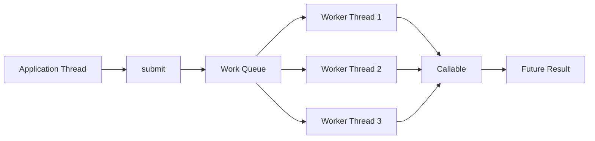
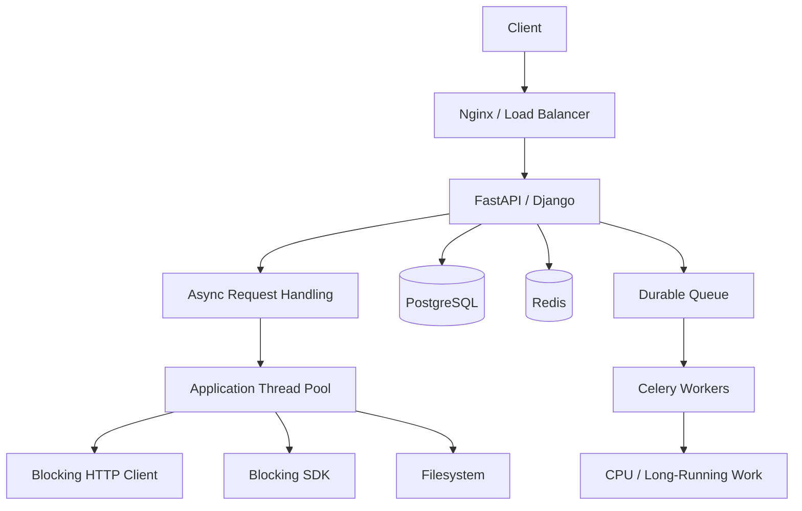

# 05- ThreadPool Executor

## Overview

`ThreadPoolExecutor` is the high-level Python interface for executing callable work concurrently using a reusable pool of worker threads.

It is provided by `concurrent.futures` and is generally preferable to manually creating and managing threads for application-level concurrency.

```python
from concurrent.futures import ThreadPoolExecutor
```

The fundamental model is:

```text
                ThreadPoolExecutor
                       │
              ┌────────┼────────┐
              ↓        ↓        ↓
           Worker 1  Worker 2  Worker 3
              │        │        │
              └────────┼────────┘
                       ↓
                 Shared process
                    memory
```

`ThreadPoolExecutor` is particularly useful for **I/O-bound work** and for integrating blocking synchronous libraries into applications that otherwise need concurrent execution.

It does not make CPU-bound pure Python code execute in parallel under traditional GIL-enabled CPython.

---

## Why ThreadPoolExecutor Exists

Managing threads manually creates lifecycle and coordination responsibilities:

```text
Manual threading
├── Create threads
├── Start threads
├── Track threads
├── Handle exceptions
├── Collect results
├── Coordinate shutdown
└── Limit concurrency
```

`ThreadPoolExecutor` provides a higher-level abstraction:

```text
Submit callable
      ↓
Executor
      ↓
Worker queue
      ↓
Reusable worker thread
      ↓
Future
      ↓
Result / exception
```

This separates application logic from low-level thread lifecycle management.

---

## Core Components

The main concepts are:

| Component | Purpose |
|---|---|
| `ThreadPoolExecutor` | Manages a pool of worker threads |
| `submit()` | Schedules one callable |
| `map()` | Applies a callable over an iterable |
| `Future` | Represents scheduled work |
| `result()` | Retrieves the result |
| `exception()` | Retrieves an exception |
| `cancel()` | Attempts to cancel pending work |
| `shutdown()` | Releases executor resources |

---

## Basic Usage

```python
from concurrent.futures import ThreadPoolExecutor


def fetch_customer(customer_id: int) -> dict:
    return customer_client.get(customer_id)


with ThreadPoolExecutor(max_workers=8) as executor:
    future = executor.submit(fetch_customer, 42)
    customer = future.result()
```

The `with` block ensures that the executor is shut down when the block exits.

---

## `max_workers`

`max_workers` controls the maximum number of worker threads that can execute tasks concurrently.

```python
executor = ThreadPoolExecutor(max_workers=16)
```

Conceptually:

```text
                 Task Queue
                     │
        ┌────────────┼────────────┐
        ↓            ↓            ↓
     Thread 1     Thread 2     Thread 3
        │            │            │
        └────────────┼────────────┘
                     ↓
              max_workers limit
```

A finite worker limit prevents the application from creating an uncontrolled number of threads.

The optimal value depends on:

- I/O wait time
- CPU availability
- task duration
- memory
- database capacity
- downstream rate limits
- connection pool sizes

---

## Default Worker Count

If `max_workers` is omitted, Python chooses a default based on the runtime's executor policy and available CPU information.

Do not rely on the default as a production capacity-planning decision.

Explicitly configure `max_workers` when:

- downstream services have strict limits
- database connections are constrained
- predictable resource usage matters
- the executor is part of a critical service path

The default is an implementation policy, not an application-specific capacity model.

---

## `submit()`

`submit()` schedules a single callable and returns a `Future`.

```python
from concurrent.futures import ThreadPoolExecutor


def fetch_order(order_id: int) -> dict:
    return order_client.get(order_id)


with ThreadPoolExecutor(max_workers=4) as executor:
    future = executor.submit(fetch_order, 1001)

    order = future.result()
```

The function is submitted immediately, but `result()` determines when the caller waits for completion.

---

## Futures

A `Future` represents work that may not have completed yet.

Its lifecycle can be viewed as:

```text
Pending
  ↓
Running
  ↓
Completed
  │
  └── Result

Running
  │
  └── Failed
       ↓
    Exception
```

Useful methods include:

```python
future.done()
future.running()
future.cancelled()
future.cancel()
future.result()
future.exception()
```

---

## Future Results

Calling:

```python
result = future.result()
```

waits until the task completes if it has not already finished.

If the worker function raises an exception, `result()` re-raises that exception in the calling thread.

```python
from concurrent.futures import ThreadPoolExecutor


def process() -> str:
    raise RuntimeError("processing failed")


with ThreadPoolExecutor(max_workers=4) as executor:
    future = executor.submit(process)

    try:
        future.result()
    except RuntimeError as exc:
        handle_failure(exc)
```

This makes failure handling explicit.

---

## Future Exceptions

Exceptions should not be silently ignored.

Bad:

```python
future = executor.submit(process)
```

with no later inspection of the future.

Better:

```python
future = executor.submit(process)

try:
    result = future.result()
except Exception:
    logger.exception("background operation failed")
    raise
```

For production systems, define whether worker failures should:

- fail the request
- trigger a retry
- be logged and ignored
- be sent to a dead-letter workflow
- mark a job as failed

---

## `map()`

`map()` is convenient when the same function must be applied to many inputs.

```python
from concurrent.futures import ThreadPoolExecutor


def fetch_customer(customer_id: int) -> dict:
    return customer_client.get(customer_id)


customer_ids = [101, 102, 103, 104]

with ThreadPoolExecutor(max_workers=4) as executor:
    customers = list(
        executor.map(
            fetch_customer,
            customer_ids,
        )
    )
```

It is useful when the input-output relationship is straightforward.

---

## `submit()` vs `map()`

| Feature | `submit()` | `map()` |
|---|---|---|
| One task at a time | Excellent | Less explicit |
| Different callables | Yes | No |
| Individual futures | Yes | Not directly exposed |
| Per-task error handling | Flexible | Less flexible |
| Preserve input ordering | Through explicit future handling | Yes |
| Dynamic scheduling | Excellent | Simpler abstraction |
| Complex workflows | Better | Less suitable |
| Simple bulk mapping | Good | Excellent |

Use `submit()` when individual task lifecycle and error handling matter.

Use `map()` when the workload is naturally a uniform function over an iterable.

---

## Execution Model

A simplified executor architecture is:



The executor manages worker threads and dispatches queued tasks to available workers.

The exact implementation details are runtime-specific and should not be treated as a stable internal API.

---

## Worker Reuse

A thread pool reuses worker threads rather than creating a new thread for every task.

Conceptually:

```text
Task A ──┐
Task B ──┼──> Thread 1
Task C ──┤
Task D ──┘

Task E ─────> Thread 1
```

This reduces repeated thread creation and teardown overhead.

It also makes bounded concurrency easier to enforce.

---

## Queueing Behavior

If all workers are busy:

```text
Task 1 → Worker 1
Task 2 → Worker 2
Task 3 → Worker 3
Task 4 → Worker 4

Task 5 → waiting in executor queue
Task 6 → waiting in executor queue
```

The queue absorbs additional submitted work.

This is useful, but unbounded submission can still create excessive memory usage.

A thread pool is not automatically a complete backpressure solution.

---

## Backpressure

Consider:

```text
Producer rate
      ↓
1000 tasks/sec

Worker capacity
      ↓
100 tasks/sec
```

If tasks continue accumulating:

```text
Queue
100
200
300
...
10000
...
```

memory and latency can increase.

Production systems should place explicit limits around task production.

Possible approaches include:

- bounded application queues
- semaphores
- rate limiting
- batch sizing
- load shedding
- durable external queues

---

## I/O-Bound Work

`ThreadPoolExecutor` is most commonly useful for I/O-bound workloads under traditional GIL-enabled CPython.

Examples:

```text
Thread 1 → HTTP request → waiting
Thread 2 → PostgreSQL → waiting
Thread 3 → Redis → waiting
Thread 4 → filesystem → waiting
```

While one thread waits, another can execute.

---

## Practical HTTP Example

Suppose an application must call multiple independent synchronous APIs.

```python
from concurrent.futures import ThreadPoolExecutor


def fetch_profile(user_id: int) -> dict:
    return profile_client.get(user_id)


def fetch_orders(user_id: int) -> list[dict]:
    return order_client.get_for_user(user_id)


def fetch_preferences(user_id: int) -> dict:
    return preference_client.get(user_id)


def build_user_view(user_id: int) -> dict:
    with ThreadPoolExecutor(max_workers=3) as executor:
        profile_future = executor.submit(
            fetch_profile,
            user_id,
        )
        orders_future = executor.submit(
            fetch_orders,
            user_id,
        )
        preferences_future = executor.submit(
            fetch_preferences,
            user_id,
        )

        return {
            "profile": profile_future.result(),
            "orders": orders_future.result(),
            "preferences": preferences_future.result(),
        }
```

The three independent operations can overlap.

---

## Latency Reduction

Suppose:

```text
Profile API      = 200 ms
Orders API       = 400 ms
Preferences API  = 300 ms
```

Sequential:

```text
200 + 400 + 300
≈ 900 ms
```

Concurrent:

```text
max(200, 400, 300)
≈ 400 ms
```

The actual result includes:

- network overhead
- connection acquisition
- serialization
- scheduling
- downstream queueing
- retries

Concurrency reduces the critical path only when operations are genuinely independent.

---

## Dependency Graphs

Thread pools are useful when work can be modeled as independent branches.

```text
                Request
                   │
           ┌───────┼───────┐
           ↓       ↓       ↓
        Profile  Orders  Billing
           │       │       │
           └───────┼───────┘
                   ↓
                Response
```

If:

```text
Orders → Billing
```

then those operations cannot safely execute independently.

Understanding dependency structure is more important than simply adding threads.

---

## Thread Pool and Database Connections

A common production configuration might be:

```text
Thread pool = 32
Database pool = 10
```

This means up to 32 application operations may run concurrently, but only 10 may hold database connections if the database pool is the limiting resource.

Potential behavior:

```text
32 threads
   ↓
10 database connections
   ↓
22 threads waiting
```

This can be perfectly valid, but excessive thread counts may increase memory and queueing without improving throughput.

---

## Thread Pool and HTTP Connections

The same principle applies to HTTP clients.

```text
Thread Pool
    ↓
HTTP Connection Pool
    ↓
External Service
```

If:

```text
threads = 50
HTTP connections = 10
```

the application may have substantial waiting for available connections.

Configure both pools intentionally.

---

## Thread Pool and Redis

Redis operations are usually I/O-bound.

A thread pool can overlap blocking Redis operations:

```python
with ThreadPoolExecutor(max_workers=8) as executor:
    results = list(
        executor.map(
            redis_client.get,
            cache_keys,
        )
    )
```

The Redis client's own connection-pool limits must also be considered.

---

## CPU-Bound Work

`ThreadPoolExecutor` is generally not the correct mechanism for CPU-bound pure Python work under traditional GIL-enabled CPython.

For example:

```python
def expensive_calculation(value: int) -> int:
    total = 0

    for number in range(value):
        total += number * number

    return total
```

Running many copies in a thread pool does not normally produce proportional multi-core Python execution.

Use:

```text
CPU-bound pure Python
        ↓
ProcessPoolExecutor
```

or an appropriate distributed worker architecture.

---

## GIL Consideration

Under traditional GIL-enabled CPython:

```text
ThreadPoolExecutor
        ↓
Multiple threads
        ↓
One thread executes Python bytecode at a time
```

This does not prevent concurrent I/O.

Native extensions may also release the GIL while performing suitable operations.

Modern CPython also provides optional free-threaded builds, so the exact threading behavior depends on the interpreter build and dependencies.

---

## ThreadPoolExecutor vs ProcessPoolExecutor

| Characteristic | `ThreadPoolExecutor` | `ProcessPoolExecutor` |
|---|---|---|
| Execution unit | Thread | Process |
| Memory | Shared | Separate |
| Startup overhead | Lower | Higher |
| Serialization | Usually not required | Often required |
| I/O-bound work | Excellent | Good |
| CPU-bound pure Python | Limited under traditional GIL | Excellent |
| Shared mutable state | Easy but risky | Explicit IPC |
| Failure isolation | Lower | Higher |
| Memory overhead | Lower | Higher |
| Typical backend use | Blocking I/O | CPU-heavy processing |

---

## `asyncio.to_thread()`

Modern asynchronous Python provides `asyncio.to_thread()` for running a blocking callable in a separate thread.

```python
import asyncio


async def get_customer(customer_id: int) -> dict:
    return await asyncio.to_thread(
        synchronous_customer_client.get,
        customer_id,
    )
```

This is often preferable to manually managing a thread pool for a small number of blocking calls inside async code.

The underlying default executor is still subject to resource limits and application behavior.

---

## Custom Executor with Asyncio

For dedicated resource isolation, an explicit executor can be useful.

```python
import asyncio
from concurrent.futures import ThreadPoolExecutor


blocking_executor = ThreadPoolExecutor(
    max_workers=16,
    thread_name_prefix="blocking-io",
)


def blocking_operation(value: int) -> int:
    return external_client.process(value)


async def process(value: int) -> int:
    loop = asyncio.get_running_loop()

    return await loop.run_in_executor(
        blocking_executor,
        blocking_operation,
        value,
    )
```

This can isolate a particular category of blocking work.

The executor should have a defined lifecycle and should not be created per request.

---

## FastAPI Integration

A FastAPI service may need to call a synchronous third-party SDK.

```python
import asyncio
from fastapi import FastAPI

app = FastAPI()


@app.get("/customer/{customer_id}")
async def customer(customer_id: int) -> dict:
    return await asyncio.to_thread(
        customer_client.get,
        customer_id,
    )
```

This keeps the blocking SDK call away from the event-loop thread.

For high-volume workloads, explicitly controlling the executor and downstream capacity may be preferable.

---

## Django Integration

Thread pools can be used to execute blocking work when appropriate, but Django's database and request lifecycle semantics must be respected.

Do not assume that Django objects, database connections, or arbitrary application state are safe to share across threads.

Follow the framework and database driver's concurrency guarantees.

---

## Thread-Local State

A worker thread can retain thread-local context across multiple tasks.

This is important because thread pools reuse threads.

For example:

```text
Task A → Thread 1
Task B → Thread 1
Task C → Thread 1
```

Application code must not assume a worker thread represents one request or one logical user.

Do not store request-specific state in ordinary thread-local or global variables unless lifecycle and cleanup are explicitly managed.

For modern async applications, `contextvars` is generally more appropriate for logical execution context.

---

## Request Context

A dangerous pattern is:

```python
current_user = None
```

followed by worker threads modifying that global variable.

Because threads share process memory, another task can observe incorrect state.

Prefer explicitly passing context:

```python
def process_order(
    order_id: int,
    tenant_id: str,
) -> None:
    ...
```

Explicit data flow is easier to reason about and test.

---

## Shared Mutable State

Thread pools make shared memory convenient.

They also make race conditions easy to introduce.

Bad:

```python
cache = {}

def update_cache(key: str, value: object) -> None:
    cache[key] = value
```

If multiple operations require compound state transitions, use appropriate synchronization or move state management to a system designed for concurrency.

---

## Locks with ThreadPoolExecutor

```python
import threading
from concurrent.futures import ThreadPoolExecutor


counter = 0
lock = threading.Lock()


def increment() -> None:
    global counter

    with lock:
        counter += 1


with ThreadPoolExecutor(max_workers=8) as executor:
    list(executor.map(lambda _: increment(), range(1000)))
```

The lock protects the shared state.

However, a database atomic update or queue-based architecture may be a better design depending on the actual requirement.

---

## Semaphores

A semaphore can enforce a stricter limit than the thread pool.

For example:

```python
import threading


api_semaphore = threading.Semaphore(5)


def call_partner_api(request: dict) -> dict:
    with api_semaphore:
        return partner_client.send(request)
```

This is useful when:

```text
Thread pool = 20
Partner API concurrency limit = 5
```

The executor controls worker capacity while the semaphore controls access to a particular resource.

---

## Nested Thread Pools

Avoid unnecessary nested executors.

Bad architecture:

```text
Request Thread
   ↓
ThreadPool A
   ↓
ThreadPool B
   ↓
External API
```

This can multiply concurrency unexpectedly.

Potential consequences include:

- thread explosion
- memory growth
- connection exhaustion
- difficult shutdown
- unpredictable latency

Prefer one clearly owned concurrency boundary per workload where possible.

---

## Creating an Executor Per Request

Avoid:

```python
def endpoint() -> dict:
    with ThreadPoolExecutor(max_workers=10) as executor:
        ...
```

when the endpoint is called at high volume.

If 100 requests arrive concurrently:

```text
100 requests
×
10 threads
=
up to 1000 worker threads
```

The exact behavior depends on scheduling and task duration, but the architecture clearly risks uncontrolled resource multiplication.

Prefer an application-scoped, bounded executor when appropriate.

---

## Application-Scoped Executor

A long-lived executor can be created during application initialization.

Conceptually:

```text
Application
    │
    └── ThreadPoolExecutor
          ├── Worker 1
          ├── Worker 2
          ├── ...
          └── Worker N
```

Requests submit work to the shared pool.

This provides predictable worker limits.

The executor should be shut down during application termination.

---

## Shutdown

An executor should be shut down cleanly.

```python
executor.shutdown(wait=True)
```

With:

```python
with ThreadPoolExecutor(...) as executor:
    ...
```

shutdown is handled automatically when leaving the context manager.

Graceful shutdown matters in:

- Kubernetes
- Docker
- ECS
- EC2
- CI/CD deployments

Important work should not depend on abruptly terminated threads.

---

## Cancellation

`Future.cancel()` can cancel a task that has not started.

```python
future = executor.submit(work)

cancelled = future.cancel()
```

If the task is already running, `cancel()` generally cannot safely stop arbitrary Python code.

This means:

```text
Pending task
→ may be cancelled

Running task
→ generally requires cooperative cancellation
```

Design long-running operations accordingly.

---

## Timeouts

A timeout can be applied when retrieving a result:

```python
from concurrent.futures import ThreadPoolExecutor, TimeoutError


with ThreadPoolExecutor(max_workers=4) as executor:
    future = executor.submit(fetch_customer, 42)

    try:
        customer = future.result(timeout=2.0)
    except TimeoutError:
        handle_timeout()
```

Important distinction:

```text
future.result(timeout=2)
```

limits how long the caller waits.

It does not forcibly terminate a running worker function.

For network operations, configure the actual HTTP/database client's timeout as well.

---

## Timeout Layering

A production request may have several timeout boundaries:

```text
Client timeout
    ↓
API request timeout
    ↓
Thread future wait timeout
    ↓
HTTP client timeout
    ↓
Database timeout
```

These should be consistent.

A lower-level operation should not remain active indefinitely after the caller has already abandoned the request.

---

## Retry Behavior

Do not automatically retry every failed future.

For example:

```text
Thread Pool
   ↓
100 requests
   ↓
External API outage
   ↓
100 failures
   ↓
100 immediate retries
```

This can create a retry storm.

Use:

- exponential backoff
- jitter
- bounded retry attempts
- idempotency
- dependency-specific retry policies

---

## Ordering

Thread pools execute tasks concurrently, so completion order may differ from submission order.

```text
Submitted:
A
B
C

Completed:
B
C
A
```

Do not assume execution order unless the design explicitly enforces it.

`executor.map()` returns results in input order even if individual tasks complete out of order.

---

## Dependency Ordering

If operations have dependencies:

```text
A → B → C
```

parallelizing them is incorrect.

Only independent operations should be submitted concurrently:

```text
       ┌── B
A ─────┤
       └── C
```

Concurrency should follow the application's dependency graph.

---

## Error Aggregation

For multiple independent operations, decide how partial failures should be handled.

Example:

```text
Profile → success
Orders  → success
Billing → failure
```

Possible policies:

| Policy | Use When |
|---|---|
| Fail entire request | All dependencies are required |
| Partial response | Some fields are optional |
| Fallback | Cached/default data is acceptable |
| Retry | Failure is transient |
| Async recovery | Work can complete later |

Thread pools provide execution mechanics; business-level failure policy remains application responsibility.

---

## `as_completed()`

`as_completed()` is useful when results should be processed as soon as individual tasks finish.

```python
from concurrent.futures import (
    ThreadPoolExecutor,
    as_completed,
)


with ThreadPoolExecutor(max_workers=8) as executor:
    futures = [
        executor.submit(fetch_customer, customer_id)
        for customer_id in customer_ids
    ]

    for future in as_completed(futures):
        customer = future.result()
        process_customer(customer)
```

This differs from waiting for results in submission order.

---

## `wait()`

`wait()` allows coordination over multiple futures.

```python
from concurrent.futures import (
    ThreadPoolExecutor,
    wait,
)


with ThreadPoolExecutor(max_workers=8) as executor:
    futures = [
        executor.submit(fetch_customer, customer_id)
        for customer_id in customer_ids
    ]

    done, pending = wait(futures)
```

It can be useful when the application needs to coordinate groups of tasks.

---

## `FIRST_COMPLETED` and `FIRST_EXCEPTION`

`wait()` supports different completion conditions.

```python
from concurrent.futures import (
    FIRST_COMPLETED,
    wait,
)


done, pending = wait(
    futures,
    return_when=FIRST_COMPLETED,
)
```

Other useful modes include:

```python
FIRST_EXCEPTION
ALL_COMPLETED
```

These are useful for coordination patterns such as:

- racing independent sources
- early failure detection
- waiting for all work

---

## Fan-Out / Fan-In

A common backend pattern is fan-out/fan-in.

```text
                 Request
                    │
                 Fan-out
              ┌─────┼─────┐
              ↓     ↓     ↓
             API A API B API C
              └─────┼─────┘
                    ↓
                 Fan-in
                    ↓
                 Response
```

`ThreadPoolExecutor` is well suited to this pattern when downstream clients are synchronous and the operations are independent.

---

## Fan-Out Risk

Fan-out increases downstream load.

If one request generates:

```text
5 outbound calls
```

and the service receives:

```text
1000 requests/sec
```

the theoretical outbound request rate can reach:

```text
5000 calls/sec
```

Concurrency should therefore be evaluated at the system level, not just at the Python process level.

---

## Bulkhead Isolation

Separate executors can isolate independent dependency classes.

```text
Application
│
├── Payment Executor
│      └── max 8
│
├── Search Executor
│      └── max 16
│
└── Notification Executor
       └── max 4
```

This prevents one slow dependency from consuming all worker capacity.

Use this pattern when resource isolation provides a clear reliability benefit. Do not create many executors without an operational reason.

---

## ThreadPoolExecutor and Celery

`ThreadPoolExecutor` is an **in-process** concurrency mechanism.

Celery is a **distributed background execution** system.

```text
ThreadPoolExecutor
→ inside one Python process

Celery
→ broker + distributed workers
```

Use `ThreadPoolExecutor` for short-lived local concurrent operations.

Use Celery when work requires:

- durability
- retries
- independent worker scaling
- long execution
- scheduled jobs
- crash recovery

---

## ThreadPoolExecutor and Kafka

Kafka provides durable event streaming and distributed consumer coordination.

`ThreadPoolExecutor` can sometimes be used for parallel processing after records are consumed, but offset and ordering semantics must be carefully designed.

Potential architecture:

```text
Kafka Consumer
      ↓
Bounded Work Submission
      ↓
ThreadPoolExecutor
      ↓
Processing
      ↓
Offset Management
```

Do not acknowledge messages before the application's processing and recovery semantics are correct.

---

## ThreadPoolExecutor and PostgreSQL

Thread pools can increase concurrent database operations, but PostgreSQL remains a finite resource.

Consider:

```text
Thread pool = 32
DB pool = 10
```

and:

```text
Kubernetes replicas = 6
```

Potential maximum database connections:

```text
6 × 10 = 60
```

Thread-pool sizing and database-pool sizing must therefore be considered together.

---

## ThreadPoolExecutor and Kubernetes

Concurrency multiplies across replicas.

Example:

```text
10 Pods
×
16 executor workers
=
160 potential executor threads
```

If every worker can call an external service, the downstream dependency may see a substantial increase in traffic.

Capacity planning should include:

```text
replicas
×
processes
×
thread-pool workers
×
connections
```

---

## ThreadPoolExecutor and Docker

Container CPU and memory limits constrain useful concurrency.

For example:

```text
Container:
CPU = 1 core
Memory = 512 MiB

Thread pool:
max_workers = 100
```

This does not provide 100 CPU cores.

If the work is CPU-bound, the threads compete for limited CPU capacity and traditional GIL-enabled CPython further limits Python-bytecode parallelism.

For blocking I/O, a larger thread count may still be appropriate, but it must be load-tested.

---

## Thread Naming

Use `thread_name_prefix` for better diagnostics.

```python
from concurrent.futures import ThreadPoolExecutor


executor = ThreadPoolExecutor(
    max_workers=16,
    thread_name_prefix="external-api",
)
```

Logs can then distinguish executor activity more easily.

This is valuable when multiple thread pools exist.

---

## Logging

Include useful execution context in logs.

For example:

```python
import logging
import threading


logger = logging.getLogger(__name__)


def process_order(order_id: int) -> None:
    logger.info(
        "processing order",
        extra={
            "order_id": order_id,
            "thread": threading.current_thread().name,
        },
    )
```

Avoid logging sensitive request data merely because it is convenient for debugging.

---

## Metrics

Useful thread-pool metrics include:

- active workers
- submitted tasks
- completed tasks
- task execution duration
- task wait duration
- failures
- timeouts
- downstream latency

A particularly useful distinction is:

```text
Queue wait time
+
Execution time
=
Observed task latency
```

High queue wait time indicates executor saturation.

---

## Event-Loop Impact

When using a thread pool from an async service:

```text
Event Loop
   ↓
Thread Pool
   ↓
Blocking Work
```

the thread pool protects the event loop from blocking synchronous operations.

However, if the thread pool is saturated:

```text
Async tasks
   ↓
Thread pool
   ↓
All workers busy
   ↓
Tasks waiting
```

the async application can still experience increased latency.

The thread pool is not an unlimited escape hatch for blocking work.

---

## Performance Characteristics

Thread pools have overhead.

For each task, there can be:

```text
Task submission
+
Queueing
+
Thread scheduling
+
Function execution
+
Result synchronization
```

For extremely small tasks, this overhead can exceed the work itself.

Prefer thread pools when tasks are sufficiently expensive, especially when they contain meaningful I/O waiting.

---

## Amdahl's Law

Concurrency improves only the portion of a workload that can actually overlap.

Suppose:

```text
80% = parallelizable I/O
20% = sequential processing
```

Even infinite concurrency cannot eliminate the sequential portion.

In practice, additional constraints include:

- downstream capacity
- connection pools
- locks
- CPU
- memory
- network bandwidth

Concurrency therefore has diminishing returns.

---

## Little's Law

For stable systems, Little's Law provides a useful capacity relationship:

```text
L = λW
```

where:

- `L` = average number of items in the system
- `λ` = throughput
- `W` = average time in the system

For a thread pool:

```text
More concurrency
→ potentially more in-flight work
```

but increasing in-flight work does not automatically increase throughput.

If the downstream dependency is already saturated, it mainly increases queueing and latency.

---

## Memory Considerations

Each thread consumes resources.

Large thread pools can therefore increase:

- virtual memory
- stack-related memory
- scheduler overhead
- object references
- task queue memory

The queued tasks themselves may retain large objects.

For example:

```python
for document in huge_documents:
    executor.submit(process, document)
```

can keep many documents alive while waiting for workers.

Use bounded submission or batching for large workloads.

---

## Bounded Submission

A semaphore can constrain outstanding tasks.

```python
import threading
from concurrent.futures import ThreadPoolExecutor


limit = threading.Semaphore(100)


def submit_limited(
    executor: ThreadPoolExecutor,
    function,
    *args,
):
    limit.acquire()

    def run():
        try:
            return function(*args)
        finally:
            limit.release()

    return executor.submit(run)
```

For complex systems, prefer clearer queue-based or producer-consumer designs rather than building increasingly complicated executor wrappers.

---

## Producer-Consumer Architecture

A robust architecture separates production from execution:

```text
Producer
   ↓
Bounded Queue
   ↓
ThreadPoolExecutor
   ↓
Workers
   ↓
Dependency
```

This allows explicit control over:

- queue size
- concurrency
- rejection behavior
- throughput
- backpressure

For durable work, replace the in-memory queue with an external durable queue.

---

## Exception Handling Strategy

A production executor should define exception semantics.

Example:

```python
from concurrent.futures import ThreadPoolExecutor


def process(item: int) -> int:
    if item < 0:
        raise ValueError("invalid item")

    return item * 2


with ThreadPoolExecutor(max_workers=8) as executor:
    futures = [
        executor.submit(process, item)
        for item in items
    ]

    for future in futures:
        try:
            result = future.result()
        except ValueError:
            logger.exception("item processing failed")
```

The important point is not the syntax but the policy for failed work.

---

## Security Considerations

Thread pools can amplify security-sensitive operations.

Potential problems include:

- concurrent authorization checks
- duplicate financial operations
- race conditions in rate limits
- concurrent cache updates
- tenant-state corruption

Do not use a thread pool as a substitute for transactional correctness.

For security-sensitive state, use authoritative controls such as:

- PostgreSQL transactions
- unique constraints
- atomic updates
- idempotency keys
- Redis atomic operations where appropriate

---

## Reliability Considerations

In-process thread pools are ephemeral.

If the process crashes:

```text
Process crash
    ↓
Thread pool disappears
    ↓
In-flight tasks disappear
```

Therefore, do not use `ThreadPoolExecutor` as a durable job queue.

For important work:

```text
API
 ↓
Durable queue
 ↓
Worker
 ↓
Persistent state
```

provides stronger recovery semantics.

---

## High Availability

Thread pools do not provide high availability by themselves.

A production service should typically rely on:

```text
Load Balancer
    ↓
Multiple application instances
    ↓
Independent thread pools
```

If one instance fails, other instances can continue serving traffic.

Important state must live outside process memory when it needs to survive instance failure.

---

## Disaster Recovery

Thread-pool state should not be part of a disaster-recovery strategy.

Persist important work in:

- PostgreSQL
- Kafka
- SQS
- Celery-backed queues
- durable object storage

A restarted service should be able to reconstruct or safely retry required work.

---

## Common Mistakes

### Creating an Executor Per Request

This can create massive thread counts under load.

Prefer a shared, bounded executor when appropriate.

### Using an Unlimited Worker Count

More threads do not imply more throughput.

### Using Threads for CPU-Bound Python

Traditional GIL-enabled CPython does not provide the expected Python-bytecode parallelism.

### Ignoring the Task Queue

Submitting millions of tasks can create memory pressure even when worker count is bounded.

### Calling `future.result()` Immediately

This:

```python
future = executor.submit(work)
result = future.result()
```

may provide little concurrency if repeated sequentially.

Submit independent tasks first, then collect results.

### Ignoring Exceptions

Worker exceptions surface through futures and can otherwise be missed.

### Assuming `cancel()` Stops Running Work

It generally cannot forcibly terminate arbitrary running Python code.

### Holding Locks During Network I/O

This can serialize unrelated work and create severe contention.

### Creating Nested Executors

Nested pools can unexpectedly multiply concurrency.

### Using ThreadPoolExecutor for Durable Jobs

Thread pools do not provide persistent job recovery.

---

## Production Pitfalls

### Downstream Overload

A larger pool can overwhelm an external service.

### Database Exhaustion

More concurrent threads can increase database connection demand.

### Queue Memory Growth

A bounded worker pool does not necessarily mean bounded queued work.

### Retry Storms

Concurrent retries can amplify an outage.

### Thread Leakage

Long-running tasks or poorly managed executors can prevent expected shutdown behavior.

### Hidden Blocking

A worker may block much longer than expected due to network or dependency failures.

### Request Cancellation Mismatch

The HTTP request may be cancelled while the worker thread continues executing.

The application must decide whether that background operation should continue or whether the architecture should use durable job processing.

---

## Best Practices

- Use `ThreadPoolExecutor` primarily for I/O-bound work and blocking synchronous libraries.
- Prefer `concurrent.futures` over manually managing large numbers of threads.
- Set an explicit `max_workers` when production capacity needs to be predictable.
- Create long-lived executors at an appropriate application scope rather than per request.
- Use `thread_name_prefix` for operational visibility.
- Collect and handle `Future` exceptions explicitly.
- Use `as_completed()` when completion order matters more than submission order.
- Use `map()` for simple uniform bulk operations.
- Use `submit()` for tasks requiring individual lifecycle or failure handling.
- Configure actual HTTP/database timeouts in addition to future wait timeouts.
- Keep thread-pool concurrency aligned with downstream connection and rate limits.
- Use semaphores or dedicated pools for dependency-specific concurrency limits.
- Minimize shared mutable state.
- Keep lock scope small.
- Avoid holding locks during slow I/O.
- Bound task production for large workloads.
- Avoid nested executors unless resource isolation is intentional.
- Do not use thread pools as durable background-job infrastructure.
- Use Celery, Kafka, SQS, or another durable mechanism when work must survive process failure.
- Implement graceful executor shutdown.
- Monitor worker utilization, queueing, execution latency, failures, and timeouts.
- Load-test thread-pool configuration against realistic downstream limits.
- Use process-based or distributed execution for CPU-heavy pure Python workloads under traditional GIL-enabled CPython.

---

## Interview Traps

| Question | Correct Reasoning |
|---|---|
| What does `ThreadPoolExecutor` provide? | A high-level API for managing reusable worker threads |
| Does `max_workers` mean exactly that many threads always execute? | No; it bounds the maximum worker count |
| What happens when all workers are busy? | Additional submitted tasks wait in the executor's work queue |
| Does a thread pool provide durable task storage? | No |
| Does `future.result(timeout=2)` kill the task after two seconds? | No |
| Does `Future.cancel()` stop a running function? | Generally no |
| Is `ThreadPoolExecutor` ideal for CPU-bound pure Python? | Generally no under traditional GIL-enabled CPython |
| Is it useful for blocking HTTP calls? | Yes |
| Does the GIL prevent threads from overlapping I/O? | No |
| Does `map()` return results in completion order? | No; results are yielded in input order |
| When is `submit()` preferable to `map()`? | When individual task control, futures, or error handling is required |
| Should an executor normally be created for every request? | No |
| Can one request's thread pool configuration affect downstream capacity? | Yes |
| Can multiple Kubernetes pods each have their own thread pool? | Yes |
| Does a process-local thread pool coordinate with other pods? | No |

---

## Production Architecture

A common backend architecture is:



The thread pool has a deliberately narrow role:

```text
Short-lived blocking work
        ↓
Bounded executor
        ↓
Return result
```

Long-running or durable work belongs outside the request process.

---

## Production Configuration Example

A service may centralize executor configuration:

```python
from concurrent.futures import ThreadPoolExecutor


blocking_io_executor = ThreadPoolExecutor(
    max_workers=16,
    thread_name_prefix="blocking-io",
)
```

The value `16` should come from capacity analysis rather than a generic recommendation.

Consider:

```text
CPU
Memory
Database pool
HTTP connection pool
Downstream rate limits
Request volume
Average I/O wait
p95/p99 latency
```

---

## Lifecycle Management

For an application-managed executor:

```python
from concurrent.futures import ThreadPoolExecutor


class ApplicationResources:
    def __init__(self) -> None:
        self.blocking_executor = ThreadPoolExecutor(
            max_workers=16,
            thread_name_prefix="blocking-io",
        )

    def close(self) -> None:
        self.blocking_executor.shutdown(
            wait=True,
        )
```

The application lifecycle should call `close()` during graceful shutdown.

Framework-specific startup and shutdown hooks should own this lifecycle rather than relying on implicit global behavior.

---

## Capacity Planning Example

Suppose:

```text
Kubernetes replicas = 6
Thread pool = 16 workers
HTTP connections = 20 per pod
Database connections = 10 per pod
```

Potential executor threads:

```text
6 × 16 = 96 threads
```

Potential database connections:

```text
6 × 10 = 60 connections
```

Potential HTTP connections:

```text
6 × 20 = 120 connections
```

These numbers must be compared with:

- PostgreSQL `max_connections`
- Redis capacity
- external API limits
- network capacity
- pod CPU/memory limits

This multiplication effect is one of the most important production considerations for thread pools.

---

## Decision Framework

Use the following process:

```text
Is the work blocking?
      │
      ├── No
      │    └── Prefer normal or async execution
      │
      └── Yes
           │
           ├── I/O-bound?
           │      └── ThreadPoolExecutor
           │
           └── CPU-bound?
                  │
                  ├── Pure Python
                  │      └── ProcessPoolExecutor / workers
                  │
                  └── Native code
                         └── Benchmark GIL behavior
```

Then ask:

```text
Is the work durable?
    │
    ├── Yes → Queue / Celery / Kafka
    └── No  → In-process executor may be appropriate
```

---

## When to Use ThreadPoolExecutor

Use it when:

- work is blocking and I/O-bound
- synchronous libraries must be integrated
- tasks are relatively short-lived
- process-local execution is sufficient
- bounded concurrency is useful
- results are needed by the current application

Typical examples:

- synchronous HTTP clients
- blocking cloud SDK operations
- filesystem operations
- legacy APIs
- independent service calls

---

## When Not to Use ThreadPoolExecutor

Avoid it as the primary mechanism when:

- work is CPU-bound pure Python
- tasks must survive process crashes
- work takes minutes or hours
- reliable retries are required
- execution must scale independently
- the workload requires durable queue semantics

Prefer:

```text
CPU-heavy
→ processes / dedicated workers

Durable background work
→ Celery / SQS / Kafka / worker architecture

High-volume async I/O
→ asyncio
```

---

## Production Checklist

Before deploying a `ThreadPoolExecutor` workload:

- [ ] Workload has been classified as I/O-bound or CPU-bound.
- [ ] `max_workers` has been explicitly evaluated.
- [ ] Executor lifecycle is owned by the application.
- [ ] Executor is not unnecessarily created per request.
- [ ] Task submission is bounded where necessary.
- [ ] Queue growth has been considered.
- [ ] Worker memory usage has been measured.
- [ ] HTTP connection-pool capacity has been considered.
- [ ] PostgreSQL connection-pool capacity has been considered.
- [ ] Redis connection-pool capacity has been considered.
- [ ] External API rate limits have been considered.
- [ ] Timeouts exist at the actual I/O layer.
- [ ] Future wait timeouts are used where appropriate.
- [ ] Worker exceptions are explicitly handled.
- [ ] Cancellation semantics are understood.
- [ ] Shared mutable state has been reviewed.
- [ ] Locks are necessary and their critical sections are small.
- [ ] Nested executors have been avoided unless intentional.
- [ ] Retry policies use bounded attempts and backoff.
- [ ] Side-effecting operations are idempotent where necessary.
- [ ] Thread names support operational debugging.
- [ ] Metrics capture task latency and executor saturation.
- [ ] Graceful shutdown has been tested.
- [ ] Kubernetes replica multiplication is included in capacity calculations.
- [ ] CPU-bound workloads have been evaluated for process-based execution.
- [ ] Durable work is handled by an appropriate queue or worker system.
- [ ] Load testing has validated the selected concurrency level.

## Key Takeaways

- **`ThreadPoolExecutor` is a high-level, bounded mechanism for reusable worker threads:** it is particularly effective for blocking I/O and synchronous library integrations.
- **`max_workers` is a capacity-control mechanism, not a performance guarantee:** the correct value depends on I/O wait time, memory, CPU, database pools, connection pools, and downstream limits.
- **Futures provide explicit task lifecycle and failure handling:** use `submit()`, `result()`, `as_completed()`, and related APIs according to the required coordination semantics.
- **Thread pools are not durable job infrastructure:** important background work that must survive process failure should use Celery, SQS, Kafka, or another durable execution architecture.
- **Production concurrency must be modeled end-to-end:** Kubernetes replicas, processes, thread pools, database connections, HTTP connections, retries, and downstream rate limits can multiply load far beyond the configured thread count of one process.