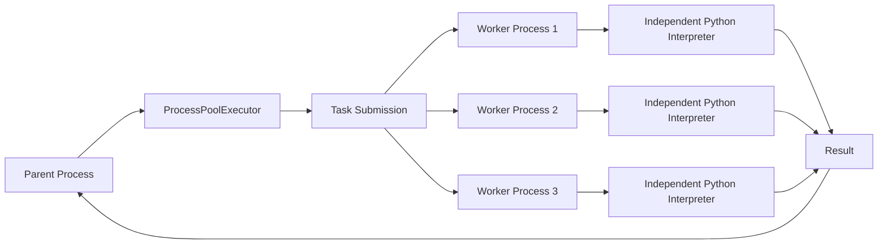
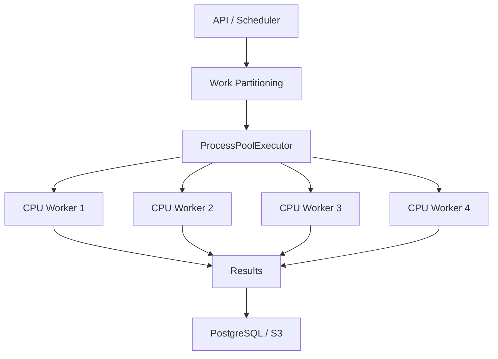

# 06- Multiprocessing

## Overview

Python multiprocessing provides **process-based parallelism** by executing work in separate operating-system processes.

Unlike threads, separate processes have independent Python interpreters and memory spaces. Under traditional GIL-enabled CPython, this allows CPU-bound Python code to execute across multiple CPU cores.

The primary standard-library APIs are:

```python
import multiprocessing
from concurrent.futures import ProcessPoolExecutor
```

The high-level `ProcessPoolExecutor` API is usually the preferred choice for application code that needs parallel execution of independent CPU-bound tasks.

```text
                    Application
                        │
                ProcessPoolExecutor
                        │
          ┌─────────────┼─────────────┐
          ↓             ↓             ↓
      Process 1     Process 2     Process 3
          │             │             │
      Python VM      Python VM      Python VM
          │             │             │
       CPU Core      CPU Core      CPU Core
```

Multiprocessing is most valuable when:

- work is CPU-bound
- tasks are sufficiently expensive to justify process overhead
- tasks can be executed independently
- inputs and outputs can be serialized
- process-level isolation is useful

It is not a universal replacement for threads or `asyncio`.

---

## Why Multiprocessing Exists

Traditional Python threads are useful for overlapping I/O, but traditional GIL-enabled CPython limits simultaneous execution of Python bytecode within one interpreter.

Processes provide a different execution model:

```text
Threads

Process
├── Thread 1 ──┐
├── Thread 2 ──┼── Shared interpreter
└── Thread 3 ──┘
                 ↓
             GIL applies


Processes

Process 1 ── Python interpreter ── CPU core
Process 2 ── Python interpreter ── CPU core
Process 3 ── Python interpreter ── CPU core
```

Each process has its own interpreter and address space.

This makes processes appropriate for CPU-intensive workloads that can be partitioned into independent units.

---

## Process vs Thread

| Characteristic | Process | Thread |
|---|---|---|
| Memory | Separate | Shared |
| Python interpreter | Separate | Shared within process |
| Traditional GIL | Independent per process | Shared within interpreter |
| CPU-bound Python | Strong fit | Limited |
| I/O-bound work | Possible | Strong fit |
| Communication | IPC / serialization | Shared memory |
| Startup cost | Higher | Lower |
| Memory overhead | Higher | Lower |
| Failure isolation | Stronger | Weaker |
| Shared mutable state | Difficult | Easy but risky |
| Typical API | `ProcessPoolExecutor` | `ThreadPoolExecutor` |

---

## Core Multiprocessing APIs

Python provides two major levels of abstraction.

### `multiprocessing`

The lower-level API provides direct process management:

```python
from multiprocessing import Process
```

It includes primitives such as:

- `Process`
- `Queue`
- `Pipe`
- `Pool`
- `Event`
- `Lock`
- `Semaphore`
- shared-memory facilities

### `concurrent.futures`

The higher-level API provides:

```python
from concurrent.futures import ProcessPoolExecutor
```

It provides an executor/future model consistent with `ThreadPoolExecutor`.

For most application-level parallel task execution, `ProcessPoolExecutor` is easier to reason about.

---

## Basic Process

A process can be created directly:

```python
from multiprocessing import Process


def process_file(path: str) -> None:
    print(f"Processing {path}")


process = Process(
    target=process_file,
    args=("input.csv",),
)

process.start()
process.join()
```

This gives explicit lifecycle control:

```text
Create
  ↓
start()
  ↓
Running
  ↓
join()
  ↓
Finished
```

Direct `Process` usage is useful when process lifecycle and IPC need to be controlled explicitly.

---

## ProcessPoolExecutor

For independent parallel tasks, prefer:

```python
from concurrent.futures import ProcessPoolExecutor


def calculate(value: int) -> int:
    return value * value


with ProcessPoolExecutor(max_workers=4) as executor:
    results = list(
        executor.map(calculate, range(100))
    )
```

The executor manages worker processes and distributes submitted tasks among them.

---

## Process Pool Architecture



The parent process coordinates work while worker processes perform the actual computation.

The implementation uses operating-system and runtime mechanisms for process creation and inter-process communication.

---

## `max_workers`

`max_workers` controls the maximum number of worker processes.

```python
executor = ProcessPoolExecutor(
    max_workers=4,
)
```

For CPU-bound workloads, worker count is commonly related to available CPU capacity.

However, the correct value depends on:

- number of CPU cores
- CPU quota
- task characteristics
- memory per process
- native libraries
- database access
- external I/O
- container limits

Do not assume that more processes always produce more throughput.

---

## CPU Capacity

Suppose a Kubernetes pod has:

```text
CPU limit = 2 cores
Process pool = 16
```

Sixteen processes cannot provide sixteen cores.

They will compete for the two CPU cores, causing:

- context switching
- scheduling overhead
- increased latency
- potentially lower throughput

Container CPU limits must therefore be part of process-pool sizing.

---

## CPU-Bound Work

A good multiprocessing workload has substantial CPU work.

Examples include:

- CPU-heavy data transformations
- image processing
- compression
- cryptographic computation
- parsing large computationally expensive structures
- scientific calculations
- CPU-heavy ETL transformations

Example:

```python
def transform_partition(values: list[int]) -> int:
    total = 0

    for value in values:
        for _ in range(1000):
            total += value * value

    return total
```

Independent partitions can be processed in separate processes.

---

## Parallel Partitioning

A common architecture is:

```text
Large Dataset
      │
      ├── Partition A → Process 1
      ├── Partition B → Process 2
      ├── Partition C → Process 3
      └── Partition D → Process 4
                         │
                         ↓
                      Aggregate
```

The workload should be partitioned so that each unit can execute independently.

Poor partitioning can cause:

- load imbalance
- excessive serialization
- synchronization overhead
- memory duplication
- idle workers

---

## Amdahl's Law

Multiprocessing cannot eliminate sequential work.

Suppose:

```text
90% of workload = parallelizable
10% = sequential
```

Even with many processes, the sequential portion remains a bottleneck.

Other real-world limits include:

- serialization
- IPC
- disk throughput
- network bandwidth
- memory bandwidth
- database throughput
- synchronization

Parallelism should therefore be measured end-to-end.

---

## Task Granularity

Very small tasks may perform worse with multiprocessing.

For example:

```text
Task:
value + 1
```

The computation may take less time than:

```text
serialize input
+
send to worker
+
schedule process
+
execute
+
serialize result
+
send result back
```

Use sufficiently coarse tasks.

Good candidates are operations where CPU execution time is large relative to process communication overhead.

---

## Serialization

Separate processes cannot directly access the parent's normal Python objects.

Arguments and results generally need to cross a process boundary.

Conceptually:

```text
Parent
  │
  │ serialize
  ↓
IPC
  │
  ↓
Worker
  │
  │ deserialize
  ↓
Python object
```

This creates both CPU and memory overhead.

Objects submitted to a process pool therefore need to be compatible with the executor's serialization mechanism.

---

## Pickle

Python multiprocessing commonly uses pickle-based serialization for transferring Python objects between processes.

Example:

```python
from concurrent.futures import ProcessPoolExecutor


def process_record(record: dict) -> dict:
    return {
        "id": record["id"],
        "processed": True,
    }


records = [
    {"id": 1},
    {"id": 2},
]

with ProcessPoolExecutor(max_workers=2) as executor:
    results = list(
        executor.map(process_record, records)
    )
```

The records and results cross process boundaries.

Avoid unnecessarily large objects because serialization can become a major bottleneck.

---

## Picklability

Functions submitted to a process pool should generally be defined at module scope.

Prefer:

```python
def transform(value: int) -> int:
    return value * 2
```

Avoid relying on:

```python
lambda value: value * 2
```

or deeply nested/local functions for process-pool execution.

Closures can also be problematic because their captured state may not serialize as expected.

---

## `if __name__ == "__main__"`

Multiprocessing code should protect process-launching logic:

```python
from concurrent.futures import ProcessPoolExecutor


def calculate(value: int) -> int:
    return value * value


def main() -> None:
    with ProcessPoolExecutor(max_workers=4) as executor:
        results = list(
            executor.map(calculate, range(100))
        )

    print(results)


if __name__ == "__main__":
    main()
```

This is especially important with the `spawn` process-start method.

Without the guard, child processes may recursively execute module-level process-creation code.

---

## Process Start Methods

Python supports different process-start mechanisms depending on the platform and runtime configuration.

The important models are:

| Method | Characteristics |
|---|---|
| `spawn` | Starts a fresh interpreter |
| `fork` | Child inherits the parent's memory state using OS fork semantics |
| `forkserver` | Uses a dedicated fork server to create workers |

The availability and default behavior vary by operating system and Python version.

Do not build production behavior around assumptions about a particular start method.

---

## `spawn`

With `spawn`:

```text
Parent
  │
  └── Start fresh Python interpreter
          ↓
       Import module
          ↓
       Initialize worker
```

Advantages include cleaner process state.

Costs include:

- higher startup overhead
- module import overhead
- stricter serialization requirements
- careful main-guard requirements

---

## `fork`

With `fork` on supported Unix-like systems:

```text
Parent Process
      │
    fork()
      │
      ├── Parent
      └── Child
```

The child initially inherits the parent's address space using copy-on-write semantics.

This can be efficient, but forking a process that already contains complex multithreaded runtime state or libraries with thread-related resources can create correctness risks.

Modern Python applications should deliberately evaluate start-method behavior rather than assuming `fork` is always safest or fastest.

---

## Copy-on-Write

After a fork:

```text
Parent Memory
     │
     ├──────────→ Parent
     │
     └──────────→ Child
```

Pages can initially be shared physically.

When a process modifies a page:

```text
Shared page
   ↓
Write
   ↓
Copy page
   ↓
Independent memory
```

This is copy-on-write.

It can reduce initial memory duplication, but large mutable workloads can eventually cause substantial memory usage.

---

## Memory Isolation

Processes have independent address spaces.

```text
Process A
├── Python heap
├── globals
└── objects

Process B
├── Python heap
├── globals
└── objects
```

Changing:

```python
counter += 1
```

in Process A does not change Process B's `counter`.

This isolation is useful for safety and parallelism but requires explicit communication.

---

## Shared State

Unlike threads, processes do not normally share Python objects.

If processes need shared state, use explicit mechanisms such as:

- queues
- pipes
- shared memory
- managers
- external databases
- Redis
- Kafka

For backend systems, external durable or transactional state is often preferable to complicated process-shared state.

---

## Inter-Process Communication

Common IPC mechanisms include:

```text
Process
├── Queue
├── Pipe
├── Shared Memory
├── Manager
└── External service
```

The choice depends on:

- data size
- latency
- durability
- synchronization requirements
- failure semantics

---

## Multiprocessing Queue

A queue can provide producer-consumer communication.

```python
from multiprocessing import Process, Queue


def worker(queue: Queue) -> None:
    while True:
        item = queue.get()

        if item is None:
            break

        process(item)


queue = Queue()

process = Process(
    target=worker,
    args=(queue,),
)

process.start()

for item in items:
    queue.put(item)

queue.put(None)
process.join()
```

Queues are useful for explicit process coordination, but large queues can still consume substantial memory.

---

## ProcessPoolExecutor vs Queue-Based Workers

| Requirement | ProcessPoolExecutor | Explicit multiprocessing queue |
|---|---|---|
| Simple CPU task parallelism | Excellent | More code |
| Futures/results | Excellent | Manual |
| Custom worker lifecycle | Limited | Excellent |
| Complex IPC | Limited | Excellent |
| Simple fan-out | Excellent | Good |
| Durable work | No | No |
| Distributed workers | No | No |

For ordinary CPU parallelism, prefer `ProcessPoolExecutor`.

For complex local process orchestration, lower-level multiprocessing primitives may be appropriate.

---

## Shared Memory

Python provides shared-memory facilities for specialized workloads.

Shared memory can reduce serialization overhead for large data structures.

However, it introduces synchronization and lifecycle complexity.

Use it when profiling demonstrates that serialization or copying is a meaningful bottleneck.

Do not use shared memory merely because it sounds faster.

---

## Database Access

Each process has independent Python-level database state.

Do not create a database connection in the parent and assume that child processes can safely reuse it.

Prefer establishing connections inside worker processes when database access is genuinely required.

For example:

```python
def process_partition(partition_id: int) -> int:
    connection = create_database_connection()

    try:
        return process_partition_data(
            connection,
            partition_id,
        )
    finally:
        connection.close()
```

In practice, a database should rarely be used as a coordination mechanism for high-volume CPU workers without careful capacity planning.

---

## PostgreSQL Capacity

Suppose:

```text
Kubernetes replicas = 4
Processes per pod = 4
```

Potential worker processes:

```text
4 × 4 = 16
```

If every process opens a database connection:

```text
16 database connections
```

Additional application connections may increase this further.

Process concurrency must therefore be included in database connection planning.

---

## Redis

Redis clients and connections should not be blindly shared across process boundaries.

Create process-safe client resources according to the client's documented multiprocessing behavior.

For CPU-heavy workloads, avoid making Redis access part of every tight computational loop if it can be replaced with local input preparation and batched output.

---

## External APIs

Multiprocessing is generally not the first choice for ordinary API calls.

For:

```text
HTTP request
→ wait
→ response
```

threads or `asyncio` are usually more appropriate.

Multiprocessing adds:

- process overhead
- serialization
- more memory
- more complex lifecycle

Use processes when the API operation is combined with substantial CPU work.

---

## CPU + I/O Pipelines

A useful architecture can combine models:

```text
Async / Threaded I/O
        ↓
Fetch data
        ↓
ProcessPoolExecutor
        ↓
CPU-heavy transformation
        ↓
Persist results
```

This separates concurrency models according to workload characteristics.

---

## FastAPI

A FastAPI application should not perform expensive CPU-bound work directly on its event-loop thread.

Conceptually:

```text
HTTP Request
     ↓
FastAPI
     ↓
Process Pool
     ↓
CPU-heavy computation
     ↓
Result
     ↓
HTTP Response
```

For significant or long-running workloads, a durable background-job architecture is usually better than keeping the HTTP request open.

---

## Django

Django applications can use process pools for CPU-heavy operations, but application state, database connections, caches, and framework lifecycle must be treated carefully across process boundaries.

Do not assume arbitrary Django objects are safely transferable between processes.

Pass simple data structures where possible and establish process-local resources inside workers.

---

## Process Pools in Web Servers

A common architecture mistake is:

```text
Nginx
  ↓
Web Server
  ↓
Each Request
  ↓
Creates multiple processes
```

If the web server already runs multiple application workers, creating additional process pools inside every worker can multiply resource usage.

For example:

```text
4 web workers
×
4 process-pool workers
=
16 CPU workers
```

This may already oversubscribe a 4-core container.

Capacity must be modeled across the entire process hierarchy.

---

## Kubernetes

Kubernetes adds another multiplication layer.

Suppose:

```text
Pods              = 6
Web processes     = 2 per pod
Process pool      = 4 per web process
```

Potential processes:

```text
6 × 2 × 4 = 48
```

If the pod has only:

```text
CPU = 2 cores
```

the configuration is likely heavily oversubscribed for CPU-bound work.

Use container CPU requests and limits when sizing process pools.

---

## CPU Requests and Limits

A production deployment might specify:

```yaml
resources:
  requests:
    cpu: "2"
    memory: "1Gi"
  limits:
    cpu: "2"
    memory: "2Gi"
```

The process-pool configuration should be evaluated against the actual CPU limit, not the physical CPU count of the Kubernetes node.

---

## Memory Multiplication

Processes have separate memory spaces.

Suppose:

```text
One process = 500 MiB
Workers = 8
```

A rough upper-bound model is:

```text
8 × 500 MiB = 4 GiB
```

Actual memory behavior depends on:

- shared pages
- copy-on-write
- allocator behavior
- imported libraries
- workload mutations

Still, process count must be treated as a memory-scaling factor.

---

## Worker Initialization

Use an initializer when every worker needs process-local setup.

For example:

```python
from concurrent.futures import ProcessPoolExecutor


def initialize_worker() -> None:
    configure_logging()
    initialize_metrics()


def process_item(item: int) -> int:
    return expensive_operation(item)


with ProcessPoolExecutor(
    max_workers=4,
    initializer=initialize_worker,
) as executor:
    results = list(
        executor.map(process_item, items)
    )
```

Initialization should be lightweight and safe to repeat for each worker.

---

## Process Failure

Processes provide stronger failure isolation than threads.

If one worker crashes:

```text
Process Pool
├── Worker 1 → healthy
├── Worker 2 → crashed
├── Worker 3 → healthy
└── Worker 4 → healthy
```

The executor can detect broken worker state, but application-level recovery still needs to be designed.

Do not assume that all in-flight work will automatically be recovered exactly once.

---

## Broken Process Pools

A process pool can become unusable if worker processes terminate unexpectedly.

Applications should treat executor failure as a significant infrastructure event.

Potential recovery strategies include:

- recreate the executor
- retry idempotent work
- mark a batch as failed
- persist progress
- move durable work to an external queue

---

## Cancellation

As with thread pools, cancelling a future does not mean arbitrary running Python code can be forcibly terminated safely.

```python
future.cancel()
```

is primarily useful before execution begins.

For long-running work, design explicit cancellation checkpoints.

---

## Graceful Shutdown

Production process pools should have clear shutdown behavior.

```python
with ProcessPoolExecutor(max_workers=4) as executor:
    ...
```

is the simplest approach for scoped execution.

For long-lived services, coordinate:

```text
SIGTERM
  ↓
Stop accepting new work
  ↓
Stop submitting new tasks
  ↓
Wait for allowed work
  ↓
Shutdown workers
  ↓
Exit
```

Kubernetes termination grace periods should be long enough for the application's shutdown policy.

---

## Long-Running Tasks

Process pools are generally better suited to bounded computational tasks than indefinite worker processes.

For durable long-running workloads:

```text
API
 ↓
SQS / Kafka / Celery
 ↓
Dedicated workers
 ↓
CPU processing
```

This architecture provides better:

- retry semantics
- scaling
- observability
- crash recovery
- workload isolation

---

## Celery

Celery can use multiple worker processes to execute background jobs.

Conceptually:

```text
Application
    ↓
Broker
    ↓
Celery Workers
 ┌──┼──┐
 ↓  ↓  ↓
P1 P2 P3
```

If CPU-heavy work is already a durable background job, Celery or another worker platform is often more operationally appropriate than embedding a process pool inside the web request path.

---

## AWS Architecture

For substantial CPU workloads, process-based local parallelism can be combined with distributed execution:

```text
API
 ↓
SQS
 ↓
EC2 / ECS / EKS workers
 ↓
ProcessPoolExecutor
 ↓
CPU-heavy processing
 ↓
S3 / PostgreSQL
```

Local multiprocessing improves utilization within one worker instance.

The queue and worker fleet provide horizontal scalability and durability.

---

## Multiprocessing vs Distributed Computing

Multiprocessing is:

```text
One host
└── Multiple processes
```

Distributed processing is:

```text
Host A ── Worker
Host B ── Worker
Host C ── Worker
```

Multiprocessing cannot replace distributed systems when:

- workload exceeds one machine
- durable work queues are required
- independent scaling is required
- failure isolation must span hosts

---

## Testing

Multiprocessing code requires more than unit tests.

Test:

- deterministic task behavior
- serialization
- worker initialization
- exception propagation
- shutdown
- cancellation
- partial failures
- memory usage
- CPU utilization
- process leaks

Keep the core computational function independently testable:

```python
def transform_partition(data: list[int]) -> list[int]:
    ...
```

Then test process-pool orchestration separately.

---

## Testing with Pytest

Avoid making every unit test spawn multiple processes.

Prefer:

```text
Unit tests
→ direct function calls

Integration tests
→ actual process pool

Performance tests
→ representative datasets
```

This keeps ordinary test execution fast and deterministic.

---

## Benchmarking

Always benchmark multiprocessing against the sequential implementation.

Measure:

```text
Sequential
   ↓
CPU time
Wall time
Memory

Multiprocessing
   ↓
CPU time
Wall time
Memory
Serialization
```

A useful result is not merely:

```text
"4 processes are faster"
```

but:

```text
4 processes:
wall time ↓
CPU utilization ↑
memory ↑
serialization overhead ↑
```

---

## Profiling

Useful tools include:

```bash
python -m cProfile app.py
```

For system-level diagnosis, also consider:

- `py-spy`
- `scalene`
- `perf`
- container metrics
- Prometheus
- cloud monitoring

Profile before increasing worker count.

---

## Observability

Monitor:

- process count
- CPU utilization
- memory usage
- task throughput
- task latency
- serialization overhead
- worker failures
- queue depth
- retry rate
- shutdown duration

Useful metrics include:

```text
tasks_submitted_total
tasks_completed_total
tasks_failed_total
task_duration_seconds
process_pool_saturation
process_pool_memory_bytes
```

---

## Logging

Process logs should identify the worker context.

```python
import logging
import os


logger = logging.getLogger(__name__)


def process_item(item: int) -> int:
    logger.info(
        "processing item",
        extra={
            "pid": os.getpid(),
            "item": item,
        },
    )

    return expensive_operation(item)
```

In production, centralize logs through the platform rather than relying on local process files.

---

## Security Considerations

Processes provide memory isolation, but they do not automatically make untrusted code safe.

Do not execute arbitrary user-supplied Python code merely because it runs in another process.

For untrusted workloads, use stronger isolation such as:

- containers
- sandboxing
- restricted runtime environments
- separate infrastructure
- least-privilege IAM

Process boundaries inside one application host are not equivalent to a security sandbox.

---

## Resource Limits

CPU-heavy workloads should have explicit resource boundaries.

Consider:

```text
CPU limit
Memory limit
Maximum process count
Maximum task size
Maximum execution time
```

Without limits, a process-based workload can exhaust the host or container.

---

## Reliability and Idempotency

Process retries can produce duplicate side effects.

For example:

```text
Process executes payment
      ↓
Process crashes before acknowledging success
      ↓
Task retried
      ↓
Payment executed again
```

Do not rely on process-pool semantics for exactly-once business behavior.

Use:

- idempotency keys
- unique constraints
- transactions
- durable job state

where business correctness requires them.

---

## Disaster Recovery

Process memory is ephemeral.

Do not store critical business state only inside worker processes.

Persist durable state to:

- PostgreSQL
- S3
- Kafka
- SQS
- other durable storage

A restarted worker should be able to resume or safely retry work.

---

## Cost Considerations

More processes can increase:

- CPU consumption
- memory consumption
- container size requirements
- cloud compute cost

However, parallelism may reduce wall-clock time and improve infrastructure efficiency when CPU resources are otherwise underutilized.

The correct optimization target is often:

```text
cost per successful unit of work
```

rather than simply:

```text
minimum execution time
```

---

## Common Mistakes

### Using Multiprocessing for I/O-Bound Work

Processes add overhead without providing much benefit when the workload mostly waits on network or disk I/O.

Prefer threads or `asyncio`.

### Creating Too Many Processes

Oversubscription causes CPU contention and memory pressure.

### Ignoring Serialization

Large inputs and outputs can make IPC more expensive than computation.

### Passing Database Connections

Do not assume connections created in the parent are safe to reuse in child processes.

### Forgetting the Main Guard

Process creation without:

```python
if __name__ == "__main__":
```

can cause recursive process startup under `spawn`.

### Using Lambdas

Lambdas and local functions are poor choices for process-pool task functions because they may not serialize correctly.

### Sharing Mutable State

Processes do not share ordinary Python objects.

Use explicit IPC or external state.

### Treating a Process Pool as a Job Queue

Process pools are not durable.

### Ignoring Container Limits

Node CPU availability is not the same as pod CPU allocation.

### Nested Process Pools

Creating process pools inside already parallelized worker processes can cause severe oversubscription.

---

## Production Pitfalls

### Process Explosion

```text
Pods
×
Web Workers
×
Process Pool
```

can grow much faster than expected.

### Memory Explosion

Every process may maintain its own Python heap and imported state.

### Serialization Bottleneck

Workers can remain idle while waiting for large objects to serialize or transfer.

### Uneven Work Distribution

One large task can keep one worker busy while others become idle.

### Forked Resource State

Forking applications with pre-existing threads, sockets, database connections, or complex native-library state can produce subtle failures.

### Duplicate Side Effects

Retries after worker failures can repeat external operations.

### Slow Startup

Large applications may incur significant import and initialization costs per worker.

---

## Chunking Work

For large datasets, chunking can reduce task-submission overhead.

Instead of:

```python
executor.map(process_item, millions_of_items)
```

consider processing partitions:

```text
10,000,000 records
        ↓
1,000 partitions
        ↓
ProcessPoolExecutor
        ↓
Workers process partitions
```

Each task does enough CPU work to amortize process communication overhead.

---

## Partition Size

There is no universal optimal chunk size.

Too small:

```text
More tasks
→ more scheduling
→ more serialization
→ higher overhead
```

Too large:

```text
Fewer tasks
→ poor load balancing
→ idle workers
```

Benchmark partition size using production-like data.

---

## `chunksize`

`ProcessPoolExecutor.map()` supports `chunksize` for batching submitted iterable elements.

```python
with ProcessPoolExecutor(max_workers=8) as executor:
    results = list(
        executor.map(
            process_item,
            items,
            chunksize=100,
        )
    )
```

This can reduce overhead for large workloads with many small tasks.

The optimal value depends on task size and data distribution.

---

## Work Imbalance

Suppose:

```text
Worker 1 → 1 second
Worker 2 → 1 second
Worker 3 → 1 second
Worker 4 → 60 seconds
```

The pool cannot complete the batch until the long-running task finishes if all results are required.

Prefer balanced partitions or dynamic scheduling where workload duration varies substantially.

---

## Process Pool Lifecycle

A long-lived service should treat the process pool as an explicit resource:

```text
Application Startup
       ↓
Create Process Pool
       ↓
Submit CPU tasks
       ↓
Collect results
       ↓
Application Shutdown
       ↓
Shutdown Process Pool
```

Do not repeatedly create and destroy process pools for individual small operations.

---

## Process Pool Design Principles

A robust process-pool workload usually has:

```text
Simple serializable input
        ↓
Pure or mostly deterministic computation
        ↓
Simple serializable output
```

For example:

```python
def transform_partition(
    records: list[dict],
) -> list[dict]:
    return [
        transform(record)
        for record in records
    ]
```

This is easier to test and scale than workers coupled tightly to global application state.

---

## Architecture Example



The parent process owns orchestration while workers perform isolated CPU-intensive transformations.

---

## Production Decision Framework

Ask these questions in order:

```text
Is the workload CPU-bound?
        │
        ├── No → asyncio / threads
        │
        └── Yes
             ↓
Can it be partitioned independently?
        │
        ├── No → redesign synchronization/dependencies
        │
        └── Yes
             ↓
Is process-level execution sufficient?
        │
        ├── No → distributed workers
        │
        └── Yes
             ↓
Are inputs/outputs efficiently serializable?
        │
        ├── No → optimize data movement
        │
        └── Yes
             ↓
Benchmark process count and partition size
```

Then evaluate:

```text
CPU
Memory
Database
Network
Serialization
Retries
Failure recovery
Deployment topology
```

---

## Multiprocessing vs Asyncio vs Threading

| Workload | Preferred Model |
|---|---|
| High-volume async HTTP | `asyncio` |
| Blocking HTTP client | `ThreadPoolExecutor` |
| Blocking filesystem | Threads or async-compatible API |
| CPU-heavy pure Python | `ProcessPoolExecutor` |
| Durable CPU-heavy jobs | Celery / distributed workers |
| Distributed event processing | Kafka / worker architecture |
| Very small synchronous operation | Direct execution |

The best concurrency model follows the workload rather than the popularity of the API.

---

## Best Practices

- Use multiprocessing primarily for CPU-bound work.
- Prefer `ProcessPoolExecutor` for straightforward parallel task execution.
- Set `max_workers` based on actual CPU and memory capacity.
- Treat container CPU limits as the available CPU budget.
- Keep process-pool tasks independent where possible.
- Keep task inputs and outputs small enough to make serialization practical.
- Define worker functions at module scope.
- Use the `if __name__ == "__main__"` guard for process-launching programs.
- Understand the platform's process-start method.
- Avoid sharing database connections across processes.
- Establish process-local external resources inside workers when necessary.
- Avoid large global mutable state.
- Use partitioning and appropriate `chunksize` for large workloads.
- Benchmark task granularity and process count.
- Monitor CPU, memory, task latency, failures, and process count.
- Avoid oversubscription across Kubernetes replicas and web-server workers.
- Avoid nested process pools unless deliberately designed.
- Keep durable state outside worker memory.
- Make side effects idempotent when retries are possible.
- Use Celery, SQS, Kafka, or dedicated worker infrastructure for durable background execution.
- Test shutdown, worker failures, serialization, and partial failure behavior.
- Treat process isolation as a reliability boundary, not a security sandbox.

---

## Production Checklist

- [ ] Workload is demonstrably CPU-bound.
- [ ] Sequential baseline has been measured.
- [ ] Process-based parallelism provides measurable benefit.
- [ ] `max_workers` is aligned with CPU limits.
- [ ] Memory usage has been measured per worker.
- [ ] Process multiplication across replicas has been calculated.
- [ ] Web-worker/process-pool multiplication has been evaluated.
- [ ] Task functions are serializable.
- [ ] Inputs and outputs are appropriately sized.
- [ ] Partitioning strategy has been benchmarked.
- [ ] `chunksize` has been evaluated for bulk workloads.
- [ ] Worker initialization is process-safe.
- [ ] Database connections are not blindly inherited across processes.
- [ ] External clients are initialized according to their multiprocessing guarantees.
- [ ] Worker failures are detected.
- [ ] Retry behavior is explicitly designed.
- [ ] Side effects are idempotent where required.
- [ ] Process-pool shutdown is graceful.
- [ ] Kubernetes termination behavior has been tested.
- [ ] CPU and memory limits are configured.
- [ ] Metrics expose task throughput and latency.
- [ ] Logs identify worker/process context.
- [ ] Durable work is handled outside ephemeral process memory.
- [ ] Security boundaries do not depend solely on multiprocessing.
- [ ] Disaster recovery does not depend on process state.
- [ ] Load tests use production-like task sizes and data distributions.

## Key Takeaways

- **Multiprocessing provides true process-level parallelism:** separate Python interpreters can execute CPU-bound Python workloads concurrently across CPU cores under traditional GIL-enabled CPython.
- **`ProcessPoolExecutor` is the preferred high-level API for independent CPU tasks:** it provides worker management, futures, result collection, and structured shutdown without requiring low-level process orchestration.
- **Serialization and memory are major costs:** process isolation requires data movement across process boundaries, so task granularity, partition size, `chunksize`, and object size directly affect performance.
- **Process counts must be modeled across the entire deployment:** Kubernetes replicas, web workers, process pools, CPU limits, memory limits, and database connections can multiply resource consumption quickly.
- **Multiprocessing is not durable background infrastructure:** use durable queues and worker systems such as Celery, SQS, or Kafka when work must survive process failure, scale independently, or support reliable retries.